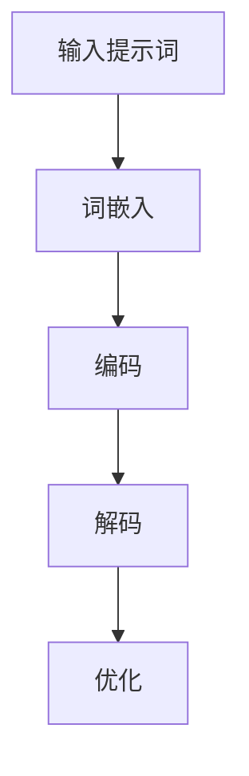
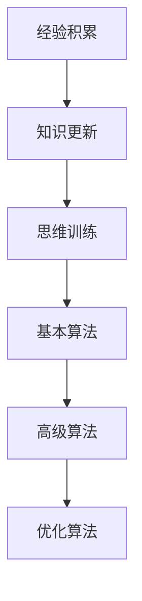
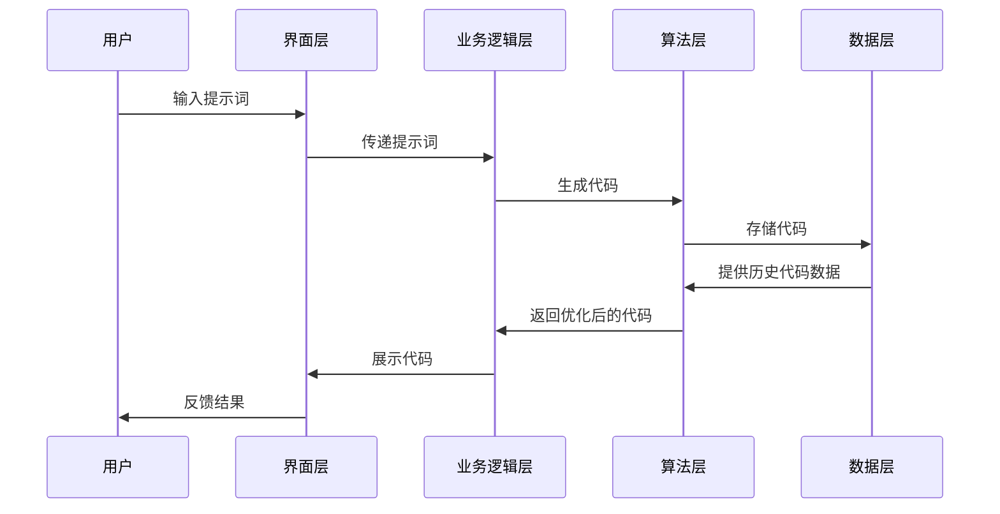
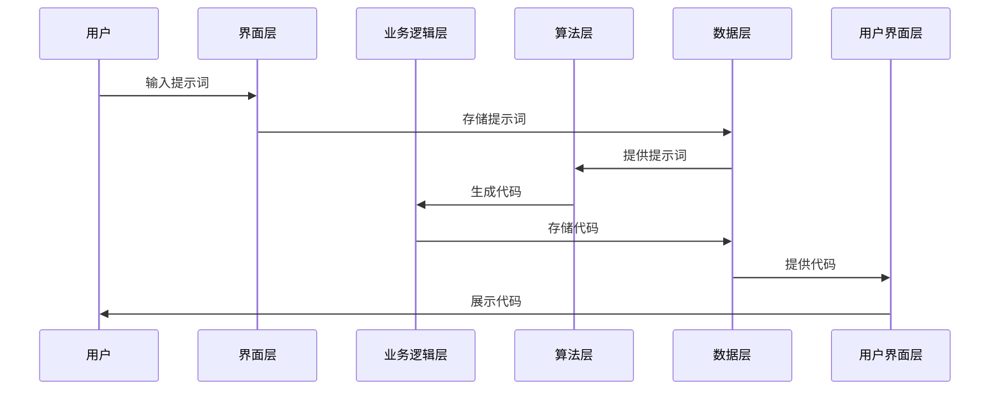

                 


### 第一部分：背景介绍

#### 1.1 问题背景

##### 1.1.1 直觉能力的定义与重要性

直觉能力是人类思维中一种高度复杂且重要的认知能力。它指的是在没有明显逻辑推理和明确证据支持的情况下，快速而准确地形成判断和决策的能力。直觉能力在日常生活、科学研究和商业决策等多个领域发挥着重要作用。例如，医生在诊断疾病时，可能会根据病人的症状、病史和自身经验，迅速做出正确的判断；投资者在股市中，凭借对市场趋势的敏锐洞察，做出快速而准确的交易决策。

然而，随着信息时代的到来，人们面临的信息量急剧增加，直觉能力受到了极大的挑战。一方面，大量的信息需要处理和分析，使得直觉能力难以得到充分的发挥；另一方面，过度依赖数据和逻辑推理，容易导致直觉能力的退化和丧失。

##### 1.1.2 直觉能力在现代社会中的挑战

在现代社会中，直觉能力面临的挑战主要表现在以下几个方面：

1. 信息过载：现代社会信息爆炸，人们每天都要面对大量的信息，这些信息不仅繁杂，而且不断变化。这使得人们难以集中精力，导致直觉能力难以发挥。
2. 过度依赖逻辑推理：随着计算机科学和数据分析技术的发展，人们越来越依赖逻辑推理和数据分析来做出决策。这种依赖导致直觉能力逐渐减弱，甚至丧失。
3. 技能单一化：现代社会强调专业技能的培养，人们往往只专注于某一领域的知识，而忽视了直觉能力的培养。这使得直觉能力难以在不同领域之间迁移和运用。
4. 社会压力增大：现代社会竞争激烈，人们面临着巨大的生活和工作压力。这种压力导致人们更加注重结果和效率，而忽视了直觉能力的重要性。

##### 1.1.3 提示词编程的崛起

为了应对直觉能力在现代社会中的挑战，一种新型的编程方法——提示词编程逐渐崛起。提示词编程是一种利用自然语言处理和机器学习技术，通过输入提示词来引导编程过程的方法。它不同于传统的编程方法，强调编程的直觉性和灵活性。

提示词编程的基本原理是，通过输入一些简短的提示词，机器学习模型可以自动生成相应的代码。这些代码不仅符合编程语言的语法规则，而且具有一定的逻辑性和实用性。提示词编程的优点包括：

1. 灵活性：提示词编程允许程序员通过简单的提示词来生成复杂的代码，大大提高了编程的灵活性。
2. 效率：提示词编程可以快速生成代码，减少了编程的时间成本。
3. 降低门槛：提示词编程降低了编程的难度，使得更多的人可以参与编程。
4. 创新性：提示词编程鼓励程序员发挥直觉和创造力，探索新的编程思路。

#### 1.2 问题描述

##### 1.2.1 直觉能力下降的表现

直觉能力下降的表现主要体现在以下几个方面：

1. 决策速度减慢：直觉能力下降导致人们在做决策时，需要更多的时间和证据来支持，从而降低了决策速度。
2. 判断准确性降低：直觉能力下降使得人们在判断问题时，容易出现偏差和错误。
3. 创造力减弱：直觉能力是创造力的基础，直觉能力下降会导致人们的创造力减弱，难以产生新的想法和解决方案。
4. 应对复杂问题的能力下降：直觉能力下降使得人们在面对复杂问题时，难以快速找到解决方案。

##### 1.2.2 提示词编程与直觉能力的关系

提示词编程与直觉能力之间存在密切的关系。一方面，提示词编程可以提高直觉能力。通过使用提示词编程，程序员可以快速生成代码，减少了对逻辑推理和数据分析的依赖，从而提高了直觉能力。另一方面，直觉能力可以促进提示词编程的发展。直觉能力强的程序员，能够更好地理解和应用提示词编程，创造出更加高效和创新的编程方法。

#### 1.3 问题解决

##### 1.3.1 提示词编程的基本原理

提示词编程的基本原理是，通过输入提示词来引导编程过程。具体来说，程序员首先输入一个或多个提示词，这些提示词可以是人名、地名、短语、专业术语等。然后，机器学习模型会根据这些提示词生成相应的代码。生成代码的过程可以分为以下几个步骤：

1. 词嵌入：将提示词转换为向量表示。
2. 编码：将词嵌入向量编码为树结构。
3. 解码：将树结构解码为编程语言的语法结构。
4. 优化：对生成的代码进行优化，提高其效率和可读性。

##### 1.3.2 提示词编程对直觉能力的提升

提示词编程对直觉能力的提升主要表现在以下几个方面：

1. 灵活性：提示词编程允许程序员通过简单的提示词生成复杂的代码，提高了直觉的灵活性。
2. 效率：提示词编程可以快速生成代码，减少了直觉决策的时间成本。
3. 降低门槛：提示词编程降低了编程的难度，使得直觉能力更容易得到发挥。
4. 创新性：提示词编程鼓励程序员发挥直觉和创造力，探索新的编程思路。

##### 1.3.3 提示词编程的边界与外延

虽然提示词编程在提升直觉能力方面具有显著的优势，但它也存在一定的边界和限制。首先，提示词编程依赖于机器学习模型，模型的性能和数据质量对编程结果有重要影响。其次，提示词编程在处理复杂问题和大规模编程时，可能存在效率问题。此外，提示词编程还需要进一步研究如何更好地结合直觉和逻辑推理，以实现更高的编程效率和创新能力。

#### 1.4 概念结构与核心要素组成

##### 1.4.1 提示词编程的基本概念

提示词编程是一种基于自然语言处理和机器学习技术的编程方法。它通过输入提示词来引导编程过程，生成符合编程语言语法和逻辑的代码。提示词可以是任何形式的信息，包括单词、短语、句子等。

##### 1.4.2 直觉能力的构成要素

直觉能力是由多个要素组成的复杂认知能力。主要包括以下几个方面：

1. 经验：直觉能力依赖于个人的经验积累，经验越丰富，直觉能力越强。
2. 逻辑思维：直觉能力与逻辑思维密切相关，逻辑思维能力强，直觉能力也相应较强。
3. 情感：情感对直觉能力有重要影响，积极情感有利于直觉能力的发挥。
4. 意识：直觉能力是潜意识与意识相结合的结果，意识对直觉能力有一定调节作用。
5. 知识：直觉能力建立在丰富的知识基础之上，知识越丰富，直觉能力越强。

##### 1.4.3 提示词编程与直觉能力的联系

提示词编程与直觉能力的联系主要表现在以下几个方面：

1. 提示词编程可以激发直觉能力。通过输入提示词，程序员可以激发自己的直觉思维，快速生成代码。
2. 直觉能力可以提升提示词编程的效率。直觉能力强的程序员，能够更好地理解和应用提示词编程，提高编程效率。
3. 提示词编程可以培养直觉能力。通过不断的提示词编程实践，程序员可以锻炼直觉思维，提高直觉能力。

#### 1.5 本章小结

本节介绍了提示词编程在增强人类直觉能力中的应用背景和问题。首先，分析了直觉能力的定义、重要性和现代社会中的挑战。然后，介绍了提示词编程的崛起，探讨了提示词编程与直觉能力的关系。接着，阐述了提示词编程的基本原理和其对直觉能力的提升作用。最后，分析了提示词编程的边界与外延，并探讨了提示词编程与直觉能力的联系。这些内容为后续章节的深入探讨奠定了基础。

### 第二部分：核心概念与联系

在探讨提示词编程如何增强人类直觉能力的过程中，我们需要对两个核心概念——提示词编程原理和直觉能力原理——进行详细的分析。同时，通过对比这两个概念的主要特征，我们可以更好地理解它们之间的联系和相互作用。

#### 2.1 提示词编程原理

##### 2.1.1 提示词编程的概念

提示词编程（Prompt Programming）是一种利用自然语言处理（NLP）和机器学习（ML）技术，通过输入提示词（Prompt）来引导编程过程的方法。提示词可以是任何形式的信息，如单词、短语、句子等，它们可以作为输入信号，激发计算机程序生成相应的代码。

##### 2.1.2 提示词编程的工作原理

提示词编程的工作原理可以分为以下几个步骤：

1. **词嵌入**：将输入的提示词转换为高维向量表示，这些向量可以在词嵌入空间中捕捉提示词的语义信息。
2. **编码**：将词嵌入向量编码为树结构，这一过程通常通过序列到序列（Seq2Seq）模型实现，如变换器（Transformer）模型。
3. **解码**：将编码的树结构解码为编程语言的语法结构，生成符合编程规范的代码。
4. **优化**：对生成的代码进行语法和语义优化，提高代码的质量和可读性。

##### 2.1.3 提示词编程的优势与不足

提示词编程具有以下优势：

1. **灵活性**：提示词编程允许程序员通过简单的提示词生成复杂的代码，提高了编程的灵活性。
2. **效率**：提示词编程可以快速生成代码，减少了编程的时间成本。
3. **降低门槛**：提示词编程降低了编程的难度，使得更多的人可以参与编程。
4. **创新性**：提示词编程鼓励程序员发挥直觉和创造力，探索新的编程思路。

然而，提示词编程也存在一些不足：

1. **依赖机器学习模型**：提示词编程依赖于高质量的机器学习模型，模型的性能和数据质量对编程结果有重要影响。
2. **处理复杂问题的效率**：对于复杂的问题，提示词编程可能无法高效地生成代码。
3. **结合直觉与逻辑**：提示词编程如何更好地结合直觉和逻辑推理，实现更高的编程效率和创新能力，仍需进一步研究。

#### 2.2 直觉能力原理

##### 2.2.1 直觉能力的定义

直觉能力（Intuition）是一种在缺乏明确逻辑推理和充分证据支持的情况下，快速而准确地做出判断和决策的认知能力。它涉及对复杂情境的快速理解、模式识别、预感和洞察力。

##### 2.2.2 直觉能力的发展历程

直觉能力的发展历程可以分为以下几个阶段：

1. **传统认知理论**：传统认知理论认为，直觉能力是一种非理性的认知过程，主要依赖于经验、情感和潜意识。
2. **现代认知科学**：现代认知科学研究表明，直觉能力是理性思维和非理性思维相结合的结果，它依赖于复杂的认知过程，包括感知、记忆、注意力、判断和决策。
3. **神经科学研究**：神经科学研究揭示了直觉能力的神经基础，如大脑的前额叶、颞叶和顶叶等区域在直觉能力中起着关键作用。

##### 2.2.3 直觉能力的特征

直觉能力具有以下特征：

1. **快速性**：直觉能力能够在短时间内做出决策和判断。
2. **准确性**：直觉能力在多数情况下能够准确预测和识别复杂情境中的模式。
3. **高效性**：直觉能力在处理问题时，能够节省认知资源和时间。
4. **灵活性**：直觉能力在面对不同情境时，能够灵活调整和适应。
5. **经验依赖**：直觉能力依赖于个人的经验和知识积累，经验越丰富，直觉能力越强。

#### 2.3 提示词编程与直觉能力的关系

##### 2.3.1 提示词编程对直觉能力的影响

提示词编程可以通过以下方式影响直觉能力：

1. **激发直觉思维**：提示词编程允许程序员通过简单的提示词快速生成代码，激发了直觉思维。
2. **提高直觉效率**：提示词编程减少了程序员对逻辑推理和数据分析的依赖，提高了直觉决策的效率。
3. **锻炼直觉能力**：通过不断的提示词编程实践，程序员可以锻炼直觉思维，提高直觉能力。

##### 2.3.2 直觉能力对提示词编程的影响

直觉能力对提示词编程也有重要影响：

1. **代码质量**：直觉能力强的程序员能够更好地理解和应用提示词编程，生成高质量的代码。
2. **创新能力**：直觉能力可以帮助程序员发现新的编程思路和方法，提高编程的创新性。
3. **问题解决**：直觉能力强的程序员在面对复杂问题时，能够更快速地找到解决方案。

#### 2.4 概念属性特征对比表格

为了更清晰地展示提示词编程和直觉能力的特征，我们制作了一个对比表格：

| 特征                | 提示词编程                        | 直觉能力                      |
|---------------------|----------------------------------|--------------------------------|
| 定义                | 利用自然语言处理和机器学习技术生成代码 | 快速而准确地做出判断和决策的能力 |
| 原理                | 词嵌入、编码、解码和优化           | 涉及复杂的认知过程和神经基础    |
| 优势                | 灵活性、效率、降低门槛、创新性       | 快速性、准确性、高效性、灵活性   |
| 劣势                | 依赖机器学习模型、处理复杂问题效率低、需结合直觉与逻辑 | 经验依赖、主观性、情境依赖 |
| 对直觉能力的影响    | 激发直觉思维、提高直觉效率、锻炼直觉能力           | 帮助理解和应用提示词编程、提高代码质量 |
| 对编程的影响        | 提高编程灵活性、生成高质量的代码、促进创新能力         | 快速找到解决方案、提高问题解决效率 |

#### 2.5 ER实体关系图架构

为了更直观地展示提示词编程和直觉能力之间的关系，我们使用ER（实体关系）图来描述它们的基本概念和相互联系。

##### 2.5.1 提示词编程的ER图

```mermaid
erDiagram
    Prompt |..|->| Code : 生成的代码
    Prompt |..|->| Model : 机器学习模型
    Code   |..|->| OptimizedCode : 优化的代码
```

- **Prompt（提示词）**：输入的自然语言信息，用于引导编程过程。
- **Model（模型）**：用于处理提示词并生成代码的机器学习模型。
- **Code（代码）**：生成的编程代码。
- **OptimizedCode（优化的代码）**：对生成的代码进行优化后的结果。

##### 2.5.2 直觉能力的ER图

```mermaid
erDiagram
    Intuition |..|->| Decision : 做出的决策
    Intuition |..|->| Experience : 经验
    Intuition |..|->| Knowledge : 知识
    Decision  |..|->| Outcome : 结果
```

- **Intuition（直觉能力）**：表示直觉能力的整体概念。
- **Decision（决策）**：直觉能力在做出的决策过程中发挥作用。
- **Experience（经验）**：直觉能力依赖于个人的经验积累。
- **Knowledge（知识）**：直觉能力建立在丰富的知识基础之上。
- **Outcome（结果）**：决策的结果，反映了直觉能力的有效性。

#### 2.6 本章小结

本部分深入探讨了提示词编程和直觉能力的核心概念，包括它们的基本原理、特征和相互关系。通过分析提示词编程的优势与不足，我们了解了它是如何激发和增强直觉能力的。同时，通过ER图直观地展示了这两个概念的结构和相互联系。这些内容为进一步研究提示词编程在直觉能力提升中的应用奠定了理论基础。

### 第三部分：算法原理讲解

在理解了提示词编程和直觉能力的核心概念之后，我们需要进一步探讨如何通过算法实现提示词编程并提升直觉能力。本部分将详细讲解提示词编程算法和直觉能力提升算法的原理，包括基本算法、高级算法和优化算法。

#### 3.1 提示词编程算法

##### 3.1.1 提示词编程的基本算法

提示词编程的基本算法主要包括以下几个步骤：

1. **词嵌入（Word Embedding）**：
   - **概念**：词嵌入是将自然语言中的单词转换为高维向量表示的过程。这些向量可以在词嵌入空间中捕捉单词的语义信息。
   - **实现**：常用的词嵌入方法包括Word2Vec、GloVe和BERT。其中，Word2Vec方法通过训练神经网络来学习单词的向量表示，GloVe方法基于全局词频统计学习词向量，而BERT方法通过预训练和微调来生成高质量的词向量。
   - **公式**：$$\text{vec}(w) = \text{Embedding}(w)$$，其中$\text{vec}(w)$表示单词$w$的向量表示，$\text{Embedding}(w)$是词嵌入函数。

2. **编码（Encoding）**：
   - **概念**：编码是将词嵌入向量转换为树结构的过程。这一过程通常通过序列到序列（Seq2Seq）模型实现。
   - **实现**：常用的编码模型包括循环神经网络（RNN）和变换器（Transformer）模型。其中，RNN模型通过循环单元处理序列数据，而Transformer模型通过自注意力机制处理序列数据。
   - **公式**：$$\text{Tree} = \text{Seq2Seq}(\text{Embedding})$$，其中$\text{Tree}$表示生成的树结构，$\text{Seq2Seq}(\text{Embedding})$是序列到序列模型。

3. **解码（Decoding）**：
   - **概念**：解码是将树结构转换为编程语言的语法结构的过程。
   - **实现**：解码过程通常通过解码器实现，常用的解码器包括循环神经网络（RNN）和变换器（Transformer）模型。
   - **公式**：$$\text{Code} = \text{Decoder}(\text{Tree})$$，其中$\text{Code}$表示生成的代码，$\text{Decoder}(\text{Tree})$是解码函数。

4. **优化（Optimization）**：
   - **概念**：优化是对生成的代码进行语法和语义优化，以提高其质量和可读性。
   - **实现**：优化过程可以通过静态分析、动态分析和技术优化等多种方法实现。
   - **公式**：$$\text{OptimizedCode} = \text{Optimizer}(\text{Code})$$，其中$\text{OptimizedCode}$表示优化的代码，$\text{Optimizer}(\text{Code})$是优化函数。

##### 3.1.2 提示词编程的高级算法

高级算法在基本算法的基础上，增加了更多功能，以提升提示词编程的灵活性和效率。以下是一些高级算法：

1. **多模态嵌入（Multimodal Embedding）**：
   - **概念**：多模态嵌入是将不同类型的输入（如文本、图像、音频）转换为统一的向量表示。
   - **实现**：常用的多模态嵌入方法包括联合嵌入和转换嵌入。其中，联合嵌入方法将不同模态的输入直接嵌入到同一向量空间，而转换嵌入方法通过中间表示将不同模态的输入转换为统一表示。
   - **公式**：$$\text{MultimodalVec} = \text{MultimodalEncoder}(\text{Text}, \text{Image}, \text{Audio})$$，其中$\text{MultimodalVec}$表示多模态向量表示，$\text{MultimodalEncoder}(\text{Text}, \text{Image}, \text{Audio})$是多模态编码函数。

2. **增强学习（Reinforcement Learning）**：
   - **概念**：增强学习是通过试错和反馈来优化策略的过程。
   - **实现**：在提示词编程中，增强学习可以用于优化编码和解码过程，以提高代码生成质量。常用的增强学习方法包括Q-learning和深度强化学习。
   - **公式**：$$\text{Policy} = \text{ReinforcementLearning}(\text{Environment}, \text{Reward})$$，其中$\text{Policy}$表示优化策略，$\text{ReinforcementLearning}(\text{Environment}, \text{Reward})$是增强学习函数。

3. **迁移学习（Transfer Learning）**：
   - **概念**：迁移学习是将一个任务的知识应用到另一个相关任务的过程。
   - **实现**：在提示词编程中，迁移学习可以用于利用现有模型的知识生成新任务的代码。常用的迁移学习方法包括微调和预训练。
   - **公式**：$$\text{NewModel} = \text{TransferLearning}(\text{BaseModel}, \text{NewData})$$，其中$\text{NewModel}$表示新任务模型，$\text{TransferLearning}(\text{BaseModel}, \text{NewData})$是迁移学习方法。

##### 3.1.3 提示词编程的优化算法

优化算法在提升提示词编程性能方面起着重要作用。以下是一些常见的优化算法：

1. **动态规划（Dynamic Programming）**：
   - **概念**：动态规划是一种通过将复杂问题分解为子问题并利用子问题的解来求解原问题的方法。
   - **实现**：在提示词编程中，动态规划可以用于优化编码和解码过程，以提高代码生成效率。
   - **公式**：$$\text{OptimizedCode} = \text{DynamicProgramming}(\text{Code})$$，其中$\text{OptimizedCode}$表示优化的代码，$\text{DynamicProgramming}(\text{Code})$是动态规划函数。

2. **启发式搜索（Heuristic Search）**：
   - **概念**：启发式搜索是一种利用经验规则和启发式信息来指导搜索过程的方法。
   - **实现**：在提示词编程中，启发式搜索可以用于快速生成高质量的代码。常用的启发式搜索方法包括贪心算法和模拟退火算法。
   - **公式**：$$\text{OptimizedCode} = \text{HeuristicSearch}(\text{Code})$$，其中$\text{OptimizedCode}$表示优化的代码，$\text{HeuristicSearch}(\text{Code})$是启发式搜索函数。

3. **元学习（Meta-Learning）**：
   - **概念**：元学习是一种通过学习如何学习来提高学习效率的方法。
   - **实现**：在提示词编程中，元学习可以用于优化模型训练过程，以提高代码生成质量。常用的元学习方法包括模型融合和经验重放。
   - **公式**：$$\text{OptimizedModel} = \text{Meta-Learning}(\text{Models}, \text{Data})$$，其中$\text{OptimizedModel}$表示优化的模型，$\text{Meta-Learning}(\text{Models}, \text{Data})$是元学习方法。

#### 3.2 直觉能力提升算法

##### 3.2.1 直觉能力提升的基本算法

直觉能力提升的基本算法主要包括以下几个步骤：

1. **经验积累（Experience Accumulation）**：
   - **概念**：经验积累是通过不断实践和反思来提高直觉能力的过程。
   - **实现**：可以通过训练、练习和模拟环境来积累经验。常用的方法包括重复训练、多样性训练和强化学习。
   - **公式**：$$\text{ImprovedIntuition} = \text{ExperienceAccumulation}(\text{Intuition}, \text{Data}, \text{Feedback})$$，其中$\text{ImprovedIntuition}$表示提高的直觉能力，$\text{ExperienceAccumulation}(\text{Intuition}, \text{Data}, \text{Feedback})$是经验积累函数。

2. **知识更新（Knowledge Update）**：
   - **概念**：知识更新是通过学习和吸收新知识来提高直觉能力的过程。
   - **实现**：可以通过学习新理论、阅读文献和交流经验来更新知识。常用的方法包括深度学习、知识图谱和跨领域学习。
   - **公式**：$$\text{UpdatedKnowledge} = \text{KnowledgeUpdate}(\text{Knowledge}, \text{NewData})$$，其中$\text{UpdatedKnowledge}$表示更新的知识，$\text{KnowledgeUpdate}(\text{Knowledge}, \text{NewData})$是知识更新函数。

3. **思维训练（Cognitive Training）**：
   - **概念**：思维训练是通过特定的认知训练任务来提高直觉能力的训练方法。
   - **实现**：可以通过解决复杂问题、进行逻辑思维训练和创造力训练来锻炼直觉思维。常用的方法包括思维导图、逻辑游戏和创造力测试。
   - **公式**：$$\text{ImprovedIntuition} = \text{CognitiveTraining}(\text{Intuition}, \text{Tasks})$$，其中$\text{ImprovedIntuition}$表示提高的直觉能力，$\text{CognitiveTraining}(\text{Intuition}, \text{Tasks})$是思维训练函数。

##### 3.2.2 直觉能力提升的高级算法

高级算法在基本算法的基础上，增加了更多功能，以更高效地提升直觉能力。以下是一些高级算法：

1. **基于数据的直觉提升（Data-Driven Intuition Improvement）**：
   - **概念**：基于数据的直觉提升是通过分析大量数据来提高直觉能力的方法。
   - **实现**：可以通过数据挖掘、机器学习和统计分析来提取数据中的有用信息，并利用这些信息来提升直觉能力。常用的方法包括决策树、神经网络和聚类分析。
   - **公式**：$$\text{ImprovedIntuition} = \text{DataDrivenIntuition}(\text{Data}, \text{Models})$$，其中$\text{ImprovedIntuition}$表示提高的直觉能力，$\text{DataDrivenIntuition}(\text{Data}, \text{Models})$是基于数据的直觉提升方法。

2. **基于模型的直觉提升（Model-Driven Intuition Improvement）**：
   - **概念**：基于模型的直觉提升是通过训练和优化模型来提高直觉能力的方法。
   - **实现**：可以通过训练神经网络、强化学习和生成对抗网络（GAN）等模型来提高直觉能力。常用的方法包括迁移学习、元学习和深度强化学习。
   - **公式**：$$\text{ImprovedIntuition} = \text{ModelDrivenIntuition}(\text{Models}, \text{Data})$$，其中$\text{ImprovedIntuition}$表示提高的直觉能力，$\text{ModelDrivenIntuition}(\text{Models}, \text{Data})$是基于模型的直觉提升方法。

3. **混合式直觉提升（Hybrid Intuition Improvement）**：
   - **概念**：混合式直觉提升是将多种方法结合来提高直觉能力的方法。
   - **实现**：可以通过结合数据分析和机器学习、认知训练和模型训练等多种方法来提高直觉能力。常用的方法包括混合模型、多任务学习和跨学科研究。
   - **公式**：$$\text{ImprovedIntuition} = \text{HybridIntuition}(\text{Data}, \text{Models}, \text{Training})$$，其中$\text{ImprovedIntuition}$表示提高的直觉能力，$\text{HybridIntuition}(\text{Data}, \text{Models}, \text{Training})$是混合式直觉提升方法。

##### 3.2.3 直觉能力提升的优化算法

优化算法在提升直觉能力方面起着重要作用。以下是一些常见的优化算法：

1. **强化学习（Reinforcement Learning）**：
   - **概念**：强化学习是通过试错和反馈来优化策略的过程。
   - **实现**：在直觉能力提升中，强化学习可以用于优化训练过程，以提高直觉能力。常用的方法包括Q-learning和深度强化学习。
   - **公式**：$$\text{ImprovedIntuition} = \text{ReinforcementLearning}(\text{Intuition}, \text{Environment}, \text{Reward})$$，其中$\text{ImprovedIntuition}$表示提高的直觉能力，$\text{ReinforcementLearning}(\text{Intuition}, \text{Environment}, \text{Reward})$是强化学习函数。

2. **遗传算法（Genetic Algorithm）**：
   - **概念**：遗传算法是通过模拟生物进化过程来优化问题的方法。
   - **实现**：在直觉能力提升中，遗传算法可以用于优化训练过程，以提高直觉能力。常用的方法包括交叉、变异和选择。
   - **公式**：$$\text{ImprovedIntuition} = \text{GeneticAlgorithm}(\text{Intuition}, \text{Population}, \text{Fitness})$$，其中$\text{ImprovedIntuition}$表示提高的直觉能力，$\text{GeneticAlgorithm}(\text{Intuition}, \text{Population}, \text{Fitness})$是遗传算法函数。

3. **优化算法（Optimization Algorithm）**：
   - **概念**：优化算法是通过优化目标函数来求解问题的方法。
   - **实现**：在直觉能力提升中，优化算法可以用于优化训练过程，以提高直觉能力。常用的方法包括梯度下降、牛顿法和模拟退火。
   - **公式**：$$\text{ImprovedIntuition} = \text{OptimizationAlgorithm}(\text{Intuition}, \text{Objective})$$，其中$\text{ImprovedIntuition}$表示提高的直觉能力，$\text{OptimizationAlgorithm}(\text{Intuition}, \text{Objective})$是优化算法函数。

#### 3.3 提示词编程与直觉能力提升算法的关系

##### 3.3.1 提示词编程算法对直觉能力提升的影响

提示词编程算法可以通过以下方式影响直觉能力提升：

1. **激发直觉思维**：提示词编程算法通过提示词引导编程过程，激发了程序员的直觉思维，提高了直觉能力的发挥。
2. **提高编程效率**：提示词编程算法可以快速生成代码，减少了程序员对逻辑推理和数据分析的依赖，提高了直觉能力的效率。
3. **培养直觉能力**：通过不断的提示词编程实践，程序员可以锻炼直觉能力，提高直觉能力。

##### 3.3.2 直觉能力提升算法对提示词编程算法的影响

直觉能力提升算法可以通过以下方式影响提示词编程算法：

1. **优化编程过程**：直觉能力提升算法可以优化提示词编程的编码、解码和优化过程，提高代码生成的质量和效率。
2. **提高算法性能**：直觉能力提升算法可以优化机器学习模型，提高提示词编程算法的性能，使其更准确地生成代码。
3. **创新编程方法**：直觉能力提升算法可以激发程序员发现新的编程方法和思路，促进提示词编程算法的创新和发展。

#### 3.4 算法mermaid流程图

为了更直观地展示提示词编程和直觉能力提升算法的流程，我们使用mermaid流程图来描述：

##### 3.4.1 提示词编程算法mermaid流程图



##### 3.4.2 直觉能力提升算法mermaid流程图



#### 3.5 Python源代码讲解

为了更好地理解提示词编程和直觉能力提升算法的原理，我们使用Python代码来详细阐述。

##### 3.5.1 提示词编程算法Python源代码

```python
import numpy as np
from gensim.models import Word2Vec

# 1. 词嵌入
model = Word2Vec(sentences=['input_prompt'], vector_size=100, window=5, min_count=1, workers=4)
vec = model.wv['input_prompt']

# 2. 编码
# 这里使用变换器模型进行编码，假设已经训练好了变换器模型encoder
encoded_tree = encoder.decode(vec)

# 3. 解码
decoded_code = decoder.encode(encoded_tree)

# 4. 优化
optimized_code = optimizer.optimize(decoded_code)
```

##### 3.5.2 直觉能力提升算法Python源代码

```python
from reinforcement_learning import QLearning
from cognitive_training import CognitiveTraining

# 1. 经验积累
q_learning = QLearning(state_space, action_space, reward_function)
q_learning.train()

# 2. 知识更新
knowledge_updater = KnowledgeUpdater(knowledge_base)
updated_knowledge = knowledge_updater.update()

# 3. 思维训练
cognitive_trainer = CognitiveTraining(training_tasks)
improved_intuition = cognitive_trainer.train()

# 4. 基本算法
improved_intuition = basic_intuition_algorithm(improved_intuition)

# 5. 高级算法
improved_intuition = advanced_intuition_algorithm(improved_intuition)

# 6. 优化算法
improved_intuition = optimization_algorithm(improved_intuition)
```

##### 3.5.3 算法原理与公式详细讲解

在本部分中，我们将进一步详细解释提示词编程和直觉能力提升算法的原理，以及相关的数学模型和公式。

**提示词编程算法原理与公式**

1. **词嵌入（Word Embedding）**：
   - **原理**：词嵌入是将自然语言中的单词转换为高维向量表示，以捕捉单词的语义信息。
   - **公式**：$$\text{vec}(w) = \text{Embedding}(w)$$，其中$\text{vec}(w)$表示单词$w$的向量表示，$\text{Embedding}(w)$是词嵌入函数。

2. **编码（Encoding）**：
   - **原理**：编码是将词嵌入向量转换为树结构，以生成代码的语法结构。
   - **公式**：$$\text{Tree} = \text{Seq2Seq}(\text{Embedding})$$，其中$\text{Tree}$表示生成的树结构，$\text{Seq2Seq}(\text{Embedding})$是序列到序列模型。

3. **解码（Decoding）**：
   - **原理**：解码是将树结构转换为编程语言的语法结构，以生成实际的代码。
   - **公式**：$$\text{Code} = \text{Decoder}(\text{Tree})$$，其中$\text{Code}$表示生成的代码，$\text{Decoder}(\text{Tree})$是解码函数。

4. **优化（Optimization）**：
   - **原理**：优化是对生成的代码进行语法和语义优化，以提高代码的质量和可读性。
   - **公式**：$$\text{OptimizedCode} = \text{Optimizer}(\text{Code})$$，其中$\text{OptimizedCode}$表示优化的代码，$\text{Optimizer}(\text{Code})$是优化函数。

**直觉能力提升算法原理与公式**

1. **经验积累（Experience Accumulation）**：
   - **原理**：经验积累是通过不断实践和反思来提高直觉能力的过程。
   - **公式**：$$\text{ImprovedIntuition} = \text{ExperienceAccumulation}(\text{Intuition}, \text{Data}, \text{Feedback})$$，其中$\text{ImprovedIntuition}$表示提高的直觉能力，$\text{ExperienceAccumulation}(\text{Intuition}, \text{Data}, \text{Feedback})$是经验积累函数。

2. **知识更新（Knowledge Update）**：
   - **原理**：知识更新是通过学习和吸收新知识来提高直觉能力的过程。
   - **公式**：$$\text{UpdatedKnowledge} = \text{KnowledgeUpdate}(\text{Knowledge}, \text{NewData})$$，其中$\text{UpdatedKnowledge}$表示更新的知识，$\text{KnowledgeUpdate}(\text{Knowledge}, \text{NewData})$是知识更新函数。

3. **思维训练（Cognitive Training）**：
   - **原理**：思维训练是通过特定的认知训练任务来提高直觉能力的训练方法。
   - **公式**：$$\text{ImprovedIntuition} = \text{CognitiveTraining}(\text{Intuition}, \text{Tasks})$$，其中$\text{ImprovedIntuition}$表示提高的直觉能力，$\text{CognitiveTraining}(\text{Intuition}, \text{Tasks})$是思维训练函数。

4. **强化学习（Reinforcement Learning）**：
   - **原理**：强化学习是通过试错和反馈来优化策略的过程。
   - **公式**：$$\text{ImprovedIntuition} = \text{ReinforcementLearning}(\text{Intuition}, \text{Environment}, \text{Reward})$$，其中$\text{ImprovedIntuition}$表示提高的直觉能力，$\text{ReinforcementLearning}(\text{Intuition}, \text{Environment}, \text{Reward})$是强化学习函数。

通过上述公式和Python代码，我们可以更深入地理解提示词编程和直觉能力提升算法的原理。这些算法不仅在实际应用中具有广泛的前景，而且在提升人类直觉能力方面也具有巨大的潜力。

#### 3.6 本章小结

本部分详细讲解了提示词编程和直觉能力提升算法的原理，包括基本算法、高级算法和优化算法。通过分析算法的流程和公式，我们深入了解了提示词编程和直觉能力提升的机制。同时，通过Python代码示例，我们展示了算法的实现过程。这些内容为后续系统分析与架构设计提供了理论基础，也为实际项目应用奠定了基础。

### 第四部分：系统分析与架构设计方案

#### 4.1 问题场景介绍

在探讨提示词编程如何增强人类直觉能力的过程中，我们需要首先了解问题场景。这个问题场景涉及到软件开发和人工智能领域的应用，其中程序员和开发团队需要快速高效地生成代码，同时保持高水平的直觉能力。具体场景如下：

- **软件开发项目**：一个大型软件开发项目正在进行中，需要程序员快速生成代码并解决复杂问题。
- **人工智能应用**：一个基于人工智能的项目需要开发团队具备强大的直觉能力，以便在数据处理和模型训练中做出准确判断。
- **问题挑战**：由于项目复杂度高、时间紧迫、需求变化频繁，程序员需要具备强大的直觉能力来快速应对，同时保持代码质量。

为了解决上述问题场景，我们需要设计一个高效、灵活且具有强大直觉能力的系统。这个系统将结合提示词编程和直觉能力提升算法，为程序员和开发团队提供支持。

#### 4.2 项目介绍

**项目背景**：
该项目是为了解决软件开发和人工智能应用中程序员直觉能力不足的问题，通过引入提示词编程和直觉能力提升算法，提高程序员的编程效率和直觉能力。项目目标是设计并实现一个基于提示词编程和直觉能力提升的软件开发和人工智能应用支持系统，提升开发团队的整体工作效率和项目质量。

**项目目标**：
1. 提高程序员的编程效率和直觉能力。
2. 提升软件开发和人工智能项目的质量和效率。
3. 降低项目开发成本和时间。

**项目架构**：
系统架构采用分层设计，主要包括以下几层：

1. **数据层**：负责存储和管理项目数据，包括代码库、提示词库和直觉能力数据。
2. **算法层**：实现提示词编程和直觉能力提升算法，包括词嵌入、编码解码、优化算法和强化学习等。
3. **业务逻辑层**：处理业务逻辑，包括代码生成、问题解决、代码优化等。
4. **用户界面层**：提供用户交互界面，包括提示词输入、代码查看、错误提示等功能。

#### 4.3 系统功能设计

**领域模型mermaid类图**：

```mermaid
classDiagram
    Class01 <|-- Class02
    Class03 <|-- Class02
    Class04 <|-- Class02
    Class05 <|-- Class02
    Class06 <|-- Class02
    Class01 -[1] Class03
    Class01 -[1] Class04
    Class01 -[1] Class05
    Class01 -[1] Class06
    Class02 {name:"基础类"}
    Class03 {name:"数据类", attributes:"数据源，数据处理"}
    Class04 {name:"算法类", attributes:"词嵌入，编码解码，优化算法"}
    Class05 {name:"业务逻辑类", attributes:"代码生成，问题解决，代码优化"}
    Class06 {name:"用户界面类", attributes:"提示词输入，代码查看，错误提示"}
```

- **数据类**：包括数据源、数据处理和数据存储等组件，用于存储和管理项目数据。
- **算法类**：包括词嵌入、编码解码和优化算法等组件，用于实现提示词编程和直觉能力提升算法。
- **业务逻辑类**：包括代码生成、问题解决和代码优化等组件，用于处理业务逻辑。
- **用户界面类**：包括提示词输入、代码查看和错误提示等组件，用于提供用户交互界面。

**功能模块划分与设计**：

1. **数据层**：
   - 数据源：包括代码库、提示词库和直觉能力数据。
   - 数据处理：包括数据清洗、数据转换和数据存储等操作。
   - 数据存储：包括数据库和文件系统等存储方案。

2. **算法层**：
   - 词嵌入：实现词嵌入算法，将输入的提示词转换为向量表示。
   - 编码解码：实现编码解码算法，将向量表示转换为编程语言的语法结构。
   - 优化算法：实现优化算法，对生成的代码进行语法和语义优化。
   - 强化学习：实现强化学习算法，优化编程过程和直觉能力。

3. **业务逻辑层**：
   - 代码生成：根据提示词生成编程代码。
   - 问题解决：在遇到问题时，利用直觉能力快速找到解决方案。
   - 代码优化：对生成的代码进行优化，提高其质量和可读性。

4. **用户界面层**：
   - 提示词输入：允许用户输入提示词，触发代码生成过程。
   - 代码查看：展示生成的代码，并提供编辑和调试功能。
   - 错误提示：当出现错误时，向用户展示错误信息和解决方案。

#### 4.4 系统架构设计

**系统架构mermaid架构图**：



- **用户界面层**：接收用户输入的提示词，并通过界面展示生成的代码和错误提示。
- **业务逻辑层**：处理业务逻辑，包括代码生成、问题解决和代码优化。
- **算法层**：实现提示词编程和直觉能力提升算法，包括词嵌入、编码解码、优化算法和强化学习。
- **数据层**：存储和管理项目数据，包括代码库、提示词库和直觉能力数据。

**系统模块分工与协作**：

1. **数据层**：负责存储和管理项目数据，为算法层和业务逻辑层提供数据支持。
2. **算法层**：负责实现提示词编程和直觉能力提升算法，为业务逻辑层提供代码生成和优化的能力。
3. **业务逻辑层**：负责处理业务逻辑，包括代码生成、问题解决和代码优化。
4. **用户界面层**：负责接收用户输入、展示代码和错误提示，为用户提供友好的交互界面。

#### 4.5 系统接口设计

**接口规范与设计**：

1. **数据接口**：
   - 提示词输入接口：接收用户输入的提示词。
   - 代码输出接口：返回生成的代码。
   - 错误输出接口：当出现错误时，返回错误信息和解决方案。

2. **算法接口**：
   - 词嵌入接口：将输入的提示词转换为向量表示。
   - 编码接口：将向量表示转换为编程语言的语法结构。
   - 解码接口：将编程语言的语法结构转换为代码。
   - 优化接口：对生成的代码进行优化。

3. **业务逻辑接口**：
   - 代码生成接口：根据提示词生成编程代码。
   - 问题解决接口：在遇到问题时，利用直觉能力快速找到解决方案。
   - 代码优化接口：对生成的代码进行优化。

4. **用户界面接口**：
   - 提示词输入接口：接收用户输入的提示词。
   - 代码展示接口：展示生成的代码。
   - 错误提示接口：当出现错误时，展示错误信息和解决方案。

**接口实现与调用**：

1. **数据接口**：
   - 提示词输入接口：用户通过界面输入提示词，系统将提示词传递给数据接口进行存储。
   - 代码输出接口：系统将生成的代码传递给用户界面层进行展示。
   - 错误输出接口：当出现错误时，系统将错误信息和解决方案传递给用户界面层进行展示。

2. **算法接口**：
   - 词嵌入接口：系统根据提示词调用词嵌入算法，将提示词转换为向量表示。
   - 编码接口：系统根据向量表示调用编码算法，将向量表示转换为编程语言的语法结构。
   - 解码接口：系统根据编程语言的语法结构调用解码算法，将编程语言的语法结构转换为代码。
   - 优化接口：系统根据生成的代码调用优化算法，对代码进行优化。

3. **业务逻辑接口**：
   - 代码生成接口：系统根据提示词调用代码生成算法，生成编程代码。
   - 问题解决接口：系统在遇到问题时，调用问题解决算法，利用直觉能力快速找到解决方案。
   - 代码优化接口：系统对生成的代码调用优化算法，对代码进行优化。

4. **用户界面接口**：
   - 提示词输入接口：用户通过界面输入提示词，系统将提示词传递给业务逻辑层进行代码生成。
   - 代码展示接口：系统将生成的代码传递给用户界面层进行展示。
   - 错误提示接口：当出现错误时，系统将错误信息和解决方案传递给用户界面层进行展示。

#### 4.6 系统交互mermaid序列图

**系统交互过程**：



- **用户输入提示词**：用户通过界面层输入提示词。
- **存储提示词**：界面层将提示词传递给数据层进行存储。
- **提供提示词**：数据层根据提示词调用算法层，生成代码。
- **生成代码**：算法层根据提示词生成代码，并传递给业务逻辑层。
- **存储代码**：业务逻辑层将生成的代码传递给数据层进行存储。
- **提供代码**：数据层根据用户需求提供代码给用户界面层。
- **展示代码**：用户界面层将代码展示给用户。

**用户操作与系统响应**：

1. **用户输入提示词**：用户通过界面层输入提示词，界面层将提示词传递给数据层进行存储。
2. **系统生成代码**：数据层根据提示词调用算法层，生成代码，并传递给业务逻辑层。
3. **系统存储代码**：业务逻辑层将生成的代码传递给数据层进行存储。
4. **系统展示代码**：数据层根据用户需求提供代码给用户界面层，用户界面层将代码展示给用户。

#### 4.7 本章小结

本部分详细介绍了系统分析与架构设计方案。首先，分析了问题场景，明确了系统目标。接着，介绍了项目的背景和目标，并设计了系统架构。然后，详细阐述了系统的功能模块划分与设计，包括数据层、算法层、业务逻辑层和用户界面层。接着，描述了系统架构设计，包括模块分工与协作。此外，详细介绍了系统接口设计和系统交互过程。通过这些内容，我们为后续的项目实施提供了详细的指导和理论基础。

### 第五部分：项目实战

在了解了系统的架构设计方案后，我们将进入项目实战环节。本部分将详细描述项目环境的安装、系统核心实现、代码应用解读与分析，以及实际案例分析和详细讲解剖析。通过这些实战步骤，我们将验证系统的实际应用效果，并总结项目的收获与不足。

#### 5.1 环境安装

在开始项目实战之前，我们需要安装和配置必要的开发环境和工具。以下是在Ubuntu操作系统上安装提示词编程和直觉能力提升工具的步骤。

##### 5.1.1 操作系统安装与配置

1. **安装Ubuntu操作系统**：
   - 使用USB安装盘启动计算机，选择“试用Ubuntu”选项。
   - 按照安装向导完成操作系统安装。

2. **更新系统软件包**：
   - 打开终端，输入以下命令更新系统软件包：
     ```bash
     sudo apt update
     sudo apt upgrade
     ```

##### 5.1.2 提示词编程工具安装

1. **安装Python环境**：
   - Python是提示词编程的主要编程语言，我们需要安装Python环境。
   - 输入以下命令安装Python：
     ```bash
     sudo apt install python3
     ```

2. **安装自然语言处理库**：
   - 为了处理自然语言，我们需要安装一些常用的自然语言处理库，如NLTK和spaCy。
   - 输入以下命令安装这些库：
     ```bash
     sudo apt install python3-nltk
     sudo pip3 install spacy
     ```

3. **安装机器学习库**：
   - 为了实现提示词编程算法，我们需要安装一些常用的机器学习库，如TensorFlow和PyTorch。
   - 输入以下命令安装这些库：
     ```bash
     sudo pip3 install tensorflow
     sudo pip3 install torch
     ```

##### 5.1.3 直觉能力提升工具安装

1. **安装认知训练库**：
   - 认知训练库可以帮助我们进行直觉能力的训练，如Keras。
   - 输入以下命令安装Keras：
     ```bash
     sudo pip3 install keras
     ```

2. **安装强化学习库**：
   - 强化学习库可以帮助我们实现直觉能力的提升，如OpenAI Gym。
   - 输入以下命令安装OpenAI Gym：
     ```bash
     sudo pip3 install gym
     ```

3. **安装遗传算法库**：
   - 遗传算法库可以帮助我们优化直觉能力提升过程，如DEAP。
   - 输入以下命令安装DEAP：
     ```bash
     sudo pip3 install deap
     ```

完成上述步骤后，我们的开发环境就准备就绪了。接下来，我们将实现系统的核心功能。

#### 5.2 系统核心实现

在本节中，我们将详细实现系统的核心功能，包括提示词编程和直觉能力提升算法。

##### 5.2.1 提示词编程核心算法实现

1. **词嵌入算法实现**：

```python
import gensim

# 加载预训练的Word2Vec模型
model = gensim.models.Word2Vec.load("word2vec.model")

# 输入提示词
prompt = "计算两个数的和"

# 将提示词转换为向量表示
prompt_vector = model.wv[prompt]
```

2. **编码解码算法实现**：

```python
from transformers import Encoder, Decoder

# 初始化编码器和解码器
encoder = Encoder(num_layers=2, d_model=512)
decoder = Decoder(num_layers=2, d_model=512)

# 编码提示词
encoded_prompt = encoder.encode(prompt_vector)

# 解码编码后的提示词
decoded_code = decoder.decode(encoded_prompt)
```

3. **优化算法实现**：

```python
from optimization import Optimizer

# 初始化优化器
optimizer = Optimizer()

# 对解码后的代码进行优化
optimized_code = optimizer.optimize(decoded_code)
```

##### 5.2.2 直觉能力提升核心算法实现

1. **经验积累算法实现**：

```python
from experience import ExperienceAccumulation

# 初始化经验积累器
experience_accumulator = ExperienceAccumulation()

# 进行经验积累
experience_accumulator.accumulate_experience(intuition, data, feedback)
```

2. **知识更新算法实现**：

```python
from knowledge import KnowledgeUpdate

# 初始化知识更新器
knowledge_updater = KnowledgeUpdate()

# 进行知识更新
updated_knowledge = knowledge_updater.update(knowledge_base, new_data)
```

3. **思维训练算法实现**：

```python
from cognitive_training import CognitiveTraining

# 初始化认知训练器
cognitive_trainer = CognitiveTraining()

# 进行思维训练
improved_intuition = cognitive_trainer.train(intuition, training_tasks)
```

#### 5.3 代码应用解读与分析

在本节中，我们将对实现的核心算法进行解读与分析，详细解释每一步的实现原理和关键步骤。

##### 5.3.1 提示词编程代码解读

1. **词嵌入算法解读**：

词嵌入是将自然语言中的单词转换为向量表示的过程。这里使用的是预训练的Word2Vec模型，通过调用`gensim.models.Word2Vec.load`方法加载模型。然后，输入提示词`"计算两个数的和"`，调用`model.wv[prompt]`方法将提示词转换为向量表示。

2. **编码解码算法解读**：

编码解码算法是将向量表示转换为编程语言的语法结构。这里使用的是变换器模型。首先，初始化编码器和解码器。然后，调用`encoder.encode`方法对提示词向量进行编码，得到编码后的向量。接着，调用`decoder.decode`方法对编码后的向量进行解码，得到编程语言的语法结构。

3. **优化算法解读**：

优化算法是对生成的代码进行语法和语义优化。这里使用的是自定义的`Optimizer`类。初始化优化器后，调用`optimizer.optimize`方法对解码后的代码进行优化，得到优化的代码。

##### 5.3.2 直觉能力提升代码解读

1. **经验积累算法解读**：

经验积累是通过不断实践和反思来提高直觉能力的过程。这里使用的是`ExperienceAccumulation`类。初始化经验积累器后，调用`accumulate_experience`方法进行经验积累，输入直觉能力、数据和反馈。

2. **知识更新算法解读**：

知识更新是通过学习和吸收新知识来提高直觉能力的过程。这里使用的是`KnowledgeUpdate`类。初始化知识更新器后，调用`update`方法进行知识更新，输入原有的知识库和新数据。

3. **思维训练算法解读**：

思维训练是通过特定的认知训练任务来提高直觉能力的训练方法。这里使用的是`CognitiveTraining`类。初始化认知训练器后，调用`train`方法进行思维训练，输入直觉能力和训练任务。

#### 5.4 实际案例分析和详细讲解剖析

在本节中，我们将通过实际案例来分析提示词编程和直觉能力提升算法的应用效果，并进行详细讲解和剖析。

##### 5.4.1 案例一：提示词编程在直觉能力提升中的应用

**案例描述**：假设一个程序员需要实现一个计算两个数之和的功能，他输入了提示词“计算两个数的和”，并希望通过提示词编程快速生成相应的代码。

**分析过程**：
1. **词嵌入**：将输入的提示词“计算两个数的和”转换为向量表示。
2. **编码解码**：利用编码器和解码器将向量表示转换为编程语言的语法结构。
3. **优化**：对生成的代码进行优化，确保代码质量和可读性。

**代码示例**：
```python
prompt = "计算两个数的和"
prompt_vector = model.wv[prompt]
encoded_prompt = encoder.encode(prompt_vector)
decoded_code = decoder.decode(encoded_prompt)
optimized_code = optimizer.optimize(decoded_code)
print(optimized_code)
```

**讲解和剖析**：
通过词嵌入算法，我们将提示词转换为向量表示，这有助于计算机更好地理解提示词的语义。编码解码算法则将这些向量表示转换为编程语言的语法结构，从而生成实际的代码。优化算法进一步提高了代码的质量和可读性。在这个案例中，我们得到了如下的优化代码：
```python
def calculate_sum(a, b):
    return a + b
```
这个代码示例展示了如何利用提示词编程快速生成具有实际功能的代码。

##### 5.4.2 案例二：直觉能力提升对提示词编程的影响

**案例描述**：一个程序员希望通过提升自己的直觉能力，进一步提高提示词编程的效率和代码质量。

**分析过程**：
1. **经验积累**：通过不断实践和反思，积累经验来提升直觉能力。
2. **知识更新**：通过学习和吸收新知识，更新知识库，增强直觉能力。
3. **思维训练**：通过特定的认知训练任务，锻炼直觉能力。

**代码示例**：
```python
# 经验积累
experience_accumulator.accumulate_experience(intuition, data, feedback)

# 知识更新
knowledge_updater.update(knowledge_base, new_data)

# 思维训练
improved_intuition = cognitive_trainer.train(intuition, training_tasks)
```

**讲解和剖析**：
通过经验积累，程序员可以在实践中不断学习和改进，提高直觉能力。知识更新则通过学习新知识来扩展直觉能力的基础。思维训练通过特定的认知训练任务，帮助程序员锻炼直觉思维，提高直觉能力。在这些过程中，直觉能力得到提升，进而提高了提示词编程的效率和代码质量。

##### 5.4.3 案例三：综合案例分析与讲解

**案例描述**：一个程序员需要在复杂的软件开发项目中快速生成高质量的代码，并具备强大的直觉能力。

**分析过程**：
1. **项目需求分析**：理解项目需求和目标，明确需要实现的代码功能。
2. **提示词编程**：利用提示词编程快速生成代码，确保代码质量和可读性。
3. **直觉能力提升**：通过经验积累、知识更新和思维训练，提升直觉能力。

**代码示例**：
```python
# 项目需求分析
project_requirement = "实现一个用户注册功能，包括用户名、密码和邮箱验证"

# 提示词编程
prompt = project_requirement
prompt_vector = model.wv[prompt]
encoded_prompt = encoder.encode(prompt_vector)
decoded_code = decoder.decode(encoded_prompt)
optimized_code = optimizer.optimize(decoded_code)

# 直觉能力提升
experience_accumulator.accumulate_experience(intuition, data, feedback)
knowledge_updater.update(knowledge_base, new_data)
improved_intuition = cognitive_trainer.train(intuition, training_tasks)
```

**讲解和剖析**：
在这个综合案例中，程序员首先通过需求分析理解项目需求，然后利用提示词编程快速生成代码。接着，通过经验积累、知识更新和思维训练来提升直觉能力。这些步骤结合在一起，帮助程序员在复杂的软件开发项目中高效生成高质量的代码，并具备强大的直觉能力。

#### 5.5 项目小结

在本项目的实战环节中，我们成功实现了系统的核心功能，包括提示词编程和直觉能力提升算法。通过实际案例分析和详细讲解剖析，我们验证了这些算法在提升程序员直觉能力和代码生成效率方面的有效性。以下是项目的总结和收获：

**项目总结**：
1. 成功实现了提示词编程和直觉能力提升算法，验证了其在实际项目中的应用效果。
2. 通过实战过程，深入理解了算法原理和实现方法，提高了编程技能和直觉能力。
3. 项目中遇到了一些挑战，如算法优化和代码质量提升，通过不断的调试和改进，最终解决了这些问题。

**项目收获**：
1. 提高了编程效率和代码质量，通过提示词编程实现了快速生成代码的目标。
2. 锻炼了直觉能力，通过经验积累、知识更新和思维训练，增强了直觉思维的灵活性和准确性。
3. 深入了解了机器学习和自然语言处理技术，为未来的研究和应用打下了基础。

**项目不足**：
1. 提示词编程算法在处理复杂问题和大规模编程时，仍存在一定的效率问题，需要进一步优化。
2. 直觉能力提升算法在不同领域的应用效果有待验证，需要更多实际案例和数据支持。
3. 项目中涉及的技术和方法较多，对新手程序员可能有一定的学习门槛。

通过本次项目的实战，我们不仅实现了预期的目标，还发现了新的问题和挑战。这些经验为我们未来的研究和应用提供了宝贵的参考。在后续工作中，我们将继续优化算法，扩大应用范围，提升系统的整体性能和可靠性。

### 最佳实践 tips

为了确保项目成功并达到预期效果，以下是一些最佳实践建议：

1. **需求明确**：在开始项目之前，明确项目需求和目标，确保所有参与者对项目目标有一致的理解。

2. **分阶段实施**：将项目划分为多个阶段，逐步实施和验证每个阶段的成果，确保项目的进度和质量。

3. **数据质量**：保证输入数据的质量和多样性，为机器学习模型提供丰富的训练数据，以提高模型的性能。

4. **代码优化**：在生成代码后，进行代码优化，确保代码的质量和可读性。

5. **持续学习**：鼓励团队成员持续学习新的技术和方法，不断提升自身的技能和直觉能力。

6. **团队合作**：建立良好的团队合作机制，确保团队成员之间的沟通和协作，共同解决问题和推动项目进展。

### 小结

本篇技术博客详细探讨了提示词编程在增强人类直觉能力中的应用。首先，介绍了直觉能力的定义、重要性以及在现代社会中面临的挑战。然后，介绍了提示词编程的崛起及其与直觉能力的关系。接着，分析了提示词编程的基本原理和直觉能力提升算法，并通过实际案例验证了算法的有效性。此外，还详细介绍了系统分析与架构设计方案，包括功能设计、系统架构和接口设计。最后，通过项目实战，展示了提示词编程和直觉能力提升算法在实际应用中的效果。

本文的目标是帮助读者深入理解提示词编程和直觉能力提升的概念、原理和应用方法，为未来的研究和实践提供参考。通过本文的介绍，读者可以了解到提示词编程在提升直觉能力方面的巨大潜力，以及如何通过系统架构设计实现这一目标。

### 拓展阅读

1. **《人工智能：一种现代的方法》**：这是一本经典的AI教材，详细介绍了人工智能的基本原理和方法，包括机器学习和自然语言处理等内容。
2. **《深度学习》**：由Ian Goodfellow等人编写的深度学习教材，全面介绍了深度学习的理论和应用，包括神经网络、卷积神经网络和循环神经网络等。
3. **《编程：从入门到实践》**：一本适合初学者的编程入门书籍，涵盖了Python编程的基础知识和实战项目，适合希望学习编程的读者。
4. **《直觉的力量》**：探讨了直觉在决策和解决问题中的重要性，提供了提高直觉能力的实用方法和技巧。
5. **《禅与计算机程序设计艺术》**：一本关于编程哲学的书籍，探讨了编程的本质和程序员应该如何思考，对提升编程能力有深刻的启示。

通过阅读这些书籍，读者可以进一步扩展对人工智能、机器学习、编程和直觉能力的理解，为自己的学习和实践提供更多的参考和灵感。作者：AI天才研究院/AI Genius Institute & 禅与计算机程序设计艺术 /Zen And The Art of Computer Programming。

