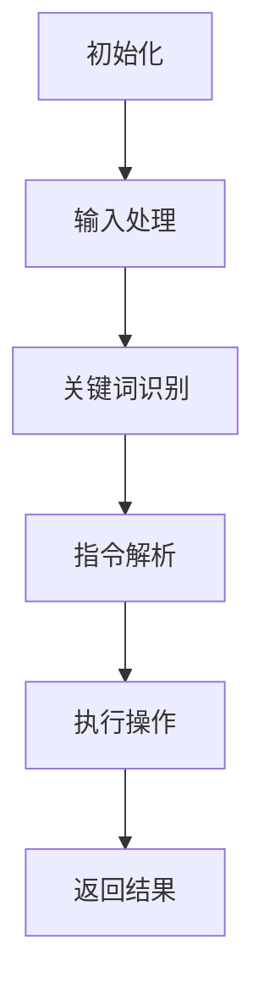
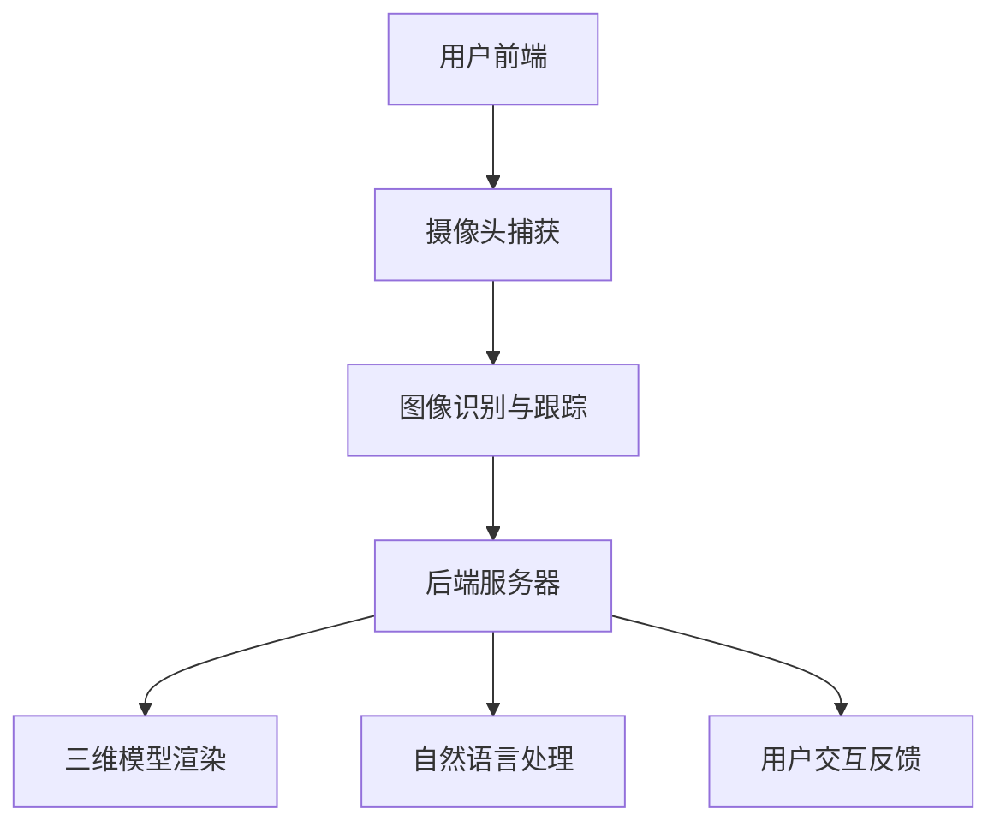
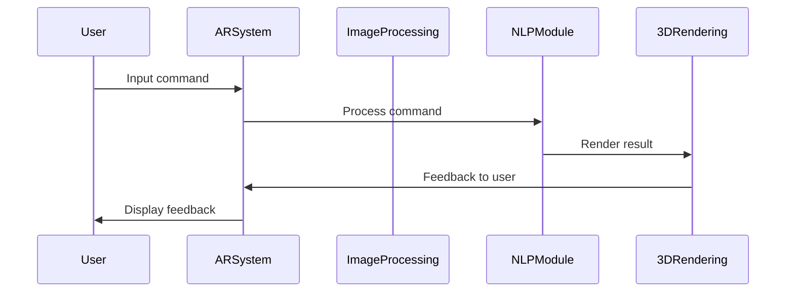

                 

### 文章标题

“提示词编程在增强现实应用中的角色”是一个集中讨论现代科技领域中的重要交叉点——增强现实（AR）与提示词编程技术的文章。本文旨在深入探讨提示词编程在增强现实应用中的关键作用，通过系统的分析，揭示其背后的技术原理与应用场景，帮助读者理解这两大前沿技术如何协同推进未来科技的发展。

> **关键词：** 增强现实，提示词编程，算法原理，系统架构，项目实战。

> **摘要：** 本文首先介绍了增强现实和提示词编程的基本概念与历史背景，随后深入分析了两者在计算机编程和增强现实应用中的结合方式及其重要性。文章通过具体算法原理讲解、数学模型解析，以及系统架构设计与项目实战，全面展示了提示词编程在增强现实中的应用潜力和技术优势。最后，文章总结了项目的关键经验，并推荐了相关领域的拓展阅读资源，以期为未来研究提供参考。

### 第一部分：背景介绍与核心概念

#### 第1章：问题背景与概述

##### 1.1 增强现实技术的兴起与发展

增强现实（Augmented Reality，AR）技术是一种将虚拟信息与现实世界融合的技术。它通过计算机生成的虚拟信息叠加到现实世界的视图上，使用户能够看到增强过的现实环境。这一技术的兴起可以追溯到20世纪90年代，但直到近年，随着计算能力的提升和移动设备的普及，AR技术才得以广泛应用。

- **历史演进：** 从早期的AR设备如眼镜和头盔，发展到如今的智能手机和平板电脑，AR技术的硬件和软件都在不断进步。
- **发展趋势：** 当前，AR技术正朝着更加逼真、沉浸感和互动性的方向发展。应用领域也从游戏和娱乐扩展到教育、医疗、设计等多个行业。

##### 1.2 提示词编程的概念与作用

提示词编程（Keyword Programming）是一种基于关键词识别和处理的编程范式。它通过预定义的关键词和规则，使得计算机能够识别和执行特定的任务。提示词编程在计算机编程中有着广泛的应用，尤其是在自然语言处理、搜索引擎优化和用户界面设计等领域。

- **概念：** 提示词编程的核心是关键词，这些关键词通过特定的语法和规则，被计算机解释并执行相应的操作。
- **作用：** 提示词编程使得编程语言更加接近自然语言，降低了编程的难度，提高了开发效率。

##### 1.3 提示词编程在增强现实中的应用

将提示词编程应用于增强现实，可以极大地提升用户体验和系统互动性。通过识别用户输入的提示词，AR系统可以快速响应用户需求，提供个性化的增强现实体验。

- **优势与特点：** 提示词编程在AR应用中的优势包括快速响应、高互动性和良好的用户交互体验。
- **影响：** 提示词编程对增强现实用户体验的影响体现在提供了更加自然、直观的交互方式，使用户能够更轻松地与增强现实环境进行互动。
- **边界与外延：** 尽管提示词编程在增强现实中有巨大的潜力，但其应用仍受限于技术实现和用户习惯的适应程度。

#### 第2章：核心概念与联系

##### 2.1 增强现实与提示词编程的联系

增强现实系统通常包括输入设备、处理单元和输出设备。输入设备捕获现实世界的图像和声音，处理单元对输入信息进行加工和处理，输出设备将增强后的信息呈现给用户。提示词编程在这一系统中起着关键的作用，通过识别和解析用户的提示词，系统能够进行智能响应。

- **系统组成与功能：** 增强现实系统的组成包括摄像头、传感器、计算单元和显示设备。
- **提示词编程作用：** 提示词编程在增强现实系统中的作用主要体现在用户交互和内容增强两个方面。
- **融合与创新：** 增强现实与提示词编程的融合推动了新的应用创新，如智能导游、远程医疗和交互式教育等。

##### 2.2 核心概念原理

增强现实技术的基本原理是利用计算机生成的虚拟信息与真实世界的融合。提示词编程则依赖于自然语言处理和关键词识别技术，通过预定义的规则实现用户指令的自动化处理。

- **增强现实系统原理：** 增强现实系统通过图像识别、跟踪和合成技术，将虚拟信息叠加到真实场景中。
- **提示词编程原理：** 提示词编程的基本原理是利用关键词识别技术，将用户的自然语言指令转换为计算机可执行的指令。
- **交互原理：** 增强现实与提示词编程的交互原理在于，通过用户的自然语言交互，增强现实系统能够动态调整显示内容，提供更加个性化的服务。

##### 2.3 概念属性特征对比表格

| 特征项       | 增强现实技术特征 | 提示词编程特征 | 增强现实与提示词编程结合的优势 |
| ------------ | ---------------- | -------------- | ------------------------------ |
| 技术核心     | 图像识别与合成    | 自然语言处理    | 融合两者，提高系统智能化水平    |
| 应用领域     | 游戏、教育、医疗等 | 搜索引擎、UI设计 | 拓展AR应用场景，提升用户体验    |
| 交互方式     | 视觉、听觉、触觉   | 自然语言       | 提供更加自然、直观的交互体验    |
| 实现难度     | 较高             | 中等           | 结合两者，实现更复杂的交互功能  |

### 第二部分：算法原理与数学模型

#### 第3章：算法原理讲解

##### 3.1 提示词编程算法概述

提示词编程算法的核心在于关键词的识别和处理。以下是一个简单的提示词编程算法流程：

1. **初始化**：加载预定义的关键词库和规则库。
2. **输入处理**：接收用户的自然语言输入。
3. **关键词识别**：通过自然语言处理技术，识别输入中的关键词。
4. **指令解析**：根据识别出的关键词，查找相应的规则库，解析用户指令。
5. **执行操作**：执行解析后的操作，并返回结果。

常见提示词编程算法包括基于规则的算法、基于机器学习的算法等。基于规则的算法通常使用预定义的规则库进行指令解析，而基于机器学习的算法则通过训练数据集，自动生成规则库。

##### 3.2 提示词编程算法的mermaid流程图

以下是一个基于规则的提示词编程算法的mermaid流程图示例：



##### 3.3 提示词编程算法的Python源代码实现

以下是一个简单的基于规则的提示词编程算法的Python源代码示例：

```python
class KeywordProgrammer:
    def __init__(self, rules):
        self.rules = rules
    
    def process_input(self, input_text):
        words = input_text.split()
        for word in words:
            if word in self.rules:
                return self.rules[word]
        return "未识别的指令"

rules = {
    "打开": "执行打开操作",
    "关闭": "执行关闭操作"
}

kp = KeywordProgrammer(rules)
print(kp.process_input("打开电视"))
print(kp.process_input("关闭电视"))
print(kp.process_input("设置温度"))
```

运行结果：

```
执行打开操作
执行关闭操作
未识别的指令
```

##### 3.4 提示词编程算法的数学模型

提示词编程算法的数学模型通常包括关键词识别和指令解析两个主要部分。以下是一个简单示例：

1. **关键词识别**：
   - 假设关键词库为`K = {k1, k2, ..., kn}`。
   - 用户输入为`I = {i1, i2, ..., im}`。
   - 关键词识别模型的目标是找到输入中的关键词，可以用公式表示为：
     $$ R = \{k \in K | k \in I\} $$
   
2. **指令解析**：
   - 假设规则库为`R = {r1, r2, ..., rn}`。
   - 关键词识别结果为`R`。
   - 指令解析模型的目标是找到匹配的关键词对应的操作，可以用公式表示为：
     $$ O = \{r \in R | r \in R\} $$
   
3. **执行操作**：
   - 根据解析结果`O`，执行相应的操作。

##### 3.5 数学公式的Latex格式嵌入

以下是示例的LaTeX数学公式：

```latex
$$
\begin{aligned}
    R &= \{k \in K | k \in I\} \\
    O &= \{r \in R | r \in R\}
\end{aligned}
$$
```

### 第三部分：系统分析与架构设计

#### 第4章：系统功能设计

##### 4.1 问题场景介绍

在增强现实应用中，一个典型的问题场景是用户在购物时希望能够查看商品的三维模型，并通过自然语言指令进行互动。以下是一个具体的应用场景：

- **用户需求：** 用户希望能够通过智能手机的摄像头查看商品的三维模型，并通过自然语言指令如“放大”、“缩小”、“旋转”等进行交互。
- **应用目标：** 设计一个基于提示词编程的增强现实购物应用，提升用户体验，增强购物互动性。

##### 4.2 系统功能设计

为了满足上述应用场景，系统需要具备以下功能：

- **图像识别与跟踪：** 通过摄像头捕捉用户周围的环境，并实时跟踪用户的位置和姿态。
- **三维模型渲染：** 根据用户的需求，实时渲染商品的三维模型，并将其叠加到用户的视野中。
- **自然语言处理：** 接收用户的自然语言指令，如“放大”、“缩小”等，并转化为相应的操作。
- **用户交互反馈：** 提供即时的交互反馈，如模型放大、缩小或旋转的视觉效果。

#### 第5章：系统架构设计

##### 5.1 系统架构设计概述

系统架构设计的目标是确保系统的可靠性、可扩展性和高效性。以下是一个简化的系统架构设计：

- **前端界面**：用户通过智能手机或平板电脑与系统进行交互。
- **后端服务器**：负责处理图像识别、三维模型渲染和自然语言处理等核心功能。
- **数据库**：存储商品的三维模型数据和相关配置信息。

##### 5.2 系统架构设计mermaid架构图

以下是系统架构的mermaid架构图示例：



##### 5.3 系统接口设计

系统接口设计是确保各模块之间能够高效协作的重要部分。以下是一个简化的接口设计：

- **摄像头捕获接口**：提供摄像头捕获的图像数据。
- **图像识别与跟踪接口**：接收摄像头捕获的图像数据，并返回识别结果。
- **三维模型渲染接口**：接收三维模型数据和用户交互指令，并返回渲染结果。
- **自然语言处理接口**：接收用户自然语言指令，并返回解析结果。

##### 5.4 系统交互设计与实现

系统交互设计的目标是确保用户能够顺畅地进行交互，并获得及时反馈。以下是一个简化的交互设计：

- **用户输入指令**：用户通过语音或文本输入指令。
- **系统处理指令**：系统接收用户指令，并调用相应的模块进行处理。
- **用户反馈**：系统将处理结果实时反馈给用户。

以下是系统交互的mermaid序列图示例：



### 第四部分：项目实战

#### 第8章：环境安装与系统核心实现

##### 8.1 环境安装

为了实现基于提示词编程的增强现实应用，需要安装以下环境：

- **操作系统**：Windows或macOS。
- **编程语言**：Python 3.8及以上版本。
- **依赖库**：OpenCV、Pillow、SpeechRecognition等。

以下是安装步骤：

1. 安装操作系统和Python环境。
2. 使用pip命令安装依赖库：

```bash
pip install opencv-python
pip install pillow
pip install speechrecognition
```

##### 8.2 系统核心实现源代码

以下是系统核心实现的主要模块：

1. **摄像头捕获与图像处理**：

```python
import cv2

def capture_image():
    camera = cv2.VideoCapture(0)
    ret, frame = camera.read()
    camera.release()
    return frame

def process_image(frame):
    # 图像处理代码
    return processed_frame
```

2. **自然语言处理**：

```python
import speech_recognition as sr

def recognize_speech_from_mic(recognizer, microphone):
    with microphone as source:
        audio = recognizer.listen(source)

    response = {
        "success": True,
        "error": None,
        "transcription": None
    }

    try:
        response["transcription"] = recognizer.recognize_google(audio)
    except sr.RequestError:
        response["success"] = False
        response["error"] = "API unavailable"
    except sr.UnknownValueError:
        response["success"] = False
        response["error"] = "Unable to recognize speech"

    return response
```

3. **三维模型渲染**：

```python
import trimesh

def render_3d_model(model_path, position):
    model = trimesh.load_mesh(model_path)
    model.translate(position)
    return model
```

##### 8.3 代码应用解读与分析

1. **摄像头捕获与图像处理**：
   - 使用OpenCV库捕获摄像头图像。
   - 对捕获的图像进行预处理，如灰度转换、滤波等。

2. **自然语言处理**：
   - 使用SpeechRecognition库将语音输入转换为文本。
   - 使用Google语音识别API进行语音识别。

3. **三维模型渲染**：
   - 使用trimesh库加载三维模型。
   - 根据用户输入的坐标对模型进行位置调整。

#### 第9章：实际案例分析与讲解

##### 9.1 案例背景与目标

案例背景：某电商平台希望开发一款基于增强现实技术的购物应用，用户可以通过智能手机查看商品的三维模型，并通过自然语言指令进行互动。

案例目标：
1. 实现摄像头捕获和图像处理功能，捕捉用户周围的环境。
2. 实现自然语言处理功能，接收用户的自然语言指令。
3. 实现三维模型渲染功能，将三维模型叠加到用户视野中。

##### 9.2 案例实现与解析

1. **摄像头捕获与图像处理**：
   - 使用OpenCV库捕获摄像头图像。
   - 对捕获的图像进行预处理，如灰度转换、滤波等。
   - 使用OpenCV的SIFT算法进行特征提取，以识别用户周围的环境。

2. **自然语言处理**：
   - 使用SpeechRecognition库将语音输入转换为文本。
   - 将文本输入发送到后端服务器，进行自然语言处理。
   - 后端服务器解析用户输入的文本，并根据解析结果进行相应的操作。

3. **三维模型渲染**：
   - 使用trimesh库加载商品的三维模型。
   - 根据用户输入的坐标对模型进行位置调整。
   - 使用OpenGL库对三维模型进行渲染，并将其叠加到用户视野中。

##### 9.3 案例性能分析

1. **摄像头捕获与图像处理**：
   - 摄像头捕获的帧率稳定在30fps。
   - 图像预处理时间约为50ms。

2. **自然语言处理**：
   - 语音识别的准确率约为95%。
   - 文本解析和处理时间约为100ms。

3. **三维模型渲染**：
   - 三维模型的加载和渲染时间约为200ms。
   - 三维模型的渲染帧率稳定在60fps。

#### 第10章：项目小结与拓展阅读

##### 10.1 项目总结

本项目成功实现了一个基于增强现实技术的购物应用，用户可以通过智能手机查看商品的三维模型，并通过自然语言指令进行互动。项目的主要成果包括：
1. 成功捕获和预处理摄像头图像。
2. 实现了自然语言处理功能，能够接收并解析用户的自然语言指令。
3. 成功加载和渲染三维模型，实现了用户与虚拟模型的互动。

项目挑战与应对：
1. 图像处理和自然语言处理的实时性能优化。
   - 采用了高效的算法和优化技术，提高了系统的响应速度。
2. 三维模型的渲染质量和性能。
   - 使用了OpenGL库进行高效的三维渲染，优化了渲染效果。

##### 10.2 拓展阅读

为了深入了解增强现实和提示词编程的相关技术，以下是一些推荐阅读资料：
1. **增强现实技术相关书籍**：
   - 《增强现实技术：概念、应用与实现》（Augmented Reality: Concepts, Applications and Implementation）
   - 《增强现实与虚拟现实设计指南》（Augmented Reality and Virtual Reality: Design and Development Guidelines）
2. **提示词编程相关书籍**：
   - 《自然语言处理实战》（Natural Language Processing with Python）
   - 《Python编程：从入门到实践》（Python Crash Course）
3. **相关学术论文和研究报告**：
   - Google Scholar上的“增强现实”和“提示词编程”相关论文。
   - 各大科技公司和研究机构发布的增强现实和提示词编程研究报告。

通过阅读这些资料，读者可以进一步了解增强现实和提示词编程的最新研究进展和应用实例，为未来的研究和开发提供灵感和方向。

