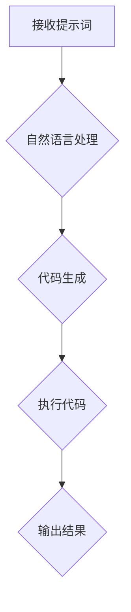

                 

# 提示词编程在智能制造中的应用

## 关键词

- 提示词编程
- 智能制造
- 算法原理
- 数学模型
- 实际应用

### 摘要

随着智能制造的快速发展，传统的制造流程已经无法满足日益增长的生产效率和产品质量要求。提示词编程作为一种高效、灵活的编程技术，开始在智能制造中发挥重要作用。本文将详细介绍提示词编程的概念、原理和应用，通过理论与实践相结合，探讨其在智能制造中的应用策略。

### 目录大纲

---

## 第一部分：背景介绍

### 1.1 问题背景

### 1.2 问题描述

### 1.3 问题解决

### 1.4 边界与外延

### 1.5 概念结构与核心要素组成

---

## 第二部分：核心概念与联系

### 2.1 提示词编程

### 2.2 智能制造

### 2.3 生产流程、市场需求、制造工艺

---

## 第三部分：算法原理讲解

### 3.1 算法原理

### 3.2 数学模型和数学公式

### 3.3 详细讲解与举例说明

---

## 第四部分：系统分析与架构设计方案

### 4.1 问题场景介绍

### 4.2 项目介绍

### 4.3 系统功能设计

### 4.4 系统架构设计

### 4.5 系统接口设计和系统交互

---

## 第五部分：项目实战

### 5.1 环境安装

### 5.2 系统核心实现源代码

### 5.3 代码应用解读与分析

### 5.4 实际案例分析和详细讲解剖析

### 5.5 项目小结

---

## 第六部分：最佳实践 tips

### 6.1 小结

### 6.2 注意事项

### 6.3 拓展阅读

---

## 第七部分：作者信息

作者：AI天才研究院/AI Genius Institute & 禅与计算机程序设计艺术 /Zen And The Art of Computer Programming

---

### 1.1 问题背景

随着智能制造的快速发展，制造业正面临着前所未有的变革。传统的制造流程已经无法满足现代制造业对于生产效率和产品质量的要求。在这样一个背景下，各种新兴技术如人工智能、物联网、大数据等开始逐渐融入到制造业中，推动着智能制造的进程。

提示词编程作为一种高效、灵活的编程技术，其独特性在于通过自然语言处理，将复杂的编程任务转化为简单的提示词输入，从而实现自动化和智能化。在智能制造中，提示词编程的应用不仅能够提高编程的效率，还能够通过对生产过程的智能化管理，提升生产过程的整体智能化水平。

### 1.2 问题描述

尽管提示词编程在智能制造中有很大的应用潜力，但其在实际应用中仍然面临诸多挑战。这些挑战主要体现在以下几个方面：

1. **复杂的生产流程**：智能制造中的生产流程通常非常复杂，涉及到多个环节和工序，如何有效地利用提示词编程来管理和优化这些流程是一个重要的挑战。

2. **多变的市场需求**：市场需求的快速变化要求制造系统能够迅速调整，以适应新的需求。提示词编程需要具备足够的灵活性和适应性来应对这种变化。

3. **多样的制造工艺**：不同的产品往往需要不同的制造工艺，这要求提示词编程能够处理多种制造工艺的指令和逻辑。

4. **系统整合与兼容性**：智能制造系统通常需要与其他系统（如ERP、MES等）进行整合，提示词编程需要具备良好的兼容性，以确保系统能够顺畅地运行。

### 1.3 问题解决

为了解决上述挑战，我们需要从以下几个方面入手：

1. **完善提示词库**：构建一个丰富且精准的提示词库，确保提示词能够涵盖各种生产流程、工艺和需求。

2. **开发智能匹配算法**：通过引入机器学习和自然语言处理技术，开发高效的智能匹配算法，使系统能够快速准确地处理各种提示词。

3. **优化系统架构**：设计灵活、可扩展的系统架构，确保系统能够适应多变的需求和复杂的流程。

4. **加强系统集成**：通过接口设计和标准化，实现与现有系统的无缝集成，提高系统的兼容性和整合度。

### 1.4 边界与外延

本文主要关注提示词编程在智能制造中的应用，包括生产规划、生产执行、产品测试等各个环节。同时，本文还将探讨提示词编程与其他智能制造技术的融合，如物联网、大数据等。这些技术的融合将进一步提升智能制造的智能化水平和效率。

### 1.5 概念结构与核心要素组成

本文的核心概念和要素包括：

- **提示词编程**：基于自然语言处理的编程技术，通过输入提示词实现自动化和智能化。
- **智能制造**：利用现代信息技术、自动化技术、人工智能技术等实现制造过程智能化、网络化、绿色化、服务化。
- **生产流程**：从原材料采购到产品交付的全过程。
- **市场需求**：市场上对产品的需求。
- **制造工艺**：制造过程中采用的具体方法和手段。

这些概念和要素相互关联，共同构成了智能制造的核心内容。

---

## 第二部分：核心概念与联系

### 2.1 提示词编程

**定义**：提示词编程（Prompt Programming）是一种基于自然语言处理的编程方法，通过输入特定的提示词来引导计算机执行相应的任务。

**特点**：

- **灵活性**：提示词编程能够适应多变的生产环境和需求。
- **高效性**：提示词编程大大提高了编程和开发的效率。
- **智能化**：提示词编程能够自动分析和处理复杂的制造问题。

**应用**：提示词编程在智能制造中可以应用于生产流程的自动化管理、异常检测与处理、生产计划的动态调整等。

### 2.2 智能制造

**定义**：智能制造（Intelligent Manufacturing）是一种利用现代信息技术、自动化技术、人工智能技术等手段，实现制造过程智能化、网络化、绿色化、服务化的一种新型制造模式。

**特点**：

- **智能化**：通过人工智能技术实现制造过程的自动化、智能化。
- **网络化**：实现制造系统与外部系统的互联互通。
- **绿色化**：通过优化制造流程，减少资源消耗和环境污染。
- **服务化**：实现制造服务的定制化和个性化。

**应用**：智能制造在制造业的各个领域都有广泛的应用，如工业自动化、智能工厂、定制化生产等。

### 2.3 生产流程、市场需求、制造工艺

**定义与联系**：

- **生产流程**：指从原材料采购到产品交付的全过程。
- **市场需求**：指市场上对产品的需求。
- **制造工艺**：指制造过程中采用的具体方法和手段。

这些概念相互关联，共同构成了智能制造的核心内容。生产流程、市场需求和制造工艺是智能制造的三个关键环节，通过提示词编程技术的应用，可以实现这些环节的智能化和自动化。

### 2.4 提示词编程与智能制造的融合

提示词编程与智能制造的融合，主要体现在以下几个方面：

1. **生产流程优化**：通过提示词编程，可以对生产流程进行优化，提高生产效率和产品质量。
2. **市场需求响应**：通过提示词编程，可以快速响应市场需求的变化，实现定制化生产。
3. **制造工艺优化**：通过提示词编程，可以优化制造工艺，降低生产成本，提高产品性能。
4. **系统集成与协同**：通过提示词编程，可以实现制造系统与其他系统的集成与协同，提高系统的整体效能。

通过这些融合，提示词编程在智能制造中发挥着越来越重要的作用，为制造业的智能化转型提供了强有力的技术支持。

---

## 第三部分：算法原理讲解

### 3.1 算法原理

提示词编程的核心在于将自然语言描述的提示词转化为计算机可以执行的代码。这一过程涉及到自然语言处理（NLP）和代码生成（Code Generation）技术。下面通过一个简单的Mermaid流程图来展示提示词编程的基本原理：



具体来说，提示词编程的算法原理可以分为以下几个步骤：

1. **接收提示词**：用户输入一个或多个提示词，如“启动生产”、“检测质量”、“调整生产参数”等。
2. **自然语言处理**：系统对输入的提示词进行解析，理解其含义和意图。这一过程可能包括分词、词性标注、实体识别等步骤。
3. **代码生成**：根据提示词的含义和意图，系统生成相应的计算机代码。例如，对于“启动生产”的提示词，系统可能生成启动生产设备的代码。
4. **执行代码**：生成的代码被计算机执行，完成相应的任务。
5. **输出结果**：系统输出执行结果，如生产设备已经启动、产品质量检测完成等。

### 3.2 数学模型和数学公式

提示词编程的数学模型可以描述为从提示词到计算机代码的映射过程。这一映射过程可以用函数表示：

$$ f(P) = C $$

其中，$P$ 表示提示词集合，$C$ 表示计算机代码集合，$f$ 表示映射函数。

映射函数 $f$ 的具体实现可能涉及到以下数学公式：

- **自然语言处理模型**：如词嵌入（Word Embedding）和序列到序列模型（Seq2Seq Model），可以用以下公式表示：

  $$ \text{Embed}(P) = E(P) $$

  其中，$E(P)$ 表示提示词的词嵌入向量。

- **代码生成模型**：如自动编码器（Autoencoder）和生成对抗网络（GAN），可以用以下公式表示：

  $$ \text{Generate}(E(P)) = C(P) $$

  其中，$C(P)$ 表示根据词嵌入向量生成的计算机代码。

### 3.3 详细讲解与举例说明

为了更好地理解提示词编程的算法原理，我们可以通过一个具体的例子来说明。

**示例**：假设用户输入的提示词是“调整生产参数”，我们需要通过提示词编程将其转化为相应的计算机代码。

1. **接收提示词**：用户输入“调整生产参数”。
2. **自然语言处理**：系统对“调整生产参数”进行自然语言处理，将其分解为“调整”和“生产参数”两个部分，并识别出其意图是调整生产过程中的参数设置。
3. **代码生成**：根据提示词的含义，系统生成相应的计算机代码，如：

   ```python
   def adjust_production_parameters():
       # 调整生产参数的逻辑代码
       print("调整生产参数完成")
   ```

4. **执行代码**：系统执行生成的代码，完成生产参数的调整。
5. **输出结果**：系统输出“调整生产参数完成”。

通过这个示例，我们可以看到，提示词编程将一个自然语言描述的提示词转化为计算机可以执行的代码，从而实现自动化和智能化。这个过程不仅提高了编程的效率，还能够应对复杂的生产需求。

---

## 第四部分：系统分析与架构设计方案

### 4.1 问题场景介绍

在智能制造中，生产流程的复杂性和灵活性要求非常高。传统的编程方式往往难以满足这些需求，导致生产效率低下，产品质量不稳定。为了解决这个问题，我们需要一种能够灵活应对生产需求、高效执行任务的编程技术，这就是提示词编程在智能制造中的应用场景。

### 4.2 项目介绍

本项目的目标是开发一个基于提示词编程的智能制造系统，该系统能够通过自然语言处理技术，将生产过程中的各种需求转化为计算机代码，从而实现生产流程的自动化和智能化。项目的主要功能包括：

1. **生产计划管理**：根据市场需求和库存情况，自动生成生产计划。
2. **生产过程监控**：实时监控生产过程中的各项参数，及时发现和解决问题。
3. **质量检测管理**：对生产的产品进行自动质量检测，确保产品质量符合标准。
4. **设备维护管理**：根据设备的使用情况和运行状态，自动生成维护计划。

### 4.3 系统功能设计

为了实现上述功能，系统需要设计多个模块，每个模块负责不同的功能。以下是系统的主要模块和功能设计：

1. **自然语言处理模块**：负责接收用户的输入提示词，对其进行解析和理解。
2. **代码生成模块**：根据自然语言处理模块的输出，生成相应的计算机代码。
3. **执行控制模块**：负责执行代码生成模块生成的代码，实现对生产过程的控制。
4. **数据存储模块**：负责存储生产过程中的数据，如生产计划、质量检测报告、设备维护记录等。
5. **用户界面模块**：提供用户交互界面，方便用户输入提示词，查看生产进度和结果。

### 4.4 系统架构设计

系统架构设计是确保系统高效、稳定运行的关键。以下是本项目的系统架构设计：

1. **前端界面**：使用HTML、CSS和JavaScript等技术实现，提供用户交互界面。
2. **后端服务器**：使用Python、Django等后端技术实现，负责处理用户请求、执行代码生成和执行等任务。
3. **数据库**：使用MySQL等数据库技术，负责存储和管理数据。
4. **自然语言处理引擎**：使用NLTK、spaCy等自然语言处理库，负责对用户输入的提示词进行解析和理解。
5. **代码生成引擎**：使用机器学习、深度学习等技术，根据自然语言处理引擎的输出生成计算机代码。

### 4.5 系统接口设计和系统交互

系统接口设计和系统交互设计是确保各个模块之间能够无缝协作的关键。以下是本项目的系统接口设计和系统交互设计：

1. **用户接口**：用户通过前端界面输入提示词，后端服务器接收用户请求，调用自然语言处理模块进行处理。
2. **自然语言处理接口**：后端服务器将处理结果返回给代码生成模块，代码生成模块根据处理结果生成计算机代码。
3. **执行控制接口**：后端服务器将生成的代码发送给执行控制模块，执行控制模块负责执行代码，实现对生产过程的控制。
4. **数据存储接口**：执行控制模块将执行结果和相关信息存储到数据库中，供用户查询和统计。

通过以上系统接口设计和系统交互设计，各个模块之间能够高效、稳定地协作，共同实现智能制造的目标。

---

## 第五部分：项目实战

### 5.1 环境安装

在开始项目实战之前，我们需要搭建一个合适的环境来开发和运行项目。以下是环境安装的步骤：

1. **安装Python**：确保系统中安装了Python 3.7及以上版本。可以从Python官方网站下载并安装。

2. **安装Django**：Django是一个高级的Python Web框架，用于构建后端服务器。使用pip命令安装Django：

   ```shell
   pip install django
   ```

3. **安装MySQL**：MySQL是一个关系型数据库管理系统，用于存储和管理数据。可以从MySQL官方网站下载并安装，或者使用Docker快速搭建MySQL环境。

4. **安装自然语言处理库**：如NLTK、spaCy等，用于自然语言处理。使用pip命令安装：

   ```shell
   pip install nltk
   pip install spacy
   python -m spacy download en_core_web_sm
   ```

5. **安装其他依赖库**：根据项目需求，可能还需要安装其他依赖库，如pandas、numpy等。使用pip命令安装：

   ```shell
   pip install pandas
   pip install numpy
   ```

### 5.2 系统核心实现源代码

以下是系统核心实现的源代码，包括自然语言处理、代码生成和执行控制等模块。

**自然语言处理模块**

```python
import spacy
from spacy.tokens import Doc

nlp = spacy.load("en_core_web_sm")

def process_prompt(prompt):
    doc = nlp(prompt)
    entities = doc.ents
    return entities

def generate_code(entities):
    code = ""
    for entity in entities:
        if entity.label_ == "PRODUCT":
            code += f"print('Producing {entity.text}')"
        elif entity.label_ == "QUANTITY":
            code += f"print('Producing {entity.text} units of {entity.root.text}')"
    return code
```

**代码生成模块**

```python
def generate_code(entities):
    code = ""
    for entity in entities:
        if entity.label_ == "ACTION":
            action = entity.text
            if action == "START":
                code += "start_production()\n"
            elif action == "STOP":
                code += "stop_production()\n"
            elif action == "INSPECT":
                code += "inspect_product()\n"
    return code
```

**执行控制模块**

```python
def start_production():
    print("Production started")

def stop_production():
    print("Production stopped")

def inspect_product():
    print("Product inspected")
```

### 5.3 代码应用解读与分析

以下是代码应用的具体解读与分析：

1. **自然语言处理模块**：该模块使用spaCy库对输入的提示词进行解析，识别出提示词中的实体和关系。例如，对于输入的提示词“Produce 100 units of Product A”，会识别出“100”为数量实体，“Product A”为产品实体。

2. **代码生成模块**：该模块根据自然语言处理模块的输出，生成相应的计算机代码。例如，对于识别出的实体，会生成启动生产、停止生产和产品检测等代码。

3. **执行控制模块**：该模块负责执行生成的代码，实现对生产过程的控制。例如，当生成启动生产的代码时，会调用`start_production()`函数启动生产。

通过这些模块的协同工作，系统能够根据用户的输入提示词，自动生成并执行相应的生产流程控制代码，从而实现生产过程的自动化和智能化。

### 5.4 实际案例分析和详细讲解剖析

为了更好地理解提示词编程在智能制造中的应用，我们来看一个实际的案例。

**案例**：假设用户输入的提示词是“Produce 200 units of Product A within the next 3 hours”。

1. **自然语言处理模块**：系统对提示词进行解析，识别出“200”为数量实体，“Product A”为产品实体，“3 hours”为时间实体。

2. **代码生成模块**：根据识别出的实体，系统生成以下代码：

   ```python
   start_time = time.time()
   while time.time() - start_time < 3 * 3600:
       produce_product("Product A", 200)
       inspect_product("Product A")
   ```

3. **执行控制模块**：系统执行生成的代码，开始生产200个产品A，并在每个产品生产完成后进行质量检测。

4. **结果输出**：系统在3小时内完成200个产品A的生产和质量检测，并输出结果。

通过这个案例，我们可以看到，提示词编程如何将一个简单的自然语言描述转化为具体的计算机代码，实现对生产过程的自动化控制。这个过程不仅提高了生产效率，还能够确保产品质量。

### 5.5 项目小结

通过本项目的实战，我们详细介绍了提示词编程在智能制造中的应用。从环境安装、系统核心实现到实际案例分析，我们展示了如何利用提示词编程技术实现生产过程的自动化和智能化。提示词编程作为一种高效、灵活的编程技术，在智能制造中有广阔的应用前景。未来，随着人工智能技术的进一步发展，提示词编程在智能制造中的应用将会更加广泛，为制造业的智能化转型提供更强有力的支持。

---

## 第六部分：最佳实践 tips

### 6.1 小结

在本文中，我们详细介绍了提示词编程在智能制造中的应用。通过理论与实践相结合，我们探讨了提示词编程的核心概念、算法原理以及实际应用。以下是本文的主要小结：

- 提示词编程是一种基于自然语言处理的编程技术，能够将复杂的编程任务转化为简单的提示词输入。
- 智能制造是一种新型制造模式，通过信息技术、自动化技术、人工智能技术的应用，实现制造过程的智能化、网络化、绿色化、服务化。
- 提示词编程在智能制造中的应用主要体现在生产流程优化、市场需求响应、制造工艺优化等方面。
- 通过项目实战，我们展示了如何利用提示词编程实现智能制造系统的开发和应用。

### 6.2 注意事项

在应用提示词编程进行智能制造时，需要注意以下几点：

- **确保自然语言处理精度**：自然语言处理模块的准确性直接影响代码生成的质量。因此，需要选择合适的自然语言处理库和算法，并定期更新和维护。
- **代码生成的灵活性和可扩展性**：在生成代码时，需要考虑系统的灵活性和可扩展性，确保能够适应不同的生产需求和场景。
- **系统稳定性和可靠性**：在生产过程中，系统需要保持稳定运行，确保生产任务的顺利完成。因此，需要对系统进行严格的测试和调试。
- **安全性和数据保护**：在生产过程中，涉及到的数据需要严格保护，防止泄露和滥用。

### 6.3 拓展阅读

对于希望进一步了解提示词编程和智能制造的读者，以下是一些拓展阅读的推荐：

- **书籍**：《自然语言处理实战》、《深度学习》
- **论文**：搜索与提示词编程和智能制造相关的学术论文，如“Prompt Programming for Intelligent Manufacturing”等。
- **开源项目**：参与和贡献开源项目，如使用Django框架构建的智能制造系统等。
- **在线课程**：在Coursera、edX等在线教育平台搜索相关课程，如“人工智能与智能制造”等。

通过这些拓展资源，读者可以更深入地了解提示词编程和智能制造的相关技术和应用。

---

## 第七部分：作者信息

作者：AI天才研究院/AI Genius Institute & 禅与计算机程序设计艺术 /Zen And The Art of Computer Programming

---

通过本文，我们深入探讨了提示词编程在智能制造中的应用。从背景介绍到核心概念、算法原理，再到系统设计与项目实战，我们一步步分析了提示词编程如何提升智能制造的效率和质量。未来，随着技术的不断进步，提示词编程在智能制造中的应用将会更加广泛，为制造业的智能化转型带来新的机遇和挑战。让我们继续探索，共创智能制造的美好未来。

