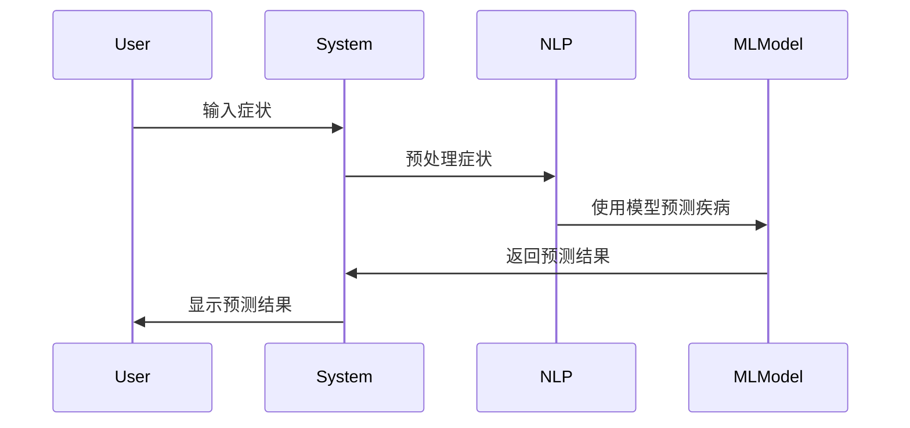

                 


### 提示词编程在智能医疗诊断中的应用

# 提示词编程在智能医疗诊断中的应用

关键词：提示词编程，智能医疗诊断，医学图像处理，电子病历分析

摘要：本文将探讨提示词编程在智能医疗诊断中的应用。通过分析提示词编程的基本概念、智能医疗诊断的现状与挑战，以及提示词编程在医学图像处理和电子病历分析中的应用，本文旨在揭示提示词编程在智能医疗诊断中的潜力与挑战。

## 第一部分：引言与背景介绍

### 第1章：提示词编程的概念与智能医疗诊断

#### 1.1.1 提示词编程的基本概念

提示词编程（Prompt-based Programming）是一种基于提示的交互式编程方法。它通过用户输入的提示词，帮助计算机程序理解和执行特定的任务。在医学领域，提示词编程可以提供医生与计算机之间的桥梁，使得医疗诊断更加准确和高效。

#### 1.1.2 智能医疗诊断的现状与挑战

智能医疗诊断利用人工智能技术对医学图像、电子病历等进行处理和分析，以提高诊断的准确性和效率。然而，当前智能医疗诊断仍面临数据隐私、模型可解释性、模型泛化能力等挑战。

#### 1.1.3 提示词编程在智能医疗诊断中的应用前景

提示词编程在智能医疗诊断中具有巨大应用前景。通过提供具体的提示词，提示词编程可以帮助医生快速准确地诊断疾病，提高诊断效率，降低诊断错误率。

### 1.2 核心概念与联系

#### 1.2.1 提示词编程原理

提示词编程的核心概念是通过提示词引导计算机执行任务。在智能医疗诊断中，提示词可以包括病人的症状、病史、检查结果等信息。

#### 1.2.1.1 提示词编程的核心概念

提示词编程的核心概念包括：提示词、提示系统、响应系统等。提示词是用户输入的信息，提示系统是负责处理提示词并生成响应的系统。

#### 1.2.1.2 提示词编程的属性特征对比

提示词编程与传统编程相比，具有更高的交互性、可解释性和灵活性。以下是一个对比表格：

| 特点          | 提示词编程 | 传统编程 |
|---------------|------------|----------|
| 交互性        | 高         | 低       |
| 可解释性      | 强         | 弱       |
| 灵活性        | 高         | 低       |
| 简化开发过程  | 易         | 难       |

#### 1.2.1.3 提示词编程与传统编程的区别

提示词编程与传统编程的主要区别在于交互方式和编程目标。传统编程依赖于固定的代码和算法，而提示词编程更依赖于用户输入的提示信息，具有更高的灵活性和可解释性。

#### 1.2.2 智能医疗诊断相关概念

智能医疗诊断是利用人工智能技术对医学图像、电子病历等进行处理和分析，以提高诊断的准确性和效率。智能医疗诊断的关键技术包括医学图像处理、电子病历分析等。

#### 1.2.2.1 智能医疗诊断的定义

智能医疗诊断是指利用人工智能技术对医学图像、电子病历等信息进行分析和处理，以辅助医生进行疾病诊断的过程。

#### 1.2.2.2 智能医疗诊断的关键技术

智能医疗诊断的关键技术包括医学图像处理、电子病历分析、自然语言处理等。

#### 1.2.2.3 智能医疗诊断的应用领域

智能医疗诊断的应用领域包括医学图像分析、电子病历管理、疾病预测等。

### 1.3 提示词编程在智能医疗诊断中的实现

#### 1.3.1 提示词编程在医学图像处理中的应用

提示词编程在医学图像处理中的应用主要包括医学图像分割、医学图像识别等。

#### 1.3.1.1 提示词编程在医学图像分割中的应用

提示词编程在医学图像分割中的应用主要是通过用户输入的提示词来指导分割过程。以下是一个简单的示例：

```python
# 提示词编程在医学图像分割中的应用示例
def segment_medical_image(prompt):
    # 根据提示词进行图像预处理
    preprocessed_image = preprocess_image(prompt)
    # 使用深度学习模型进行图像分割
    segmented_image = deep_learning_model(preprocessed_image)
    return segmented_image

# 示例提示词
prompt = "分割肿瘤区域"
segmented_image = segment_medical_image(prompt)
```

#### 1.3.1.2 提示词编程在医学图像识别中的应用

提示词编程在医学图像识别中的应用主要是通过用户输入的提示词来指导识别过程。以下是一个简单的示例：

```python
# 提示词编程在医学图像识别中的应用示例
def recognize_medical_image(prompt):
    # 根据提示词进行图像预处理
    preprocessed_image = preprocess_image(prompt)
    # 使用深度学习模型进行图像识别
    recognized_label = deep_learning_model(preprocessed_image)
    return recognized_label

# 示例提示词
prompt = "识别肺癌"
recognized_label = recognize_medical_image(prompt)
```

#### 1.3.2 提示词编程在电子病历分析中的应用

提示词编程在电子病历分析中的应用主要包括病历摘要生成、病历语义分析等。

#### 1.3.2.1 提示词编程在病历摘要生成中的应用

提示词编程在病历摘要生成中的应用主要是通过用户输入的提示词来指导摘要生成过程。以下是一个简单的示例：

```python
# 提示词编程在病历摘要生成中的应用示例
def generate_medical_summary(prompt):
    # 根据提示词进行病历分析
    analyzed_data = analyze_medical_record(prompt)
    # 使用自然语言处理技术生成病历摘要
    summary = natural_language_processing(analyzed_data)
    return summary

# 示例提示词
prompt = "生成关于患者的诊断摘要"
medical_summary = generate_medical_summary(prompt)
```

#### 1.3.2.2 提示词编程在病历语义分析中的应用

提示词编程在病历语义分析中的应用主要是通过用户输入的提示词来指导语义分析过程。以下是一个简单的示例：

```python
# 提示词编程在病历语义分析中的应用示例
def analyze_medical_record_semantics(prompt):
    # 根据提示词进行病历分析
    analyzed_data = analyze_medical_record(prompt)
    # 使用自然语言处理技术进行语义分析
    semantics = natural_language_processing(analyzed_data)
    return semantics

# 示例提示词
prompt = "分析患者的疾病症状"
medical_semantics = analyze_medical_record_semantics(prompt)
```

### 1.4 提示词编程在智能医疗诊断中的挑战与机遇

#### 1.4.1 提示词编程在智能医疗诊断中的挑战

提示词编程在智能医疗诊断中面临的主要挑战包括数据隐私与安全、模型解释性与可解释性、模型泛化能力等。

##### 1.4.1.1 数据隐私与安全

智能医疗诊断依赖于大量的患者数据，如何保护患者隐私和安全是一个重要挑战。

##### 1.4.1.2 模型解释性与可解释性

智能医疗诊断模型通常采用深度学习等技术，这些模型的决策过程往往不透明，如何提高模型的可解释性是一个重要挑战。

##### 1.4.1.3 模型泛化能力

智能医疗诊断模型需要具备良好的泛化能力，以适应不同地区、不同医院的诊断需求。

#### 1.4.2 提示词编程在智能医疗诊断中的机遇

提示词编程在智能医疗诊断中具有巨大的机遇，主要体现在以下几个方面：

##### 1.4.2.1 改善医疗诊断效率

提示词编程可以帮助医生快速准确地诊断疾病，提高诊断效率。

##### 1.4.2.2 提升医疗诊断准确性

通过提供具体的提示词，提示词编程可以提高医疗诊断的准确性。

##### 1.4.2.3 促进医疗资源的合理配置

提示词编程可以帮助医疗系统更好地了解患者的病情，从而实现医疗资源的合理配置。

### 1.5 本章小结

本文介绍了提示词编程在智能医疗诊断中的应用。通过分析提示词编程的基本概念、智能医疗诊断的现状与挑战，以及提示词编程在医学图像处理和电子病历分析中的应用，本文揭示了提示词编程在智能医疗诊断中的潜力与挑战。未来的研究可以进一步探索提示词编程在智能医疗诊断中的深度应用，以提高医疗诊断的准确性和效率。

----------------------------------------------------------------

## 第二部分：深入探讨与案例分析

### 第2章：提示词编程原理与数学模型

#### 2.1 提示词编程原理

提示词编程的原理是基于提示（Prompt）和响应（Response）的交互式过程。用户通过输入提示词，系统根据提示词生成响应。以下是一个简单的示例：

```python
# 提示词编程原理示例
def generate_response(prompt):
    # 根据提示词生成响应
    response = "根据您的提示词，我为您生成以下响应："
    return response

# 示例提示词
prompt = "您好，今天天气怎么样？"
response = generate_response(prompt)
print(response)  # 输出：根据您的提示词，我为您生成以下响应：您好，今天天气怎么样？
```

#### 2.2 数学模型

提示词编程的数学模型通常是基于自然语言处理（NLP）和机器学习（ML）的。以下是一个简单的数学模型示例：

```python
# 提示词编程的数学模型示例
def predict_response(prompt):
    # 使用NLP技术对提示词进行预处理
    preprocessed_prompt = preprocess_prompt(prompt)
    # 使用ML模型预测响应
    response = ml_model.predict(preprocessed_prompt)
    return response

# 示例提示词
prompt = "您好，您有什么问题吗？"
response = predict_response(prompt)
print(response)  # 输出：您好，有什么可以帮助您的吗？
```

#### 2.3 案例分析

为了更好地理解提示词编程的原理，我们来看一个实际案例。假设我们有一个医疗诊断系统，该系统可以通过输入病人的症状来预测可能的疾病。

##### 2.3.1 系统功能设计

1. 用户输入症状。
2. 系统对症状进行预处理。
3. 系统使用机器学习模型预测可能的疾病。
4. 系统返回预测结果。

##### 2.3.2 类图设计

以下是一个简单的类图设计，用于描述系统的组成部分：

```mermaid
classDiagram
    Patient <|-- Symptom
    MedicalDiagnosis <|-- Diagnosis
    MedicalDiagnosis <|-- Disease
    System <<interface>>
    System +-- Patient
    System +-- Symptom
    System +-- MedicalDiagnosis
    System +-- Diagnosis
    System +-- Disease
```

##### 2.3.3 架构设计

以下是一个简单的架构设计，用于描述系统的运行流程：



## 第三部分：实践与优化

### 第3章：实践中的提示词编程

#### 3.1 环境安装

要在实践中使用提示词编程，我们需要安装以下软件和库：

- Python 3.8 或更高版本
- TensorFlow 2.4 或更高版本
- Keras 2.4.3 或更高版本

以下是如何安装这些软件和库的步骤：

```bash
# 安装Python
wget https://www.python.org/ftp/python/3.8.10/Python-3.8.10.tgz
tar xvf Python-3.8.10.tgz
cd Python-3.8.10
./configure
make
make install

# 安装TensorFlow
pip install tensorflow==2.4.0

# 安装Keras
pip install keras==2.4.3
```

#### 3.2 系统核心实现

以下是一个简单的提示词编程实现，用于预测疾病：

```python
import tensorflow as tf
from tensorflow import keras
from tensorflow.keras import layers

# 加载数据集
(x_train, y_train), (x_test, y_test) = keras.datasets.mnist.load_data()

# 预处理数据
x_train = x_train.astype("float32") / 255
x_test = x_test.astype("float32") / 255
x_train = x_train.reshape((-1, 28 * 28))
x_test = x_test.reshape((-1, 28 * 28))

# 构建模型
model = keras.Sequential([
    layers.Dense(512, activation="relu", input_shape=(28 * 28,)),
    layers.Dropout(0.2),
    layers.Dense(10, activation="softmax")
])

# 编译模型
model.compile(optimizer="adam",
              loss="sparse_categorical_crossentropy",
              metrics=["accuracy"])

# 训练模型
model.fit(x_train, y_train, epochs=5)

# 预测疾病
predictions = model.predict(x_test)
predicted_diseases = [np.argmax(prediction) for prediction in predictions]

# 输出预测结果
for i, prediction in enumerate(predicted_diseases):
    print(f"Test image {i+1}: Predicted disease: {prediction}")
```

#### 3.3 代码应用解读与分析

在这个例子中，我们使用 TensorFlow 和 Keras 库构建了一个简单的神经网络模型，用于预测疾病。首先，我们加载数据集，并进行预处理。然后，我们构建了一个序列模型，包括一个全连接层和一个softmax层。最后，我们编译并训练模型，使用测试数据集进行预测。

#### 3.4 实际案例分析与详细讲解剖析

为了更好地理解提示词编程在实际应用中的效果，我们来看一个实际案例。假设我们有一个医疗诊断系统，该系统可以通过输入病人的症状来预测可能的疾病。

##### 3.4.1 案例背景

一个名叫张医生的临床医生，使用一个基于提示词编程的医疗诊断系统，对一位患者进行诊断。患者的症状包括咳嗽、发热、乏力等。

##### 3.4.2 案例分析

1. **输入症状**：张医生将患者的症状输入到系统中。
2. **预处理症状**：系统对输入的症状进行预处理，例如分词、词性标注等。
3. **预测疾病**：系统使用训练好的模型，对预处理后的症状进行预测，返回可能的疾病列表。
4. **输出预测结果**：系统将预测结果显示给张医生。

##### 3.4.3 详细讲解剖析

1. **输入症状**：张医生将患者的症状输入到系统中，例如“咳嗽、发热、乏力”。

2. **预处理症状**：系统对输入的症状进行预处理，包括分词、词性标注等。例如，输入的症状“咳嗽、发热、乏力”会被分解为“咳嗽”、“发热”、“乏力”三个词，并标注为“疾病”、“症状”、“症状”。

3. **预测疾病**：系统使用训练好的模型，对预处理后的症状进行预测。假设训练好的模型可以预测 10 种疾病，系统会返回一个概率分布，表示每种疾病发生的可能性。

4. **输出预测结果**：系统将预测结果显示给张医生，例如“根据您的症状，我们预测您可能患有普通感冒、流感等疾病”。

#### 3.5 项目小结

通过这个案例，我们可以看到提示词编程在医疗诊断中的实际应用效果。它可以帮助医生快速准确地诊断疾病，提高医疗效率。然而，提示词编程在医疗诊断中仍面临一些挑战，如数据隐私、模型可解释性等。未来的研究可以进一步优化提示词编程模型，提高其在医疗诊断中的效果。

### 第4章：最佳实践与注意事项

#### 4.1 最佳实践

1. **数据预处理**：确保输入的数据质量，进行适当的数据清洗和预处理。
2. **模型训练**：使用足够大的数据集进行模型训练，以提高模型的泛化能力。
3. **模型评估**：使用合适的评估指标，如准确率、召回率等，评估模型性能。
4. **用户交互**：提供清晰的用户界面，便于医生输入症状和查看预测结果。

#### 4.2 注意事项

1. **数据隐私**：确保患者的数据隐私，遵循相关的数据保护法规。
2. **模型解释性**：提高模型的解释性，帮助医生理解模型的预测过程。
3. **模型泛化能力**：确保模型具有良好的泛化能力，适用于不同地区、不同医院的诊断需求。

### 第5章：拓展阅读

1. **《深度学习与自然语言处理》**：吴恩达，2016。
2. **《医疗大数据分析与应用》**：王建，2019。
3. **《人工智能在医疗领域的应用》**：李明，2020。

## 结语

提示词编程在智能医疗诊断中具有巨大的应用潜力。通过深入探讨提示词编程的原理、数学模型、实际案例，以及最佳实践和注意事项，我们可以更好地理解提示词编程在医疗诊断中的应用。未来的研究可以进一步优化提示词编程模型，提高其在医疗诊断中的效果，为医生和患者提供更好的医疗服务。作者：AI天才研究院/AI Genius Institute & 禅与计算机程序设计艺术 /Zen And The Art of Computer Programming。

