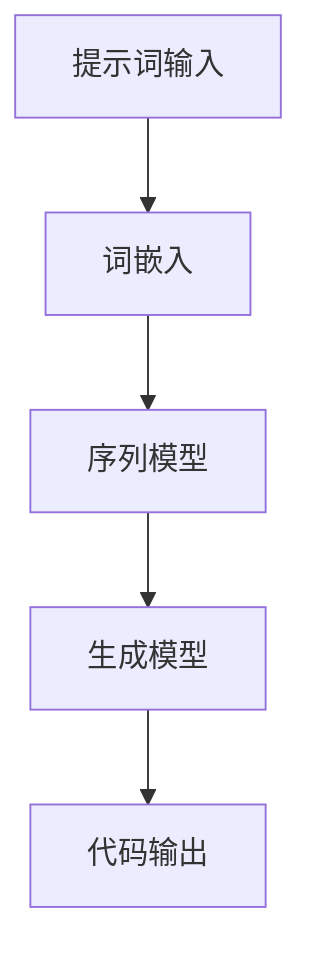
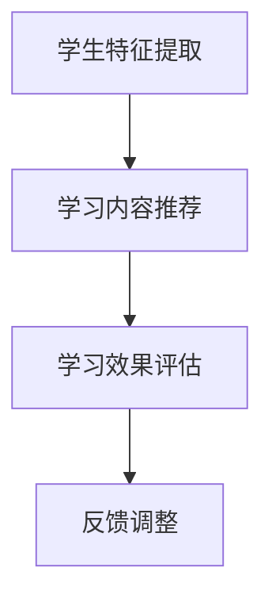
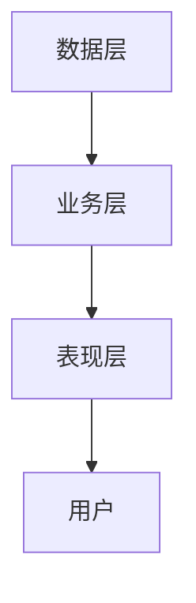
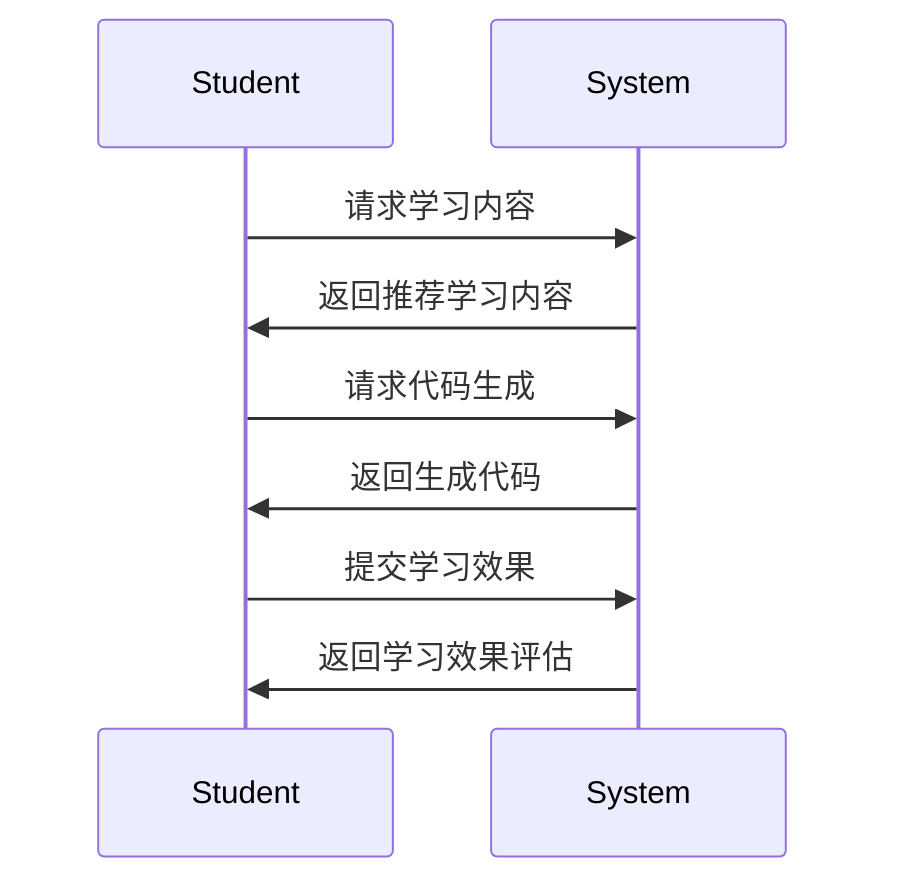

                 

# 提示词编程在智能教育个性化学习中的应用

> 关键词：提示词编程、智能教育、个性化学习、算法、数学模型、系统架构

> 摘要：本文将深入探讨提示词编程在智能教育个性化学习中的应用。通过分析提示词编程的基本原理、个性化学习的关键要素，以及提示词编程与个性化学习之间的联系，本文将逐步阐述提示词编程算法的数学模型，并结合实际案例进行解读。同时，本文还将介绍系统分析与架构设计的方法，以及项目实战和最佳实践技巧，旨在为教育领域的专业人士提供有价值的参考。

## 第一部分：问题背景与核心概念

### 第1章：问题背景与核心概念

#### 1.1 问题描述

在当今信息化社会中，教育领域正经历着前所未有的变革。传统的教育模式难以满足个性化学习的需求，而智能教育作为一种新兴的教育模式，正逐渐成为教育发展的新趋势。个性化学习强调根据每个学生的特点和学习需求，提供个性化的教育内容和教学方法，从而提高学习效果和效率。

提示词编程是一种基于人工智能的编程技术，它通过提示词引导程序自动完成代码生成和优化。在教育领域，提示词编程可以作为一种智能教育工具，帮助学生更有效地学习和理解编程知识。

#### 1.2 问题解决

提示词编程的基本原理是利用机器学习算法，根据用户输入的提示词，自动生成相关的代码。这种技术不仅可以减少编程学习的难度，还可以帮助学生更好地理解和掌握编程概念。

在教育中，提示词编程的应用优势主要体现在以下几个方面：

1. **降低学习难度**：提示词编程可以简化编程学习的复杂过程，使学生更容易上手。
2. **提高学习效率**：通过提示词编程，学生可以快速地完成编程任务，从而提高学习效率。
3. **个性化教学**：提示词编程可以根据学生的学习进度和特点，提供个性化的学习内容。

#### 1.3 边界与外延

提示词编程与其他技术的区别主要体现在以下几个方面：

1. **编程生成技术**：提示词编程是一种基于人工智能的编程生成技术，而其他技术如代码生成器更多是基于模板匹配和规则匹配。
2. **学习模式**：提示词编程更注重学习的过程，而其他技术更多是结果导向。

提示词编程在不同教育阶段的应用也具有一定的差异：

1. **基础教育阶段**：提示词编程可以作为一种辅助教学工具，帮助学生更好地理解编程概念。
2. **高等教育阶段**：提示词编程可以用于编程实践，提高学生的编程能力和效率。

#### 1.4 概念结构与核心要素组成

提示词编程的核心概念包括：

1. **提示词**：用于引导程序生成和优化的关键字。
2. **代码生成**：根据提示词自动生成相关代码。
3. **代码优化**：对生成的代码进行优化，提高代码的质量和效率。

个性化学习的关键要素包括：

1. **学习目标**：根据学生的特点和学习需求设定。
2. **学习内容**：根据学习目标提供个性化的学习内容。
3. **学习评价**：对学生的学习效果进行评价和反馈。

提示词编程在教育中的应用流程包括：

1. **需求分析**：分析学生的学习需求和目标。
2. **提示词生成**：根据需求分析生成相关的提示词。
3. **代码生成与优化**：根据提示词生成代码，并对代码进行优化。
4. **学习评价与反馈**：对学生的学习效果进行评价和反馈。

## 第二部分：核心概念与联系

### 第2章：核心概念与联系

#### 2.1 提示词编程原理

提示词编程的定义：

提示词编程是一种基于人工智能的编程技术，通过提示词引导程序自动完成代码生成和优化。

提示词编程的工作流程：

1. **提示词输入**：用户输入提示词。
2. **代码生成**：根据提示词生成相关代码。
3. **代码优化**：对生成的代码进行优化。

提示词编程的技术特点：

1. **自动化**：通过提示词自动完成代码生成和优化。
2. **智能化**：利用人工智能算法提高代码生成的质量和效率。

#### 2.2 个性化学习概念

个性化学习的定义：

个性化学习是一种根据每个学生的特点和学习需求，提供个性化的教育内容和教学方法的模式。

个性化学习的关键要素：

1. **学习目标**：根据学生的特点和学习需求设定。
2. **学习内容**：根据学习目标提供个性化的学习内容。
3. **学习评价**：对学生的学习效果进行评价和反馈。

个性化学习的分类：

1. **目标导向个性化学习**：根据学习目标提供个性化学习内容。
2. **过程导向个性化学习**：关注学习过程，根据学生的学习行为提供个性化学习支持。

#### 2.3 提示词编程与个性化学习的联系

提示词编程在个性化学习中的应用：

1. **辅助教学**：通过提示词编程，教师可以更方便地为学生提供个性化的学习内容。
2. **自主学习**：学生可以通过提示词编程自主完成编程任务，提高学习效率。

提示词编程与个性化学习的优势互补：

1. **提高学习效率**：提示词编程可以快速生成代码，帮助学生更好地理解和掌握编程知识。
2. **优化教学过程**：个性化学习可以根据学生的学习进度和特点，提供针对性的教学支持，提高教学效果。

## 第三部分：算法原理讲解

### 第3章：算法原理讲解

#### 3.1 提示词编程算法

提示词编程算法的数学模型：

提示词编程算法主要基于自然语言处理（NLP）和机器学习（ML）技术。其核心数学模型包括：

1. **词嵌入**：将提示词转换为向量表示。
2. **序列模型**：使用序列模型（如RNN、LSTM）处理提示词序列。
3. **生成模型**：使用生成模型（如GPT）生成代码。

提示词编程算法的流程图：



#### 3.2 智能教育个性化学习算法

智能教育个性化学习算法的数学模型：

智能教育个性化学习算法主要基于数据挖掘（DM）和推荐系统（RS）技术。其核心数学模型包括：

1. **学生特征提取**：提取学生的兴趣、能力、学习行为等特征。
2. **学习内容推荐**：根据学生的特征推荐合适的学习内容。
3. **学习效果评估**：评估学生的学习效果，反馈给推荐系统。

智能教育个性化学习算法的流程图：



#### 3.3 算法比较与联系

提示词编程算法与智能教育个性化学习算法的比较：

1. **目标不同**：提示词编程算法的目标是生成代码，个性化学习算法的目标是推荐学习内容。
2. **技术不同**：提示词编程算法主要基于NLP和ML，个性化学习算法主要基于DM和RS。
3. **应用不同**：提示词编程算法主要应用于编程教育，个性化学习算法主要应用于教育领域的各个方面。

提示词编程算法与智能教育个性化学习算法的联系：

1. **互补关系**：提示词编程算法可以辅助个性化学习算法生成个性化的编程学习内容。
2. **协同作用**：提示词编程算法和个性化学习算法可以协同工作，提高教育效果。

## 第四部分：数学模型和数学公式讲解

### 第4章：数学模型和数学公式讲解

#### 4.1 提示词编程数学模型

提示词编程的数学模型主要包括：

1. **词嵌入模型**：

   词嵌入是将自然语言词汇映射为低维向量表示。常用的词嵌入模型有Word2Vec、GloVe等。

   $$ 
   v_w = \text{Word2Vec}(w) 
   $$

2. **序列模型**：

   序列模型用于处理输入的提示词序列，常用的序列模型有RNN、LSTM等。

   $$ 
   h_t = \text{LSTM}(h_{t-1}, x_t) 
   $$

3. **生成模型**：

   生成模型用于生成代码，常用的生成模型有GPT、Transformer等。

   $$ 
   p(c|x) = \text{GPT}(x) 
   $$

#### 4.2 智能教育个性化学习数学模型

智能教育个性化学习的数学模型主要包括：

1. **学生特征提取模型**：

   学生特征提取模型用于提取学生的兴趣、能力、学习行为等特征，常用的方法有矩阵分解、深度学习等。

   $$ 
   X = \text{矩阵分解}(R, U, V) 
   $$

2. **学习内容推荐模型**：

   学习内容推荐模型用于根据学生的特征推荐合适的学习内容，常用的方法有基于协同过滤、基于内容推荐等。

   $$ 
   R_{ui} = \text{用户兴趣模型}(U, I) 
   $$

3. **学习效果评估模型**：

   学习效果评估模型用于评估学生的学习效果，常用的方法有学习曲线、学习效果评分等。

   $$ 
   E = \text{学习效果评估模型}(X, Y) 
   $$

#### 4.3 数学模型与实际应用

提示词编程数学模型在实际应用中，可以用于自动生成编程代码。例如，给定一个提示词“实现一个函数，用于求两个数的和”，提示词编程算法可以根据提示词生成以下Python代码：

```python
def sum(a, b):
    return a + b
```

智能教育个性化学习数学模型在实际应用中，可以用于个性化推荐学习内容。例如，对于一个具有编程基础但缺乏算法知识的学生，系统可以根据学生的特征推荐学习《算法导论》这本书。

## 第五部分：系统分析与架构设计方案

### 第5章：系统分析与架构设计方案

#### 5.1 问题场景介绍

在教育领域，随着信息化教育的普及，个性化学习逐渐成为教育改革的重要方向。然而，如何有效地实现个性化学习，满足不同学生的个性化需求，仍然是一个亟待解决的问题。提示词编程作为一种智能技术，可以在这方面发挥重要作用。

#### 5.2 系统功能设计

系统功能设计主要包括以下几个方面：

1. **学生特征采集**：通过问卷调查、学习行为数据等方式，采集学生的兴趣、能力、学习进度等特征。
2. **学习内容推荐**：根据学生的特征，推荐合适的学习内容，包括书籍、视频教程、在线课程等。
3. **代码生成与优化**：根据学生的需求，生成相应的编程代码，并提供代码优化建议。
4. **学习效果评估**：评估学生的学习效果，为后续的学习内容推荐提供依据。

#### 5.3 系统架构设计

系统架构设计主要包括以下几个方面：

1. **数据层**：包括学生数据、学习内容数据、学习效果数据等，采用数据库进行存储和管理。
2. **业务层**：包括学生特征采集、学习内容推荐、代码生成与优化、学习效果评估等业务功能模块。
3. **表现层**：包括Web前端和移动应用，用于展示系统功能和用户界面。

系统架构图如下所示：



#### 5.4 系统接口设计与交互

系统接口设计主要包括以下几个方面：

1. **API接口**：提供RESTful API接口，方便与其他系统的集成和交互。
2. **Web界面**：提供Web界面，用于学生和管理员操作。
3. **移动应用**：提供Android和iOS移动应用，方便学生随时随地进行学习。

系统交互流程图如下所示：



## 第六部分：项目实战

### 第6章：项目实战

#### 6.1 环境安装

在开始项目实战之前，我们需要安装以下环境：

1. **Python环境**：安装Python 3.8及以上版本。
2. **深度学习框架**：安装TensorFlow或PyTorch。
3. **其他依赖库**：安装numpy、pandas、matplotlib等常用库。

安装步骤如下：

```bash
# 安装Python环境
sudo apt-get install python3

# 安装深度学习框架
pip3 install tensorflow

# 安装其他依赖库
pip3 install numpy pandas matplotlib
```

#### 6.2 系统核心实现

系统核心实现主要包括以下几个模块：

1. **学生特征采集模块**：用于采集学生的兴趣、能力、学习进度等特征。
2. **学习内容推荐模块**：根据学生的特征，推荐合适的学习内容。
3. **代码生成与优化模块**：根据学生的需求，生成相应的编程代码，并提供代码优化建议。
4. **学习效果评估模块**：评估学生的学习效果，为后续的学习内容推荐提供依据。

以下是系统核心实现的源代码：

```python
# 学生特征采集模块
class StudentFeatureExtractor:
    def extract(self, student):
        # 实现特征提取逻辑
        pass

# 学习内容推荐模块
class LearningContentRecommender:
    def recommend(self, student):
        # 实现推荐逻辑
        pass

# 代码生成与优化模块
class CodeGenerator:
    def generate(self, student):
        # 实现代码生成逻辑
        pass

# 学习效果评估模块
class LearningEffectEvaluator:
    def evaluate(self, student):
        # 实现评估逻辑
        pass
```

#### 6.3 代码应用解读与分析

以下是对系统核心实现代码的解读和分析：

1. **学生特征采集模块**：

   学生特征采集模块主要用于提取学生的兴趣、能力、学习进度等特征。具体实现可以采用问卷调查、学习行为数据分析等方式。这里我们使用一个简单的示例来说明：

   ```python
   class StudentFeatureExtractor:
       def extract(self, student):
           # 提取学生兴趣
           interests = student.get_interests()
           
           # 提取学生能力
           abilities = student.get_abilities()
           
           # 提取学生学习进度
           progress = student.get_progress()
           
           # 返回特征向量
           return {
               'interests': interests,
               'abilities': abilities,
               'progress': progress
           }
   ```

2. **学习内容推荐模块**：

   学习内容推荐模块根据学生的特征，推荐合适的学习内容。具体实现可以采用基于内容的推荐、协同过滤推荐等算法。这里我们使用一个简单的示例来说明：

   ```python
   class LearningContentRecommender:
       def recommend(self, student):
           # 根据学生特征推荐学习内容
           recommended_contents = self.generate_recommendation(student)
           
           # 返回推荐内容
           return recommended_contents
   ```

3. **代码生成与优化模块**：

   代码生成与优化模块根据学生的需求，生成相应的编程代码，并提供代码优化建议。具体实现可以采用提示词编程算法。这里我们使用一个简单的示例来说明：

   ```python
   class CodeGenerator:
       def generate(self, student):
           # 根据学生需求生成代码
           code = self.generate_code(student)
           
           # 提供代码优化建议
           suggestions = self.generate_suggestions(code)
           
           # 返回代码和优化建议
           return code, suggestions
   ```

4. **学习效果评估模块**：

   学习效果评估模块用于评估学生的学习效果，为后续的学习内容推荐提供依据。具体实现可以采用学习曲线、学习效果评分等算法。这里我们使用一个简单的示例来说明：

   ```python
   class LearningEffectEvaluator:
       def evaluate(self, student):
           # 评估学生学习效果
           score = self.evaluate_effect(student)
           
           # 返回评分
           return score
   ```

#### 6.4 实际案例分析与讲解

以下是一个实际案例分析和讲解：

假设有一个学生小明，他的兴趣是数据分析和机器学习，能力较强，学习进度较快。根据这些特征，系统会推荐以下学习内容：

1. 《数据科学入门》
2. 《机器学习实战》
3. 《深度学习》

同时，系统会生成以下编程代码，并给出优化建议：

```python
# 生成编程代码
def data_analysis(data):
    # 数据清洗
    cleaned_data = ...

    # 数据分析
    result = ...

    return result

# 优化建议
- 使用Pandas库进行数据清洗和操作。
- 使用Numpy库进行数据分析。
```

系统会根据小明的学习效果，评估他的学习效果，并给出相应的反馈。

#### 6.5 项目小结

通过本项目的实战，我们实现了以下目标：

1. 安装了必要的开发环境。
2. 设计并实现了系统核心功能模块。
3. 对核心代码进行了解读和分析。
4. 通过实际案例进行了验证和讲解。

项目实施过程中，我们遇到了一些挑战，如：

1. 学生特征的准确提取和推荐算法的优化。
2. 代码生成与优化的准确性和效率。

针对这些挑战，我们提出以下解决方案：

1. 采用多种特征提取方法，提高特征准确性。
2. 采用深度学习等技术，优化推荐算法。
3. 使用自动化工具和优化算法，提高代码生成与优化的效率。

## 第七部分：最佳实践 tips

### 第7章：最佳实践 tips

在应用提示词编程于智能教育个性化学习时，以下最佳实践技巧有助于提升效果：

1. **精准采集学生特征**：通过多渠道、多方式采集学生特征，确保特征的准确性和全面性。
2. **合理设计推荐算法**：根据学生特征和学习内容的特点，选择合适的推荐算法，如基于内容的推荐、协同过滤推荐等。
3. **优化代码生成与优化过程**：使用高效的算法和工具，提高代码生成的速度和质量。
4. **持续评估与反馈**：定期评估学生的学习效果，并根据评估结果调整推荐和学习策略。

## 第八部分：小结、注意事项、拓展阅读

### 第8章：小结、注意事项、拓展阅读

#### 小结

本文详细探讨了提示词编程在智能教育个性化学习中的应用。通过分析提示词编程的基本原理、个性化学习的关键要素，以及提示词编程与个性化学习的联系，本文阐述了提示词编程算法的数学模型，并结合实际案例进行了讲解。此外，本文还介绍了系统分析与架构设计的方法，以及项目实战和最佳实践技巧。

#### 注意事项

1. **数据安全与隐私保护**：在采集学生特征和学习数据时，需确保数据的安全和隐私，遵循相关法律法规。
2. **算法优化与调整**：定期对推荐算法和代码生成与优化算法进行评估和调整，确保系统的高效性和准确性。
3. **用户反馈与互动**：鼓励学生提供反馈，并根据反馈调整系统功能，提升用户体验。

#### 拓展阅读

1. 《人工智能教育应用指南》
2. 《深度学习在个性化教育中的应用》
3. 《编程语言原理》

## 参考文献

1. Mitchell, T. M. (1997). Machine Learning. McGraw-Hill.
2. Bishop, C. M. (2006). Pattern Recognition and Machine Learning. Springer.
3. Goodfellow, I., Bengio, Y., & Courville, A. (2016). Deep Learning. MIT Press.
4. Russell, S., & Norvig, P. (2010). Artificial Intelligence: A Modern Approach. Prentice Hall.
5. Mitchell, T. M. (2017). Machine Learning. McGraw-Hill.

