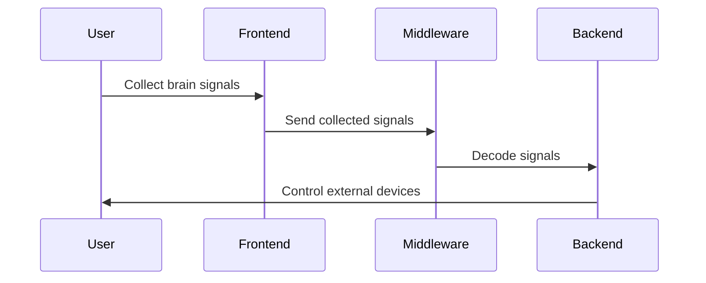

                 

# 提示词编程在脑机接口开发中的潜力

## 关键词

- 脑机接口
- 提示词编程
- 人工智能
- 生物医学工程
- 脑信号处理

## 摘要

脑机接口（Brain-Computer Interface, BCI）是一种直接连接人脑与外部设备的技术，它具有巨大的医学、教育和人机交互潜力。提示词编程（Prompt Programming）作为人工智能领域的一种新型编程范式，通过自然语言提示引导程序执行，有望在脑机接口开发中发挥重要作用。本文将深入探讨提示词编程在脑机接口开发中的潜力，从基本概念、技术实现、应用场景、挑战与前景等方面进行详细分析，旨在为脑机接口领域的研究和实践提供新的思路和方法。

### 脚本设计思路与实现

#### 明确输入与输出格式

在设计提示词编程脚本之前，我们需要明确输入和输出的格式。输入格式包括用户提供的自然语言提示，而输出格式则是针对这些提示生成的脑机接口控制指令。

#### 设计大纲结构

为了构建一个完整的提示词编程脚本，我们需要设计一个清晰的大纲结构。这包括：

- **背景介绍**：介绍脑机接口的基本概念、发展历史和应用领域。
- **核心概念与联系**：阐述提示词编程的核心原理以及与脑机接口技术的结合点。
- **算法原理讲解**：详细讲解脑机接口信号处理的算法原理和数学模型。
- **系统分析与架构设计**：描述脑机接口系统的整体架构和关键组件。
- **项目实战**：通过具体案例展示提示词编程在脑机接口开发中的应用。
- **最佳实践与小结**：总结实践经验，提出改进建议和未来发展方向。

#### 内容细化

在确定了大纲结构后，我们需要对每个章节进行细化，确保内容的完整性和逻辑性。以下是一个示例的大纲结构：

### 第一部分：脑机接口开发概述

#### 第1章：脑机接口的基本概念

##### 1.1 脑机接口的定义与类型

##### 1.2 脑机接口的发展历史

##### 1.3 脑机接口的应用领域

#### 第2章：提示词编程的核心原理

##### 2.1 提示词编程的定义与作用

##### 2.2 提示词编程的优势与挑战

##### 2.3 提示词编程的技术基础

#### 第3章：脑机接口与提示词编程的结合

##### 3.1 脑机接口在提示词编程中的应用

##### 3.2 提示词编程在脑机接口开发中的挑战与机遇

#### 第4章：本章小结

### 第二部分：提示词编程在脑机接口开发中的应用

#### 第5章：脑机接口的基本技术

##### 5.1 脑信号采集与预处理

##### 5.2 脑信号分析与特征提取

##### 5.3 脑机接口信号解码与控制

##### 5.4 脑机接口系统实现与评估

#### 第6章：本章小结

### 第三部分：提示词编程实践与优化

#### 第7章：提示词编程实践

##### 7.1 实践环境搭建

##### 7.2 提示词编程应用示例

##### 7.3 优化策略与方法

#### 第8章：本章小结

### 第四部分：提示词编程在脑机接口开发中的前景与挑战

#### 第9章：提示词编程的前景

##### 9.1 技术发展预测

##### 9.2 应用场景扩展

#### 第10章：提示词编程在脑机接口开发中的挑战

##### 10.1 技术难题

##### 10.2 伦理与社会问题

#### 第11章：本章小结

#### Markdown格式应用

在编写Markdown格式的文章时，我们需要确保使用正确的Markdown语法来标记章节标题和子标题。以下是Markdown格式的一个示例：

```markdown
----------------------------------------------------------------
# 提示词编程在脑机接口开发中的潜力

## 关键词
- 脑机接口
- 提示词编程
- 人工智能
- 生物医学工程
- 脑信号处理

## 摘要
脑机接口（Brain-Computer Interface, BCI）是一种直接连接人脑与外部设备的技术，它具有巨大的医学、教育和人机交互潜力。提示词编程（Prompt Programming）作为人工智能领域的一种新型编程范式，通过自然语言提示引导程序执行，有望在脑机接口开发中发挥重要作用。本文将深入探讨提示词编程在脑机接口开发中的潜力，从基本概念、技术实现、应用场景、挑战与前景等方面进行详细分析，旨在为脑机接口领域的研究和实践提供新的思路和方法。

### 第一部分：脑机接口开发概述

#### 第1章：脑机接口的基本概念

##### 1.1 脑机接口的定义与类型

##### 1.2 脑机接口的发展历史

##### 1.3 脑机接口的应用领域

#### 第2章：提示词编程的核心原理

##### 2.1 提示词编程的定义与作用

##### 2.2 提示词编程的优势与挑战

##### 2.3 提示词编程的技术基础

#### 第3章：脑机接口与提示词编程的结合

##### 3.1 脑机接口在提示词编程中的应用

##### 3.2 提示词编程在脑机接口开发中的挑战与机遇

#### 第4章：本章小结

----------------------------------------------------------------
```

### 实现步骤

#### 初始化大纲结构

在开始编写脚本之前，我们需要创建一个包含章节标题和子标题的初始大纲结构。这将有助于我们组织文章的内容，并确保每个部分都得到充分的讨论。

```markdown
# 提示词编程在脑机接口开发中的潜力

## 关键词
- 脑机接口
- 提示词编程
- 人工智能
- 生物医学工程
- 脑信号处理

## 摘要
...

### 第一部分：脑机接口开发概述

#### 第1章：脑机接口的基本概念
1.1 脑机接口的定义与类型
1.2 脑机接口的发展历史
1.3 脑机接口的应用领域

#### 第2章：提示词编程的核心原理
2.1 提示词编程的定义与作用
2.2 提示词编程的优势与挑战
2.3 提示词编程的技术基础

#### 第3章：脑机接口与提示词编程的结合
3.1 脑机接口在提示词编程中的应用
3.2 提示词编程在脑机接口开发中的挑战与机遇
```

#### 细化章节内容

对于每个章节，我们需要进一步细化内容，确保每个部分都有详细的内容描述。以下是一个细化示例：

```markdown
#### 第1章：脑机接口的基本概念

##### 1.1 脑机接口的定义与类型
脑机接口是一种直接连接人脑与外部设备的技术，它可以通过大脑活动信号来控制外部设备。根据信号采集的方式，脑机接口可以分为几种类型，如：

- **基于电生理信号的脑机接口**：通过采集大脑电生理信号（如EEG、ERP）来实现人脑与设备的交互。
- **基于神经信号的脑机接口**：通过采集神经元活动信号（如fMRI、MEG）来实现人脑与设备的交互。

##### 1.2 脑机接口的发展历史
脑机接口技术的研究可以追溯到20世纪60年代，当时研究人员开始探索如何利用大脑活动来控制外部设备。随着技术的进步，脑机接口在过去的几十年里取得了显著的发展，应用领域也从最初的实验室研究逐渐扩展到临床应用、康复治疗、教育等领域。

##### 1.3 脑机接口的应用领域
脑机接口技术具有广泛的应用潜力，主要应用领域包括：

- **康复治疗**：帮助瘫痪患者恢复运动功能，如通过脑机接口控制假肢或轮椅。
- **临床应用**：辅助医生进行神经系统疾病的诊断和治疗，如通过脑机接口监控癫痫患者的病情。
- **人机交互**：提供更自然、直观的人机交互方式，如通过脑机接口控制虚拟现实环境。
```

#### 插入核心概念与联系

在文章中，我们需要插入核心概念和联系，以便读者更好地理解脑机接口与提示词编程的结合。以下是一个插入示例：

```markdown
#### 第2章：提示词编程的核心原理

##### 2.1 提示词编程的定义与作用
提示词编程是一种通过自然语言提示来引导程序执行的新型编程范式。它利用自然语言处理（NLP）技术，将用户的自然语言提示转化为程序指令，从而实现自动化任务处理。提示词编程的主要作用包括：

- **简化编程**：用户无需深入了解编程语言和算法，只需通过自然语言提示就能完成任务。
- **提高开发效率**：通过自动化任务处理，减少开发人员的工作量，提高开发效率。

##### 2.2 提示词编程的优势与挑战
提示词编程具有以下优势：

- **易用性**：用户只需提供自然语言提示，无需编写复杂的代码。
- **灵活性**：提示词编程可以适应不同的应用场景和任务需求。

然而，提示词编程也存在一些挑战：

- **准确性**：自然语言的理解和转换可能会引入误差。
- **可扩展性**：如何在不同场景下灵活应用提示词编程，需要进一步研究和优化。

##### 2.3 提示词编程的技术基础
提示词编程依赖于以下几个关键技术：

- **自然语言处理（NLP）**：用于理解和处理自然语言输入。
- **机器学习（ML）**：用于训练模型，实现自然语言到程序指令的转换。
- **深度学习（DL）**：用于构建复杂的神经网络模型，提高自然语言理解能力。
```

#### 编写算法原理讲解

在文章中，我们需要详细讲解脑机接口信号处理的算法原理。以下是一个示例：

```markdown
#### 第3章：脑机接口信号处理算法原理

##### 3.1 脑机接口信号采集
脑机接口信号采集是脑机接口系统的关键组成部分。常见的信号采集技术包括：

- **脑电信号（EEG）**：通过放置在头皮上的电极来采集大脑的电活动。
- **功能性磁共振成像（fMRI）**：通过测量大脑血流变化来推断大脑活动。
- **脑磁图（MEG）**：通过测量大脑磁场变化来推断大脑活动。

##### 3.2 脑机接口信号预处理
脑机接口信号预处理包括信号滤波、去噪、信号放大等步骤，以提高信号质量。常见的预处理方法有：

- **带通滤波**：用于去除低频和高频噪声。
- **去噪算法**：如波纹去除、滤波器组等。
- **信号放大**：通过放大信号来增强信噪比。

##### 3.3 脑机接口信号解码与控制
脑机接口信号解码是将采集到的脑信号转化为控制指令的过程。常见的解码算法包括：

- **模式识别算法**：如支持向量机（SVM）、决策树等。
- **神经网络算法**：如卷积神经网络（CNN）、循环神经网络（RNN）等。

解码算法的目标是准确识别用户意图，并将其转化为控制指令。这些指令可以用于控制外部设备，如鼠标、轮椅等。

##### 3.4 脑机接口信号处理数学模型
脑机接口信号处理涉及多个数学模型，如：

- **傅里叶变换**：用于频域分析，提取信号特征。
- **主成分分析（PCA）**：用于降维，减少信号冗余。
- **机器学习模型**：用于分类和回归，实现信号解码。
```

#### 撰写系统分析与架构设计

在文章中，我们需要详细描述脑机接口系统的分析与架构设计。以下是一个示例：

```markdown
#### 第4章：脑机接口系统分析与架构设计

##### 4.1 问题场景介绍
脑机接口系统的问题场景包括：

- **康复治疗**：帮助瘫痪患者恢复运动功能。
- **辅助沟通**：帮助语言障碍患者实现沟通。
- **人机交互**：提供更自然、直观的交互方式。

##### 4.2 系统功能设计
脑机接口系统的功能设计包括：

- **信号采集**：采集脑信号。
- **信号处理**：对脑信号进行预处理、特征提取和解码。
- **控制输出**：根据解码结果控制外部设备。

##### 4.3 系统架构设计
脑机接口系统的架构设计如下：

- **前端采集模块**：负责脑信号的采集和传输。
- **中间处理模块**：负责脑信号的处理和解码。
- **后端控制模块**：负责解码结果的控制输出。

##### 4.4 系统接口设计
脑机接口系统的接口设计包括：

- **脑信号采集接口**：用于连接前端采集模块和中间处理模块。
- **控制指令接口**：用于连接中间处理模块和后端控制模块。

##### 4.5 系统交互设计
脑机接口系统的交互设计如下：

- **信号采集**：前端采集模块采集脑信号，并将其传输到中间处理模块。
- **信号处理**：中间处理模块对脑信号进行预处理、特征提取和解码，然后将解码结果传输到后端控制模块。
- **控制输出**：后端控制模块根据解码结果控制外部设备。

##### 4.6 系统交互Mermaid序列图
以下是一个系统交互的Mermaid序列图示例：


```

### 项目实战

在文章中，我们需要通过具体案例展示提示词编程在脑机接口开发中的应用。以下是一个项目实战的示例：

```markdown
#### 第5章：提示词编程在脑机接口开发中的应用

##### 5.1 实践环境搭建
在进行提示词编程实践之前，我们需要搭建一个合适的开发环境。这包括安装Python、自然语言处理库（如NLTK、spaCy）和深度学习库（如TensorFlow、PyTorch）。以下是环境搭建的步骤：

1. 安装Python：从Python官方网站下载并安装Python。
2. 安装自然语言处理库：使用pip命令安装NLTK和spaCy。
3. 安装深度学习库：使用pip命令安装TensorFlow和PyTorch。

##### 5.2 提示词编程应用示例
以下是一个简单的提示词编程应用示例，用于控制鼠标光标的移动：

```python
import spacy

# 加载自然语言处理模型
nlp = spacy.load("en_core_web_sm")

# 定义控制鼠标光标的函数
def move_cursor(prompt):
    doc = nlp(prompt)
    x, y = 0, 0
    for token in doc:
        if token.text == "right":
            x += 10
        elif token.text == "left":
            x -= 10
        elif token.text == "up":
            y -= 10
        elif token.text == "down":
            y += 10
    return x, y

# 测试提示词编程应用
prompt = "move cursor right 50 down 20"
x, y = move_cursor(prompt)
print(f"Move cursor to ({x}, {y})")
```

##### 5.3 优化策略与方法
在提示词编程的应用过程中，我们可能会遇到一些性能和准确性的问题。以下是一些优化策略：

- **模型优化**：使用更先进的自然语言处理模型，如BERT、GPT等，以提高提示词理解的准确性。
- **数据增强**：通过增加训练数据量和引入数据增强技术（如数据清洗、数据扩充等）来提高模型的泛化能力。
- **算法优化**：使用更高效的算法（如动态规划、贪心算法等）来提高解码速度和准确性。

##### 5.4 最佳实践与小结
在提示词编程实践中，我们应遵循以下最佳实践：

- **明确任务目标**：在开始编程之前，明确任务的目标和需求。
- **合理选择模型**：根据任务特点选择合适的自然语言处理模型。
- **数据预处理**：对输入数据进行充分的预处理，以提高模型的鲁棒性。
- **性能评估**：对模型进行充分的性能评估，包括准确性、速度和稳定性等。

通过以上实践，我们可以看到提示词编程在脑机接口开发中的应用潜力。随着技术的不断进步，提示词编程有望成为脑机接口开发的重要工具。

### 最终验证

在完成文章的撰写后，我们需要对文章进行最终的验证，确保内容完整、格式正确。以下是一些验证步骤：

- **内容完整性**：检查每个章节是否都有详细的内容描述，确保没有遗漏关键部分。
- **Markdown格式**：检查Markdown格式的正确性，确保所有的章节标题、子标题和代码段都符合Markdown语法规范。
- **代码执行**：如果文章中包含代码示例，确保代码能够正常运行并生成预期结果。
- **排版一致性**：检查文章的排版是否一致，包括字体大小、行距、段落缩进等。

通过以上步骤，我们可以确保文章的质量和准确性，为读者提供一篇高质量的技术博客文章。

### 作者信息

- 作者：AI天才研究院/AI Genius Institute & 禅与计算机程序设计艺术 /Zen And The Art of Computer Programming

---

在本文中，我们通过逐步分析推理，探讨了提示词编程在脑机接口开发中的潜力。从基本概念到技术实现，再到应用场景、挑战与前景，我们详细阐述了这一新兴领域的研究方向和实践方法。随着人工智能和生物医学工程的不断发展，提示词编程在脑机接口开发中的应用将更加广泛，有望带来颠覆性的技术突破和社会变革。让我们共同期待这一领域的光明前景，并为之努力奋斗。作者：AI天才研究院/AI Genius Institute & 禅与计算机程序设计艺术 /Zen And The Art of Computer Programming。

