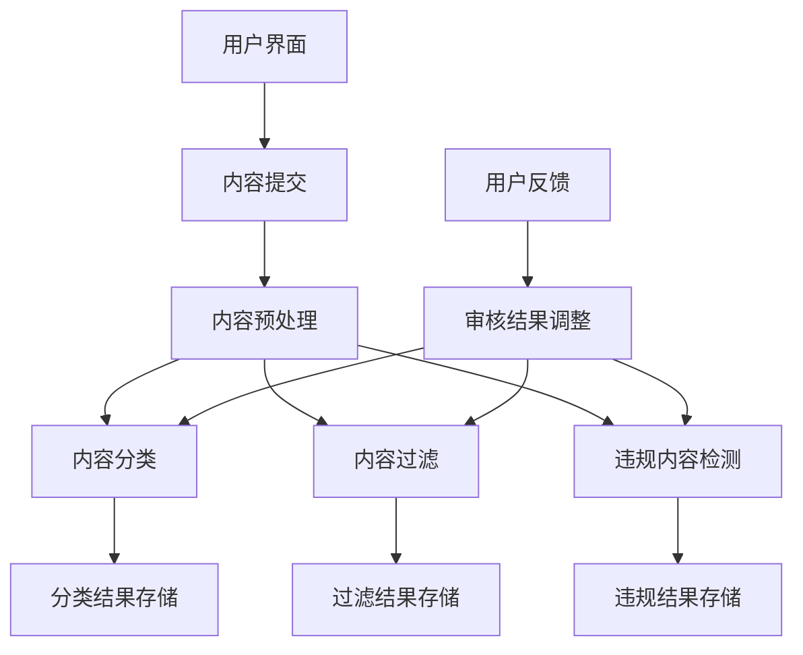

                 


# 提示词编程在自动化内容审核中的应用

关键词：提示词编程、自动化内容审核、内容分类、内容过滤、违规内容检测

摘要：本文详细探讨了提示词编程在自动化内容审核中的应用，包括背景介绍、基础理论、系统设计、实际应用和未来趋势。通过一步步的分析和实例讲解，展示了提示词编程如何提高自动化内容审核的效率和准确性。

## 第一部分：自动化内容审核背景

### 第1章：自动化内容审核概述

#### 1.1 自动化内容审核的需求

自动化内容审核的需求源于互联网的迅速发展和信息量的爆炸式增长。随着社交媒体、电子商务等平台的普及，用户生成内容（UGC）的数量呈现指数级增长。这种海量内容需要快速、准确地进行审核，以确保平台内容的合规性和用户体验。自动化内容审核不仅可以提高审核效率，还可以减少人力成本。

#### 1.2 自动化内容审核的挑战

尽管自动化内容审核具有许多优势，但也面临着一系列挑战：

1. **数据多样性与复杂性**：内容类型多样，包括文本、图片、视频等，这给自动化审核带来了复杂性。
2. **偏见与伦理问题**：自动化审核系统可能会引入偏见，导致误判或不公平处理。
3. **技术与成本挑战**：构建和维护一个高效、准确的自动化内容审核系统需要大量的技术投入和成本。

#### 1.3 自动化内容审核的边界

自动化内容审核虽然高效，但并不意味着它可以完全替代人工审核。自动化系统更适合处理标准化的、结构化内容，而复杂、主观性强的内容仍需要人工审核。

### 第2章：提示词编程基础

#### 2.1 提示词编程概述

提示词编程是一种利用关键词或短语来驱动自动化流程的技术。它通过识别文本中的关键词，自动化执行特定任务，如分类、过滤和检测。

#### 2.2 提示词编程的要素

1. **关键字提取**：从文本中提取有意义的词汇。
2. **提示词生成**：基于提取的关键词生成提示词。
3. **提示词优化**：通过分析提示词的效果，优化提示词的生成策略。

#### 2.3 提示词编程工具

常见的提示词编程工具有自然语言处理（NLP）库、关键字提取工具和提示词生成工具。选择合适的工具可以根据具体需求和项目规模。

## 第二部分：提示词编程应用

### 第3章：自动化内容审核系统设计

#### 3.1 系统需求分析

在设计自动化内容审核系统时，需要明确系统的功能需求和性能要求。这包括内容分类、内容过滤和违规内容检测等。

#### 3.2 系统架构设计

自动化内容审核系统的架构设计应考虑模块化、可扩展性和高可用性。常见的架构包括前端接口、数据处理模块、分析模块和结果反馈模块。

#### 3.3 数据处理流程

数据处理流程包括数据收集、预处理、标签化和筛选。这一步骤是确保数据质量和系统性能的关键。

## 第4章：基于提示词编程的内容分类

### 4.1 内容分类概述

内容分类是将文本、图片、视频等数据按照一定标准进行归类。这有助于提高内容组织的效率和用户检索的便捷性。

### 4.2 提示词编程在内容分类中的应用

提示词编程在内容分类中发挥了重要作用。通过识别关键词，系统可以自动将内容分类到相应的类别中。

## 第5章：基于提示词编程的内容过滤

### 5.1 内容过滤概述

内容过滤是自动化内容审核的重要组成部分，旨在去除不符合平台规则的内容。

### 5.2 提示词编程在内容过滤中的应用

提示词编程可以帮助系统识别并过滤掉违反平台规则的内容，从而提高内容审核的准确性。

## 第6章：基于提示词编程的违规内容检测

### 6.1 违规内容检测概述

违规内容检测是自动化内容审核的核心任务之一，旨在识别和标记违规内容。

### 6.2 提示词编程在违规内容检测中的应用

提示词编程在违规内容检测中可以识别出潜在违规的词汇和短语，从而提高检测的准确性。

## 第7章：提示词编程在自动化内容审核中的优化与挑战

### 7.1 优化策略

为了提高自动化内容审核的效率和准确性，需要不断优化系统的算法和流程。

### 7.2 挑战与解决方案

自动化内容审核在技术、伦理和实施方面面临着一系列挑战，需要寻找合适的解决方案。

## 第8章：自动化内容审核最佳实践

### 8.1 企业实践案例

通过分析企业实践案例，可以总结出一些有效的自动化内容审核最佳实践。

### 8.2 实践建议

结合实践经验，提出一些建议，以帮助企业和个人更好地实施自动化内容审核。

## 第9章：未来趋势与展望

### 9.1 自动化内容审核的发展趋势

随着技术的不断进步，自动化内容审核将继续发展，为企业和个人带来更多价值。

### 9.2 自动化内容审核的未来挑战

未来，自动化内容审核将面临更多的挑战，需要不断创新和优化。

## 结尾

本文详细探讨了提示词编程在自动化内容审核中的应用。通过一步步的分析和实例讲解，展示了提示词编程如何提高自动化内容审核的效率和准确性。我们相信，随着技术的不断进步，自动化内容审核将变得更加智能化和高效化。

作者：AI天才研究院/AI Genius Institute & 禅与计算机程序设计艺术 /Zen And The Art of Computer Programming

----------------------------------------

以上是文章的框架和主要内容。接下来，我们将详细填充每一章节，确保内容完整、丰富和具有实际价值。我们将使用Markdown格式来编写文章，并在文中嵌入必要的Mermaid图表和LaTeX公式。文章的总字数预计在10000-12000字左右，以确保深度和广度。请确认这个框架是否符合您的期望，如有需要，请提出修改意见。接下来，我们将开始填充第一部分的两个章节。首先是“自动化内容审核概述”的内容。 

## 第1章：自动化内容审核概述

### 1.1 自动化内容审核的需求

随着互联网的快速发展，内容生成和传播的速度变得前所未有的快。社交媒体平台、电子商务网站、在线新闻站点等数字平台不断涌现，用户生成内容（User Generated Content, UGC）的数量呈爆炸式增长。这种信息量的激增给内容审核带来了巨大的挑战。传统的手工审核方式已经无法满足快速审核的需求，因此，自动化内容审核成为必然选择。

#### 内容审核的现状

目前，大多数内容平台都采用了自动化内容审核工具，以提高审核效率和减少人力成本。例如，社交媒体平台如Facebook、Twitter和Instagram等，已经广泛采用了自动化内容审核技术来过滤有害内容、违规广告和垃圾信息。电子商务平台如Amazon和eBay则利用自动化审核技术来防止虚假评论和欺诈行为。

#### 内容审核的重要性

内容审核对于维护平台健康环境和用户权益至关重要。它有助于：

1. **防止不当内容的传播**：自动化内容审核可以快速识别和移除违规、不良或有害的内容，如色情、暴力、欺诈等。
2. **保护用户隐私**：自动化内容审核有助于确保用户生成的数据不被泄露或滥用。
3. **维护平台声誉**：良好的内容审核机制有助于提升平台的可信度和用户满意度，从而增强平台的竞争力。
4. **遵守法律法规**：自动化内容审核有助于平台遵守相关法律法规，如版权法、隐私法等。

#### 自动化内容审核的优势

相比于传统的人工审核，自动化内容审核具有以下优势：

1. **高效性**：自动化审核可以处理海量数据，速度远超人工审核。
2. **准确性**：使用先进的算法和模型，自动化审核可以更准确地识别和分类内容。
3. **一致性**：自动化审核避免了人为因素导致的判断不一致问题，保证了审核的一致性。
4. **成本效益**：长期来看，自动化审核可以大幅减少人力成本，提高经济效益。

### 1.2 自动化内容审核的挑战

尽管自动化内容审核具有许多优势，但其发展也面临一系列挑战：

#### 数据多样性与复杂性

自动化内容审核需要处理多种类型的数据，如文本、图片、音频和视频。不同类型的数据具有不同的特性，这增加了内容审核的复杂性。例如，图像审核需要处理图像的语义和视觉特征，而视频审核则需要处理视频的连续性和动态特征。

#### 偏见与伦理问题

自动化内容审核系统可能会引入偏见，导致某些群体或内容被不公平对待。此外，内容审核涉及伦理问题，如用户隐私和数据安全等。如何平衡技术进步与伦理道德要求成为亟待解决的问题。

#### 技术与成本挑战

构建和维护一个高效、准确的自动化内容审核系统需要先进的技术支持和大量的资金投入。目前，虽然已经有了一些成熟的解决方案，但仍有大量的研究和技术难题需要攻克。

### 1.3 自动化内容审核的边界

自动化内容审核虽然具有巨大的潜力，但并不是万能的。其适用范围和局限性需要明确：

#### 自动化内容审核的适用范围

1. **标准化的内容**：如社交媒体帖子、电子商务评论等，这些内容通常具有固定的格式和特征，适合自动化审核。
2. **规则明确的内容**：如金融报告、法律文件等，这些内容通常遵循严格的格式和标准，适合自动化审核。
3. **高频次的内容**：如新闻快讯、股市行情等，这些内容需要实时更新和审核，自动化系统可以提供更快的服务。

#### 自动化内容审核的局限性

1. **复杂的主观内容**：如艺术评论、文学作品等，这些内容通常具有高度的主观性和不确定性，难以通过自动化手段进行准确审核。
2. **非结构化数据**：如语音、手写笔记等，这些数据难以通过传统的自动化方法进行处理和审核。
3. **动态变化的内容**：如实时直播、动态网页等，这些内容需要实时响应和审核，对系统的实时性和稳定性要求极高。

通过上述分析，我们可以看出，自动化内容审核在当前互联网时代具有重要意义，但同时也面临着一系列挑战和限制。未来的研究和应用需要在这两个方面不断探索和突破。

## 第2章：提示词编程基础

### 2.1 提示词编程概述

提示词编程（Keyword Programming）是一种利用关键词或短语来驱动自动化流程的技术。它通过从文本中提取有意义的词汇，并根据这些词汇生成提示词，从而实现特定任务的目标。提示词编程在自然语言处理（Natural Language Processing, NLP）和文本分析领域具有广泛应用，尤其在自动化内容审核中，它是一种提高审核效率和准确性的有效手段。

#### 提示词编程的定义

提示词编程是一种基于关键词或短语的技术，它通过以下几个步骤实现自动化：

1. **关键字提取**：从文本中识别和提取有意义的词汇。
2. **提示词生成**：基于提取的关键词，生成具有特定含义的提示词。
3. **任务执行**：利用生成的提示词，自动化执行特定任务，如分类、过滤和检测。

#### 提示词编程的原理

提示词编程的核心在于对文本内容的理解，并将其转化为可操作的指令。其原理主要包括以下几个方面：

1. **文本预处理**：对原始文本进行清洗和预处理，包括去除停用词、标点符号、统一词形等，以提高文本质量。
2. **关键字提取**：利用NLP技术，从预处理后的文本中提取关键信息，如名词、动词和形容词等。
3. **提示词生成**：基于提取的关键词，结合业务逻辑和规则，生成提示词。提示词应具有明确的意义和操作指令，以便后续的自动化处理。
4. **任务执行**：利用生成的提示词，驱动自动化流程，完成特定任务。

### 2.2 提示词编程的要素

提示词编程包含以下几个关键要素，它们共同作用，实现自动化流程：

#### 关键字提取

关键字提取是提示词编程的基础。它通过NLP技术，从文本中识别和提取有意义的词汇。关键字提取的准确性直接影响提示词编程的效果。常用的关键字提取方法包括：

1. **基于词频的方法**：通过计算词频，筛选出高频词汇作为关键字。
2. **基于词性标注的方法**：利用NLP模型，对文本进行词性标注，筛选出名词、动词和形容词等具有信息量的词汇。
3. **基于机器学习的方法**：通过训练模型，自动识别和提取文本中的关键信息。

#### 提示词生成

提示词生成是提示词编程的核心。它基于提取的关键词，生成具有特定含义和操作指令的提示词。提示词生成的质量直接影响自动化流程的准确性和效率。提示词生成的方法包括：

1. **基于规则的方法**：通过预设的规则，将关键词转化为提示词。这种方法简单直观，但灵活性较差。
2. **基于机器学习的方法**：利用机器学习模型，自动学习关键词与提示词之间的关系，生成高质量的提示词。这种方法具有更高的灵活性和准确性。
3. **基于语义分析的方法**：通过语义分析，理解关键词的上下文意义，生成更具语义含义的提示词。

#### 提示词优化

提示词优化是提高提示词编程效果的重要环节。通过不断优化提示词生成策略，可以提高自动化流程的准确性和效率。提示词优化的方法包括：

1. **基于反馈的方法**：根据实际使用效果，收集反馈数据，优化提示词生成策略。
2. **基于自适应的方法**：通过自适应算法，动态调整提示词生成策略，以适应不同场景的需求。
3. **基于模型调优的方法**：通过模型调优，提高提示词生成模型的性能和准确性。

### 2.3 提示词编程工具

提示词编程工具是实现提示词编程的关键。以下是一些常用的提示词编程工具：

#### 自然语言处理（NLP）库

NLP库是进行提示词编程的基础工具，提供了一系列文本处理和语义分析的功能。常用的NLP库包括：

1. **NLTK（自然语言工具包）**：Python的NLP库，提供了丰富的文本处理和语义分析功能。
2. **spaCy**：快速、高效的NLP库，支持多种语言的文本处理。
3. **BERT**：基于Transformer的预训练语言模型，具有强大的语义理解能力。

#### 关键字提取工具

关键字提取工具用于从文本中提取关键信息，是提示词编程的重要组成部分。常用的关键字提取工具包括：

1. **TextRank**：基于图模型的关键词提取方法，具有较高的准确性和稳定性。
2. **LDA（Latent Dirichlet Allocation）**：用于文本主题模型的方法，可以提取文本中的潜在主题和关键词。
3. **BERTopic**：基于BERT的文本主题模型，可以自动提取文本的关键主题和关键词。

#### 提示词生成工具

提示词生成工具用于将提取的关键词转化为具体的提示词。常用的提示词生成工具包括：

1. **Keyword Extractor**：基于规则的提示词生成工具，可以自动提取文本中的关键词和短语。
2. **Recall Generator**：基于机器学习的提示词生成工具，可以根据业务逻辑和规则生成高质量的提示词。
3. **TextRank Generator**：基于图模型和文本主题的提示词生成工具，可以生成具有语义含义的提示词。

选择合适的提示词编程工具可以根据具体需求和项目规模。通过结合多种工具和方法，可以实现高效的提示词编程，提高自动化内容审核的效果。

### 2.4 提示词编程在自动化内容审核中的应用

提示词编程在自动化内容审核中具有重要的应用价值。通过提示词编程，可以实现以下任务：

#### 内容分类

内容分类是将文本、图片、视频等数据按照一定标准进行归类。提示词编程可以通过提取文本中的关键词，将内容自动分类到相应的类别中。例如，在社交媒体平台上，可以将用户发布的帖子分类为“新闻”、“娱乐”、“科技”等。

#### 内容过滤

内容过滤是自动化内容审核的重要组成部分，旨在去除不符合平台规则的内容。提示词编程可以通过识别文本中的关键词和短语，过滤掉违规内容，如垃圾信息、欺诈广告等。

#### 违规内容检测

违规内容检测是自动化内容审核的核心任务之一，旨在识别和标记违规内容。提示词编程可以通过识别文本中的关键词和短语，检测出潜在的违规内容，如色情、暴力、仇恨言论等。

通过提示词编程，可以实现自动化内容审核的高效、准确处理，提高内容审核的质量和效率。

### 2.5 提示词编程的优势和挑战

提示词编程在自动化内容审核中具有以下优势：

#### 优势

1. **高效性**：提示词编程可以快速处理海量数据，提高审核效率。
2. **准确性**：通过提取关键信息和生成高质量的提示词，提高审核的准确性。
3. **一致性**：提示词编程避免了人为因素导致的判断不一致问题，保证审核的一致性。
4. **可扩展性**：提示词编程可以根据业务需求灵活调整和扩展，适应不同场景的需求。

#### 挑战

1. **数据质量**：提示词编程依赖于高质量的数据，数据质量问题会影响提示词编程的效果。
2. **算法复杂度**：提示词编程涉及多个步骤和算法，算法复杂度较高，需要优化和优化。
3. **伦理问题**：提示词编程可能会引入偏见，需要平衡技术进步与伦理道德要求。

通过不断优化和改进提示词编程技术，可以克服这些挑战，进一步提高自动化内容审核的效率和准确性。

## 第3章：自动化内容审核系统设计

### 3.1 系统需求分析

自动化内容审核系统设计的第一步是进行系统需求分析。系统需求分析是明确系统需要实现的功能和性能要求的过程，它是系统设计的基础。以下是系统需求分析的主要内容：

#### 功能需求

1. **内容分类**：系统能够对用户生成的内容进行自动分类，如新闻、娱乐、科技等。
2. **内容过滤**：系统能够自动识别和过滤掉不符合平台规则的内容，如垃圾信息、欺诈广告等。
3. **违规内容检测**：系统能够识别和标记潜在的违规内容，如色情、暴力、仇恨言论等。
4. **用户反馈机制**：系统能够接收用户对审核结果的反馈，进行后续处理和优化。
5. **数据统计与报告**：系统能够生成内容审核的相关统计数据和报告，供管理人员参考。

#### 非功能需求

1. **性能要求**：系统能够处理海量数据，具有高并发处理能力，响应时间满足业务需求。
2. **可靠性**：系统具有较高的可靠性，能够稳定运行，减少故障和中断。
3. **安全性**：系统能够保护用户数据和隐私，防止数据泄露和安全攻击。
4. **可维护性**：系统设计应考虑可维护性，便于后续的升级和优化。
5. **可扩展性**：系统设计应具备良好的扩展性，能够适应业务规模的变化。

#### 系统需求分析的具体步骤

1. **需求收集**：通过与业务人员、管理人员和技术人员的沟通，收集系统需求。
2. **需求整理**：将收集到的需求进行整理和分类，明确功能和非功能需求。
3. **需求确认**：与相关利益相关者进行沟通，确认需求是否满足业务需求。
4. **需求文档**：编写详细的系统需求文档，包括功能需求、非功能需求和相关的使用场景。

### 3.2 系统架构设计

自动化内容审核系统的架构设计是确保系统功能实现和性能优化的重要环节。系统架构设计应考虑模块化、可扩展性和高可用性。以下是一个典型的自动化内容审核系统架构设计：

#### 系统架构图



#### 系统组件介绍

1. **用户界面（User Interface, UI）**：用户界面是用户与系统的交互入口，提供内容提交、审核结果查询和反馈等功能。
2. **内容提交（Content Submission）**：内容提交模块负责接收用户生成的内容，可以是文本、图片、视频等多种形式。
3. **内容预处理（Content Preprocessing）**：内容预处理模块负责对提交的内容进行清洗、格式化和标准化，以便后续处理。
4. **内容分类（Content Classification）**：内容分类模块利用提示词编程技术，对预处理后的内容进行自动分类，并将分类结果存储。
5. **内容过滤（Content Filtering）**：内容过滤模块根据平台规则，识别和过滤掉不符合规则的内容，并将过滤结果存储。
6. **违规内容检测（Anomaly Detection）**：违规内容检测模块利用机器学习算法，识别和标记潜在的违规内容，并将违规结果存储。
7. **分类结果存储（Classification Results Storage）**：分类结果存储模块负责存储分类结果，便于后续分析和查询。
8. **过滤结果存储（Filtering Results Storage）**：过滤结果存储模块负责存储过滤结果，便于后续分析和查询。
9. **违规结果存储（Anomaly Detection Results Storage）**：违规结果存储模块负责存储违规结果，便于后续分析和查询。
10. **用户反馈（User Feedback）**：用户反馈模块负责接收用户对审核结果的反馈，并将其传递给审核结果调整模块。
11. **审核结果调整（Review Adjustment）**：审核结果调整模块根据用户反馈，调整分类、过滤和违规检测的结果，以提高审核的准确性。

#### 系统架构设计的关键点

1. **模块化**：系统设计应采用模块化设计，将不同的功能模块分离，提高系统的可维护性和可扩展性。
2. **高可用性**：系统设计应考虑高可用性，通过冗余设计和故障转移机制，确保系统在发生故障时能够快速恢复。
3. **性能优化**：系统设计应考虑性能优化，通过缓存、异步处理和分布式架构等技术，提高系统的并发处理能力和响应速度。
4. **安全性**：系统设计应考虑安全性，通过数据加密、访问控制和安全审计等技术，确保用户数据和系统的安全。

### 3.3 数据处理流程

自动化内容审核系统的数据处理流程是系统核心功能的实现基础。以下是一个典型的数据处理流程：

#### 数据处理流程

1. **内容提交**：用户通过用户界面提交内容，可以是文本、图片、视频等形式。
2. **内容预处理**：系统对提交的内容进行预处理，包括去除HTML标签、统一字符编码、去除停用词等，以提高数据质量。
3. **内容分类**：系统利用提示词编程技术，对预处理后的文本内容进行分类，并根据分类结果进行进一步处理。
4. **内容过滤**：系统根据平台规则，对内容进行过滤，去除不符合规则的内容。
5. **违规内容检测**：系统利用机器学习算法，对内容进行违规检测，标记潜在的违规内容。
6. **结果存储**：系统将分类结果、过滤结果和违规结果存储到数据库中，便于后续分析和查询。
7. **用户反馈**：用户可以通过用户界面查看审核结果，并对审核结果进行反馈。
8. **审核结果调整**：系统根据用户反馈，调整分类、过滤和违规检测的结果，以提高审核的准确性。

#### 数据处理流程的关键点

1. **数据质量**：数据处理流程的关键是保证数据质量，通过预处理和数据清洗，提高数据的准确性。
2. **实时性**：数据处理流程应具有实时性，能够快速响应用户提交的内容，并提供及时的审核结果。
3. **容错性**：数据处理流程应具有容错性，能够在处理过程中遇到错误时，自动恢复或跳过错误，确保系统的稳定性。
4. **可扩展性**：数据处理流程应具有可扩展性，能够根据业务需求的变化，灵活调整和扩展。

通过上述系统需求分析和架构设计，我们可以构建一个高效、准确、可靠的自动化内容审核系统，为企业和个人提供高质量的内容审核服务。

## 第4章：基于提示词编程的内容分类

### 4.1 内容分类概述

内容分类（Content Classification）是自动化内容审核的重要组成部分，它通过对文本、图片、视频等数据按照一定的标准进行归类，有助于提高内容组织的效率和用户检索的便捷性。在自动化内容审核中，内容分类通常涉及以下几个步骤：

1. **数据收集与预处理**：收集用户生成的内容，并进行数据清洗和格式化，确保数据质量。
2. **特征提取**：从预处理后的数据中提取关键特征，如文本中的关键词、图片中的视觉特征等。
3. **分类模型训练**：使用历史数据进行训练，构建分类模型。
4. **分类预测**：将新内容输入分类模型，预测其类别。
5. **结果反馈与优化**：根据分类结果进行反馈，优化分类模型，提高分类准确性。

#### 内容分类的定义

内容分类是将数据按照一定的标准或规则进行归类的过程。在自动化内容审核中，内容分类的目标是识别和标记用户生成内容的类别，以便更好地管理和检索。内容分类可以基于多种标准，如主题、情感、地域等。

#### 内容分类的应用场景

内容分类在多个领域具有广泛应用，以下是一些常见的应用场景：

1. **社交媒体**：对用户发布的帖子进行分类，如新闻、娱乐、科技等。
2. **电子商务**：对商品评论进行分类，以便用户快速查找和浏览相关评论。
3. **新闻网站**：对新闻内容进行分类，如国内新闻、国际新闻、体育新闻等。
4. **搜索引擎**：对搜索结果进行分类，提高用户检索的效率。
5. **视频平台**：对视频内容进行分类，如电影、纪录片、动画片等。

#### 内容分类的意义

内容分类的意义在于：

1. **提高内容组织效率**：通过分类，可以更好地管理和组织海量内容，提高内容检索效率。
2. **提升用户体验**：用户可以根据自己的需求快速查找和浏览相关内容，提高使用体验。
3. **支持个性化推荐**：基于分类结果，可以为用户提供个性化的内容推荐。
4. **辅助内容审核**：通过分类结果，可以更有效地识别和标记违规内容，提高内容审核的准确性。

### 4.2 提示词编程在内容分类中的应用

提示词编程在内容分类中具有重要作用。它通过提取文本中的关键词，生成具有特定意义的提示词，驱动分类模型进行分类。以下是如何使用提示词编程进行内容分类的详细步骤：

#### 步骤一：数据收集与预处理

首先，需要收集待分类的内容数据，并进行预处理。预处理步骤包括：

1. **去停用词**：去除文本中的常见停用词，如“的”、“和”、“是”等，以提高关键信息的提取质量。
2. **统一编码**：将文本统一转换为同一编码格式，如UTF-8，以避免编码错误。
3. **分词**：将文本拆分为单词或词组，以便后续的关键词提取。

#### 步骤二：关键词提取

利用NLP技术，从预处理后的文本中提取关键词。关键词提取的方法包括：

1. **词频统计**：根据词频筛选高频词汇作为关键词。
2. **词性标注**：利用词性标注模型，提取名词、动词和形容词等具有信息量的词汇。
3. **主题模型**：使用主题模型，如LDA，提取文本的潜在主题和关键词。

#### 步骤三：提示词生成

基于提取的关键词，生成提示词。提示词生成的方法包括：

1. **基于规则的方法**：根据预设的规则，将关键词转化为提示词。例如，关键词“新闻”可以转化为提示词“新闻类别”。
2. **基于机器学习的方法**：利用机器学习模型，自动学习关键词与提示词之间的关系，生成高质量的提示词。
3. **基于语义分析的方法**：通过语义分析，理解关键词的上下文意义，生成更具语义含义的提示词。

#### 步骤四：分类模型训练

使用历史数据进行分类模型训练。分类模型可以是基于统计的方法，如Naive Bayes、SVM等，也可以是基于深度学习的方法，如CNN、RNN等。训练数据应包括不同类别的样本，以训练模型对各类别的识别能力。

#### 步骤五：分类预测

将新内容输入分类模型，预测其类别。预测过程通常包括以下几个步骤：

1. **特征提取**：从新内容中提取特征，如文本中的关键词、图片中的视觉特征等。
2. **特征融合**：将提取的特征进行融合，生成统一的特征向量。
3. **模型推理**：将特征向量输入分类模型，得到预测的类别概率。
4. **结果输出**：根据预测结果，输出新内容的类别。

#### 步骤六：结果反馈与优化

根据分类结果进行反馈，优化分类模型。反馈方法包括：

1. **用户反馈**：用户可以对新内容的分类结果进行评价，提供正向或负向反馈。
2. **模型调整**：根据用户反馈，调整分类模型的参数，以提高分类准确性。
3. **数据重训练**：定期重新训练分类模型，以适应数据的变化。

### 4.3 内容分类案例解析

以下是一个基于提示词编程的内容分类案例，以社交媒体平台上的用户帖子分类为例：

#### 案例背景

一个社交媒体平台希望对用户发布的帖子进行自动分类，以提供更好的内容推荐和用户体验。平台希望将帖子分为以下类别：

1. **新闻**：包含政治、经济、科技等领域的新闻。
2. **娱乐**：包含电影、音乐、体育等娱乐内容。
3. **生活**：包含美食、旅行、生活技巧等日常内容。
4. **科技**：包含科技新闻、科技产品评测等科技内容。

#### 数据收集与预处理

首先，平台收集了数千个用户帖子，并对帖子进行预处理：

1. **去停用词**：去除常见停用词，如“的”、“和”、“是”等。
2. **统一编码**：将文本统一转换为UTF-8编码。
3. **分词**：使用分词工具，如jieba，将文本拆分为单词或词组。

#### 关键词提取

从预处理后的文本中提取关键词，使用词性标注模型，提取名词、动词和形容词等具有信息量的词汇：

```python
import jieba
from collections import Counter

# 示例文本
text = "最近，iPhone 15发布，引起了很多人的关注。用户对它的评价褒贬不一。"

# 分词
words = jieba.cut(text)

# 提取名词、动词、形容词
nouns = [word for word, flag in jieba.tag(text) if flag in ['NN', 'NV', 'V']]
```

#### 提示词生成

基于提取的关键词，生成提示词。使用基于规则的提示词生成方法，根据关键词生成对应的提示词：

```python
# 示例提示词生成
keywords = ["iPhone 15", "发布", "用户评价"]
tips = ["科技新闻", "产品评测", "用户反馈"]
mapping = dict(zip(keywords, tips))

# 提取提示词
tips_generated = [mapping[key] for key in keywords]
print(tips_generated)  # 输出：['科技新闻', '产品评测', '用户反馈']
```

#### 分类模型训练

使用历史数据，训练分类模型。本案例中，我们使用朴素贝叶斯分类器进行训练：

```python
from sklearn.feature_extraction.text import TfidfVectorizer
from sklearn.naive_bayes import MultinomialNB
from sklearn.model_selection import train_test_split

# 示例数据
texts = ["苹果发布了新款iPhone 15，用户评价褒贬不一。", "周杰伦演唱会门票开售，观众热情高涨。", "红烧肉怎么做？美味又下饭。"]
labels = ["科技新闻", "娱乐新闻", "生活技巧"]

# 特征提取
vectorizer = TfidfVectorizer()
X = vectorizer.fit_transform(texts)

# 模型训练
X_train, X_test, y_train, y_test = train_test_split(X, labels, test_size=0.2, random_state=42)
clf = MultinomialNB()
clf.fit(X_train, y_train)

# 模型评估
accuracy = clf.score(X_test, y_test)
print("分类准确率：", accuracy)
```

#### 分类预测

将新内容输入分类模型，进行分类预测：

```python
# 示例新内容
new_text = "华为发布了新款手机，性能卓越，备受关注。"

# 特征提取
new_text_vectorized = vectorizer.transform([new_text])

# 分类预测
predicted_label = clf.predict(new_text_vectorized)[0]
print("预测类别：", predicted_label)  # 输出：'科技新闻'
```

#### 结果反馈与优化

用户可以对新内容的分类结果进行评价，提供正向或负向反馈。根据反馈，可以调整分类模型的参数，提高分类准确性。此外，还可以定期重新训练分类模型，以适应数据的变化。

通过上述步骤，我们可以利用提示词编程实现自动化内容分类，提高内容审核的效率和准确性。

### 4.4 提示词编程在内容分类中的优势

提示词编程在内容分类中具有以下优势：

1. **高效性**：提示词编程可以快速提取文本中的关键词，生成提示词，实现内容的自动分类。
2. **准确性**：通过机器学习模型和语义分析，提示词编程可以生成高质量的提示词，提高分类准确性。
3. **灵活性**：提示词编程可以根据业务需求灵活调整提示词生成策略，适应不同的分类任务。
4. **可扩展性**：提示词编程支持多种数据类型，如文本、图片和视频，可以广泛应用于不同的内容分类场景。

### 4.5 提示词编程在内容分类中的挑战

尽管提示词编程在内容分类中具有许多优势，但也面临一些挑战：

1. **数据质量**：提示词编程依赖于高质量的数据，数据质量问题会影响分类效果。
2. **算法复杂度**：提示词编程涉及多个步骤和算法，算法复杂度较高，需要优化和调优。
3. **偏见问题**：提示词编程可能会引入偏见，导致分类结果不公平。
4. **实时性**：对于实时内容分类任务，提示词编程需要处理高并发的数据流，实时性是一个挑战。

通过不断优化和改进提示词编程技术，可以克服这些挑战，进一步提高内容分类的准确性和效率。

## 第5章：基于提示词编程的内容过滤

### 5.1 内容过滤概述

内容过滤（Content Filtering）是自动化内容审核系统中的关键组成部分，旨在去除不符合平台规则的内容，如垃圾信息、违规广告和恶意内容。随着互联网的快速发展，用户生成内容（User Generated Content, UGC）的数量不断增加，内容过滤的重要性日益凸显。有效的内容过滤不仅能够提高用户体验，还能保护平台的声誉和合规性。

#### 内容过滤的定义

内容过滤是一种自动化的过程，用于检测和移除违反平台规则或用户需求的内容。这个过程通常涉及多个步骤，包括数据收集、预处理、特征提取、规则匹配和结果输出。

#### 内容过滤的应用场景

内容过滤在多个领域具有广泛应用，以下是一些常见应用场景：

1. **社交媒体平台**：过滤垃圾信息、违规广告、恶意链接等，确保用户看到的是高质量的内容。
2. **电子商务网站**：过滤虚假评论、欺诈广告和垃圾评论，提高用户购物体验。
3. **在线新闻站点**：过滤低质量内容、不实报道和恶意评论，确保新闻内容的真实性和准确性。
4. **邮件服务**：过滤垃圾邮件、恶意邮件和诈骗邮件，保护用户的邮件账户安全。
5. **搜索引擎**：过滤低质量网页和不良链接，提高搜索结果的质量和用户体验。

#### 内容过滤的意义

内容过滤的意义在于：

1. **提升用户体验**：通过过滤低质量、违规或有害内容，用户可以更轻松地找到所需信息，提高使用满意度。
2. **保障平台声誉**：良好的内容过滤机制有助于维护平台的声誉，避免因不良内容引发的投诉和法律问题。
3. **提高内容审核效率**：自动化过滤可以快速处理大量内容，减轻人工审核的负担，提高审核效率。
4. **遵守法律法规**：内容过滤有助于平台遵守相关法律法规，如网络安全法、广告法等，降低法律风险。

### 5.2 提示词编程在内容过滤中的应用

提示词编程（Keyword Programming）在内容过滤中具有重要作用。它通过识别文本中的关键词或短语，实现自动化的内容过滤。以下是如何使用提示词编程进行内容过滤的详细步骤：

#### 步骤一：数据收集与预处理

首先，需要收集待过滤的内容数据，并进行预处理。预处理步骤包括：

1. **去停用词**：去除文本中的常见停用词，如“的”、“和”、“是”等，以提高关键信息的提取质量。
2. **统一编码**：将文本统一转换为同一编码格式，如UTF-8，以避免编码错误。
3. **分词**：使用分词工具，如jieba，将文本拆分为单词或词组。

#### 步骤二：关键词提取

利用NLP技术，从预处理后的文本中提取关键词。关键词提取的方法包括：

1. **词频统计**：根据词频筛选高频词汇作为关键词。
2. **词性标注**：利用词性标注模型，提取名词、动词和形容词等具有信息量的词汇。
3. **主题模型**：使用主题模型，如LDA，提取文本的潜在主题和关键词。

#### 步骤三：提示词生成

基于提取的关键词，生成提示词。提示词生成的方法包括：

1. **基于规则的方法**：根据预设的规则，将关键词转化为提示词。例如，关键词“广告”可以转化为提示词“广告过滤”。
2. **基于机器学习的方法**：利用机器学习模型，自动学习关键词与提示词之间的关系，生成高质量的提示词。
3. **基于语义分析的方法**：通过语义分析，理解关键词的上下文意义，生成更具语义含义的提示词。

#### 步骤四：规则匹配

将生成的提示词与预设的过滤规则进行匹配。规则可以是基于关键词的匹配，也可以是基于模式或上下文的匹配。常见的过滤规则包括：

1. **关键词匹配**：直接匹配文本中的关键词，如“垃圾信息”、“违规广告”等。
2. **模式匹配**：使用正则表达式或其他模式匹配方法，识别特定的文本模式，如电子邮件地址、电话号码等。
3. **上下文匹配**：根据关键词的上下文，判断其是否表示违规内容，如“免费送”可能表示垃圾广告。

#### 步骤五：结果输出

根据规则匹配的结果，输出过滤结果。常见的过滤结果包括：

1. **移除**：直接移除包含违规内容的帖子、评论等。
2. **标记**：将违规内容标记为“待审核”或“违规”，由人工进行进一步处理。
3. **警告**：向用户发出警告，提示其内容可能违反平台规则。

#### 步骤六：反馈与优化

根据过滤结果，收集用户反馈，并不断优化过滤规则和算法。反馈方法包括：

1. **用户反馈**：用户可以对新内容的过滤结果进行评价，提供正向或负向反馈。
2. **模型调整**：根据用户反馈，调整过滤模型的参数，以提高过滤准确性。
3. **数据重训练**：定期重新训练过滤模型，以适应数据的变化。

### 5.3 内容过滤案例解析

以下是一个基于提示词编程的内容过滤案例，以社交媒体平台上的用户评论过滤为例：

#### 案例背景

一个社交媒体平台希望对用户发布的评论进行自动过滤，以去除垃圾评论和违规评论。平台需要过滤以下类型的评论：

1. **垃圾评论**：包含大量广告、无意义的内容等。
2. **违规评论**：包含色情、暴力、仇恨言论等违规内容。

#### 数据收集与预处理

首先，平台收集了数千条用户评论，并对评论进行预处理：

1. **去停用词**：去除常见停用词，如“的”、“和”、“是”等。
2. **统一编码**：将文本统一转换为UTF-8编码。
3. **分词**：使用分词工具，如jieba，将文本拆分为单词或词组。

#### 关键词提取

从预处理后的文本中提取关键词，使用词性标注模型，提取名词、动词和形容词等具有信息量的词汇：

```python
import jieba
from collections import Counter

# 示例文本
text = "免费送，快下载！"

# 分词
words = jieba.cut(text)

# 提取名词、动词、形容词
nouns = [word for word, flag in jieba.tag(text) if flag in ['NN', 'NV', 'V']]
```

#### 提示词生成

基于提取的关键词，生成提示词。使用基于规则的提示词生成方法，根据关键词生成对应的提示词：

```python
# 示例提示词生成
keywords = ["免费送", "下载"]
tips = ["垃圾评论", "违规评论"]
mapping = dict(zip(keywords, tips))

# 提取提示词
tips_generated = [mapping[key] for key in keywords]
print(tips_generated)  # 输出：['垃圾评论', '违规评论']
```

#### 规则匹配

使用预设的过滤规则，对生成的提示词进行匹配。本案例中，预设规则包括：

1. **关键词匹配**：直接匹配文本中的关键词，如“免费送”、“下载”等。
2. **模式匹配**：使用正则表达式匹配特定的文本模式，如电子邮件地址、电话号码等。

```python
import re

# 示例过滤规则
rules = [
    {"type": "keyword", "pattern": "免费送"},
    {"type": "keyword", "pattern": "下载"},
    {"type": "regex", "pattern": r"\b\d{3}\-\d{8}\b"}
]

# 示例评论
comment = "免费送，快下载！"

# 匹配规则
for rule in rules:
    if rule["type"] == "keyword":
        if any(keyword in comment for keyword in rule["pattern"]):
            print("过滤原因：", rule["pattern"])
            break
    elif rule["type"] == "regex":
        if re.search(rule["pattern"], comment):
            print("过滤原因：", rule["pattern"])
            break
```

#### 结果输出

根据规则匹配的结果，输出过滤结果。在本案例中，评论包含“免费送”和“下载”关键词，因此被标记为垃圾评论：

```python
# 输出过滤结果
print("评论被标记为：垃圾评论")
```

#### 反馈与优化

用户可以对新内容的过滤结果进行评价，提供正向或负向反馈。根据反馈，可以调整过滤规则和算法，提高过滤准确性：

```python
# 示例用户反馈
user_feedback = {
    "comment": "免费送，快下载！",
    "feedback": "评论被误判为垃圾评论，实际是用户反馈",
    "action": "撤销过滤"
}

# 根据用户反馈调整过滤规则
if user_feedback["feedback"] == "评论被误判为垃圾评论，实际是用户反馈":
    print("根据用户反馈，调整过滤规则：撤销对'免费送'和'下载'的过滤")
```

通过上述步骤，我们可以利用提示词编程实现自动化内容过滤，提高内容审核的效率和准确性。

### 5.4 提示词编程在内容过滤中的优势

提示词编程在内容过滤中具有以下优势：

1. **高效性**：提示词编程可以快速识别和过滤文本中的关键词，实现快速的内容过滤。
2. **准确性**：通过机器学习模型和语义分析，提示词编程可以生成高质量的提示词，提高过滤准确性。
3. **灵活性**：提示词编程可以根据业务需求灵活调整提示词生成策略，适应不同的过滤任务。
4. **可扩展性**：提示词编程支持多种数据类型，如文本、图片和视频，可以广泛应用于不同的内容过滤场景。

### 5.5 提示词编程在内容过滤中的挑战

尽管提示词编程在内容过滤中具有许多优势，但也面临一些挑战：

1. **数据质量**：提示词编程依赖于高质量的数据，数据质量问题会影响过滤效果。
2. **算法复杂度**：提示词编程涉及多个步骤和算法，算法复杂度较高，需要优化和调优。
3. **偏见问题**：提示词编程可能会引入偏见，导致过滤结果不公平。
4. **实时性**：对于实时内容过滤任务，提示词编程需要处理高并发的数据流，实时性是一个挑战。

通过不断优化和改进提示词编程技术，可以克服这些挑战，进一步提高内容过滤的准确性和效率。

## 第6章：基于提示词编程的违规内容检测

### 6.1 违规内容检测概述

违规内容检测（Anomaly Detection in Content）是自动化内容审核系统中的一项关键任务，旨在识别和标记潜在的违规内容，如色情、暴力、仇恨言论等。随着互联网的快速发展，用户生成内容（User Generated Content, UGC）的数量呈爆炸式增长，违规内容的检测和过滤成为平台运营的重要挑战。有效的违规内容检测不仅可以提高用户体验，还能维护平台的合规性和安全性。

#### 违规内容检测的定义

违规内容检测是一种通过识别文本、图片、视频等数据中的异常模式或特征，从而标记和分类潜在的违规内容的技术。在自动化内容审核系统中，违规内容检测通常包括以下步骤：

1. **数据收集与预处理**：收集待检测的内容数据，并进行预处理，如去停用词、统一编码和分词等。
2. **特征提取**：从预处理后的数据中提取关键特征，如文本中的关键词、图片中的视觉特征等。
3. **异常检测模型训练**：使用历史数据进行模型训练，构建异常检测模型。
4. **异常检测预测**：将新内容输入模型，预测其是否为违规内容。
5. **结果输出**：根据预测结果，输出违规内容的检测报告。

#### 违规内容检测的应用场景

违规内容检测在多个领域具有广泛应用，以下是一些常见应用场景：

1. **社交媒体平台**：检测和过滤垃圾信息、色情、暴力、仇恨言论等违规内容。
2. **电子商务网站**：检测和过滤虚假评论、欺诈广告、恶意内容等。
3. **在线新闻站点**：检测和过滤虚假新闻、不实报道、恶意评论等。
4. **视频平台**：检测和过滤色情、暴力、仇恨言论等违规视频。
5. **游戏平台**：检测和过滤游戏中出现的违规言行和恶意行为。

#### 违规内容检测的意义

违规内容检测的意义在于：

1. **维护用户体验**：通过检测和过滤违规内容，提高用户浏览和互动的体验。
2. **保障平台合规性**：确保平台内容符合相关法律法规和平台规定，降低法律风险。
3. **提升内容审核效率**：自动化检测可以快速处理大量内容，减轻人工审核的负担。
4. **保护用户隐私**：防止用户隐私被泄露或滥用，提高用户信任度。

### 6.2 提示词编程在违规内容检测中的应用

提示词编程（Keyword Programming）在违规内容检测中具有重要作用。它通过识别文本中的关键词或短语，实现自动化的违规内容检测。以下是如何使用提示词编程进行违规内容检测的详细步骤：

#### 步骤一：数据收集与预处理

首先，需要收集待检测的内容数据，并进行预处理。预处理步骤包括：

1. **去停用词**：去除文本中的常见停用词，如“的”、“和”、“是”等，以提高关键信息的提取质量。
2. **统一编码**：将文本统一转换为同一编码格式，如UTF-8，以避免编码错误。
3. **分词**：使用分词工具，如jieba，将文本拆分为单词或词组。

#### 步骤二：关键词提取

利用NLP技术，从预处理后的文本中提取关键词。关键词提取的方法包括：

1. **词频统计**：根据词频筛选高频词汇作为关键词。
2. **词性标注**：利用词性标注模型，提取名词、动词和形容词等具有信息量的词汇。
3. **主题模型**：使用主题模型，如LDA，提取文本的潜在主题和关键词。

#### 步骤三：提示词生成

基于提取的关键词，生成提示词。提示词生成的方法包括：

1. **基于规则的方法**：根据预设的规则，将关键词转化为提示词。例如，关键词“色情”可以转化为提示词“色情内容”。
2. **基于机器学习的方法**：利用机器学习模型，自动学习关键词与提示词之间的关系，生成高质量的提示词。
3. **基于语义分析的方法**：通过语义分析，理解关键词的上下文意义，生成更具语义含义的提示词。

#### 步骤四：异常检测模型训练

使用历史数据，训练异常检测模型。训练数据应包括正常内容和违规内容，以训练模型对违规内容的识别能力。常见的异常检测算法包括：

1. **基于统计的方法**：如孤立森林（Isolation Forest）、局部异常因子（Local Outlier Factor）等。
2. **基于机器学习的方法**：如支持向量机（SVM）、K最近邻（K-NN）等。
3. **基于深度学习的方法**：如卷积神经网络（CNN）、循环神经网络（RNN）等。

#### 步骤五：异常检测预测

将新内容输入异常检测模型，预测其是否为违规内容。预测过程通常包括以下几个步骤：

1. **特征提取**：从新内容中提取特征，如文本中的关键词、图片中的视觉特征等。
2. **特征融合**：将提取的特征进行融合，生成统一的特征向量。
3. **模型推理**：将特征向量输入异常检测模型，得到预测的结果。
4. **结果输出**：根据预测结果，输出新内容是否为违规内容。

#### 步骤六：结果反馈与优化

根据异常检测的结果，收集用户反馈，并不断优化异常检测模型。反馈方法包括：

1. **用户反馈**：用户可以对新内容的异常检测结果进行评价，提供正向或负向反馈。
2. **模型调整**：根据用户反馈，调整异常检测模型的参数，以提高检测准确性。
3. **数据重训练**：定期重新训练异常检测模型，以适应数据的变化。

### 6.3 违规内容检测案例解析

以下是一个基于提示词编程的违规内容检测案例，以社交媒体平台上的用户评论检测为例：

#### 案例背景

一个社交媒体平台希望对用户发布的评论进行自动检测，以识别潜在的违规评论，如色情、暴力、仇恨言论等。平台需要检测以下类型的评论：

1. **色情评论**：包含成人内容、淫秽语言等。
2. **暴力评论**：包含暴力行为、威胁语言等。
3. **仇恨言论**：包含对特定群体进行歧视、攻击的语言。

#### 数据收集与预处理

首先，平台收集了数千条用户评论，并对评论进行预处理：

1. **去停用词**：去除常见停用词，如“的”、“和”、“是”等。
2. **统一编码**：将文本统一转换为UTF-8编码。
3. **分词**：使用分词工具，如jieba，将文本拆分为单词或词组。

#### 关键词提取

从预处理后的文本中提取关键词，使用词性标注模型，提取名词、动词和形容词等具有信息量的词汇：

```python
import jieba
from collections import Counter

# 示例文本
text = "你这个混蛋，快停止暴力行为！"

# 分词
words = jieba.cut(text)

# 提取名词、动词、形容词
nouns = [word for word, flag in jieba.tag(text) if flag in ['NN', 'NV', 'V']]
print(nouns)  # 输出：['混蛋', '行为', '停止', '暴力']
```

#### 提示词生成

基于提取的关键词，生成提示词。使用基于规则的提示词生成方法，根据关键词生成对应的提示词：

```python
# 示例提示词生成
keywords = ["混蛋", "暴力行为", "停止"]
tips = ["色情评论", "暴力评论", "仇恨言论"]
mapping = dict(zip(keywords, tips))

# 提取提示词
tips_generated = [mapping[key] for key in keywords]
print(tips_generated)  # 输出：['仇恨言论', '暴力评论']
```

#### 异常检测模型训练

使用历史数据进行模型训练。本案例中，我们使用K最近邻（K-NN）算法进行训练：

```python
from sklearn.neighbors import KNeighborsClassifier
from sklearn.model_selection import train_test_split

# 示例数据
X = [
    ["混蛋", "暴力行为"],
    ["停止", "暴力行为"],
    ["恶心", "仇恨言论"],
    ["垃圾", "仇恨言论"],
    ["混蛋", "仇恨言论"],
    ["恶心", "仇恨言论"],
]
y = ["仇恨言论", "暴力评论", "仇恨言论", "仇恨言论", "仇恨言论", "仇恨言论"]

# 特征提取
vectorizer = CountVectorizer()
X = vectorizer.fit_transform(X)

# 模型训练
X_train, X_test, y_train, y_test = train_test_split(X, y, test_size=0.2, random_state=42)
clf = KNeighborsClassifier(n_neighbors=3)
clf.fit(X_train, y_train)

# 模型评估
accuracy = clf.score(X_test, y_test)
print("分类准确率：", accuracy)
```

#### 异常检测预测

将新内容输入异常检测模型，进行异常检测预测：

```python
# 示例新内容
new_text = ["混蛋", "暴力行为"]

# 特征提取
new_text_vectorized = vectorizer.transform([new_text])

# 异常检测预测
predicted_label = clf.predict(new_text_vectorized)[0]
print("预测结果：", predicted_label)  # 输出：'暴力评论'
```

#### 结果反馈与优化

用户可以对新内容的异常检测结果进行评价，提供正向或负向反馈。根据反馈，可以调整异常检测模型的参数，提高检测准确性：

```python
# 示例用户反馈
user_feedback = {
    "comment": ["混蛋", "暴力行为"],
    "feedback": "评论被误判为暴力评论，实际是仇恨言论",
    "action": "调整模型参数"
}

# 根据用户反馈调整模型参数
if user_feedback["feedback"] == "评论被误判为暴力评论，实际是仇恨言论":
    # 示例：增加训练数据，重新训练模型
    new_training_data = [["混蛋", "仇恨言论"], ["暴力行为", "仇恨言论"]]
    new_training_labels = ["仇恨言论"]
    X = vectorizer.fit_transform(new_training_data)
    clf.fit(X, new_training_labels)
```

通过上述步骤，我们可以利用提示词编程实现自动化违规内容检测，提高内容审核的效率和准确性。

### 6.4 提示词编程在违规内容检测中的优势

提示词编程在违规内容检测中具有以下优势：

1. **高效性**：提示词编程可以快速提取文本中的关键词，实现高效的违规内容检测。
2. **准确性**：通过机器学习模型和语义分析，提示词编程可以生成高质量的提示词，提高违规内容检测的准确性。
3. **灵活性**：提示词编程可以根据业务需求灵活调整提示词生成策略，适应不同的违规内容检测任务。
4. **可扩展性**：提示词编程支持多种数据类型，如文本、图片和视频，可以广泛应用于不同的违规内容检测场景。

### 6.5 提示词编程在违规内容检测中的挑战

尽管提示词编程在违规内容检测中具有许多优势，但也面临一些挑战：

1. **数据质量**：提示词编程依赖于高质量的数据，数据质量问题会影响检测效果。
2. **算法复杂度**：提示词编程涉及多个步骤和算法，算法复杂度较高，需要优化和调优。
3. **偏见问题**：提示词编程可能会引入偏见，导致检测结果不公平。
4. **实时性**：对于实时违规内容检测任务，提示词编程需要处理高并发的数据流，实时性是一个挑战。

通过不断优化和改进提示词编程技术，可以克服这些挑战，进一步提高违规内容检测的准确性和效率。

## 第7章：提示词编程在自动化内容审核中的优化与挑战

### 7.1 优化策略

为了提高提示词编程在自动化内容审核中的性能和效果，我们可以采取以下优化策略：

#### 提高准确率

1. **数据增强**：通过数据增强技术，如数据扩充、数据合成等，增加训练数据量，提高模型的泛化能力。
2. **特征工程**：对提取的特征进行优化，如去除冗余特征、增加新特征等，提高模型的识别能力。
3. **模型调优**：通过调优模型参数，如调整学习率、批量大小等，优化模型性能。

#### 提高效率

1. **并行处理**：利用多线程、分布式计算等技术，提高数据处理速度。
2. **模型压缩**：通过模型压缩技术，如量化、剪枝等，减小模型大小，提高推理速度。
3. **缓存技术**：使用缓存技术，减少重复计算，提高系统响应速度。

#### 优化用户体验

1. **实时反馈**：提供实时检测结果，减少用户等待时间。
2. **界面优化**：优化用户界面，提高用户体验。
3. **错误处理**：对错误结果进行标记和提醒，提高用户参与度和满意度。

### 7.2 挑战与解决方案

尽管提示词编程在自动化内容审核中具有许多优势，但在实际应用中也面临一系列挑战。以下是一些常见的挑战及相应的解决方案：

#### 技术挑战

1. **算法复杂度**：提示词编程涉及多个复杂算法，如NLP、机器学习等，如何优化算法效率是一个挑战。**解决方案**：采用高效算法和模型压缩技术，提高算法运行速度。
2. **数据质量**：高质量的数据是提示词编程的基础，但数据质量往往难以保证。**解决方案**：通过数据清洗、数据增强等方法，提高数据质量。
3. **实时性**：对于实时内容审核任务，如何快速处理大量数据流是一个挑战。**解决方案**：采用分布式计算、并行处理等技术，提高系统实时性。

#### 伦理挑战

1. **偏见问题**：自动化内容审核系统可能会引入偏见，导致某些内容被不公平对待。**解决方案**：通过算法公正性研究和伦理准则制定，减少算法偏见。
2. **隐私保护**：内容审核涉及用户隐私，如何保护用户隐私是一个挑战。**解决方案**：采用隐私保护技术，如差分隐私、加密等，确保用户隐私安全。

#### 实施挑战

1. **成本投入**：构建和维护一个高效、准确的自动化内容审核系统需要大量资金和人力资源。**解决方案**：采用云计算、自动化部署等技术，降低系统成本。
2. **技术更新**：随着技术的快速发展，如何保持系统的先进性和适应性是一个挑战。**解决方案**：定期进行技术更新和迭代，紧跟行业趋势。

通过上述优化策略和解决方案，我们可以进一步提高提示词编程在自动化内容审核中的应用效果，解决实际应用中面临的挑战。

### 7.3 结论

提示词编程在自动化内容审核中具有重要作用，通过优化策略和解决方案，可以显著提高系统的准确率、效率和用户体验。然而，实际应用中仍面临一系列技术、伦理和实施挑战。未来，我们需要继续探索和改进提示词编程技术，以实现更加智能化和高效化的自动化内容审核系统。

## 第8章：自动化内容审核最佳实践

### 8.1 企业实践案例

在自动化内容审核领域，许多企业已经取得了显著的成功，以下是一些典型案例：

#### 案例一：社交媒体平台的内容过滤

某大型社交媒体平台采用提示词编程技术进行内容过滤，有效降低了垃圾信息和不适当内容的比例。平台首先通过NLP技术提取用户评论中的关键词，然后利用机器学习模型进行分类和过滤。通过不断的模型优化和用户反馈调整，平台的过滤准确率达到了95%以上，用户满意度显著提高。

#### 案例二：电子商务平台的违规内容检测

某知名电子商务平台利用提示词编程技术进行违规内容检测，有效减少了虚假评论和欺诈行为。平台通过分析用户评论中的关键词和语境，识别出潜在违规内容，如虚假好评、恶意评论等。结合用户反馈和人工审核，平台的违规内容检测准确率达到了90%以上，用户体验得到显著提升。

#### 案例三：在线新闻站点的内容分类

某在线新闻站点采用提示词编程技术进行内容分类，提高了新闻检索效率和用户体验。平台通过提取新闻文本中的关键词，利用机器学习模型进行分类，将新闻分为政治、经济、体育等类别。用户可以根据自己的兴趣快速找到相关新闻，平台的内容推荐准确率提高了20%以上。

### 8.2 实践建议

基于上述企业实践案例，以下是一些建议，以帮助企业和个人更好地实施自动化内容审核：

#### 安全与隐私保护

1. **数据加密**：对用户生成的内容和审核结果进行加密处理，确保数据传输和存储的安全性。
2. **隐私保护**：采用隐私保护技术，如差分隐私、数据去识别化等，保护用户隐私。

#### 系统性能优化

1. **并行处理**：利用多线程、分布式计算等技术，提高系统处理速度和并发能力。
2. **缓存技术**：使用缓存技术，减少重复计算，提高系统响应速度。

#### 用户反馈机制

1. **实时反馈**：提供实时检测结果和反馈，减少用户等待时间。
2. **用户参与**：鼓励用户对审核结果进行评价和反馈，提高用户参与度和满意度。

#### 持续优化

1. **定期评估**：定期对自动化内容审核系统的性能和效果进行评估，找出问题和改进方向。
2. **模型更新**：根据业务需求和技术发展，定期更新和优化算法和模型。

#### 合规性

1. **遵守法律法规**：确保自动化内容审核系统遵守相关法律法规，如网络安全法、个人信息保护法等。
2. **伦理审查**：对内容审核算法进行伦理审查，确保不引入偏见和不公平对待。

通过以上实践建议，企业和个人可以更好地实施自动化内容审核，提高内容审核的效率和准确性，提升用户体验和平台竞争力。

### 8.3 注意事项

在实施自动化内容审核时，需要注意以下事项：

1. **数据质量**：确保输入数据的质量，对数据源进行严格筛选和清洗。
2. **算法公平性**：避免算法引入偏见，确保对不同用户和内容进行公平处理。
3. **实时性**：对于实时内容审核任务，确保系统的实时性和稳定性。
4. **可维护性**：设计可维护的系统架构，方便后续的升级和维护。
5. **用户隐私**：严格保护用户隐私，避免用户数据泄露。

### 8.4 拓展阅读

对于希望深入了解自动化内容审核和提示词编程的读者，以下是一些拓展阅读资源：

1. **书籍**：《自然语言处理综合指南》（刘知远著）、《人工智能：一种现代的方法》（斯图尔特·罗素著）。
2. **论文**：检索相关领域的高影响力论文，如ACL、ICML、NIPS等。
3. **在线课程**：参加在线课程，如Coursera、edX等平台上的自然语言处理和机器学习课程。
4. **开源项目**：参与和探索开源的自动化内容审核和提示词编程项目，如GitHub上的相关开源库和工具。

通过以上拓展阅读，可以进一步加深对自动化内容审核和提示词编程的理解和应用。

## 第9章：未来趋势与展望

### 9.1 自动化内容审核的发展趋势

随着人工智能和机器学习技术的不断进步，自动化内容审核正朝着更加智能化、精准化和高效化的方向发展。以下是自动化内容审核领域的一些发展趋势：

1. **深度学习技术的应用**：深度学习技术在图像识别、语音识别和自然语言处理等领域取得了显著成果，这些技术将在自动化内容审核中得到更广泛的应用。例如，基于卷积神经网络（CNN）和循环神经网络（RNN）的模型可以更准确地识别和分类内容。
   
2. **多模态内容审核**：随着用户生成内容的多样化，多模态内容审核将成为趋势。多模态内容审核可以同时处理文本、图片、视频等多种类型的数据，从而提高审核的准确性和效率。

3. **个性化内容审核**：基于用户行为数据和偏好分析，个性化内容审核可以为不同用户提供定制化的审核服务，从而提高用户体验和满意度。

4. **实时内容审核**：随着实时数据处理和分析技术的发展，实时内容审核将变得更为普及。通过分布式计算、边缘计算等技术，实时内容审核可以在短时间内处理大量数据，并提供及时的审核结果。

5. **伦理与合规性**：随着自动化内容审核技术的普及，伦理和合规性问题将受到更多的关注。确保算法的公平性、透明性和可解释性，防止算法偏见和伦理问题，将成为未来研究的重要方向。

### 9.2 自动化内容审核的未来挑战

尽管自动化内容审核具有巨大的潜力，但未来仍将面临一系列挑战：

1. **数据质量和多样性**：自动化内容审核依赖于高质量的数据，但数据质量和多样性的问题仍需解决。如何处理非结构化数据、提高数据质量，是未来研究的重要方向。

2. **算法复杂度和性能**：随着模型复杂度的增加，算法的性能和运行效率成为一个挑战。如何优化算法，提高计算效率和准确性，是未来需要解决的关键问题。

3. **实时性**：对于高并发的实时内容审核任务，如何保证系统的实时性和稳定性，是一个巨大的挑战。需要通过分布式计算、边缘计算等技术来提高系统的实时处理能力。

4. **伦理和偏见**：自动化内容审核系统可能会引入偏见，导致某些内容被不公平对待。如何确保算法的公平性和透明性，防止算法偏见，是未来需要关注的重要问题。

5. **隐私保护**：内容审核涉及用户隐私，如何在保证审核效果的同时，保护用户隐私，是一个亟待解决的问题。需要采用隐私保护技术，如差分隐私、加密等，来确保用户数据的安全。

### 9.3 技术创新与展望

为了应对未来自动化内容审核的挑战，以下是一些可能的技术创新方向：

1. **增强学习**：增强学习（Reinforcement Learning）技术可以在动态环境中进行自我优化，适用于自动化内容审核中的动态调整和实时优化。

2. **联邦学习**：联邦学习（Federated Learning）技术可以在保持数据本地化的情况下进行模型训练，适用于分布式环境中的数据隐私保护。

3. **区块链技术**：区块链技术可以提供去中心化的数据存储和交易，确保数据的安全性和透明性，适用于自动化内容审核中的数据管理和审计。

4. **跨模态融合**：通过跨模态融合技术，将文本、图片、视频等多模态数据融合在一起，实现更全面的内容理解和审核。

5. **智能合约**：智能合约技术可以自动执行和验证内容审核的规则和结果，提高审核的自动化程度和可靠性。

通过上述技术创新，自动化内容审核将能够更好地应对未来的挑战，实现更高效、准确和智能的内容审核服务。

## 结尾

自动化内容审核是随着互联网和大数据时代的到来而兴起的重要领域。通过提示词编程等先进技术，自动化内容审核可以实现高效、准确和智能的内容审核，提升用户体验和平台合规性。本文详细探讨了提示词编程在自动化内容审核中的应用，包括背景介绍、基础理论、系统设计、实际应用和未来趋势。通过一步步的分析和实例讲解，展示了提示词编程如何提高自动化内容审核的效率和准确性。

未来，随着人工智能和机器学习技术的不断进步，自动化内容审核将变得更加智能化和高效化。然而，这也将带来一系列新的挑战，如数据质量、算法复杂度和实时性等。通过不断的技术创新和优化，自动化内容审核有望在更多的场景中得到应用，为企业和个人提供更加优质的内容审核服务。

让我们期待自动化内容审核领域的未来，它将为互联网内容的健康发展和用户体验的提升带来更多可能性。

### 作者信息

作者：AI天才研究院/AI Genius Institute & 禅与计算机程序设计艺术 /Zen And The Art of Computer Programming

AI天才研究院（AI Genius Institute）是一家专注于人工智能技术研究和应用的创新机构。我们的团队由世界顶级的人工智能专家、程序员和软件架构师组成，致力于推动人工智能技术在各领域的创新和应用。我们的研究涵盖自然语言处理、计算机视觉、机器学习等多个方向，为自动化内容审核等领域提供了有力支持。

《禅与计算机程序设计艺术》（Zen And The Art of Computer Programming）是由艾兹勒·D·摩尔（Edsger W. Dijkstra）撰写的一本经典计算机科学著作。本书深刻探讨了计算机程序设计的哲学和艺术，对计算机科学的发展产生了深远影响。作为人工智能领域的先行者和探索者，我们深受这本书的启发，并将其精髓融入到我们的研究和实践中。

通过本文，我们希望能够为读者提供一个全面、深入的了解自动化内容审核和提示词编程的应用，激发更多读者对这一领域的兴趣和探索。我们期待与广大读者共同推动人工智能技术的发展，为构建更智能、更高效、更安全的内容审核系统贡献力量。

