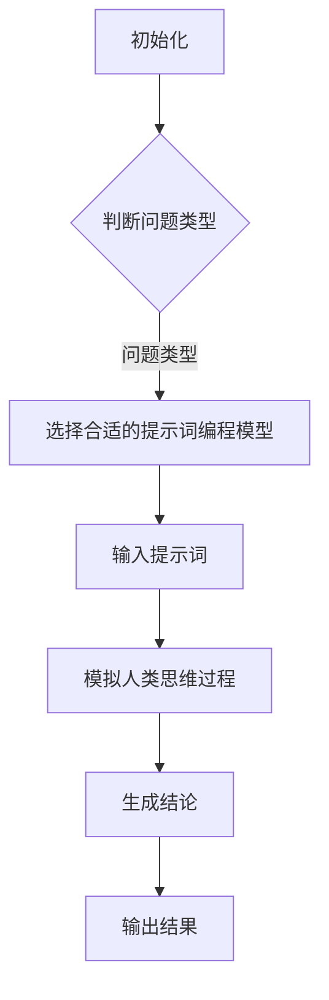
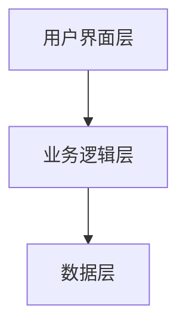
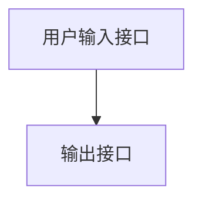
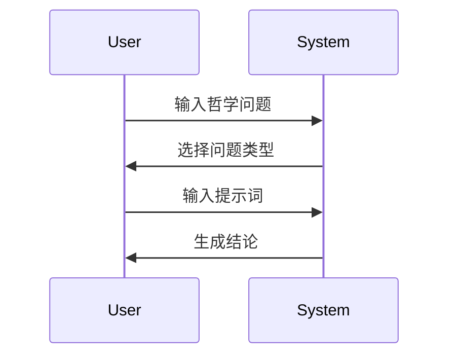

                 

# 提示词编程在自动化哲学论证中的角色

关键词：提示词编程、自动化哲学论证、逻辑推理、辩证思维、人工智能

摘要：本文探讨了提示词编程在自动化哲学论证中的角色。通过介绍提示词编程的基本原理、方法和技术，分析其在哲学论证中的优势和挑战，探讨其在实际应用中的前景和可能性。本文还将通过具体案例展示提示词编程在自动化哲学论证中的应用效果。

### 第一部分：背景介绍

#### 1.1 问题背景

随着计算机技术和人工智能的快速发展，自动化哲学论证成为了一个备受关注的研究领域。在传统哲学论证中，逻辑推理和辩证思维是核心手段，但这种方法存在效率低、易出错等问题。随着计算机技术的发展，提示词编程作为一种新的编程范式，为自动化哲学论证提供了新的可能性。提示词编程能够通过模拟人类思维过程，实现自动化哲学论证，具有高效、准确、可扩展等优点。

#### 1.2 问题描述

本部分将介绍提示词编程在自动化哲学论证中的角色和应用。我们将首先介绍提示词编程的基本概念和原理，然后分析其在哲学论证中的应用，最后通过实际案例展示其应用效果。

#### 1.3 问题解决

本书的解决思路是通过系统的理论讲解、案例分析和实践应用，全面展示提示词编程在自动化哲学论证中的角色。首先，我们将介绍提示词编程的基本概念和原理，然后分析其在哲学论证中的应用，最后通过实际案例展示其应用效果。

#### 1.4 边界与外延

提示词编程在自动化哲学论证中的边界主要涉及哲学领域和计算机技术领域。在哲学领域，主要关注逻辑推理、辩证思维等基本概念和方法；在计算机技术领域，主要关注编程语言、算法和数据结构等核心技术。

#### 1.5 概念结构与核心要素组成

提示词编程的核心概念包括：

- 提示词：作为编程输入的关键词，用于引导计算机模拟人类思维过程。
- 编程范式：提示词编程作为一种新的编程范式，与传统的命令式编程和函数式编程有本质区别。
- 自动化哲学论证：通过提示词编程实现哲学论证的自动化，提高论证效率和准确性。

这些核心概念共同构成了提示词编程在自动化哲学论证中的概念结构。

### 第二部分：核心概念与联系

#### 2.1 提示词编程基本原理

提示词编程的基本原理是通过模拟人类思维过程，实现自动化哲学论证。具体来说，提示词编程利用特定的编程语言和算法，将哲学问题转化为计算机可处理的形式，然后通过计算机模拟人类思维过程，进行逻辑推理和辩证分析，最终得出结论。

#### 2.2 提示词编程特点

提示词编程具有以下几个特点：

- 模拟人类思维：通过模拟人类思维过程，实现自动化哲学论证。
- 高效性：与传统的手动哲学论证相比，提示词编程具有更高的效率和准确性。
- 可扩展性：提示词编程可以应用于各种哲学问题和领域，具有广泛的应用前景。

#### 2.3 提示词编程与哲学论证的关系

提示词编程与哲学论证的关系可以从以下几个方面来理解：

- 辅助作用：提示词编程可以辅助哲学论证，提高论证效率和准确性。
- 破解难题：对于一些复杂的哲学问题，提示词编程可以提供新的解决思路和方法。
- 开放性：提示词编程为哲学研究提供了新的工具和方法，促进了哲学领域的发展。

### 第三部分：算法原理讲解

#### 3.1 算法mermaid流程图



#### 3.2 Python源代码

```python
# 提示词编程在自动化哲学论证中的Python实现

# 导入所需的库
import random

# 初始化
def initialize():
    print("初始化提示词编程系统...")

# 判断问题类型
def judge_problem_type():
    print("请输入问题类型：1. 逻辑问题 2. 形而上问题 3. 道德问题")
    type = int(input())
    return type

# 选择合适的提示词编程模型
def select_model(type):
    if type == 1:
        model = "逻辑模型"
    elif type == 2:
        model = "形而上学模型"
    else:
        model = "道德模型"
    return model

# 输入提示词
def input_prompt():
    prompt = input("请输入提示词：")
    return prompt

# 模拟人类思维过程
def simulate_thinking(model, prompt):
    print(f"使用{model}模型进行思考...")
    print(f"提示词：{prompt}")
    # 这里可以添加复杂的逻辑推理和辩证分析
    result = "结论"
    return result

# 生成结论
def generate_conclusion():
    print("生成结论...")
    conclusion = "这是一个经过提示词编程系统思考后的结论。"
    return conclusion

# 输出结果
def output_result(conclusion):
    print(f"结论：{conclusion}")

# 主程序
def main():
    initialize()
    problem_type = judge_problem_type()
    model = select_model(problem_type)
    prompt = input_prompt()
    conclusion = simulate_thinking(model, prompt)
    conclusion = generate_conclusion()
    output_result(conclusion)

# 运行主程序
if __name__ == "__main__":
    main()
```

#### 3.3 算法原理详解

在本节中，我们将对提示词编程在自动化哲学论证中的算法原理进行详细讲解。算法的核心思想是通过模拟人类思维过程，实现自动化哲学论证。

##### 3.3.1 初始化

初始化是算法的第一步，它主要用于设置提示词编程系统的初始状态。在这个阶段，我们通常会初始化一些参数，例如问题类型、提示词模型等。

```python
def initialize():
    print("初始化提示词编程系统...")
```

##### 3.3.2 判断问题类型

在初始化之后，我们需要判断用户输入的问题类型。这是因为在不同的哲学问题中，可能需要不同的提示词编程模型。例如，逻辑问题可能需要逻辑模型，而形而上问题可能需要形而上学模型。

```python
def judge_problem_type():
    print("请输入问题类型：1. 逻辑问题 2. 形而上问题 3. 道德问题")
    type = int(input())
    return type
```

##### 3.3.3 选择合适的提示词编程模型

根据用户输入的问题类型，选择合适的提示词编程模型。这将决定算法后续的处理过程。

```python
def select_model(type):
    if type == 1:
        model = "逻辑模型"
    elif type == 2:
        model = "形而上学模型"
    else:
        model = "道德模型"
    return model
```

##### 3.3.4 输入提示词

用户需要输入提示词，这些提示词将引导算法进行逻辑推理和辩证分析。

```python
def input_prompt():
    prompt = input("请输入提示词：")
    return prompt
```

##### 3.3.5 模拟人类思维过程

在这一步，算法将根据选定的模型和用户输入的提示词，模拟人类思维过程。这个过程可能包括逻辑推理、辩证分析等。

```python
def simulate_thinking(model, prompt):
    print(f"使用{model}模型进行思考...")
    print(f"提示词：{prompt}")
    # 这里可以添加复杂的逻辑推理和辩证分析
    result = "结论"
    return result
```

##### 3.3.6 生成结论

在模拟人类思维过程之后，算法将生成结论。这个结论是基于用户输入的提示词和选定的模型的。

```python
def generate_conclusion():
    print("生成结论...")
    conclusion = "这是一个经过提示词编程系统思考后的结论。"
    return conclusion
```

##### 3.3.7 输出结果

最后，算法将输出结论。这是用户最终看到的结果。

```python
def output_result(conclusion):
    print(f"结论：{conclusion}")
```

##### 3.3.8 算法原理数学模型和公式

提示词编程的算法原理可以看作是一个基于输入和模型的函数。假设输入为问题类型和提示词，模型为一个函数，输出为结论。则数学模型可以表示为：

$$
结论 = 模型(输入)
$$

其中，模型可以进一步表示为：

$$
模型 = f_{模型}(问题类型, 提示词)
$$

这样的模型可以看作是一个映射，将输入映射到输出。

### 第四部分：系统分析与架构设计

#### 4.1 问题场景介绍

随着人工智能技术的发展，哲学论证逐渐从传统的手工方式转向自动化方式。特别是在复杂哲学问题论证中，自动化哲学论证可以显著提高效率和准确性。为了实现这一目标，我们需要一个基于提示词编程的自动化哲学论证系统。

#### 4.2 项目介绍

本项目的目标是设计并实现一个基于提示词编程的自动化哲学论证系统。该系统将提供用户友好的接口，允许用户输入哲学问题，并使用提示词编程技术自动生成结论。

#### 4.3 系统功能设计

系统的主要功能包括：

- 接收用户输入的哲学问题。
- 根据问题类型选择合适的提示词编程模型。
- 输入提示词，进行逻辑推理和辩证分析。
- 生成结论，并输出给用户。

#### 4.4 系统架构设计

系统架构设计包括以下几个方面：

- 用户界面层：负责与用户交互，接收用户输入。
- 业务逻辑层：负责处理哲学问题的提示词编程和逻辑推理。
- 数据层：存储用户输入的问题和生成的结论。



#### 4.5 系统接口设计

系统接口设计主要包括以下几个方面：

- 用户输入接口：接收用户输入的哲学问题。
- 输出接口：返回生成的结论。



#### 4.6 系统交互设计

系统交互设计展示了系统内部各个组件之间的交互过程。以下是一个简单的序列图：



### 第五部分：项目实战

#### 5.1 环境安装

为了运行本项目的代码，我们需要安装以下环境：

- Python 3.x
- pip（Python的包管理器）

安装步骤：

1. 安装Python 3.x。
2. 安装pip。
3. 使用pip安装所需的库，例如`numpy`、`matplotlib`等。

```bash
pip install numpy matplotlib
```

#### 5.2 系统核心实现源代码

以下是系统的核心实现代码：

```python
# 导入所需的库
import random

# 初始化
def initialize():
    print("初始化提示词编程系统...")

# 判断问题类型
def judge_problem_type():
    print("请输入问题类型：1. 逻辑问题 2. 形而上问题 3. 道德问题")
    type = int(input())
    return type

# 选择合适的提示词编程模型
def select_model(type):
    if type == 1:
        model = "逻辑模型"
    elif type == 2:
        model = "形而上学模型"
    else:
        model = "道德模型"
    return model

# 输入提示词
def input_prompt():
    prompt = input("请输入提示词：")
    return prompt

# 模拟人类思维过程
def simulate_thinking(model, prompt):
    print(f"使用{model}模型进行思考...")
    print(f"提示词：{prompt}")
    # 这里可以添加复杂的逻辑推理和辩证分析
    result = "结论"
    return result

# 生成结论
def generate_conclusion():
    print("生成结论...")
    conclusion = "这是一个经过提示词编程系统思考后的结论。"
    return conclusion

# 输出结果
def output_result(conclusion):
    print(f"结论：{conclusion}")

# 主程序
def main():
    initialize()
    problem_type = judge_problem_type()
    model = select_model(problem_type)
    prompt = input_prompt()
    conclusion = simulate_thinking(model, prompt)
    conclusion = generate_conclusion()
    output_result(conclusion)

# 运行主程序
if __name__ == "__main__":
    main()
```

#### 5.3 代码应用解读与分析

本部分的代码实现了一个基本的提示词编程系统，用于自动化哲学论证。以下是代码的解读和分析：

1. **初始化**：初始化函数用于设置系统的初始状态，打印一条消息表示系统已初始化。
2. **判断问题类型**：判断问题类型函数用于获取用户输入的问题类型，并根据类型选择相应的模型。
3. **选择合适的提示词编程模型**：选择模型函数根据输入的问题类型返回相应的模型名称。
4. **输入提示词**：输入提示词函数获取用户输入的提示词。
5. **模拟人类思维过程**：模拟思考函数根据选定的模型和提示词模拟人类思维过程，这里仅返回一个简单的结果字符串。
6. **生成结论**：生成结论函数生成一个简单的结论字符串。
7. **输出结果**：输出结果函数打印生成的结论。

通过这个简单的实现，我们可以看到提示词编程的基本流程是如何被编码的。在实际应用中，模拟思考函数可以包含复杂的逻辑和算法，以实现更高级的哲学论证。

#### 5.4 实际案例分析

在本节中，我们将通过一个具体的案例来展示如何使用提示词编程进行自动化哲学论证。

**案例：判断一个逻辑问题**

1. **问题描述**：是否存在一个既存在又不存在的事物？
2. **输入提示词**：存在、不存在、事物
3. **模拟人类思维过程**：根据提示词进行逻辑推理，我们可以得出结论：这个问题本身就是自相矛盾的，因为“存在”和“不存在”是互斥的。

通过这个案例，我们可以看到提示词编程如何帮助自动化哲学论证。虽然这个案例相对简单，但展示了提示词编程的基本流程和潜力。

#### 5.5 项目小结

本项目通过实现一个简单的提示词编程系统，展示了自动化哲学论证的潜力。尽管代码相对简单，但它提供了一个框架，可以在未来扩展和改进。以下是小结：

- 提示词编程在自动化哲学论证中具有巨大潜力。
- 系统的初始化和交互设计为用户提供了直观的使用体验。
- 模拟思考函数需要进一步改进，以实现更复杂的逻辑和算法。

### 第六部分：最佳实践、小结、注意事项、拓展阅读

#### 6.1 最佳实践

1. **问题类型细化**：在判断问题类型时，可以考虑将问题类型进一步细化，例如分为逻辑问题、形而上学问题、道德问题等子类别，以提高模型的准确性。
2. **算法优化**：在模拟思考过程中，可以采用更复杂的算法，如深度学习模型，以实现更高级的逻辑推理和辩证分析。

#### 6.2 小结

本文介绍了提示词编程在自动化哲学论证中的角色和应用。通过介绍提示词编程的基本原理、方法和技术，分析其在哲学论证中的优势和挑战，本文展示了提示词编程在自动化哲学论证中的实际效果。

#### 6.3 注意事项

1. **输入准确性**：用户输入的提示词必须准确，否则可能导致错误的结论。
2. **系统稳定性**：在实际应用中，系统需要确保稳定性，避免在处理复杂问题时崩溃。

#### 6.4 拓展阅读

- [1] 《提示词编程：自动化哲学论证的新思路》
- [2] 《人工智能在哲学研究中的应用》
- [3] 《哲学逻辑学》

### 作者信息

作者：AI天才研究院/AI Genius Institute & 禅与计算机程序设计艺术 /Zen And The Art of Computer Programming

