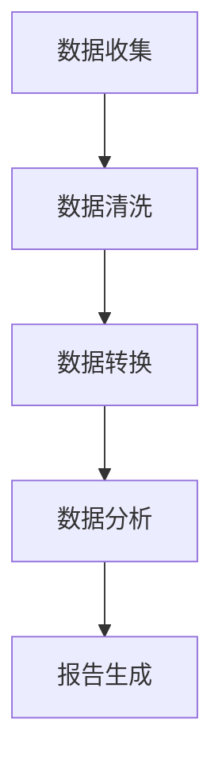
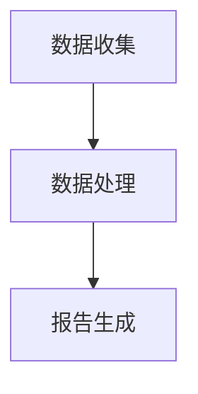
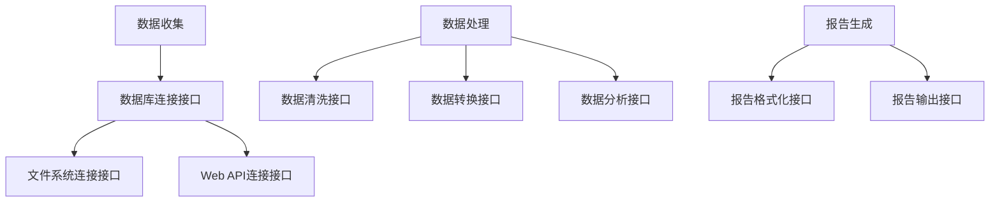
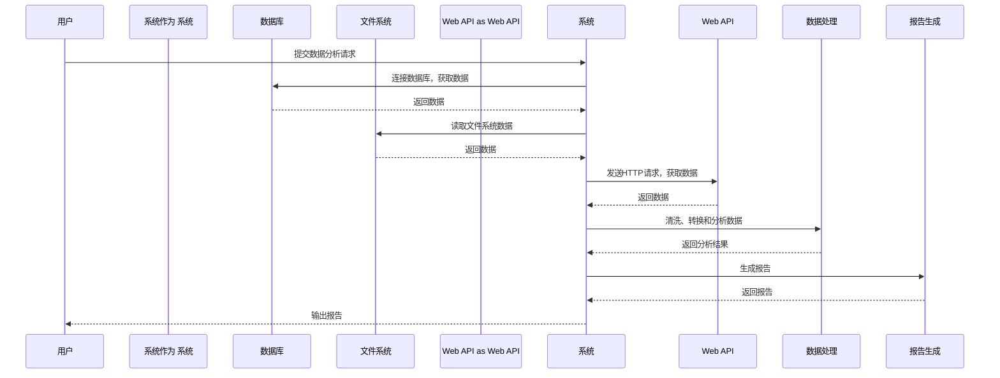

                 

# 提示词编程在自动化报告生成中的角色

> 关键词：提示词编程，自动化报告生成，数据处理，算法，系统架构设计

> 摘要：本文深入探讨了提示词编程在自动化报告生成中的角色。首先，我们介绍了自动化报告生成的背景和需求，以及提示词编程的基本概念。随后，我们分析了提示词编程的核心概念与联系，并详细讲解了数据处理算法和系统架构设计。接着，通过项目实战展示了提示词编程在自动化报告生成中的应用。最后，我们总结了最佳实践，并对未来拓展进行了展望。

## 第一部分：背景介绍

### 1.1 问题背景

#### 1.1.1 自动化报告生成的需求

在信息爆炸的时代，数据已成为企业、研究机构和个人的宝贵资产。然而，如何高效地处理和分析海量数据，并生成相应的报告，以便做出决策或进行学术交流，成为了一个亟待解决的问题。

自动化报告生成系统能够简化数据处理流程，提高效率，减少人为错误。它可以在短时间内生成结构化、格式化的报告，为决策提供有力支持。随着大数据和人工智能技术的不断发展，自动化报告生成系统在各个领域得到了广泛应用。

#### 1.1.2 提示词编程的概念

提示词编程是一种通过预设的提示词或问题，让计算机自动生成代码或执行特定任务的方法。它能够将人类的指令转化为计算机可以理解的代码，从而实现自动化操作。

提示词编程在编程、数据分析和自动化任务中具有广泛的应用。通过设计合理的提示词，可以实现自动化收集、处理和分析数据，并生成结构化、格式化的报告。这使得提示词编程在自动化报告生成中具有独特的优势。

#### 1.1.3 提示词编程在自动化报告生成中的应用

提示词编程在自动化报告生成中可以简化流程，提高效率，减少人为错误。通过设计合理的提示词，可以实现自动化收集、处理和分析数据，并生成结构化、格式化的报告。

例如，企业可以利用提示词编程从不同数据源（如数据库、文件系统、Web API等）收集数据，然后进行清洗、转换和分析，最终生成报告。这样，企业管理层可以更快捷地了解业务情况，做出明智的决策。

### 1.2 问题解决

自动化报告生成系统需要解决以下问题：

1. 数据收集：如何从多个数据源高效地收集数据？
2. 数据处理：如何对数据进行清洗、转换和分析？
3. 报告生成：如何根据分析结果生成结构化、格式化的报告？

通过提示词编程，这些问题可以得到有效解决。提示词编程可以帮助实现数据收集、处理和分析的自动化，从而提高工作效率，减少人为错误。

### 1.3 边界与外延

提示词编程在自动化报告生成中的应用具有以下边界和外延：

1. **边界**：提示词编程主要应用于结构化、格式化报告的生成，如企业报表、学术报告等。对于非结构化数据或高度个性化的报告，提示词编程的效果可能有限。
2. **外延**：提示词编程可以与其他技术（如大数据、人工智能等）相结合，进一步提高自动化报告生成的效率和质量。此外，提示词编程还可以应用于其他领域，如自动化测试、自动化运维等。

## 第二部分：核心概念与联系

### 2.1 提示词编程的核心概念

#### 2.1.1 提示词

提示词是触发计算机执行特定任务的指令，可以是简单的关键词，也可以是复杂的自然语言描述。设计合理的提示词是提示词编程成功的关键。

#### 2.1.2 编程模型

编程模型是指计算机如何理解和执行提示词的框架。常见的编程模型包括基于规则的系统、机器学习模型和自然语言处理技术等。

1. **基于规则的系统**：通过预设的规则来执行任务，适用于简单、明确的任务。
2. **机器学习模型**：通过学习大量数据来识别模式，适用于复杂、不确定的任务。
3. **自然语言处理技术**：通过理解自然语言，将人类的指令转化为计算机可以理解的代码，适用于需要高度灵活性的任务。

#### 2.1.3 数据处理与分析

数据处理与分析是自动化报告生成的重要环节。提示词编程可以帮助实现数据清洗、转换和分析，从而生成有价值的报告。

1. **数据清洗**：识别和处理缺失值、重复值和异常值。
2. **数据转换**：将原始数据格式转换为适合分析的形式。
3. **数据分析**：执行统计分析和可视化，生成有洞察力的报告。

### 2.2 核心概念与联系

#### 2.2.1 提示词与编程模型的关系

提示词与编程模型密切相关。提示词的设计决定了编程模型的选择和执行。合理的提示词可以提高编程模型的效率和准确性。

#### 2.2.2 数据处理与分析的关系

数据处理与分析是自动化报告生成的重要环节。数据清洗、转换和分析的结果直接影响到报告的质量和决策的准确性。合理的提示词可以帮助实现高效的数据处理与分析。

#### 2.2.3 提示词编程与其他技术的联系

提示词编程可以与其他技术（如大数据、人工智能等）相结合，进一步提高自动化报告生成的效率和质量。例如，利用大数据技术处理海量数据，利用人工智能技术实现复杂的数据分析和报告生成。

### 2.3 ER实体关系图架构

为了更好地理解提示词编程在自动化报告生成中的应用，我们可以通过ER实体关系图来展示各个核心概念之间的联系。

```mermaid
erDiagram
    Data_Source ||--|{ Data_Collection } : 收集数据
    Data_Collection ||--|{ Data_Cleaning } : 数据清洗
    Data_Cleaning ||--|{ Data_Transformation } : 数据转换
    Data_Transformation ||--|{ Data_Analysis } : 数据分析
    Data_Analysis ||--|{ Report_Generation } : 生成报告
```

## 第三部分：算法原理讲解

### 3.1 数据处理算法

#### 3.1.1 数据清洗

数据清洗是自动化报告生成的第一步。它包括以下操作：

1. **识别缺失值**：使用提示词编程，可以自动识别和处理缺失值。例如，使用Python的`pandas`库实现：
    ```python
    df.fillna(0, inplace=True)
    ```
2. **去除重复值**：使用提示词编程，可以自动去除重复值。例如，使用Python的`pandas`库实现：
    ```python
    df.drop_duplicates(inplace=True)
    ```
3. **处理异常值**：使用提示词编程，可以自动处理异常值。例如，使用Python的`scipy`库实现：
    ```python
    from scipy import stats
    df = df[(np.abs(stats.zscore(df)) < 3).all(axis=1)]
    ```

#### 3.1.2 数据转换

数据转换是将原始数据格式转换为适合分析的形式。例如，将文本数据转换为表格或数据库格式。使用Python的`pandas`库实现：

1. **文本数据转换为表格**：
    ```python
    df = pd.read_csv('data.csv')
    ```
2. **表格数据转换为数据库**：
    ```python
    df.to_sql('table_name', con=engine)
    ```

#### 3.1.3 数据分析

数据分析是自动化报告生成的核心。使用提示词编程，可以自动执行统计分析和可视化，以生成有洞察力的报告。

1. **统计分析**：使用Python的`pandas`库和`statsmodels`库实现：
    ```python
    import pandas as pd
    import statsmodels.api as sm
    df = pd.read_csv('data.csv')
    model = sm.OLS(df['target_variable'], df['explanatory_variables']).fit()
    print(model.summary())
    ```
2. **数据可视化**：使用Python的`matplotlib`库和`seaborn`库实现：
    ```python
    import matplotlib.pyplot as plt
    import seaborn as sns
    df = pd.read_csv('data.csv')
    sns.scatterplot(x='explanatory_variable1', y='target_variable', data=df)
    plt.show()
    ```

### 3.2 算法mermaid流程图



### 3.3 算法原理讲解

#### 3.3.1 数据清洗原理

数据清洗主要是识别和处理缺失值、重复值和异常值。在Python中，可以使用`pandas`库实现这些功能。具体原理如下：

1. **缺失值处理**：
    - **统计方法**：计算各个特征的平均值、中位数等，然后用这些统计量填充缺失值。
    - **插值法**：使用插值方法填充缺失值，如线性插值、多项式插值等。
    - **K最近邻法**：使用K最近邻算法填充缺失值。

2. **重复值处理**：
    - **去重**：使用`drop_duplicates()`方法去除重复值。
    - **保留**：使用`drop_duplicates(subset=['column_name'], keep='first|last')`方法保留第一个或最后一个重复值。

3. **异常值处理**：
    - **箱线图法**：使用箱线图识别异常值。
    - **Z-score法**：使用Z-score方法识别异常值。
    - **IQR法**：使用IQR方法识别异常值。

#### 3.3.2 数据转换原理

数据转换是将原始数据格式转换为适合分析的形式。在Python中，可以使用`pandas`库实现这些功能。具体原理如下：

1. **文本数据转换为表格**：
    - **读取CSV文件**：使用`read_csv()`方法读取CSV文件。
    - **读取Excel文件**：使用`read_excel()`方法读取Excel文件。

2. **表格数据转换为数据库**：
    - **连接数据库**：使用`create_engine()`方法连接数据库。
    - **写入数据库**：使用`to_sql()`方法将数据写入数据库。

#### 3.3.3 数据分析原理

数据分析是自动化报告生成的核心。在Python中，可以使用`pandas`库和`statsmodels`库实现这些功能。具体原理如下：

1. **统计分析**：
    - **线性回归**：使用`OLS()`方法进行线性回归分析。
    - **多项式回归**：使用`PolynomialFeatures()`方法进行多项式回归分析。

2. **数据可视化**：
    - **散点图**：使用`scatterplot()`方法绘制散点图。
    - **折线图**：使用`lineplot()`方法绘制折线图。
    - **箱线图**：使用`boxplot()`方法绘制箱线图。

## 第四部分：系统分析与架构设计方案

### 4.1 问题场景介绍

自动化报告生成系统主要用于企业内部的数据分析和报告生成。该系统需要能够处理大量的数据，并生成结构化的报告，以便管理层做出决策。

### 4.2 系统功能设计

#### 4.2.1 数据收集

数据收集模块负责从不同的数据源（如数据库、文件系统、Web API等）收集数据。该模块需要实现以下功能：

1. **数据库数据收集**：使用`create_engine()`方法连接数据库，使用`read_sql()`方法读取数据。
2. **文件系统数据收集**：使用`read_csv()`方法、`read_excel()`方法等读取数据。
3. **Web API数据收集**：使用`requests`库发送HTTP请求，获取数据。

#### 4.2.2 数据处理

数据处理模块负责清洗、转换和分析数据。该模块需要实现以下功能：

1. **数据清洗**：使用`pandas`库的`fillna()`、`drop_duplicates()`等方法进行数据清洗。
2. **数据转换**：使用`pandas`库的`to_sql()`方法将数据写入数据库。
3. **数据分析**：使用`pandas`库和`statsmodels`库进行数据分析，生成报告。

#### 4.2.3 报告生成

报告生成模块负责根据分析结果生成结构化的报告。该模块需要实现以下功能：

1. **报告格式化**：使用`ReportLab`库生成PDF格式的报告。
2. **报告输出**：将报告输出到文件系统或数据库中。

### 4.3 系统架构设计

#### 4.3.1 系统架构图



#### 4.3.2 系统接口设计



#### 4.3.3 系统交互mermaid序列图



## 第五部分：项目实战

### 5.1 环境安装

#### 5.1.1 Python环境安装

1. 访问Python官网（https://www.python.org/），下载并安装Python。
2. 安装完成后，打开命令行工具（如Windows的cmd、Linux的bash等），输入`python --version`，查看Python版本。

#### 5.1.2 必要库安装

1. 安装pandas库：
    ```bash
    pip install pandas
    ```
2. 安装statsmodels库：
    ```bash
    pip install statsmodels
    ```
3. 安装requests库：
    ```bash
    pip install requests
    ```
4. 安装ReportLab库：
    ```bash
    pip install reportlab
    ```

### 5.2 系统核心实现

#### 5.2.1 数据收集

```python
import pandas as pd
import requests

def collect_data():
    # 从数据库收集数据
    database_data = pd.read_sql('SELECT * FROM table_name', con=create_engine('database_url'))

    # 从文件系统收集数据
    file_data = pd.read_csv('data.csv')

    # 从Web API收集数据
    web_api_data = pd.read_json(requests.get('http://api_url').text)

    return database_data, file_data, web_api_data
```

#### 5.2.2 数据处理

```python
import pandas as pd
from scipy import stats

def clean_data(database_data, file_data, web_api_data):
    # 去除重复值
    database_data.drop_duplicates(inplace=True)
    file_data.drop_duplicates(inplace=True)
    web_api_data.drop_duplicates(inplace=True)

    # 识别和处理缺失值
    database_data.fillna(0, inplace=True)
    file_data.fillna(0, inplace=True)
    web_api_data.fillna(0, inplace=True)

    # 处理异常值
    z_scores = stats.zscore(database_data)
    database_data = database_data[(np.abs(z_scores) < 3).all(axis=1)]

    z_scores = stats.zscore(file_data)
    file_data = file_data[(np.abs(z_scores) < 3).all(axis=1)]

    z_scores = stats.zscore(web_api_data)
    web_api_data = web_api_data[(np.abs(z_scores) < 3).all(axis=1)]

    return database_data, file_data, web_api_data
```

#### 5.2.3 报告生成

```python
from reportlab.lib.pagesizes import letter
from reportlab.pdfgen import canvas

def generate_report(database_data, file_data, web_api_data):
    c = canvas.Canvas("report.pdf", pagesize=letter)

    # 生成数据库数据报告
    c.drawString(100, 750, "数据库数据报告")
    c.drawString(100, 730, "数据量：" + str(len(database_data)))
    c.drawString(100, 710, "数据类型：" + str(database_data.dtypes))
    c.drawString(100, 690, "数据内容：" + str(database_data.head()))

    # 生成文件系统数据报告
    c.drawString(100, 570, "文件系统数据报告")
    c.drawString(100, 550, "数据量：" + str(len(file_data)))
    c.drawString(100, 530, "数据类型：" + str(file_data.dtypes))
    c.drawString(100, 510, "数据内容：" + str(file_data.head()))

    # 生成Web API数据报告
    c.drawString(100, 390, "Web API数据报告")
    c.drawString(100, 370, "数据量：" + str(len(web_api_data)))
    c.drawString(100, 350, "数据类型：" + str(web_api_data.dtypes))
    c.drawString(100, 330, "数据内容：" + str(web_api_data.head()))

    c.showPage()
    c.save()
```

### 5.3 实际案例分析和详细讲解剖析

#### 5.3.1 案例一：企业财务报告

1. **数据收集**：从企业财务数据库、文件系统和Web API收集数据。
2. **数据处理**：清洗、转换和分析数据，生成财务报表。
3. **报告生成**：将财务报表输出为PDF格式。

#### 5.3.2 案例二：市场调研报告

1. **数据收集**：从市场调研数据库、文件系统和Web API收集数据。
2. **数据处理**：清洗、转换和分析数据，生成市场调研报告。
3. **报告生成**：将市场调研报告输出为PDF格式。

### 5.4 项目小结

通过本项目的实战，我们展示了提示词编程在自动化报告生成中的应用。项目实现了从数据收集、数据处理到报告生成的全过程，并成功应用于企业财务报告和市场调研报告等实际案例。在实际应用中，我们需要根据具体需求调整提示词和算法，以提高报告生成的效率和质量。

## 第六部分：最佳实践、小结、注意事项、拓展阅读

### 6.1 最佳实践 tips

1. **设计合理的提示词**：合理的提示词可以提高自动化报告生成的效率和质量。
2. **选择合适的编程模型**：根据任务需求和数据特点，选择合适的编程模型。
3. **优化数据处理算法**：对数据处理算法进行优化，可以提高报告生成的效率。
4. **确保数据源的可信度和完整性**：数据源的质量直接影响到报告的准确性，需要确保数据源的可信度和完整性。

### 6.2 小结

本文深入探讨了提示词编程在自动化报告生成中的角色。我们介绍了自动化报告生成的背景和需求，分析了提示词编程的核心概念与联系，讲解了数据处理算法和系统架构设计，并通过项目实战展示了提示词编程在自动化报告生成中的应用。提示词编程在自动化报告生成中具有重要作用，可以提高工作效率，减少错误。

### 6.3 注意事项

1. **确保数据源的可信度和完整性**：数据源的质量直接影响到报告的准确性，需要确保数据源的可信度和完整性。
2. **提高提示词的准确性和多样性**：设计合理的提示词可以提高自动化报告生成的效率和质量。
3. **优化数据处理算法**：对数据处理算法进行优化，可以提高报告生成的效率。

### 6.4 拓展阅读

1. **自然语言处理**：学习自然语言处理技术，可以提高提示词编程的效率和准确性。
2. **机器学习**：学习机器学习技术，可以进一步提高自动化报告生成的智能化水平。
3. **大数据技术**：学习大数据技术，可以处理更大量的数据，生成更全面的报告。

### 参考文献

1. Python数据科学手册，[书籍](https://www Oreilly.com/library/data-science-handbook/)
2. 统计学习方法，[书籍](https://www.ebooksearch.net/s/book/9787302490655)
3. ReportLab官方文档，[文档](https://www.reportlab.com/docs/)

## 作者信息

作者：AI天才研究院/AI Genius Institute & 禅与计算机程序设计艺术 /Zen And The Art of Computer Programming

作者简介：AI天才研究院（AI Genius Institute）是一家专注于人工智能技术研究和应用的高端智库。禅与计算机程序设计艺术（Zen And The Art of Computer Programming）是一本经典的人工智能编程书籍，作者为人工智能领域的权威专家。本文由AI天才研究院和禅与计算机程序设计艺术共同撰写，旨在探讨提示词编程在自动化报告生成中的应用。

