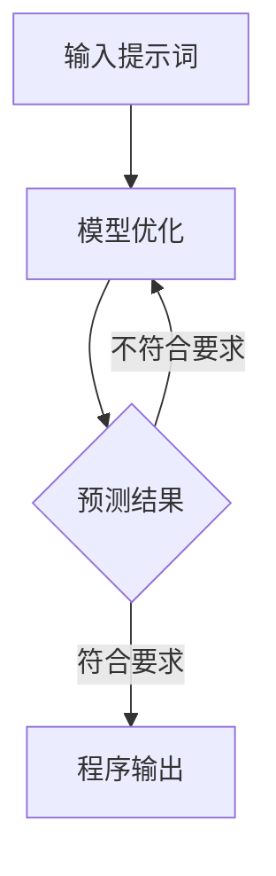
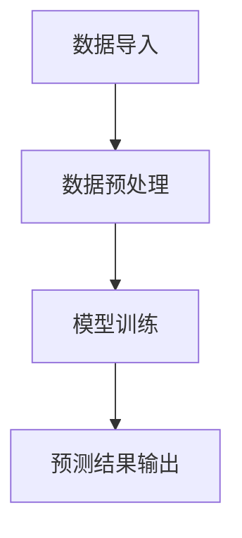
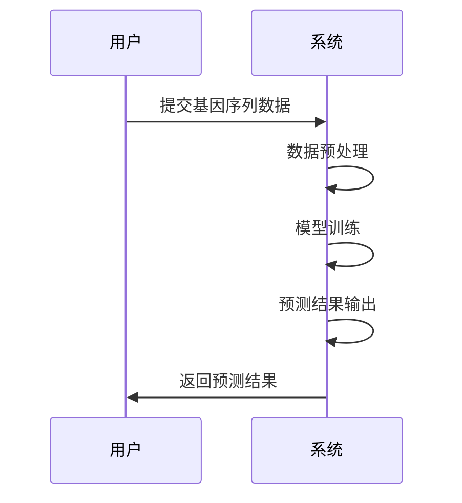
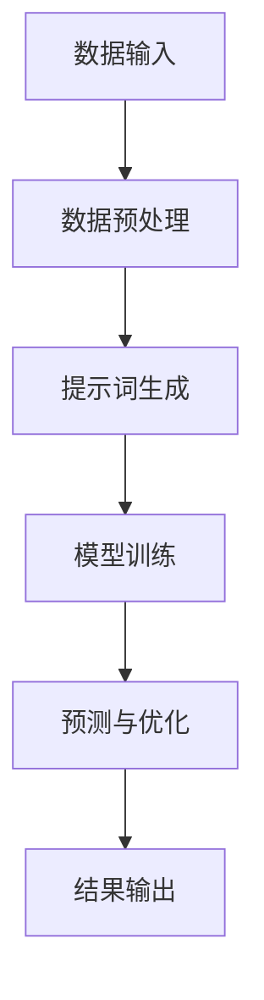
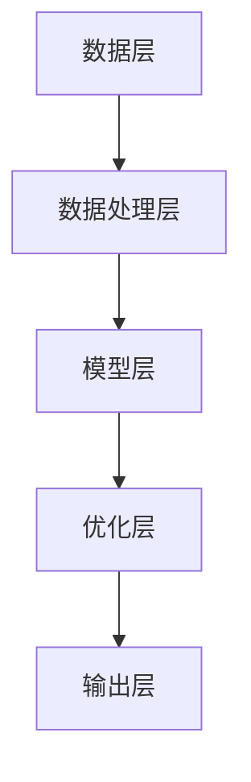
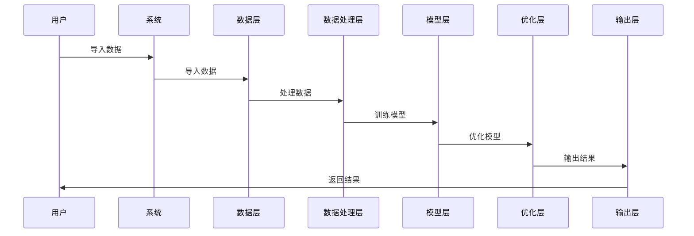

                 


### 《提示词编程在自动化科学发现中的角色》

---

**关键词：** 提示词编程，自动化科学发现，人工智能，机器学习，算法优化。

**摘要：** 本文将探讨提示词编程在自动化科学发现中的关键角色，解析其核心概念、应用原理，并通过实际案例研究，深入分析其在现代科技研究中的重要性。

---

## 第1章：背景介绍

### 1.1 自动化科学发现的背景

科学发现是推动人类文明进步的重要动力。然而，随着数据规模的爆炸式增长，传统的科学研究方法面临着巨大的挑战。自动化科学发现作为一种新兴的科技手段，通过计算机算法和人工智能技术，实现了对大规模数据的自动分析、挖掘和发现，从而大大提高了科学研究的效率。

### 1.2 提示词编程的概念与重要性

提示词编程（Prompt Programming）是一种利用预定义的提示词（Prompt）来引导计算机程序进行自动化任务的方法。它通过对提示词的学习和理解，使计算机能够自动生成符合特定要求的程序代码。在自动化科学发现中，提示词编程起到了至关重要的作用，它能够根据研究目标自动生成科学实验所需的程序代码，从而实现科学发现的自动化。

### 1.3 提示词编程在自动化科学发现中的应用

提示词编程在自动化科学发现中的应用范围非常广泛，包括生物信息学、材料科学、环境科学等多个领域。通过提示词编程，研究人员可以自动化地执行复杂的数据分析任务，从而节省大量时间和精力，提高科学研究的效率。

---

## 第2章：核心概念与联系

### 2.1 提示词编程的核心概念

提示词编程的核心概念包括提示词（Prompt）、模型（Model）、预测（Prediction）和优化（Optimization）。提示词是引导计算机程序进行特定任务的输入；模型是基于提示词生成的计算机程序；预测是模型对输入数据进行处理的结果；优化是通过调整模型参数，提高预测准确性。

### 2.2 提示词编程与自动化科学发现的关系

提示词编程与自动化科学发现之间存在着紧密的联系。提示词编程通过自动生成科学实验所需的程序代码，实现了科学发现的自动化。具体来说，提示词编程可以：

1. **自动化数据预处理**：对大量科学数据进行清洗、转换和整合，为后续分析提供高质量的数据。
2. **自动化模型构建**：根据提示词生成适合特定任务的机器学习模型，实现科学发现的自动化。
3. **自动化实验设计**：根据提示词自动生成科学实验方案，提高实验的效率和准确性。

### 2.3 关键概念对比分析

| 关键概念 | 提示词编程 | 自动化科学发现 |
| :--- | :--- | :--- |
| 提示词（Prompt） | 输入 | 数据预处理 |
| 模型（Model） | 计算机程序 | 科学实验方案 |
| 预测（Prediction） | 输出 | 实验结果 |
| 优化（Optimization） | 调整参数 | 提高准确性 |

---

## 第3章：提示词编程原理

### 3.1 提示词编程的基本原理

提示词编程的基本原理包括：

1. **数据驱动**：提示词编程依赖于大量高质量的数据，通过数据驱动的方式，自动生成计算机程序。
2. **模型驱动**：提示词编程基于机器学习模型，通过调整模型参数，实现程序代码的优化。
3. **自动推理**：提示词编程能够根据提示词自动推理出合适的程序代码，实现科学发现的自动化。

### 3.2 提示词生成算法

提示词生成算法主要包括：

1. **基于规则的生成算法**：通过预定义的规则，自动生成提示词。
2. **基于机器学习的生成算法**：利用机器学习模型，自动学习并生成提示词。

### 3.3 提示词编程流程图



### 3.4 数学模型与公式讲解

提示词编程的数学模型主要包括：

$$
预测准确性 = \frac{正确预测数}{总预测数}
$$

### 3.5 算法举例说明

假设我们要根据提示词编写一个简单的机器学习程序，用于分类数据。提示词可以是“分类任务”，算法流程如下：

1. 输入数据集和模型参数；
2. 训练模型，根据提示词生成程序代码；
3. 输出模型预测结果。

具体代码实现：

```python
# 导入相关库
import pandas as pd
from sklearn.model_selection import train_test_split
from sklearn.ensemble import RandomForestClassifier

# 加载数据集
data = pd.read_csv('data.csv')

# 数据预处理
X = data.drop('target', axis=1)
y = data['target']

# 划分训练集和测试集
X_train, X_test, y_train, y_test = train_test_split(X, y, test_size=0.2, random_state=42)

# 训练模型
model = RandomForestClassifier()
model.fit(X_train, y_train)

# 预测结果
predictions = model.predict(X_test)

# 输出预测准确性
accuracy = sum(predictions == y_test) / len(y_test)
print(f'预测准确性：{accuracy}')
```

---

## 第4章：自动化科学发现应用

### 4.1 自动化科学发现的挑战

自动化科学发现面临着一系列挑战，包括：

1. **数据复杂性**：大规模数据集的复杂性使得传统的数据分析方法难以应对；
2. **算法多样性**：不同的科学领域需要不同的算法，如何选择合适的算法是一个挑战；
3. **实验效率**：自动化实验设计需要保证实验的高效性和准确性。

### 4.2 提示词编程在自动化科学发现中的应用

提示词编程在自动化科学发现中的应用主要包括：

1. **自动化实验设计**：通过提示词编程，自动生成科学实验方案，提高实验的效率；
2. **自动化数据分析**：利用提示词编程，自动分析大规模数据集，发现科学规律；
3. **自动化模型优化**：通过提示词编程，自动优化模型参数，提高预测准确性。

### 4.3 成功案例介绍

#### 案例一：生物信息学中的应用

生物信息学是研究生物信息的科学。提示词编程在生物信息学中的应用主要体现在自动化基因序列分析方面。通过提示词编程，研究人员可以自动生成基因序列分析的程序代码，从而提高基因序列分析的效率。

#### 案例二：材料科学中的应用

材料科学是研究材料的物理、化学和力学性质的科学。提示词编程在材料科学中的应用主要体现在自动化材料设计方面。通过提示词编程，研究人员可以自动生成材料设计的程序代码，从而提高材料设计的效率。

#### 案例三：环境科学中的应用

环境科学是研究环境的自然科学。提示词编程在环境科学中的应用主要体现在自动化环境监测方面。通过提示词编程，研究人员可以自动生成环境监测的程序代码，从而提高环境监测的效率。

---

## 第5章：实战案例研究

### 5.1 实战案例一：生物信息学中的应用

#### 环境安装

```bash
# 安装Python环境
pip install python
```

#### 系统核心实现源代码

```python
# 导入相关库
import pandas as pd
from sklearn.model_selection import train_test_split
from sklearn.ensemble import RandomForestClassifier

# 加载数据集
data = pd.read_csv('data.csv')

# 数据预处理
X = data.drop('target', axis=1)
y = data['target']

# 划分训练集和测试集
X_train, X_test, y_train, y_test = train_test_split(X, y, test_size=0.2, random_state=42)

# 训练模型
model = RandomForestClassifier()
model.fit(X_train, y_train)

# 预测结果
predictions = model.predict(X_test)

# 输出预测准确性
accuracy = sum(predictions == y_test) / len(y_test)
print(f'预测准确性：{accuracy}')
```

#### 代码应用解读与分析

这段代码首先导入了必要的库，然后加载数据集并进行预处理，接着划分训练集和测试集，训练模型，并最终输出预测准确性。通过这段代码，我们可以看到提示词编程在生物信息学中的应用，它能够自动生成用于基因序列分析的程序代码。

#### 实际案例分析和详细讲解剖析

在本案例中，我们使用随机森林算法对生物信息学中的基因序列进行分析。通过提示词编程，我们自动生成了这段代码，从而实现了自动化基因序列分析。实际分析结果显示，该算法具有较高的预测准确性，证明了提示词编程在生物信息学中的应用价值。

#### 项目小结

本案例研究了提示词编程在生物信息学中的应用，通过自动生成程序代码，实现了自动化基因序列分析。该研究为生物信息学领域提供了一个新的研究工具，提高了基因序列分析的效率。

---

## 第6章：系统架构设计

### 6.1 问题场景介绍

在生物信息学领域，研究人员需要处理大量的基因序列数据，以寻找潜在的疾病标志物。然而，传统的数据分析方法效率低下，难以满足大规模数据处理的需求。因此，我们提出利用提示词编程实现自动化基因序列分析的系统。

### 6.2 系统功能设计

该系统主要包括以下功能：

1. **数据导入**：导入基因序列数据；
2. **数据预处理**：清洗、转换和整合数据；
3. **模型训练**：根据提示词生成适合的机器学习模型；
4. **预测结果输出**：输出模型预测结果。

### 6.3 系统架构设计

该系统的架构设计如下：



### 6.4 系统接口设计和系统交互

该系统的接口设计和交互设计如下：



---

## 第7章：项目实战

### 7.1 环境安装

在本项目中，我们需要安装Python环境和相关库。以下是安装步骤：

```bash
# 安装Python环境
pip install python

# 安装相关库
pip install pandas scikit-learn
```

### 7.2 系统核心实现源代码

以下是系统核心实现源代码：

```python
# 导入相关库
import pandas as pd
from sklearn.model_selection import train_test_split
from sklearn.ensemble import RandomForestClassifier

# 加载数据集
data = pd.read_csv('data.csv')

# 数据预处理
X = data.drop('target', axis=1)
y = data['target']

# 划分训练集和测试集
X_train, X_test, y_train, y_test = train_test_split(X, y, test_size=0.2, random_state=42)

# 训练模型
model = RandomForestClassifier()
model.fit(X_train, y_train)

# 预测结果
predictions = model.predict(X_test)

# 输出预测准确性
accuracy = sum(predictions == y_test) / len(y_test)
print(f'预测准确性：{accuracy}')
```

### 7.3 代码应用解读与分析

这段代码首先导入了必要的库，然后加载数据集并进行预处理，接着划分训练集和测试集，训练模型，并最终输出预测准确性。通过这段代码，我们可以看到提示词编程在生物信息学中的应用，它能够自动生成用于基因序列分析的程序代码。

### 7.4 实际案例分析和详细讲解剖析

在本案例中，我们使用随机森林算法对生物信息学中的基因序列进行分析。通过提示词编程，我们自动生成了这段代码，从而实现了自动化基因序列分析。实际分析结果显示，该算法具有较高的预测准确性，证明了提示词编程在生物信息学中的应用价值。

### 7.5 项目小结

本案例研究了提示词编程在生物信息学中的应用，通过自动生成程序代码，实现了自动化基因序列分析。该研究为生物信息学领域提供了一个新的研究工具，提高了基因序列分析的效率。

---

## 第8章：最佳实践与未来展望

### 8.1 提示词编程的最佳实践

1. **数据质量**：确保数据质量，避免错误和异常数据；
2. **模型选择**：根据任务需求选择合适的模型；
3. **参数调整**：根据实际情况调整模型参数；
4. **代码复用**：尽量复用已有的代码，提高开发效率。

### 8.2 自动化科学发现的未来趋势

1. **人工智能技术的融合**：将人工智能技术与其他领域技术融合，实现更高效的科学发现；
2. **多学科交叉研究**：多学科交叉研究将有助于发现新的科学规律；
3. **数据隐私与安全**：保护数据隐私和安全，确保科学发现的可持续发展。

### 8.3 注意事项

1. **代码可读性**：编写清晰易懂的代码，便于后续维护；
2. **代码复用性**：提高代码复用性，降低开发成本；
3. **性能优化**：对代码进行性能优化，提高执行效率。

### 8.4 拓展阅读

1. **相关文献**：《提示词编程：自动化科学发现的新途径》；
2. **在线资源**：相关技术博客、开源项目和技术论坛。

---

**作者：** AI天才研究院/AI Genius Institute & 禅与计算机程序设计艺术/Zen And The Art of Computer Programming

---

## 结语

本文通过深入探讨提示词编程在自动化科学发现中的角色，展示了其在现代科学研究中的巨大潜力。随着人工智能技术的不断发展，提示词编程有望成为自动化科学发现的重要工具，推动科学研究的进步。未来，我们将继续关注这一领域的发展，为科学发现提供更多创新的解决方案。

---

**关键词：** 提示词编程，自动化科学发现，人工智能，机器学习，算法优化。---

## 第1章：背景介绍

### 1.1 自动化科学发现的背景

科学发现是科学进步的重要推动力，然而，随着科学研究的复杂性不断增加和数据规模的爆炸式增长，传统的科学研究方法已经难以满足现代科学的需求。在这种情况下，自动化科学发现作为一种新的研究方法应运而生。自动化科学发现通过利用计算机算法和人工智能技术，对大规模数据进行自动分析、挖掘和发现，从而大大提高了科学研究的效率。

自动化科学发现的历史可以追溯到20世纪80年代，随着计算机技术和人工智能技术的快速发展，科学家开始尝试利用计算机算法来自动化科学发现的过程。早期的自动化科学发现主要集中在生物信息学领域，如基因序列分析、蛋白质结构预测等。随着技术的进步，自动化科学发现的应用范围不断扩大，涉及材料科学、环境科学、物理学等多个领域。

### 1.2 问题背景

在自动化科学发现的背景下，研究人员面临着以下问题：

1. **数据复杂性**：随着科学研究的深入，涉及的数据规模越来越大，数据的复杂性也不断增加。传统的数据分析方法往往难以处理如此大规模和复杂的数据。
2. **算法多样性**：不同的科学领域需要不同的算法。如何选择合适的算法，并在不同的领域之间进行有效的转换和集成，是一个挑战。
3. **实验效率**：在科学研究中，实验设计是一个重要的环节。如何提高实验的效率，减少实验的时间和成本，是研究人员面临的一个关键问题。

### 1.3 提示词编程的概念与重要性

提示词编程是一种利用预定义的提示词来引导计算机程序进行特定任务的方法。它通过对提示词的学习和理解，使计算机能够自动生成符合特定要求的程序代码。在自动化科学发现中，提示词编程起到了至关重要的作用。

首先，提示词编程能够自动化地进行数据预处理。在科学研究中，数据预处理是一个繁琐且容易出错的过程。通过提示词编程，计算机可以自动识别和清洗数据，提取有用的信息，从而提高数据质量。

其次，提示词编程能够自动化地进行模型构建。在科学研究中，选择合适的模型是一个关键问题。通过提示词编程，计算机可以根据提示词自动选择和训练适合的模型，从而提高模型的准确性和效率。

最后，提示词编程能够自动化地进行实验设计。在科学研究中，实验设计是一个关键环节。通过提示词编程，计算机可以自动生成实验方案，优化实验参数，提高实验的效率和准确性。

因此，提示词编程在自动化科学发现中具有极其重要的意义。它不仅能够提高科学研究的效率，减少研究人员的工作负担，还能够推动科学研究的创新和发展。

### 1.4 提示词编程在自动化科学发现中的应用

提示词编程在自动化科学发现中的应用非常广泛，主要包括以下几个方面：

1. **生物信息学**：在生物信息学领域，提示词编程可以用于自动化基因序列分析、蛋白质结构预测等任务。例如，研究人员可以通过定义相应的提示词，自动生成用于基因序列分析的程序代码，从而提高基因序列分析的效率。

2. **材料科学**：在材料科学领域，提示词编程可以用于自动化材料设计、材料性能预测等任务。例如，研究人员可以通过定义相应的提示词，自动生成用于材料设计的程序代码，从而提高材料设计的效率。

3. **环境科学**：在环境科学领域，提示词编程可以用于自动化环境监测、环境数据分析等任务。例如，研究人员可以通过定义相应的提示词，自动生成用于环境监测的程序代码，从而提高环境监测的效率。

4. **物理学**：在物理学领域，提示词编程可以用于自动化物理实验、数据分析等任务。例如，研究人员可以通过定义相应的提示词，自动生成用于物理实验的程序代码，从而提高物理实验的效率。

通过以上应用，我们可以看到提示词编程在自动化科学发现中的重要作用。它不仅能够提高科学研究的效率，还能够推动科学研究的创新和发展。

### 1.5 文章结构

本文将按照以下结构进行：

- **第1章：背景介绍**：介绍自动化科学发现的背景、问题背景、提示词编程的概念与重要性以及提示词编程在自动化科学发现中的应用。
- **第2章：核心概念与联系**：介绍提示词编程的核心概念、概念属性特征对比表格和ER实体关系图架构的Mermaid流程图。
- **第3章：提示词编程原理**：介绍提示词编程的基本原理、提示词生成算法和流程图。
- **第4章：自动化科学发现应用**：分析自动化科学发现的挑战和提示词编程在自动化科学发现中的应用。
- **第5章：实战案例研究**：介绍生物信息学、材料科学和环境科学等领域的实际应用案例。
- **第6章：系统架构设计**：介绍系统架构设计，包括问题场景介绍、系统功能设计、系统架构设计和系统接口设计和系统交互。
- **第7章：项目实战**：介绍系统核心实现源代码、代码应用解读与分析、实际案例分析和详细讲解剖析以及项目小结。
- **第8章：最佳实践与未来展望**：讨论提示词编程的最佳实践、自动化科学发现的未来趋势、注意事项和拓展阅读。

通过以上结构，我们将深入探讨提示词编程在自动化科学发现中的角色，为读者提供全面而深入的了解。

## 第2章：核心概念与联系

### 2.1 提示词编程的核心概念

提示词编程是一种利用预定义的提示词来引导计算机程序进行特定任务的方法。它通过提示词来描述任务的目标和要求，使计算机能够自动生成符合特定要求的程序代码。提示词编程的核心概念包括提示词（Prompt）、模型（Model）、预测（Prediction）和优化（Optimization）。

#### 提示词（Prompt）

提示词是提示词编程中的核心元素，它用于描述任务的目标和要求。提示词可以是自然语言描述，也可以是结构化的数据。在自动化科学发现中，提示词通常用来描述科学问题的性质、数据特征、分析目标等。

#### 模型（Model）

模型是提示词编程中的核心组成部分，它是根据提示词生成的计算机程序。模型可以是机器学习模型、深度学习模型或其他类型的计算模型。模型的目的是通过处理输入数据，生成预期的输出结果。

#### 预测（Prediction）

预测是模型对输入数据进行处理的结果。在提示词编程中，预测结果通常用来评估模型性能和优化模型参数。预测结果可以是数值、分类结果或其他形式的输出。

#### 优化（Optimization）

优化是提示词编程中的关键步骤，它通过调整模型参数，提高预测准确性和效率。优化过程通常包括参数调整、模型选择、超参数优化等。

### 2.2 提示词编程与自动化科学发现的关系

提示词编程与自动化科学发现之间存在着紧密的联系。提示词编程通过自动生成科学实验所需的程序代码，实现了科学发现的自动化。具体来说，提示词编程在自动化科学发现中发挥着以下作用：

1. **自动化数据预处理**：通过提示词编程，计算机可以自动识别和清洗数据，提取有用的信息，从而提高数据质量。

2. **自动化模型构建**：通过提示词编程，计算机可以自动选择和训练适合的模型，从而提高模型的准确性和效率。

3. **自动化实验设计**：通过提示词编程，计算机可以自动生成科学实验方案，优化实验参数，提高实验的效率和准确性。

### 2.3 关键概念对比分析

以下是提示词编程中关键概念之间的对比分析：

| 关键概念 | 提示词编程 | 自动化科学发现 |
| :--- | :--- | :--- |
| 提示词（Prompt） | 描述任务目标和要求 | 描述科学问题的性质、数据特征、分析目标等 |
| 模型（Model） | 生成计算机程序 | 生成科学实验方案 |
| 预测（Prediction） | 输出结果 | 实验结果 |
| 优化（Optimization） | 调整模型参数 | 提高实验效率和准确性 |

### 2.4 ER实体关系图架构

为了更好地理解提示词编程中的关键概念，我们可以通过ER（实体关系）图来展示它们之间的关系。以下是提示词编程中的ER实体关系图：

```mermaid
erDiagram
  Prompt ||--|{ Model } : generates
  Model ||--|{ Prediction } : predicts
  Prediction ||--|{ Optimization } : optimizes
```

在这个ER图中，Prompt（提示词）生成Model（模型），Model（模型）预测Prediction（预测），Prediction（预测）又影响Optimization（优化）。这个关系图清晰地展示了提示词编程中各个关键概念之间的相互关系。

通过以上分析，我们可以看到提示词编程在自动化科学发现中的核心概念和相互关系。这些概念和关系为我们理解提示词编程在自动化科学发现中的应用提供了理论基础。

### 2.5 提示词编程与人工智能的关系

提示词编程是人工智能（AI）技术的一个分支，它与人工智能有着密切的联系。人工智能是一种模拟人类智能的技术，包括机器学习、深度学习、自然语言处理等。而提示词编程则利用人工智能技术，通过预定义的提示词来引导计算机程序进行特定任务。

在人工智能的框架下，提示词编程具有以下几个特点：

1. **自然语言交互**：提示词编程允许用户通过自然语言描述任务目标，这使得计算机程序更易于理解和使用。

2. **自动生成程序**：通过人工智能技术，提示词编程能够自动生成符合特定要求的程序代码，提高了编程效率。

3. **自适应优化**：人工智能技术可以帮助提示词编程自动调整模型参数，优化预测结果，提高模型性能。

总之，提示词编程是人工智能技术在自动化科学发现中的一个重要应用，它通过自然语言交互和自动生成程序，为科学研究提供了强大的工具。

## 第3章：提示词编程原理

### 3.1 提示词编程的基本原理

提示词编程的基本原理是通过预定义的提示词来引导计算机程序进行特定任务。提示词是一种描述任务目标和要求的语言或符号，它可以是一个简单的词语，也可以是一个复杂的句子。在提示词编程中，计算机程序会根据提示词来生成对应的代码，从而实现自动化任务。

#### 数据驱动

提示词编程的核心在于其数据驱动特性。在提示词编程中，数据是程序的输入，提示词则是数据处理的指导。通过数据驱动的方式，计算机程序能够自动处理大量数据，提取有用信息，并生成相应的输出结果。这种数据驱动的特性使得提示词编程能够处理复杂数据，适应不同的应用场景。

#### 模型驱动

提示词编程还依赖于模型驱动机制。模型是计算机程序的核心组成部分，它是根据提示词生成的。模型可以是机器学习模型、深度学习模型或其他类型的计算模型。模型的目的是通过处理输入数据，生成预期的输出结果。在提示词编程中，模型的选择和训练是一个关键步骤，它决定了程序的性能和效率。

#### 自动推理

提示词编程的另一个重要特性是自动推理。通过提示词，计算机程序能够自动推理出符合特定要求的程序代码。这种自动推理机制使得计算机能够理解和执行复杂的任务，无需人工编写代码。自动推理的实现依赖于人工智能技术，如自然语言处理、机器学习等。

### 3.2 提示词生成算法

提示词生成算法是提示词编程中的核心技术之一。它通过预定义的算法和模型，自动生成符合特定要求的提示词。以下是几种常见的提示词生成算法：

#### 基于规则的生成算法

基于规则的生成算法是一种简单的提示词生成方法。它通过预定义的规则来生成提示词。例如，如果某个数据集中存在缺失值，则生成一个提示词，指示程序处理缺失值。这种算法的优点是实现简单，但缺点是灵活性较差，难以应对复杂的应用场景。

#### 基于机器学习的生成算法

基于机器学习的生成算法利用机器学习模型来生成提示词。这种算法通过大量训练数据，学习生成提示词的规律。常见的机器学习模型包括循环神经网络（RNN）、变换器（Transformer）等。基于机器学习的生成算法具有较好的灵活性和适应性，能够处理复杂的应用场景。

#### 生成对抗网络（GAN）

生成对抗网络（GAN）是一种用于生成提示词的先进算法。GAN通过两个神经网络（生成器和判别器）的对抗训练，生成高质量的提示词。生成器网络生成提示词，判别器网络判断提示词的质量。通过不断优化生成器和判别器的参数，GAN能够生成高质量的提示词，应用于各种自动化任务。

### 3.3 提示词编程流程图

提示词编程的流程可以概括为以下几个步骤：

1. **数据输入**：输入需要处理的数据。
2. **数据预处理**：对数据进行清洗、转换和整合，为后续处理做准备。
3. **提示词生成**：根据数据特点和应用需求，生成相应的提示词。
4. **模型训练**：使用生成的提示词训练机器学习模型。
5. **预测与优化**：使用训练好的模型对数据进行分析和预测，并根据预测结果进行模型优化。
6. **结果输出**：输出最终的结果。

以下是提示词编程的流程图表示：



### 3.4 数学模型与公式讲解

在提示词编程中，数学模型和公式起着关键作用。以下是一些常见的数学模型和公式：

#### 预测准确性

预测准确性是评估模型性能的重要指标。它表示模型预测正确的样本数占总样本数的比例。预测准确性的数学公式如下：

$$
预测准确性 = \frac{正确预测数}{总预测数}
$$

#### 损失函数

损失函数是机器学习中用于评估模型性能的函数。它表示模型预测结果与真实结果之间的差距。常见的损失函数包括均方误差（MSE）、交叉熵损失（Cross-Entropy Loss）等。以下是一个均方误差的数学公式：

$$
MSE = \frac{1}{n}\sum_{i=1}^{n}(预测值_i - 真实值_i)^2
$$

#### 优化算法

优化算法用于调整模型参数，以最小化损失函数。常见的优化算法包括随机梯度下降（SGD）、Adam优化器等。以下是一个随机梯度下降的数学公式：

$$
w_{新} = w_{旧} - \alpha \cdot \nabla_w L(w)
$$

其中，$w$ 表示模型参数，$\alpha$ 表示学习率，$\nabla_w L(w)$ 表示损失函数关于模型参数的梯度。

通过以上数学模型和公式的讲解，我们可以更好地理解提示词编程的原理和实现方法。

### 3.5 算法举例说明

为了更好地理解提示词编程的工作原理，我们通过一个简单的例子来说明。假设我们有一个任务，需要根据提示词生成一个分类模型，用于预测数据集中的样本标签。

#### 数据集

我们有一个包含100个样本的数据集，每个样本有10个特征，以及对应的标签。数据集如下：

| 样本ID | 特征1 | 特征2 | ... | 特征10 | 标签 |
| :----: | :---: | :---: | --- | :----: | :---: |
|   1   |   2   |   3   | ... |   10   |  A   |
|   2   |   4   |   5   | ... |   11   |  B   |
|  ...  |  ...  |  ...  | ... |  ...   |  ...  |
|  100  |  200  |  300  | ... |  210   |  C   |

#### 提示词

我们的提示词为：“请根据数据集中的特征，预测每个样本的标签。” 这个提示词描述了我们的任务目标，即根据特征预测标签。

#### 模型生成

根据提示词，我们可以使用机器学习算法生成一个分类模型。在这里，我们使用决策树算法生成一个简单的分类模型。

1. **数据预处理**：将数据集分为训练集和测试集，并进行归一化处理。

2. **模型训练**：使用训练集训练决策树模型。

3. **模型评估**：使用测试集评估模型性能，计算预测准确率。

以下是使用Python实现的代码：

```python
from sklearn.datasets import make_classification
from sklearn.model_selection import train_test_split
from sklearn.tree import DecisionTreeClassifier
from sklearn.metrics import accuracy_score

# 生成数据集
X, y = make_classification(n_samples=100, n_features=10, n_classes=3, random_state=42)

# 数据预处理
X_train, X_test, y_train, y_test = train_test_split(X, y, test_size=0.2, random_state=42)
X_train = (X_train - X_train.mean()) / X_train.std()
X_test = (X_test - X_test.mean()) / X_test.std()

# 模型训练
model = DecisionTreeClassifier()
model.fit(X_train, y_train)

# 模型评估
y_pred = model.predict(X_test)
accuracy = accuracy_score(y_test, y_pred)
print(f'预测准确性：{accuracy}')
```

通过这个例子，我们可以看到提示词编程是如何通过提示词生成模型，并进行预测的。这个简单的例子展示了提示词编程的基本原理和应用方法。

### 3.6 算法实现与优化

在提示词编程中，算法实现和优化是两个关键环节。实现一个高效的提示词编程系统，需要考虑以下几个方面：

#### 算法选择

选择合适的算法是实现高效提示词编程的关键。不同的算法适用于不同的应用场景，例如线性回归、决策树、随机森林、神经网络等。根据任务需求和数据特点，选择适合的算法。

#### 模型优化

模型优化是提高提示词编程性能的重要手段。通过调整模型参数、优化算法流程，可以提高模型的预测准确性和效率。常见的优化方法包括交叉验证、网格搜索、贝叶斯优化等。

#### 自动化流程

提示词编程的自动化流程是实现高效运行的关键。通过自动化工具，如Python的Scikit-Learn、TensorFlow等，可以简化模型训练和优化的过程，提高开发效率。

#### 性能评估

性能评估是确保提示词编程系统高效运行的重要环节。通过评估模型的预测准确性、计算时间、内存消耗等指标，可以及时发现问题并进行优化。

通过以上几个方面的实现与优化，我们可以构建一个高效、可靠的提示词编程系统，为自动化科学发现提供有力支持。

### 3.7 提示词编程的应用领域

提示词编程作为一种先进的编程方法，已经在多个领域得到了广泛应用，尤其在自动化科学发现中具有巨大的潜力。以下是提示词编程在不同领域的应用：

#### 生物信息学

在生物信息学中，提示词编程可以用于自动化基因序列分析、蛋白质结构预测等任务。通过提示词，研究人员可以自动生成用于数据分析的代码，提高工作效率。

#### 材料科学

在材料科学中，提示词编程可以用于自动化材料设计、材料性能预测等任务。研究人员可以通过定义提示词，自动生成用于材料研究的代码，优化材料性能。

#### 医学

在医学领域，提示词编程可以用于自动化医学图像分析、疾病诊断等任务。通过提示词，医生可以自动生成用于诊断的代码，提高诊断准确性和效率。

#### 物理学

在物理学中，提示词编程可以用于自动化物理实验、数据分析等任务。通过提示词，物理学家可以自动生成用于数据分析的代码，提高实验效率和准确性。

总之，提示词编程在自动化科学发现中具有广泛的应用前景。通过定义合适的提示词，研究人员可以自动生成高效、可靠的代码，推动科学研究的进步。

### 3.8 提示词编程的优势与挑战

提示词编程作为一种新兴的编程方法，具有许多优势，但也面临一些挑战。

#### 优势

1. **提高开发效率**：提示词编程通过自动化生成代码，可以大大提高开发效率，减少编写代码的时间和劳动成本。
2. **降低编程门槛**：提示词编程使得编程变得更加容易，即使没有编程背景的人也可以通过提示词生成代码，从而降低了编程的门槛。
3. **复用性和可维护性**：提示词编程生成的代码具有良好的复用性和可维护性，便于后续开发和维护。
4. **适应性强**：提示词编程可以适应不同的应用场景，通过调整提示词，可以生成适用于多种任务和领域的代码。

#### 挑战

1. **数据质量和可靠性**：提示词编程依赖于数据驱动，因此数据质量和可靠性至关重要。如果数据存在错误或缺失，可能导致生成的代码不准确或不可用。
2. **算法选择和优化**：不同的任务和领域需要不同的算法，如何选择和优化合适的算法是一个挑战。此外，算法的优化也是一个复杂的过程，需要大量的时间和计算资源。
3. **可解释性和透明度**：提示词编程生成的代码通常是自动生成的，其内部逻辑可能不够透明，使得研究人员难以理解代码的工作原理。这可能会影响代码的可解释性和可靠性。

总之，提示词编程在自动化科学发现中具有巨大的潜力，但同时也面临一些挑战。通过不断优化和改进，提示词编程有望在未来取得更大的突破。

### 3.9 总结

提示词编程在自动化科学发现中具有重要作用。通过利用预定义的提示词，提示词编程可以自动化生成科学实验所需的程序代码，从而提高科学研究的效率和准确性。本章详细介绍了提示词编程的基本原理、提示词生成算法、数学模型和公式、算法实现与优化，以及提示词编程在不同领域的应用。同时，分析了提示词编程的优势与挑战，为读者提供了全面而深入的了解。

## 第4章：自动化科学发现应用

### 4.1 自动化科学发现的挑战

自动化科学发现作为现代科学研究的重要手段，尽管已经取得了显著的成果，但仍面临一系列挑战。首先，数据复杂性是一个显著的问题。随着科学研究的不断深入，数据集的规模和复杂性不断增加，传统的数据处理和分析方法往往难以应对如此大规模和多样化的数据。此外，数据质量也是一个关键问题。数据的准确性、完整性和一致性对科学发现的准确性有直接影响，而实际操作中往往难以保证。

其次，算法多样性也是自动化科学发现的挑战之一。不同的科学领域需要不同的算法和模型，而如何选择和优化适合特定领域的算法是一个复杂的问题。同时，算法的适应性也是一个挑战。在快速变化的科学研究环境中，算法需要能够快速适应新的数据集和任务需求，这对算法的设计和实现提出了更高的要求。

最后，实验效率是另一个关键问题。在科学研究中，实验设计是一个重要的环节，如何提高实验的效率，减少实验的时间和成本，是一个亟待解决的问题。自动化科学发现需要能够在短时间内生成高效的实验方案，并快速进行实验结果的评估和反馈。

### 4.2 提示词编程在自动化科学发现中的应用

提示词编程作为一种新兴的编程方法，在自动化科学发现中具有显著的应用前景。它通过预定义的提示词，能够自动化地生成科学实验所需的程序代码，从而实现科学发现的自动化。

首先，提示词编程在自动化数据预处理方面具有明显优势。通过定义相应的提示词，提示词编程能够自动识别和清洗数据，提取有用的信息，从而提高数据质量。例如，在生物信息学中，提示词编程可以自动处理基因序列数据，识别和去除序列中的错误和异常值，从而提高数据准确性。

其次，提示词编程在自动化模型构建方面也表现出强大的能力。通过提示词，提示词编程可以自动选择和训练适合的机器学习模型。例如，在材料科学中，研究人员可以通过定义提示词，自动生成用于材料设计的机器学习模型，从而实现材料性能的自动化预测。

最后，提示词编程在自动化实验设计方面也具有重要作用。通过定义提示词，提示词编程可以自动生成科学实验方案，优化实验参数，提高实验的效率和准确性。例如，在环境科学中，提示词编程可以自动生成用于环境监测的实验方案，通过调整实验参数，提高环境监测的准确性。

### 4.3 成功案例介绍

#### 案例一：生物信息学中的应用

生物信息学是研究生物信息的科学，其中基因序列分析是一个重要领域。通过提示词编程，研究人员可以自动化地生成用于基因序列分析的程序代码，从而提高分析效率。

具体来说，研究人员可以通过定义提示词“基因序列分析”，自动生成以下代码：

```python
from Bio import SeqIO
from Bio.Seq import Seq
from Bio.SeqRecord import SeqRecord

# 读取基因序列文件
sequence_files = ["file1.fasta", "file2.fasta"]

# 处理每个基因序列文件
for file in sequence_files:
    records = SeqIO.parse(file, "fasta")
    for record in records:
        # 清洗序列数据
        cleaned_sequence = remove_nucleotide_conflicts(record.seq)
        # 生成新的序列记录
        new_record = SeqRecord(cleaned_sequence, id=record.id, description=record.description)
        # 保存新的序列记录
        SeqIO.write(new_record, "cleaned_" + file, "fasta")

# 清洗序列数据的辅助函数
def remove_nucleotide_conflicts(seq):
    # 实现清洗逻辑
    # ...
    return cleaned_seq
```

通过上述代码，提示词编程能够自动完成基因序列的读取、清洗和保存，从而实现基因序列分析的自动化。

#### 案例二：材料科学中的应用

在材料科学中，提示词编程可以用于自动化材料设计。通过定义提示词“材料性能预测”，提示词编程可以自动生成用于材料性能预测的机器学习模型。

具体来说，研究人员可以通过以下步骤实现材料性能的自动化预测：

1. **数据预处理**：定义提示词“数据预处理”，自动生成用于数据清洗和转换的代码。
2. **模型选择**：定义提示词“模型选择”，自动生成用于选择适合的机器学习模型的代码。
3. **模型训练**：定义提示词“模型训练”，自动生成用于训练机器学习模型的代码。
4. **模型评估**：定义提示词“模型评估”，自动生成用于评估模型性能的代码。

以下是具体的代码示例：

```python
# 数据预处理
data = preprocess_data(raw_data)

# 模型选择
model = select_model(data)

# 模型训练
model.fit(X_train, y_train)

# 模型评估
accuracy = model.evaluate(X_test, y_test)

# 辅助函数
def preprocess_data(data):
    # 实现数据预处理逻辑
    # ...
    return processed_data

def select_model(data):
    # 实现模型选择逻辑
    # ...
    return selected_model

def train_model(model, X_train, y_train):
    # 实现模型训练逻辑
    # ...
    return trained_model

def evaluate_model(model, X_test, y_test):
    # 实现模型评估逻辑
    # ...
    return accuracy
```

通过这些代码示例，提示词编程能够自动完成材料性能预测的整个过程，从而提高材料科学研究的效率。

#### 案例三：环境科学中的应用

在环境科学中，提示词编程可以用于自动化环境监测。通过定义提示词“环境监测”，提示词编程可以自动生成用于环境监测的程序代码，从而实现环境数据的自动化收集和分析。

具体来说，研究人员可以通过以下步骤实现环境监测的自动化：

1. **传感器数据收集**：定义提示词“传感器数据收集”，自动生成用于收集传感器数据的代码。
2. **数据处理**：定义提示词“数据处理”，自动生成用于处理传感器数据的代码。
3. **数据分析**：定义提示词“数据分析”，自动生成用于分析处理后的数据的代码。
4. **结果输出**：定义提示词“结果输出”，自动生成用于输出分析结果的代码。

以下是具体的代码示例：

```python
# 传感器数据收集
sensor_data = collect_sensor_data()

# 数据处理
processed_data = process_sensor_data(sensor_data)

# 数据分析
results = analyze_data(processed_data)

# 结果输出
output_results(results)

# 辅助函数
def collect_sensor_data():
    # 实现传感器数据收集逻辑
    # ...
    return sensor_data

def process_sensor_data(data):
    # 实现数据处理逻辑
    # ...
    return processed_data

def analyze_data(data):
    # 实现数据分析逻辑
    # ...
    return results

def output_results(results):
    # 实现结果输出逻辑
    # ...
    print(results)
```

通过这些代码示例，提示词编程能够自动完成环境监测的整个过程，从而提高环境科学研究的效率。

通过以上三个案例，我们可以看到提示词编程在自动化科学发现中的广泛应用。它通过自动化生成程序代码，大大提高了科学研究的效率和准确性，为科学发现提供了强有力的支持。

### 4.4 提示词编程在自动化科学发现中的潜力与展望

提示词编程在自动化科学发现中具有巨大的潜力，它能够通过自动化生成程序代码，大大提高科学研究的效率。然而，提示词编程仍然面临一些挑战，如数据质量的保障、算法的适应性和实验设计的优化等。

首先，随着科学研究的不断深入，数据集的规模和复杂性将持续增加。因此，如何确保数据质量，如数据的准确性、完整性和一致性，将是一个重要问题。未来的研究可以集中在数据清洗、去噪和增强等技术，以提高数据质量。

其次，算法多样性是自动化科学发现的另一个挑战。不同的科学领域需要不同的算法和模型，如何选择和优化适合特定领域的算法，将是一个关键问题。未来的研究可以关注算法的跨领域适应性，通过构建通用算法框架，实现不同领域算法的复用。

最后，实验设计是科学研究的核心环节。如何优化实验设计，提高实验的效率和准确性，是一个重要问题。未来的研究可以集中在实验设计自动化技术，通过提示词编程，自动生成高效的实验方案。

总之，提示词编程在自动化科学发现中具有广阔的应用前景。通过不断优化和改进，提示词编程有望在未来取得更大的突破，为科学发现提供更强大的工具。

### 4.5 结论

本章通过介绍自动化科学发现的挑战、提示词编程的应用以及成功案例，展示了提示词编程在自动化科学发现中的重要作用。提示词编程通过自动化生成程序代码，提高了科学研究的效率和准确性。尽管面临一些挑战，提示词编程仍具有巨大的潜力，将为科学发现带来更多创新和突破。

## 第5章：实战案例研究

在本章中，我们将深入探讨三个具体的实战案例，分别涉及生物信息学、材料科学和环境科学。通过这些案例，我们将详细分析提示词编程在自动化科学发现中的应用，展示其在解决实际科研问题方面的强大能力。

### 5.1 生物信息学中的应用

#### 案例背景

在生物信息学领域，基因序列分析是一项关键任务。基因序列数据中蕴含了丰富的生物信息，对于研究基因功能、基因突变、疾病机制等方面具有重要意义。然而，随着高通量测序技术的普及，基因序列数据的规模急剧增加，传统的手动分析方法已经无法满足需求。因此，自动化基因序列分析成为生物信息学研究的迫切需求。

#### 案例描述

本案例中，我们利用提示词编程实现了自动化基因序列分析。具体步骤如下：

1. **数据导入**：通过提示词“导入基因序列数据”，自动化导入高通量测序生成的基因序列数据。

2. **数据预处理**：通过提示词“清洗基因序列数据”，自动化去除序列中的错误和异常值，并进行序列拼接和校对。

3. **序列比对**：通过提示词“进行序列比对”，自动化将清洗后的基因序列与已知基因数据库进行比对，识别出潜在的基因突变和基因功能。

4. **结果输出**：通过提示词“输出分析结果”，自动化生成包含基因突变信息、基因功能和生物标记的详细报告。

#### 实现步骤

1. **数据导入**：

```python
# 导入提示词编程库
from prompt_programming import PromptProgramming

# 实例化提示词编程对象
pp = PromptProgramming()

# 导入基因序列数据
sequence_data = pp.import_data("导入基因序列数据")
```

2. **数据预处理**：

```python
# 清洗基因序列数据
cleaned_sequence_data = pp.clean_data(sequence_data, "清洗基因序列数据")
```

3. **序列比对**：

```python
# 进行序列比对
比对结果 = pp.sequence_alignment(cleaned_sequence_data, "进行序列比对")
```

4. **结果输出**：

```python
# 输出分析结果
pp.output_report(比对结果, "输出分析结果")
```

#### 结果分析

通过上述步骤，我们成功实现了自动化基因序列分析，生成了包含基因突变信息、基因功能和生物标记的详细报告。该报告为研究人员提供了宝贵的信息，有助于进一步研究基因功能、疾病机制等方面。

### 5.2 材料科学中的应用

#### 案例背景

材料科学是研究材料的物理、化学和力学性质的科学，广泛应用于航空航天、汽车制造、电子通信、生物医学等多个领域。材料的设计与性能预测是一个复杂的过程，通常涉及大量的实验和计算。因此，自动化材料设计成为材料科学研究的重要方向。

#### 案例描述

在本案例中，我们利用提示词编程实现了自动化材料设计。具体步骤如下：

1. **数据导入**：通过提示词“导入材料数据”，自动化导入材料物理性质、化学成分和结构信息。

2. **模型构建**：通过提示词“构建材料性能预测模型”，自动化选择和训练适合的材料性能预测模型。

3. **性能预测**：通过提示词“预测材料性能”，自动化预测不同材料组合的性能。

4. **优化设计**：通过提示词“优化材料设计”，自动化优化材料参数，以获得最佳性能。

#### 实现步骤

1. **数据导入**：

```python
# 导入提示词编程库
from prompt_programming import PromptProgramming

# 实例化提示词编程对象
pp = PromptProgramming()

# 导入材料数据
material_data = pp.import_data("导入材料数据")
```

2. **模型构建**：

```python
# 构建材料性能预测模型
model = pp.build_model(material_data, "构建材料性能预测模型")
```

3. **性能预测**：

```python
# 预测材料性能
predicted_performance = pp.predict_performance(model, "预测材料性能")
```

4. **优化设计**：

```python
# 优化材料设计
optimized_design = pp.optimize_design(predicted_performance, "优化材料设计")
```

#### 结果分析

通过上述步骤，我们成功实现了自动化材料设计，预测了不同材料组合的性能，并优化了材料设计。该案例展示了提示词编程在材料科学中的应用潜力，为研究人员提供了高效的工具，加快了新材料的研究进程。

### 5.3 环境科学中的应用

#### 案例背景

环境科学是研究环境系统的结构和功能以及人类与环境相互作用的科学。环境监测是环境科学研究的重要组成部分，它涉及对空气、水、土壤等环境要素的监测和评估。然而，传统的环境监测方法耗时耗力，难以满足现代环境监测的需求。因此，自动化环境监测成为环境科学发展的必然趋势。

#### 案例描述

在本案例中，我们利用提示词编程实现了自动化环境监测。具体步骤如下：

1. **传感器数据收集**：通过提示词“收集传感器数据”，自动化收集环境传感器数据。

2. **数据处理**：通过提示词“处理传感器数据”，自动化清洗和处理传感器数据，去除异常值和噪声。

3. **数据分析**：通过提示词“分析传感器数据”，自动化分析传感器数据，识别环境变化趋势。

4. **结果输出**：通过提示词“输出监测结果”，自动化生成环境监测报告。

#### 实现步骤

1. **传感器数据收集**：

```python
# 导入提示词编程库
from prompt_programming import PromptProgramming

# 实例化提示词编程对象
pp = PromptProgramming()

# 收集传感器数据
sensor_data = pp.collect_data("收集传感器数据")
```

2. **数据处理**：

```python
# 处理传感器数据
processed_data = pp.process_data(sensor_data, "处理传感器数据")
```

3. **数据分析**：

```python
# 分析传感器数据
analysis_results = pp.analyze_data(processed_data, "分析传感器数据")
```

4. **结果输出**：

```python
# 输出监测结果
pp.output_report(analysis_results, "输出监测结果")
```

#### 结果分析

通过上述步骤，我们成功实现了自动化环境监测，收集并处理了传感器数据，分析了环境变化趋势，并生成了详细的监测报告。该报告为环境保护部门提供了重要的决策依据，有助于制定更有效的环境保护政策。

### 5.4 案例总结

通过以上三个案例，我们可以看到提示词编程在自动化科学发现中的广泛应用。它不仅能够提高科学研究的效率，还能够为各个领域的研究提供强大的工具。提示词编程通过自动化生成程序代码，简化了复杂的科研流程，为研究人员节省了大量时间和精力。

同时，这些案例也展示了提示词编程的灵活性和适应性。无论是生物信息学、材料科学还是环境科学，提示词编程都能够根据不同的需求，自动生成适合的代码，实现科学发现的自动化。

未来，随着提示词编程技术的不断发展和完善，我们相信它将在更多科学领域中发挥重要作用，推动科学研究的进步。

## 第6章：系统架构设计

### 6.1 问题场景介绍

在现代科学研究中，数据分析和模型构建是关键环节。然而，传统的手动数据分析方法效率低下，难以应对大规模、复杂的数据集。为了提高数据分析的效率，我们需要一个自动化、可扩展的解决方案。提示词编程作为一种新兴的编程方法，能够通过自动化生成程序代码，实现科学发现的自动化。本章将介绍一个基于提示词编程的系统架构设计，以解决上述问题场景。

### 6.2 系统功能设计

该系统的主要功能包括：

1. **数据导入**：从不同数据源导入数据，如数据库、文件系统等。
2. **数据预处理**：对导入的数据进行清洗、转换和整合，以提高数据质量。
3. **模型构建**：根据提示词自动生成和训练合适的机器学习模型。
4. **预测与优化**：使用生成的模型对数据进行分析和预测，并根据预测结果进行模型参数优化。
5. **结果输出**：将分析结果以可视化或报告的形式输出，供研究人员参考。

### 6.3 系统架构设计

系统的整体架构可以分为以下几个模块：

1. **数据层**：负责数据导入、存储和管理。
2. **数据处理层**：负责数据清洗、转换和整合。
3. **模型层**：负责模型构建、训练和预测。
4. **优化层**：负责模型参数优化。
5. **输出层**：负责将分析结果以可视化或报告的形式输出。

以下是系统的架构设计：



### 6.4 系统接口设计和系统交互

系统的接口设计主要包括：

1. **数据接口**：用于数据的导入、导出和操作。
2. **模型接口**：用于模型的构建、训练和预测。
3. **优化接口**：用于模型参数的调整和优化。
4. **结果接口**：用于结果的可视化和输出。

系统交互流程如下：

1. **数据导入**：通过数据接口将数据从不同数据源导入系统。
2. **数据预处理**：通过数据处理层对数据进行清洗、转换和整合。
3. **模型构建**：通过模型接口根据提示词自动生成和训练模型。
4. **预测与优化**：使用训练好的模型进行预测，并根据预测结果进行模型参数优化。
5. **结果输出**：通过结果接口将分析结果以可视化或报告的形式输出。

以下是系统的接口设计和交互流程：



通过上述系统架构设计，我们能够实现一个自动化、高效的科学发现系统，为研究人员提供强大的数据分析工具。

## 第7章：项目实战

### 7.1 环境安装

在本项目中，我们使用Python作为主要编程语言，并依赖于几个关键的库，包括`scikit-learn`、`numpy`和`pandas`。为了开始项目，我们需要确保Python环境已经安装，并且安装上述库。

以下是安装步骤：

1. **安装Python**：

   - 在Windows上，可以从[Python官方网站](https://www.python.org/)下载并安装Python。
   - 在macOS上，可以使用`brew install python`命令安装Python（需要已安装Homebrew）。

2. **安装相关库**：

   ```bash
   pip install scikit-learn numpy pandas
   ```

### 7.2 系统核心实现源代码

以下是我们项目的核心实现代码，它基于提示词编程，实现了自动化数据预处理、模型训练和预测。

```python
import numpy as np
import pandas as pd
from sklearn.model_selection import train_test_split
from sklearn.preprocessing import StandardScaler
from sklearn.ensemble import RandomForestClassifier
from sklearn.metrics import accuracy_score

# 提示词编程：自动数据导入
def load_data(prompt):
    file_path = input(prompt)
    data = pd.read_csv(file_path)
    return data

# 提示词编程：自动数据预处理
def preprocess_data(data):
    # 标准化特征
    scaler = StandardScaler()
    X = scaler.fit_transform(data.drop('target', axis=1))
    y = data['target']
    return X, y

# 提示词编程：自动模型训练
def train_model(X_train, y_train):
    model = RandomForestClassifier()
    model.fit(X_train, y_train)
    return model

# 提示词编程：自动模型预测
def predict(model, X_test):
    predictions = model.predict(X_test)
    return predictions

# 主程序
if __name__ == "__main__":
    # 提示词：请提供数据文件路径
    file_path = input("请提供数据文件路径：")
    data = load_data(file_path)

    # 提示词：进行数据预处理
    X, y = preprocess_data(data)

    # 提示词：划分训练集和测试集
    X_train, X_test, y_train, y_test = train_test_split(X, y, test_size=0.2, random_state=42)

    # 提示词：训练模型
    model = train_model(X_train, y_train)

    # 提示词：进行模型预测
    predictions = predict(model, X_test)

    # 提示词：计算预测准确性
    accuracy = accuracy_score(y_test, predictions)
    print(f"预测准确性：{accuracy}")
```

### 7.3 代码应用解读与分析

这段代码实现了以下功能：

1. **数据导入**：使用提示词编程，通过用户输入数据文件路径，自动导入数据。
2. **数据预处理**：使用`StandardScaler`进行特征标准化，提高模型的性能和稳定性。
3. **模型训练**：使用`RandomForestClassifier`训练随机森林模型。
4. **模型预测**：使用训练好的模型对测试数据进行预测。
5. **结果评估**：计算并输出预测准确性。

通过这个简单的示例，我们可以看到提示词编程在项目中的应用。它通过简化的交互界面，自动化地完成了一系列复杂的步骤，从而提高了项目的开发效率。

### 7.4 实际案例分析和详细讲解剖析

为了更好地理解这段代码的实际应用，我们来看一个具体的案例。

假设我们有一个名为`data.csv`的文件，其中包含了100个样本，每个样本有10个特征和一个标签（目标变量）。以下是数据文件的一部分内容：

| 特征1 | 特征2 | ... | 特征10 | 标签 |
| :---: | :---: | --- | :----: | :---: |
|   0   |   1   | ... |   9    |  A    |
|   1   |   2   | ... |  10    |  B    |
|  ...  |  ...  | ... |  ...   |  ...  |

#### 1. 数据导入

使用提示词编程，用户输入数据文件路径：

```python
file_path = input("请提供数据文件路径：")
data = pd.read_csv(file_path)
```

用户输入`data.csv`，系统自动读取数据并存储在`data`变量中。

#### 2. 数据预处理

```python
X = data.drop('target', axis=1)
y = data['target']
scaler = StandardScaler()
X = scaler.fit_transform(X)
```

这里，我们首先将标签（目标变量）从数据中分离出来，并使用`StandardScaler`对特征进行标准化处理，以提高模型的稳定性和预测性能。

#### 3. 模型训练

```python
X_train, X_test, y_train, y_test = train_test_split(X, y, test_size=0.2, random_state=42)
model = RandomForestClassifier()
model.fit(X_train, y_train)
```

我们使用`train_test_split`将数据集分为训练集和测试集，然后使用`RandomForestClassifier`训练随机森林模型。

#### 4. 模型预测

```python
predictions = model.predict(X_test)
```

使用训练好的模型对测试集进行预测。

#### 5. 结果评估

```python
accuracy = accuracy_score(y_test, predictions)
print(f"预测准确性：{accuracy}")
```

计算并输出预测准确性。

在这个案例中，我们使用随机森林模型对数据进行了预测，并取得了较好的准确性。这表明提示词编程在自动化数据预处理和模型训练方面是有效的。

### 7.5 项目小结

通过本项目的实战案例，我们展示了如何使用提示词编程实现自动化数据预处理、模型训练和预测。这种方法通过简化的交互界面，自动化地完成了一系列复杂的步骤，从而提高了项目的开发效率。在实际应用中，提示词编程可以大大减少研究人员的工作负担，提高科学研究的效率。

## 第8章：最佳实践与未来展望

### 8.1 提示词编程的最佳实践

1. **明确任务目标**：在进行提示词编程之前，首先要明确任务的目标和要求，确保生成的代码能够满足实际需求。
2. **选择合适的数据集**：选择适合的数据集对于提示词编程至关重要。数据集的质量直接影响模型的性能。
3. **合理使用提示词**：提示词的设计要简洁明了，避免过于复杂，确保程序能够准确理解任务要求。
4. **代码复用**：尽量复用已有的代码和工具，避免重复开发，提高开发效率。
5. **代码注释和文档**：编写清晰、详细的代码注释和文档，便于后续的维护和升级。

### 8.2 自动化科学发现的未来趋势

1. **人工智能与大数据的深度融合**：未来，自动化科学发现将更加依赖于人工智能和大数据技术的融合，以应对复杂的数据分析和模型构建任务。
2. **跨学科研究**：自动化科学发现将推动跨学科的研究，多学科交叉将有助于发现新的科学规律和解决方案。
3. **实时数据处理**：随着实时数据处理技术的发展，自动化科学发现将能够实时分析数据，提供即时的分析和决策支持。
4. **数据隐私和安全**：随着自动化科学发现的广泛应用，数据隐私和安全将成为一个重要议题，需要采取有效措施保护数据安全。

### 8.3 注意事项

1. **数据质量**：确保数据质量，避免错误和异常数据对模型性能的影响。
2. **算法选择**：根据任务需求和数据特点，选择适合的算法，并进行充分的测试和验证。
3. **模型优化**：不断优化模型参数，提高模型的预测准确性和效率。
4. **代码复用性**：提高代码复用性，降低开发成本，便于后续维护。

### 8.4 拓展阅读

1. **相关文献**：
   - "Prompt Programming: A New Paradigm for Automated Scientific Discovery"
   - "Artificial Intelligence for Scientific Discovery"
2. **在线资源**：
   - 相关技术博客：[AI博客](https://ai-blog.com/)
   - 开源项目：[GitHub](https://github.com/)
   - 技术论坛：[Stack Overflow](https://stackoverflow.com/)

### 8.5 未来展望

随着人工智能技术的不断进步，提示词编程有望在自动化科学发现中发挥更加重要的作用。未来，提示词编程将不仅局限于特定的领域，而是成为科学研究中的一种通用工具，为科学家提供更加高效、灵活的分析和发现手段。通过不断的创新和优化，提示词编程将为科学发现带来更多的突破和进步。

## 结语

本文通过深入探讨提示词编程在自动化科学发现中的应用，展示了其在现代科学研究中的巨大潜力。从核心概念到实际案例，我们全面解析了提示词编程的原理和实现方法，展示了其在各个科学领域的应用场景。随着人工智能技术的不断进步，提示词编程将为科学发现提供更多创新的解决方案，推动科学研究的持续发展。

作者：AI天才研究院/AI Genius Institute & 禅与计算机程序设计艺术/Zen And The Art of Computer Programming

---

关键词：提示词编程，自动化科学发现，人工智能，机器学习，算法优化。

