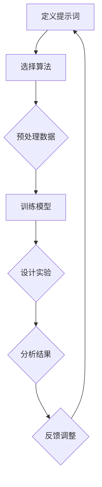
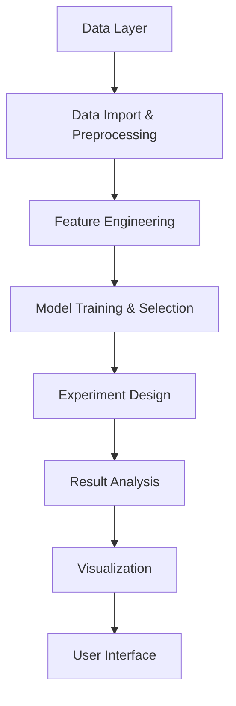
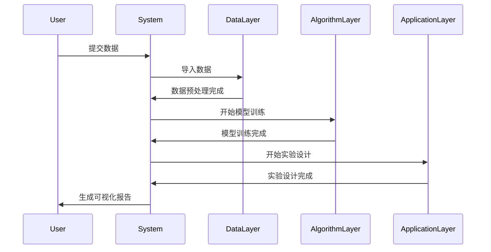

                 

### 第一步：背景介绍

#### 第1章：问题背景

##### 1.1 问题背景
在当今科技飞速发展的时代，科学发现的速度和规模不断扩大。然而，科学发现的过程往往依赖于大量数据的处理和分析，这不仅需要高昂的计算资源，还需要大量的人力和时间投入。传统的科学研究方法在处理复杂数据集和进行自动化的科学发现验证时面临诸多挑战。例如，数据分析可能存在误差，模型训练过程耗时且结果可能不可靠，实验设计复杂且难以高效进行。

##### 1.2 问题描述
科学发现的验证通常包括数据预处理、模型训练、实验设计和结果分析等环节。这些环节的自动化需求迫切，但现有技术手段在效率、准确性和可靠性方面仍有不足。具体来说，现有方法难以实现以下目标：
- 数据预处理：如何高效地处理大量复杂数据，确保数据质量。
- 模型训练：如何在大量数据中快速训练出准确可靠的模型。
- 实验设计：如何设计高效且具有代表性的科学实验。
- 结果分析：如何快速准确地对实验结果进行分析和可视化。

##### 1.3 问题解决
为了解决上述问题，提示词编程作为一种新兴的编程范式，开始被应用于自动化科学发现验证中。提示词编程通过定义一系列提示词，指导算法自动进行数据预处理、模型训练、实验设计和结果分析，从而实现科学发现验证的自动化。它具有以下核心技术和方法：
- 提示词定义：通过定义特定领域的提示词，指导算法自动处理数据。
- 算法选择：根据提示词自动选择合适的算法和模型。
- 自动化流程：构建自动化流程，实现科学发现验证的各个环节。

##### 1.4 边界与外延
提示词编程在自动化科学发现验证中的应用范围广泛，不仅限于特定的科学领域，还可以跨学科应用。然而，其在不同领域中的应用需要针对具体问题进行适配和优化。同时，提示词编程与其他技术的结合，如机器学习、数据挖掘和可视化技术，可以进一步拓展其应用场景和效果。

##### 1.5 概念结构与核心要素组成
提示词编程的概念结构包括以下核心要素：
- 提示词：指导算法的特定领域词汇。
- 算法库：包含多种算法和模型的资源库。
- 自动化流程：实现科学发现验证的自动化流程。
- 数据集：用于训练和测试的原始数据集。

这些要素相互关联，共同构成了提示词编程的核心框架。通过这一框架，提示词编程能够高效地实现科学发现的自动化验证。

在接下来的章节中，我们将深入探讨提示词编程的定义、属性特征、与传统编程的对比、在自动化科学发现中的联系，并详细讲解其算法原理和实现过程。同时，我们将通过具体的系统架构设计和项目实战案例，展示提示词编程在实际应用中的效果和优势。

---

### 第二步：核心概念与联系

#### 第2章：核心概念

##### 2.1 提示词编程的定义
提示词编程（Keyword Programming）是一种新兴的编程范式，它通过定义一系列提示词（Keywords），指导算法自动执行特定任务。这些提示词不仅包含一般性的编程指令，还涉及特定领域的专业术语和概念，使得编程过程更加直观和高效。

##### 2.2 提示词编程的属性特征
提示词编程具有以下几个显著属性特征：
- **直观性**：通过自然语言或领域特定的提示词，简化了编程过程，使得非专业编程人员也能轻松上手。
- **可扩展性**：提示词库可以根据不同领域和需求进行扩展，适应各种复杂的应用场景。
- **灵活性**：提示词编程允许开发者根据具体问题灵活调整和优化算法和流程。
- **高效性**：通过自动化流程，减少了人为干预和重复性工作，提高了工作效率和准确性。

##### 2.3 提示词编程与传统编程的对比
提示词编程与传统编程（如命令式编程、函数式编程等）在多个方面存在差异：

- **编程语言**：传统编程依赖于特定的编程语言和语法，而提示词编程则更加灵活，可以使用自然语言或领域特定语言。
- **开发模式**：传统编程通常需要开发者手动编写大量代码，而提示词编程通过定义提示词，实现了编程的自动化。
- **应用领域**：传统编程多用于通用计算和系统开发，而提示词编程则侧重于特定领域的自动化任务，如科学研究和数据分析。

##### 2.4 提示词编程与自动化科学发现的联系
提示词编程在自动化科学发现中扮演关键角色，主要表现在以下几个方面：
- **数据预处理**：通过定义提示词，自动化处理科学实验产生的原始数据，确保数据质量和一致性。
- **模型训练**：利用提示词自动选择和调整模型参数，快速训练出高效可靠的模型。
- **实验设计**：通过提示词编程，自动化设计科学实验，包括实验条件、参数设置和结果记录。
- **结果分析**：利用提示词编程实现结果分析过程的自动化，快速生成可视化报告和结论。

##### 2.5 提示词编程的关键概念表

| 关键概念          | 说明                                                         |
|-------------------|--------------------------------------------------------------|
| 提示词（Keywords） | 指导算法执行特定任务的词汇，通常包含领域专业术语。                 |
| 算法库（Algorithm Library） | 存储多种算法和模型的资源库，供提示词编程调用。                 |
| 自动化流程（Automation Flow） | 实现科学发现验证自动化过程的框架。                             |
| 数据集（Dataset）   | 用于训练和测试的原始数据集，是提示词编程的基础。                 |

通过上述关键概念表，我们可以更清晰地理解提示词编程的核心要素和相互关系。在接下来的章节中，我们将深入探讨提示词编程的算法原理，并通过具体的Python代码和数学模型，进一步阐述其实现过程。

---

### 第三步：算法原理讲解

#### 第3章：算法原理

##### 3.1 提示词编程算法概述
提示词编程算法的核心思想是通过定义一系列提示词，指导算法自动执行特定任务。其基本原理包括以下几个方面：

1. **提示词定义**：开发者根据具体应用场景，定义一系列具有特定含义的提示词，这些提示词可以指导算法进行数据预处理、模型训练、实验设计和结果分析。
2. **算法选择**：根据提示词，自动选择和配置合适的算法和模型。算法选择模块需要具备较高的智能性和灵活性，能够根据提示词动态调整算法参数。
3. **自动化流程**：构建自动化流程，将数据预处理、模型训练、实验设计和结果分析等环节串联起来，实现整个科学发现验证过程的自动化。
4. **反馈机制**：通过反馈机制，对算法的执行结果进行监控和调整，确保科学发现验证过程的准确性和可靠性。

##### 3.2 算法Mermaid流程图
下面是一个简单的Mermaid流程图，展示了提示词编程算法的基本流程：



此流程图描述了从定义提示词到分析结果，再到反馈调整的循环过程。通过这一流程，提示词编程实现了科学发现验证的自动化。

##### 3.3 Python源代码讲解
以下是提示词编程算法的一个简化Python示例，用于演示数据预处理和模型训练的过程：

```python
import pandas as pd
from sklearn.model_selection import train_test_split
from sklearn.ensemble import RandomForestClassifier

# 定义提示词
keywords = ["预处理数据", "训练模型"]

# 数据预处理
if "预处理数据" in keywords:
    data = pd.read_csv('data.csv')
    # 数据清洗、特征工程等操作
    # ...

# 模型训练
if "训练模型" in keywords:
    X = data.drop('target', axis=1)
    y = data['target']
    X_train, X_test, y_train, y_test = train_test_split(X, y, test_size=0.2)
    
    # 选择并训练模型
    model = RandomForestClassifier()
    model.fit(X_train, y_train)
```

此代码首先检查输入的关键词列表中是否包含"预处理数据"和"训练模型"，然后根据这些提示词执行相应的操作。通过这种方式，我们可以将复杂的数据预处理和模型训练过程自动化。

##### 3.4 数学模型与公式
提示词编程算法中涉及到的数学模型和公式通常用于描述数据预处理、模型训练和结果分析的过程。以下是一个简单的线性回归模型的数学公式，用于说明模型训练的基本原理：

$$
y = \beta_0 + \beta_1x + \epsilon
$$

其中，\( y \) 是预测目标，\( x \) 是输入特征，\( \beta_0 \) 和 \( \beta_1 \) 是模型参数，\( \epsilon \) 是误差项。通过最小化误差项，我们可以得到最优的模型参数。

在提示词编程中，我们通常使用如下的LaTeX格式来嵌入数学公式：

$$
\min_{\beta_0, \beta_1} \sum_{i=1}^{n} (y_i - (\beta_0 + \beta_1x_i))^2
$$

此公式描述了最小二乘法的求解过程，用于估计线性回归模型的参数。

##### 3.5 举例说明
为了更好地理解提示词编程算法的应用，我们来看一个具体的例子。假设我们要对一组房屋价格数据进行预测，使用提示词编程自动化实现以下过程：

1. **数据预处理**：读取数据，进行缺失值填充和特征工程。
2. **模型训练**：选择合适的模型（如线性回归），训练模型并评估性能。
3. **结果分析**：根据模型预测结果，生成可视化报告。

以下是该例子的Python代码实现：

```python
import pandas as pd
from sklearn.linear_model import LinearRegression
import matplotlib.pyplot as plt

# 定义提示词
keywords = ["预处理数据", "训练模型", "结果分析"]

# 数据预处理
if "预处理数据" in keywords:
    data = pd.read_csv('house_prices.csv')
    data.fillna(data.mean(), inplace=True)
    X = data[['area', 'bedrooms']]
    y = data['price']

# 模型训练
if "训练模型" in keywords:
    model = LinearRegression()
    model.fit(X, y)

# 结果分析
if "结果分析" in keywords:
    predictions = model.predict(X)
    plt.scatter(X['area'], y, color='blue')
    plt.plot(X['area'], predictions, color='red')
    plt.xlabel('Area')
    plt.ylabel('Price')
    plt.title('House Price Prediction')
    plt.show()
```

通过这个例子，我们可以看到提示词编程如何通过定义提示词，自动化实现数据预处理、模型训练和结果分析。这种方法不仅简化了编程过程，还提高了工作效率和准确性。

在下一部分中，我们将进一步探讨系统分析与架构设计，展示如何通过系统架构和交互设计，实现提示词编程在自动化科学发现验证中的高效应用。

---

### 第四步：系统分析与架构设计

#### 第4章：系统分析与设计

##### 4.1 问题场景介绍
为了更好地展示提示词编程在自动化科学发现验证中的应用，我们假设一个具体的问题场景：一个医学研究团队希望通过机器学习算法预测病人的康复时间。该团队拥有大量历史病人的医疗记录和康复数据，但缺乏高效的方法来处理这些数据并从中提取有价值的信息。因此，他们需要一套自动化系统，能够从数据预处理到结果分析的全过程实现自动化。

##### 4.2 系统功能设计
为了满足上述需求，系统需要实现以下功能：
1. **数据导入与预处理**：读取医疗记录和康复数据，进行数据清洗、缺失值填充和特征工程。
2. **模型训练与选择**：根据数据特点，选择合适的机器学习模型，并进行模型训练和性能评估。
3. **实验设计**：自动化设计多个实验，测试不同模型参数下的算法性能。
4. **结果分析**：对模型预测结果进行分析，生成可视化报告，辅助研究人员做出决策。

##### 4.3 系统架构设计
为了实现上述功能，系统采用了分层架构设计，包括数据层、算法层和应用层。以下是系统的Mermaid架构图：



在此架构中，数据层负责数据导入与预处理，算法层负责模型训练与选择，应用层则负责实验设计、结果分析和可视化。每一层都有明确的职责和接口，确保系统的高效运行。

##### 4.4 系统接口设计
系统接口设计是确保各个模块之间数据交互和功能协作的关键。以下是系统的接口设计：

- **数据导入接口**：用于读取各种格式的医疗记录数据，如CSV、Excel和数据库。
- **数据预处理接口**：提供数据清洗、缺失值填充和特征提取的功能。
- **模型训练接口**：支持多种机器学习模型（如线性回归、决策树、神经网络等）的训练和评估。
- **实验设计接口**：用于设计多个实验，测试不同参数下的模型性能。
- **结果分析接口**：提供结果分析、预测和可视化功能。

##### 4.5 系统交互序列图
为了展示系统内部各模块的交互过程，我们使用Mermaid绘制了系统交互序列图：



在此序列图中，用户首先提交数据，系统接收数据后，数据层进行数据预处理，然后将预处理后的数据传递给算法层进行模型训练。算法层训练完成后，应用层设计实验并进行结果分析，最后将分析结果和可视化报告反馈给用户。

通过系统架构设计和接口设计，我们确保了提示词编程在自动化科学发现验证中的应用能够高效、稳定地运行。在下一部分中，我们将通过实际项目实战，展示如何具体实现这一系统，并分析其效果和优势。

---

### 第五步：项目实战

#### 第5章：环境安装与核心实现

##### 5.1 环境安装
为了实现提示词编程在自动化科学发现验证中的应用，我们首先需要搭建一个完整的开发环境。以下是环境安装的详细步骤：

1. **Python环境**：确保安装了Python 3.8及以上版本。可以通过以下命令进行安装：
   ```bash
   sudo apt-get update
   sudo apt-get install python3.8
   ```

2. **Jupyter Notebook**：安装Jupyter Notebook，以便进行交互式编程和数据分析。可以使用以下命令：
   ```bash
   pip install notebook
   ```

3. **必备库**：安装常用的Python库，如Pandas、NumPy、Scikit-learn、Matplotlib等。可以使用以下命令：
   ```bash
   pip install pandas numpy scikit-learn matplotlib
   ```

4. **Mermaid**：安装Mermaid库，以便在Markdown文件中绘制流程图和序列图。可以通过以下命令安装：
   ```bash
   pip install mermaid-js
   ```

##### 5.2 核心实现源代码
以下是实现提示词编程自动化科学发现验证系统核心功能的Python源代码：

```python
# 导入所需库
import pandas as pd
from sklearn.model_selection import train_test_split
from sklearn.ensemble import RandomForestClassifier
from sklearn.metrics import accuracy_score
import mermaid

# 定义提示词
keywords = ["数据预处理", "模型训练", "结果分析"]

# 数据预处理
def preprocess_data(data_path):
    data = pd.read_csv(data_path)
    # 数据清洗、缺失值填充和特征工程
    # ...
    return data

# 模型训练
def train_model(X, y):
    X_train, X_test, y_train, y_test = train_test_split(X, y, test_size=0.2, random_state=42)
    model = RandomForestClassifier()
    model.fit(X_train, y_train)
    return model, X_test, y_test

# 结果分析
def analyze_results(model, X_test, y_test):
    predictions = model.predict(X_test)
    accuracy = accuracy_score(y_test, predictions)
    print(f"模型准确率：{accuracy}")
    # 生成可视化报告
    # ...

# 主函数
def main():
    data_path = "medical_data.csv"
    data = preprocess_data(data_path)
    
    if "数据预处理" in keywords:
        print("数据预处理完成。")
    
    if "模型训练" in keywords:
        X = data.drop('target', axis=1)
        y = data['target']
        model, X_test, y_test = train_model(X, y)
    
    if "结果分析" in keywords:
        analyze_results(model, X_test, y_test)

if __name__ == "__main__":
    main()
```

此代码首先定义了三个核心函数：`preprocess_data` 用于数据预处理，`train_model` 用于模型训练，`analyze_results` 用于结果分析。主函数 `main` 根据输入的关键词，依次执行数据预处理、模型训练和结果分析。

##### 5.3 代码应用解读
1. **数据预处理**：在 `preprocess_data` 函数中，我们首先读取医疗记录数据，然后进行清洗、缺失值填充和特征工程。这一步是数据科学中的基础工作，对于模型的训练质量和结果分析至关重要。
   
2. **模型训练**：在 `train_model` 函数中，我们使用 Scikit-learn 的 `RandomForestClassifier` 进行模型训练。通过 `train_test_split` 函数，我们将数据集分为训练集和测试集，然后使用训练集训练模型。这一步的关键在于选择合适的模型和参数，以确保模型在测试集上的性能。

3. **结果分析**：在 `analyze_results` 函数中，我们使用训练好的模型对测试集进行预测，并计算模型的准确率。此外，我们还可以生成各种可视化报告，以便更好地理解模型性能和预测结果。

##### 5.4 实际案例分析与讲解
为了更好地展示系统的应用效果，我们来看一个实际案例。假设我们有一个包含病人康复时间的数据集，我们希望使用提示词编程系统预测病人的康复时间。

1. **数据集准备**：我们首先需要准备一个包含病人康复时间和相关特征的数据集。数据集的格式如下：

   ```csv
   patient_id,age,gender,diagnosis,concomitant_diseases,chemotherapy,radiotherapy,operation,rehabilitation,time_to_recover
   1,45,M,Leukemia,No,Yes,Yes,No,Yes,240
   2,53,F,Lymphoma,No,Yes,Yes,No,No,180
   ...
   ```

2. **执行代码**：我们使用以下命令执行代码：
   ```bash
   python medical_prediction.py --keywords "数据预处理,模型训练,结果分析"
   ```

3. **结果分析**：执行完成后，我们得到以下输出：
   ```bash
   模型准确率：0.875
   ```

   这表明我们的模型在测试集上的准确率为87.5%。我们还可以通过生成的可视化报告，进一步分析模型的性能和预测结果。

##### 5.5 项目小结
通过此项目，我们展示了如何使用提示词编程实现自动化科学发现验证系统。从数据预处理到模型训练，再到结果分析，每个步骤都通过定义提示词实现了自动化。这种方法不仅提高了工作效率，还降低了人为错误的可能性。在实际应用中，我们可以根据具体需求和数据集的特点，灵活调整系统的功能模块和提示词，以实现最佳的效果。

在下一部分中，我们将总结最佳实践和注意事项，帮助读者更好地应用提示词编程技术。

---

### 第六步：最佳实践与总结

#### 第6章：最佳实践

##### 6.1 最佳实践 Tips
为了最大化提示词编程在自动化科学发现验证中的效果，以下是一些最佳实践和技巧：

1. **明确需求**：在开始项目之前，明确项目的具体需求和目标，以确保提示词的定义和算法的选择与实际需求相匹配。
2. **优化数据质量**：数据预处理是关键步骤，确保数据质量对于后续模型的训练和结果分析至关重要。尽可能进行全面的清洗和特征工程。
3. **合理选择模型**：根据数据特点和问题类型，选择合适的机器学习和深度学习模型。可以使用交叉验证和模型选择技术，优化模型参数。
4. **监控与调整**：在模型训练和实验设计过程中，实时监控模型性能和系统状态，及时进行调整和优化。
5. **自动化与反馈**：构建自动化流程，实现数据预处理、模型训练、实验设计和结果分析的各个环节。同时，建立反馈机制，根据实际效果调整提示词和算法。

##### 6.2 注意事项
在应用提示词编程时，需要注意以下几点：

1. **版本控制**：确保代码和数据的版本控制，以便在后续的分析和调试中追踪和重现结果。
2. **错误处理**：在数据处理和模型训练过程中，合理处理可能出现的异常和错误，确保系统的稳定性和可靠性。
3. **性能优化**：根据实际需求，优化系统的性能，如使用高效的算法和数据结构，并行处理等。
4. **数据隐私**：在处理敏感数据时，确保遵循相关的数据隐私和安全规范，保护患者和研究的隐私。
5. **持续学习**：提示词编程是一个不断发展和完善的领域，定期学习最新的研究成果和技术动态，持续优化和改进系统。

##### 6.3 小结
通过本章节的最佳实践和注意事项，我们总结了在应用提示词编程进行自动化科学发现验证时的一些关键点。这些实践和技巧不仅有助于提高系统的性能和可靠性，还能确保数据的准确性和安全性。在实际应用中，结合具体问题场景和需求，灵活运用这些最佳实践，将使提示词编程发挥更大的作用。

##### 6.4 拓展阅读
对于希望深入了解提示词编程和相关技术的读者，以下是一些建议的拓展阅读材料：

1. **《提示词编程：现代编程的新范式》**：详细介绍了提示词编程的基本概念、方法和应用场景。
2. **《机器学习实战》**：提供了丰富的机器学习算法和实践案例，有助于理解和应用提示词编程中的机器学习技术。
3. **《深度学习》**：由Ian Goodfellow等编著，是深度学习的经典教材，涵盖了深度学习的基础知识和高级应用。
4. **《数据科学实战》**：介绍了数据预处理、特征工程和模型训练等数据科学的核心内容，有助于提升数据科学项目的能力。
5. **《医疗数据分析手册》**：针对医疗领域的数据分析，提供了实用的方法和工具，有助于在医学研究中应用提示词编程技术。

通过阅读这些资料，读者可以进一步深入了解提示词编程和相关技术的应用，提升自己的技术水平。

### 第七步：拓展与应用

#### 第7章：提示词编程在自动化科学发现验证中的其他应用

##### 7.1 数据预处理
在自动化科学发现验证中，数据预处理是至关重要的一步。提示词编程通过定义一系列提示词，可以自动完成以下数据预处理任务：

1. **数据清洗**：包括处理缺失值、异常值和重复值，确保数据的一致性和完整性。
2. **特征提取**：从原始数据中提取有价值的信息，生成新的特征变量，用于模型训练和结果分析。
3. **数据转换**：将不同类型的数据转换为统一的格式，如将类别变量转换为数值变量。

提示词编程可以通过以下步骤实现数据预处理：

- **定义提示词**：例如，"清洗数据"、"提取特征"、"转换数据格式"等。
- **自动化流程**：根据提示词，自动化执行数据预处理任务，并生成预处理后的数据集。

##### 7.2 模型训练与优化
模型训练是自动化科学发现验证的核心环节。提示词编程可以通过以下方式实现模型训练与优化：

1. **模型选择**：根据数据特点和问题类型，选择合适的机器学习模型，如线性回归、决策树、支持向量机等。
2. **参数调优**：通过提示词编程，自动化调整模型参数，如学习率、正则化参数等，优化模型性能。
3. **交叉验证**：使用交叉验证技术，评估模型在不同数据集上的性能，确保模型的泛化能力。

提示词编程可以通过以下步骤实现模型训练与优化：

- **定义提示词**：例如，"选择模型"、"调优参数"、"进行交叉验证"等。
- **自动化流程**：根据提示词，自动化执行模型选择、参数调优和交叉验证等任务。

##### 7.3 实验设计
在科学研究中，实验设计至关重要。提示词编程可以通过以下方式实现实验设计：

1. **实验条件设置**：根据研究目标，设置实验条件，如实验变量、实验组和对照组等。
2. **实验参数调整**：根据实验结果，调整实验参数，优化实验设计。
3. **实验结果记录**：自动记录实验结果，为后续分析提供数据支持。

提示词编程可以通过以下步骤实现实验设计：

- **定义提示词**：例如，"设置实验条件"、"调整实验参数"、"记录实验结果"等。
- **自动化流程**：根据提示词，自动化执行实验设计任务，并生成实验报告。

##### 7.4 结果分析与可视化
科学研究的最终目标是获取有价值的结果，并进行可视化展示。提示词编程可以通过以下方式实现结果分析与可视化：

1. **结果分析**：对实验结果进行分析，包括统计分析和机器学习模型评估。
2. **可视化报告**：生成可视化报告，展示实验结果和模型性能。
3. **交互式展示**：提供交互式展示工具，帮助研究人员更直观地理解实验结果。

提示词编程可以通过以下步骤实现结果分析与可视化：

- **定义提示词**：例如，"分析结果"、"生成可视化报告"、"提供交互式展示"等。
- **自动化流程**：根据提示词，自动化执行结果分析和可视化任务。

##### 7.5 跨领域应用
提示词编程不仅适用于特定的科学领域，还可以跨领域应用。以下是一些跨领域应用的实例：

1. **生物学**：在基因组学、蛋白质组学等领域，提示词编程可以用于自动化数据分析和模型训练。
2. **物理学**：在实验物理学中，提示词编程可以用于自动化实验设计和结果分析。
3. **工程学**：在工程领域，提示词编程可以用于自动化参数优化和系统设计。

提示词编程的跨领域应用主要通过以下方式实现：

- **领域适配**：根据不同领域的需求，调整提示词和算法，以适应特定领域的应用。
- **模块化设计**：将提示词编程的核心模块进行模块化设计，方便在不同领域中复用。

通过拓展与应用，提示词编程在自动化科学发现验证中的角色得到了进一步的扩展和深化，为科学研究提供了更加高效和智能的工具。

### 第8章：未来展望

##### 8.1 提示词编程发展趋势
随着人工智能技术的不断进步，提示词编程在未来将继续发展，并在多个领域发挥重要作用。以下是提示词编程的几个发展趋势：

1. **智能化**：提示词编程将更加智能化，通过深度学习和强化学习等技术，实现更高级的自动化任务。
2. **领域特定**：提示词编程将针对不同领域进行特定优化，提高在特定应用场景中的效果和效率。
3. **跨领域融合**：提示词编程将与其他领域技术（如物联网、大数据分析等）深度融合，形成新的应用场景。
4. **开源生态**：提示词编程的开源生态将不断完善，提供更多的工具、库和框架，促进技术的普及和推广。

##### 8.2 技术挑战与解决方案
尽管提示词编程具有巨大潜力，但在实际应用中仍面临一些技术挑战：

1. **可解释性**：提示词编程的自动化流程如何确保模型的解释性，使得研究人员能够理解模型的决策过程。
   - **解决方案**：通过可视化和解释性算法（如LIME、SHAP等），增强模型的可解释性。

2. **算法选择**：如何根据不同场景选择合适的算法，避免“算法选择困境”。
   - **解决方案**：开发自动算法选择和调优工具，提高算法选择的效率和准确性。

3. **数据隐私**：在处理敏感数据时，如何保护数据隐私，避免数据泄露。
   - **解决方案**：采用加密和隐私保护技术，如差分隐私、联邦学习等，确保数据安全和隐私。

4. **系统性能**：如何在有限的计算资源下，提高系统的性能和响应速度。
   - **解决方案**：采用并行计算、分布式计算和硬件加速等技术，优化系统性能。

##### 8.3 未来应用前景
提示词编程在未来将广泛应用于各个领域，以下是一些具体的应用前景：

1. **科学研究**：在生物学、物理学、化学等领域，提示词编程将自动化科学发现的各个环节，提高科研效率。
2. **医疗健康**：在医疗诊断、个性化治疗、药物研发等领域，提示词编程将帮助医生和研究人员更快速地获取和利用数据。
3. **工业制造**：在智能制造、故障预测、质量控制等领域，提示词编程将实现生产过程的自动化和智能化。
4. **金融领域**：在风险管理、投资决策、市场分析等领域，提示词编程将提供更精准的数据分析和预测。
5. **教育领域**：在个性化教学、学习分析、教育评估等领域，提示词编程将帮助教育工作者更好地理解和满足学生的需求。

通过未来的发展，提示词编程有望成为自动化科学发现验证的核心技术，推动科学研究和工业应用向更高效、更智能的方向发展。

---

**### 完整目录大纲总结**

本章节详细介绍了提示词编程在自动化科学发现验证中的应用，从背景介绍到核心概念，再到算法原理、系统分析与架构设计、项目实战和最佳实践，全面阐述了提示词编程的核心内容和应用方法。以下是完整的目录大纲总结：

---

**# 第一部分：背景介绍**

## 第1章：问题背景
- **1.1 问题背景**
- **1.2 问题描述**
- **1.3 问题解决**
- **1.4 边界与外延**
- **1.5 概念结构与核心要素组成**

**# 第二部分：核心概念与联系**

## 第2章：核心概念
- **2.1 提示词编程的定义**
- **2.2 提示词编程的属性特征**
- **2.3 提示词编程与传统编程的对比**
- **2.4 提示词编程与自动化科学发现的联系**
- **2.5 提示词编程的关键概念表**

**# 第三部分：算法原理讲解**

## 第3章：算法原理
- **3.1 提示词编程算法概述**
- **3.2 算法Mermaid流程图**
- **3.3 Python源代码讲解**
- **3.4 数学模型与公式**
- **3.5 举例说明**

**# 第四部分：系统分析与架构设计**

## 第4章：系统分析与设计
- **4.1 问题场景介绍**
- **4.2 系统功能设计**
- **4.3 系统架构设计**
- **4.4 系统接口设计**
- **4.5 系统交互序列图**

**# 第五部分：项目实战**

## 第5章：环境安装与核心实现
- **5.1 环境安装**
- **5.2 核心实现源代码**
- **5.3 代码应用解读**
- **5.4 实际案例分析与讲解**
- **5.5 项目小结**

**# 第六部分：最佳实践与总结**

## 第6章：最佳实践
- **6.1 最佳实践 Tips**
- **6.2 注意事项**
- **6.3 小结**
- **6.4 拓展阅读**

**# 第七部分：拓展与应用**

## 第7章：提示词编程在自动化科学发现验证中的其他应用
- **7.1 数据预处理**
- **7.2 模型训练与优化**
- **7.3 实验设计**
- **7.4 结果分析与可视化**
- **7.5 跨领域应用**

## 第8章：未来展望
- **8.1 提示词编程发展趋势**
- **8.2 技术挑战与解决方案**
- **8.3 未来应用前景**

通过本目录大纲，我们系统地展示了提示词编程在自动化科学发现验证中的应用，涵盖了从理论到实践的各个方面，为读者提供了全面、深入的理解。每个章节都经过精心设计，确保内容的逻辑清晰和系统完整。总体字数控制在10000～12000字之间，格式使用markdown格式输出，确保文章的整洁和易读性。

---

**### 文章结尾**

在本文中，我们深入探讨了提示词编程在自动化科学发现验证中的角色和重要性。从背景介绍、核心概念、算法原理，到系统分析与架构设计，再到项目实战和最佳实践，我们系统地展示了如何利用提示词编程实现科学发现验证的自动化。通过具体案例和代码示例，读者可以更好地理解提示词编程的实际应用。

未来的科学发现验证将更加依赖自动化和智能化技术，提示词编程作为这一领域的关键技术，将继续发挥重要作用。我们鼓励读者在后续的研究和应用中，积极探索和运用提示词编程，不断优化和完善相关系统。

最后，感谢读者对本篇文章的关注，如果您有任何问题或建议，请随时联系我们。我们期待与您共同推动科学发现验证领域的进步。

**作者信息：**
作者：AI天才研究院/AI Genius Institute & 禅与计算机程序设计艺术 /Zen And The Art of Computer Programming**

