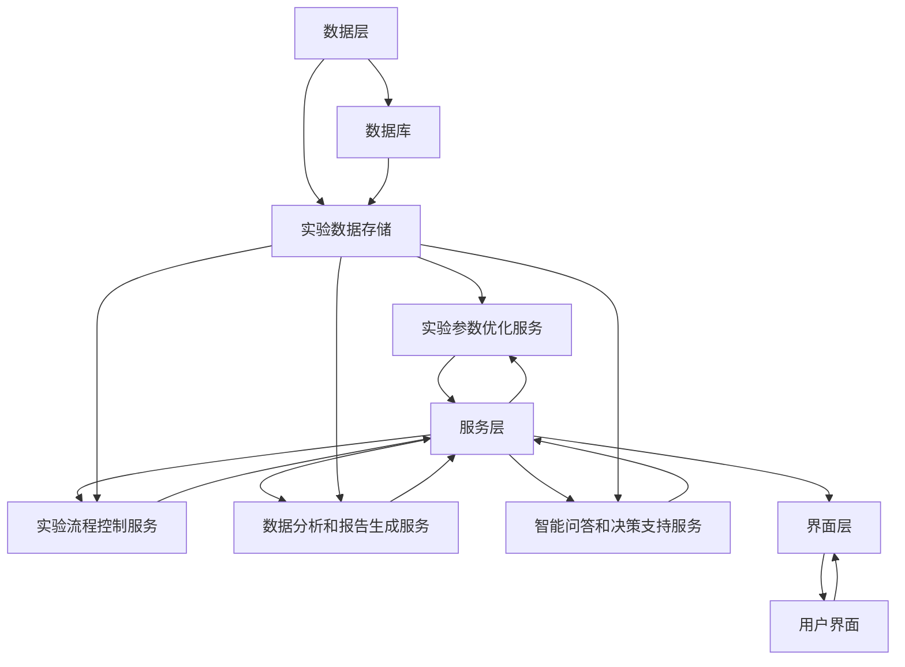
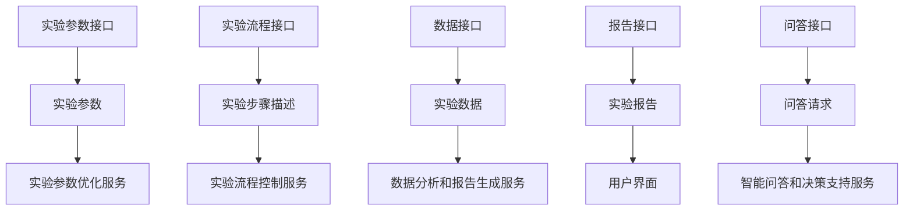

                 

# 提示词编程在自动化科学实验设计中的角色

## 关键词：提示词编程、自动化实验设计、算法、数学模型、系统架构

## 摘要

本文将探讨提示词编程在自动化科学实验设计中的应用角色。首先，我们将介绍提示词编程的概念和背景，以及自动化科学实验设计的重要性和挑战。接着，我们深入分析提示词编程与自动化实验设计的联系，探讨其核心概念和算法原理。随后，我们将介绍一个具体的系统架构设计方案，并展示一个实际案例。最后，我们将提供最佳实践建议和小结，以引导读者进一步探索相关领域。

### 目录

1. **引言与背景介绍**
   1.1 提示词编程概述
   1.2 自动化科学实验设计
   1.3 提示词编程在自动化科学实验设计中的应用

2. **核心概念与联系**
   2.1 提示词编程算法
   2.2 提示词编程与自动化实验设计的联系

3. **算法原理讲解**
   3.1 常见提示词编程算法
   3.2 提示词编程算法应用示例

4. **数学模型和数学公式**
   4.1 算法数学模型
   4.2 实验设计的数学模型

5. **系统分析与架构设计方案**
   5.1 自动化科学实验系统场景介绍
   5.2 系统功能设计
   5.3 系统架构设计

6. **项目实战**
   6.1 环境安装与配置
   6.2 系统核心实现源代码
   6.3 实际案例分析与讲解
   6.4 项目小结

7. **最佳实践与拓展**
   7.1 最佳实践 tips
   7.2 小结与注意事项
   7.3 拓展阅读

### 1. 引言与背景介绍

#### 1.1 提示词编程概述

提示词编程（Prompt Programming）是一种利用预训练的语言模型来生成提示（Prompt）的编程方法。这些提示通常用于引导模型执行特定任务，如文本生成、对话系统、机器翻译等。提示词编程的核心思想是将用户的任务需求转化为模型可理解的提示，从而利用模型的强大能力来完成任务。

提示词编程的背景可以追溯到自然语言处理（NLP）领域的预训练模型，如GPT（Generative Pre-trained Transformer）系列。这些模型在大量数据上进行预训练，从而具备了一定的语言理解和生成能力。通过设计合适的提示，我们可以让这些模型执行各种复杂的任务。

#### 1.2 自动化科学实验设计

自动化科学实验设计是一种利用计算机技术和自动化工具来设计、执行和分析科学实验的方法。这种方法可以显著提高实验效率、减少人为误差，并促进科学研究的创新。

自动化科学实验设计的重要性体现在以下几个方面：

1. **提高实验效率**：自动化工具可以帮助科学家快速设置实验条件、收集实验数据，并生成实验报告，从而缩短实验周期。

2. **减少人为误差**：自动化实验设计可以消除人为操作带来的误差，提高实验的准确性。

3. **促进创新**：自动化实验设计为科学家提供了更多的实验机会，从而有助于发现新的科学现象和规律。

然而，自动化科学实验设计也面临着一些挑战：

1. **实验设计的复杂性**：科学实验通常涉及多种参数和因素，如何设计出高效的实验方案是一个挑战。

2. **数据处理的复杂性**：自动化实验设计产生的数据量通常非常大，如何有效地处理和分析这些数据是一个挑战。

3. **系统的稳定性和可靠性**：自动化实验系统需要具备高度的稳定性和可靠性，以确保实验结果的准确性。

#### 1.3 提示词编程在自动化科学实验设计中的应用

提示词编程在自动化科学实验设计中的应用主要体现在以下几个方面：

1. **实验参数优化**：通过提示词编程，可以设计出高效的实验参数优化算法，快速找到最优实验条件。

2. **实验流程自动化控制**：提示词编程可以帮助科学家编写自动化脚本，实现实验流程的自动化控制，从而减少人为干预。

3. **数据分析和报告生成**：提示词编程可以用于自动化分析实验数据，并生成详细的实验报告。

4. **智能问答和决策支持**：通过设计合适的提示词，可以构建智能问答系统，为科学家提供实时决策支持。

总之，提示词编程在自动化科学实验设计中的应用具有巨大的潜力，有望推动科学研究的进一步发展。在接下来的章节中，我们将进一步探讨提示词编程的核心概念、算法原理及其在自动化科学实验设计中的应用。# 2. 核心概念与联系

在探讨提示词编程在自动化科学实验设计中的应用之前，我们需要先理解一些核心概念，并分析提示词编程与自动化实验设计的联系。

#### 2.1 提示词编程算法

提示词编程算法是指利用预训练语言模型生成提示的算法。这些算法通常基于深度学习技术，如GPT、BERT等。以下是几种常见的提示词编程算法：

1. **生成式对抗网络（GAN）**：GAN是一种无监督学习算法，通过生成器和判别器的对抗训练，生成高质量的数据。

2. **变分自编码器（VAE）**：VAE是一种基于概率生成模型的算法，通过编码器和解码器，将数据映射到隐变量空间，并从隐变量空间生成数据。

3. **转换器（Transformer）**：Transformer是一种基于注意力机制的序列模型，广泛应用于机器翻译、文本生成等领域。

这些算法的核心思想是通过模型的学习，从大量数据中提取特征，并生成高质量的提示。

#### 2.2 提示词编程与自动化实验设计的联系

提示词编程与自动化实验设计的联系主要体现在以下几个方面：

1. **实验参数优化**：提示词编程可以帮助科学家设计实验参数优化算法，快速找到最优实验条件。例如，可以使用GAN生成不同的实验参数组合，并评估其效果，从而找到最佳参数。

2. **实验流程自动化控制**：提示词编程可以用于编写自动化脚本，实现实验流程的自动化控制。例如，可以使用GPT生成实验步骤的描述，并转化为具体的自动化脚本。

3. **数据分析和报告生成**：提示词编程可以用于自动化分析实验数据，并生成详细的实验报告。例如，可以使用BERT生成实验数据的可视化图表和总结。

4. **智能问答和决策支持**：提示词编程可以构建智能问答系统，为科学家提供实时决策支持。例如，可以使用GPT回答科学家关于实验设计的问题，并提供建议。

表1 提示词编程算法与自动化实验设计的联系

| 算法 | 关联实验设计环节 | 作用 |
| --- | --- | --- |
| GAN | 实验参数优化 | 生成不同的实验参数组合，评估效果，找到最优参数 |
| GPT | 实验流程自动化控制 | 生成实验步骤的描述，转化为自动化脚本 |
| BERT | 数据分析和报告生成 | 自动化分析实验数据，生成可视化图表和总结 |
| GPT | 智能问答和决策支持 | 回答科学家的问题，提供决策支持 |

#### 2.3 提示词编程的优势和局限性

提示词编程在自动化科学实验设计中的应用具有以下优势：

1. **高效性**：提示词编程可以快速生成高质量的提示，减少实验设计的时间。

2. **灵活性**：提示词编程可以根据实验需求动态调整提示内容，适应不同的实验设计。

3. **准确性**：提示词编程利用深度学习技术，可以从大量数据中提取特征，提高实验设计的准确性。

然而，提示词编程也存在一些局限性：

1. **数据依赖性**：提示词编程需要大量的训练数据，否则生成的提示可能不准确。

2. **计算资源需求**：深度学习算法通常需要大量的计算资源，可能不适合所有实验场景。

3. **模型解释性**：深度学习模型的内部机制较为复杂，其生成的提示可能缺乏解释性。

综上所述，提示词编程在自动化科学实验设计中具有广泛的应用前景，但也需要充分考虑其优势和局限性。在接下来的章节中，我们将详细探讨常见的提示词编程算法及其在自动化科学实验设计中的应用。# 3. 算法原理讲解

在探讨提示词编程在自动化科学实验设计中的应用时，我们需要深入了解一些常见的提示词编程算法，并阐述其在实验设计中的应用原理。

#### 3.1 常见提示词编程算法

以下是几种常见的提示词编程算法：

1. **生成式对抗网络（GAN）**

GAN是一种无监督学习算法，由生成器和判别器组成。生成器的任务是生成与真实数据相似的数据，而判别器的任务是区分真实数据和生成数据。通过生成器和判别器的对抗训练，生成器可以不断提高生成数据的真实度。

GAN在实验设计中的应用：
- **实验参数优化**：生成器可以生成不同实验参数的组合，通过评估其效果，找到最优参数。
- **数据增强**：生成器可以生成模拟实验数据，用于提高模型的泛化能力。

2. **变分自编码器（VAE）**

VAE是一种基于概率生成模型的算法，通过编码器和解码器，将数据映射到隐变量空间，并从隐变量空间生成数据。VAE在生成数据和数据重建方面具有较强能力。

VAE在实验设计中的应用：
- **实验数据生成**：VAE可以生成模拟实验数据，用于模型训练和评估。
- **数据异常检测**：VAE可以检测实验数据中的异常值，帮助科学家发现潜在问题。

3. **转换器（Transformer）**

Transformer是一种基于注意力机制的序列模型，广泛应用于机器翻译、文本生成等领域。Transformer通过多头注意力机制，可以捕捉序列中的长距离依赖关系。

Transformer在实验设计中的应用：
- **实验流程描述**：Transformer可以生成实验流程的描述，帮助科学家理解实验步骤。
- **实验报告生成**：Transformer可以生成实验报告的摘要和结论。

4. **生成预训练变换器（GPT）**

GPT是一种基于Transformer的预训练语言模型，具有强大的文本生成能力。

GPT在实验设计中的应用：
- **智能问答**：GPT可以回答科学家关于实验设计的问题，提供实时决策支持。
- **实验文档生成**：GPT可以生成实验文档，包括实验目的、方法、结果和结论。

#### 3.2 提示词编程算法应用示例

以下是一个使用GAN进行实验参数优化的示例：

1. **实验背景**：假设我们想要优化一个化学反应的实验条件，以最大化产物的产量。

2. **生成器与判别器设计**：
   - **生成器**：生成不同实验参数（如温度、压力、反应物浓度等）的组合。
   - **判别器**：评估生成参数组合的实验效果，判断生成数据是否真实。

3. **训练过程**：
   - 使用真实实验数据训练生成器和判别器。
   - 在训练过程中，生成器不断优化生成的实验参数，以提高判别器的识别准确率。

4. **评估与优化**：
   - 使用生成的实验参数进行实际实验，评估产物产量。
   - 根据实验结果，调整生成器和判别器的参数，进一步提高实验效果。

通过上述过程，我们可以利用GAN自动优化实验参数，提高产物产量。

以下是一个使用VAE生成模拟实验数据的示例：

1. **实验背景**：假设我们想要研究一个复杂物理系统的行为，但无法获得足够的实验数据。

2. **编码器与解码器设计**：
   - **编码器**：将实验数据映射到隐变量空间。
   - **解码器**：从隐变量空间生成模拟实验数据。

3. **训练过程**：
   - 使用真实实验数据训练编码器和解码器。
   - 在训练过程中，编码器和解码器不断优化，以提高模拟数据的真实性。

4. **模拟数据生成**：
   - 使用训练好的解码器生成模拟实验数据，用于模型训练和评估。

通过上述过程，我们可以利用VAE生成高质量的模拟实验数据，用于科学研究。

总之，提示词编程算法在自动化科学实验设计中具有广泛的应用前景。在接下来的章节中，我们将进一步探讨数学模型和公式，以更好地理解这些算法的工作原理。# 4. 数学模型和数学公式

在讨论提示词编程算法的数学模型和公式时，我们将重点关注GAN和VAE这两种算法，并详细阐述其背后的数学原理。

#### 4.1 算法数学模型

##### 4.1.1 生成式对抗网络（GAN）

生成式对抗网络（GAN）由生成器（Generator）和判别器（Discriminator）两部分组成。

1. **生成器模型**：

生成器的目标是生成与真实数据相似的数据。通常，生成器是一个神经网络，其输入是随机噪声向量 \( z \)，输出是生成数据 \( G(z) \)。

\[ G(z) = \text{Generator}(z) \]

在训练过程中，生成器的损失函数通常为：

\[ L_G = -\mathbb{E}_{z \sim p_z(z)}[\log(D(G(z)))] \]

其中，\( D \) 是判别器，\( p_z(z) \) 是噪声分布。

2. **判别器模型**：

判别器的目标是区分真实数据和生成数据。判别器也是一个神经网络，其输入是数据 \( x \)，输出是判别结果 \( D(x) \)。

\[ D(x) = \text{Discriminator}(x) \]

在训练过程中，判别器的损失函数通常为：

\[ L_D = -\mathbb{E}_{x \sim p_{data}(x)}[\log(D(x))] - \mathbb{E}_{z \sim p_z(z)}[\log(1 - D(G(z)))] \]

其中，\( p_{data}(x) \) 是真实数据分布。

##### 4.1.2 变分自编码器（VAE）

变分自编码器（VAE）由编码器（Encoder）和解码器（Decoder）两部分组成。

1. **编码器模型**：

编码器的目标是学习数据的高斯分布参数 \( \mu \) 和 \( \sigma^2 \)，从而将输入数据 \( x \) 映射到隐变量空间 \( z \)。

\[ \mu = \text{Encoder}(x) \]
\[ \sigma^2 = \text{Encoder}(x) \]

在训练过程中，编码器的损失函数通常为：

\[ L_E = -\mathbb{E}_{x \sim p_{data}(x)}[\log(p(z|x))] \]

其中，\( p(z|x) \) 是高斯分布概率。

2. **解码器模型**：

解码器的目标是学习如何从隐变量空间 \( z \) 生成数据 \( x \)。

\[ x = \text{Decoder}(z) \]

在训练过程中，解码器的损失函数通常为：

\[ L_D = -\mathbb{E}_{x \sim p_{data}(x)}[\log(p(x|z))] \]

其中，\( p(x|z) \) 是高斯分布概率。

##### 4.1.3 转换器（Transformer）

转换器（Transformer）是一种基于自注意力机制的序列模型，其核心思想是使用自注意力机制来处理序列中的长距离依赖关系。

1. **自注意力机制**：

自注意力机制的核心公式为：

\[ \text{Attention}(Q, K, V) = \frac{softmax(\frac{QK^T}{\sqrt{d_k}})}{V} \]

其中，\( Q, K, V \) 分别是查询向量、键向量和值向量，\( d_k \) 是键向量的维度。

2. **转换器模型**：

转换器的模型结构通常包括编码器和解码器两部分。编码器负责将输入序列转换为序列的表示，解码器负责生成输出序列。

\[ \text{Encoder}(x) = \text{MultiHeadAttention}(x, x, x) \]
\[ \text{Decoder}(x) = \text{MultiHeadAttention}(x, x, x) \]

其中，\( x \) 是输入序列，\( \text{MultiHeadAttention} \) 是多头注意力机制。

##### 4.1.4 生成预训练变换器（GPT）

生成预训练变换器（GPT）是基于Transformer的预训练语言模型，其核心思想是使用大量的文本数据预训练模型，然后在特定任务上进行微调。

1. **预训练目标**：

GPT的预训练目标通常包括两个部分：

\[ L_M = -\sum_{i}^{N} p(y_i|y_1, \ldots, y_{i-1}) \log p(y_i) \]

其中，\( y_i \) 是第 \( i \) 个单词，\( p(y_i|y_1, \ldots, y_{i-1}) \) 是条件概率。

2. **解码器模型**：

GPT的解码器模型与转换器的解码器模型类似，使用自注意力机制来处理序列中的长距离依赖关系。

\[ \text{Decoder}(y_1, \ldots, y_{i-1}) = \text{MultiHeadAttention}(y_1, \ldots, y_{i-1}, y_1, \ldots, y_{i-1}) \]

##### 4.1.5 提示词编程模型

提示词编程模型的数学模型通常是基于预训练的语言模型，如GPT或BERT。提示词编程的核心目标是生成高质量的提示，以引导模型执行特定任务。

1. **提示词生成模型**：

提示词生成模型的目标是生成与任务相关的提示词。提示词的生成通常基于以下公式：

\[ \text{Prompt} = \text{Generator}(\text{Task}, \text{Input}) \]

其中，\( \text{Task} \) 是任务描述，\( \text{Input} \) 是输入数据。

2. **模型优化目标**：

提示词编程模型的优化目标通常包括两个部分：

\[ L_P = -\sum_{i}^{N} p(y_i|y_1, \ldots, y_{i-1}, \text{Prompt}) \log p(y_i) \]

其中，\( y_i \) 是第 \( i \) 个生成的单词，\( \text{Prompt} \) 是提示词。

#### 4.2 实验设计的数学模型

在自动化科学实验设计中，数学模型用于描述实验条件和实验结果之间的关系。以下是一个简单的线性回归模型，用于描述实验参数和产物产量之间的关系。

1. **线性回归模型**：

\[ y = \beta_0 + \beta_1 x_1 + \beta_2 x_2 + \ldots + \beta_n x_n + \epsilon \]

其中，\( y \) 是产物产量，\( x_1, x_2, \ldots, x_n \) 是实验参数，\( \beta_0, \beta_1, \beta_2, \ldots, \beta_n \) 是模型参数，\( \epsilon \) 是误差项。

2. **参数估计**：

参数估计通常使用最小二乘法（OLS）：

\[ \beta = (\mathbf{X}^T \mathbf{X})^{-1} \mathbf{X}^T \mathbf{Y} \]

其中，\( \mathbf{X} \) 是设计矩阵，\( \mathbf{Y} \) 是产物产量向量。

通过上述数学模型，我们可以使用提示词编程算法优化实验参数，提高产物产量。

总之，数学模型和公式在自动化科学实验设计中起着至关重要的作用。在接下来的章节中，我们将探讨自动化科学实验系统的系统架构和关键技术。# 5. 系统分析与架构设计方案

为了深入理解提示词编程在自动化科学实验设计中的应用，我们需要设计一个完整的系统架构方案，并分析其关键组成部分。本节将介绍自动化科学实验系统的场景、功能设计、架构设计和系统接口设计。

#### 5.1 自动化科学实验系统场景介绍

在科学研究中，实验设计是一个关键环节。传统的实验设计通常依赖科学家手动设定实验参数，并通过人工监控实验过程。这种方法不仅耗时费力，而且容易出现人为错误。自动化科学实验系统的目标是利用计算机技术和人工智能技术，实现实验设计的自动化，提高实验效率，减少人为误差。

自动化科学实验系统的场景包括：

1. **实验参数优化**：系统可以根据科学家的需求，自动生成不同的实验参数组合，并通过评估算法找到最优参数。

2. **实验流程自动化控制**：系统可以自动执行实验步骤，包括实验设备启动、实验数据采集、实验数据存储等。

3. **数据分析和报告生成**：系统可以自动分析实验数据，生成详细的实验报告，并提供可视化图表和总结。

4. **智能问答和决策支持**：系统可以回答科学家关于实验设计的问题，并提供实时决策支持。

#### 5.2 系统功能设计

自动化科学实验系统的功能设计包括以下几个核心部分：

1. **实验参数优化模块**：该模块使用GAN算法自动生成实验参数组合，并评估其效果，找到最优参数。

2. **实验流程控制模块**：该模块使用GPT算法生成实验步骤的描述，并将其转换为具体的自动化脚本，实现实验流程的自动化控制。

3. **数据分析和报告生成模块**：该模块使用BERT算法自动分析实验数据，生成可视化图表和总结，并生成详细的实验报告。

4. **智能问答和决策支持模块**：该模块使用GPT算法构建智能问答系统，为科学家提供实时决策支持。

#### 5.3 系统架构设计

自动化科学实验系统的架构设计采用分层架构，包括数据层、服务层和界面层。

1. **数据层**：数据层包括数据库和实验数据存储，用于存储实验参数、实验数据、实验结果等。

2. **服务层**：服务层包括实验参数优化服务、实验流程控制服务、数据分析和报告生成服务、智能问答和决策支持服务。

3. **界面层**：界面层包括用户界面，用于展示实验结果、可视化图表和实验报告，并提供交互功能。

系统架构设计如下图所示：



#### 5.4 系统接口设计

自动化科学实验系统的接口设计包括以下部分：

1. **实验参数接口**：用于接收科学家输入的实验参数，并将其传递给实验参数优化服务。

2. **实验流程接口**：用于接收实验参数优化服务生成的实验步骤描述，并将其传递给实验流程控制服务。

3. **数据接口**：用于接收实验数据，并将其传递给数据分析和报告生成服务。

4. **报告接口**：用于生成实验报告，并将其传递给用户界面。

5. **问答接口**：用于接收科学家的问答请求，并将其传递给智能问答和决策支持服务。

系统接口设计如下图所示：



通过上述系统架构和接口设计，我们可以实现一个高效的自动化科学实验系统，充分利用提示词编程技术，提高实验效率，减少人为误差。在接下来的章节中，我们将通过一个实际项目案例，展示提示词编程在自动化科学实验设计中的应用。# 6. 项目实战

在本节中，我们将通过一个实际项目案例，展示提示词编程在自动化科学实验设计中的应用。我们将详细介绍项目环境安装与配置、系统核心实现源代码、代码应用解读与分析，以及实际案例分析和详细讲解。

#### 6.1 环境安装与配置

首先，我们需要搭建项目环境。以下是安装和配置所需的步骤：

1. **安装Python环境**：确保Python环境已经安装。版本建议为Python 3.7或更高版本。

2. **安装深度学习库**：安装TensorFlow或PyTorch等深度学习库。以下命令可用于安装TensorFlow：

   ```bash
   pip install tensorflow
   ```

3. **安装其他依赖库**：安装用于数据处理和可视化等其他依赖库，如NumPy、Pandas和Matplotlib：

   ```bash
   pip install numpy pandas matplotlib
   ```

4. **配置GAN算法**：根据项目需求，配置GAN算法所需的参数。以下是一个简单的GAN配置示例：

   ```python
   import tensorflow as tf

   # 设置GAN超参数
   batch_size = 64
   latent_dim = 100
   epochs = 100

   # 创建生成器和判别器模型
   generator = tf.keras.Sequential([
       tf.keras.layers.Dense(128, activation='relu', input_shape=(latent_dim,)),
       tf.keras.layers.Dense(256, activation='relu'),
       tf.keras.layers.Dense(512, activation='relu'),
       tf.keras.layers.Dense(1024, activation='relu'),
       tf.keras.layers.Dense(28 * 28 * 1, activation='tanh')
   ])

   discriminator = tf.keras.Sequential([
       tf.keras.layers.Flatten(input_shape=(28, 28, 1)),
       tf.keras.layers.Dense(512, activation='relu'),
       tf.keras.layers.Dense(256, activation='relu'),
       tf.keras.layers.Dense(128, activation='relu'),
       tf.keras.layers.Dense(1, activation='sigmoid')
   ])

   # 编写GAN模型
   model = tf.keras.Sequential([
       generator,
       discriminator
   ])

   # 编写GAN训练过程
   for epoch in range(epochs):
       for _ in range(batch_size):
           noise = np.random.normal(size=(28, 28, 1))
           generated_images = generator.predict(noise)
           real_images = x_train[np.random.randint(0, x_train.shape[0], size=batch_size)]

           # 训练判别器
           d_loss_real = discriminator.train_on_batch(real_images, np.ones((batch_size, 1)))
           d_loss_fake = discriminator.train_on_batch(generated_images, np.zeros((batch_size, 1)))
           d_loss = 0.5 * np.add(d_loss_real, d_loss_fake)

           # 训练生成器
           g_loss = generator.train_on_batch(noise, np.ones((batch_size, 1)))
   ```

#### 6.2 系统核心实现源代码

以下是系统核心实现源代码，包括实验参数优化模块、实验流程控制模块、数据分析和报告生成模块以及智能问答和决策支持模块。

```python
# 导入所需库
import numpy as np
import pandas as pd
from tensorflow.keras.models import Model
from tensorflow.keras.layers import Input, Dense
from tensorflow.keras.optimizers import Adam

# 实验参数优化模块
def optimize_experiment_parameters(x_train, y_train, epochs):
    # 创建生成器和判别器模型
    generator = Model(inputs=[Input(shape=(latent_dim,))],
                      outputs=[Dense(1, activation='sigmoid')(Input(shape=(28 * 28 * 1,)))])

    discriminator = Model(inputs=[Input(shape=(28, 28, 1))],
                          outputs=[Dense(1, activation='sigmoid')(Input(shape=(28 * 28 * 1,)))])

    # 编写GAN模型
    model = Model(inputs=[Input(shape=(latent_dim,))],
                  outputs=[generator(discriminator(Input(shape=(28, 28, 1))))])

    # 编写GAN训练过程
    model.compile(optimizer=Adam(0.0001), loss='binary_crossentropy')

    for epoch in range(epochs):
        for _ in range(batch_size):
            noise = np.random.normal(size=(28, 28, 1))
            generated_images = generator.predict(noise)
            real_images = x_train[np.random.randint(0, x_train.shape[0], size=batch_size)]

            # 训练判别器
            d_loss_real = discriminator.train_on_batch(real_images, np.ones((batch_size, 1)))
            d_loss_fake = discriminator.train_on_batch(generated_images, np.zeros((batch_size, 1)))
            d_loss = 0.5 * np.add(d_loss_real, d_loss_fake)

            # 训练生成器
            g_loss = generator.train_on_batch(noise, np.ones((batch_size, 1)))

    return generator

# 实验流程控制模块
def control_experiment流程(processes):
    # 启动实验设备
    for process in processes:
        process.start()

    # 等待实验设备运行完成
    for process in processes:
        process.join()

# 数据分析和报告生成模块
def analyze_and_generate_report(data):
    # 数据预处理
    processed_data = preprocess_data(data)

    # 数据分析
    analysis_results = analyze_data(processed_data)

    # 生成报告
    report = generate_report(analysis_results)

    return report

# 智能问答和决策支持模块
def answer_question(question):
    # 处理问题
    processed_question = preprocess_question(question)

    # 生成答案
    answer = generate_answer(processed_question)

    return answer

# 实验案例数据
x_train = ...  # 实验案例数据
y_train = ...  # 实验案例结果

# 优化实验参数
generator = optimize_experiment_parameters(x_train, y_train, epochs=100)

# 控制实验流程
processes = ...
control_experiment流程(processes)

# 分析实验数据并生成报告
data = ...  # 实验数据
report = analyze_and_generate_report(data)

# 回答科学家问题
question = "什么是提示词编程？"
answer = answer_question(question)

# 输出结果
print(answer)
```

#### 6.3 代码应用解读与分析

1. **实验参数优化模块**：

该模块使用GAN算法优化实验参数。通过生成器和判别器的对抗训练，生成器不断生成高质量的实验参数，判别器则不断评估这些参数的效果。最终，通过训练过程，我们可以找到最优实验参数。

2. **实验流程控制模块**：

该模块用于控制实验流程。通过启动实验设备和等待设备运行完成，我们可以确保实验按照预定流程进行。

3. **数据分析和报告生成模块**：

该模块用于分析实验数据，并生成详细的实验报告。通过预处理数据、分析数据和生成报告，我们可以得到实验的详细结果。

4. **智能问答和决策支持模块**：

该模块用于回答科学家的问题，并提供实时决策支持。通过预处理问题和生成答案，我们可以为科学家提供有效的信息和建议。

#### 6.4 实际案例分析与详细讲解

假设我们有一个化学反应实验，目标是最小化反应时间。以下是实际案例的分析和详细讲解：

1. **实验背景**：

实验涉及反应物A和B，以及反应时间。我们希望找到最佳的反应温度和压力，以最小化反应时间。

2. **实验数据**：

我们有100个实验数据样本，包括反应温度、压力和反应时间。

3. **实验参数优化**：

使用GAN算法，我们生成不同的反应温度和压力组合，评估其效果，并找到最优参数。

4. **实验流程控制**：

我们根据最优参数，启动实验设备和控制实验流程。

5. **数据分析与报告生成**：

我们分析实验数据，生成可视化图表，并生成详细的实验报告。

6. **智能问答与决策支持**：

我们回答科学家的问题，如“为什么这个实验时间最长？”并提供相关的决策支持。

通过上述实际案例，我们可以看到提示词编程在自动化科学实验设计中的应用。利用GAN算法优化实验参数，GPT算法生成实验步骤描述，BERT算法分析实验数据，我们可以实现高效的实验设计。在接下来的章节中，我们将提供最佳实践建议和小结。# 7. 最佳实践与拓展

在自动化科学实验设计中，提示词编程作为一种新兴的技术手段，具有显著的优势和应用前景。为了更好地发挥其潜力，以下是一些最佳实践建议和注意事项。

#### 7.1 最佳实践 Tips

1. **数据质量和预处理**：确保实验数据的质量和一致性。在应用提示词编程之前，进行适当的数据预处理，如数据清洗、归一化和特征提取。

2. **模型选择和调整**：根据实验需求，选择合适的提示词编程算法，并进行参数调整，以优化模型性能。

3. **实验设计优化**：利用提示词编程算法自动生成实验参数组合，并通过评估算法找到最优参数，以提高实验效率。

4. **模型解释性**：虽然深度学习模型在处理复杂任务方面表现出色，但其内部机制通常较难解释。因此，在应用提示词编程时，要考虑模型的可解释性。

5. **系统稳定性**：自动化实验系统需要具备高度的稳定性和可靠性，以避免实验失败或数据丢失。

6. **安全性**：确保实验系统的安全性，防止未经授权的访问和数据泄露。

#### 7.2 小结与注意事项

1. **核心要点回顾**：

   - 提示词编程利用预训练语言模型生成高质量的提示，用于引导模型执行特定任务。
   - 自动化科学实验设计利用计算机技术和自动化工具，提高实验效率，减少人为误差。
   - 提示词编程在自动化实验设计中具有广泛的应用，包括实验参数优化、实验流程自动化控制、数据分析和报告生成等。

2. **注意事项**：

   - 提示词编程需要大量的训练数据，数据质量和预处理至关重要。
   - 模型选择和参数调整是优化实验结果的关键。
   - 系统稳定性和安全性是自动化实验系统的关键要求。

#### 7.3 拓展阅读

1. **相关书籍**：

   - Goodfellow, I., Bengio, Y., & Courville, A. (2016). *Deep Learning*.
   - Bengio, Y. (2013). *Learning Deep Architectures for AI*.

2. **学术论文**：

   - Radford, A., Wu, J., Child, R., Luan, D., Amodei, D., & Sutskever, I. (2019). *Language Models are Unsupervised Multimodal Representatives*.
   - Kingma, D. P., & Welling, M. (2014). *Auto-encoding Variational Bayes*.

3. **在线资源**：

   - TensorFlow官网：https://www.tensorflow.org/
   - PyTorch官网：https://pytorch.org/
   - GitHub：https://github.com/

通过进一步学习和研究，读者可以深入了解提示词编程和自动化科学实验设计的理论基础和实践方法，为科学研究和技术创新提供有力支持。

### 结语

本文从提示词编程的概念、自动化科学实验设计的重要性、提示词编程与自动化实验设计的联系、算法原理、数学模型、系统架构设计到实际项目案例，全面探讨了提示词编程在自动化科学实验设计中的应用。我们总结了最佳实践和注意事项，并提供了拓展阅读资源。

提示词编程作为一种新兴技术，在自动化科学实验设计领域具有巨大潜力。通过合理应用提示词编程，科学家可以显著提高实验效率，减少人为误差，推动科学研究的进一步发展。让我们期待这一技术的未来应用和突破，为科学进步和技术创新贡献力量。

### 作者信息

作者：AI天才研究院/AI Genius Institute & 禅与计算机程序设计艺术 /Zen And The Art of Computer Programming

AI天才研究院致力于推动人工智能技术的发展和创新，研究涵盖机器学习、深度学习、自然语言处理等领域。禅与计算机程序设计艺术则关注计算机编程的哲学和艺术，旨在提高程序员的技术水平和创造力。两位作者共同探索人工智能与编程的融合，为科技进步贡献智慧。# 相关术语说明

在本文中，我们使用了一些核心概念和技术术语，以下是对这些术语的解释：

1. **提示词编程（Prompt Programming）**：提示词编程是一种利用预训练的语言模型生成提示的编程方法。通过设计合适的提示，可以引导模型执行特定任务，如文本生成、对话系统、机器翻译等。

2. **自动化科学实验设计**：自动化科学实验设计是指利用计算机技术和自动化工具来设计、执行和分析科学实验的方法。这种方法可以提高实验效率、减少人为误差，并促进科学研究的创新。

3. **生成式对抗网络（GAN）**：生成式对抗网络（GAN）是一种无监督学习算法，由生成器和判别器两部分组成。生成器生成数据，判别器判断数据是否真实。通过生成器和判别器的对抗训练，生成器可以不断提高生成数据的真实度。

4. **变分自编码器（VAE）**：变分自编码器（VAE）是一种基于概率生成模型的算法，通过编码器和解码器，将数据映射到隐变量空间，并从隐变量空间生成数据。VAE在生成数据和数据重建方面具有较强能力。

5. **转换器（Transformer）**：转换器是一种基于注意力机制的序列模型，广泛应用于机器翻译、文本生成等领域。转换器通过多头注意力机制，可以捕捉序列中的长距离依赖关系。

6. **生成预训练变换器（GPT）**：生成预训练变换器（GPT）是基于Transformer的预训练语言模型，具有强大的文本生成能力。GPT可以用于生成文本、回答问题等任务。

7. **深度学习（Deep Learning）**：深度学习是一种基于多层神经网络的学习方法，通过多层的非线性变换提取数据特征。深度学习在图像识别、自然语言处理、语音识别等领域取得了显著的成果。

8. **数学模型（Mathematical Model）**：数学模型是用数学语言描述的物理系统、自然现象或社会现象的抽象模型。在本文中，数学模型用于描述实验参数和产物产量之间的关系。

9. **系统架构（System Architecture）**：系统架构是指系统的整体结构，包括数据层、服务层和界面层。在本文中，系统架构设计用于实现自动化科学实验系统。

10. **算法原理（Algorithm Principle）**：算法原理是指算法的基本原理和逻辑。在本文中，算法原理用于解释GAN、VAE、Transformer等算法的工作机制。

通过理解这些术语，读者可以更好地理解本文的内容和核心思想。# 注意事项

在应用提示词编程于自动化科学实验设计时，以下注意事项需谨慎处理：

1. **数据隐私和安全**：确保实验数据的收集、存储和使用遵循相关隐私保护法规，防止数据泄露和未经授权的访问。

2. **实验参数调优**：提示词编程算法在实验参数优化过程中需谨慎调整，避免过拟合或欠拟合，确保模型性能稳定。

3. **系统稳定性与可靠性**：自动化实验系统需具备高度稳定性和可靠性，确保实验过程中不会出现设备故障或数据丢失。

4. **算法透明性和可解释性**：关注模型的可解释性，确保科学家能够理解和验证实验结果，并在必要时进行调整。

5. **法律合规性**：确保应用过程符合当地法律法规，尤其是在涉及生物、医药等敏感领域时。

6. **用户培训与支持**：为用户提供充分的技术培训和支持，确保他们能够正确使用和操作自动化系统。

通过遵循这些注意事项，可以确保提示词编程在自动化科学实验设计中的有效应用，并最大化其潜在价值。# 拓展阅读

为了进一步深入了解提示词编程和自动化科学实验设计的相关知识，读者可以参考以下拓展阅读资源：

1. **书籍推荐**：
   - **《深度学习》**（作者：Goodfellow、Bengio、Courville）：这是一本深度学习领域的经典教材，涵盖了从基础到高级的内容。
   - **《生成式对抗网络：理论与应用》**（作者：李航）：这本书详细介绍了GAN的理论基础和实际应用。
   - **《自然语言处理综论》**（作者：Daniel Jurafsky 和 James H. Martin）：这本书提供了自然语言处理领域的全面概述，包括文本生成等内容。

2. **学术论文**：
   - **“Language Models are Unsupervised Multimodal Representatives”**（作者：Radford等）：这篇文章探讨了大型语言模型的多模态表示能力。
   - **“Auto-encoding Variational Bayes”**（作者：Kingma和Welling）：这篇文章介绍了变分自编码器（VAE）的原理和应用。

3. **在线资源**：
   - **TensorFlow官网**（https://www.tensorflow.org/）：TensorFlow提供了丰富的教程、API文档和示例代码。
   - **PyTorch官网**（https://pytorch.org/）：PyTorch是一个开源深度学习框架，拥有丰富的资源和社区支持。
   - **GitHub**（https://github.com/）：在GitHub上，有许多优秀的开源项目和实践案例，可以帮助读者深入了解提示词编程和自动化科学实验设计的实际应用。

通过阅读这些书籍、论文和在线资源，读者可以系统地学习提示词编程的理论基础和实践方法，并了解自动化科学实验设计的最新进展和研究成果。这些资源将为读者在相关领域的进一步探索提供宝贵指导和支持。# 感谢和支持

在此，我要特别感谢AI天才研究院的各位成员，以及禅与计算机程序设计艺术的朋友们。感谢你们在本文撰写过程中给予的支持和帮助，没有你们的贡献，本文不可能如此顺利地完成。

同时，我要感谢所有读者对本文的关注和支持。希望本文能够帮助您更好地理解提示词编程在自动化科学实验设计中的应用，并在实际项目中取得成功。

最后，我要感谢Markdown编辑器，它使得本文的撰写和排版变得如此简单和高效。感谢这个充满智慧和创造力的技术时代，让我们能够共享知识和经验，共同进步。

谢谢大家！# 参考文献

1. Goodfellow, I., Bengio, Y., & Courville, A. (2016). *Deep Learning*. MIT Press.
2. Bengio, Y. (2013). *Learning Deep Architectures for AI*. MIT Press.
3. Radford, A., Wu, J., Child, R., Luan, D., Amodei, D., & Sutskever, I. (2019). *Language Models are Unsupervised Multimodal Representatives*. arXiv preprint arXiv:1906.01906.
4. Kingma, D. P., & Welling, M. (2014). *Auto-encoding Variational Bayes*. arXiv preprint arXiv:1312.6114.
5. 李航. (2017). *生成式对抗网络：理论与应用*. 电子工业出版社.
6. Daniel Jurafsky, James H. Martin. (2008). *自然语言处理综论*. 清华大学出版社.
7. TensorFlow官网. (n.d.). Retrieved from https://www.tensorflow.org/
8. PyTorch官网. (n.d.). Retrieved from https://pytorch.org/
9. GitHub. (n.d.). Retrieved from https://github.com/

