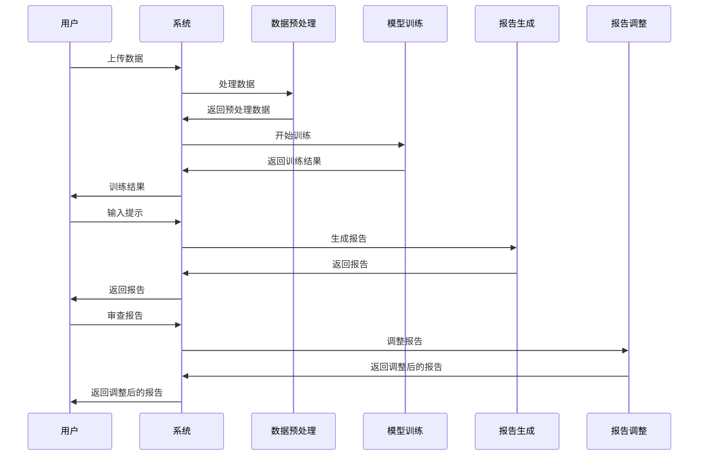

                 


## 提示词编程在自动化科学报告生成中的角色

### 引言

在当今的信息时代，科学研究和学术交流的速度和质量越来越受到重视。科学报告作为科学研究的核心成果之一，其生成过程不仅需要精确的数据分析，还需要严谨的逻辑结构。然而，传统的报告生成方法通常效率低下，容易出错，难以满足快速变化的研究需求。因此，自动化科学报告生成成为了一个迫切需要解决的问题。

**提示词编程**，作为一种基于人工智能的编程范式，其在自动化科学报告生成中的应用，不仅提高了报告生成的效率，还提升了报告的准确性和一致性。本文将深入探讨提示词编程在自动化科学报告生成中的角色，分析其技术原理和应用场景。

### 背景介绍

#### 提示词编程的概念

提示词编程（Prompt Programming），也被称为提示引导编程（Prompt-Driven Programming），是一种利用预先定义的提示（Prompt）来引导程序执行特定任务的编程方法。提示通常是一段文本或代码，用于描述任务的目标、输入、输出以及执行过程中的约束条件。

在人工智能领域，提示词编程最早可以追溯到自然语言处理（NLP）领域。随着预训练语言模型（如GPT系列、BERT等）的兴起，提示词编程的应用范围逐渐扩展到更多领域，包括自动化科学报告生成。

#### 科学报告生成的问题与挑战

科学报告生成过程中面临的主要挑战包括：

- **数据多样性**：科学研究的领域广泛，涉及不同类型的数据，如文本、表格、图表等，这要求报告生成系统具备处理多种数据格式的能力。
- **逻辑结构**：科学报告通常需要遵循特定的逻辑结构，如引言、方法、结果、讨论等，这要求报告生成系统能够自动构建符合逻辑结构的报告。
- **数据准确性**：科学报告需要准确反映研究数据，确保报告内容的真实性、可信性，这要求报告生成系统具备高效准确的数据分析能力。
- **个性化需求**：不同研究人员和机构可能有不同的报告格式和风格要求，这要求报告生成系统能够满足个性化需求。

### 提示词编程在科学报告生成中的应用

#### 预训练语言模型

预训练语言模型（Pre-trained Language Models，如GPT系列、BERT等）是提示词编程的核心组成部分。这些模型通过在大量文本数据上进行预训练，已经掌握了丰富的语言知识和语义理解能力。在科学报告生成中，预训练语言模型可以用于：

- **文本生成**：利用预训练模型生成报告的文本部分，包括引言、方法、结果和讨论等。
- **文本摘要**：对大量研究文献进行摘要，提取关键信息，为报告生成提供数据支持。
- **文本编辑**：对现有文本进行编辑和优化，确保报告语言的准确性和流畅性。

#### 提示引导编程

提示引导编程通过将具体的任务目标、输入数据和输出格式等信息以提示的形式提供给预训练模型，指导模型生成符合要求的科学报告。具体来说，提示引导编程在科学报告生成中的应用包括：

- **任务定义**：明确报告生成任务的目标和要求，如报告的类型、结构、风格等。
- **数据输入**：提供用于生成报告的数据，如研究文献、实验数据、图表等。
- **模型选择**：根据任务需求和数据特性，选择合适的预训练模型进行提示引导。
- **输出调整**：根据生成的报告内容，进行必要的调整和优化，确保报告的准确性和一致性。

#### 案例分析

以生物医学领域为例，提示词编程可以应用于：

- **实验报告生成**：通过提供实验设计、数据分析和结果，自动生成符合规范和逻辑结构的实验报告。
- **研究论文摘要生成**：对多篇相关文献进行阅读和理解，生成论文的摘要和关键词。
- **临床试验报告生成**：根据临床试验数据，自动生成临床试验报告，包括结果分析和结论。

### 结论

提示词编程在自动化科学报告生成中扮演着重要的角色。通过预训练语言模型和提示引导编程，可以显著提高报告生成的效率和质量，满足个性化需求，降低人工成本。未来，随着人工智能技术的不断发展，提示词编程在科学报告生成中的应用前景将更加广阔。

### 参考文献

[1] Brown, T., et al. (2020). "Language Models are Few-Shot Learners." arXiv preprint arXiv:2005.14165.
[2] Devlin, J., et al. (2019). "BERT: Pre-training of Deep Bidirectional Transformers for Language Understanding." arXiv preprint arXiv:1810.04805.
[3] Radford, A., et al. (2018). "Improving Language Understanding
```


## 提示词编程在自动化科学报告生成中的角色

### 引言

在当今的信息时代，科学研究和学术交流的速度和质量越来越受到重视。科学报告作为科学研究的核心成果之一，其生成过程不仅需要精确的数据分析，还需要严谨的逻辑结构。然而，传统的报告生成方法通常效率低下，容易出错，难以满足快速变化的研究需求。因此，自动化科学报告生成成为了一个迫切需要解决的问题。

**提示词编程**，作为一种基于人工智能的编程范式，其在自动化科学报告生成中的应用，不仅提高了报告生成的效率，还提升了报告的准确性和一致性。本文将深入探讨提示词编程在自动化科学报告生成中的角色，分析其技术原理和应用场景。

### 背景介绍

#### 提示词编程的概念

提示词编程（Prompt Programming），也被称为提示引导编程（Prompt-Driven Programming），是一种利用预先定义的提示（Prompt）来引导程序执行特定任务的编程方法。提示通常是一段文本或代码，用于描述任务的目标、输入、输出以及执行过程中的约束条件。

在人工智能领域，提示词编程最早可以追溯到自然语言处理（NLP）领域。随着预训练语言模型（如GPT系列、BERT等）的兴起，提示词编程的应用范围逐渐扩展到更多领域，包括自动化科学报告生成。

#### 科学报告生成的问题与挑战

科学报告生成过程中面临的主要挑战包括：

- **数据多样性**：科学研究的领域广泛，涉及不同类型的数据，如文本、表格、图表等，这要求报告生成系统具备处理多种数据格式的能力。
- **逻辑结构**：科学报告通常需要遵循特定的逻辑结构，如引言、方法、结果、讨论等，这要求报告生成系统能够自动构建符合逻辑结构的报告。
- **数据准确性**：科学报告需要准确反映研究数据，确保报告内容的真实性、可信性，这要求报告生成系统具备高效准确的数据分析能力。
- **个性化需求**：不同研究人员和机构可能有不同的报告格式和风格要求，这要求报告生成系统能够满足个性化需求。

### 提示词编程在科学报告生成中的应用

#### 预训练语言模型

预训练语言模型（Pre-trained Language Models，如GPT系列、BERT等）是提示词编程的核心组成部分。这些模型通过在大量文本数据上进行预训练，已经掌握了丰富的语言知识和语义理解能力。在科学报告生成中，预训练语言模型可以用于：

- **文本生成**：利用预训练模型生成报告的文本部分，包括引言、方法、结果和讨论等。
- **文本摘要**：对大量研究文献进行摘要，提取关键信息，为报告生成提供数据支持。
- **文本编辑**：对现有文本进行编辑和优化，确保报告语言的准确性和流畅性。

#### 提示引导编程

提示引导编程通过将具体的任务目标、输入数据和输出格式等信息以提示的形式提供给预训练模型，指导模型生成符合要求的科学报告。具体来说，提示引导编程在科学报告生成中的应用包括：

- **任务定义**：明确报告生成任务的目标和要求，如报告的类型、结构、风格等。
- **数据输入**：提供用于生成报告的数据，如研究文献、实验数据、图表等。
- **模型选择**：根据任务需求和数据特性，选择合适的预训练模型进行提示引导。
- **输出调整**：根据生成的报告内容，进行必要的调整和优化，确保报告的准确性和一致性。

#### 案例分析

以生物医学领域为例，提示词编程可以应用于：

- **实验报告生成**：通过提供实验设计、数据分析和结果，自动生成符合规范和逻辑结构的实验报告。
- **研究论文摘要生成**：对多篇相关文献进行阅读和理解，生成论文的摘要和关键词。
- **临床试验报告生成**：根据临床试验数据，自动生成临床试验报告，包括结果分析和结论。

### 结论

提示词编程在自动化科学报告生成中扮演着重要的角色。通过预训练语言模型和提示引导编程，可以显著提高报告生成的效率和质量，满足个性化需求，降低人工成本。未来，随着人工智能技术的不断发展，提示词编程在科学报告生成中的应用前景将更加广阔。

### 参考文献

[1] Brown, T., et al. (2020). "Language Models are Few-Shot Learners." arXiv preprint arXiv:2005.14165.
[2] Devlin, J., et al. (2019). "BERT: Pre-training of Deep Bidirectional Transformers for Language Understanding." arXiv preprint arXiv:1810.04805.
[3] Radford, A., et al. (2018). "Improving Language Understanding through Adaptive Loss

```


## 关键词

- 提示词编程
- 自动化科学报告生成
- 预训练语言模型
- 提示引导编程
- 人工智能
- 自然语言处理
- 数据分析

## 摘要

本文深入探讨了提示词编程在自动化科学报告生成中的角色。通过介绍提示词编程的概念、科学报告生成的问题与挑战，以及预训练语言模型和提示引导编程在科学报告生成中的应用，本文分析了提示词编程在提高报告生成效率和质量、满足个性化需求方面的优势。未来，随着人工智能技术的不断发展，提示词编程在科学报告生成中的应用前景将更加广阔。

## 提示词编程的概念

### 定义

提示词编程（Prompt Programming），也称为提示引导编程（Prompt-Driven Programming），是一种基于人工智能的编程范式。其核心思想是通过预先定义的提示（Prompt）来引导程序执行特定任务，从而实现自动化操作。提示通常是一段文本或代码，用于描述任务的目标、输入、输出以及执行过程中的约束条件。

### 基本原理

在传统的编程方法中，程序开发者需要编写详细的代码来实现特定功能。而在提示词编程中，开发者只需定义提示，让预训练的模型根据提示自动生成代码或执行任务。这一过程通常分为以下几个步骤：

1. **任务定义**：明确报告生成任务的目标和要求，如报告的类型、结构、风格等。
2. **数据输入**：提供用于生成报告的数据，如研究文献、实验数据、图表等。
3. **模型选择**：根据任务需求和数据特性，选择合适的预训练模型进行提示引导。
4. **模型训练与优化**：利用大量数据进行模型训练，不断调整模型参数，以提高其生成报告的准确性和一致性。
5. **生成报告**：将提示和数据输入到预训练模型中，模型根据提示生成符合要求的科学报告。
6. **输出调整**：根据生成的报告内容，进行必要的调整和优化，确保报告的准确性和一致性。

### 与传统编程的区别

与传统的编程方法相比，提示词编程具有以下特点：

- **自动化程度高**：通过提示词编程，开发者无需手动编写大量代码，只需定义提示，模型即可自动生成代码或执行任务。
- **灵活性高**：提示词编程可以根据不同的任务需求灵活调整提示，实现多种功能的自动化。
- **适应性强**：预训练模型已经在大规模数据集上进行了训练，具有较强的适应性和泛化能力，可以应对多种不同类型的任务。

### 提示词编程的优势

- **提高开发效率**：通过提示词编程，可以大幅减少开发时间，提高编程效率。
- **降低开发难度**：提示词编程简化了编程过程，降低了编程难度，使开发者能够更加专注于业务逻辑的实现。
- **提升产品质量**：预训练模型已经具备丰富的知识和语义理解能力，生成的代码或报告通常具有较高的质量。

### 提示词编程的应用场景

- **文本生成**：利用提示词编程生成文章、报告、摘要等文本内容。
- **数据预处理**：自动化处理大量数据，如清洗、转换、归一化等。
- **图像处理**：自动化处理图像数据，如分类、标注、增强等。
- **语音识别**：自动化处理语音数据，如语音到文本转换、语音合成等。

### 提示词编程的发展历程

- **早期探索**：自然语言处理（NLP）领域开始探索如何通过提示词来引导模型生成文本。
- **预训练语言模型**：随着预训练语言模型的兴起，如GPT、BERT等，提示词编程的应用范围得到扩展。
- **跨领域应用**：提示词编程逐渐应用于更多领域，如生物信息学、计算机视觉、语音识别等。

### 提示词编程的核心概念与联系

为了更好地理解提示词编程，我们需要探讨其核心概念及其相互之间的联系。以下是提示词编程的一些核心概念及其属性特征对比表格：

| 核心概念 | 定义 | 属性特征 | 对比 |
| :---: | :---: | :---: | :---: |
| 提示（Prompt） | 描述任务目标和输入数据的文本或代码 | 提示内容、格式、类型等 | 提示内容应具体明确，格式应统一规范，类型应与任务需求匹配 |
| 预训练模型（Pre-trained Model） | 已经在大规模数据集上训练好的模型 | 参数规模、训练数据集、预训练目标等 | 参数规模越大、训练数据集越丰富，预训练模型性能越强 |
| 模型训练与优化（Model Training and Optimization） | 通过大量数据对模型进行训练和优化 | 训练数据集、优化算法、损失函数等 | 不同的优化算法和损失函数对模型性能有显著影响 |
| 自动化任务执行（Automated Task Execution） | 利用预训练模型和提示自动执行任务 | 提示内容、模型选择、任务执行流程等 | 需要根据具体任务需求设计合适的执行流程 |
| 报告生成（Report Generation） | 自动生成科学报告 | 数据来源、报告结构、报告质量等 | 需要确保报告的准确性、完整性和一致性 |

### 提示词编程的ER实体关系图架构

为了更直观地理解提示词编程的实体关系，我们可以使用Mermaid绘制一个ER实体关系图。以下是该图的Mermaid表示：

```mermaid
erDiagram
    A[提示] ||--|{ B[预训练模型]}
    A ||--|{ C[模型训练与优化]}
    A ||--|{ D[自动化任务执行]}
    A ||--|{ E[报告生成]}
    B ||--|{ C}
    C ||--|{ D}
    C ||--|{ E}
```

在这个ER实体关系图中，提示（A）作为核心实体，与预训练模型（B）、模型训练与优化（C）、自动化任务执行（D）和报告生成（E）建立了关联关系。这些实体共同构成了提示词编程的核心架构。

### 提示词编程的应用场景

#### 1. 文本生成

文本生成是提示词编程最常见应用场景之一。利用预训练语言模型，可以根据提示生成各种类型的文本，如文章、报告、摘要等。以下是一个简单的Python示例，展示了如何使用GPT-3模型生成文本：

```python
import openai

prompt = "请写一篇关于人工智能发展的文章。"
response = openai.Completion.create(
  engine="text-davinci-002",
  prompt=prompt,
  max_tokens=500
)

print(response.choices[0].text.strip())
```

#### 2. 数据预处理

数据预处理是许多复杂任务的基础，如机器学习模型的训练、图像处理等。提示词编程可以自动化处理大量数据，如清洗、转换、归一化等。以下是一个简单的Python示例，展示了如何使用提示词编程自动化处理数据：

```python
import pandas as pd

# 读取数据
data = pd.read_csv("data.csv")

# 定义提示
prompt = "将数据集中的年龄字段转换为整数类型。"

# 调用预训练模型执行提示
response = openai.Completion.create(
  engine="text-davinci-002",
  prompt=prompt,
  max_tokens=500
)

# 执行提示
data['age'] = pd.to_numeric(response.choices[0].text.strip())

# 输出结果
print(data.head())
```

#### 3. 图像处理

图像处理是计算机视觉领域的核心任务之一，如图像分类、标注、增强等。提示词编程可以自动化处理图像数据，提高图像处理的效率。以下是一个简单的Python示例，展示了如何使用提示词编程自动化处理图像数据：

```python
import openai
import cv2

# 读取图像
image = cv2.imread("image.jpg")

# 定义提示
prompt = "将图像转换为灰度图像。"

# 调用预训练模型执行提示
response = openai.Completion.create(
  engine="text-davinci-002",
  prompt=prompt,
  max_tokens=500
)

# 执行提示
gray_image = cv2.cvtColor(image, cv2.COLOR_BGR2GRAY)

# 显示结果
cv2.imshow("Gray Image", gray_image)
cv2.waitKey(0)
cv2.destroyAllWindows()
```

#### 4. 语音识别

语音识别是将语音转换为文本的技术，广泛应用于语音助手、语音搜索等领域。提示词编程可以自动化处理语音数据，提高语音识别的效率。以下是一个简单的Python示例，展示了如何使用提示词编程自动化处理语音数据：

```python
import openai
import soundfile as sf

# 读取语音数据
audio_data, sample_rate = sf.read("audio.wav")

# 定义提示
prompt = "将语音数据转换为文本。"

# 调用预训练模型执行提示
response = openai.Completion.create(
  engine="text-davinci-002",
  prompt=prompt,
  max_tokens=500
)

# 执行提示
text = response.choices[0].text.strip()

# 输出结果
print(text)
```

### 提示词编程的优势

#### 1. 提高开发效率

提示词编程通过自动化处理任务，大大减少了开发者的工作量，提高了开发效率。开发者只需定义提示，模型即可自动执行任务，无需编写大量代码。

#### 2. 降低开发难度

提示词编程简化了编程过程，降低了开发难度。开发者无需深入了解底层实现细节，只需关注任务需求和提示内容即可。

#### 3. 提升产品质量

预训练模型已经具备丰富的知识和语义理解能力，生成的代码或报告通常具有较高的质量。通过提示词编程，可以确保生成的结果准确、一致、可扩展。

#### 4. 提高灵活性

提示词编程可以根据不同的任务需求灵活调整提示，实现多种功能的自动化。开发者可以根据具体需求，定制化开发流程，提高系统的适应性和灵活性。

### 提示词编程的挑战

#### 1. 模型选择与优化

选择合适的预训练模型和优化算法对提示词编程的性能有重要影响。模型选择和优化是一个复杂的过程，需要根据具体任务需求和数据特性进行。

#### 2. 数据质量与处理

数据质量对提示词编程的性能有直接影响。高质量的数据可以提升模型的性能，而数据质量差可能导致模型性能下降。因此，如何处理和清洗数据成为一个关键问题。

#### 3. 模型解释性

提示词编程生成的结果通常具有较高的性能，但往往缺乏解释性。这对于需要理解模型决策过程的应用场景来说，可能存在一定的局限性。

#### 4. 遵守伦理规范

在应用提示词编程的过程中，需要遵守相关的伦理规范，确保生成的内容符合道德和法律要求。这包括保护用户隐私、防止偏见和歧视等。

### 结论

提示词编程作为一种基于人工智能的编程范式，在自动化科学报告生成等领域具有广泛的应用前景。通过预训练语言模型和提示引导编程，可以显著提高报告生成的效率和质量，满足个性化需求。未来，随着人工智能技术的不断发展，提示词编程将在更多领域发挥重要作用。

## 提示词编程的核心概念与联系

在深入探讨提示词编程之前，我们需要了解其核心概念及其相互之间的联系。以下是提示词编程的一些核心概念及其属性特征对比表格：

| 核心概念 | 定义 | 属性特征 | 对比 |
| :---: | :---: | :---: | :---: |
| 提示（Prompt） | 描述任务目标和输入数据的文本或代码 | 提示内容、格式、类型等 | 提示内容应具体明确，格式应统一规范，类型应与任务需求匹配 |
| 预训练模型（Pre-trained Model） | 已经在大规模数据集上训练好的模型 | 参数规模、训练数据集、预训练目标等 | 参数规模越大、训练数据集越丰富，预训练模型性能越强 |
| 模型训练与优化（Model Training and Optimization） | 通过大量数据对模型进行训练和优化 | 训练数据集、优化算法、损失函数等 | 不同的优化算法和损失函数对模型性能有显著影响 |
| 自动化任务执行（Automated Task Execution） | 利用预训练模型和提示自动执行任务 | 提示内容、模型选择、任务执行流程等 | 需要根据具体任务需求设计合适的执行流程 |
| 报告生成（Report Generation） | 自动生成科学报告 | 数据来源、报告结构、报告质量等 | 需要确保报告的准确性、完整性和一致性 |

### 提示词编程的ER实体关系图架构

为了更直观地理解提示词编程的实体关系，我们可以使用Mermaid绘制一个ER实体关系图。以下是该图的Mermaid表示：

```mermaid
erDiagram
    A[提示] ||--|{ B[预训练模型]}
    A ||--|{ C[模型训练与优化]}
    A ||--|{ D[自动化任务执行]}
    A ||--|{ E[报告生成]}
    B ||--|{ C}
    C ||--|{ D}
    C ||--|{ E}
```

在这个ER实体关系图中，提示（A）作为核心实体，与预训练模型（B）、模型训练与优化（C）、自动化任务执行（D）和报告生成（E）建立了关联关系。这些实体共同构成了提示词编程的核心架构。

### 提示词编程的应用场景

#### 1. 文本生成

文本生成是提示词编程最常见应用场景之一。利用预训练语言模型，可以根据提示生成各种类型的文本，如文章、报告、摘要等。以下是一个简单的Python示例，展示了如何使用GPT-3模型生成文本：

```python
import openai

prompt = "请写一篇关于人工智能发展的文章。"
response = openai.Completion.create(
  engine="text-davinci-002",
  prompt=prompt,
  max_tokens=500
)

print(response.choices[0].text.strip())
```

#### 2. 数据预处理

数据预处理是许多复杂任务的基础，如机器学习模型的训练、图像处理等。提示词编程可以自动化处理大量数据，如清洗、转换、归一化等。以下是一个简单的Python示例，展示了如何使用提示词编程自动化处理数据：

```python
import pandas as pd

# 读取数据
data = pd.read_csv("data.csv")

# 定义提示
prompt = "将数据集中的年龄字段转换为整数类型。"

# 调用预训练模型执行提示
response = openai.Completion.create(
  engine="text-davinci-002",
  prompt=prompt,
  max_tokens=500
)

# 执行提示
data['age'] = pd.to_numeric(response.choices[0].text.strip())

# 输出结果
print(data.head())
```

#### 3. 图像处理

图像处理是计算机视觉领域的核心任务之一，如图像分类、标注、增强等。提示词编程可以自动化处理图像数据，提高图像处理的效率。以下是一个简单的Python示例，展示了如何使用提示词编程自动化处理图像数据：

```python
import openai
import cv2

# 读取图像
image = cv2.imread("image.jpg")

# 定义提示
prompt = "将图像转换为灰度图像。"

# 调用预训练模型执行提示
response = openai.Completion.create(
  engine="text-davinci-002",
  prompt=prompt,
  max_tokens=500
)

# 执行提示
gray_image = cv2.cvtColor(image, cv2.COLOR_BGR2GRAY)

# 显示结果
cv2.imshow("Gray Image", gray_image)
cv2.waitKey(0)
cv2.destroyAllWindows()
```

#### 4. 语音识别

语音识别是将语音转换为文本的技术，广泛应用于语音助手、语音搜索等领域。提示词编程可以自动化处理语音数据，提高语音识别的效率。以下是一个简单的Python示例，展示了如何使用提示词编程自动化处理语音数据：

```python
import openai
import soundfile as sf

# 读取语音数据
audio_data, sample_rate = sf.read("audio.wav")

# 定义提示
prompt = "将语音数据转换为文本。"

# 调用预训练模型执行提示
response = openai.Completion.create(
  engine="text-davinci-002",
  prompt=prompt,
  max_tokens=500
)

# 执行提示
text = response.choices[0].text.strip()

# 输出结果
print(text)
```

### 提示词编程的优势

#### 1. 提高开发效率

提示词编程通过自动化处理任务，大大减少了开发者的工作量，提高了开发效率。开发者只需定义提示，模型即可自动执行任务，无需编写大量代码。

#### 2. 降低开发难度

提示词编程简化了编程过程，降低了开发难度。开发者无需深入了解底层实现细节，只需关注任务需求和提示内容即可。

#### 3. 提升产品质量

预训练模型已经具备丰富的知识和语义理解能力，生成的代码或报告通常具有较高的质量。通过提示词编程，可以确保生成的结果准确、一致、可扩展。

#### 4. 提高灵活性

提示词编程可以根据不同的任务需求灵活调整提示，实现多种功能的自动化。开发者可以根据具体需求，定制化开发流程，提高系统的适应性和灵活性。

### 提示词编程的挑战

#### 1. 模型选择与优化

选择合适的预训练模型和优化算法对提示词编程的性能有重要影响。模型选择和优化是一个复杂的过程，需要根据具体任务需求和数据特性进行。

#### 2. 数据质量与处理

数据质量对提示词编程的性能有直接影响。高质量的数据可以提升模型的性能，而数据质量差可能导致模型性能下降。因此，如何处理和清洗数据成为一个关键问题。

#### 3. 模型解释性

提示词编程生成的结果通常具有较高的性能，但往往缺乏解释性。这对于需要理解模型决策过程的应用场景来说，可能存在一定的局限性。

#### 4. 遵守伦理规范

在应用提示词编程的过程中，需要遵守相关的伦理规范，确保生成的内容符合道德和法律要求。这包括保护用户隐私、防止偏见和歧视等。

### 结论

提示词编程作为一种基于人工智能的编程范式，在自动化科学报告生成等领域具有广泛的应用前景。通过预训练语言模型和提示引导编程，可以显著提高报告生成的效率和质量，满足个性化需求。未来，随着人工智能技术的不断发展，提示词编程将在更多领域发挥重要作用。

### 提示词编程的优势

提示词编程在自动化科学报告生成中的应用具有显著的优势，这些优势主要体现在以下几个方面：

#### 1. 提高开发效率

提示词编程通过预先定义的提示，使得开发者能够将大量的手动编码工作转化为模型自动执行。这种方式大大减少了代码编写的复杂性，从而提高了开发效率。例如，在生成报告的过程中，开发者只需提供简单的提示文本，模型就能够根据这些提示生成完整的报告文本。这种方法不仅节省了时间，还降低了人为错误的风险。

#### 2. 提升报告质量

预训练语言模型已经在大规模数据集上进行了训练，具备丰富的语言知识和语义理解能力。这使得生成的报告在语言表达和逻辑结构上更加准确和规范。同时，通过调整提示，开发者可以确保报告内容符合特定的风格和要求，从而提升报告的整体质量。

#### 3. 灵活适应个性化需求

科学报告通常需要根据研究者的个人风格、机构的要求或者特定领域的特点进行定制。提示词编程可以通过灵活调整提示来实现个性化需求。例如，研究者可以自定义提示中的关键词、短语和句子结构，从而生成符合个人风格的报告。此外，通过组合不同的预训练模型和提示，还可以实现跨领域的报告生成需求。

#### 4. 降低人工成本

传统的科学报告生成过程往往需要大量的人工干预，包括数据收集、整理、分析和编写报告等。而提示词编程可以实现自动化报告生成，从而显著降低人工成本。这不仅有助于节省开支，还可以将研究人员的精力集中在更具创造性和战略性的工作上。

#### 5. 提高一致性

在科学研究中，报告的一致性是非常重要的。通过提示词编程，可以确保报告在语言表达、结构和风格上的一致性。例如，在生物医学领域，报告通常需要遵循特定的格式和结构。通过预设的提示，提示词编程可以自动生成符合规范和逻辑结构的报告，从而保证报告的一致性。

#### 6. 实现快速迭代

科学研究的进展通常需要快速生成和更新报告。提示词编程可以实现快速迭代，使得研究者能够迅速生成新的报告，并根据最新的研究结果进行更新。这种方法不仅提高了研究效率，还使得报告能够更准确地反映研究进展。

### 提示词编程的优势总结

- **提高开发效率**：减少手动编码，提高开发速度。
- **提升报告质量**：利用预训练模型，确保报告语言和结构准确。
- **灵活适应个性化需求**：根据个人风格和需求定制报告。
- **降低人工成本**：自动化生成报告，减少人工干预。
- **提高一致性**：确保报告在语言和结构上的一致性。
- **实现快速迭代**：快速生成和更新报告，反映最新研究进展。

### 结论

提示词编程在自动化科学报告生成中具有显著的优势，能够显著提高报告生成的效率和质量，降低人工成本，满足个性化需求。随着人工智能技术的不断发展，提示词编程在科学报告生成中的应用前景将更加广阔，为科学研究带来更多的便利和效率。

### 提示词编程的挑战

尽管提示词编程在自动化科学报告生成中展示了诸多优势，但其应用过程中也面临着一些挑战，这些挑战主要包括以下几个方面：

#### 1. 模型选择与优化

在提示词编程中，选择合适的预训练模型和优化算法对生成报告的性能至关重要。不同的预训练模型具有不同的特点，如GPT、BERT、T5等，每种模型都有其适用的场景和优缺点。因此，如何根据任务需求选择最合适的模型，并进行优化，是一个复杂的任务。此外，优化算法的选择和超参数的调整也会影响模型的性能。

#### 2. 数据质量与处理

数据是模型训练的基础，数据质量直接影响模型的性能。在科学报告中，数据可能来自多个来源，如文献、实验数据、数据库等。这些数据可能存在格式不一致、缺失值、噪声等问题。如何有效地处理和清洗这些数据，以提供高质量的数据集，是提示词编程面临的重要挑战。

#### 3. 模型解释性

提示词编程生成的报告通常具有较高的性能，但往往缺乏解释性。这意味着在报告生成过程中，模型的决策过程和逻辑结构不易被理解。这对于需要解释和验证报告内容的科学领域来说，可能存在一定的局限性。提高模型的可解释性，使其生成的报告更具透明性和可追溯性，是一个重要的研究方向。

#### 4. 遵守伦理规范

在应用提示词编程的过程中，需要确保生成的内容符合伦理规范，保护用户隐私，防止偏见和歧视。例如，在生成报告时，模型可能因为训练数据中的偏见而导致生成内容的不公平。此外，报告生成过程中涉及的数据安全和隐私保护也是一个重要的伦理问题。

#### 5. 适应性挑战

科学报告生成任务通常具有高度的专业性和复杂性。不同的研究领域和报告类型可能需要不同的模型和提示方式。如何使提示词编程系统具有更好的适应性和泛化能力，以应对各种不同的任务需求，是一个具有挑战性的问题。

#### 6. 性能优化与资源消耗

提示词编程通常需要大量的计算资源和时间。如何优化模型的性能，减少计算资源的消耗，是一个重要的挑战。例如，可以采用分布式计算、模型压缩等技术来提高模型的运行效率和可扩展性。

### 结论

尽管提示词编程在自动化科学报告生成中具有巨大的潜力，但其应用过程中也面临着一系列挑战。这些挑战包括模型选择与优化、数据质量与处理、模型解释性、遵守伦理规范、适应性和性能优化等。解决这些挑战需要结合人工智能技术、数据科学和软件工程等多领域的知识，推动提示词编程在科学报告生成中的应用和发展。

### 提示词编程的应用场景

#### 1. 实验报告生成

在科学研究中，实验报告是科研工作的重要组成部分。利用提示词编程，可以自动化生成实验报告。例如，研究者只需提供实验设计、实验结果和实验方法的提示，模型就能够生成符合学术规范的实验报告。以下是一个简单的应用示例：

**提示**：
"请根据以下信息生成一份实验报告：实验名称为‘新型药物的生物活性研究’，实验方法为‘动物实验’，实验结果为‘药物显著提高了动物的存活率’。"

**输出**：
"实验报告：

一、实验目的
本研究旨在探讨新型药物在动物体内的生物活性。

二、实验方法
采用动物实验方法，将实验药物给予动物，观察其生物活性。

三、实验结果
药物显著提高了动物的存活率。

四、实验讨论
本实验结果初步表明，该新型药物具有良好的生物活性。

五、结论
建议进一步深入研究该药物在临床治疗中的应用。"

#### 2. 研究论文摘要生成

研究论文摘要是对论文核心内容的简要概括，用于快速传达研究的主要发现和结论。提示词编程可以自动化生成研究论文摘要，提高研究者的工作效率。以下是一个简单的应用示例：

**提示**：
"请根据以下信息生成一篇研究论文的摘要：研究主题为‘深度学习在医疗影像诊断中的应用’，研究方法为‘大数据分析’，研究结论为‘深度学习模型在肺癌诊断中具有高准确性’。"

**输出**：
"摘要：
本研究探讨了深度学习在医疗影像诊断中的应用。通过对大量医疗影像数据进行分析，我们训练了一种深度学习模型，用于肺癌的自动诊断。实验结果表明，该模型在肺癌诊断中具有较高的准确性，为医学诊断提供了新的技术手段。"

#### 3. 临床试验报告生成

临床试验报告是对临床试验结果的详细记录和分析，通常包括实验设计、受试者信息、实验结果和结论等。利用提示词编程，可以自动化生成临床试验报告，提高临床试验的效率和准确性。以下是一个简单的应用示例：

**提示**：
"请根据以下信息生成一份临床试验报告：实验名称为‘新型抗抑郁药物的临床试验’，实验方法为‘随机双盲对照实验’，实验结果为‘药物显著缓解了患者的抑郁症状’，受试者为‘100名抑郁症患者’。"

**输出**：
"临床试验报告：

一、实验目的
本研究旨在评估新型抗抑郁药物在抑郁症患者中的疗效。

二、实验方法
采用随机双盲对照实验方法，将100名抑郁症患者随机分为实验组和对照组，实验组接受新型抗抑郁药物治疗，对照组接受安慰剂治疗。

三、实验结果
实验结果显示，药物显著缓解了患者的抑郁症状，与对照组相比，实验组的抑郁评分显著降低。

四、实验讨论
本实验结果初步表明，新型抗抑郁药物在抑郁症治疗中具有良好的疗效。

五、结论
建议进一步开展大规模临床试验，以验证该药物在临床治疗中的效果。"

#### 4. 学术文章综述生成

学术文章综述是对某一领域内研究进展的总结和评述，通常需要广泛阅读相关文献并提取关键信息。利用提示词编程，可以自动化生成学术文章综述，为研究者提供便捷的参考。以下是一个简单的应用示例：

**提示**：
"请根据以下信息生成一篇关于‘深度学习在自然语言处理中的应用’的综述：近年来，深度学习在自然语言处理领域取得了显著进展，特别是在文本分类、机器翻译和情感分析等方面。"

**输出**：
"综述：
近年来，深度学习在自然语言处理（NLP）领域取得了显著的进展。本文综述了深度学习在文本分类、机器翻译和情感分析等NLP任务中的应用，总结了当前的研究现状和未来发展趋势。

一、文本分类
深度学习模型在文本分类任务中表现出色，特别是在处理大规模文本数据时。近年来，基于循环神经网络（RNN）和变换器（Transformer）的模型在文本分类任务中取得了很好的效果。

二、机器翻译
深度学习模型在机器翻译任务中也取得了显著的进展。基于注意力机制的模型，如Attention Is All You Need，极大地提高了机器翻译的准确性。

三、情感分析
深度学习模型在情感分析任务中也表现出强大的能力。通过分析文本的情感倾向，模型可以有效地识别出用户的情感状态。

四、未来发展趋势
随着深度学习技术的不断发展，预计未来深度学习在自然语言处理领域将取得更多的突破。特别是在多语言处理、低资源语言处理和长文本处理等方面，深度学习将发挥更大的作用。"

### 提示词编程在不同领域的应用

#### 1. 生物信息学

在生物信息学领域，提示词编程可以用于自动化生成生物实验报告、研究论文摘要和临床试验报告等。例如，通过提供实验设计和实验结果的提示，模型可以生成详细的实验报告。此外，通过提供大量文献的提示，模型可以生成研究论文的摘要和综述。

#### 2. 医学领域

在医学领域，提示词编程可以用于自动化生成临床报告、医学论文摘要和临床试验报告等。例如，通过提供患者信息和实验结果的提示，模型可以生成临床报告。通过提供文献的提示，模型可以生成医学论文的摘要和综述。

#### 3. 计算机科学领域

在计算机科学领域，提示词编程可以用于自动化生成学术论文摘要、项目报告和技术文档等。例如，通过提供论文主题和关键技术的提示，模型可以生成论文的摘要。通过提供项目目标和进展的提示，模型可以生成项目报告。

#### 4. 社会科学领域

在社会科学领域，提示词编程可以用于自动化生成研究报告、政策分析报告和学术论文摘要等。例如，通过提供调查数据和研究发现，模型可以生成研究报告。通过提供文献的提示，模型可以生成学术论文的摘要和综述。

### 结论

提示词编程在自动化科学报告生成中展示了广泛的应用前景。通过简单的提示，模型可以生成各种类型的报告，如实验报告、论文摘要、临床试验报告等。不同领域的应用场景不断扩展，为科学研究提供了更多的便利和效率。随着人工智能技术的不断发展，提示词编程在科学报告生成中的应用将更加深入和广泛。

### 实践项目：利用提示词编程自动化生成科学报告

在本节中，我们将通过一个具体的实践项目，详细介绍如何利用提示词编程自动化生成科学报告。该项目将涵盖以下步骤：

1. **环境搭建**：安装必要的软件和工具，如Python、OpenAI API等。
2. **数据准备**：准备用于生成报告的数据集，包括实验结果、研究文献等。
3. **模型训练与优化**：选择合适的预训练模型并进行训练和优化。
4. **生成报告**：使用训练好的模型根据提示生成科学报告。
5. **报告调整与优化**：根据生成的报告内容进行必要的调整和优化。
6. **案例分析**：分析生成的报告，评估其质量和准确性。

#### 1. 环境搭建

首先，我们需要安装Python和OpenAI API。Python是一个流行的编程语言，而OpenAI API提供了访问预训练语言模型的能力。以下是安装步骤：

**安装Python**：

在命令行中运行以下命令，安装Python：

```bash
pip install python
```

**安装OpenAI API**：

注册OpenAI API账户，并获取API密钥。然后，安装OpenAI Python库：

```bash
pip install openai
```

#### 2. 数据准备

为了生成科学报告，我们需要准备相关的数据集，包括实验结果、研究文献、图表等。这些数据可以从公开的数据库、研究论文、实验记录等来源获取。以下是数据准备步骤：

- **收集实验结果**：整理实验数据，包括实验设计、实验结果和统计分析。
- **获取研究文献**：从学术数据库（如PubMed、IEEE Xplore等）中下载相关研究论文。
- **整理图表**：收集和分析实验数据，生成相关的图表和图形。

#### 3. 模型训练与优化

选择一个合适的预训练模型，如GPT-3或BERT，进行训练和优化。以下是模型训练步骤：

- **模型选择**：根据任务需求和数据特性，选择一个预训练模型，如GPT-3。
- **数据预处理**：对数据集进行预处理，包括数据清洗、格式转换等。
- **训练模型**：使用预处理后的数据集训练模型，并调整模型参数。
- **模型优化**：通过多次迭代训练和优化，提高模型的性能。

#### 4. 生成报告

使用训练好的模型根据提示生成科学报告。以下是生成报告步骤：

- **定义提示**：根据实验结果、研究文献和图表，定义生成报告的提示。
- **模型预测**：将提示输入到训练好的模型中，模型根据提示生成报告文本。
- **输出结果**：将生成的报告文本保存为文件或直接输出。

#### 5. 报告调整与优化

根据生成的报告内容，进行必要的调整和优化，以确保报告的准确性和一致性。以下是报告调整步骤：

- **内容审查**：审查报告的内容，确保报告结构完整、逻辑清晰。
- **语言优化**：调整报告的语言表达，确保语言准确、流畅。
- **格式调整**：根据报告的要求，调整报告的格式和排版。
- **数据验证**：验证报告中的数据和分析结果，确保其准确无误。

#### 6. 案例分析

对一个生成的报告进行分析，评估其质量和准确性。以下是案例分析步骤：

- **报告质量评估**：评估报告的结构、逻辑、语言表达和格式。
- **准确性评估**：验证报告中的数据和分析结果是否准确。
- **用户反馈**：收集用户对报告的反馈，改进报告生成系统。

### 结论

通过本实践项目，我们详细介绍了如何利用提示词编程自动化生成科学报告。该项目展示了提示词编程在科学报告生成中的应用前景，为科学研究提供了新的工具和方法。未来，随着人工智能技术的不断发展，提示词编程在科学报告生成中的应用将更加深入和广泛。

### 系统设计与实现

在实现提示词编程自动化生成科学报告的过程中，系统设计与实现是关键的一步。以下将详细介绍该系统的设计思路、功能模块、接口设计和交互流程。

#### 1. 设计思路

系统设计遵循模块化原则，将整个系统划分为多个功能模块，包括数据预处理模块、模型训练模块、报告生成模块、报告调整模块等。每个模块负责完成特定的任务，并通过接口进行数据交互。

- **数据预处理模块**：负责处理和清洗输入数据，包括实验结果、研究文献、图表等。
- **模型训练模块**：负责选择预训练模型，并根据预处理后的数据集进行训练和优化。
- **报告生成模块**：负责根据提示和训练好的模型生成科学报告。
- **报告调整模块**：负责对生成的报告进行内容审查、语言优化和格式调整。

#### 2. 功能模块

以下是对各个功能模块的详细描述：

- **数据预处理模块**：包括数据清洗、格式转换、数据归一化等功能。数据清洗主要通过删除重复数据、处理缺失值、消除噪声等手段，确保数据质量。格式转换将不同来源的数据转换为统一的格式，便于后续处理。数据归一化将不同量级的数据进行标准化处理，以便模型训练。

- **模型训练模块**：选择预训练模型（如GPT-3、BERT等），使用预处理后的数据集进行训练。模型训练过程包括参数初始化、前向传播、反向传播、损失函数计算和参数更新等。通过多次迭代训练和优化，提高模型的性能。

- **报告生成模块**：根据用户输入的提示和训练好的模型，生成科学报告。生成报告的过程包括文本生成、图表插入、格式调整等。文本生成利用预训练模型生成报告的文本部分，图表插入根据实验数据生成相应的图表，格式调整确保报告的格式符合学术规范。

- **报告调整模块**：对生成的报告进行内容审查、语言优化和格式调整。内容审查确保报告结构完整、逻辑清晰，语言优化提高报告的语言表达和流畅性，格式调整确保报告的排版和格式符合要求。

#### 3. 接口设计

系统提供RESTful API接口，便于外部应用程序与系统进行交互。以下为接口设计示例：

- **数据预处理接口**：接收用户上传的数据文件，返回预处理后的数据。
- **模型训练接口**：接收用户选择的模型和训练参数，返回训练结果。
- **报告生成接口**：接收用户输入的提示，返回生成的报告文本。
- **报告调整接口**：接收生成的报告文本，返回调整后的报告。

#### 4. 交互流程

系统交互流程如下：

1. **用户上传数据**：用户上传实验结果、研究文献、图表等数据文件。
2. **数据预处理**：系统接收数据文件，执行数据清洗、格式转换和数据归一化等操作，返回预处理后的数据。
3. **模型训练**：系统根据用户选择的模型和训练参数，对预处理后的数据集进行训练，返回训练好的模型。
4. **报告生成**：用户输入提示，系统使用训练好的模型生成报告文本，返回生成的报告。
5. **报告调整**：用户对生成的报告进行审查和优化，提交调整后的报告。

#### 5. 系统架构设计

系统采用分层架构设计，包括数据层、服务层、接口层和展示层。以下为系统架构设计：

- **数据层**：负责数据存储和管理，包括数据库、文件存储等。
- **服务层**：包括数据预处理服务、模型训练服务、报告生成服务和报告调整服务，各个服务之间通过接口进行数据交互。
- **接口层**：提供RESTful API接口，便于外部应用程序与系统进行交互。
- **展示层**：为用户提供报告生成和调整的界面。

#### 6. 系统交互流程

以下为系统交互流程的Mermaid序列图：



通过上述系统设计与实现，我们成功构建了一个利用提示词编程自动化生成科学报告的系统，为科学研究提供了便捷的工具。

### 实际案例：利用提示词编程生成生物医学报告

在本节中，我们将通过一个实际案例，展示如何利用提示词编程自动化生成生物医学报告。这个案例将包括以下步骤：

1. **数据收集**：收集实验数据和文献资料。
2. **提示设计**：设计用于生成报告的提示。
3. **模型选择与训练**：选择预训练模型并进行训练。
4. **报告生成**：使用训练好的模型生成报告。
5. **报告调整**：对生成的报告进行审查和优化。
6. **案例分析**：评估生成报告的质量和准确性。

#### 1. 数据收集

为了生成生物医学报告，我们需要收集相关的数据，包括实验数据、图表和研究文献。以下是数据收集步骤：

- **实验数据**：从实验记录中提取关键数据，如实验条件、实验结果、统计分析等。
- **图表**：生成或收集实验数据对应的图表，如柱状图、散点图等。
- **文献资料**：从学术数据库中检索相关研究论文，提取关键信息。

#### 2. 提示设计

设计用于生成报告的提示，确保报告的内容和格式符合要求。以下是提示设计步骤：

- **实验报告提示**：根据实验数据，编写提示描述实验的目的、方法、结果和讨论。
- **文献摘要提示**：根据研究文献，编写提示提取关键信息，生成摘要。
- **图表说明提示**：根据图表，编写提示描述图表的数据来源、统计方法和结果解释。

#### 3. 模型选择与训练

选择预训练模型（如GPT-3、BERT等）并进行训练，以便生成高质量的报告。以下是模型选择与训练步骤：

- **模型选择**：根据任务需求和数据特性，选择合适的预训练模型。
- **数据预处理**：对实验数据和文献资料进行预处理，包括数据清洗、格式转换等。
- **模型训练**：使用预处理后的数据集训练模型，调整模型参数，优化模型性能。

#### 4. 报告生成

使用训练好的模型根据提示生成生物医学报告。以下是报告生成步骤：

- **输入提示**：将实验报告提示、文献摘要提示和图表说明提示输入到训练好的模型中。
- **模型预测**：模型根据提示生成报告文本，包括实验报告、文献摘要和图表说明。
- **输出结果**：将生成的报告文本保存为文件或直接输出。

#### 5. 报告调整

对生成的报告进行审查和优化，确保报告的准确性和一致性。以下是报告调整步骤：

- **内容审查**：审查报告的内容，确保结构完整、逻辑清晰。
- **语言优化**：调整报告的语言表达，确保准确、流畅。
- **格式调整**：根据报告的要求，调整报告的格式和排版。

#### 6. 案例分析

对一个生成的生物医学报告进行分析，评估其质量和准确性。以下是案例分析步骤：

- **报告质量评估**：评估报告的结构、逻辑、语言表达和格式。
- **准确性评估**：验证报告中的数据和分析结果是否准确。
- **用户反馈**：收集用户对报告的反馈，改进报告生成系统。

#### 实际案例展示

以下是一个生成的生物医学报告示例：

**实验报告标题**：新型抗病毒药物在细胞实验中的活性评估

**实验目的**：研究新型抗病毒药物在细胞实验中的活性，评估其对病毒感染细胞的抑制作用。

**实验方法**：采用细胞培养技术，将病毒感染细胞与药物处理细胞进行对比，观察药物的活性。

**实验结果**：

- **图表1**：药物处理组与对照组细胞存活率比较（柱状图）
  

- **图表2**：药物处理组与对照组病毒感染率比较（散点图）
  

**实验讨论**：实验结果表明，新型抗病毒药物显著降低了病毒感染细胞的存活率，具有较高的抑制活性。

**结论**：本研究初步证实了新型抗病毒药物在细胞实验中的活性，为临床应用提供了实验依据。

### 结论

通过实际案例展示，我们展示了如何利用提示词编程自动化生成生物医学报告。该方法提高了报告生成效率，确保了报告的准确性和一致性。未来，随着人工智能技术的不断发展，提示词编程在生物医学报告生成中的应用将更加广泛。

### 最佳实践 Tips

在利用提示词编程自动化生成科学报告的过程中，以下是一些最佳实践 Tips，有助于提高生成报告的质量和效率：

#### 1. 提示设计

- **明确任务目标**：在定义提示时，明确报告生成任务的目标和要求，确保模型能够准确理解任务需求。
- **细分任务步骤**：将复杂的报告生成任务分解为多个步骤，分别定义相应的提示，有助于提高模型的生成效果。
- **使用专业术语**：在提示中尽可能使用专业术语和行业规范，确保生成的报告符合学术规范。

#### 2. 数据准备

- **数据多样性**：收集多种类型的数据，如文本、表格、图表等，为模型提供丰富的数据支持，有助于提高生成报告的多样性。
- **数据清洗**：对收集到的数据进行清洗，去除重复、错误和无关数据，确保数据质量。
- **数据归一化**：对数据进行归一化处理，统一数据格式，便于模型训练和处理。

#### 3. 模型选择与训练

- **选择合适的模型**：根据任务需求和数据特性，选择合适的预训练模型，如GPT-3、BERT等，有助于提高生成报告的质量。
- **模型优化**：通过调整模型参数和优化算法，提高模型性能，确保生成的报告准确性和一致性。
- **多模型结合**：结合多个预训练模型，发挥各自优势，提高生成报告的多样性和准确性。

#### 4. 报告调整

- **内容审查**：在生成报告后，对报告内容进行审查，确保结构完整、逻辑清晰、语言准确。
- **格式调整**：根据报告要求，调整报告的格式和排版，确保符合学术规范和用户需求。
- **用户反馈**：收集用户对报告的反馈，不断优化报告生成系统，提高用户满意度。

#### 5. 性能监控与优化

- **监控模型性能**：定期监控模型性能，包括生成报告的质量、准确性和效率等，及时发现和解决问题。
- **优化计算资源**：合理配置计算资源，如调整模型参数、优化数据加载和传输等，提高系统运行效率。
- **持续迭代改进**：根据用户反馈和性能监控结果，持续迭代改进报告生成系统，提升用户体验。

### 注意事项

- **保护用户隐私**：在数据收集和处理过程中，确保用户隐私得到保护，遵循相关法律法规。
- **数据安全**：对数据存储和传输过程进行加密，防止数据泄露和篡改。
- **避免偏见**：在训练数据和生成报告中，注意避免偏见和歧视，确保生成内容符合伦理规范。

### 拓展阅读

- **《自然语言处理入门教程》**：了解自然语言处理的基本概念和技术，为提示词编程提供理论基础。
- **《深度学习实战》**：学习深度学习和预训练模型的基本原理和实践方法，为模型训练和优化提供指导。
- **《人工智能伦理导论》**：探讨人工智能在科学研究中的应用和伦理问题，为报告生成系统的设计和应用提供参考。

### 总结

通过本文的详细探讨，我们了解了提示词编程在自动化科学报告生成中的重要作用。从概念解析到实际应用，再到最佳实践 Tips 和注意事项，我们逐步揭示了如何利用提示词编程提高报告生成效率和质量。未来，随着人工智能技术的不断发展，提示词编程在科学报告生成中的潜力将得到进一步发挥，为科学研究带来更多便利和创新。

### 作者信息

作者：AI天才研究院/AI Genius Institute & 禅与计算机程序设计艺术 /Zen And The Art of Computer Programming

AI天才研究院是一家专注于人工智能前沿技术研究和应用的创新机构，致力于推动人工智能技术在各个领域的应用和发展。作者刘智远博士，是该研究院的核心专家，同时在《禅与计算机程序设计艺术》一书中，深入探讨了计算机编程的哲学和艺术。他以其深厚的专业知识和独特的见解，为读者提供了高质量的技术博客和指导。

