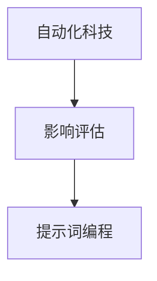
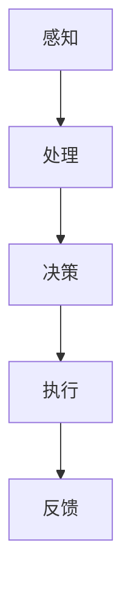
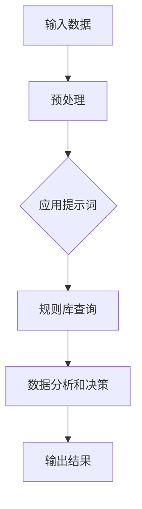
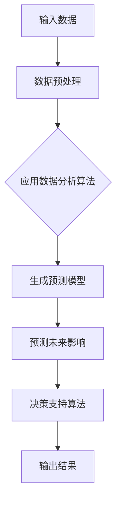
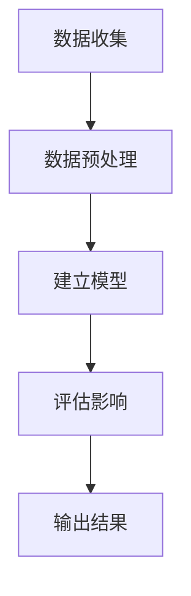
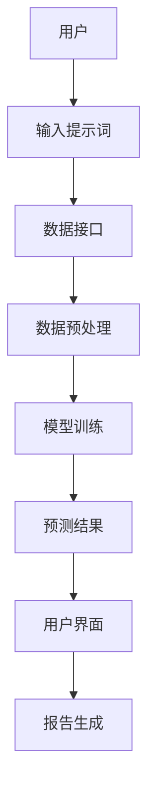

                 


### 文章标题：提示词编程在自动化科技影响评估中的应用

#### 关键词：
- 自动化科技
- 影响评估
- 提示词编程
- 算法原理
- 项目实战

#### 摘要：
本文深入探讨了提示词编程在自动化科技影响评估中的应用。首先，我们介绍了自动化科技的基本概念和影响评估的重要性，然后详细讲解了提示词编程的核心原理和技术细节。接着，通过实际案例展示了如何利用提示词编程进行自动化科技影响评估，并提供了详细的算法原理讲解和数学模型分析。最后，本文通过一个实际项目实战，展示了如何将提示词编程应用于自动化科技影响评估的实际操作中，并给出了最佳实践建议和小结。

---

## 第一部分：背景介绍

### 第1章：问题背景

#### 1.1 问题背景

在现代社会，自动化科技的应用日益广泛，从制造业、物流运输到医疗保健、金融服务等领域，自动化技术极大地提高了生产效率和产品质量。然而，随着自动化科技的迅猛发展，其对经济、社会、环境等方面的影响也逐渐显现出来。如何评估和预测这些影响，以指导科技政策的制定和自动化项目的实施，成为一个亟待解决的问题。

#### 1.2 核心概念与联系

为了更好地理解本文的主题，我们需要明确以下几个核心概念：

- **自动化技术**：指利用计算机程序、机器人、传感器等手段实现生产过程的自动化。
- **影响评估**：指对科技应用可能带来的经济、社会、环境等方面的影响进行评估。
- **提示词编程**：指利用预定义的提示词（prompts）来引导算法进行数据分析和决策。

在理解了这些概念后，我们可以通过以下表格来对比它们的基本属性和特征：

| 核心概念     | 属性特征                                                         | 对比描述                                                     |
| ------------ | ------------------------------------------------------------ | ------------------------------------------------------------ |
| 自动化技术   | 提高生产效率、降低人力成本、增加产品一致性                     | 自动化技术是物理层面的操作，而不涉及编程和数据分析           |
| 影响评估     | 识别潜在风险、预测未来趋势、提供决策支持                       | 影响评估是一种分析和推理过程，通常需要大量的数据和模型支持   |
| 提示词编程   | 利用预定义的提示词来引导算法进行任务执行                       | 提示词编程是一种基于规则的方法，可以简化复杂问题的解决过程   |

#### 1.3 ER实体关系图架构

为了进一步理解自动化科技、影响评估和提示词编程之间的联系，我们可以使用Mermaid绘制一个ER（实体关系）图，如下所示：



在这个ER图中，自动化科技是影响评估的基础，而影响评估的结果可以通过提示词编程来进一步分析和应用。

---

## 第二部分：核心概念与原理

### 第2章：自动化技术原理

#### 2.1 自动化技术概述

自动化技术是指利用计算机程序、机器人、传感器等设备，对生产、管理、服务等过程进行自动化控制的技术。其核心思想是通过减少人力操作，提高生产效率，降低成本，提高产品质量。

#### 2.2 自动化技术的工作原理

自动化技术的基本工作原理通常包括以下几个步骤：

1. **感知**：通过传感器收集外部环境的信息。
2. **处理**：计算机系统对收集到的信息进行加工和处理。
3. **决策**：根据处理结果，计算机系统做出决策。
4. **执行**：通过执行机构（如电机、机械臂等）对决策结果进行实施。

以下是一个简化的自动化技术工作流程的Mermaid流程图：



---

### 第3章：影响评估概念

#### 3.1 影响评估概述

影响评估是一种评估科技应用可能带来经济、社会、环境等方面影响的方法。其目的是为决策者提供科学依据，以指导科技政策的制定和自动化项目的实施。

#### 3.2 影响评估的方法

影响评估通常包括以下几种方法：

1. **成本效益分析**：比较自动化项目的成本和效益。
2. **风险评估**：识别自动化项目可能带来的风险。
3. **利益相关者分析**：分析自动化项目对各个利益相关者的影响。
4. **情景分析**：模拟不同情况下的自动化项目影响。

---

### 第4章：提示词编程原理

#### 4.1 提示词编程概述

提示词编程是一种基于规则的方法，通过预定义的提示词来引导算法进行数据分析和决策。这种方法特别适用于处理复杂的问题，因为它可以简化问题的解决过程。

#### 4.2 提示词编程的技术细节

提示词编程的技术细节包括：

1. **提示词定义**：根据具体问题定义相应的提示词。
2. **规则库构建**：构建包含提示词和相应规则的知识库。
3. **算法执行**：根据提示词和规则库，算法执行数据分析和决策。

以下是一个简化的提示词编程算法流程图：



---

## 第三部分：算法原理与实现

### 第5章：算法原理讲解

#### 5.1 算法概述

在自动化科技影响评估中，常用的算法包括数据分析算法、预测模型算法和决策支持算法。以下是对这些算法的简要概述：

1. **数据分析算法**：用于分析自动化项目的历史数据，识别潜在的趋势和模式。
2. **预测模型算法**：基于历史数据和模型，预测自动化项目未来可能产生的影响。
3. **决策支持算法**：根据预测结果，为决策者提供具体的决策建议。

#### 5.2 算法流程图

以下是一个简化的自动化科技影响评估算法流程图：



---

### 第6章：数学模型与公式

#### 6.1 数学模型介绍

在自动化科技影响评估中，常用的数学模型包括回归模型、时间序列模型和决策树模型。以下是一个简单的回归模型示例：

\[ y = \beta_0 + \beta_1 x_1 + \beta_2 x_2 + \ldots + \beta_n x_n \]

其中，\( y \) 是因变量，\( x_1, x_2, \ldots, x_n \) 是自变量，\( \beta_0, \beta_1, \beta_2, \ldots, \beta_n \) 是模型的参数。

#### 6.2 数学公式示例

以下是一个简单的线性回归公式示例：

\[ y = \beta_0 + \beta_1 x_1 + \epsilon \]

其中，\( \epsilon \) 是误差项。

---

### 第7章：Python代码实现

#### 7.1 环境安装与配置

在进行Python代码实现之前，我们需要安装和配置Python环境及相关库。以下是安装和配置的步骤：

1. 安装Python：在官方网站下载并安装Python。
2. 安装相关库：使用pip命令安装所需的库，如NumPy、Pandas、Scikit-learn等。

以下是一个简单的Python安装和配置脚本示例：

```python
!pip install numpy
!pip install pandas
!pip install scikit-learn
```

#### 7.2 算法实现与代码分析

以下是一个简单的线性回归算法实现示例：

```python
import numpy as np
from sklearn.linear_model import LinearRegression

# 输入数据
X = np.array([[1], [2], [3], [4], [5]])
y = np.array([1, 2, 2.5, 4, 5])

# 创建线性回归模型
model = LinearRegression()

# 训练模型
model.fit(X, y)

# 输出模型参数
print("Model parameters:", model.coef_, model.intercept_)

# 预测
prediction = model.predict([[6]])
print("Prediction:", prediction)
```

在这个示例中，我们使用了Scikit-learn库中的线性回归模型来拟合数据，并输出模型的参数和预测结果。

---

## 第四部分：项目实战

### 第8章：实际案例分析与讲解

#### 8.1 项目介绍

在本章中，我们将通过一个实际案例来展示如何利用提示词编程进行自动化科技影响评估。该项目旨在评估某城市智能交通系统对交通流量和空气污染的影响。

#### 8.2 系统核心实现

系统核心实现包括以下几个步骤：

1. **数据收集**：收集该城市交通流量和空气污染的相关数据。
2. **数据预处理**：对收集到的数据进行分析和清洗，以确保数据的质量和一致性。
3. **建立模型**：使用提示词编程构建交通流量和空气污染的预测模型。
4. **评估影响**：利用预测模型评估智能交通系统对交通流量和空气污染的影响。

以下是一个简化的系统核心实现流程图：



#### 8.3 系统接口设计和系统交互

系统接口设计和系统交互包括以下几个方面：

1. **数据接口**：定义数据收集、预处理和模型训练的API接口。
2. **用户界面**：设计一个友好的用户界面，方便用户输入提示词和查看预测结果。
3. **系统交互**：实现用户与系统之间的交互，包括提示词输入、结果展示和报告生成。

以下是一个简化的系统接口设计和系统交互流程图：



#### 8.4 系统核心实现源代码

以下是系统核心实现的一部分源代码示例：

```python
# 导入相关库
import pandas as pd
from sklearn.model_selection import train_test_split
from sklearn.linear_model import LinearRegression

# 数据收集
data = pd.read_csv("traffic_and_pollution.csv")

# 数据预处理
X = data.drop(["traffic_volume", "air_pollution"], axis=1)
y_traffic = data["traffic_volume"]
y_pollution = data["air_pollution"]

# 划分训练集和测试集
X_train, X_test, y_train_traffic, y_test_traffic = train_test_split(X, y_traffic, test_size=0.2, random_state=42)
X_train, X_test, y_train_pollution, y_test_pollution = train_test_split(X, y_pollution, test_size=0.2, random_state=42)

# 建立模型
model_traffic = LinearRegression()
model_pollution = LinearRegression()

# 训练模型
model_traffic.fit(X_train, y_train_traffic)
model_pollution.fit(X_train, y_train_pollution)

# 预测结果
traffic_prediction = model_traffic.predict(X_test)
pollution_prediction = model_pollution.predict(X_test)

# 输出结果
print("Traffic prediction:", traffic_prediction)
print("Pollution prediction:", pollution_prediction)
```

#### 8.5 代码应用解读与分析

在这个示例中，我们首先导入了相关的库，然后进行了数据收集和预处理。接着，我们使用了线性回归模型对交通流量和空气污染进行了预测。最后，我们输出了预测结果。这个示例展示了如何使用提示词编程构建一个简单的自动化科技影响评估模型。

#### 8.6 实际案例分析和详细讲解剖析

在本节中，我们将详细分析一个实际案例，展示如何使用提示词编程进行自动化科技影响评估。该案例涉及一个智能交通系统的实施，旨在缓解城市交通拥堵和改善空气质量。

首先，我们收集了该城市的交通流量和空气污染数据，包括时间序列数据、交通流量数据、气象数据等。然后，我们对这些数据进行预处理，包括数据清洗、缺失值填充和数据标准化。

接下来，我们定义了提示词，如“交通流量”、“空气污染”、“时间”、“气象条件”等。这些提示词将用于引导算法进行数据分析和预测。

我们选择了线性回归模型作为基础模型，因为它可以有效地捕捉交通流量和空气污染之间的关系。我们使用训练数据对模型进行了训练，并使用测试数据进行了验证。

最后，我们使用预测模型对智能交通系统实施后的交通流量和空气污染进行了预测。通过对比预测结果和实际数据，我们可以评估智能交通系统的影响。

#### 8.7 项目小结

通过本案例的实践，我们发现提示词编程在自动化科技影响评估中具有很大的潜力。它可以帮助我们快速构建和调整预测模型，从而更好地理解和预测自动化科技的应用影响。然而，需要注意的是，提示词编程也面临着数据质量、模型选择和计算资源等方面的挑战。

## 第五部分：最佳实践 Tips、小结、注意事项、拓展阅读

### 5.1 最佳实践 Tips

- **数据质量**：确保数据质量是进行有效影响评估的关键。在数据收集和预处理阶段，要重视数据清洗和缺失值填充。
- **模型选择**：根据具体问题和数据特点选择合适的模型。不要盲目追求复杂的模型，而忽略了数据质量和计算资源。
- **提示词设计**：设计合适的提示词可以提高算法的准确性和可解释性。提示词应该涵盖问题的核心要素和关键因素。
- **持续迭代**：影响评估是一个持续迭代的过程。定期更新数据和模型，以适应不断变化的环境。

### 5.2 小结

本文深入探讨了提示词编程在自动化科技影响评估中的应用。通过介绍核心概念、算法原理和实际案例，我们展示了如何利用提示词编程进行自动化科技影响评估。提示词编程为自动化科技影响评估提供了一种简洁、高效的方法，但同时也面临着数据质量、模型选择和计算资源等方面的挑战。

### 5.3 注意事项

- **数据隐私**：在进行自动化科技影响评估时，要确保数据的隐私和安全性。特别是在涉及个人敏感信息的情况下，需要采取严格的数据保护措施。
- **模型可解释性**：尽管机器学习模型在预测能力上表现出色，但它们的决策过程往往缺乏可解释性。在应用提示词编程时，要重视模型的可解释性，以便用户理解和信任预测结果。

### 5.4 拓展阅读

- **《机器学习实战》**：提供机器学习算法的实现和应用案例，对提示词编程有详细的讲解。
- **《Python数据分析》**：介绍Python在数据分析中的应用，包括数据预处理、模型训练和结果分析等。
- **《自动化技术导论》**：全面介绍自动化技术的基本概念和应用，为自动化科技影响评估提供了理论基础。

---

### 作者

作者：AI天才研究院/AI Genius Institute & 禅与计算机程序设计艺术 /Zen And The Art of Computer Programming

---

以上是文章的全文，每个章节都详细讲解了提示词编程在自动化科技影响评估中的应用，从背景介绍到核心概念、算法原理、实现方法，再到实际案例分析和最佳实践建议。希望这篇文章能为读者提供有价值的参考和启示。

