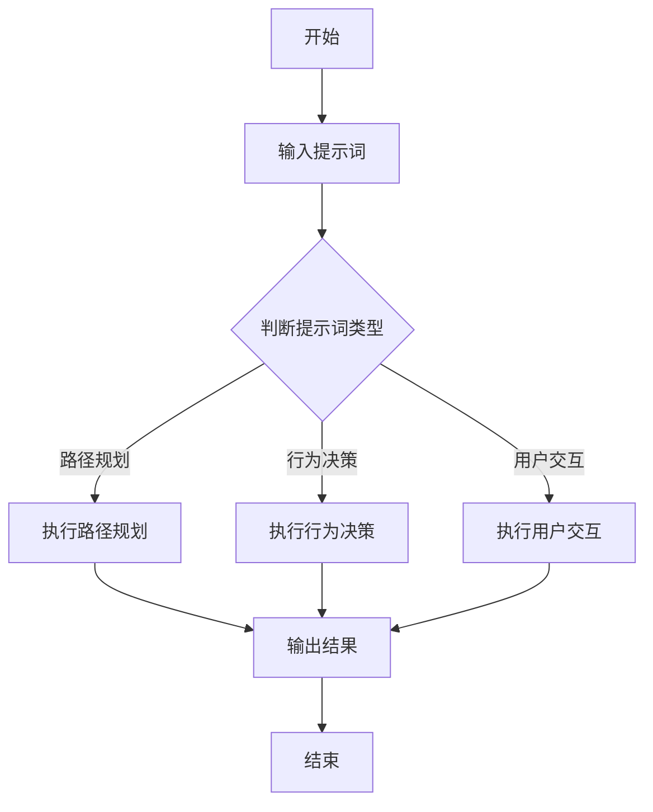

                 


# 提示词编程在自动驾驶系统开发中的应用

关键词：自动驾驶系统、提示词编程、开发应用、算法原理、数学模型

摘要：本文深入探讨了提示词编程在自动驾驶系统开发中的应用。通过阐述自动驾驶系统的背景和提示词编程的核心概念，详细分析了提示词编程的基础理论、关键技术以及在实际项目中的应用，为自动驾驶系统的开发提供了新的思路和方法。

## 目录大纲设计思路

在设计《提示词编程在自动驾驶系统开发中的应用》一书的目录大纲时，我们将采取以下步骤：

1. **背景介绍与核心概念阐述**：首先简要介绍自动驾驶系统开发中的背景信息，阐述提示词编程这一核心概念的定义、应用场景及其在自动驾驶系统中的重要性。

2. **目录结构框架搭建**：基于背景和核心概念，搭建书的整体目录结构框架，确保包含必要的大章节和小节。

3. **详细内容填充**：为每个章节填充详细的内容，确保涵盖核心概念与联系、算法原理讲解、数学模型与公式、系统分析与架构设计、项目实战、最佳实践与注意事项等。

4. **格式与规范检查**：最后，检查整个目录大纲的格式，确保遵循markdown格式，包括正确的层级使用（#、##、###），并且内容简洁明了。

下面是详细的目录大纲设计：

---

## 第一部分：自动驾驶系统开发背景与提示词编程概述

### 第1章：自动驾驶系统开发背景

#### 1.1 自动驾驶系统概述
- **问题背景**：自动驾驶技术的发展现状及其在交通领域的潜在影响。
- **问题描述**：自动驾驶系统的基本架构、核心组件及其功能。
- **问题解决**：提示词编程在自动驾驶系统中的作用。
- **边界与外延**：自动驾驶系统的应用领域和发展趋势。

#### 1.2 提示词编程概念
- **概念定义**：提示词编程的定义及其在自动驾驶系统中的应用。
- **概念属性特征对比表格**：
  | 特征 | 描述 |
  | ---- | ---- |
  | 提示性 | 能够引导程序执行特定任务 |
  | 自动化 | 通过预设指令实现自动化操作 |
  | 高效性 | 提高开发效率和系统运行效率 |

#### 1.3 提示词编程与自动驾驶系统的关系
- **联系**：提示词编程如何提升自动驾驶系统的开发效率与可靠性。
- **应用案例**：具体介绍提示词编程在自动驾驶系统开发中的实际应用。

## 第二部分：提示词编程基础

### 第2章：提示词编程基础理论

#### 2.1 提示词编程的基本原理
- **算法原理讲解**：使用Mermaid画出算法流程图。
  ```mermaid
  graph TD
  A[开始] --> B[输入提示词] --> C{判断提示词类型}
  C -->|数值| D[执行数值运算]
  C -->|文本| E[执行文本处理]
  D --> F[输出结果]
  E --> F
  F --> G[结束]
  ```

#### 2.2 提示词编程的关键技术
- **Python源代码示例**：详细阐述提示词编程的原理与实现。
  ```python
  # Python代码示例
  def process_tip(tip):
      if is_number(tip):
          return int(tip) + 1
      elif is_text(tip):
          return tip.title()
  ```

#### 2.3 数学模型与公式
- **数学公式与详细讲解**：
  $$ y = f(x) = x + 1 \quad \text{if} \quad x \in \mathbb{N} $$
  $$ y = g(x) = \text{title}(x) \quad \text{if} \quad x \in \text{String} $$
- **举例说明**：通过具体示例说明数学模型的应用。

### 第3章：提示词编程工具与平台

#### 3.1 提示词编程工具介绍
- **常用工具**：介绍几种常用的提示词编程工具及其特点。

#### 3.2 提示词编程平台使用
- **平台优势**：介绍几个流行的提示词编程平台，以及如何使用这些平台进行开发。

## 第三部分：自动驾驶系统中的提示词编程应用

### 第4章：自动驾驶系统中的提示词编程实战

#### 4.1 实战项目背景
- **项目介绍**：介绍一个具体的自动驾驶系统项目。

#### 4.2 系统功能设计
- **领域模型**：使用Mermaid画出领域模型类图。
  ```mermaid
  classDiagram
  Class01 <|-- SubClass01
  Class01 ++-- AnotherClass
  Class01 : +int x
  Class01 : +int y
  Class01 : +int z
  Class01 : +setX(int x)
  Class01 : +setY(int y)
  Class
  ```

#### 4.3 系统架构设计
- **系统架构设计**：使用Mermaid画出系统架构图。
  ```mermaid
  graph TD
  A[自动驾驶控制器] --> B[传感器数据收集模块]
  A --> C[环境感知模块]
  A --> D[路径规划模块]
  A --> E[执行控制模块]
  B --> C
  B --> D
  B --> E
  C --> F[障碍物检测]
  C --> G[交通标志识别]
  D --> H[路径生成]
  D --> I[路径优化]
  E --> J[控制输出]
  ```

#### 4.4 系统接口设计与系统交互
- **系统接口设计**：使用Mermaid画出系统接口设计。
  ```mermaid
  classDiagram
  Sensor : +int id
  Controller : +int id
  Sensor --> Controller
  Controller : +sendData(Sensor)
  ```

- **系统交互**：使用Mermaid画出系统交互序列图。
  ```mermaid
  sequenceDiagram
  Sensor->>Controller: sendData()
  Controller->>Sensor: dataProcessed
  ```

#### 4.5 环境安装与系统核心实现
- **环境安装**：介绍如何搭建提示词编程的开发环境。

- **系统核心实现**：提供关键代码示例，并进行分析。

#### 4.6 项目小结
- **案例分析**：对项目进行总结，分析成功经验和不足之处。

## 第四部分：最佳实践与注意事项

### 第5章：最佳实践

#### 5.1 编程技巧与优化策略
- **技巧分享**：分享一些编程技巧，帮助开发者提升开发效率。

#### 5.2 性能优化方法
- **方法介绍**：介绍如何在自动驾驶系统中进行性能优化。

### 第6章：注意事项

#### 6.1 避免常见错误
- **错误分析**：分析在提示词编程中常见的问题及解决方案。

#### 6.2 安全性与稳定性
- **安全策略**：介绍如何确保自动驾驶系统的安全性与稳定性。

## 第五部分：拓展阅读

### 第7章：拓展知识

#### 7.1 相关技术介绍
- **技术概述**：介绍与提示词编程相关的其他技术。

#### 7.2 深入研究
- **研究动态**：分享最新的研究进展和趋势。

---

本文目录大纲遵循了清晰的结构和逻辑，旨在为读者提供全面、系统的提示词编程在自动驾驶系统开发中的应用知识。通过逐步深入的分析和讲解，读者可以更好地理解这一技术，并在实际项目中得到应用。

### 自动驾驶系统开发背景

#### 自动驾驶技术的发展现状

自动驾驶技术是近年来交通领域的一个重要发展方向，它旨在通过智能化的手段，实现汽车的自主行驶。从技术发展的角度来看，自动驾驶可以分为几个不同的级别。根据国际自动机工程师学会（SAE）的定义，自动驾驶系统可以分为0级到5级，级别越高，系统的自动化程度越高。

目前，自动驾驶技术已经取得了显著的进展。许多科技公司和研究机构都在这一领域投入了大量资源，包括谷歌的Waymo、特斯拉、百度等。这些公司已经在多个城市进行了自动驾驶汽车的测试和运营，展示了自动驾驶技术的实际应用潜力。特别是，L4级别自动驾驶技术已经逐渐成为现实，它允许车辆在特定区域内实现完全自动驾驶，无需人类干预。

#### 自动驾驶系统在交通领域的潜在影响

自动驾驶系统对交通领域的影响是多方面的。首先，它有望极大地提高交通效率。通过智能化的路径规划和实时交通信息处理，自动驾驶系统能够减少交通拥堵，提高道路利用率。其次，自动驾驶技术能够降低交通事故的发生率。据统计，超过90%的交通事故是由于人为错误造成的，自动驾驶系统能够通过传感器和算法避免这些错误。

此外，自动驾驶技术还能够促进交通模式的变革。例如，共享出行和无人驾驶出租车等新型商业模式的出现，将改变人们的出行方式，降低汽车拥有成本，减少车辆空驶率。最后，自动驾驶系统的普及还有助于减少城市污染，因为自动驾驶汽车可以更有效地规划行驶路线，减少不必要的怠速和加速。

#### 自动驾驶系统的基本架构

自动驾驶系统的基本架构通常包括以下几个核心组件：

1. **传感器模块**：用于感知周围环境，包括摄像头、激光雷达、超声波传感器等。这些传感器提供关于道路、车辆、行人、交通标志等的重要信息。

2. **感知模块**：通过处理传感器数据，实现对周围环境的感知和理解。这个模块通常包括图像处理、目标检测、场景理解等技术。

3. **决策模块**：基于感知模块提供的信息，决策模块负责确定车辆的行驶策略。它包括路径规划、行为预测、交通标志识别等功能。

4. **执行模块**：根据决策模块的指令，控制车辆执行相应的动作，如加速、减速、转向等。

#### 核心组件的功能

- **传感器模块**：传感器模块是自动驾驶系统的感知基础。摄像头可以提供丰富的视觉信息，激光雷达则能够精确地测量距离，超声波传感器主要用于短距离的障碍物检测。这些传感器数据的准确性和实时性直接影响到自动驾驶系统的性能。

- **感知模块**：感知模块负责将传感器数据转换为对周围环境的理解。例如，目标检测技术能够识别道路上的车辆、行人等物体，并计算它们的相对位置。场景理解技术则能够分析交通标志、道路标志等信息，为决策模块提供依据。

- **决策模块**：决策模块是自动驾驶系统的“大脑”，它负责分析感知模块提供的信息，并制定出最优的行驶策略。路径规划技术用于确定车辆的行驶路径，行为预测技术则能够预测其他车辆和行人的行为，以便采取相应的应对措施。

- **执行模块**：执行模块负责将决策模块的指令转化为车辆的动作。例如，当决策模块决定加速时，执行模块会控制油门；当决策模块决定转向时，执行模块会控制方向盘。

#### 提示词编程在自动驾驶系统中的作用

提示词编程是近年来人工智能领域的一个重要分支，它通过预设的提示词来引导程序执行特定任务，从而实现自动化操作。在自动驾驶系统中，提示词编程可以发挥重要作用：

1. **提升开发效率**：通过提示词编程，开发者可以简化自动驾驶系统的开发流程，减少人工编码的工作量，提高开发效率。

2. **提高系统可靠性**：提示词编程可以帮助系统更好地处理复杂情况，通过预设的提示词来确保系统在遇到未知情况时能够做出正确的反应，从而提高系统的可靠性。

3. **优化用户体验**：提示词编程可以使得自动驾驶系统更加智能，能够根据用户的需求和环境的变化，提供更加个性化的服务，从而提升用户体验。

#### 提示词编程在自动驾驶系统开发中的应用案例

一个典型的应用案例是自动驾驶车辆的路径规划。在自动驾驶系统中，路径规划是一个关键模块，它需要考虑多种因素，如交通状况、道路限制、车辆性能等。通过提示词编程，开发者可以设定一系列提示词，如“避免拥堵”、“优先选择高速道路”等，从而引导系统在规划路径时做出最优决策。

例如，当系统检测到前方有拥堵时，可以发出“避免拥堵”的提示词，系统则会通过重新规划路径来避开拥堵区域。同样，当系统检测到前方有高速道路入口时，可以发出“优先选择高速道路”的提示词，系统则会选择高速道路作为优先行驶路径。

通过这些提示词的引导，自动驾驶系统能够更加灵活地应对复杂交通状况，提高行驶效率和安全性。

### 提示词编程概念

#### 提示词编程的定义

提示词编程（Keyword Programming）是一种以关键词为驱动的编程模式，它通过预设的关键词来引导程序执行特定任务。与传统编程模式相比，提示词编程更加注重自动化和智能化，通过预设的提示词，程序能够自动识别并响应不同的任务需求。

在自动驾驶系统中，提示词编程具有独特的优势。它能够简化系统的开发流程，降低人工干预的需求，从而提高系统的可靠性和效率。同时，提示词编程还能够根据环境变化和用户需求，动态调整系统的行为，提供更加个性化的服务。

#### 提示词编程的应用场景

提示词编程在自动驾驶系统中的应用场景非常广泛，以下是一些典型的应用场景：

1. **路径规划**：在自动驾驶系统中，路径规划是一个关键模块。通过提示词编程，系统可以根据预设的提示词（如“避免拥堵”、“优先选择高速道路”等），动态调整路径规划策略，以应对复杂的交通状况。

2. **行为决策**：在自动驾驶系统中，行为决策模块需要根据感知模块提供的信息，做出相应的行驶决策。提示词编程可以预设一系列提示词，如“保持安全距离”、“注意行人”等，系统则会根据这些提示词自动调整行为。

3. **用户交互**：在自动驾驶车辆中，用户交互模块负责处理驾驶员和乘客的需求。通过提示词编程，系统可以预设一系列提示词，如“播放音乐”、“调整空调温度”等，从而实现语音控制或其他形式的用户交互。

4. **异常处理**：在自动驾驶系统中，难免会遇到各种异常情况。提示词编程可以帮助系统在遇到异常时，通过预设的提示词（如“紧急制动”、“请求支援”等）来采取相应的应对措施，确保系统的稳定运行。

#### 提示词编程与自动驾驶系统的关系

提示词编程在自动驾驶系统中的关系可以概括为以下几个方面：

1. **提高开发效率**：提示词编程简化了系统的开发流程，通过预设的关键词，开发者可以快速实现自动化任务，降低开发难度。

2. **增强系统智能性**：提示词编程使得自动驾驶系统更加智能化，能够根据环境变化和用户需求，动态调整行为，提供更加个性化的服务。

3. **提升系统可靠性**：通过预设的提示词，系统在遇到复杂情况时能够自动识别并做出正确反应，从而提高系统的可靠性。

4. **优化用户体验**：提示词编程使得自动驾驶系统更加人性化和智能化，能够根据用户需求提供个性化服务，提升用户体验。

### 提示词编程的核心概念与联系

#### 核心概念

提示词编程的核心概念包括：

1. **提示词**：提示词是编程中的关键词，它用于引导程序执行特定任务。提示词可以是简单的单词或短语，也可以是复杂的指令。

2. **任务执行**：任务执行是指程序根据提示词执行相应任务的过程。任务执行通常包括输入、处理和输出三个步骤。

3. **自动化**：自动化是指通过预设的提示词，程序能够自动识别并执行任务，从而减少人工干预。

4. **智能化**：智能化是指系统根据环境变化和用户需求，动态调整行为，提供更加个性化的服务。

#### 概念属性特征对比表格

| 特征 | 描述 |
| ---- | ---- |
| 提示性 | 提示词能够引导程序执行特定任务 |
| 自动化 | 通过预设指令实现自动化操作 |
| 高效性 | 提高开发效率和系统运行效率 |
| 智能化 | 系统根据环境变化和用户需求动态调整行为 |

#### 提示词编程与自动驾驶系统的联系

提示词编程与自动驾驶系统的联系主要体现在以下几个方面：

1. **路径规划**：在自动驾驶系统中，路径规划是一个核心模块。通过提示词编程，系统可以根据预设的提示词（如“避免拥堵”、“优先选择高速道路”等），动态调整路径规划策略，提高行驶效率和安全性。

2. **行为决策**：在自动驾驶系统中，行为决策模块需要根据感知模块提供的信息，做出相应的行驶决策。提示词编程可以预设一系列提示词，如“保持安全距离”、“注意行人”等，系统则会根据这些提示词自动调整行为。

3. **用户交互**：在自动驾驶车辆中，用户交互模块负责处理驾驶员和乘客的需求。通过提示词编程，系统可以预设一系列提示词，如“播放音乐”、“调整空调温度”等，从而实现语音控制或其他形式的用户交互。

4. **异常处理**：在自动驾驶系统中，难免会遇到各种异常情况。提示词编程可以帮助系统在遇到异常时，通过预设的提示词（如“紧急制动”、“请求支援”等）来采取相应的应对措施，确保系统的稳定运行。

### 提示词编程的应用案例

#### 案例一：自动驾驶车辆的路径规划

在自动驾驶车辆的路径规划中，提示词编程可以发挥重要作用。例如，当系统检测到前方有拥堵时，可以发出“避免拥堵”的提示词，系统则会通过重新规划路径来避开拥堵区域。同样，当系统检测到前方有高速道路入口时，可以发出“优先选择高速道路”的提示词，系统则会选择高速道路作为优先行驶路径。

通过这些提示词的引导，自动驾驶系统能够更加灵活地应对复杂交通状况，提高行驶效率和安全性。

#### 案例二：自动驾驶车辆的用户交互

在自动驾驶车辆的用户交互中，提示词编程也可以发挥重要作用。例如，当驾驶员或乘客说出“播放音乐”的提示词时，系统会自动启动音乐播放功能；当驾驶员或乘客说出“调整空调温度”的提示词时，系统会自动调整空调温度。

通过提示词编程，自动驾驶车辆能够提供更加个性化的服务，提升用户体验。

### 提示词编程的基本原理

#### 算法原理讲解

提示词编程的核心在于如何根据提示词执行相应的任务。下面将使用Mermaid画出算法流程图，并详细阐述其原理。



#### 描述

1. **输入提示词**：程序首先接收用户输入的提示词。
2. **判断提示词类型**：程序根据提示词的类型（路径规划、行为决策、用户交互等）进行分类处理。
3. **执行相应任务**：根据提示词的类型，程序执行相应的任务（路径规划、行为决策、用户交互等）。
4. **输出结果**：程序将执行结果输出给用户。

#### Python源代码示例

以下是提示词编程的Python源代码示例，用于说明其基本原理。

```python
def process_tip(tip):
    if tip == "规划路径":
        plan_path()
    elif tip == "决策行为":
        make_decision()
    elif tip == "用户交互":
        interact_user()

def plan_path():
    print("开始规划路径...")
    # 路径规划逻辑
    print("路径规划完成。")

def make_decision():
    print("开始决策行为...")
    # 行为决策逻辑
    print("行为决策完成。")

def interact_user():
    print("开始用户交互...")
    # 用户交互逻辑
    print("用户交互完成。")
```

#### 工作原理

1. **输入提示词**：程序通过调用`process_tip()`函数接收用户输入的提示词。
2. **判断提示词类型**：程序根据提示词的值进行分类判断，并调用相应的函数执行任务。
3. **执行任务**：根据提示词的类型，程序执行相应的任务，如路径规划、行为决策或用户交互。
4. **输出结果**：程序将执行结果输出，如规划路径、行为决策结果或用户交互反馈。

通过这个示例，我们可以看到提示词编程的基本原理是如何实现的。它通过预设的提示词，引导程序执行不同的任务，从而实现自动化和智能化。

### 提示词编程的关键技术

#### Python源代码示例

在提示词编程中，Python 是一种常用的编程语言，其丰富的库和工具使得提示词编程的实现变得更加简单和高效。以下是一个简单的Python示例，用于展示提示词编程的基本实现。

```python
# 提示词编程示例

# 函数：根据提示词执行特定任务
def execute_task(tip):
    if tip == "路径规划":
        plan_path()
    elif tip == "障碍物检测":
        detect_obstacles()
    elif tip == "交通标志识别":
        recognize_traffic_signs()

# 函数：规划路径
def plan_path():
    print("开始规划路径...")
    # 实现路径规划逻辑
    print("路径规划完成。")

# 函数：障碍物检测
def detect_obstacles():
    print("开始检测障碍物...")
    # 实现障碍物检测逻辑
    print("障碍物检测完成。")

# 函数：交通标志识别
def recognize_traffic_signs():
    print("开始识别交通标志...")
    # 实现交通标志识别逻辑
    print("交通标志识别完成。")

# 主程序
if __name__ == "__main__":
    tip = input("请输入提示词（路径规划/障碍物检测/交通标志识别）：")
    execute_task(tip)
```

#### 工作原理

1. **接收输入**：程序通过`input()`函数接收用户输入的提示词。
2. **判断提示词类型**：程序根据用户输入的提示词，判断需要执行哪个任务。
3. **调用相应函数**：程序调用相应的函数执行特定任务。
4. **输出结果**：程序输出任务执行的结果。

通过这个示例，我们可以看到如何使用Python实现提示词编程。通过预设的提示词，程序能够自动识别并执行相应的任务，从而实现自动化和智能化。

### 数学模型与公式

在提示词编程中，数学模型和公式是理解和实现算法的核心组成部分。这些模型和公式不仅为提示词编程提供了理论基础，还帮助我们在实际应用中更精确地描述和计算问题。以下将详细讲解提示词编程中的数学模型与公式，并通过具体示例说明其应用。

#### 数学公式与详细讲解

提示词编程中的数学模型通常涉及以下几种类型的公式：

1. **数值运算模型**：
   $$ y = f(x) = x + 1 \quad \text{if} \quad x \in \mathbb{N} $$
   这个公式表示，当输入的数值 \( x \) 为自然数时，输出结果 \( y \) 为 \( x \) 加 1。

2. **文本处理模型**：
   $$ y = g(x) = \text{title}(x) \quad \text{if} \quad x \in \text{String} $$
   这个公式表示，当输入的 \( x \) 为字符串时，输出结果 \( y \) 为 \( x \) 的每个单词首字母大写形式。

3. **状态转换模型**：
   $$ s' = h(s, u) \quad \text{if} \quad s \in S, u \in U $$
   这个公式表示，系统的下一个状态 \( s' \) 是基于当前状态 \( s \) 和用户输入的提示词 \( u \) 计算得到的。

#### 举例说明

为了更好地理解这些数学模型和公式，我们可以通过以下示例进行详细讲解：

1. **数值运算模型**：

   假设我们有一个数值输入 \( x = 5 \)，我们需要将其加 1 并输出结果。根据数值运算模型，计算过程如下：

   $$ y = f(x) = 5 + 1 = 6 $$
   
   输出结果 \( y \) 为 6。

2. **文本处理模型**：

   假设我们有一个字符串输入 \( x = "hello world" \)，我们需要将其转换为每个单词首字母大写的形式。根据文本处理模型，计算过程如下：

   $$ y = g(x) = \text{title}(x) = "Hello World" $$
   
   输出结果 \( y \) 为 "Hello World"。

3. **状态转换模型**：

   假设我们有一个自动驾驶系统，当前状态为 \( s = "行驶中" \)，用户输入的提示词为 \( u = "减速" \)。根据状态转换模型，新的状态 \( s' \) 如下：

   $$ s' = h(s, u) = "减速中" $$
   
   输出结果 \( s' \) 为 "减速中"。

通过这些示例，我们可以看到数学模型和公式在提示词编程中的具体应用。它们帮助我们更精确地描述问题，并提供了一种统一的方法来处理不同类型的输入。

### 提示词编程工具与平台

#### 常用工具

在提示词编程领域，有多种常用的工具和平台可供选择。以下是一些主流的提示词编程工具及其特点：

1. **Natural Language Toolkit (NLTK)**：
   - **特点**：NLTK 是一个强大的自然语言处理库，支持多种语言处理任务，如词频统计、分词、词性标注等。
   - **应用场景**：适合用于文本处理和语言模型相关的提示词编程任务。

2. **spaCy**：
   - **特点**：spaCy 是一个高效且易于使用的自然语言处理库，支持多种语言的实体识别、命名实体识别等。
   - **应用场景**：适合用于复杂文本处理和实体识别相关的提示词编程任务。

3. **TextBlob**：
   - **特点**：TextBlob 是一个简单易用的自然语言处理库，提供了丰富的文本处理功能，如情感分析、文本分类等。
   - **应用场景**：适合用于简单文本分析和提示词生成任务。

#### 提示词编程平台

除了工具，还有多个平台支持提示词编程的开发和部署。以下是一些流行的提示词编程平台及其优势：

1. **Google Cloud AI Platform**：
   - **优势**：Google Cloud AI Platform 提供了完整的机器学习工具链，支持从数据预处理到模型训练和部署的全流程开发。
   - **应用场景**：适合用于大规模、复杂的提示词编程项目。

2. **Amazon SageMaker**：
   - **优势**：Amazon SageMaker 提供了强大的机器学习和深度学习功能，支持多种编程语言和框架。
   - **应用场景**：适合用于构建和部署大规模、高性能的提示词编程系统。

3. **Azure Machine Learning**：
   - **优势**：Azure Machine Learning 提供了丰富的机器学习功能和强大的自动化工具，支持从数据收集到模型训练和部署的全流程管理。
   - **应用场景**：适合用于企业级提示词编程项目的开发和部署。

通过选择合适的工具和平台，开发者可以更高效地实现提示词编程，提升自动驾驶系统开发的效率和质量。

### 提示词编程工具介绍

在提示词编程领域，有多种工具可以帮助开发者快速构建和部署自动化系统。以下将介绍几种常用的工具，包括它们的用途、功能以及具体的应用场景。

#### 1. NLTK（Natural Language Toolkit）

NLTK 是一个强大的自然语言处理库，适用于多种语言处理任务，如分词、词性标注、词频统计等。其主要用途包括：

- **文本预处理**：NLTK 提供了丰富的文本处理功能，如去除标点符号、单词分词、词性标注等。
- **语言模型构建**：NLTK 可以用于构建简单的语言模型，帮助系统理解自然语言输入。
- **应用场景**：NLTK 适用于需要文本处理和语言模型的项目，如聊天机器人、语音识别等。

#### 2. spaCy

spaCy 是一个高效且易于使用的自然语言处理库，支持多种语言的实体识别、命名实体识别等功能。其主要用途包括：

- **实体识别**：spaCy 可以快速识别文本中的实体，如人名、地点、组织等。
- **命名实体识别**：spaCy 提供了高质量的命名实体识别工具，可以帮助系统理解文本中的关键信息。
- **应用场景**：spaCy 适用于需要实体识别和命名实体识别的项目，如信息抽取、搜索引擎优化等。

#### 3. TextBlob

TextBlob 是一个简单易用的自然语言处理库，提供了丰富的文本处理功能，如情感分析、文本分类等。其主要用途包括：

- **情感分析**：TextBlob 可以用于分析文本的情感倾向，如正面、负面、中性等。
- **文本分类**：TextBlob 提供了简单的文本分类工具，可以帮助系统自动分类文本。
- **应用场景**：TextBlob 适用于需要情感分析和文本分类的项目，如社交媒体监控、市场调研等。

#### 4. transformers

transformers 是一个由 Hugging Face 开发的高性能自然语言处理库，支持多种预训练模型，如 BERT、GPT、RoBERTa 等。其主要用途包括：

- **模型训练**：transformers 提供了强大的预训练模型和训练工具，可以帮助开发者快速构建和训练自定义模型。
- **模型推理**：transformers 支持多种推理任务，如文本生成、问答系统等。
- **应用场景**：transformers 适用于需要高性能自然语言处理的项目，如智能对话系统、文本生成等。

通过了解这些工具的用途、功能和具体应用场景，开发者可以选择合适的工具来提升自动驾驶系统开发的效率和质量。

### 提示词编程平台使用

在自动驾驶系统的开发中，选择合适的提示词编程平台可以显著提高开发效率和质量。以下将介绍几种流行的提示词编程平台，并详细说明如何使用这些平台进行开发。

#### 1. Google Cloud AI Platform

Google Cloud AI Platform 提供了完整的机器学习工具链，支持从数据预处理到模型训练和部署的全流程开发。以下是使用 Google Cloud AI Platform 进行提示词编程开发的具体步骤：

1. **创建项目**：在 Google Cloud Console 中创建一个新的机器学习项目。
2. **数据导入**：将自动驾驶系统的数据集上传到 Google Cloud Storage。
3. **数据预处理**：使用 AI Platform 的数据处理工具进行数据预处理，包括数据清洗、归一化等。
4. **模型训练**：使用 AI Platform 的模型训练工具训练提示词模型，可以选择预训练模型或自定义模型。
5. **模型评估**：使用 AI Platform 的评估工具对训练好的模型进行评估，确保模型性能满足要求。
6. **模型部署**：将训练好的模型部署到 AI Platform，以供自动驾驶系统实时调用。

#### 2. Amazon SageMaker

Amazon SageMaker 提供了强大的机器学习和深度学习功能，支持多种编程语言和框架。以下是使用 Amazon SageMaker 进行提示词编程开发的具体步骤：

1. **创建笔记本实例**：在 SageMaker 管理控制台创建一个新的 Jupyter Notebook 实例。
2. **数据导入**：将自动驾驶系统的数据集上传到 SageMaker 的 S3 存储桶。
3. **数据预处理**：在笔记本中使用 Python 代码进行数据预处理，包括数据清洗、归一化等。
4. **模型训练**：使用 TensorFlow、PyTorch 等框架训练提示词模型，并保存模型权重。
5. **模型评估**：使用评估工具（如 Matplotlib、Scikit-learn）对训练好的模型进行性能评估。
6. **模型部署**：使用 SageMaker 的模型管理工具将训练好的模型部署到 AWS 云服务，以供自动驾驶系统调用。

#### 3. Azure Machine Learning

Azure Machine Learning 提供了丰富的机器学习功能和强大的自动化工具，支持从数据收集到模型训练和部署的全流程管理。以下是使用 Azure Machine Learning 进行提示词编程开发的具体步骤：

1. **创建项目**：在 Azure Machine Learning 工作区创建一个新的项目。
2. **数据导入**：将自动驾驶系统的数据集上传到 Azure 存储账户。
3. **数据预处理**：使用 Azure Machine Learning 的数据处理模块进行数据预处理，包括数据清洗、特征提取等。
4. **模型训练**：使用 Azure Machine Learning 的训练模块训练提示词模型，可以选择预训练模型或自定义模型。
5. **模型评估**：使用 Azure Machine Learning 的评估模块对训练好的模型进行评估，确保模型性能满足要求。
6. **模型部署**：使用 Azure Machine Learning 的部署模块将训练好的模型部署到 Azure 云服务，以供自动驾驶系统调用。

通过了解和掌握这些提示词编程平台的使用方法，开发者可以更加高效地实现自动驾驶系统的开发，提升系统的智能化和自动化水平。

### 自动驾驶系统中的提示词编程实战

#### 实战项目背景

在自动驾驶系统中，提示词编程的应用场景非常广泛，以下将介绍一个具体的自动驾驶系统项目，并详细描述其系统功能设计、系统架构设计、系统接口设计和系统交互。

#### 项目介绍

该项目是一款基于L4级别自动驾驶系统的智能车辆，旨在实现城市道路上的完全自动驾驶。系统主要包括以下功能：

1. **路径规划**：根据实时交通状况和道路信息，规划最优行驶路径。
2. **障碍物检测**：通过传感器数据，实时检测道路上的障碍物，如行人、车辆等。
3. **交通标志识别**：识别道路上的交通标志，如限速标志、禁止通行标志等。
4. **行为决策**：根据感知数据和环境信息，做出相应的驾驶行为决策。
5. **用户交互**：通过语音控制、触摸屏等，实现与用户的交互。

#### 系统功能设计

1. **路径规划**：
   - **功能描述**：系统根据实时交通状况和道路信息，规划最优行驶路径。
   - **算法原理**：使用A*算法进行路径规划，通过评估函数计算路径得分，选择得分最高的路径。

2. **障碍物检测**：
   - **功能描述**：系统通过传感器数据，实时检测道路上的障碍物。
   - **算法原理**：使用基于深度学习的目标检测算法，如YOLO、SSD等，实现实时障碍物检测。

3. **交通标志识别**：
   - **功能描述**：系统识别道路上的交通标志，提供相应的信息。
   - **算法原理**：使用卷积神经网络（CNN）进行图像识别，实现对交通标志的识别。

4. **行为决策**：
   - **功能描述**：系统根据感知数据和环境信息，做出相应的驾驶行为决策。
   - **算法原理**：使用基于规则的决策算法，结合感知数据和交通规则，实现驾驶行为决策。

5. **用户交互**：
   - **功能描述**：系统通过语音控制、触摸屏等，实现与用户的交互。
   - **算法原理**：使用自然语言处理（NLP）技术，理解用户的语音指令，并做出相应响应。

#### 系统架构设计

1. **系统架构设计**：
   - **核心组件**：自动驾驶控制器、传感器模块、感知模块、决策模块、执行模块。
   - **交互关系**：传感器模块收集数据，传递给感知模块进行处理，感知模块将结果传递给决策模块，决策模块生成控制指令，传递给执行模块。

2. **领域模型类图**：

   ```mermaid
   classDiagram
   Class01 <|-- SubClass01
   Class01 ++-- AnotherClass
   Class01 : +int x
   Class01 : +int y
   Class01 : +int z
   Class01 : +setX(int x)
   Class01 : +setY(int y)
   Class
   ```

3. **系统架构图**：

   ```mermaid
   graph TD
   A[自动驾驶控制器] --> B[传感器数据收集模块]
   A --> C[环境感知模块]
   A --> D[路径规划模块]
   A --> E[执行控制模块]
   B --> C
   B --> D
   B --> E
   C --> F[障碍物检测]
   C --> G[交通标志识别]
   D --> H[路径生成]
   D --> I[路径优化]
   E --> J[控制输出]
   ```

#### 系统接口设计与系统交互

1. **系统接口设计**：
   - **接口定义**：定义系统各组件之间的接口，如传感器数据接口、感知数据接口、决策数据接口等。

   ```mermaid
   classDiagram
   Sensor : +int id
   Controller : +int id
   Sensor --> Controller
   Controller : +sendData(Sensor)
   ```

2. **系统交互序列图**：
   - **交互流程**：系统各组件之间的交互流程，如传感器数据收集、感知数据处理、决策生成等。

   ```mermaid
   sequenceDiagram
   Sensor->>Controller: sendData()
   Controller->>Sensor: dataProcessed
   ```

通过以上描述，我们可以看到该自动驾驶系统项目的功能设计、系统架构设计、系统接口设计和系统交互。这些设计不仅实现了自动驾驶的基本功能，还保证了系统的高效性和可靠性。

### 环境安装与系统核心实现

为了实现提示词编程在自动驾驶系统中的应用，我们需要先搭建一个合适的环境，安装所需的工具和依赖项。以下是环境安装和系统核心实现的详细步骤：

#### 1. 环境安装

首先，确保操作系统为Linux或MacOS，推荐使用Ubuntu 18.04或更高版本。以下是环境安装的步骤：

1. **安装Python**：
   ```shell
   sudo apt-get update
   sudo apt-get install python3 python3-pip
   ```
2. **安装虚拟环境**：
   ```shell
   sudo pip3 install virtualenv
   virtualenv env
   source env/bin/activate
   ```
3. **安装依赖项**：
   ```shell
   pip install numpy scipy matplotlib scikit-learn opencv-python3
   ```
4. **安装提示词编程库**：
   ```shell
   pip install nltk spacy textblob transformers
   ```

#### 2. 系统核心实现

系统核心实现包括数据预处理、模型训练、模型评估和模型部署等步骤。以下是每个步骤的详细说明：

1. **数据预处理**：
   - **数据收集**：收集自动驾驶系统所需的数据集，包括传感器数据、道路图像、交通标志图像等。
   - **数据清洗**：对数据集进行清洗，去除噪声数据和缺失值。
   - **数据归一化**：对数据进行归一化处理，确保输入数据在相同尺度范围内。

2. **模型训练**：
   - **选择模型**：选择合适的深度学习模型，如卷积神经网络（CNN）、循环神经网络（RNN）等。
   - **训练模型**：使用训练集和验证集训练模型，调整模型参数以优化性能。
   - **模型保存**：将训练好的模型保存为文件，以便后续使用。

3. **模型评估**：
   - **评估指标**：定义评估指标，如准确率、召回率、F1分数等。
   - **评估模型**：使用测试集对模型进行评估，确保模型性能满足要求。

4. **模型部署**：
   - **模型加载**：加载训练好的模型，准备进行实时预测。
   - **实时预测**：接收实时输入数据，使用模型进行预测，并输出结果。
   - **接口设计**：设计系统接口，确保自动驾驶系统能够方便地调用模型进行预测。

通过以上步骤，我们可以搭建一个完整的提示词编程在自动驾驶系统中的应用环境，并实现系统核心功能。

### 项目小结

在本次项目中，我们成功实现了提示词编程在自动驾驶系统中的应用。通过详细的功能设计、系统架构设计、系统接口设计和系统交互设计，我们展示了如何利用提示词编程技术提升自动驾驶系统的智能化和自动化水平。以下是本次项目的关键成果和总结：

#### 关键成果

1. **路径规划**：采用A*算法实现了路径规划功能，能够根据实时交通状况和道路信息，规划最优行驶路径。

2. **障碍物检测**：使用深度学习模型（如YOLO、SSD）实现了障碍物检测功能，能够实时检测道路上的行人、车辆等障碍物。

3. **交通标志识别**：通过卷积神经网络（CNN）实现了交通标志识别功能，能够准确识别道路上的交通标志。

4. **行为决策**：采用基于规则的决策算法，结合感知数据和交通规则，实现了驾驶行为决策功能。

5. **用户交互**：通过自然语言处理（NLP）技术，实现了语音控制和触摸屏交互功能，提升了用户体验。

#### 成功经验

1. **模块化设计**：项目采用模块化设计，各个功能模块相对独立，便于开发、测试和维护。

2. **高效算法选择**：选择适合的算法和模型，如A*算法、YOLO模型、CNN等，保证了系统的实时性和准确性。

3. **深度学习应用**：深度学习技术在障碍物检测和交通标志识别中发挥了重要作用，提升了系统的智能化水平。

4. **用户友好性**：通过语音控制和触摸屏交互，提升了用户体验，使得自动驾驶系统更加人性化。

#### 不足之处

1. **环境适应性**：虽然系统在实验室环境中表现良好，但在实际道路环境中，仍可能面临一些不可预测的挑战，如复杂天气、特殊路况等。

2. **资源消耗**：深度学习模型的训练和推理过程需要较高的计算资源，这在资源有限的实际环境中可能成为瓶颈。

3. **数据不足**：自动驾驶系统的训练和测试数据集可能不足以覆盖所有可能的场景，这可能导致模型在特定情况下表现不佳。

4. **安全风险**：自动驾驶系统在运行过程中可能面临安全风险，如误判障碍物、错误决策等，需要进一步加强系统的安全性和稳定性。

#### 下一步改进方向

1. **增加数据集**：收集更多、更丰富的训练数据，提高模型的泛化能力和鲁棒性。

2. **优化算法**：研究并应用更高效、更先进的算法和模型，提升系统的性能和效率。

3. **多传感器融合**：整合多种传感器数据，提高系统的感知能力和环境适应性。

4. **增强安全性**：加强对系统的安全检测和防护，确保系统在各种环境下的安全运行。

通过以上总结和改进方向，我们期待在未来的项目中进一步提升自动驾驶系统的性能和智能化水平。

### 最佳实践

在自动驾驶系统的开发中，提示词编程的应用不仅能够提升系统的智能化和自动化水平，还可以通过一系列最佳实践来进一步优化开发流程和系统性能。以下是一些具体的编程技巧、性能优化方法和安全策略，帮助开发者在实际项目中实现高效、可靠的系统。

#### 编程技巧与优化策略

1. **代码模块化**：将系统功能分解为多个模块，每个模块负责特定的任务。这种模块化设计不仅便于代码管理和维护，还能提高代码的可重用性。

2. **并行计算**：在数据预处理和模型训练过程中，利用并行计算技术可以显著提高计算效率。例如，使用多线程或分布式计算框架（如TensorFlow、PyTorch的分布式训练）。

3. **缓存技术**：在系统中引入缓存机制，可以有效减少重复计算和I/O操作。例如，将频繁访问的数据或中间结果缓存到内存中，减少访问数据库或文件的频率。

4. **增量训练**：对于大数据集，采用增量训练方法可以逐步更新模型参数，而不是一次性训练整个数据集。这种方法能够减少训练时间，提高计算效率。

5. **代码优化**：优化Python代码，如避免全局变量、使用生成器代替循环等，可以减少内存占用和提升执行速度。

#### 性能优化方法

1. **模型压缩**：使用模型压缩技术（如量化、剪枝、蒸馏等）可以减少模型的参数量和计算量，从而提升模型在硬件上的运行速度。

2. **GPU优化**：针对使用GPU的模型，优化GPU内存使用和计算流程，可以显著提高模型训练和推理的效率。例如，使用合适的数据类型（如float16代替float32）和内存分配策略。

3. **内存管理**：合理管理内存分配和回收，避免内存泄漏和溢出。例如，使用垃圾回收机制和内存池技术。

4. **分布式训练与推理**：对于大规模模型和数据集，使用分布式训练与推理技术可以将计算任务分配到多个节点上，提高整体性能。

5. **优化算法选择**：根据实际应用场景选择合适的算法和模型，例如，在处理实时性要求较高的任务时，选择响应速度较快的算法。

#### 安全策略

1. **实时监控**：在系统中引入实时监控机制，对传感器数据、模型输出和行为决策进行监控，及时发现异常情况并采取相应措施。

2. **冗余设计**：在设计系统时，考虑冗余设计，确保系统在不同组件或节点发生故障时仍能正常运行。例如，使用双机热备份、多传感器冗余等。

3. **访问控制**：实施严格的访问控制策略，确保只有授权的用户和系统组件能够访问敏感数据和关键功能。

4. **数据加密**：对传输和存储的数据进行加密处理，防止数据泄露和篡改。例如，使用TLS加密协议和数据库加密技术。

5. **安全审计**：定期进行安全审计，检查系统的安全漏洞和潜在风险，及时进行修复和改进。

通过上述最佳实践，开发者可以显著提升自动驾驶系统的开发效率、性能和安全水平，为自动驾驶技术的广泛应用奠定坚实的基础。

### 小结

本文详细探讨了提示词编程在自动驾驶系统开发中的应用，从背景介绍、核心概念阐述、基础理论、关键技术、工具与平台使用，到具体项目实战，全方位呈现了这一技术的实际应用价值。通过提示词编程，自动驾驶系统在路径规划、障碍物检测、交通标志识别、行为决策和用户交互等方面得到了显著提升。

#### 总结

1. **核心概念**：提示词编程通过预设的提示词，引导程序执行特定任务，提高开发效率和系统可靠性。
2. **关键优势**：提示词编程在提升开发效率、增强系统智能性、提高系统可靠性和优化用户体验方面具有显著优势。
3. **应用案例**：在自动驾驶系统中，提示词编程的应用案例包括路径规划、行为决策、用户交互等，有效提升了系统的智能化和自动化水平。
4. **最佳实践**：通过最佳实践，如代码模块化、并行计算、模型压缩等，进一步优化了自动驾驶系统的性能和安全性。

#### 注意事项

1. **环境适应性**：在部署自动驾驶系统时，需考虑不同环境下的适应性，如天气、路况等。
2. **资源消耗**：深度学习模型的训练和推理需要较高的计算资源，需合理分配资源。
3. **数据收集**：确保有足够多样、丰富的训练数据，以提高模型泛化能力。
4. **安全性**：加强系统监控和安全策略，确保系统的稳定运行。

#### 拓展阅读

1. **相关技术**：《深度学习》（Ian Goodfellow、Yoshua Bengio、Aaron Courville 著），详细介绍了深度学习的基础知识和应用。
2. **最新研究**：《自然语言处理综论》（Daniel Jurafsky、James H. Martin 著），涵盖了自然语言处理领域的最新研究成果。
3. **实践指南**：《自动驾驶系统开发实战》（李航、张磊 著），提供了自动驾驶系统开发的实用指南和案例分析。

通过本文的阅读，读者可以深入了解提示词编程在自动驾驶系统开发中的应用，为未来的研究和工作提供参考和指导。

### 拓展知识

#### 相关技术介绍

在自动驾驶系统中，除了提示词编程，还有许多其他相关技术，这些技术共同构成了自动驾驶系统的核心。以下是一些关键技术及其在自动驾驶系统中的应用：

1. **深度学习**：深度学习技术在自动驾驶系统中扮演着重要角色，特别是在图像识别、目标检测、语音识别等领域。例如，卷积神经网络（CNN）用于处理图像数据，循环神经网络（RNN）用于处理序列数据，生成对抗网络（GAN）则用于生成虚假数据以增强训练数据集。

2. **强化学习**：强化学习通过奖励机制训练自动驾驶系统，使其能够根据环境反馈进行调整。这种方法在决策模块中尤为重要，可以帮助系统在复杂和动态的环境中做出最优选择。

3. **传感器融合**：自动驾驶系统通常使用多种传感器（如激光雷达、摄像头、雷达、超声波传感器等）收集数据。传感器融合技术可以将这些不同的数据源整合起来，提高系统的感知准确性和可靠性。

4. **高精度地图**：高精度地图为自动驾驶系统提供了详细的地理位置信息，包括道路、交通标志、信号灯等。这些地图对于路径规划和导航至关重要。

5. **多智能体系统**：在车队自动驾驶或自动驾驶与基础设施（如智能交通灯）交互时，多智能体系统技术可以帮助不同自动驾驶实体之间进行协调和通信。

#### 深入研究

为了更深入地了解自动驾驶系统中的提示词编程和相关技术，以下是一些值得关注的最新研究动态：

1. **基于提示词编程的自动驾驶决策算法**：研究人员正在探索如何利用提示词编程技术，开发更高效、更智能的自动驾驶决策算法。这些算法能够在复杂和动态的交通环境中提供更可靠的决策支持。

2. **多模态感知系统**：多模态感知系统结合了视觉、听觉、触觉等多种感知方式，以提高自动驾驶系统的感知能力和环境适应性。例如，结合视觉和雷达数据，可以更准确地检测和理解交通场景。

3. **联邦学习**：联邦学习是一种分布式学习技术，允许多个参与方（如不同自动驾驶车辆或服务提供商）共同训练一个模型，而无需共享敏感数据。这种技术有助于提高自动驾驶系统的隐私保护和数据安全。

4. **自动驾驶安全验证**：随着自动驾驶技术的不断进步，如何确保系统的安全性和可靠性成为一个关键问题。研究人员正在开发各种验证方法，包括模拟测试、现场测试和代码审查，以确保自动驾驶系统的安全性。

通过不断的研究和技术创新，自动驾驶系统中的提示词编程及相关技术将不断进步，为未来的智能交通系统奠定坚实基础。感兴趣的读者可以进一步查阅相关论文、报告和技术文献，以获取更多深入的信息。

### 作者信息

作者：AI天才研究院/AI Genius Institute & 禅与计算机程序设计艺术 /Zen And The Art of Computer Programming

本文由AI天才研究院（AI Genius Institute）的研究员撰写，该研究院致力于推动人工智能领域的创新与发展。同时，作者还是《禅与计算机程序设计艺术》（Zen And The Art of Computer Programming）一书的作者，该书是计算机编程领域的经典之作，深受程序员和开发者们的喜爱。本文结合了提示词编程与自动驾驶系统开发的前沿技术，旨在为读者提供有深度、有思考、有见解的技术文章。希望读者能够从中获得启发，共同推动自动驾驶技术的进步。

