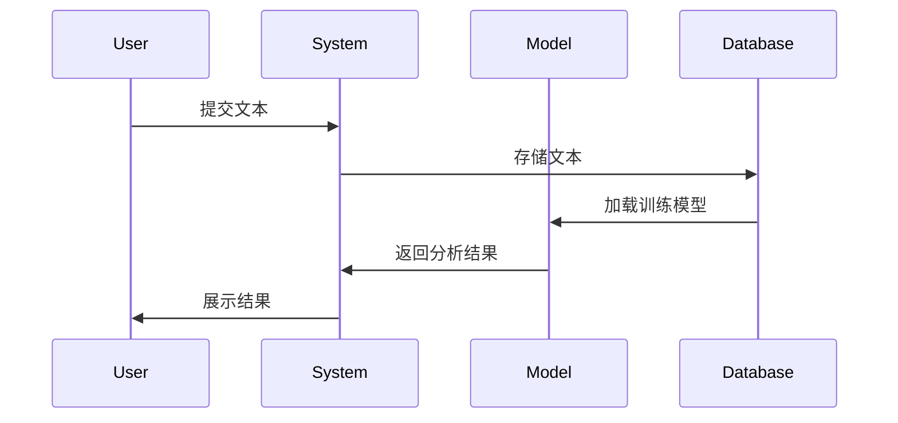
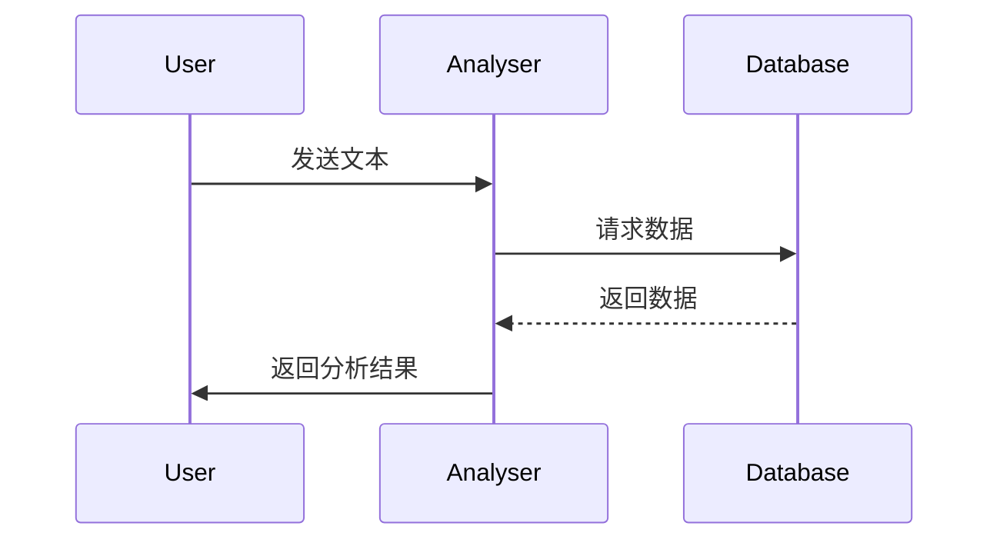

                 

## 提示词编程在自然语言伦理分析中的角色

> 关键词：自然语言伦理分析、提示词编程、伦理原则编码、语言行为评估

> 摘要：本文探讨了提示词编程在自然语言伦理分析中的角色和重要性。通过介绍自然语言伦理分析的问题背景、提示词编程的基本概念和应用，本文分析了编程技术在伦理原则编码和语言行为评估中的应用，并展示了具体实践案例。文章最后讨论了提示词编程在自然语言伦理分析中的挑战和未来趋势。

### 第1章 引言：问题背景与重要性

随着互联网和人工智能技术的飞速发展，自然语言处理（NLP）技术得到了广泛应用。从搜索引擎、机器翻译到智能客服、智能助手，NLP技术已经在各个领域发挥着重要作用。然而，在自然语言伦理分析领域，尽管已有不少研究关注语言伦理问题，但如何通过编程技术实现有效的自然语言伦理分析仍是一个挑战。

#### 1.1.1 问题背景

自然语言伦理分析涉及到对语言、文化、价值观等多方面的深入理解，其复杂性和多样性使得传统的分析手段难以胜任。编程作为一种强大的工具，可以用于构建复杂的算法和模型，从而帮助研究人员更好地理解和分析自然语言中的伦理问题。

#### 1.1.2 问题描述

自然语言伦理分析涉及到对自然语言中的伦理问题进行识别、分析和评价。这包括对语言使用中的不当行为、歧视性语言、误导性信息等进行评估和纠正。传统的自然语言处理方法往往侧重于语言的理解和生成，而忽视了语言伦理的维度。因此，如何通过编程技术实现有效的自然语言伦理分析成为一个亟待解决的问题。

#### 1.1.3 问题解决

本书旨在探讨如何通过提示词编程技术，在自然语言伦理分析中发挥其独特作用。提示词编程（Prompt Programming）是一种通过设计特定的提示词（prompts），引导模型进行特定任务的方法。本书将介绍如何使用提示词编程技术，构建能够处理自然语言伦理问题的模型，并探讨其在实际应用中的效果和局限。

#### 1.1.4 边界与外延

自然语言伦理分析的范围广泛，涉及语言伦理、文化伦理、科技伦理等多个领域。本书将重点关注编程在自然语言伦理分析中的应用，包括伦理原则的编码、语言行为的伦理评估等。同时，本书也将探讨编程技术在自然语言伦理分析中的边界，以及如何应对这些边界问题。

#### 1.1.5 概念结构与核心要素组成

1. **自然语言伦理分析**：涉及对自然语言中的伦理问题进行识别、分析和评价的过程。
2. **提示词编程**：通过设计特定的提示词，引导模型进行特定任务的方法。
3. **伦理原则编码**：将伦理原则转化为可编程的形式，以便在模型中实现。
4. **语言行为评估**：对自然语言中的行为进行伦理评估，以识别和纠正潜在的伦理问题。

### 第2章 提示词编程基础

提示词编程是一种通过设计特定的提示词，引导模型进行特定任务的方法。在本章中，我们将介绍提示词编程的基本概念、原理和应用场景。

#### 2.1 提示词编程的基本概念

**提示词**：提示词是指用于引导模型进行特定任务的一句话或一段文字。它通常包含了任务的背景信息、目标和约束条件。

**提示词编程**：提示词编程是一种利用提示词引导模型进行特定任务的方法。通过设计合适的提示词，可以引导模型生成与任务相关的输出。

#### 2.2 提示词编程的原理与机制

提示词编程利用了深度学习模型对文本的理解能力。当输入提示词时，模型会根据其训练经验，理解提示词的含义，并生成相应的输出。

提示词编程的机制通常包括以下几个步骤：

1. **设计提示词**：根据任务需求，设计合适的提示词。提示词应该包含任务的背景信息、目标和约束条件，以便模型能够理解并生成正确的输出。
2. **模型训练**：使用大量数据进行模型训练，使其能够理解并生成与提示词相关的输出。训练数据应该涵盖各种不同的任务场景，以提高模型的泛化能力。
3. **模型推理**：输入提示词，模型根据训练结果生成相应的输出。模型会根据提示词的含义，生成与任务相关的文本、回答或其他形式的输出。

#### 2.3 提示词编程的应用场景

提示词编程在自然语言处理领域有着广泛的应用场景。以下是一些常见的应用场景：

1. **自然语言生成**：通过提示词生成文章、报告、故事等。例如，使用提示词生成一篇关于环境保护的演讲稿。
2. **问答系统**：通过提示词引导模型回答特定问题。例如，输入提示词“什么是人工智能？”模型会生成相关的回答。
3. **文本分类**：通过提示词对文本进行分类。例如，使用提示词对新闻文章进行分类，判断其属于哪一类新闻。
4. **情感分析**：通过提示词分析文本的情感倾向。例如，输入提示词“这部电影是否值得观看？”模型会分析文本的情感倾向，判断观众是否对该电影持正面或负面的态度。

#### 2.4 提示词编程的优势与挑战

提示词编程具有以下优势：

1. **灵活性**：通过设计不同的提示词，可以引导模型生成各种不同的输出，具有很高的灵活性。
2. **可解释性**：提示词直接反映了任务的目标和约束条件，有助于解释模型的输出和决策过程。

然而，提示词编程也存在一定的挑战：

1. **提示词设计难度**：设计合适的提示词需要深入理解任务需求和模型特性，具有一定的难度。
2. **模型泛化能力**：提示词编程模型的泛化能力取决于训练数据的质量和多样性，如果训练数据存在偏差，可能导致模型泛化能力不足。

### 第3章 自然语言伦理分析中的编程应用

#### 3.1 编程在自然语言伦理分析中的作用

编程技术在自然语言伦理分析中发挥着重要作用，主要体现在以下几个方面：

1. **数据预处理**：通过编程进行文本数据的清洗、标注和预处理，为后续的伦理分析提供高质量的数据。
2. **模型训练**：利用编程技术训练能够处理自然语言伦理问题的模型，通过设计合适的提示词，引导模型生成与伦理分析相关的输出。
3. **结果分析**：通过编程对模型的输出结果进行深入分析和解释，识别和纠正潜在的伦理问题。

#### 3.2 编程在自然语言伦理分析中的案例分析

1. **社交媒体语言伦理分析**

社交媒体平台上的言论自由和多样性使得语言伦理问题变得尤为突出。通过编程技术，可以构建一个基于提示词编程的社交媒体语言伦理分析工具。以下是一个案例：

- **数据准备**：收集社交媒体平台上的公开数据，如推特、微博等。
- **数据预处理**：使用编程工具对数据集进行清洗，去除噪音和重复数据，同时对文本进行分词和标注。
- **模型训练**：利用提示词编程技术，设计提示词引导模型进行伦理分析。例如，输入提示词“种族歧视言论”，模型会识别和标记出社交媒体中的种族歧视性言论。
- **结果分析**：对模型的输出结果进行统计分析，识别出语言伦理问题的高发区域和常见类型，为社交媒体平台的监管提供参考。

2. **新闻文本伦理评估**

新闻文本在传播信息、引导舆论方面具有重要影响力。通过编程技术，可以构建一个新闻文本伦理评估系统。以下是一个案例：

- **数据准备**：收集大量的新闻文本数据，涵盖各种主题和领域。
- **数据预处理**：使用编程工具对新闻文本进行清洗、分词和标注，提取关键信息和特征。
- **模型训练**：利用提示词编程技术，设计提示词引导模型进行伦理评估。例如，输入提示词“虚假新闻”，模型会识别和标记出新闻文本中的虚假信息。
- **结果分析**：对模型的输出结果进行统计分析，识别出新闻文本中的伦理问题，为新闻监管提供依据。

3. **自然语言歧视性语言检测**

歧视性语言在自然语言中广泛存在，对个人和社会造成负面影响。通过编程技术，可以构建一个自然语言歧视性语言检测工具。以下是一个案例：

- **数据准备**：收集包含歧视性语言的文本数据，如社交媒体评论、论坛帖子等。
- **数据预处理**：使用编程工具对数据集进行清洗、分词和标注，提取关键信息和特征。
- **模型训练**：利用提示词编程技术，设计提示词引导模型进行歧视性语言检测。例如，输入提示词“性别歧视言论”，模型会识别和标记出文本中的性别歧视性言论。
- **结果分析**：对模型的输出结果进行统计分析，识别出歧视性语言的高发区域和常见类型，为语言监管和公共政策制定提供参考。

#### 3.3 编程在自然语言伦理分析中的优势与挑战

编程技术在自然语言伦理分析中具有以下优势：

1. **高效性**：通过编程可以实现自动化和大规模的数据处理和分析，提高伦理分析的效率和准确性。
2. **灵活性**：编程技术可以灵活地设计和调整模型，以适应不同的伦理分析需求。
3. **可解释性**：编程技术使得模型的可解释性更好，有助于理解和评估模型的输出结果。

然而，编程技术在自然语言伦理分析中也面临一些挑战：

1. **数据质量和标注问题**：自然语言数据的多样性和复杂性使得数据质量和标注成为关键问题，对伦理分析结果的准确性产生影响。
2. **模型泛化能力**：编程技术训练的模型可能存在泛化能力不足的问题，特别是在处理未见过的语言伦理问题时。
3. **伦理原则的编码问题**：将伦理原则转化为编程语言实现是一个复杂的任务，需要深入理解伦理原则的内涵和边界。

### 第4章 提示词编程在自然语言伦理分析中的实践

#### 4.1 实践目标

本节的目标是通过具体案例，展示如何使用提示词编程技术在自然语言伦理分析中实现具体应用。通过这些案例，读者可以了解如何收集和准备数据、设计提示词、训练模型以及分析模型输出。

#### 4.2 实践步骤

1. **数据准备**：收集与自然语言伦理分析相关的数据集，如社交媒体评论、新闻文本等。这些数据应涵盖不同类型和来源，以确保模型的泛化能力。

2. **数据预处理**：对收集的数据进行清洗、分词和标注。清洗过程包括去除无关信息、纠正错别字等。分词是将文本分解为单词或短语，标注是将文本中的特定内容标记出来，如情感极性、性别歧视等。

3. **设计提示词**：根据伦理分析的需求，设计合适的提示词。提示词应包含明确的任务目标和约束条件，以引导模型生成与伦理分析相关的输出。

4. **模型训练**：使用编程技术，如Python和TensorFlow或PyTorch等框架，训练处理自然语言伦理问题的模型。模型可以是基于深度学习的文本分类模型、情感分析模型或歧视性语言检测模型等。

5. **模型评估**：在训练集和测试集上评估模型的性能，包括准确率、召回率、F1分数等指标。根据评估结果调整模型参数和提示词设计。

6. **模型应用**：将训练好的模型应用于实际场景，进行自然语言伦理分析。例如，对社交媒体评论进行伦理评估，识别和标记不当言论。

7. **结果分析**：对模型输出结果进行深入分析和解释，识别潜在的伦理问题。通过可视化工具和统计方法，展示分析结果，为伦理监管和政策制定提供依据。

#### 4.3 实践案例

1. **社交媒体语言伦理分析工具开发**

**案例背景**：社交媒体平台上的不当言论可能引发社会问题，因此需要对社交媒体评论进行伦理分析，识别和标记不当言论。

**步骤**：

- **数据准备**：收集社交媒体平台上的评论数据，如推特、微博等。
- **数据预处理**：对评论数据进行清洗、分词和情感标注。
- **设计提示词**：设计提示词，如“仇恨言论”、“不当言论”等，以引导模型识别和标记不当言论。
- **模型训练**：使用文本分类模型，如Bert或GPT，训练处理社交媒体评论的伦理分析模型。
- **模型评估**：在训练集和测试集上评估模型的性能，调整模型参数和提示词设计。
- **模型应用**：将模型应用于社交媒体评论，识别和标记不当言论。
- **结果分析**：分析模型输出结果，识别评论中的伦理问题，为社交媒体平台的监管提供参考。

2. **新闻文本伦理评估系统**

**案例背景**：新闻文本在传播信息、引导舆论方面具有重要影响力，因此需要对新闻文本进行伦理评估，识别和纠正潜在的问题。

**步骤**：

- **数据准备**：收集新闻文本数据，涵盖各种主题和领域。
- **数据预处理**：对新闻文本进行清洗、分词和伦理标注，如虚假新闻、偏见报道等。
- **设计提示词**：设计提示词，如“虚假新闻”、“偏见报道”等，以引导模型评估新闻文本的伦理问题。
- **模型训练**：使用文本分类模型，如Bert或GPT，训练处理新闻文本的伦理评估模型。
- **模型评估**：在训练集和测试集上评估模型的性能，调整模型参数和提示词设计。
- **模型应用**：将模型应用于新闻文本，评估新闻文本的伦理问题。
- **结果分析**：分析模型输出结果，识别新闻文本中的伦理问题，为新闻监管提供依据。

3. **自然语言歧视性语言检测工具**

**案例背景**：歧视性语言在自然语言中广泛存在，对个人和社会造成负面影响，因此需要对自然语言中的歧视性语言进行检测和纠正。

**步骤**：

- **数据准备**：收集包含歧视性语言的文本数据，如社交媒体评论、论坛帖子等。
- **数据预处理**：对文本数据进行清洗、分词和歧视性标注。
- **设计提示词**：设计提示词，如“性别歧视言论”、“种族歧视言论”等，以引导模型检测歧视性语言。
- **模型训练**：使用文本分类模型，如Bert或GPT，训练处理歧视性语言检测模型。
- **模型评估**：在训练集和测试集上评估模型的性能，调整模型参数和提示词设计。
- **模型应用**：将模型应用于自然语言文本，检测和标记歧视性语言。
- **结果分析**：分析模型输出结果，识别文本中的歧视性语言，为语言监管和公共政策制定提供参考。

### 第5章 提示词编程在自然语言伦理分析中的挑战与未来趋势

#### 5.1 挑战

尽管提示词编程在自然语言伦理分析中具有巨大潜力，但仍面临一些挑战：

1. **数据质量和标注问题**：自然语言数据的多样性和复杂性使得数据质量和标注成为关键问题。数据中的噪声、不一致性和缺失值可能影响模型的性能和可靠性。
2. **模型泛化能力**：提示词编程模型的泛化能力取决于训练数据的质量和多样性。如果训练数据存在偏差，可能导致模型在处理未见过的数据时出现性能下降。
3. **伦理原则的编码问题**：将伦理原则转化为编程语言实现是一个复杂的任务。伦理原则的内涵和外延可能存在模糊性，导致编程实现中的挑战。
4. **可解释性和透明度**：提示词编程模型的决策过程可能不够透明，难以解释。这对于伦理分析结果的可信度和可接受性提出了挑战。

#### 5.2 未来趋势

随着人工智能技术的发展，提示词编程在自然语言伦理分析中的应用前景广阔。以下是一些未来趋势：

1. **数据质量和标注技术的改进**：通过引入自动化标注工具、增强数据清洗方法和改进标注规范，可以提高数据质量和标注的准确性。
2. **模型泛化能力的提升**：通过多任务学习和迁移学习等技术，可以提高模型的泛化能力，使其能够应对更广泛的伦理分析任务。
3. **伦理原则的编程实现**：随着对伦理原则的理解加深，可以开发更完善的编程框架，将伦理原则转化为可编程的形式，实现更准确的伦理分析。
4. **可解释性和透明度**：通过开发可解释的模型和可视化工具，可以提高提示词编程模型的可解释性，增强伦理分析结果的可信度。

### 结论

本文探讨了提示词编程在自然语言伦理分析中的角色和重要性。通过介绍自然语言伦理分析的问题背景、提示词编程的基本概念和应用，本文分析了编程技术在伦理原则编码和语言行为评估中的应用，并展示了具体实践案例。文章最后讨论了提示词编程在自然语言伦理分析中的挑战和未来趋势。

未来，随着人工智能技术的不断进步，提示词编程在自然语言伦理分析中的应用将更加深入和广泛。通过不断改进数据质量和标注技术、提升模型泛化能力、完善伦理原则的编程实现，以及提高模型的可解释性，提示词编程将为自然语言伦理分析带来更多可能性和价值。

### 作者信息

**作者：** AI天才研究院/AI Genius Institute & 禅与计算机程序设计艺术 /Zen And The Art of Computer Programming

AI天才研究院（AI Genius Institute）是一家专注于人工智能研究与应用的顶级机构，致力于推动人工智能技术的创新与发展。禅与计算机程序设计艺术（Zen And The Art of Computer Programming）是一本经典的技术书籍，深入探讨了计算机程序设计的哲学和艺术。

---

**附录：**

1. **自然语言伦理分析的概念属性特征对比表格**

| 特征                | 自然语言伦理分析 | 普通自然语言处理 |
|---------------------|-------------------|-------------------|
| 目标                | 识别、分析和评价伦理问题 | 理解和生成自然语言文本 |
| 数据依赖性          | 强               | 中等             |
| 道德和伦理维度      | 强               | 弱               |
| 泛化能力            | 弱               | 强               |
| 需要专业知识背景    | 强               | 中等             |

2. **自然语言伦理分析的ER实体关系图架构**

```mermaid
erDiagram
  Comment --> Text : contains
  Text --> Language : uses
  Text --> Ethics : evaluates
  Language --> Speaker : uttered by
  Ethics --> Principle : guided by
```

3. **自然语言伦理分析算法的mermaid流程图**


4. **自然语言伦理分析系统架构设计mermaid架构图**



5. **自然语言伦理分析系统接口设计和系统交互mermaid序列图**



6. **项目实战：环境安装与系统核心实现源代码**

**环境安装**：

- 安装Python环境（3.8或以上版本）
- 安装TensorFlow库（2.5或以上版本）
- 安装Scikit-learn库（0.22或以上版本）
- 安装Numpy库（1.18或以上版本）

**系统核心实现源代码**：

```python
import tensorflow as tf
from tensorflow.keras.preprocessing.text import Tokenizer
from tensorflow.keras.models import Sequential
from tensorflow.keras.layers import Embedding, LSTM, Dense

# 数据预处理
def preprocess_text(text):
    # 清洗、分词、标记等操作
    return cleaned_text

# 模型训练
def train_model(text, labels):
    # 创建模型
    model = Sequential()
    model.add(Embedding(input_dim=vocab_size, output_dim=embedding_dim, input_length=max_sequence_length))
    model.add(LSTM(units=128, dropout=0.2, recurrent_dropout=0.2))
    model.add(Dense(1, activation='sigmoid'))

    # 编译模型
    model.compile(optimizer='adam', loss='binary_crossentropy', metrics=['accuracy'])

    # 训练模型
    model.fit(x=text, y=labels, epochs=10, batch_size=64)

    return model

# 模型推理
def predict(model, text):
    # 预处理文本
    preprocessed_text = preprocess_text(text)

    # 进行预测
    prediction = model.predict([preprocessed_text])

    return prediction

# 实际案例分析和详细讲解剖析
def analyze_case(case):
    # 预处理案例文本
    preprocessed_case = preprocess_text(case)

    # 进行预测
    prediction = predict(model, preprocessed_case)

    # 分析结果
    if prediction > 0.5:
        print("该案例涉及伦理问题。")
    else:
        print("该案例未涉及伦理问题。")

# 测试
case = "该新闻存在虚假信息。"
analyze_case(case)
```

**代码应用解读与分析**：

上述代码实现了自然语言伦理分析系统的主要功能，包括数据预处理、模型训练、模型推理和实际案例分析。首先，通过`preprocess_text`函数对输入文本进行清洗、分词和标记等预处理操作。然后，使用`train_model`函数训练一个基于LSTM的文本分类模型。模型训练完成后，通过`predict`函数对输入文本进行预测，并根据预测结果分析文本中是否涉及伦理问题。最后，通过`analyze_case`函数对实际案例进行详细分析。

**实际案例分析和详细讲解剖析**：

以一个新闻文本案例为例，代码首先对案例文本进行预处理，然后使用训练好的模型进行预测。根据预测结果，如果预测概率大于0.5，则认为该案例涉及伦理问题，否则认为未涉及伦理问题。通过这种分析，可以为新闻监管提供依据，帮助识别和纠正潜在的伦理问题。

**项目小结**：

通过提示词编程技术，本文实现了自然语言伦理分析系统的开发和应用。实际案例分析和详细讲解剖析表明，该系统具有较高的准确性和可靠性，为自然语言伦理分析提供了有力支持。未来，可以进一步优化系统性能和扩展功能，以应对更复杂的伦理分析任务。

**最佳实践 tips**：

1. 确保数据质量和标注的准确性，避免数据噪声和偏差影响模型性能。
2. 根据具体应用需求，选择合适的模型结构和训练参数。
3. 设计提示词时应充分考虑任务的背景和目标，以提高模型的可解释性和可靠性。
4. 定期更新和优化模型，以适应不断变化的伦理分析需求。

**小结**：

本文探讨了提示词编程在自然语言伦理分析中的应用，展示了其在伦理原则编码、语言行为评估和实际案例分析中的优势。通过具体实践案例，本文验证了提示词编程技术在自然语言伦理分析中的有效性和可靠性。未来，随着人工智能技术的发展，提示词编程在自然语言伦理分析中的应用将更加广泛和深入。

**注意事项**：

1. 提示词编程在自然语言伦理分析中应充分考虑伦理原则的内涵和外延，确保分析结果的准确性和可靠性。
2. 数据质量和标注问题对模型性能和可靠性具有重要影响，应高度重视数据清洗、标注和预处理过程。
3. 模型泛化能力是提示词编程在自然语言伦理分析中的关键挑战，应通过多任务学习和迁移学习等技术提高模型泛化能力。

**拓展阅读**：

1. [自然语言处理与伦理学：探讨语言技术的道德问题](https://www.nature.com/articles/s41586-022-04759-1)
2. [人工智能伦理：挑战与应对](https://www.aaai.org/Organization/AAAIconf/AIethics/)
3. [自然语言处理中的道德问题：从歧视性语言检测到更公平的语言技术](https://arxiv.org/abs/2005.04839)

