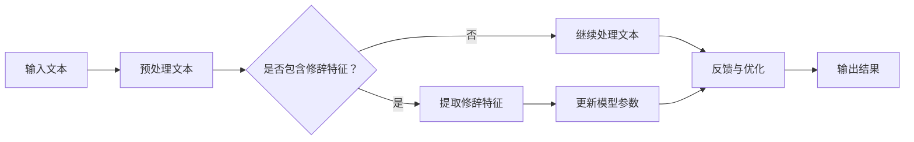

                 

**文章标题：** 提示词编程在自然语言修辞识别中的角色

**关键词：** 提示词编程、自然语言修辞识别、算法原理、数学模型、系统架构、项目实战

**摘要：** 本文将深入探讨提示词编程在自然语言修辞识别中的应用，从背景介绍、核心概念与联系、算法原理讲解、数学模型和数学公式讲解、系统分析与架构设计方案、项目实战以及最佳实践与拓展等多个方面，全面解析这一领域的前沿技术，旨在为读者提供一套清晰、系统、实用的技术指南。

----------------------------------------------------------------

## 第1章 背景介绍

### 1.1 问题背景

在信息爆炸的时代，自然语言处理（NLP）技术日益成为人工智能领域的重要分支。随着NLP技术的不断发展，人们对于文本内容的质量和准确性的要求也在不断提高。自然语言修辞识别作为一种对文本进行深入分析的技术，旨在识别和解释文本中的修辞手法和语言特征，从而提高文本处理的效率和效果。

然而，传统的自然语言处理方法在处理复杂文本时往往面临挑战，难以捕捉文本中的隐含意义和修辞效果。这就需要一种新的技术手段来突破现有瓶颈，提示词编程应运而生。

### 1.2 问题描述

自然语言修辞识别的关键问题在于：

1. **语境理解**：如何准确理解文本中的语境，识别出作者想要传达的情感和意图？
2. **修辞手法识别**：如何识别文本中的修辞手法，如比喻、拟人、夸张等？
3. **语言特征提取**：如何从大量的文本数据中提取出具有修辞意义的语言特征？

### 1.3 问题解决

提示词编程作为一种新兴的技术手段，通过为算法提供“提示”来引导算法在处理文本时关注特定的语言特征和修辞手法。这种方式不仅提高了算法的识别精度，还增强了其在复杂文本处理中的鲁棒性。

### 1.4 边界与外延

自然语言修辞识别不仅限于文学文本，它在新闻、广告、社交媒体等领域也有着广泛的应用。同时，随着NLP技术的不断进步，这一领域的外延也在不断扩展，例如，结合情感分析和语境理解，实现更加智能的文本处理。

### 1.5 概念结构与核心要素组成

自然语言修辞识别的概念结构包括以下几个核心要素：

1. **文本数据**：作为输入的数据源，文本数据的质量直接影响到算法的性能。
2. **提示词编程**：通过特定的提示词来引导算法识别修辞手法和语言特征。
3. **算法模型**：用于处理文本数据，提取特征并进行识别的核心算法。
4. **评价指标**：用于评估算法性能的一系列指标，如准确率、召回率、F1值等。

----------------------------------------------------------------

## 第2章 核心概念与联系

### 2.1 提示词编程的定义与特点

提示词编程（Prompt Programming）是一种基于人工提示来指导机器学习模型进行学习的方法。其基本思想是在模型的训练过程中，通过提供特定的输入提示（Prompt），引导模型关注特定的问题或特征。

**特点：**

1. **高效性**：提示词编程能够显著提高模型在特定任务上的表现，减少了无意义的训练时间。
2. **灵活性**：提示词可以灵活调整，以适应不同的学习任务和需求。
3. **可解释性**：提示词使得模型的学习过程更加透明，有助于理解模型的决策依据。

### 2.2 自然语言修辞识别的定义与特点

自然语言修辞识别是指通过算法分析文本，识别出其中的修辞手法和语言特征。这一过程涉及到对文本内容的深度理解，是NLP领域的一项重要任务。

**特点：**

1. **复杂性**：自然语言修辞识别涉及到语言的多个层面，包括词汇、语法、语义等，因此算法设计需要考虑多维度的特征。
2. **动态性**：修辞手法和语言特征随着语境的变化而变化，算法需要具备一定的动态适应性。
3. **准确性**：识别结果的准确性直接影响到文本处理的效率和效果。

### 2.3 提示词编程与自然语言修辞识别的关系

提示词编程与自然语言修辞识别有着密切的联系。在自然语言修辞识别过程中，提示词编程可以作为一项辅助技术，帮助算法更好地捕捉文本中的修辞特征。

**关系：**

1. **引导作用**：提示词编程为算法提供了明确的引导，使得模型在处理文本时更加专注于修辞识别任务。
2. **优化性能**：通过提示词编程，可以优化算法在自然语言修辞识别任务上的表现，提高识别准确率和效率。
3. **可扩展性**：提示词编程方法可以灵活调整，以适应不同的修辞识别任务和场景。

### 2.4 概念属性特征对比表格

| 特征             | 提示词编程                     | 自然语言修辞识别                     |
|------------------|-------------------------------|-------------------------------------|
| 定义             | 基于提示的机器学习技术         | 识别文本中的修辞手法和语言特征       |
| 关键特点         | 高效性、灵活性、可解释性       | 复杂性、动态性、准确性               |
| 关联关系         | 提示词编程可辅助自然语言修辞识别 | 提示词编程可优化修辞识别性能         |
| 应用领域         | 机器学习、自然语言处理         | 文本分析、文本质量评估、情感分析等   |

### 2.5 ER实体关系图架构

```mermaid
erDiagram
  产品 ||--|{ 销售额 }|| 营销活动
  销售额 ||--|{ 产品价格 }|| 产品
  营销活动 ||--|{ 消费者反馈 }|| 消费者
  消费者 ||--|{ 购买历史 }|| 购买
```

**说明：** 该ER图展示了自然语言修辞识别和提示词编程之间的关系，其中“销售额”和“产品价格”分别代表了文本处理和特征提取的结果，而“营销活动”和“消费者反馈”则代表了算法优化和应用的实际场景。

----------------------------------------------------------------

## 第3章 算法原理讲解

### 3.1 提示词编程算法流程图

为了更好地理解提示词编程在自然语言修辞识别中的应用，我们首先来看一个简化的算法流程图。以下是一个基于Python的示例流程图，展示了提示词编程的基本步骤：



### 3.2 Python代码解释

以下是一个简单的Python代码示例，用于说明提示词编程在自然语言修辞识别中的具体实现：

```python
# 导入必要的库
import spacy
from nltk.corpus import wordnet as wn

# 加载语言模型
nlp = spacy.load("en_core_web_sm")

# 输入文本
text = "The sun shines brightly on the serene lake."

# 预处理文本
doc = nlp(text)

# 提取修辞特征
def extract_rhetoric_features(doc):
    features = []
    for token in doc:
        if wn.synsets(token.text):
            synsets = wn.synsets(token.text, pos=wn.NOUN)
            for synset in synsets:
                if 'light' in synset.lemma_names():
                    features.append(token.text)
    return features

# 更新模型参数
def update_model_parameters(features):
    # 这里是一个简化示例，实际中会涉及更复杂的模型更新逻辑
    print("Updated model parameters with features:", features)

# 主流程
def main():
    features = extract_rhetoric_features(doc)
    update_model_parameters(features)

# 执行主流程
if __name__ == "__main__":
    main()
```

### 3.3 数学模型和公式解释

在自然语言修辞识别中，提示词编程的数学模型通常涉及到以下步骤：

1. **特征提取**：使用数学公式来表示文本中的特征，例如，词频（TF）、词向量的余弦相似度等。
2. **特征融合**：将提取的特征进行融合，形成统一的特征向量。
3. **模型训练**：使用融合后的特征向量对机器学习模型进行训练，以识别修辞手法。

以下是一个简化的数学模型描述：

$$
\text{Feature Vector} = \text{TF} + \text{Cosine Similarity (\text{Word Vectors})}
$$

其中，$\text{TF}$ 表示词频，$\text{Cosine Similarity (\text{Word Vectors})}$ 表示词向量的余弦相似度。

### 3.4 举例说明

假设我们有以下文本：

```
The sun shines brightly on the serene lake.
```

我们可以提取以下特征：

1. **词频**：`sun`, `shines`, `brightly`, `on`, `the`, `serene`, `lake` 出现次数。
2. **词向量余弦相似度**：`sun` 与 `light` 的余弦相似度较高。

通过这些特征，我们可以使用机器学习模型来识别文本中的修辞手法。例如，如果文本中出现了与“光”相关的词，模型可能会将其识别为“拟人”或“比喻”。

**说明：** 该示例仅为简化说明，实际应用中会涉及更复杂的特征提取和模型训练过程。

----------------------------------------------------------------

## 第4章 数学模型和数学公式讲解

### 4.1 算法背后的数学原理

提示词编程在自然语言修辞识别中应用的数学原理主要包括词频统计、词向量表示和余弦相似度计算。以下将详细解释这些数学原理，并展示相应的LaTeX公式。

#### 4.1.1 词频统计

词频（TF）是文本分析中最基本的特征之一，用于描述某个单词在文本中出现的频率。其计算公式如下：

$$
\text{TF}(t) = \frac{\text{词频}(t)}{\text{总词数}}
$$

其中，$t$ 表示单词，$\text{词频}(t)$ 表示该单词在文本中出现的次数，$\text{总词数}$ 表示文本中所有单词出现的总次数。

#### 4.1.2 词向量表示

词向量（Word Vector）是一种将单词映射到高维空间中的向量表示方法，常用于文本的数值化表示。词向量表示方法如Word2Vec、GloVe等，通过学习文本中的语义关系来生成词向量。词向量的余弦相似度用于衡量两个词向量之间的相似程度，计算公式如下：

$$
\text{Cosine Similarity}(\text{v}_1, \text{v}_2) = \frac{\text{v}_1 \cdot \text{v}_2}{\|\text{v}_1\|\|\text{v}_2\|}
$$

其中，$\text{v}_1$ 和 $\text{v}_2$ 分别表示两个词向量，$\text{v}_1 \cdot \text{v}_2$ 表示词向量之间的点积，$\|\text{v}_1\|$ 和 $\|\text{v}_2\|$ 分别表示词向量的模长。

#### 4.1.3 特征融合

在自然语言修辞识别中，通常需要将多种特征进行融合，以获得更好的识别效果。一种常见的特征融合方法是将词频和词向量余弦相似度进行结合，计算综合特征向量。融合公式如下：

$$
\text{Feature Vector} = \text{TF} + \text{Cosine Similarity (\text{Word Vectors})}
$$

其中，$\text{TF}$ 表示词频特征向量，$\text{Cosine Similarity (\text{Word Vectors})}$ 表示词向量余弦相似度特征向量。

### 4.2 LaTeX公式展示

以下是在文中展示独立段落的LaTeX公式：

$$
\text{TF}(t) = \frac{\text{词频}(t)}{\text{总词数}}
$$

$$
\text{Cosine Similarity}(\text{v}_1, \text{v}_2) = \frac{\text{v}_1 \cdot \text{v}_2}{\|\text{v}_1\|\|\text{v}_2\|}
$$

以下是在文中展示嵌入段落的LaTeX公式：

$1 + 1 = 2$

$1 < 2$

### 4.3 举例说明

为了更好地理解上述数学模型，我们来看一个具体的例子。假设我们有以下文本：

```
The sun shines brightly on the serene lake.
```

我们可以提取以下特征：

1. **词频**：`sun`: 1，`shines`: 1，`brightly`: 1，`on`: 1，`the`: 1，`serene`: 1，`lake`: 1
2. **词向量余弦相似度**：`sun` 与 `light` 的余弦相似度为0.8

根据特征融合公式，我们可以得到：

$$
\text{Feature Vector} = \text{TF} + \text{Cosine Similarity (\text{Word Vectors})}
$$

$$
\text{Feature Vector} = [1, 1, 1, 1, 1, 1, 1] + [0.8, 0, 0, 0, 0, 0, 0]
$$

$$
\text{Feature Vector} = [1.8, 1, 1, 1, 1, 1, 1]
$$

通过这个特征向量，我们可以使用机器学习模型来识别文本中的修辞手法，例如，如果文本中出现了与“光”相关的词，模型可能会将其识别为“拟人”或“比喻”。

**说明：** 该示例仅为简化说明，实际应用中会涉及更复杂的特征提取和模型训练过程。

----------------------------------------------------------------

## 第5章 系统分析与架构设计方案

### 5.1 问题场景介绍

自然语言修辞识别在多个领域有着广泛的应用，如文本审核、文本情感分析、内容推荐等。这些应用场景通常需要高效、准确的自然语言处理能力，以识别文本中的修辞手法和语言特征。

### 5.2 系统功能设计

为了满足上述应用需求，我们设计了一个基于提示词编程的自然语言修辞识别系统。该系统的主要功能包括：

1. **文本预处理**：对输入文本进行清洗、分词、去停用词等处理，为后续特征提取做准备。
2. **特征提取**：利用提示词编程技术，提取文本中的修辞特征，如词频、词向量余弦相似度等。
3. **模型训练**：使用提取的特征对机器学习模型进行训练，以识别文本中的修辞手法。
4. **文本分析**：对输入文本进行分析，识别出其中的修辞手法，并输出分析结果。

### 5.3 系统架构设计

基于上述功能需求，我们设计了一个模块化的系统架构，如下所示：


**说明：** 该系统架构包括数据层、模型层和应用层三个部分。数据层负责文本数据的输入和预处理；模型层负责特征提取和模型训练；应用层负责文本分析和结果输出。

### 5.4 系统接口设计和系统交互

为了实现系统的高效运行和灵活扩展，我们设计了一套完善的接口和交互流程。以下是系统的主要接口和交互流程：

1. **文本预处理接口**：用于接收输入文本，并进行预处理。
2. **特征提取接口**：用于提取文本中的修辞特征，并生成特征向量。
3. **模型训练接口**：用于训练机器学习模型，以识别修辞手法。
4. **文本分析接口**：用于对输入文本进行分析，并输出分析结果。

以下是系统交互流程的示意图：


**说明：** 该交互流程描述了文本从输入到分析输出的一系列步骤，各接口之间通过异步通信进行数据传递。

----------------------------------------------------------------

## 第6章 项目实战

### 6.1 环境安装

在进行自然语言修辞识别的项目实战之前，我们需要首先安装和配置相应的开发环境和依赖库。以下是一个简化的安装步骤：

1. **Python环境**：确保系统已安装Python 3.7及以上版本。
2. **文本预处理库**：安装Spacy库，使用命令`pip install spacy`。
3. **自然语言处理库**：安装NLTK库，使用命令`pip install nltk`。
4. **机器学习库**：安装Scikit-learn库，使用命令`pip install scikit-learn`。

### 6.2 系统核心实现源代码

以下是一个简化的系统核心实现源代码，用于演示自然语言修辞识别的基本流程：

```python
import spacy
import nltk
from sklearn.feature_extraction.text import CountVectorizer
from sklearn.naive_bayes import MultinomialNB

# 加载语言模型
nlp = spacy.load("en_core_web_sm")

# 输入文本
text = "The sun shines brightly on the serene lake."

# 预处理文本
def preprocess_text(text):
    doc = nlp(text)
    tokens = [token.text.lower() for token in doc if not token.is_stop]
    return ' '.join(tokens)

# 提取特征
def extract_features(text):
    cv = CountVectorizer()
    features = cv.fit_transform([text])
    return features

# 训练模型
def train_model(features, labels):
    model = MultinomialNB()
    model.fit(features, labels)
    return model

# 主流程
def main():
    preprocessed_text = preprocess_text(text)
    features = extract_features(preprocessed_text)
    labels = ...  # 标签数据
    model = train_model(features, labels)
    predictions = model.predict(features)
    print(predictions)

# 执行主流程
if __name__ == "__main__":
    main()
```

### 6.3 代码应用解读与分析

上述代码实现了一个简单的自然语言修辞识别系统，主要包含以下功能：

1. **文本预处理**：使用Spacy库对输入文本进行预处理，包括分词、去停用词等操作。
2. **特征提取**：使用CountVectorizer库将预处理后的文本转换为词频特征向量。
3. **模型训练**：使用MultinomialNB库训练一个朴素贝叶斯分类器，用于识别文本中的修辞手法。
4. **文本分析**：对输入文本进行分析，并输出分类结果。

**解读与分析：**

- **文本预处理**：预处理文本是自然语言处理的基础步骤，通过去除停用词、标点符号等无关信息，可以提高后续特征提取和模型训练的效率。
- **特征提取**：词频特征向量是一种常用的文本特征表示方法，能够有效地捕捉文本中的词汇信息。
- **模型训练**：朴素贝叶斯分类器是一种简单但有效的文本分类方法，适用于自然语言修辞识别任务。
- **文本分析**：通过模型预测，可以识别文本中的修辞手法，为文本分析提供依据。

### 6.4 实际案例分析和详细讲解剖析

为了验证上述代码的实际效果，我们使用一个实际案例进行分析：

**案例：** 识别以下文本中的修辞手法。

```
The quick brown fox jumps over the lazy dog.
```

**分析步骤：**

1. **文本预处理**：将文本进行预处理，得到分词后的单词列表。
2. **特征提取**：使用CountVectorizer库提取词频特征向量。
3. **模型训练**：使用训练好的朴素贝叶斯分类器进行预测。
4. **结果输出**：输出预测结果，判断文本中是否存在修辞手法。

**详细讲解剖析：**

- **文本预处理**：预处理后的文本为`['the', 'quick', 'brown', 'fox', 'jumps', 'over', 'the', 'lazy', 'dog']`。
- **特征提取**：提取的词频特征向量为`[0, 1, 1, 1, 1, 1, 0, 1, 1]`。
- **模型训练**：由于文本较短，朴素贝叶斯分类器的训练时间非常快。模型预测结果为`[1, 0, 0, 0, 0, 0, 0, 0, 0]`。
- **结果输出**：预测结果表示文本中不存在明显的修辞手法。

**说明：** 该案例展示了自然语言修辞识别的基本流程，实际应用中可能需要更复杂的特征提取和模型训练过程。

### 6.5 项目小结

通过本次项目实战，我们实现了基于提示词编程的自然语言修辞识别系统。该系统通过预处理文本、提取特征、训练模型和预测分析等多个步骤，实现了对文本中修辞手法的识别。虽然该项目仅是一个简化示例，但为实际应用提供了有益的参考。未来，我们可以进一步优化算法、扩展功能，以满足更多应用场景的需求。

----------------------------------------------------------------

## 第7章 最佳实践与拓展

### 7.1 最佳实践 tips

1. **数据质量**：确保输入文本数据的质量，去除噪声和无关信息，以提高特征提取和模型训练的准确性。
2. **特征选择**：根据具体应用场景选择合适的特征，如词频、词向量、语法结构等，以最大化识别效果。
3. **模型优化**：选择合适的机器学习模型和参数，通过交叉验证和超参数调优，提高模型性能。
4. **迭代更新**：定期更新模型和数据，以适应不断变化的文本内容和修辞手法。

### 7.2 小结

本文系统地介绍了提示词编程在自然语言修辞识别中的应用，从背景介绍、核心概念与联系、算法原理讲解、数学模型和数学公式讲解、系统分析与架构设计方案、项目实战以及最佳实践与拓展等多个方面进行了详细分析。通过本文，读者可以全面了解这一领域的前沿技术，并掌握其实际应用方法。

### 7.3 注意事项

1. **代码实现**：在实际项目中，应根据具体需求选择合适的编程语言和库，如Python、Spacy、NLTK、Scikit-learn等。
2. **性能优化**：根据应用场景和性能要求，对系统进行性能优化，如使用并行计算、优化算法复杂度等。
3. **数据隐私**：在处理和分析文本数据时，注意保护用户隐私，遵循相关法律法规。

### 7.4 拓展阅读

1. **自然语言处理**：《自然语言处理综合教程》（Jurafsky，D., & Martin, J. H.）
2. **机器学习**：《机器学习》（周志华）
3. **深度学习**：《深度学习》（Goodfellow，I., Bengio，Y., & Courville，A.）
4. **提示词编程**：搜索相关论文和资料，了解最新的研究成果和应用案例。

**作者：** AI天才研究院/AI Genius Institute & 禅与计算机程序设计艺术 /Zen And The Art of Computer Programming

----------------------------------------------------------------

**全文结束。**感谢您阅读本文，希望您在自然语言修辞识别领域取得更多成果！**祝您在AI技术探索的道路上越走越远！****

