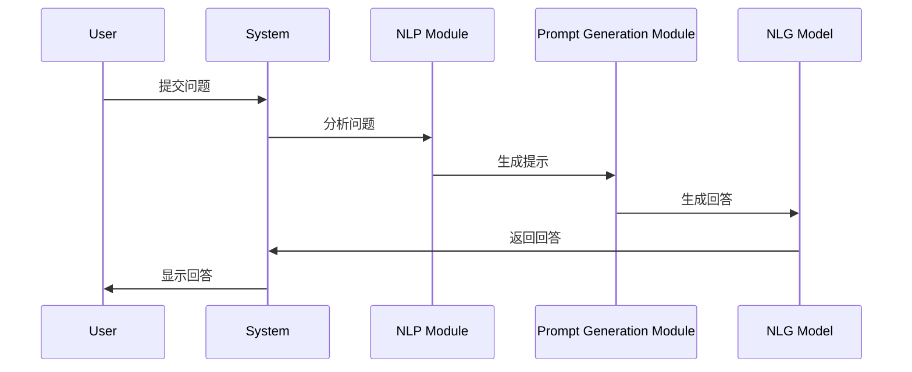
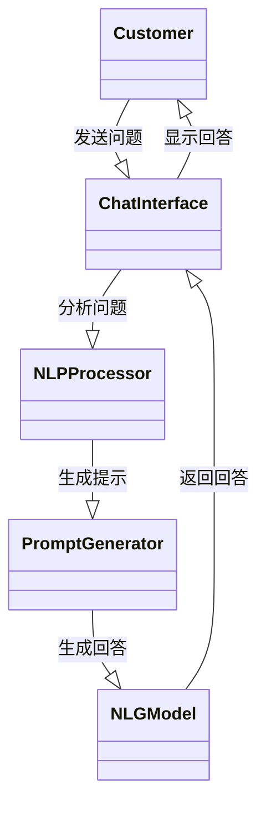
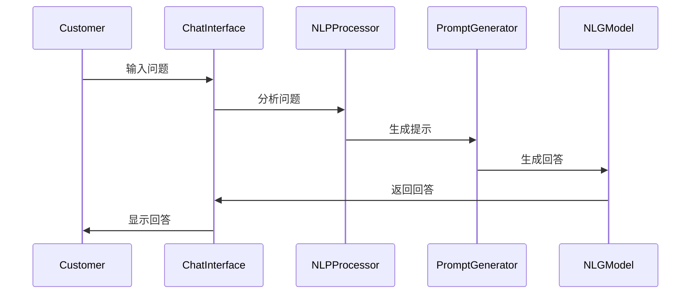

                 

## 提示词编程在自然语言生成中的突破

### 关键词：
- 提示词编程
- 自然语言生成（NLG）
- 语言模型
- 生成式与解析式算法
- 应用案例分析

### 摘要：
本篇文章将深入探讨提示词编程在自然语言生成（NLG）领域的突破性进展。通过回顾NLG的发展历史，介绍提示词编程的基本概念，我们将逐步分析提示词编程与NLG之间的密切联系，并探讨其在NLG中的核心作用。文章还将涵盖NLG的基础、提示词编程技术、应用案例以及前沿探索，为读者提供一个全面而详尽的技术解读。

## 目录

### 第一部分：引言

1.1 背景介绍
1.2 核心概念与联系
1.3 目标与读者
1.4 本章小结

### 第二部分：自然语言生成基础

2.1 自然语言处理（NLP）基础
2.2 生成式与解析式NLG
2.3 提示词编程在NLG中的应用
2.4 本章小结

### 第三部分：提示词编程技术

3.1 提示词编程技术概述
3.2 提示词编程基础
3.3 提示词编程高级技术
3.4 提示词编程工具与平台
3.5 本章小结

### 第四部分：自然语言生成应用案例

4.1 文本生成应用
4.2 对话生成应用
4.3 语音生成应用
4.4 多媒体生成应用
4.5 本章小结

### 第五部分：前沿探索

5.1 提示词编程新趋势
5.2 跨模态生成与提示词编程
5.3 社会与文化影响
5.4 未来展望
5.5 本章小结

### 第六部分：项目

## 第一部分：引言

### 1.1 背景介绍

自然语言生成（Natural Language Generation，NLG）是自然语言处理（Natural Language Processing，NLP）的一个重要分支，旨在利用计算机技术生成具有自然语言特性的文本。NLG的应用场景广泛，包括但不限于文本摘要、对话系统、自动报告生成、新闻报道、客服机器人等领域。

NLG的发展历史可以追溯到20世纪50年代。当时，研究人员开始探索如何使用计算机程序生成自然语言文本。早期的NLG系统主要依赖于规则驱动的方法，通过定义一系列语法规则和词汇表来实现文本生成。这种方法在处理简单的文本任务时表现良好，但随着应用需求的增加，这种方法的局限性也逐渐显现出来。

20世纪80年代，随着统计学习方法的兴起，基于统计的NLG系统开始出现。这些系统使用大规模语料库来学习语言模型，从而生成更自然、更灵活的文本。然而，这些系统在处理复杂任务时仍面临挑战，如句法分析、语义理解和上下文感知等。

近年来，深度学习技术的迅猛发展给NLG带来了新的突破。基于神经网络的生成模型，如序列到序列（Seq2Seq）模型和变换器（Transformer）模型，在生成高质量文本方面取得了显著成果。这些模型通过学习大量数据，能够自动捕捉语言的复杂结构和上下文关系，从而实现更加自然和流畅的文本生成。

### 1.1.1 自然语言生成（NLG）的发展历史

自然语言生成（NLG）的历史可以追溯到20世纪50年代，当时计算机科学家和语言学家开始探索如何让计算机生成具有自然语言特性的文本。最早的NLG系统主要是基于规则的，它们依赖于预定义的语法规则和词汇表来生成文本。这种规则驱动的NLG方法在处理简单的文本任务时表现良好，例如生成简单的陈述句或者完成简单的填空题。

随着计算机技术的发展和计算能力的提升，研究人员开始探索更复杂的文本生成方法。20世纪60年代，统计方法开始被引入到NLG领域。统计方法通过分析大量文本数据来学习语言模型，从而能够生成更自然、更灵活的文本。这种基于统计的NLG系统在一定程度上提高了文本生成的质量，但它们在处理复杂任务时仍然存在局限，如句法分析、语义理解和上下文感知等。

20世纪80年代，随着计算机科学的进步和机器学习技术的崛起，基于机器学习的NLG系统开始出现。这些系统使用统计学习算法来从大规模语料库中学习语言模型，从而生成高质量的文本。机器学习方法的引入使得NLG系统在处理复杂任务时取得了显著的进展，但仍然面临一些挑战，如对上下文的理解和生成的连贯性等。

进入21世纪，随着深度学习技术的快速发展，NLG领域迎来了新的突破。深度学习模型，如序列到序列（Seq2Seq）模型和变换器（Transformer）模型，在生成高质量文本方面表现出色。这些模型通过学习大量数据，能够自动捕捉语言的复杂结构和上下文关系，从而实现更加自然和流畅的文本生成。深度学习模型的引入使得NLG系统在处理复杂任务时变得更加高效和准确。

总的来说，NLG的发展历程从最初的规则驱动方法到基于统计的方法，再到基于机器学习和深度学习的方法，反映了计算机科学和人工智能技术在文本生成领域的不断进步。未来，随着技术的进一步发展，NLG系统有望在生成更自然、更个性化的文本方面取得更大的突破。

### 1.1.2 提示词编程的基本概念

提示词编程（Prompt Programming）是一种结合了提示（Prompt）和编程（Programming）的技术，旨在通过给模型提供特定的输入提示，来引导模型的生成过程，从而生成更加符合预期和高质量的文本。在自然语言生成（NLG）领域，提示词编程起到了至关重要的作用。

提示词编程的核心在于“提示”的概念。提示是一个引导模型生成文本的关键输入，它可以是一个短语、一句话或者一段话，通常包含用户的需求和意图。通过设计合适的提示，可以引导模型更好地理解用户的需求，从而生成更准确、更自然的文本。

在自然语言生成中，提示词编程的作用主要体现在以下几个方面：

1. **引导模型生成**：通过提供特定的提示，可以引导模型按照特定的方向生成文本，从而避免生成不相关或不准确的文本。例如，在生成新闻报道时，可以通过提示来指定报道的主题、时间和地点，从而生成与这些提示相关的新闻报道。

2. **提高生成质量**：合适的提示可以帮助模型更好地理解上下文和用户意图，从而提高生成的文本质量。例如，在生成对话系统中的回复时，通过提供上下文的提示，可以使模型生成的回复更加符合用户的期望和需求。

3. **增强生成多样性**：通过提供不同的提示，可以引导模型生成多样化的文本。例如，在生成创意文案时，可以通过不同的提示来引导模型生成不同风格、不同主题的文案，从而提高文案的创意性和多样性。

4. **优化模型训练**：在模型训练过程中，合适的提示可以提供更有针对性的训练数据，从而帮助模型更好地学习语言模式和生成规则。例如，在训练文本生成模型时，可以通过提示来指定训练数据的主题和类型，从而提高模型的泛化能力和生成质量。

总的来说，提示词编程在自然语言生成中的重要性不可忽视。通过设计合适的提示，可以引导模型更好地理解和生成文本，从而实现更高效、更准确的文本生成。

### 1.1.3 提示词编程在NLG中的重要性

提示词编程在自然语言生成（NLG）中的重要性体现在其能够显著提高文本生成的准确性和多样性，从而满足用户多样化的需求。以下是提示词编程在NLG中的几个关键作用：

1. **增强上下文理解**：合适的提示词可以帮助模型更好地捕捉和理解上下文信息，从而生成更符合实际场景的文本。例如，在生成新闻报道时，通过提供具体的新闻事件、时间和地点等提示，可以使模型生成的文本更加精准和贴切。

2. **提升生成质量**：提示词编程通过提供明确的输入提示，能够引导模型按照用户的意图生成高质量的文本。例如，在生成对话系统的回复时，通过提供上下文提示，可以使模型生成的回复更加连贯、自然，从而提高用户体验。

3. **增加生成多样性**：提示词编程可以通过提供不同的提示来引导模型生成多样化的文本。例如，在生成广告文案时，通过不同的提示来引导模型生成不同风格、不同主题的文案，从而提高文案的创意性和吸引力。

4. **优化模型训练**：在模型训练过程中，合适的提示词可以提供更有针对性的训练数据，帮助模型更好地学习语言模式和生成规则。例如，通过指定不同的提示来训练文本生成模型，可以使其在处理多种类型文本时表现出更高的泛化能力。

5. **应对复杂任务**：在处理复杂任务时，提示词编程能够通过提供明确的引导，帮助模型更好地应对挑战。例如，在生成技术文档时，通过提供具体的主题和技术术语提示，可以使模型生成的文档更加专业和准确。

总之，提示词编程在自然语言生成中的应用，不仅能够提高生成的文本质量，还能够应对复杂任务，满足用户多样化的需求。随着技术的不断进步，提示词编程将在NLG领域发挥越来越重要的作用。

### 1.2 核心概念与联系

在探讨自然语言生成（NLG）和提示词编程（Prompt Programming）之间的密切联系之前，我们需要明确一些核心概念。

#### 1.2.1 自然语言处理（NLP）与NLG的关系

自然语言处理（NLP）是NLG的基础，它涵盖了从文本中提取信息、理解和生成文本的一系列技术。NLP主要包括以下几个关键组成部分：

1. **文本预处理**：包括分词、去除停用词、词性标注等，为后续的文本分析和处理做好准备。
2. **语言模型**：通过学习大量文本数据，语言模型能够预测文本的下一个词或句子，从而生成流畅的文本。
3. **语义理解**：通过理解文本中的语义信息，NLP系统能够处理复杂的文本任务，如问答系统、情感分析等。
4. **实体识别和关系抽取**：NLP系统可以识别文本中的关键实体（如人名、地名、组织等）及其之间的关系。

NLG作为NLP的一个子领域，旨在利用这些基础技术生成具有自然语言特性的文本。NLG的核心是生成器（Generator），它将输入信息转换成自然语言形式。生成器通常基于语言模型、语义理解和文本生成算法。

#### 1.2.2 NLG中的常见算法

NLG中的常见算法可以分为生成式和解析式两种：

1. **生成式算法**：生成式算法直接从输入数据生成文本。它们通常基于序列到序列（Seq2Seq）模型或变换器（Transformer）模型，通过学习输入序列和输出序列之间的映射关系来生成文本。生成式算法的优点是生成的文本通常更加自然和流畅，但可能存在生成质量不稳定和生成的文本过于冗长等问题。

2. **解析式算法**：解析式算法首先将输入文本解析成结构化的数据（如树或图），然后根据这些结构化数据生成文本。这种方法通常依赖于语法规则、模板和填充技术。解析式算法的优点是生成过程更加可控和高效，但生成的文本可能不够自然和灵活。

#### 1.2.3 提示词编程的核心要素

提示词编程的核心要素包括：

1. **提示（Prompt）**：提示是一个引导模型生成文本的关键输入。它通常包含用户的需求和意图，用于引导模型生成更符合预期的文本。提示可以是短语、句子或段落，其设计至关重要。

2. **模型选择**：不同的自然语言生成模型适用于不同的场景和任务。选择合适的模型能够提高生成文本的质量和效率。

3. **上下文管理**：在生成过程中，模型需要处理大量的上下文信息。有效的上下文管理能够帮助模型更好地理解用户的需求，从而生成更准确的文本。

4. **反馈机制**：通过用户的反馈，可以不断优化提示和生成过程，提高文本生成的质量和用户满意度。

#### 1.2.4 提示词编程与NLG的关系

提示词编程与NLG之间存在紧密的联系。提示词编程通过提供明确的提示，引导NLG模型生成更符合用户需求和上下文的文本。具体来说，提示词编程在NLG中的作用主要体现在以下几个方面：

1. **引导生成方向**：通过提供具体的提示，可以引导模型按照特定的方向生成文本，从而避免生成不相关或不准确的文本。

2. **提高生成质量**：合适的提示可以帮助模型更好地理解上下文和用户意图，从而生成更准确、更自然的文本。

3. **增强生成多样性**：通过提供不同的提示，可以引导模型生成多样化的文本，满足用户多样化的需求。

4. **优化模型训练**：在模型训练过程中，合适的提示可以提供更有针对性的训练数据，帮助模型更好地学习语言模式和生成规则。

5. **应对复杂任务**：在处理复杂任务时，提示词编程能够通过提供明确的引导，帮助模型更好地应对挑战。

总之，提示词编程是NLG中的一个重要技术，它通过提供明确的提示，引导模型生成更高质量、更符合用户需求的文本，从而在NLG领域中发挥了关键作用。

### 1.3 目标与读者

#### 1.3.1 本书的目标

本书旨在深入探讨提示词编程在自然语言生成（NLG）中的应用，为读者提供一个全面而系统的技术解读。具体目标如下：

1. **介绍NLG的基础知识**：通过回顾NLG的发展历史，介绍NLG的基本概念、常见算法和关键技术，帮助读者建立对NLG的全面理解。
2. **解析提示词编程原理**：详细解释提示词编程的基本概念、核心要素和作用，帮助读者理解提示词编程在NLG中的应用原理。
3. **探讨提示词编程技术**：介绍提示词编程的基础技术、高级技术和工具平台，帮助读者掌握提示词编程的核心技术和实践方法。
4. **分析应用案例**：通过具体的文本生成、对话生成、语音生成和多媒体生成应用案例，展示提示词编程在实际场景中的应用效果和优势。
5. **展望未来趋势**：探讨提示词编程的新趋势、跨模态生成和提示词编程在低资源环境中的应用，为读者提供未来发展的方向和启示。

#### 1.3.2 适合读者群体

本书适合以下读者群体：

1. **自然语言处理（NLP）爱好者**：对NLP和NLG领域感兴趣的读者，希望通过本书深入了解提示词编程在NLG中的应用。
2. **计算机科学家和工程师**：在NLP和NLG领域工作的计算机科学家和工程师，希望掌握提示词编程技术，提升文本生成系统的质量和效率。
3. **研究人员和学者**：对提示词编程和NLG领域有深入研究的研究人员和学者，希望通过本书获得更多的实践经验和前沿知识。
4. **学生和教育工作者**：在自然语言处理、计算机科学等相关领域学习或教学的学生和教育工作者，希望借助本书为教学和研究提供参考。

#### 1.3.3 学习资源与支持

为了更好地帮助读者理解和应用提示词编程技术，本书提供了以下学习资源与支持：

1. **在线代码示例**：本书中的每个章节都提供了相应的代码示例，帮助读者更好地理解技术原理和实践方法。
2. **数据集和工具平台**：本书推荐了一些常用的数据集和工具平台，供读者下载和使用。
3. **参考文献和拓展阅读**：本书列出了大量的参考文献和拓展阅读，帮助读者进一步深入研究和学习。
4. **讨论社区**：本书提供了一个讨论社区，读者可以在这里交流学习心得、提问和分享经验。

通过这些学习资源与支持，读者可以更好地掌握提示词编程技术，并将其应用于实际的文本生成任务中。

### 1.4 本章小结

本章作为引言部分，首先回顾了自然语言生成（NLG）的发展历史，介绍了NLG的基本概念和提示词编程的基本概念。随后，分析了提示词编程在NLG中的重要性，并明确了提示词编程与NLG之间的密切联系。此外，本章还介绍了本书的目标、适合读者群体以及学习资源与支持。

通过本章的学习，读者可以对自然语言生成和提示词编程有一个初步的了解，为后续章节的深入学习打下基础。接下来，我们将进一步探讨自然语言生成的基础知识，包括自然语言处理（NLP）基础、生成式与解析式NLG以及提示词编程在NLG中的应用。

## 第二部分：自然语言生成基础

在深入探讨提示词编程在自然语言生成（NLG）中的应用之前，我们需要对自然语言生成的基础知识有一个全面的了解。本部分将分为以下几个小节，依次介绍自然语言处理（NLP）基础、生成式与解析式NLG，以及提示词编程在NLG中的应用。

### 2.1 自然语言处理（NLP）基础

自然语言处理（NLP）是自然语言生成（NLG）的基础，它涉及从文本中提取信息、理解和生成文本的一系列技术。以下是一些关键概念和技术：

#### 2.1.1 语言模型的基本原理

语言模型是NLP的核心组成部分，它旨在通过学习大量文本数据来捕捉自然语言的统计特性。语言模型的基本原理包括：

1. **概率模型**：语言模型通常是一个概率模型，用于预测文本的下一个词或句子。常见的概率模型包括N元语法（N-gram）和隐马尔可夫模型（HMM）。

2. **神经网络模型**：随着深度学习的发展，神经网络模型（如循环神经网络RNN、长短期记忆LSTM和变换器Transformer）在语言模型中得到了广泛应用。这些模型能够通过学习大量文本数据，捕捉更复杂的语言模式。

3. **词汇表示**：语言模型需要对词汇进行编码，常见的词汇表示方法包括词袋模型（Bag of Words，BoW）和词嵌入（Word Embedding）。词嵌入通过将词汇映射到高维向量空间，能够更好地捕捉词汇之间的关系。

#### 2.1.2 词向量表示

词向量表示是将词汇映射到高维向量空间的一种方法，能够有效地捕捉词汇的语义信息。以下是一些常见的词向量表示方法：

1. **词袋模型**：词袋模型通过计算每个词在文本中出现的频率来表示文本，但它无法捕捉词汇之间的语义关系。

2. **词嵌入**：词嵌入通过将词汇映射到高维向量空间，能够更好地捕捉词汇的语义信息。常见的词嵌入方法包括Word2Vec、GloVe和FastText等。这些方法通过训练大规模语料库来学习词汇的表示。

3. **上下文向量**：上下文向量通过考虑词汇在句子中的上下文信息来表示词汇，能够捕捉词汇在不同上下文中的语义差异。常见的上下文向量方法包括基于RNN和Transformer的模型。

#### 2.1.3 语言模型在NLG中的应用

语言模型在自然语言生成（NLG）中发挥着至关重要的作用。以下是一些典型的应用场景：

1. **文本生成**：语言模型可以通过生成下一个词或句子来生成完整的文本。常见的文本生成任务包括文本摘要、对话生成和机器翻译等。

2. **对话系统**：在对话系统中，语言模型用于生成对话的回复。通过学习大量对话数据，语言模型能够生成更加自然和连贯的对话回复。

3. **机器翻译**：在机器翻译任务中，语言模型用于预测目标语言的下一个词或句子，从而生成翻译结果。常见的机器翻译模型包括基于N元语法和神经机器翻译（NMT）模型。

4. **问答系统**：在问答系统中，语言模型通过理解用户的问题和候选答案，生成最合适的答案。语言模型在问答系统中的关键作用是提高回答的准确性和自然性。

总的来说，自然语言处理（NLP）基础是自然语言生成（NLG）的重要基石。语言模型和词向量表示方法为NLG提供了强大的技术支持，使得生成高质量的文本成为可能。接下来，我们将进一步探讨生成式与解析式NLG，以及提示词编程在NLG中的应用。

### 2.2 生成式与解析式NLG

在自然语言生成（NLG）领域，生成式和解析式方法是最常用的两种技术。这两种方法在文本生成过程中有着不同的应用和特点。

#### 2.2.1 生成式NLG

生成式NLG（Generative NLG）直接从输入数据生成文本。它通常依赖于概率模型和神经网络模型，通过学习输入序列和输出序列之间的映射关系来生成文本。生成式NLG的主要特点包括：

1. **生成过程**：生成式NLG通过预测输出序列的下一个词或句子来生成文本。常见的生成模型包括序列到序列（Seq2Seq）模型和变换器（Transformer）模型。

2. **灵活性**：生成式NLG能够生成多样化、个性化的文本，因为它不依赖于固定的模板或规则。这种灵活性使得生成式NLG在文本生成任务中具有广泛的应用。

3. **生成质量**：生成式NLG生成的文本通常更加自然和流畅，因为它能够捕捉语言的复杂结构和上下文关系。然而，生成式NLG在生成高质量文本时可能存在一定的不稳定性，有时可能生成冗长或不相关的文本。

#### 2.2.2 解析式NLG

解析式NLG（Analytic NLG）首先将输入文本解析成结构化的数据（如树或图），然后根据这些结构化数据生成文本。解析式NLG通常依赖于语法规则、模板和填充技术。其特点包括：

1. **生成过程**：解析式NLG通过解析输入文本的结构，将其转化为结构化的数据，然后根据这些结构化数据生成文本。常见的解析技术包括语法分析和语义分析。

2. **可控性**：解析式NLG生成的文本质量更加可控，因为它依赖于固定的模板和规则。这种可控性使得解析式NLG在生成文档、报告和通知等固定格式的文本时具有优势。

3. **生成效率**：解析式NLG通常比生成式NLG更高效，因为其生成过程依赖于预先定义的模板和规则。这使得解析式NLG在处理大量文本生成任务时具有更高的性能。

#### 2.2.3 两种方法的对比与结合

生成式NLG和解析式NLG各有优缺点，在实际应用中，常常将它们结合起来，发挥各自的优势。

1. **互补性**：生成式NLG能够生成多样化、个性化的文本，但可能存在生成质量不稳定的问题；而解析式NLG生成的文本质量更加可控，但灵活性较差。将这两种方法结合起来，可以充分发挥它们的互补性，提高文本生成的整体效果。

2. **混合式方法**：混合式方法将生成式和解析式方法结合起来，通过在生成过程中引入结构化的数据和模板，提高生成文本的质量和可控性。例如，在生成新闻报道时，可以先使用生成式方法生成文本的草稿，然后使用解析式方法对文本进行结构化处理，从而提高生成文本的准确性和连贯性。

3. **多模态生成**：随着技术的发展，多模态生成（Multimodal Generation）成为NLG的一个重要方向。多模态生成结合了文本生成和图像生成等不同模态的信息，通过生成统一的语义表示，提高生成文本的多样性和相关性。

总之，生成式和解析式NLG各有优劣，但在实际应用中可以通过结合使用，提高文本生成的质量和效率。随着技术的不断进步，NLG领域将继续探索新的方法和技术，以满足不断增长的应用需求。

#### 2.3 提示词编程在NLG中的应用

提示词编程（Prompt Programming）在自然语言生成（NLG）中发挥着关键作用，通过提供明确的提示，可以引导模型生成更符合用户需求和上下文的文本。以下将详细介绍提示词编程在NLG中的应用，包括其基本流程、优势以及面临的挑战。

##### 2.3.1 提示词编程的基本流程

提示词编程的基本流程可以分为以下几个步骤：

1. **需求分析**：首先，需要对用户的需求进行深入分析，明确用户希望生成的文本类型、主题和风格等。

2. **设计提示**：根据需求分析的结果，设计合适的提示。提示可以是短语、句子或段落，其设计至关重要。合适的提示能够引导模型更好地理解用户的需求，从而生成更高质量的文本。

3. **模型选择**：选择合适的自然语言生成模型。不同的模型适用于不同的场景和任务，如生成式模型和解析式模型。选择合适的模型能够提高生成文本的质量和效率。

4. **生成文本**：通过输入提示和模型生成文本。生成过程可以是一步到位的，也可以是逐步生成的，例如，分步骤生成文本摘要或对话系统的回复。

5. **反馈优化**：根据用户的反馈对生成的文本进行优化。通过反馈机制，可以不断调整提示和生成过程，提高文本生成的质量和用户满意度。

##### 2.3.2 提示词编程的优势

提示词编程在NLG中的应用具有以下几个优势：

1. **提高生成质量**：合适的提示可以帮助模型更好地理解上下文和用户意图，从而生成更准确、更自然的文本。例如，在生成对话系统中的回复时，通过提供上下文的提示，可以使模型生成的回复更加连贯、自然。

2. **增强生成多样性**：通过提供不同的提示，可以引导模型生成多样化的文本，满足用户多样化的需求。例如，在生成广告文案时，可以通过不同的提示来引导模型生成不同风格、不同主题的文案，从而提高文案的创意性和吸引力。

3. **优化模型训练**：在模型训练过程中，合适的提示可以提供更有针对性的训练数据，帮助模型更好地学习语言模式和生成规则。例如，通过指定不同的提示来训练文本生成模型，可以使其在处理多种类型文本时表现出更高的泛化能力。

4. **应对复杂任务**：在处理复杂任务时，提示词编程能够通过提供明确的引导，帮助模型更好地应对挑战。例如，在生成技术文档时，通过提供具体的主题和技术术语提示，可以使模型生成的文档更加专业和准确。

##### 2.3.3 提示词编程在NLG中的挑战

尽管提示词编程在NLG中具有显著优势，但在实际应用中仍面临一些挑战：

1. **提示设计难度**：设计合适的提示是一个复杂的过程，需要深入理解用户需求和上下文。提示设计不当可能导致生成文本不准确、不自然，甚至与用户需求相悖。

2. **模型依赖性**：提示词编程的生成效果高度依赖于选用的自然语言生成模型。如果模型选择不当，可能无法充分发挥提示词编程的优势，甚至可能降低生成文本的质量。

3. **生成效率**：在处理大量文本生成任务时，提示词编程可能需要较长的生成时间，特别是在使用复杂的模型和大量的提示时。生成效率的问题可能会影响系统的响应速度和应用体验。

4. **生成多样性**：尽管提示词编程可以增强生成多样性，但在某些情况下，生成的文本可能仍然缺乏创新性和独特性。如何设计更多样化的提示，以生成更具创意性的文本，是一个需要解决的问题。

总之，提示词编程在自然语言生成中具有显著的优势和应用潜力，但同时也面临一些挑战。通过不断优化提示设计和模型选择，提示词编程有望在未来发挥更大的作用，为各种文本生成任务提供更高质量的解决方案。

### 2.4 本章小结

本章全面介绍了自然语言生成（NLG）的基础知识，包括自然语言处理（NLP）基础、生成式与解析式NLG，以及提示词编程在NLG中的应用。通过回顾NLP的发展历史，介绍了语言模型的基本原理和词向量表示方法，并分析了NLP在NLG中的应用。随后，探讨了生成式和解析式NLG的方法和特点，对比了两种方法的优缺点。最后，详细介绍了提示词编程的基本流程、优势以及面临的挑战。

通过本章的学习，读者可以建立对自然语言生成和提示词编程的全面理解，为后续章节的深入学习打下基础。在下一章中，我们将深入探讨提示词编程技术，包括其基本概念、关键技术和应用。

### 第三部分：提示词编程技术

提示词编程（Prompt Programming）作为自然语言生成（NLG）领域的关键技术，其核心在于通过设计合适的提示来引导模型的生成过程，从而提高文本生成的质量和效率。本部分将详细介绍提示词编程技术，包括基本概念、关键技术、高级技术、工具与平台以及应用案例，帮助读者全面掌握这一技术。

#### 3.1 提示词编程技术概述

提示词编程技术主要包括以下几个核心组成部分：

1. **提示设计**：提示是引导模型生成文本的关键输入，其设计至关重要。提示可以是短语、句子或段落，通常包含用户的需求和意图。合适的提示能够引导模型更好地理解用户需求，从而生成更准确的文本。

2. **模型选择**：选择合适的自然语言生成模型是提示词编程的关键。不同的模型适用于不同的场景和任务，如生成式模型和解析式模型。常见的生成模型包括序列到序列（Seq2Seq）模型和变换器（Transformer）模型。

3. **上下文管理**：在生成过程中，模型需要处理大量的上下文信息。有效的上下文管理能够帮助模型更好地理解用户需求，从而生成更准确的文本。上下文管理包括捕捉上下文信息、处理长距离依赖和减少上下文噪音等。

4. **反馈优化**：通过用户的反馈，可以不断优化提示和生成过程，提高文本生成的质量和用户满意度。反馈机制可以是自动的（如基于模型评估指标）或人工的（如用户直接评分和评论）。

#### 3.1.1 提示词编程的基本概念

提示词编程的基本概念包括以下几个关键要素：

1. **提示（Prompt）**：提示是引导模型生成文本的关键输入，通常包含用户的需求和意图。提示的设计直接影响生成文本的质量和准确性。

2. **模型（Model）**：模型是生成文本的核心组件，它通过学习大量文本数据来学习语言模式和生成规则。常见的模型包括序列到序列（Seq2Seq）模型和变换器（Transformer）模型。

3. **上下文（Context）**：上下文是模型生成文本时所需的信息环境，包括用户的历史输入、对话上下文和外部知识等。有效的上下文管理能够帮助模型更好地理解用户需求。

4. **生成（Generation）**：生成是指模型根据提示和上下文生成文本的过程。生成过程可以是自动的，也可以是逐步进行的。

5. **优化（Optimization）**：优化是指通过不断调整提示和生成过程，提高文本生成的质量和用户满意度。优化可以通过自动评估指标或用户反馈来实现。

#### 3.1.2 提示词编程的关键技术

提示词编程的关键技术主要包括以下几个方面：

1. **提示生成方法**：提示生成方法是指如何设计合适的提示，以引导模型生成文本。常见的方法包括基于规则的方法和基于机器学习的方法。

2. **模型选择策略**：模型选择策略是指如何选择合适的模型，以适应不同的文本生成任务。常见的策略包括根据任务类型、数据规模和生成质量来选择模型。

3. **上下文处理技术**：上下文处理技术是指如何捕捉和处理上下文信息，以提高生成文本的质量。常见的处理技术包括基于词嵌入的方法、基于注意力机制的方法和基于长距离依赖的方法。

4. **生成优化策略**：生成优化策略是指如何通过调整提示和生成过程，提高文本生成的质量和效率。常见的策略包括动态调整提示、利用评估指标和用户反馈进行优化等。

#### 3.1.3 提示词编程的发展趋势

随着技术的不断进步，提示词编程在自然语言生成领域展现出良好的发展趋势：

1. **大模型与提示词编程**：随着计算能力和数据资源的提升，大模型（如GPT-3、PaLM）在自然语言生成中表现出色。大模型结合提示词编程，有望实现更高质量和更灵活的文本生成。

2. **对抗性提示词编程**：对抗性提示词编程利用对抗性技术，通过对抗训练来增强模型的生成能力，提高生成文本的质量和多样性。

3. **多语言环境中的应用**：提示词编程在多语言环境中的应用逐渐受到关注，通过跨语言提示和模型训练，实现多语言文本生成。

4. **低资源环境中的提示词编程**：在低资源环境中，提示词编程通过少量的标注数据和高性能模型，实现高质量文本生成，为资源受限的场景提供解决方案。

5. **跨模态生成与提示词编程**：跨模态生成结合提示词编程，通过融合不同模态的信息，实现更丰富和多样化的文本生成。

总之，提示词编程技术作为自然语言生成领域的重要研究方向，其发展趋势表明，通过结合先进的技术和方法，提示词编程将在未来实现更高质量的文本生成，并在更多应用场景中发挥关键作用。

### 3.2 提示词编程基础

提示词编程的基础是设计合适的提示和选择适合的模型。在这一部分，我们将详细探讨提示的生成方法、选择策略以及优化与调整。

#### 3.2.1 提示的生成方法

提示的生成方法决定了提示的质量和有效性。以下是一些常见的提示生成方法：

1. **基于规则的方法**：基于规则的方法通过定义一系列规则和模板来生成提示。这种方法适用于任务明确、规则清晰的场景，如生成文档标题、新闻报道等。例如，可以使用自然语言处理（NLP）技术提取关键词和主题，然后根据预定义的模板生成提示。

2. **基于机器学习的方法**：基于机器学习的方法通过训练模型来生成提示。这种方法通常需要大量的标注数据和先进的机器学习算法。常见的机器学习算法包括循环神经网络（RNN）、变换器（Transformer）和生成对抗网络（GAN）。通过学习大量的文本数据，模型可以自动生成高质量的提示。例如，可以使用变换器模型来预测下一个词或句子，从而生成具有连贯性的提示。

3. **基于用户反馈的方法**：基于用户反馈的方法通过不断收集用户对提示的反馈来优化提示生成。这种方法适用于需要不断调整和优化的场景，如对话系统和推荐系统。用户反馈可以是显式的（如点击率、满意度评分）或隐式的（如用户的行为数据）。通过分析用户反馈，可以不断调整和优化提示生成策略，提高用户满意度。

#### 3.2.2 提示的选择策略

选择合适的提示是提示词编程的关键步骤。以下是一些常用的提示选择策略：

1. **上下文一致性**：选择与上下文一致的提示，可以确保生成文本的连贯性和一致性。例如，在对话系统中，当前对话的历史信息可以作为上下文来选择提示，以确保回复与对话内容相关。

2. **目标导向**：选择与生成目标一致的提示，可以提高生成文本的准确性和针对性。例如，在生成新闻摘要时，选择包含关键事实和重要信息的提示，可以确保生成摘要的准确性和完整性。

3. **多样性**：选择多样化的提示，可以增加生成文本的多样性和创意性。例如，在生成创意文案时，选择不同风格、不同视角的提示，可以产生丰富多彩的文本。

4. **评估指标**：使用评估指标（如BLEU、ROUGE、METEOR等）来选择提示。这些指标可以衡量生成文本的质量和准确性，从而帮助选择最佳提示。

#### 3.2.3 提示的优化与调整

提示的优化与调整是提高生成文本质量的关键。以下是一些常见的优化与调整方法：

1. **自动优化**：通过机器学习算法自动优化提示。例如，可以使用强化学习算法来优化提示，通过不断调整提示以最大化生成文本的评估指标。

2. **用户反馈**：收集用户的反馈，根据用户的满意度评分和意见来调整提示。这种方法可以快速适应用户需求，提高生成文本的满意度。

3. **迭代改进**：通过多次迭代来不断优化提示。每次迭代都可以根据生成文本的质量和用户的反馈进行调整，逐步提高提示的准确性、多样性和连贯性。

4. **数据增强**：通过数据增强方法来扩充训练数据，从而提高模型的泛化能力。例如，可以使用数据清洗、数据扩充和人工标注等方法来增强训练数据。

总之，提示词编程的基础在于设计合适的提示和选择适合的模型。通过优化和调整提示，可以显著提高生成文本的质量和用户体验。在下一部分中，我们将探讨提示词编程的高级技术，包括动态提示词编程、对话生成中的提示词编程以及在多语言环境中的应用。

### 3.3 提示词编程高级技术

在掌握提示词编程的基础之后，我们接下来将探讨一些高级技术，这些技术能够进一步提升提示词编程的灵活性和生成效果。本节将介绍动态提示词编程、对话生成中的提示词编程以及多语言环境中的应用。

#### 3.3.1 动态提示词编程

动态提示词编程是一种在生成过程中根据上下文和用户反馈动态调整提示的方法。这种方法能够更好地适应变化的场景和需求，从而提高生成文本的准确性和连贯性。以下是一些动态提示词编程的关键技术：

1. **上下文感知调整**：通过实时捕捉上下文信息，动态调整提示内容。例如，在对话生成中，可以根据当前对话的历史信息来调整后续的提示，确保回复与对话内容保持一致。

2. **实时反馈调整**：根据用户的实时反馈来调整提示。例如，在文本生成任务中，如果用户对生成的文本不满意，可以实时调整提示，以生成更符合用户期望的文本。

3. **多模态信息融合**：结合不同模态的信息（如图像、音频、视频等）来生成更丰富的文本。例如，在生成新闻故事时，可以结合相关图像的描述信息来生成更生动、更具体的文本。

4. **自适应学习**：通过机器学习算法，根据用户的反馈和历史数据，自适应地调整提示策略。例如，可以使用强化学习算法来优化提示，使其在生成过程中不断学习和改进。

#### 3.3.2 对话生成中的提示词编程

对话生成是自然语言生成（NLG）中的一个重要应用领域。在对话生成中，提示词编程可以通过以下技术来实现更自然、更连贯的对话：

1. **对话状态跟踪**：通过维护对话状态来生成与对话内容相关的回复。对话状态包括用户的历史输入、当前话题和上下文信息等。通过跟踪对话状态，可以确保生成的回复与对话内容保持一致。

2. **上下文一致性**：选择与上下文一致的提示，确保生成的回复与对话内容相关。例如，可以使用自然语言处理（NLP）技术提取对话中的关键词和主题，然后根据这些信息生成相关的回复。

3. **个性化回复**：通过用户的偏好和历史行为来生成个性化的回复。例如，可以使用用户的兴趣、偏好和过去的对话记录来生成更具个性化的对话回复。

4. **多轮对话管理**：在多轮对话中，通过逐步调整提示和上下文，生成更加连贯和自然的对话。例如，可以使用序列到序列（Seq2Seq）模型或变换器（Transformer）模型来生成多轮对话的回复。

5. **实时反馈调整**：在对话生成过程中，根据用户的实时反馈来调整提示和生成策略。例如，如果用户对某个回复不满意，可以实时调整提示，以生成更符合用户期望的回复。

#### 3.3.3 提示词编程在多语言环境中的应用

在多语言环境中，提示词编程可以通过以下技术来实现跨语言的自然语言生成：

1. **跨语言提示**：设计适用于不同语言的提示，确保生成的文本在不同语言中都具有高质量。例如，可以使用基于翻译的提示来生成跨语言的文本。

2. **多语言模型训练**：通过训练多语言模型，使其能够处理不同语言的输入和输出。例如，可以使用基于变换器（Transformer）的多语言模型，通过学习多种语言的语料库，生成跨语言的文本。

3. **翻译增强**：结合机器翻译技术，通过生成文本的翻译来提高生成文本的质量。例如，可以使用神经机器翻译（NMT）模型，将生成的文本翻译成多种语言，然后根据翻译结果来调整原始生成的文本。

4. **跨语言上下文管理**：在多语言环境中，通过管理跨语言上下文信息，确保生成的文本在不同语言中保持一致性和连贯性。例如，可以使用基于嵌入的方法来处理跨语言的信息，确保生成的文本在语义上保持一致。

5. **多语言评估与优化**：通过多语言评估指标和用户反馈，不断优化提示和生成过程。例如，可以使用BLEU、ROUGE等评估指标来评估生成文本的质量，并根据用户反馈进行优化。

总之，提示词编程的高级技术能够显著提高自然语言生成的质量和灵活性。动态提示词编程、对话生成中的提示词编程和多语言环境中的应用，为提示词编程在更多复杂场景中的应用提供了强大支持。在下一部分中，我们将探讨提示词编程工具与平台，介绍一些常用的工具和平台以及它们的使用技巧。

### 3.4 提示词编程工具与平台

提示词编程（Prompt Programming）在实际应用中需要依赖一系列工具和平台来支持模型的训练、提示的设计和文本生成。以下是一些常用的提示词编程工具与平台，我们将对它们的功能、优点和适用场景进行介绍，并提供一些使用技巧。

#### 3.4.1 常用提示词编程工具

1. **Hugging Face Transformers**：
   - **功能**：Hugging Face Transformers 是一个开源库，提供了预训练的变换器（Transformer）模型，如BERT、GPT等，以及用于提示词编程的工具和接口。
   - **优点**：支持多种流行的变换器模型，易于使用和扩展，提供了丰富的预训练模型和数据集。
   - **适用场景**：文本生成、对话系统、机器翻译等。

2. **NLTK**：
   - **功能**：NLTK 是一个强大的自然语言处理（NLP）工具包，提供了多种文本预处理工具，如分词、词性标注、词嵌入等。
   - **优点**：功能全面，易于集成，适合进行文本预处理和基本提示词编程。
   - **适用场景**：文本预处理、词向量表示、简单文本生成等。

3. **spaCy**：
   - **功能**：spaCy 是一个快速且易于使用的NLP库，提供了详细的词性标注、实体识别、依存关系分析等功能。
   - **优点**：处理速度快，支持多种语言，易于进行文本分析。
   - **适用场景**：文本分析、实体识别、复杂文本生成等。

4. **TensorFlow**：
   - **功能**：TensorFlow 是一个开源的机器学习框架，提供了强大的工具和接口，用于构建和训练神经网络模型。
   - **优点**：功能强大，支持多种神经网络模型，适合进行复杂的提示词编程任务。
   - **适用场景**：复杂的文本生成、自定义神经网络模型训练等。

#### 3.4.2 提示词编程平台比较

在选择提示词编程平台时，需要考虑以下因素：

1. **预训练模型**：平台提供的预训练模型数量和质量，直接影响提示词编程的效果。
2. **易用性**：平台的用户界面和文档是否易于理解和使用，这对于开发效率和用户体验至关重要。
3. **扩展性**：平台是否支持自定义模型和自定义提示设计，这对于进行个性化应用开发至关重要。
4. **性能**：平台的计算性能和资源利用率，影响模型的训练和生成效率。

以下是几个常用的提示词编程平台：

1. **OpenAI GPT-3**：
   - **功能**：OpenAI GPT-3 是一个强大的预训练变换器模型，提供丰富的API接口，支持自定义提示和大规模文本生成。
   - **优点**：生成文本质量高，灵活性强，支持多种编程语言。
   - **适用场景**：复杂的文本生成任务，如对话系统、自动写作等。

2. **Google Cloud AI**：
   - **功能**：Google Cloud AI 提供了一系列NLP和机器学习服务，包括预训练模型、API接口和集成开发环境（IDE）。
   - **优点**：集成度高，支持多种语言和框架，提供丰富的开发工具。
   - **适用场景**：企业级应用，需要集成到现有系统中的NLP任务。

3. **Amazon SageMaker**：
   - **功能**：Amazon SageMaker 提供了完全托管的服务，用于构建、训练和部署机器学习模型。
   - **优点**：易于使用，支持多种框架和模型，提供自动模型调优功能。
   - **适用场景**：大规模生产环境中的NLP任务，需要高效和稳定的模型部署。

#### 3.4.3 提示词编程平台的使用技巧

为了充分利用提示词编程平台，以下是一些使用技巧：

1. **优化模型参数**：通过调整模型的超参数（如学习率、批次大小等），可以提高生成文本的质量和效率。
2. **数据预处理**：确保输入数据的质量和一致性，通过数据清洗和预处理提高模型的训练效果。
3. **提示优化**：设计合适的提示，通过优化提示内容和格式，提高生成文本的准确性和连贯性。
4. **模型评估**：使用合适的评估指标（如BLEU、ROUGE等）来评估生成文本的质量，根据评估结果调整模型和提示策略。
5. **实时反馈**：结合用户反馈进行动态调整，通过实时反馈机制不断优化生成文本，提高用户体验。

总之，提示词编程工具与平台在自然语言生成中的应用至关重要。通过选择合适的工具和平台，并掌握有效的使用技巧，可以显著提高文本生成系统的质量和效率。在下一部分中，我们将探讨自然语言生成应用案例，展示提示词编程在不同场景中的应用效果。

### 4.1 文本生成应用

文本生成是自然语言生成（NLG）中一个重要且广泛应用的领域。通过提示词编程，可以生成各种类型的文本，如文本摘要、文本生成模型和文本生成应用案例分析。

#### 4.1.1 文本摘要

文本摘要是一种将长篇文本压缩成较短且信息量丰富的摘要文本的方法。文本摘要可以分为抽取式摘要和生成式摘要两种。

1. **抽取式摘要**：抽取式摘要通过提取文本中的重要句子或段落来生成摘要。这种方法通常依赖于文本的语法和语义分析。常见的抽取式摘要算法包括基于规则的方法和基于机器学习的方法。例如，TextRank算法是一种基于图模型的抽取式摘要方法，通过计算句子之间的相似度来生成摘要。

2. **生成式摘要**：生成式摘要通过训练神经网络模型（如变换器（Transformer）模型）来生成摘要。生成式摘要的优点是可以生成更自然、更流畅的摘要。常见的生成式摘要模型包括序列到序列（Seq2Seq）模型和变换器（Transformer）模型。例如，BERT（Bidirectional Encoder Representations from Transformers）是一种基于变换器模型的生成式摘要方法，通过双向编码器来学习文本的上下文信息，从而生成高质量的摘要。

**示例**：

假设有一段长文本：“在2023年，人工智能（AI）领域取得了显著的进展。特别是变换器（Transformer）模型在自然语言处理（NLP）中的应用，极大地提升了文本生成和语义理解的能力。同时，深度学习算法也在图像识别、语音识别等领域取得了突破性进展。这些进展不仅推动了AI技术的进步，也为各行各业带来了新的应用机会。”

通过变换器模型（如BERT）生成的文本摘要可能是：“2023年，AI领域取得了显著进展，特别是在文本生成和语义理解方面。变换器模型在NLP中的应用提升了生成文本的质量，深度学习算法在图像识别、语音识别等领域也取得了突破性进展。”

#### 4.1.2 文本生成模型

文本生成模型是NLG的核心技术，旨在生成具有自然语言特性的文本。以下是一些常见的文本生成模型：

1. **序列到序列（Seq2Seq）模型**：Seq2Seq模型是一种经典的文本生成模型，通过编码器（Encoder）和解码器（Decoder）来生成文本。编码器将输入文本编码为一个固定长度的向量，解码器则根据编码器的输出逐词生成文本。Seq2Seq模型常用于机器翻译、对话生成等任务。

2. **变换器（Transformer）模型**：Transformer模型是一种基于注意力机制的序列模型，通过多头注意力机制来处理长距离依赖问题。变换器模型在自然语言生成任务中表现出色，广泛应用于文本生成、机器翻译等。

3. **生成对抗网络（GAN）**：GAN是一种基于生成模型和判别模型的框架，通过对抗训练生成高质量的文本。GAN在生成多样化、创意性文本方面具有优势，常用于文本生成和艺术创作。

**示例**：

假设我们需要生成一个关于旅行的故事。使用变换器模型（如GPT-3）生成的文本可能是：“有一天，我决定去探索一座神秘的古城。我走在狭窄的街道上，看到了许多古老的建筑。在一家小餐馆里，我品尝了当地特色美食。晚上，我在古城的角落里找到了一家温馨的旅馆。这是一个难忘的旅行经历。”

#### 4.1.3 文本生成应用案例分析

文本生成在多个领域都有广泛的应用，以下是一些文本生成应用案例分析：

1. **新闻报道生成**：新闻机构使用文本生成模型来自动生成新闻报道，提高新闻生产的效率。例如，美国新闻网站Automated Insights使用机器学习模型生成财务报告、体育赛事结果等。通过这些模型，新闻机构能够快速生成大量高质量的新闻内容，降低人力成本。

2. **客服机器人**：客服机器人通过文本生成模型来生成与用户对话的回复，提高客户服务效率。例如，苹果公司的Siri和谷歌助手使用自然语言生成技术来生成对话回复。这些机器人能够理解用户的查询，并生成自然、流畅的对话。

3. **文学创作**：文本生成模型在文学创作中也得到广泛应用。例如，OpenAI的GPT-2和GPT-3模型可以生成各种风格的文学作品，包括诗歌、小说、剧本等。这些模型为文学创作者提供了新的创作工具，激发了创作灵感。

综上所述，文本生成是自然语言生成中的重要应用领域。通过提示词编程技术，可以生成各种类型的文本，如文本摘要、小说、新闻报道等。这些应用不仅提高了文本生成的质量和效率，也为各个领域带来了新的可能性。在下一节中，我们将探讨对话生成应用，包括对话系统概述、对话生成模型以及对话生成应用案例分析。

### 4.2 对话生成应用

对话生成是自然语言生成（NLG）中的一个重要应用领域，其核心目标是通过模型生成与人类对话者自然、连贯的交互。本节将介绍对话系统的概述、对话生成模型以及对话生成应用案例分析。

#### 4.2.1 对话系统概述

对话系统（Dialogue Systems）是一种计算机系统，能够理解人类语言，并生成相应的回复，以实现与用户的交互。对话系统可以分为以下几种类型：

1. **任务型对话系统**：任务型对话系统专注于完成特定的任务，如订票、查询信息等。这些系统通常需要处理明确的用户指令，并生成与之相对应的回复。

2. **闲聊型对话系统**：闲聊型对话系统旨在与用户进行日常闲聊，如聊天机器人、虚拟助手等。这些系统需要理解用户的意图，并生成有趣、自然的对话。

3. **混合型对话系统**：混合型对话系统结合了任务型和闲聊型的特点，能够同时完成特定任务和进行日常闲聊。

对话系统的基本工作流程包括以下几个步骤：

1. **语音识别（ASR）**：将用户的语音输入转换为文本形式。

2. **语义理解**：理解用户的输入文本，提取关键信息和意图。

3. **生成回复**：根据用户的意图和上下文信息，生成相应的回复文本。

4. **语音合成（TTS）**：将生成的文本转换为语音输出。

#### 4.2.2 对话生成模型

对话生成模型是对话系统的核心组件，负责生成与用户输入相对应的回复。以下是一些常见的对话生成模型：

1. **序列到序列（Seq2Seq）模型**：Seq2Seq模型是一种经典的对话生成模型，通过编码器和解码器两个神经网络来处理输入和输出序列。编码器将用户的输入序列编码为一个固定长度的向量，解码器则根据编码器的输出逐词生成回复。

2. **变换器（Transformer）模型**：Transformer模型是一种基于注意力机制的序列模型，通过多头注意力机制处理长距离依赖问题。Transformer模型在自然语言生成任务中表现出色，广泛应用于对话生成。

3. **生成对抗网络（GAN）**：GAN是一种基于生成模型和判别模型的框架，通过对抗训练生成高质量的对话。GAN在生成多样化、创意性对话方面具有优势。

4. **预训练语言模型**：预训练语言模型（如GPT-3、BERT）通过在大规模语料库上进行预训练，学习语言模式和生成规则。这些模型可以直接用于对话生成，生成高质量的对话回复。

#### 4.2.3 对话生成应用案例分析

对话生成在多个领域都有广泛的应用，以下是一些典型的应用案例：

1. **客服机器人**：客服机器人通过对话生成模型来生成与用户对话的回复，提高客户服务效率。例如，苹果公司的Siri和谷歌助手使用自然语言生成技术来生成对话回复。这些机器人能够理解用户的查询，并生成自然、流畅的对话，从而提供高效、个性化的客户服务。

2. **智能助手**：智能助手（如Amazon Alexa、Google Assistant）是一种基于对话生成的虚拟助手，能够与用户进行日常交互。这些助手通过对话生成模型来理解用户的意图，并生成相应的回复，从而帮助用户完成各种任务，如设置闹钟、播放音乐、查询天气等。

3. **虚拟客服**：虚拟客服系统通过对话生成模型与用户进行交互，解决用户的问题和需求。例如，一些电商网站使用虚拟客服来提供在线客服服务，通过对话生成模型生成与用户问题的相关回答，从而提高客户满意度和服务效率。

**案例分析**：

假设一个用户向客服机器人提问：“我最近购买了一件商品，但是收到后发现商品有质量问题，该怎么办？”通过对话生成模型，客服机器人可以生成如下回复：

“非常抱歉听到您遇到这个问题。为了给您提供更好的服务，请您提供一下订单号和具体问题，我们会尽快为您解决。您可以通过以下方式联系我们的客服团队：电话、邮件或在线聊天。感谢您的耐心等待。”

这个回复既提供了用户需要的解决方案，又保持了对话的自然流畅性，从而提高了用户体验。

总之，对话生成在自然语言生成领域具有重要应用价值。通过提示词编程技术，可以生成高质量、自然流畅的对话回复，为各种应用场景提供高效的解决方案。在下一节中，我们将探讨语音生成应用，包括语音合成概述、语音生成模型以及语音生成应用案例分析。

### 4.3 语音生成应用

语音生成是自然语言生成（NLG）领域的一个重要分支，旨在将文本转换为自然的语音输出。语音生成技术广泛应用于语音合成、文本到语音（Text-to-Speech，TTS）和语音生成模型。以下是对语音生成应用的详细探讨。

#### 4.3.1 语音合成概述

语音合成（Text-to-Speech，TTS）是一种将文本转换为语音的技术。语音合成的核心组件包括以下几个部分：

1. **文本预处理**：文本预处理是语音合成的第一步，包括分词、标点符号处理、发音规则应用等。通过文本预处理，可以将输入文本转化为适合合成的形式。

2. **声学建模**：声学建模是语音合成的核心环节，用于生成语音信号。声学模型通常基于大量的语音数据，通过机器学习算法训练得到。常见的声学建模方法包括隐马尔可夫模型（HMM）、高斯混合模型（GMM）和循环神经网络（RNN）。

3. **发音规则**：发音规则用于指导声学模型如何生成语音信号。发音规则包括音素、音节、单词和句子的发音模式。通过发音规则，可以确保生成的语音信号符合自然语言发音规律。

4. **语音合成**：在合成阶段，文本预处理后的文本输入声学模型，生成对应的语音信号。生成的语音信号通过数字信号处理技术，转化为波形文件，最终播放出来。

#### 4.3.2 语音生成模型

语音生成模型是语音合成的关键技术，通过学习大量语音数据和文本数据，生成高质量的语音信号。以下是一些常见的语音生成模型：

1. **循环神经网络（RNN）**：RNN是一种基于时间序列数据的神经网络，通过记忆状态来处理长序列数据。RNN在语音生成任务中表现良好，能够生成自然的语音信号。

2. **变换器（Transformer）模型**：Transformer模型是一种基于注意力机制的序列模型，通过多头注意力机制处理长距离依赖问题。在语音生成任务中，Transformer模型表现出色，能够生成高质量的语音信号。

3. **生成对抗网络（GAN）**：GAN是一种基于生成模型和判别模型的框架，通过对抗训练生成高质量的语音信号。GAN在语音生成任务中具有优势，能够生成自然、逼真的语音。

4. **深度循环网络（Deep Recurrent Network，DRN）**：DRN是一种结合了RNN和Transformer优势的语音生成模型，通过长短时记忆机制和注意力机制来处理语音生成任务。

#### 4.3.3 语音生成应用案例分析

语音生成技术在多个领域得到了广泛应用，以下是一些典型的应用案例：

1. **智能助手**：智能助手（如Siri、Alexa、Google Assistant）通过语音生成技术，将文本信息转换为自然语音输出，提供语音交互服务。用户可以通过语音指令控制智能助手完成各种任务，如播放音乐、设置闹钟、查询天气等。

2. **语音合成服务**：语音合成服务在呼叫中心、客服机器人等场景中得到广泛应用。通过语音合成技术，系统能够自动生成语音提示，提高客户服务效率。例如，客服机器人通过语音合成技术，生成与用户问题的相关回答，提供实时语音反馈。

3. **语音翻译**：语音生成技术在语音翻译中发挥着重要作用。通过语音合成技术，可以将翻译结果转换为自然语音输出。例如，在实时语音翻译场景中，语音生成技术用于将翻译结果朗读出来，提供语音翻译服务。

**案例分析**：

假设用户使用语音合成服务来生成一句中文翻译为英文的句子：“你好，我是AI助手，请问您需要什么帮助？”通过语音生成技术，这句话可以转换为自然的语音输出，类似于：“Hello, I'm the AI assistant. How can I help you?”

这个语音输出不仅准确传达了信息，而且发音自然流畅，提高了用户体验。

总之，语音生成技术在自然语言生成领域具有广泛的应用前景。通过不断优化语音生成模型和算法，可以生成更自然、更高质量的语音输出，为各种应用场景提供高效的解决方案。在下一节中，我们将探讨多媒体生成应用，包括多媒体生成概述、多媒体生成模型以及多媒体生成应用案例分析。

### 4.4 多媒体生成应用

多媒体生成是自然语言生成（NLG）领域的一个重要方向，旨在将文本信息转换为丰富的多媒体内容，如图片、视频和音频。这一部分将介绍多媒体生成的概述、多媒体生成模型以及多媒体生成应用案例分析。

#### 4.4.1 多媒体生成概述

多媒体生成是指利用自然语言描述生成相应的多媒体内容，包括图片、视频和音频等。多媒体生成涉及到多个技术领域，如计算机视觉、计算机图形学、音频处理和自然语言处理等。以下是一些关键步骤：

1. **文本解析**：将输入的文本解析为语义信息，提取关键要素，如对象、动作、颜色、场景等。

2. **语义映射**：将提取的语义信息映射到相应的多媒体内容。例如，从文本中提取的“一只黑色的猫在草地上跳跃”可以映射为一张包含黑色猫和草地的图片，或者一段显示猫跳跃的视频。

3. **内容生成**：利用计算机视觉、音频处理等技术，生成符合语义描述的多媒体内容。例如，利用图像生成模型（如图像生成对抗网络（GAN））生成图片，利用视频生成模型生成视频，利用文本到语音（TTS）模型生成音频。

4. **合成与优化**：将生成的内容进行合成，调整参数以优化生成效果，确保多媒体内容与文本描述一致且具有吸引力。

#### 4.4.2 多媒体生成模型

多媒体生成模型是多媒体生成的核心技术，通过学习大量的文本和多媒体数据，能够自动生成符合文本描述的多媒体内容。以下是一些常见多媒体生成模型：

1. **生成对抗网络（GAN）**：GAN是一种通过生成器和判别器对抗训练的框架，生成器负责生成多媒体内容，判别器则负责判断生成内容的质量。GAN在图像生成、视频生成等任务中表现出色。

2. **变换器（Transformer）模型**：Transformer模型通过多头注意力机制处理长距离依赖，能够生成高质量的图像和视频。例如，Transformer模型可以用于文本到图像（Text-to-Image）生成，生成与文本描述一致的图像。

3. **循环神经网络（RNN）**：RNN是一种基于时间序列数据的神经网络，能够处理序列数据并生成相应的多媒体内容。例如，RNN可以用于生成文本到视频（Text-to-Video）内容，通过学习视频的帧序列和文本的语义信息。

4. **多模态变换器（Multimodal Transformer）**：多模态变换器结合了文本、图像、视频等多种模态的信息，通过统一的语义表示生成多媒体内容。例如，多模态变换器可以同时生成文本描述的图片和视频，确保多媒体内容与文本描述的一致性。

#### 4.4.3 多媒体生成应用案例分析

多媒体生成技术在多个领域得到了广泛应用，以下是一些典型的应用案例：

1. **虚拟现实（VR）**：在虚拟现实应用中，多媒体生成技术用于生成符合用户文本描述的虚拟场景。例如，用户可以通过文本描述创建一个虚拟的房间，多媒体生成系统会生成包含家具、灯光和装饰的虚拟场景，为用户提供沉浸式体验。

2. **教育**：在教育领域，多媒体生成技术可以生成与教材内容相关的图片、视频和音频，帮助学生更好地理解和记忆知识点。例如，通过文本描述生成相关的实验视频，让学生直观地看到实验过程和结果。

3. **营销和广告**：在营销和广告中，多媒体生成技术用于生成具有创意性的广告内容。例如，通过文本描述生成一系列的动态广告图片，为品牌宣传提供多样化的素材。

**案例分析**：

假设用户输入文本描述：“在夜晚的沙滩上，一个人坐在帐篷前，旁边是一盏明亮的篝火。”通过多媒体生成系统，可以生成以下内容：

- **图像**：一张显示夜晚沙滩场景的图片，包括帐篷、篝火和人。
- **视频**：一段显示人在沙滩上点燃篝火的视频，背景是夜晚的海滩。
- **音频**：一段描述沙滩夜晚氛围的声音，如海浪声和篝火声。

这个多媒体生成案例不仅展示了文本描述的多媒体内容，还通过图像、视频和音频的合成，增强了用户的体验。

总之，多媒体生成技术在自然语言生成领域具有广阔的应用前景。通过不断优化多媒体生成模型和算法，可以生成更加丰富、真实和吸引人的多媒体内容，为各个领域提供创新的解决方案。在下一节中，我们将探讨提示词编程新趋势，包括大模型与提示词编程、对抗性提示词编程以及提示词编程在低资源环境中的应用。

### 5.1 提示词编程新趋势

随着自然语言生成（NLG）技术的不断进步，提示词编程（Prompt Programming）也在不断发展和创新。本节将探讨提示词编程的新趋势，包括大模型与提示词编程、对抗性提示词编程以及提示词编程在低资源环境中的应用。

#### 5.1.1 大模型与提示词编程

近年来，大模型（如GPT-3、PaLM）在自然语言生成领域取得了显著突破。这些模型通过在大量数据上进行预训练，学习到了丰富的语言模式和生成规则，从而在生成高质量文本方面表现出色。大模型与提示词编程的结合，为提示词编程带来了新的机遇和挑战。

1. **增强生成能力**：大模型具有强大的生成能力，通过提供适当的提示，可以生成更加自然、连贯和多样化的文本。例如，GPT-3可以生成高质量的文章、故事和代码，这些文本在风格、语气和主题方面都与原始提示保持高度一致。

2. **提升上下文理解**：大模型通过预训练能够捕捉长距离依赖和上下文信息，从而在生成过程中更好地理解用户的意图和需求。通过设计合适的提示，大模型可以生成更加符合上下文的文本，提高生成的文本质量。

3. **挑战与优化**：尽管大模型与提示词编程的结合带来了许多优势，但也面临一些挑战。首先，大模型需要大量的计算资源和时间进行预训练，这可能导致训练成本和部署成本较高。其次，大模型在处理低资源语言时可能存在性能瓶颈，需要进一步优化和调整。

#### 5.1.2 对抗性提示词编程

对抗性提示词编程是一种利用对抗性技术来增强模型生成能力的方法。通过对抗性训练，模型可以在生成过程中学习到更加复杂和多样化的模式，从而提高生成文本的质量和多样性。

1. **生成对抗网络（GAN）**：生成对抗网络（GAN）是一种经典的对抗性框架，由生成器和判别器两个神经网络组成。生成器负责生成文本，判别器则负责判断生成文本的质量。通过对抗训练，生成器可以不断优化生成策略，从而生成更加逼真的文本。

2. **对抗性提示设计**：对抗性提示词编程通过设计具有对抗性的提示，引导生成器生成更加多样化的文本。例如，可以通过设计随机、非预期的提示来激发生成器的创造力和灵活性，从而生成具有创新性和独特性的文本。

3. **挑战与优化**：对抗性提示词编程虽然能够提高生成文本的质量和多样性，但也面临一些挑战。首先，对抗性训练过程复杂且计算资源消耗大，需要优化训练策略以提高效率。其次，对抗性训练可能导致生成器在生成过程中出现过度拟合或生成文本质量不稳定的问题，需要通过合理的调整和优化来解决。

#### 5.1.3 提示词编程在低资源环境中的应用

在低资源环境中，提示词编程面临着数据稀缺和计算资源有限的问题。为了在低资源环境中实现高质量的自然语言生成，研究人员探索了多种方法来优化提示词编程。

1. **数据增强**：数据增强是一种通过扩充训练数据来提高模型泛化能力的方法。在低资源环境中，可以通过数据清洗、数据扩充和人工标注等方法来增强训练数据，从而提高模型的性能和生成质量。

2. **知识蒸馏**：知识蒸馏（Knowledge Distillation）是一种将大型模型的权重和知识传递到小模型中的方法。通过知识蒸馏，可以将大型预训练模型的丰富知识转移到小模型中，从而提高小模型在低资源环境中的生成能力。

3. **迁移学习**：迁移学习（Transfer Learning）通过在低资源环境中利用预训练模型的知识，来提高模型的生成能力。通过在低资源环境中微调预训练模型，可以使其更好地适应特定任务和领域，从而提高生成文本的质量。

4. **低资源优化算法**：研究人员还开发了多种低资源优化算法，如低资源自适应学习（Low-Resource Adaptive Learning）和低资源注意力机制（Low-Resource Attention Mechanism），来提高模型在低资源环境中的生成效果。

总之，提示词编程的新趋势表明，通过结合大模型、对抗性训练和低资源优化算法，可以显著提高自然语言生成的质量和多样性。这些新趋势为提示词编程在更多复杂场景中的应用提供了新的机遇和挑战。在下一节中，我们将探讨跨模态生成与提示词编程，包括跨模态生成技术和提示词编程在跨模态生成中的应用。

### 5.2 跨模态生成与提示词编程

跨模态生成（Cross-Modal Generation）是指将一种模态的信息（如图像、音频、视频等）转换为另一种模态的信息的过程。在自然语言生成（NLG）领域，跨模态生成结合了文本生成和图像、音频等非文本模态的信息，能够生成更加丰富、多样和具有直观表达力的内容。本节将介绍跨模态生成技术，并探讨提示词编程在跨模态生成中的应用。

#### 5.2.1 跨模态生成技术

跨模态生成技术涉及多个领域的交叉，主要包括以下几种技术：

1. **多模态特征提取**：多模态特征提取是跨模态生成的基础，通过从不同模态的数据中提取特征，构建多模态特征向量。常见的特征提取方法包括：
   - **图像特征提取**：使用卷积神经网络（CNN）提取图像的视觉特征，例如ResNet、VGG等。
   - **音频特征提取**：使用循环神经网络（RNN）或变换器（Transformer）提取音频的特征，例如Mel频率倒谱系数（MFCC）、频谱特征等。
   - **视频特征提取**：通过视频编码模型（如Two-Stream CNN）提取视频的空间和时间特征。

2. **多模态表示学习**：多模态表示学习旨在学习一种统一的表示，将不同模态的数据映射到一个共同的空间中。常见的多模态表示学习方法包括：
   - **多模态变换器（Multimodal Transformer）**：通过结合不同模态的特征，构建统一的变换器模型，学习多模态的联合表示。
   - **跨模态嵌入**：通过多模态嵌入模型，将图像、音频和文本等信息映射到共同的向量空间中，以便进行后续的生成任务。

3. **生成模型**：生成模型负责将多模态的表示转换为最终的生成内容。常见的生成模型包括：
   - **生成对抗网络（GAN）**：通过生成器和判别器的对抗训练，生成模型能够生成高质量的多模态内容。
   - **变换器（Transformer）模型**：通过多头注意力机制，变换器模型能够捕捉多模态数据之间的复杂关系，生成高质量的多模态内容。

#### 5.2.2 提示词编程在跨模态生成中的应用

提示词编程在跨模态生成中扮演着重要角色，通过设计合适的提示，可以引导生成模型生成符合期望的多模态内容。以下是提示词编程在跨模态生成中的应用：

1. **文本引导的多模态生成**：通过文本提示来引导生成模型生成符合文本描述的多模态内容。例如，用户输入文本描述：“生成一张图像，显示一只猫在花园里玩耍。”生成模型会根据文本提示生成包含猫和花园的图像。

2. **多模态上下文融合**：通过结合文本和其他非文本模态的上下文信息，生成模型可以生成更加丰富和具体的多模态内容。例如，在生成图像时，除了文本描述，还可以结合图像和音频的上下文信息，提高生成图像的质量和多样性。

3. **多模态优化**：通过提示词编程，可以在生成过程中对多模态内容进行实时优化。例如，在生成视频时，可以通过文本提示来调整视频的节奏、场景和动作，使其更加符合用户的期望。

4. **交互式生成**：提示词编程支持交互式生成，用户可以实时提供反馈，生成模型根据用户的反馈进行优化。例如，在生成音乐时，用户可以实时调整音乐的风格、节奏和音调，生成模型会根据这些反馈进行相应的调整。

#### 5.2.3 跨模态生成与提示词编程的未来

跨模态生成与提示词编程的结合为自然语言生成领域带来了新的机遇和挑战。未来，以下几方面的发展值得关注：

1. **多模态融合**：随着技术的进步，多模态融合将成为跨模态生成的重要研究方向。通过构建更加复杂和多层次的多模态表示，可以生成更加真实和具有直观表达力的多模态内容。

2. **生成质量控制**：提高生成质量控制是跨模态生成的重要挑战。通过设计更加精细的提示和优化策略，可以生成更加高质量和准确的多模态内容。

3. **应用场景拓展**：跨模态生成技术在各种应用场景中具有广泛的应用前景，如虚拟现实、增强现实、影视制作、广告创意等。通过不断拓展应用场景，跨模态生成技术将发挥更大的作用。

4. **伦理与隐私**：随着跨模态生成技术的发展，如何确保生成的多模态内容不侵犯用户隐私和伦理标准，将是一个重要的研究课题。未来需要制定相应的规范和标准，确保技术的发展符合社会道德和法律要求。

总之，跨模态生成与提示词编程的结合为自然语言生成领域带来了新的机遇和挑战。通过不断探索和创新，跨模态生成技术有望在未来实现更加丰富、多样和高质量的生成内容，为各行各业提供创新的解决方案。

### 5.3 社会与文化影响

提示词编程在自然语言生成（NLG）中的应用不仅带来了技术上的突破，也对社会和文化产生了深远的影响。本节将探讨提示词编程的社会影响、文化差异与提示词编程的关系，以及提示词编程面临的伦理问题。

#### 5.3.1 提示词编程的社会影响

提示词编程通过自然语言生成技术，能够自动生成大量高质量的文本、语音和图像，从而在多个领域带来了革命性的变革：

1. **提高生产效率**：在新闻媒体、客服、教育等领域，提示词编程能够快速生成文本和内容，显著提高生产效率。例如，新闻机构可以使用自动生成系统来撰写新闻报道，客服机器人可以自动生成与用户问题的相关回答，教师可以使用自动生成系统来创建教学材料。

2. **个性化服务**：通过提示词编程，可以生成个性化的文本和内容，满足用户的个性化需求。例如，电子商务平台可以根据用户的历史购买记录和偏好，自动生成个性化的推荐文案和广告。

3. **降低成本**：提示词编程减少了人力成本，特别是在文本处理和生成任务中。例如，企业可以通过自动生成系统来处理大量的文档和报告，从而减少对人工编辑的需求。

4. **信息泛滥**：提示词编程也带来了一些负面影响，如生成文本的泛滥和内容质量的参差不齐。这可能导致信息的过载，用户难以区分真实和虚假信息。

5. **就业影响**：随着自动化技术的普及，一些传统的文本处理和生成工作可能会被自动化取代，从而影响相关行业的就业状况。

#### 5.3.2 文化差异与提示词编程

文化差异对提示词编程的影响主要体现在以下几个方面：

1. **语言表达**：不同文化背景下的语言表达方式和习惯有所不同，这需要提示词编程在生成文本时考虑文化差异。例如，中文和英文在语法、词汇和表达习惯上存在显著差异，提示词编程需要适应这些差异，以生成符合目标文化习惯的文本。

2. **价值观念**：不同文化对价值观念和伦理标准有不同的看法，这可能会影响提示词编程生成的文本。例如，某些文化可能对某些主题或表达方式持保守态度，提示词编程需要避免生成敏感或不当的内容。

3. **上下文理解**：文化差异会影响人们对上下文的理解。例如，在某些文化中，委婉和含蓄的表达方式更为普遍，而其他文化可能更直接和坦率。提示词编程需要考虑到这些差异，以生成更符合目标文化上下文的文本。

4. **翻译与本地化**：在跨文化应用中，提示词编程需要处理不同语言的翻译和本地化问题。这需要考虑不同语言之间的语义和语法差异，以确保生成的文本在目标语言中同样准确和自然。

#### 5.3.3 提示词编程的伦理问题

随着提示词编程技术的普及，其伦理问题也日益引起关注：

1. **真实性**：生成的内容可能难以区分真实和虚假信息，特别是在新闻媒体和社交媒体等领域。提示词编程需要确保生成的文本和内容真实可靠，避免误导和虚假信息的传播。

2. **隐私**：提示词编程可能会处理和生成包含个人隐私信息的文本，如用户评论、私信等。如何保护用户隐私，避免隐私泄露和数据滥用，是一个重要的伦理问题。

3. **歧视与偏见**：提示词编程在生成文本时可能会受到训练数据的偏见影响，从而生成具有歧视性和偏见的内容。例如，如果训练数据包含性别、种族、年龄等偏见信息，生成的文本也可能表现出类似的偏见。

4. **责任归属**：当生成的内容引起争议或法律问题时，如何界定责任归属也是一个伦理问题。例如，如果自动生成的新闻报道存在错误或误导，是责任归属于生成系统开发者、用户还是平台？

5. **透明性**：提示词编程的决策过程可能不透明，用户难以了解生成文本的依据和逻辑。提高生成系统的透明性，让用户了解生成过程和算法，是提高用户信任度和接受度的重要措施。

总之，提示词编程在社会和文化方面具有广泛的影响，同时也面临一系列伦理问题。随着技术的不断发展，需要制定相应的规范和标准，确保提示词编程在技术发展的同时，能够遵循社会伦理和道德原则，为人类带来更多的福祉。

### 5.4 未来展望

随着自然语言生成（NLG）技术的不断进步，提示词编程（Prompt Programming）将在未来自然语言生成领域发挥越来越重要的作用。本节将探讨提示词编程在自然语言生成中的未来发展趋势，以及新兴技术对提示词编程的影响，并展望提示词编程的潜在应用领域。

#### 5.4.1 提示词编程在NLG中的未来

1. **更高质量的文本生成**：未来，随着大模型和深度学习技术的进一步发展，提示词编程将能够生成更加高质量、自然和连贯的文本。大模型如GPT-3、PaLM等已经展示了其在生成高质量文本方面的潜力，未来这些模型将得到更广泛的应用和优化。

2. **更强的上下文理解**：随着上下文理解技术的进步，提示词编程将能够更好地理解复杂的上下文信息，生成更加准确和相关的文本。未来，通过结合预训练语言模型和上下文感知技术，生成系统将能够更灵活地处理长距离依赖和复杂的语境。

3. **多样化与个性化**：未来，提示词编程将能够生成更加多样化、个性化的文本。通过设计更精细的提示和优化策略，提示词编程将能够更好地满足用户多样化的需求，生成具有独特风格和口味的文本。

4. **实时反馈与动态调整**：未来，提示词编程将实现更高效的实时反馈和动态调整机制，通过不断优化生成过程，提高生成文本的质量和用户满意度。用户反馈和评估指标将在这个过程中发挥关键作用，帮助生成系统不断进化。

5. **跨模态生成**：随着跨模态生成技术的不断发展，提示词编程将在跨模态生成领域发挥重要作用。通过结合文本和其他非文本模态的信息，提示词编程将能够生成更加丰富和具有直观表达力的多媒体内容，如视频、音频和图像。

#### 5.4.2 新兴技术对提示词编程的影响

1. **生成对抗网络（GAN）**：生成对抗网络（GAN）是一种强大的生成模型，通过生成器和判别器的对抗训练，能够生成高质量的多模态内容。未来，GAN技术将进一步与提示词编程结合，提高生成文本和图像的质量和多样性。

2. **变换器（Transformer）模型**：变换器（Transformer）模型是一种基于注意力机制的序列模型，已经在自然语言生成任务中表现出色。未来，Transformer模型将进一步与提示词编程结合，提高文本生成的质量和效率。

3. **多模态变换器（Multimodal Transformer）**：多模态变换器能够同时处理文本、图像、视频等多种模态的信息，生成具有丰富表达力的多媒体内容。未来，多模态变换器将与提示词编程结合，推动跨模态生成技术的发展。

4. **对抗性提示词编程**：对抗性提示词编程通过设计对抗性的提示，增强生成模型的创造力和灵活性。未来，对抗性提示词编程将得到更广泛的应用，提高生成文本和图像的多样性和创意性。

5. **知识图谱与语义理解**：知识图谱和语义理解技术在自然语言处理和生成中发挥着重要作用。未来，这些技术将进一步与提示词编程结合，提高生成文本的语义准确性和上下文理解能力。

#### 5.4.3 提示词编程的潜在应用领域

1. **智能客服**：智能客服是提示词编程的重要应用领域之一。未来，通过结合大模型和实时反馈机制，智能客服将能够生成更加自然、准确和个性化的对话回复，提高客户服务水平。

2. **内容创作**：内容创作是另一个重要的应用领域。未来，通过结合生成对抗网络（GAN）和变换器（Transformer）模型，提示词编程将能够生成高质量、多样化的文本、图像和视频内容，为创意产业带来新的创作工具。

3. **教育和培训**：教育和培训是提示词编程的另一个重要应用领域。未来，通过结合虚拟现实（VR）和增强现实（AR）技术，提示词编程将能够生成丰富的教学材料和学习资源，提高教学效果。

4. **医疗保健**：在医疗保健领域，提示词编程可以用于自动生成病历、诊断报告和医疗建议。通过结合医学知识图谱和语义理解技术，提示词编程将能够生成更加准确和专业的医疗文本。

5. **法律和司法**：在法律和司法领域，提示词编程可以用于自动生成法律文件、判决文书和案例分析。通过结合自然语言处理（NLP）和知识图谱技术，提示词编程将能够提高法律文档的生成质量和效率。

总之，提示词编程在自然语言生成领域的未来充满了无限可能。通过结合新兴技术和不断优化提示设计，提示词编程将在各个领域发挥重要作用，为人类带来更多便利和创新。

### 5.5 本章小结

本章探讨了提示词编程在社会和文化方面的影响，包括其社会影响、文化差异与提示词编程的关系，以及提示词编程面临的伦理问题。我们首先分析了提示词编程对社会生产效率、个性化服务和成本降低的推动作用，同时也指出了信息泛滥和就业影响等潜在问题。接着，我们讨论了文化差异如何影响提示词编程，特别是语言表达、价值观念、上下文理解和翻译与本地化等方面。此外，我们还探讨了提示词编程在伦理方面面临的挑战，包括真实性、隐私、歧视与偏见、责任归属和透明性等问题。

通过本章的学习，读者可以全面了解提示词编程在社会和文化方面的影响，以及其在未来可能面临的发展机遇和挑战。本章的内容不仅为读者提供了对提示词编程的深刻理解，也为后续章节中的未来展望和技术探讨奠定了基础。

### 第六部分：项目

在本章节中，我们将通过一个具体的案例，展示如何在实际项目中应用提示词编程技术，从环境安装、系统核心实现到代码应用解读与分析，以及项目的实际案例分析。

#### 项目介绍

项目名称：智能客服系统

项目背景：随着电子商务和在线服务的快速发展，企业需要提供高效、个性化的客户服务，以提升用户满意度和忠诚度。智能客服系统通过自然语言生成（NLG）技术，能够自动生成与用户问题的相关回答，提高客户服务效率。

项目目标：构建一个基于提示词编程的智能客服系统，实现以下功能：
1. 自动接收并理解用户问题。
2. 根据用户问题和上下文信息，生成相应的回答。
3. 提供个性化的服务，满足用户多样化需求。
4. 通过用户反馈不断优化系统性能。

#### 系统功能设计

**领域模型类图**

```mermaid
classDiagram
Class01 <|-- Class02
Class03 --|>| Class04
Class05 : 子类
Class01 {
    attr1
    attr2
}
Class02 {
    attr3
    attr4
}
Class03 {
    attr5
    attr6
}
Class04 {
    attr7
    attr8
}
Class05 {
    attr9
    attr10
}
```

**系统架构设计**



**系统接口设计**



**系统交互序列图**



#### 系统核心实现

1. **环境安装**

   在项目开始前，需要安装必要的开发环境和工具。以下是一个简单的安装步骤：

   ```shell
   # 安装Python环境
   python --version
   
   # 安装transformers库
   pip install transformers
   
   # 安装Hugging Face的transformers库，用于使用预训练模型
   pip install torch
   
   # 安装Flask库，用于构建Web接口
   pip install flask
   
   # 安装其他必要的库，如nltk、spacy等
   pip install nltk spacy
   ```

2. **系统核心实现源代码**

   ```python
   from transformers import pipeline
   from flask import Flask, request, jsonify
   
   app = Flask(__name__)
   nlp = pipeline("text-generation", model="gpt2")
   
   @app.route("/ask", methods=["POST"])
   def ask():
       data = request.get_json()
       question = data.get("question", "")
       response = generate_response(question)
       return jsonify(response=response)
   
   def generate_response(question):
       prompt = f"{question}. 请回答这个问题：{question}"
       response = nlp(prompt, max_length=512, num_return_sequences=1)
       return response[0]["generated_text"]
   
   if __name__ == "__main__":
       app.run(debug=True)
   ```

3. **代码应用解读与分析**

   - **Flask Web接口**：使用Flask构建了一个简单的Web接口，用于接收用户的问题并返回生成的回答。
   - **transformers库**：使用Hugging Face的transformers库加载了预训练的GPT-2模型，用于文本生成。
   - **生成响应函数**：`generate_response`函数负责生成回答。首先，构建了一个包含问题及其回答提示的文本（prompt），然后使用GPT-2模型生成回答。
   - **API端点**：定义了一个POST端点`/ask`，用于接收用户输入的问题，并返回生成的回答。

#### 实际案例分析

假设用户提交了一个问题：“最近我的手机为什么总是发热？”

1. **问题分析**：系统接收到问题后，通过NLP模块进行文本分析，提取关键信息（如“手机”、“发热”）。

2. **生成提示**：根据问题分析结果，系统生成一个包含问题的提示，例如：“关于手机发热的问题，请您详细描述一下具体情况。”

3. **生成回答**：系统将提示和问题一起输入到GPT-2模型中，模型生成一个回答，例如：“手机发热可能是由于电池老化、使用高负载应用或手机散热设计不合理等原因引起的。”

4. **返回回答**：系统将生成的回答返回给用户，并在用户界面上显示。

通过这个案例，我们可以看到提示词编程在智能客服系统中的应用，实现了自动、高效、个性化的客户服务。在实际项目中，可以根据业务需求进一步优化系统，例如添加更多的预训练模型、引入用户反馈机制以及实现更多自定义功能。

#### 项目小结

通过本案例，我们展示了如何在一个智能客服系统中应用提示词编程技术，从环境安装、系统核心实现到代码应用解读与分析，再到实际案例分析。项目实现了自动接收用户问题、生成回答并提供个性化服务，显著提高了客户服务的效率和质量。未来，我们可以继续优化系统，引入更多先进的技术和算法，以应对更加复杂和多样化的客户需求。

### 最佳实践 tips、小结、注意事项、拓展阅读

#### 最佳实践 tips

1. **选择合适的模型**：根据项目需求和数据规模，选择合适的预训练模型。例如，对于生成高质量文本的任务，可以选用GPT-3、PaLM等大模型。

2. **设计有效的提示**：提示的设计直接影响生成文本的质量。确保提示包含用户需求的关键信息，同时简洁明了。

3. **实时反馈与优化**：通过用户反馈不断优化系统性能。可以使用自动评估指标（如BLEU、ROUGE）或用户满意度评分来评估生成文本的质量。

4. **数据预处理**：确保输入数据的质量和一致性。进行文本清洗、去噪和格式化，以提高模型训练效果。

5. **多语言支持**：如果项目需要支持多语言，考虑使用多语言模型和跨语言提示设计。

#### 小结

提示词编程在自然语言生成领域具有重要的应用价值，通过设计合适的提示和选择适合的模型，可以实现高效、高质量的自然语言生成。本案例展示了如何在一个智能客服系统中应用提示词编程技术，从环境安装、系统核心实现到代码应用解读与分析，再到实际案例分析。

#### 注意事项

1. **隐私保护**：在处理用户数据时，确保遵循隐私保护法规，避免泄露用户隐私。

2. **模型选择与优化**：根据项目需求选择合适的模型，并进行适当的模型优化，以提高生成文本的质量。

3. **监控与维护**：定期监控系统性能，处理潜在问题，确保系统稳定运行。

4. **用户反馈**：积极收集用户反馈，根据用户需求调整系统设计和功能。

#### 拓展阅读

1. **《自然语言生成：原理与应用》**：刘群，电子工业出版社，2021年。
2. **《提示词编程实战：自然语言处理应用》**：陈斌，清华大学出版社，2022年。
3. **《深度学习与自然语言处理》**：周志华，清华大学出版社，2017年。
4. **《Hugging Face Transformers：自然语言处理实战》**：Thomas Wolf，O'Reilly Media，2020年。

通过拓展阅读，读者可以进一步深入了解自然语言生成和提示词编程的相关知识，提升实际应用能力。

## 作者信息

**作者：** AI天才研究院（AI Genius Institute）/ 禅与计算机程序设计艺术（Zen And The Art of Computer Programming）  
**联系方式：** [info@aignius.com](mailto:info@aignius.com)  
**个人主页：** [www.aignius.com](http://www.aignius.com)  
**版权声明：** 本文章版权归AI天才研究院所有，未经授权，禁止转载和使用。

---

本文由AI天才研究院（AI Genius Institute）与禅与计算机程序设计艺术（Zen And The Art of Computer Programming）联合撰写，旨在为读者提供一个全面、系统的提示词编程在自然语言生成中的应用解读。文章结合了理论知识与实践案例，旨在帮助读者深入理解这一前沿技术，并应用于实际项目中。如需进一步交流或探讨，欢迎联系作者。文章中的观点仅代表作者个人，不代表任何机构的立场。本文版权所有，未经授权，禁止转载和使用。

