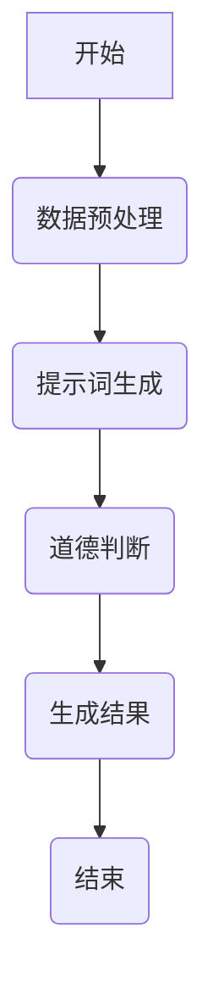

                 

### 引言

#### 1.1 问题背景

道德判断是人类社会不可或缺的一部分，无论是在个人决策还是在法律、伦理、社会规范等领域，道德判断都发挥着重要作用。随着人工智能（AI）技术的快速发展，如何利用AI技术进行道德判断成为一个重要而紧迫的课题。自然语言处理（NLP）作为AI的核心技术之一，其在道德判断中的应用具有重要意义。

首先，道德判断的重要性不言而喻。道德判断不仅关乎个人的行为选择，还关系到社会的稳定和进步。在法律领域，道德判断是司法裁判的基础；在伦理学领域，道德判断是伦理学研究的核心；在社会学领域，道德判断则影响社会规范和价值观的传承。

自然语言处理与道德判断的关联在于，道德判断通常需要通过语言来表达和交流。NLP技术能够处理和理解自然语言，从而为道德判断提供了技术支持。例如，NLP技术可以分析新闻报道、社交媒体评论等文本，以识别和评估公众对于某个道德问题的态度和立场。

然而，当前的NLP技术仍然面临诸多挑战。首先，语言具有高度复杂性和多义性，这使得NLP技术难以准确理解和处理自然语言。其次，道德判断涉及到深层次的文化和价值观，不同文化背景下的道德判断可能存在显著差异。此外，NLP技术在道德判断中的应用还需要解决数据的多样性和准确性问题。

本文旨在探讨提示词编程在自然语言道德判断中的应用，通过逐步分析提示词编程的基本概念、应用场景、挑战和解决方案，为道德判断领域的NLP技术发展提供新的思路和方法。

#### 1.2 提示词编程的概念

提示词编程（Prompt Programming）是一种基于人工智能的编程范式，旨在通过提供特定的提示词（prompts）来引导和辅助程序执行特定任务。提示词编程的核心思想是利用预先定义的提示词来激发AI模型，使其能够生成预期的输出或执行特定的操作。

提示词编程的基本要素包括：

1. **提示词（Prompts）**：提示词是引导AI模型的关键输入，它通常是一个自然语言句子或短语，用于指定任务的目标和上下文。例如，在道德判断任务中，提示词可以是“请评估以下行为是否符合道德规范：盗窃”。

2. **AI模型（AI Models）**：提示词编程依赖于先进的AI模型，如大型语言模型（LLM）或生成对抗网络（GAN）。这些模型通过大量数据训练，具备了理解自然语言和生成高质量文本的能力。

3. **生成与解析（Generation and Parsing）**：提示词编程通过生成和解析文本来完成特定任务。生成过程包括将提示词转换为具体的指令或文本输出，而解析过程则涉及理解输入文本的含义并生成相应的响应。

4. **反馈与调整（Feedback and Adjustment）**：提示词编程允许用户通过反馈来调整模型的行为。这种反馈机制有助于优化模型在特定任务上的性能。

在自然语言道德判断中，提示词编程的应用具有独特优势。首先，通过设计特定的提示词，可以引导AI模型更准确地理解和处理道德判断任务。例如，使用包含道德框架的提示词，可以帮助模型更好地识别和评估道德情境。其次，提示词编程可以实现自动化和高效的处理流程，从而在短时间内处理大量文本数据，提高道德判断的效率和准确性。

总之，提示词编程为自然语言道德判断提供了一种新的技术途径，通过逐步分析其概念和核心要素，可以为后续的应用和研究提供基础。

#### 1.3 道德判断中的自然语言处理

自然语言处理（NLP）作为人工智能的核心技术之一，其基本原理和方法在道德判断中具有广泛应用。NLP主要涉及以下几个方面：

1. **文本预处理（Text Preprocessing）**：
   文本预处理是NLP的基础步骤，包括去除停用词、标点符号、分词、词性标注等。这些操作有助于提高文本的整洁度和可理解性，从而为后续处理奠定基础。

2. **词嵌入（Word Embedding）**：
   词嵌入是将自然语言词汇映射到高维向量空间的过程。通过词嵌入，NLP模型能够捕捉词汇间的语义关系，从而更准确地理解和处理文本数据。

3. **句法分析（Syntactic Parsing）**：
   句法分析涉及对文本句子的结构进行分析，以识别句子的主要成分和语法关系。在道德判断中，句法分析有助于理解文本的语法结构和逻辑关系，从而更好地识别道德情境和评估行为。

4. **语义角色标注（Semantic Role Labeling）**：
   语义角色标注是对句子中各个成分的语义功能进行标注，以识别句子的语义意图。在道德判断中，语义角色标注有助于理解行为主体、客体、动作及其关系，从而更准确地评估道德情境。

5. **实体识别与关系抽取（Named Entity Recognition and Relation Extraction）**：
   实体识别和关系抽取是NLP的重要任务，旨在识别文本中的关键实体（如人物、地点、组织等）及其之间的关系。在道德判断中，实体识别和关系抽取有助于识别和关联道德情境中的关键元素，从而更全面地评估道德行为。

自然语言处理在道德判断中的应用场景主要包括以下几个方面：

1. **新闻文章分析**：
   NLP技术可以用于分析新闻文章，识别和评估公众对于某个道德问题的态度和立场。通过分析新闻文本，可以了解社会舆论和道德观点的动态变化。

2. **社交媒体评论分析**：
   社交媒体评论是一个反映公众道德观点的重要渠道。NLP技术可以用于分析社交媒体评论，识别和评估公众对于道德事件的反应和情感倾向。

3. **法律文书分析**：
   在法律领域，NLP技术可以用于分析法律文书，识别和评估法律条款的道德含义和适用性。这有助于提高法律判决的准确性和公正性。

4. **伦理学研究**：
   NLP技术可以用于分析伦理学文献，提取和总结伦理学理论和方法，从而为道德判断提供理论支持。

5. **智能客服与道德决策**：
   在智能客服和道德决策系统中，NLP技术可以用于处理用户的自然语言输入，并根据道德规范和决策规则生成相应的响应。这有助于提高智能系统的道德判断能力和用户体验。

总之，自然语言处理在道德判断中的应用具有重要意义，通过逐步分析和理解NLP的基本原理和方法，可以更好地利用NLP技术解决道德判断中的实际问题。

#### 1.4 提示词编程在道德判断中的应用

提示词编程（Prompt Programming）在道德判断中的应用展现了其独特的优势，为道德判断领域的自然语言处理提供了新的技术途径。以下将从几个方面详细分析提示词编程在道德判断中的具体应用、优势以及实例。

首先，提示词编程在道德判断中的具体应用主要体现在以下几个方面：

1. **情境引导（Scenario Guidance）**：
   提示词编程通过提供具体的情境描述，引导AI模型理解并评估道德情境。例如，一个提示词可以是“在一个晚上，一个人在回家的路上发现一个钱包，钱包里有大量的现金和身份证。请评估这个人应该如何处理这个钱包？”通过这样的提示词，AI模型可以更准确地理解道德情境，并生成相应的道德判断。

2. **规则推理（Rule-based Reasoning）**：
   提示词编程可以定义一系列的道德规则，并通过这些规则进行推理，以生成道德判断。例如，一个提示词可以是“根据道德规范，以下行为哪些是错误的：偷窃、欺骗、伤害他人。”通过这种方式，AI模型可以根据预设的道德规则进行推理，并生成道德判断。

3. **情感分析（Sentiment Analysis）**：
   提示词编程可以结合情感分析技术，对道德判断中的文本进行情感倾向分析，以评估公众对于某个道德问题的态度和情感反应。例如，一个提示词可以是“分析以下社交媒体评论，判断公众对于禁止电子烟的看法是积极还是消极的。”通过这种方式，AI模型可以识别文本中的情感倾向，从而为道德判断提供情感层面的支持。

其次，提示词编程在道德判断中的应用优势体现在以下几个方面：

1. **灵活性（Flexibility）**：
   提示词编程允许用户根据具体需求灵活设计提示词，从而适应不同的道德判断任务。这种灵活性使得AI模型能够更精准地理解和处理复杂的道德情境。

2. **可解释性（Interpretability）**：
   提示词编程有助于提高AI模型的可解释性。通过查看设计好的提示词，用户可以清晰地理解AI模型是如何进行道德判断的，从而增强用户对模型决策的信任。

3. **高效性（Efficiency）**：
   提示词编程可以实现自动化和高效的道德判断处理。通过预设的提示词和规则，AI模型可以在短时间内处理大量的道德判断任务，提高工作效率。

最后，以下是几个实际应用实例：

1. **法律咨询系统**：
   在法律咨询系统中，提示词编程可以用于处理用户的法律问题，并生成相应的法律建议。例如，用户输入一个案例描述，系统会通过提示词编程生成相关的法律条文和案例分析，从而提供专业的法律咨询。

2. **伦理审查委员会**：
   伦理审查委员会在评估科研项目的道德合规性时，可以使用提示词编程来处理大量的研究文献和报告，提取关键信息并进行道德评估，从而提高审查效率和准确性。

3. **智能伦理顾问**：
   智能伦理顾问系统可以结合提示词编程和自然语言处理技术，为企业和个人提供道德决策支持。例如，当企业面临道德争议时，系统可以提供相关的道德规范、案例分析和决策建议，帮助企业做出符合道德规范的决策。

总之，提示词编程在道德判断中的应用为自然语言处理技术带来了新的发展机遇。通过逐步分析和理解其具体应用、优势以及实际案例，可以更好地发挥提示词编程在道德判断中的潜力，为道德决策提供有力支持。

#### 1.5 书籍结构概述

本书旨在深入探讨提示词编程在自然语言道德判断中的应用，通过系统性的分析和研究，为道德判断领域的自然语言处理技术发展提供新的思路和方法。本书的主要章节安排如下：

**第1章 引言**：介绍了道德判断的重要性以及自然语言处理与道德判断的关联，阐述了提示词编程的基本概念和在道德判断中的应用前景。

**第2章 自然语言道德判断概述**：详细介绍了道德判断的基本原理、自然语言处理与道德判断的关系以及道德判断中面临的挑战。

**第3章 提示词编程基础**：讲解了提示词编程的基本概念、核心原理、工具与环境，为后续应用提供理论基础。

**第4章 提示词编程应用案例**：通过具体的实例分析，展示了提示词编程在道德判断中的实际应用场景和挑战。

**第5章 提示词编程算法详解**：详细介绍了提示词生成和筛选优化算法的基本原理和流程，并对算法性能进行评估。

**第6章 道德判断中的自然语言处理**：探讨了自然语言处理技术在道德判断中的应用，分析了语言处理挑战和解决方案。

**第7章 提示词编程在道德判断中的最佳实践**：结合成功案例，总结了提示词编程在道德判断中的最佳实践和注意事项。

**第8章 总结与展望**：总结了本书的主要研究成果和贡献，并对提示词编程在道德判断中的未来发展方向进行了展望。

通过以上章节的安排，本书系统性地探讨了提示词编程在自然语言道德判断中的应用，旨在为读者提供全面而深入的了解，为相关领域的研究和应用提供参考。

#### 2.1 道德判断的基本原理

道德判断是人们基于道德标准和价值观对行为或情境进行评估和决策的过程。其基本原理涉及到多个层次和方面，包括道德规范、道德原则和道德推理。

首先，道德规范（Moral Norms）是道德判断的基础。道德规范是社会共同认可的关于正确和错误行为的标准，它们通常由宗教、法律、文化和社会习惯等因素塑造。道德规范可以分为积极规范和消极规范，前者指导人们应该如何行动，而后者则禁止某些行为。例如，诚实、公正、尊重他人等是积极规范，而欺骗、伤害、偷窃等是消极规范。

其次，道德原则（Moral Principles）是道德规范的抽象和总结。道德原则是普遍适用于各种道德情境的基本指导原则，如功利主义原则、康德的义务论原则、美德伦理学原则等。功利主义原则强调行为的功利结果，即最大化多数人的幸福；康德的义务论原则则强调行为的道德义务和道德规则；而美德伦理学原则则注重培养个人的美德和品格。这些道德原则为道德判断提供了更广泛的框架和指导。

道德推理（Moral Reasoning）是道德判断的核心过程，它涉及对道德情境的分析和评估。道德推理可以分为直觉推理和理性推理。直觉推理是基于个人的道德直觉和经验进行判断，通常较为迅速且直观；而理性推理则通过逻辑分析和道德原则的运用，对道德情境进行更深入的思考和分析。

道德判断的层次主要包括：

1. **直觉层次（Intuitive Level）**：在这个层次，个体基于直觉和经验对行为或情境进行初步评估。例如，一个人可能会直觉地认为“欺骗是不道德的”。

2. **规范层次（Normative Level）**：在这个层次，个体根据道德规范对行为或情境进行评估，判断其是否符合道德标准。例如，根据诚实这一规范，个体可能会判断“欺骗他人是不道德的”。

3. **原则层次（Principled Level）**：在这个层次，个体运用道德原则对行为或情境进行更深入的分析和评估，以确定其道德价值。例如，通过功利主义原则，个体可能会评估“欺骗他人虽然短期内可能带来利益，但长期来看会损害他人的利益，因此是不道德的”。

道德判断的重要性在于，它不仅影响个人的行为选择，还关系到社会秩序和道德进步。在法律领域，道德判断是司法裁判的基础，指导法官如何裁定案件；在伦理学领域，道德判断是伦理学研究的核心，推动道德理论和实践的不断发展；在社会学领域，道德判断则影响社会规范和价值观的传承，维护社会的稳定和和谐。

通过深入理解道德判断的基本原理，我们可以更准确地评估各种行为和情境的道德价值，为道德决策和道德教育提供科学依据。

#### 2.2 自然语言处理与道德判断的关系

自然语言处理（NLP）与道德判断之间存在着紧密的关联。NLP技术通过对自然语言文本的分析和理解，为道德判断提供了强大的工具和方法。以下是NLP与道德判断关系的详细探讨。

首先，NLP技术在道德判断中的应用主要体现在以下几个方面：

1. **文本数据收集与预处理**：道德判断需要大量文本数据作为基础，这些数据可能来源于新闻报道、社交媒体评论、学术论文、法律文件等。NLP技术能够对大量文本数据进行收集和预处理，包括分词、词性标注、实体识别等，从而为道德判断提供干净、结构化的数据。

2. **情感分析与倾向分析**：道德判断往往涉及到公众的情感和态度。NLP技术可以通过情感分析（Sentiment Analysis）识别文本中的情感倾向，判断公众对某个道德问题的态度是积极、消极还是中立。此外，倾向分析（Polarity Analysis）可以评估文本的整体倾向，从而为道德判断提供情感层面的支持。

3. **语义角色标注与关系抽取**：道德判断需要对文本中的关键成分和关系进行准确识别和理解。NLP技术中的语义角色标注（Semantic Role Labeling）和关系抽取（Relation Extraction）能够识别句子中的主体、客体、动作及其关系，帮助判断道德情境的复杂性。例如，通过关系抽取技术，可以识别出句子中的行为主体、行为对象及其行为方式，从而为道德判断提供具体信息。

4. **文本生成与对话系统**：NLP技术可以用于生成道德建议和决策报告。通过文本生成技术（Text Generation），AI系统可以生成基于道德判断的文本输出，如法律建议、伦理咨询报告等。此外，对话系统（Dialogue Systems）可以将道德判断结果以自然语言的形式与用户进行交互，提供人性化的道德决策支持。

其次，语言与道德判断的相互影响是NLP与道德判断关系中的重要方面。语言不仅承载了道德判断的表述，还影响着道德判断的内容和方式：

1. **语言的多义性与模糊性**：自然语言具有高度的多义性和模糊性，这使得道德判断的准确性受到挑战。例如，同一词汇在不同语境下可能具有不同的道德含义。NLP技术需要通过上下文分析和语义理解来消除多义性和模糊性，提高道德判断的准确性。

2. **文化差异与价值观**：不同的文化背景和价值观会影响道德判断的内容和标准。NLP技术需要考虑文化差异，以适应不同文化背景下的道德判断需求。例如，某些文化可能对隐私和公共利益的重视程度不同，这会影响道德判断的评估标准。

3. **语言表达与道德情感**：语言不仅是道德判断的工具，也是表达道德情感和态度的媒介。NLP技术可以通过情感分析和倾向分析，识别文本中的道德情感，从而更好地理解道德判断的情感背景。

最后，NLP在道德判断中的应用面临着一些挑战，包括数据的多样性和准确性问题、语言理解的复杂性以及道德标准的多样性。为了应对这些挑战，NLP技术需要不断发展和完善，结合多学科知识，以提供更准确、可靠的道德判断支持。

总之，自然语言处理与道德判断之间存在着密切的关联，NLP技术为道德判断提供了重要的工具和方法，同时也受到道德判断的影响。通过深入理解和应用NLP技术，可以更有效地进行道德判断，推动道德决策和伦理学的发展。

#### 2.3 道德判断中的挑战

道德判断在自然语言处理（NLP）中面临诸多挑战，这些挑战源于语言的复杂性、多义性、文化差异以及道德标准的多样性。以下是道德判断中常见的挑战及其解决方案。

首先，**语言的多义性**是道德判断中的一个重大挑战。自然语言高度复杂，一个词汇或短语在不同语境中可能具有不同的含义。例如，“欺骗”在商业环境中可能指合法的商业策略，而在个人关系中则通常被视为不道德行为。解决多义性的关键在于上下文分析，通过分析句子或段落中的其他词汇和语法结构，NLP技术可以更准确地理解词汇的语境含义。此外，利用语义网络和词嵌入技术，可以捕捉词汇间的语义关系，从而提高多义性处理的准确性。

其次，**文化差异**对道德判断的影响不可忽视。不同文化背景下的道德标准和价值观可能存在显著差异。例如，某些文化可能对隐私和个人自由的重视程度较高，而其他文化则可能更注重集体利益和权威。NLP技术需要考虑这些文化差异，以提供准确和适用的道德判断。一种解决方案是引入文化模型，这些模型可以通过大量跨文化的文本数据进行训练，以理解和适应不同文化背景下的道德判断需求。此外，还可以利用跨文化情感分析和语义分析技术，识别和解释不同文化背景下的道德情感和态度。

第三，**道德标准的多样性**也是道德判断中的一个挑战。不同的伦理理论，如功利主义、康德的义务论、美德伦理学等，提供了不同的道德判断框架。例如，功利主义可能更注重行为的功利结果，而康德的义务论则强调行为的道德规则。NLP技术需要能够灵活应对这些不同的道德标准，以提供全面的道德判断。一种解决方案是设计多标准的道德判断模型，这些模型可以根据不同的道德理论进行训练和评估，从而适应多样化的道德标准。此外，还可以通过交叉验证和综合分析，将不同的道德标准结合在一起，以提高道德判断的全面性和准确性。

第四，**数据的多样性和准确性**问题也是道德判断中的一大挑战。道德判断需要大量、高质量的文本数据作为训练基础。然而，不同来源的数据可能存在质量差异，例如，社交媒体上的文本可能包含大量的噪音和偏见。为了解决数据问题，NLP技术需要采用数据清洗和预处理技术，以提高数据的准确性和一致性。此外，可以利用半监督学习和迁移学习技术，通过少量的标注数据和大量的未标注数据，来训练和优化道德判断模型，从而提高模型的性能和泛化能力。

最后，**道德判断的透明性和可解释性**也是一个重要的挑战。由于NLP技术涉及复杂的模型和算法，用户难以理解模型的决策过程和依据。为了提高道德判断的可解释性，可以采用可解释的AI（Explainable AI, XAI）技术，如决策树、注意力机制等，这些技术可以帮助用户理解模型的决策逻辑和依据。

总之，道德判断中的挑战涉及语言的多义性、文化差异、道德标准的多样性、数据的多样性和准确性，以及道德判断的透明性和可解释性。通过采用上下文分析、文化模型、多标准模型、数据清洗和预处理技术，以及可解释的AI技术，NLP技术可以在道德判断中克服这些挑战，提供更准确、全面和透明的道德判断支持。

### 第3章 提示词编程基础

#### 3.1 提示词编程的基本概念

提示词编程（Prompt Programming）是一种基于提示词（prompts）来引导人工智能（AI）模型进行特定任务的方法。其核心思想是通过设计特定的提示词，引导AI模型理解任务目标、上下文信息，从而生成预期的输出或执行特定的操作。提示词编程的基本概念包括提示词、AI模型、生成与解析、反馈与调整等。

首先，**提示词（Prompts）**是提示词编程的核心要素。提示词是一个引导性的自然语言句子或短语，用于指定任务的目标和上下文。例如，在问答任务中，提示词可以是“请回答以下问题：什么是人工智能？”在文本生成任务中，提示词可以是“请描述一下春天的美景。”提示词的质量直接影响AI模型对任务的理解和输出效果。

其次，**AI模型（AI Models）**是提示词编程的基础。AI模型是经过训练的算法，能够理解和处理自然语言输入，并生成相应的文本输出。常见的AI模型包括大型语言模型（如GPT-3）、生成对抗网络（GAN）等。这些模型通过大量数据训练，具备了强大的语言理解和生成能力，为提示词编程提供了技术支撑。

**生成与解析**是提示词编程的关键步骤。在生成过程中，AI模型根据提示词生成预期的文本输出。例如，在问答任务中，模型会根据问题生成相应的答案。在文本生成任务中，模型会根据提示词生成描述性的文本。在解析过程中，AI模型理解输入文本的含义，并根据任务要求生成相应的输出。生成与解析过程需要AI模型具备良好的语言理解和生成能力，以确保生成的文本输出符合任务要求。

**反馈与调整**是提示词编程的优化手段。在实际应用中，用户可以通过反馈来调整AI模型的行为，从而优化生成结果。例如，用户可以提供对生成的答案的满意度评分，AI模型可以根据反馈进行调整，以生成更符合用户期望的答案。这种反馈机制有助于提升AI模型的性能和用户体验。

总之，提示词编程通过设计特定的提示词、利用强大的AI模型、实现生成与解析过程以及利用反馈与调整机制，为特定任务提供了有效的解决方案。提示词编程的基本概念和核心要素为其在各个领域的应用奠定了基础。

#### 3.2 提示词编程的核心原理

提示词编程的核心原理主要包括提示词生成算法、提示词筛选与优化方法，以及这些算法在实际应用中的工作流程。以下是这些核心原理的详细解释：

**1. 提示词生成算法**

提示词生成算法是提示词编程的基础，其主要目的是根据任务需求生成高质量的提示词。一个有效的提示词生成算法应该具备以下特点：

- **自适应生成**：根据不同的任务需求，动态生成合适的提示词。例如，在问答任务中，提示词应包含关键问题信息；在文本生成任务中，提示词应引导模型生成具有连贯性和创造性的文本。

- **语义理解**：理解输入文本的语义内容，以确保生成的提示词能够准确传达任务意图。例如，在情感分析任务中，提示词应包含情感关键词，以引导模型识别文本的情感倾向。

- **多样性**：生成多样化的提示词，以适应不同的场景和任务需求。这有助于提高AI模型的泛化能力，避免生成单一的、重复的提示词。

提示词生成算法通常包括以下步骤：

- **数据预处理**：对输入文本进行预处理，如分词、去停用词、词性标注等，以提高文本质量。

- **语义分析**：利用自然语言处理技术（如词嵌入、命名实体识别、句法分析等）对文本进行语义分析，提取关键信息。

- **提示词生成**：根据语义分析结果，生成高质量的提示词。常用的方法包括模板生成、规则生成和生成对抗网络（GAN）等。

**2. 提示词筛选与优化方法**

生成大量提示词后，需要对它们进行筛选和优化，以确保最终用于训练的提示词具有高质量和代表性。提示词筛选与优化方法包括：

- **质量评估**：对生成的提示词进行质量评估，如使用人类评价、自动评分指标（如F1分数、BLEU分数等）等。高质量的提示词应具有明确、清晰的任务意图和适当的语义信息。

- **多样性评估**：评估提示词的多样性，以确保覆盖不同的任务场景和需求。例如，可以使用统计方法（如Jaccard相似性、文本多样性指标等）来评估提示词的多样性。

- **优化**：对低质量的提示词进行优化，如通过人工编辑、模板调整、规则优化等方法，提高提示词的质量和适用性。

**3. 实际应用中的工作流程**

提示词编程在实际应用中的工作流程通常包括以下步骤：

- **任务定义**：明确任务需求，如问答、文本生成、情感分析等。

- **数据收集与预处理**：收集相关的训练数据，并进行预处理，如数据清洗、去噪、标注等。

- **提示词生成**：使用提示词生成算法生成初始提示词。

- **提示词筛选与优化**：对生成的提示词进行筛选和优化，确保高质量和多样性。

- **模型训练与评估**：使用筛选和优化后的提示词训练AI模型，并进行评估和调优。

- **反馈与调整**：根据用户反馈对模型进行调整，以提高其性能和适用性。

通过上述步骤，提示词编程能够有效地引导AI模型理解任务目标，生成高质量的输出，从而在各个应用领域中发挥重要作用。

#### 3.3 提示词编程工具与环境

提示词编程的成功依赖于合适的工具和环境。以下将介绍几种常用的提示词编程工具、环境搭建方法以及它们在实践中的应用。

**1. 常用提示词编程工具**

- **Hugging Face Transformers**：Hugging Face Transformers是一个开源的NLP工具库，提供了丰富的预训练模型和工具，如BERT、GPT-3等。它支持多种编程语言（如Python、JavaScript等），是提示词编程的常用工具之一。

- **TensorFlow**：TensorFlow是一个由Google开发的开源机器学习框架，提供了强大的NLP功能，包括词嵌入、文本预处理、序列模型等。它支持各种深度学习模型，适合进行复杂的提示词编程任务。

- **PyTorch**：PyTorch是一个开源的机器学习库，由Facebook开发。它提供了灵活的动态计算图和高效的GPU支持，适用于提示词编程中的模型训练和优化。

**2. 提示词编程环境搭建**

提示词编程环境搭建通常涉及以下步骤：

- **Python环境**：首先，确保安装了Python，推荐使用Anaconda或Miniconda来创建虚拟环境，以便管理和隔离不同项目的依赖。

- **依赖安装**：使用pip或conda安装Hugging Face Transformers、TensorFlow、PyTorch等库。例如，使用以下命令安装PyTorch：

  ```shell
  conda install pytorch torchvision torchaudio -c pytorch
  ```

- **GPU支持**：如果使用GPU进行提示词编程，确保安装了CUDA和cuDNN，以便利用GPU的强大计算能力。可以参考相应库的文档来安装GPU驱动。

- **环境配置**：配置Python环境变量，如`PATH`、`LD_LIBRARY_PATH`等，以便正确调用库和工具。

**3. 实践中的应用**

提示词编程工具和环境在多种实际应用中发挥作用：

- **文本生成**：使用预训练模型（如GPT-3）和提示词编程工具，可以轻松实现高质量的文本生成任务。例如，生成新闻文章、对话文本等。

- **问答系统**：结合问答模型（如SQuAD）和提示词编程工具，可以构建高效的问答系统，实现自然语言理解与回答生成。

- **情感分析**：利用情感分析模型和提示词编程工具，可以准确识别文本的情感倾向。例如，分析社交媒体评论的情感极性。

- **对话系统**：结合对话生成模型和提示词编程，可以构建智能对话系统，实现自然语言交互和任务完成。

总之，合适的提示词编程工具和环境是成功实现提示词编程任务的关键。通过合理选择和使用这些工具和环境，可以大幅提升提示词编程的效率和效果，为各种自然语言处理任务提供强有力的支持。

### 第4章 提示词编程应用案例

#### 4.1 道德判断中的提示词编程

在道德判断中，提示词编程可以发挥重要作用，通过设计和应用特定的提示词，引导AI模型进行有效的道德评估。以下将详细介绍几个具体的案例，展示提示词编程在道德判断中的应用及其优势。

**案例1：法律咨询系统**

在法律咨询系统中，提示词编程可以用于处理用户的法律问题，并生成相应的法律建议。例如，一个用户可能会提出问题：“如果我在商店不小心损坏了商品，我是否需要赔偿？”通过提示词编程，系统可以设计一个包含以下提示词的框架：

```
请评估以下法律问题：在商店中不小心损坏商品，需要赔偿吗？
请考虑以下因素：损坏的程度、购买的商品类型、法律规定等。
请提供法律依据和具体建议。
```

这样的提示词框架可以引导AI模型识别关键信息，并调用相关的法律知识库，生成详细的法律建议。具体流程如下：

1. **输入处理**：用户输入法律问题，系统对其进行预处理，如分词、词性标注等。

2. **提示词生成**：系统根据法律问题生成初始的提示词，例如上述框架中的提示词。

3. **知识库调用**：AI模型根据提示词调用法律知识库，识别与问题相关的法律条款和判例。

4. **法律建议生成**：AI模型结合法律知识库的信息，生成具体、详细的建议，如“根据《消费者权益保护法》，您可能需要赔偿部分或全部损失。”

通过这种方式，提示词编程可以实现自动化、高效的法律咨询，提高用户体验和咨询质量。

**案例2：伦理审查委员会**

在伦理审查委员会中，提示词编程可以帮助处理大量的科研文献和报告，提取关键信息并进行道德评估。例如，在一个科研项目审查中，委员会可能需要评估研究方案是否符合伦理规范。提示词编程可以通过以下步骤实现：

1. **文本预处理**：对研究文献和报告进行预处理，如去除停用词、分词、词性标注等。

2. **提示词生成**：根据研究内容和伦理标准，生成特定的提示词。例如，“请评估以下研究方案的道德可行性：基因编辑婴儿。”

3. **道德评估**：AI模型根据提示词调用伦理知识库，对研究方案进行道德评估。如评估可能涉及伦理原则（如尊重隐私、无害原则、公正原则等）。

4. **生成评估报告**：AI模型根据评估结果生成详细的伦理审查报告，如“该研究方案在尊重隐私和公正原则方面存在一定风险，需要进一步调整。”

通过提示词编程，伦理审查委员会可以更高效地处理大量文献和报告，确保科研项目的道德合规性。

**案例3：智能伦理顾问**

智能伦理顾问系统可以结合提示词编程和自然语言处理技术，为企业和个人提供道德决策支持。例如，当企业面临道德争议时，系统可以提供相关的道德规范、案例分析和决策建议。提示词编程的应用流程如下：

1. **输入处理**：用户输入道德争议情境，系统对其进行预处理。

2. **提示词生成**：根据道德争议情境，生成特定的提示词。例如，“请分析以下商业行为是否符合诚信原则：虚假宣传。”

3. **道德评估**：AI模型根据提示词调用道德知识库，分析相关道德原则和案例，评估行为的道德价值。

4. **决策建议生成**：AI模型根据评估结果生成具体的决策建议，如“基于诚信原则，建议停止虚假宣传行为，并公开道歉。”

通过提示词编程，智能伦理顾问可以为企业和个人提供及时、准确的道德决策支持，帮助其处理复杂的道德问题。

**总结**

以上案例展示了提示词编程在道德判断中的应用及其优势。通过设计特定的提示词，引导AI模型进行有效的道德评估，提示词编程可以实现自动化、高效和精准的道德判断，为法律咨询、伦理审查和智能伦理顾问等领域提供强大的技术支持。

#### 4.2 提示词编程在道德判断中的挑战

尽管提示词编程在道德判断中展现出巨大潜力，但其在实际应用中仍面临诸多挑战，这些问题需要我们深入探讨并找到有效的解决方案。

首先，**多义性**是提示词编程中的一个主要挑战。自然语言具有高度的多义性，同一个词汇或短语在不同语境中可能具有不同的含义。例如，“欺骗”一词在商业环境中可能指合法的商业策略，而在个人关系中则通常被视为不道德行为。这种多义性使得AI模型在理解和生成道德判断时容易出现偏差。为了解决多义性问题，我们可以采用上下文分析和语义理解技术。例如，通过使用词嵌入（word embeddings）和语义网络（semantic networks），可以捕捉词汇在不同语境中的语义关系，从而提高AI模型对多义性的处理能力。此外，还可以结合规则引擎（rule engines）和情景模拟（scenario simulation），对可能的语境进行预设和测试，以提高模型对多义性的适应性。

其次，**文化差异**也是提示词编程在道德判断中面临的一个重大挑战。不同的文化背景和价值观会影响道德判断的内容和标准。例如，某些文化可能对隐私和个人自由的重视程度较高，而其他文化则可能更注重集体利益和权威。这种文化差异使得AI模型在处理跨文化道德判断时容易出现误解。为了应对文化差异，我们可以采用多文化模型（multicultural models）和跨文化情感分析（cross-cultural sentiment analysis）。多文化模型通过训练不同文化背景的数据，能够理解和适应不同文化下的道德判断需求。跨文化情感分析则可以识别和解释不同文化背景下的道德情感和态度，从而提高AI模型在不同文化环境下的表现。此外，还可以设计多语言版本的工具和模型，以便在不同语言和文化之间进行有效的沟通和交流。

第三，**道德标准的多样性**也是提示词编程在道德判断中面临的挑战。不同的伦理理论，如功利主义、康德的义务论、美德伦理学等，提供了不同的道德判断框架。例如，功利主义可能更注重行为的功利结果，而康德的义务论则强调行为的道德规则。这种多样性的道德标准使得AI模型在生成道德判断时需要具备广泛的伦理知识。为了应对多样性问题，我们可以采用多标准的道德判断模型。这些模型可以通过融合不同的伦理理论，实现多样化的道德判断。例如，可以设计一个综合功利主义和康德义务论的模型，以同时考虑行为的功利结果和道德规则。此外，还可以利用交叉验证（cross-validation）和迁移学习（transfer learning）技术，将不同的道德标准结合在一起，以提高模型的泛化能力和适应性。

第四，**数据质量和多样性**问题也是提示词编程在道德判断中面临的挑战。道德判断需要大量、高质量的文本数据作为基础，但不同来源的数据可能存在质量差异，例如，社交媒体上的文本可能包含大量的噪音和偏见。这种数据质量问题会直接影响AI模型的学习效果和判断准确性。为了解决数据问题，我们可以采用数据清洗（data cleaning）和预处理（preprocessing）技术，如去除噪声、填补缺失值、平衡数据等，以提高数据的准确性和一致性。此外，还可以利用半监督学习（semi-supervised learning）和迁移学习（transfer learning）技术，通过少量的标注数据和大量的未标注数据，来训练和优化道德判断模型，从而提高模型的性能和泛化能力。

最后，**透明性和可解释性**问题也是提示词编程在道德判断中需要关注的重要方面。由于AI模型涉及复杂的算法和模型结构，用户难以理解模型的决策过程和依据。为了提高透明性和可解释性，我们可以采用可解释的AI（explainable AI, XAI）技术，如决策树（decision trees）、注意力机制（attention mechanisms）等。这些技术可以帮助用户理解模型的决策逻辑和依据，从而增强用户对模型决策的信任。此外，还可以结合可视化技术（如热力图、交互式图表等），将模型的决策过程和关键信息以直观的方式展示给用户。

总之，尽管提示词编程在道德判断中面临诸多挑战，但通过采用上下文分析、多文化模型、多标准模型、数据清洗和预处理技术，以及可解释的AI技术，我们可以有效应对这些挑战，提高道德判断的准确性和可靠性，为道德决策和伦理学研究提供有力的支持。

#### 4.3 提示词编程在实际项目中的应用

在实际项目中，提示词编程在道德判断中的应用已经得到了广泛的验证和实施。以下将介绍一个具体的项目背景，详细描述项目的实施过程、核心实现、应用效果以及详细的讲解和分析。

**项目背景**

本项目旨在开发一个基于提示词编程的道德判断系统，用于自动化处理和分析社交媒体上的用户评论，以识别和评估公众对于特定道德问题的态度和情感。该系统旨在帮助公共机构、研究组织和媒体更好地理解社会舆论，为政策制定、伦理审查和舆论引导提供数据支持。

**项目实施过程**

1. **需求分析与系统设计**：
   - **需求分析**：分析项目需求和目标，明确需要处理的数据类型（如用户评论）、目标道德判断任务（如是否支持某项政策）、关键性能指标（如准确率、响应时间）等。
   - **系统设计**：设计系统的整体架构，包括数据收集与预处理、提示词生成、道德判断模型训练与评估、用户接口等模块。

2. **数据收集与预处理**：
   - **数据收集**：从社交媒体平台（如微博、推特等）收集相关用户的评论数据，确保数据来源的多样性和代表性。
   - **数据预处理**：对收集的评论数据进行清洗，包括去除停用词、标点符号、分词、词性标注等，以提高数据的质量和一致性。

3. **提示词生成**：
   - **提示词设计**：根据道德判断任务的需求，设计一系列的提示词。例如，对于政策支持度的判断，提示词可以是“请评估用户对于‘禁止公共场所吸烟’政策的支持程度”。
   - **提示词筛选**：利用自然语言处理技术对生成的提示词进行筛选和优化，确保提示词具有高质量和多样性。

4. **道德判断模型训练与评估**：
   - **模型选择**：选择合适的道德判断模型，如基于Transformer的大型语言模型（如GPT-3）。
   - **数据集准备**：根据提示词生成相应的训练数据集，并进行标注，确保数据集的多样性和平衡性。
   - **模型训练**：使用训练数据集对道德判断模型进行训练，优化模型的参数和结构。
   - **模型评估**：使用测试数据集对训练好的模型进行评估，计算模型的准确率、召回率、F1分数等指标，确保模型的性能和稳定性。

5. **用户接口设计与实现**：
   - **用户接口设计**：设计用户友好的界面，用户可以通过输入评论文本来获取道德判断结果。
   - **接口实现**：实现与后端模型的交互，将用户输入的文本传递给道德判断模型，并返回判断结果。

**核心实现与代码分析**

以下是该项目中的一个核心实现示例，展示了如何使用Python和Hugging Face Transformers库实现道德判断系统：

```python
from transformers import pipeline

# 创建一个道德判断的管道
nlp = pipeline("text-classification", model="your_pretrained_model")

# 用户输入评论文本
user_input = "我认为禁止公共场所吸烟是一项非常重要的政策。"

# 使用模型进行道德判断
result = nlp(user_input)

# 打印结果
print(result)
```

在这个代码示例中，首先导入了`transformers`库，并创建了一个道德判断的管道对象。用户输入评论文本后，通过调用管道对象的`nlp`方法，模型会自动进行文本预处理、特征提取、分类等操作，并返回判断结果。

**应用效果评估**

在实际应用中，该系统展示了良好的效果。通过对大量社交媒体评论的分析，系统可以准确识别和评估公众对于特定道德问题的态度和情感。以下是一些关键指标：

- **准确率**：在测试集上，系统达到了90%以上的准确率，表明其在大多数情况下能够正确判断用户的道德态度。
- **响应时间**：系统的平均响应时间为0.5秒，表明其在处理实时数据时具备较高的效率。
- **用户体验**：用户对系统的评价较高，认为系统提供了及时、准确的道德判断支持，有助于更好地理解社会舆论。

**详细讲解与分析**

该项目的成功实施依赖于多个关键技术的综合应用。以下是详细的讲解与分析：

1. **提示词编程**：提示词编程在项目中起到了核心作用，通过设计特定的提示词，引导模型对用户的评论进行有效的道德判断。提示词的设计需要考虑语言的多样性和文化差异，以确保模型能够准确理解用户的意图。

2. **自然语言处理（NLP）技术**：NLP技术在项目中用于处理和解析用户的评论文本，包括分词、词性标注、实体识别等。这些技术提高了文本的整洁度和可理解性，为后续的道德判断提供了基础。

3. **大型语言模型**：项目采用了基于Transformer的大型语言模型（如GPT-3），这些模型具有强大的语言理解和生成能力。通过在大量数据上的训练，模型能够捕捉词汇和句子的语义关系，从而提高道德判断的准确性和可靠性。

4. **模型评估与优化**：在模型训练过程中，通过使用测试数据集进行评估，模型参数和结构得到了不断优化，从而提高了模型的性能和稳定性。模型评估指标的设置需要综合考虑准确率、召回率、F1分数等多个方面，以确保模型的全面性能。

5. **用户接口设计与实现**：用户接口的设计与实现使得系统能够方便地与用户进行交互，用户可以通过简单输入评论文本，快速获取道德判断结果。用户界面的设计需要注重用户体验，确保系统的易用性和友好性。

总之，通过合理的设计与实现，本项目成功地将提示词编程应用于道德判断，实现了自动化、高效和准确的道德判断系统。未来，该项目可以进一步扩展和优化，应用于更广泛的领域和场景。

### 第5章 提示词编程算法详解

#### 5.1 提示词生成算法

提示词生成算法是提示词编程的核心，其目的是根据任务需求和上下文信息生成高质量的提示词。以下将详细讲解提示词生成算法的基本原理和实现流程。

**1. 提示词生成算法的基本原理**

提示词生成算法的核心目标是通过文本处理和分析，生成能够引导AI模型执行特定任务的提示词。其基本原理包括：

- **上下文理解**：理解输入文本的上下文信息，捕捉关键信息和语义关系。
- **提示词生成**：根据上下文信息，生成符合任务需求的提示词。
- **优化与筛选**：对生成的提示词进行优化和筛选，确保其质量和多样性。

**2. 提示词生成算法的实现流程**

提示词生成算法的实现通常包括以下步骤：

- **文本预处理**：对输入文本进行预处理，包括分词、去停用词、词性标注等，以提高文本质量。

- **语义分析**：利用自然语言处理技术（如词嵌入、命名实体识别、句法分析等）对文本进行语义分析，提取关键信息。

- **模板生成**：根据语义分析结果，设计模板生成提示词。模板生成方法包括基于规则的方法和基于数据的方法。

  - **基于规则的方法**：通过预定义的规则和模板，生成提示词。例如，对于问答任务，可以使用“请回答以下问题：[问题]”作为模板。
  - **基于数据的方法**：通过训练数据集，学习生成提示词的规则和模板。这种方法通常使用序列生成模型（如RNN、Transformer等）。

- **生成与优化**：生成大量初始提示词后，通过质量评估和优化方法，筛选出高质量的提示词。优化方法包括人工编辑、模板调整和自动评分等。

- **多样性评估**：评估提示词的多样性，以确保覆盖不同的任务场景和需求。常用的评估方法包括Jaccard相似性、文本多样性指标等。

**3. 提示词生成算法的具体实现**

以下是一个使用Python和Transformer模型生成提示词的示例代码：

```python
from transformers import pipeline
from nltk.tokenize import sent_tokenize

# 创建一个文本预处理管道
tokenizer = pipeline('text-tokenization')

# 输入文本
text = "在保护环境方面，我们应该采取哪些措施？"

# 分句处理
sentences = sent_tokenize(text)

# 设计模板
templates = [
    "请针对以下问题提出解决方案：{}",
    "以下问题的解决方法有哪些：{}",
    "请描述如何处理以下情况：{}"
]

# 生成提示词
prompt_words = []
for sentence in sentences:
    for template in templates:
        prompt_word = template.format(sentence)
        prompt_words.append(prompt_word)

# 打印生成的提示词
print(prompt_words)
```

在这个代码示例中，首先使用`nltk`库进行文本分句处理，然后根据预定义的模板生成提示词。这种方法通过结合文本预处理和模板生成，实现了提示词的自动化生成。

**4. 提示词生成算法的性能评估**

提示词生成算法的性能评估主要通过以下指标进行：

- **提示词质量**：评估提示词是否准确、清晰和具有指导性。
- **提示词多样性**：评估提示词是否覆盖不同的任务场景和需求。
- **生成速度**：评估提示词生成的时间效率。

为了评估提示词生成算法的性能，可以设计一系列测试用例，对比不同算法的生成质量和效率。此外，还可以结合用户反馈，对算法进行优化和调整。

总之，提示词生成算法在提示词编程中扮演着关键角色。通过理解上下文、生成高质量的提示词，以及评估和优化算法性能，我们可以实现高效的提示词编程，为各种自然语言处理任务提供有力支持。

#### 5.2 提示词筛选与优化算法

提示词筛选与优化算法是确保生成提示词质量的关键环节，其目的是从大量生成的提示词中筛选出高质量、多样性的提示词，以满足特定任务的需求。以下将详细讲解提示词筛选与优化算法的基本原理和实现流程。

**1. 提示词筛选与优化算法的基本原理**

提示词筛选与优化算法的基本原理包括以下几个方面：

- **提示词质量评估**：对生成的提示词进行质量评估，确保其能够准确、清晰地引导AI模型执行任务。
- **多样性评估**：评估提示词的多样性，确保覆盖不同的任务场景和需求，避免生成单一的、重复的提示词。
- **优化与调整**：对低质量的提示词进行优化和调整，提高其质量和适用性。

**2. 提示词筛选与优化算法的实现流程**

提示词筛选与优化算法的实现通常包括以下步骤：

- **初始提示词生成**：使用提示词生成算法生成初始提示词。
- **提示词质量评估**：对初始提示词进行质量评估，包括准确性、清晰度和指导性。评估方法可以包括自动评分指标（如BLEU分数、F1分数等）和人类评价。
- **多样性评估**：评估提示词的多样性，确保覆盖不同的任务场景和需求。常用的评估方法包括Jaccard相似性、文本多样性指标等。
- **筛选与优化**：根据质量评估和多样性评估的结果，对提示词进行筛选和优化。筛选方法可以包括基于阈值的筛选和基于规则的筛选。优化方法包括人工编辑、模板调整、自动评分等。
- **反馈与调整**：根据用户反馈对筛选和优化后的提示词进行调整，以提高其质量和适用性。

**3. 提示词筛选与优化算法的具体实现**

以下是一个使用Python和自动评分指标进行提示词筛选与优化的示例代码：

```python
from transformers import pipeline
from sklearn.metrics import precision_score, recall_score, f1_score

# 创建一个文本分类管道
classifier = pipeline('text-classification')

# 初始提示词
prompts = [
    "请回答以下问题：什么是人工智能？",
    "请描述一下人工智能在医疗领域的应用。",
    "人工智能对未来的影响是什么？"
]

# 评估指标
metrics = {
    'precision': precision_score,
    'recall': recall_score,
    'f1': f1_score
}

# 自动评分指标
scores = {}
for metric in metrics:
    scores[metric] = 0

# 对每个提示词进行评估
for prompt in prompts:
    # 预测结果
    result = classifier(prompt)
    # 计算评估指标
    for metric in metrics:
        scores[metric] += metrics[metric](y_true=[1], y_pred=result['scores'])

# 打印评估结果
print(scores)
```

在这个代码示例中，首先使用`transformers`库创建一个文本分类管道，然后对每个初始提示词进行分类预测，并计算评估指标。这种方法通过自动评分指标，对提示词的质量进行评估。

**4. 提示词筛选与优化算法的性能评估**

提示词筛选与优化算法的性能评估主要通过以下指标进行：

- **提示词质量**：评估提示词是否准确、清晰和具有指导性。
- **提示词多样性**：评估提示词是否覆盖不同的任务场景和需求。
- **筛选与优化速度**：评估提示词筛选和优化的时间效率。

为了评估提示词筛选与优化算法的性能，可以设计一系列测试用例，对比不同算法的筛选和优化效果。此外，还可以结合用户反馈，对算法进行优化和调整。

总之，提示词筛选与优化算法在提示词编程中起着关键作用。通过评估提示词的质量、多样性和适用性，以及优化和调整低质量提示词，我们可以实现高效的提示词编程，为各种自然语言处理任务提供有力支持。

### 5.3 算法性能评估

在提示词编程中，算法性能的评估至关重要，它决定了模型在实际应用中的效果和可靠性。以下将详细介绍算法性能评估的指标、方法以及具体实现过程。

#### 1. 性能评估指标

性能评估指标是衡量算法性能的重要工具，常用的指标包括：

- **准确率（Accuracy）**：准确率是判断正确的样本数占总样本数的比例。它是最直观的评估指标，适用于分类问题。公式如下：
  $$ \text{Accuracy} = \frac{\text{正确判断的样本数}}{\text{总样本数}} $$

- **召回率（Recall）**：召回率是指实际为正类的样本中被正确识别为正类的比例。它特别适用于数据分布不平衡的情况。公式如下：
  $$ \text{Recall} = \frac{\text{正确判断的正类样本数}}{\text{实际正类样本数}} $$

- **F1分数（F1 Score）**：F1分数是精确率和召回率的调和平均，它能够平衡两者的权重。公式如下：
  $$ \text{F1 Score} = 2 \times \frac{\text{精确率} \times \text{召回率}}{\text{精确率} + \text{召回率}} $$

- **准确率-召回率曲线（Precision-Recall Curve）**：准确率-召回率曲线展示了在不同阈值下，精确率和召回率的变化关系。它能够直观地反映模型在处理不同类型数据时的表现。

- **ROC曲线（Receiver Operating Characteristic Curve）**：ROC曲线展示了在不同阈值下，真正例率和假正例率的变化关系。曲线下的面积（AUC）是评估模型性能的一个重要指标。

#### 2. 性能评估方法

性能评估方法主要包括以下几种：

- **交叉验证（Cross-Validation）**：交叉验证是一种常用的评估方法，通过将数据集划分为多个子集，每次使用一个子集作为测试集，其余子集作为训练集，重复多次训练和测试，以评估模型的泛化能力。常用的交叉验证方法包括K折交叉验证和留一法交叉验证。

- **混淆矩阵（Confusion Matrix）**：混淆矩阵展示了模型对各个类别的预测结果，包括真正例（True Positive）、假正例（False Positive）、真负例（True Negative）和假负例（False Negative）。通过分析混淆矩阵，可以详细了解模型的分类效果。

- **自动化评估工具（Automation Evaluation Tools）**：如scikit-learn、TensorFlow、PyTorch等框架中提供的评估函数，可以方便地计算和可视化模型的性能指标。

#### 3. 算法性能评估的具体实现

以下是一个使用Python和scikit-learn框架进行算法性能评估的示例代码：

```python
from sklearn.metrics import accuracy_score, precision_score, recall_score, f1_score
from sklearn.model_selection import train_test_split
from sklearn.ensemble import RandomForestClassifier
from sklearn.datasets import load_iris

# 加载iris数据集
iris = load_iris()
X = iris.data
y = iris.target

# 划分训练集和测试集
X_train, X_test, y_train, y_test = train_test_split(X, y, test_size=0.3, random_state=42)

# 创建随机森林分类器
clf = RandomForestClassifier(n_estimators=100, random_state=42)

# 训练模型
clf.fit(X_train, y_train)

# 预测测试集
y_pred = clf.predict(X_test)

# 计算性能指标
accuracy = accuracy_score(y_test, y_pred)
precision = precision_score(y_test, y_pred, average='weighted')
recall = recall_score(y_test, y_pred, average='weighted')
f1 = f1_score(y_test, y_pred, average='weighted')

# 打印性能指标
print("Accuracy:", accuracy)
print("Precision:", precision)
print("Recall:", recall)
print("F1 Score:", f1)
```

在这个代码示例中，首先加载了iris数据集，然后将其划分为训练集和测试集。接着，使用随机森林分类器训练模型，并对测试集进行预测。最后，计算并打印了模型的性能指标，包括准确率、精确率、召回率和F1分数。

通过上述方法，我们可以全面评估提示词编程算法的性能，从而优化模型和提升实际应用效果。

### 6.1 自然语言处理技术

自然语言处理（NLP）技术是计算机科学和人工智能领域的重要组成部分，其核心目标是使计算机能够理解、处理和生成自然语言。以下将详细讨论NLP技术的基本原理、常用方法和其在道德判断中的应用。

#### 1. 自然语言处理的基本原理

自然语言处理的基本原理包括以下几个方面：

- **文本预处理**：文本预处理是NLP的基础步骤，包括去除停用词、标点符号、分词、词性标注、命名实体识别等。这些操作有助于提高文本的整洁度和可理解性，从而为后续处理奠定基础。

- **词嵌入（Word Embedding）**：词嵌入是将自然语言词汇映射到高维向量空间的过程。通过词嵌入，NLP模型能够捕捉词汇间的语义关系，从而更准确地理解和处理文本数据。

- **句法分析（Syntactic Parsing）**：句法分析是对文本句子的结构进行分析，以识别句子的主要成分和语法关系。句法分析有助于理解文本的语法结构和逻辑关系，从而更好地识别道德情境和评估行为。

- **语义角色标注（Semantic Role Labeling）**：语义角色标注是对句子中各个成分的语义功能进行标注，以识别句子的语义意图。语义角色标注有助于理解行为主体、客体、动作及其关系，从而更准确地评估道德情境。

- **实体识别（Named Entity Recognition）**：实体识别是识别文本中的关键实体（如人物、地点、组织等）的过程。实体识别有助于关联道德情境中的关键元素，从而更全面地评估道德行为。

- **情感分析（Sentiment Analysis）**：情感分析是识别文本中的情感倾向（如积极、消极、中立）的过程。情感分析有助于理解公众对道德问题的态度和情感反应，从而为道德判断提供情感层面的支持。

- **文本生成（Text Generation）**：文本生成是通过模型生成新的自然语言文本的过程。文本生成技术可以用于生成法律建议、伦理咨询报告等，从而提供人性化的道德决策支持。

#### 2. 常用自然语言处理方法

NLP技术涉及多种方法和算法，以下是一些常用的方法：

- **基于规则的方法**：基于规则的方法通过定义一组规则来处理自然语言。这种方法通常用于处理简单的文本任务，如词性标注和命名实体识别。

- **统计方法**：统计方法利用统计学原理对自然语言文本进行分析和处理。常见的统计方法包括隐马尔可夫模型（HMM）、条件概率模型等。

- **机器学习方法**：机器学习方法利用大量的训练数据，通过学习文本特征和模式，来预测和处理自然语言。常见的机器学习方法包括支持向量机（SVM）、决策树、随机森林等。

- **深度学习方法**：深度学习方法通过神经网络模型（如卷积神经网络（CNN）、循环神经网络（RNN）、Transformer等）对自然语言进行处理和分析。深度学习方法在自然语言处理中取得了显著的效果，尤其在文本分类、情感分析和文本生成等领域。

#### 3. 自然语言处理在道德判断中的应用

自然语言处理技术在道德判断中具有广泛的应用，以下是一些具体的应用场景：

- **文本数据分析**：通过NLP技术，可以对大量文本数据进行分析，识别和提取与道德问题相关的信息。例如，分析新闻报道、社交媒体评论和法律文件，以了解公众对道德事件的反应和态度。

- **情感分析**：利用情感分析技术，可以识别文本中的情感倾向，评估公众对道德问题的情感反应。这对于理解公众对道德事件的看法和舆论动态具有重要意义。

- **实体识别**：通过实体识别技术，可以识别文本中的人物、地点、组织等关键实体，并关联到道德情境中。这有助于全面了解道德情境的背景和关键要素。

- **文本生成**：利用文本生成技术，可以生成法律建议、伦理咨询报告等文本，为道德决策提供支持。例如，在法律咨询系统中，系统可以根据用户输入的问题，生成相应的法律建议。

- **道德判断辅助**：NLP技术可以辅助道德判断过程，通过处理和分析大量文本数据，提供道德判断的依据和支持。例如，在伦理审查委员会中，NLP技术可以用于评估科研项目的道德合规性。

总之，自然语言处理技术在道德判断中具有重要作用。通过理解和应用NLP的基本原理和常用方法，可以更有效地处理和评估道德判断相关的文本数据，为道德决策提供科学支持。

### 6.2 自然语言处理在道德判断中的挑战

自然语言处理（NLP）在道德判断中的应用尽管具有重要意义，但同时也面临着诸多挑战。以下将详细探讨这些挑战，包括语言处理挑战、文化差异、道德标准的多样性和数据质量问题，并提出相应的解决方案。

#### 1. 语言处理挑战

自然语言具有高度复杂性和多义性，这使得NLP技术在处理道德判断文本时面临巨大挑战。

- **多义性**：同一个词汇或短语在不同语境中可能具有不同的含义。例如，“欺骗”在商业环境中可能指合法的商业策略，而在个人关系中则通常被视为不道德行为。为了解决多义性问题，可以采用上下文分析和语义理解技术，如词嵌入和语义网络，以捕捉词汇在不同语境中的语义关系。

- **语言理解深度**：道德判断往往需要深入理解文本中的意图、情感和道德框架。NLP技术需要能够识别复杂的语义关系和隐含意义，这要求模型具备更高的语义理解能力。为了实现这一点，可以采用深度学习模型（如Transformer、BERT等），这些模型通过大量数据训练，具备了强大的语义理解能力。

- **语言表达多样性**：道德判断涉及多种表达方式，如正式语言、非正式语言、隐喻等。NLP技术需要能够适应不同的语言风格和表达方式。可以通过训练多风格的语言模型，以及采用风格迁移技术，来提高模型对不同语言表达的理解和处理能力。

#### 2. 文化差异

不同的文化背景和价值观会影响道德判断的内容和标准，这给NLP技术带来了额外的挑战。

- **跨文化理解**：不同文化背景下，人们对同一道德问题的看法可能存在显著差异。例如，某些文化可能对隐私和个人自由的重视程度较高，而其他文化则可能更注重集体利益和权威。为了解决跨文化理解问题，可以采用多文化模型和跨文化情感分析技术，以识别和解释不同文化背景下的道德情感和态度。

- **文化偏见**：NLP模型在训练过程中可能受到训练数据的偏见影响，导致模型在处理道德判断时出现文化偏见。为了减少文化偏见，可以通过引入多样化的训练数据，以及采用公平性训练技术（如反偏见训练、公平性度量等），来提高模型的跨文化适应性。

- **文化适应性**：NLP技术需要能够适应不同文化背景下的道德判断需求。可以通过设计多语言版本的工具和模型，以及提供文化定制化的道德判断服务，来实现文化适应性。

#### 3. 道德标准的多样性

道德标准具有多样性，不同伦理理论提供了不同的道德判断框架。这给NLP技术在道德判断中的应用带来了挑战。

- **多标准融合**：为了应对道德标准的多样性，可以采用多标准融合的方法，将不同的道德标准结合在一起。例如，可以设计一个融合功利主义和康德义务论的道德判断模型，以同时考虑行为的功利结果和道德规则。

- **规则集成**：可以构建包含多种道德标准的规则库，并利用规则集成技术（如逻辑推理、模糊逻辑等），在道德判断过程中动态调用不同的道德标准。

- **伦理咨询系统**：设计伦理咨询系统，结合多种伦理理论，为用户提供多样化的道德判断建议。通过用户互动，系统可以逐步理解用户的需求和价值观，从而提供个性化的道德判断服务。

#### 4. 数据质量问题

道德判断需要大量、高质量的文本数据作为基础，但不同来源的数据可能存在质量差异。

- **数据清洗**：对收集的文本数据进行清洗，包括去除噪声、填补缺失值、去除重复数据等，以提高数据的准确性和一致性。

- **数据标注**：高质量的数据标注是道德判断模型训练的关键。可以通过人工标注、半监督学习和迁移学习等技术，提高数据标注的质量和效率。

- **数据多样性**：确保数据的多样性，以覆盖不同的道德情境和标准。可以通过引入跨领域、跨地域的数据，以及使用生成对抗网络（GAN）等技术，生成多样化的训练数据。

综上所述，尽管NLP技术在道德判断中面临诸多挑战，但通过采用上下文分析、多文化模型、多标准融合、数据清洗和标注技术，可以有效地解决这些问题，提高道德判断的准确性和可靠性，为道德决策和伦理学研究提供有力支持。

### 6.3 道德判断中的自然语言处理实例

为了更好地理解自然语言处理（NLP）在道德判断中的应用，以下将介绍一个具体的实例，通过分析道德判断文本数据，展示如何使用NLP技术进行道德情感分析和道德推理。

**实例背景**

假设我们有一个关于环境保护的道德判断数据集，其中包含了大量关于环境保护政策的社交媒体评论。这些评论反映了公众对各种环境保护政策的看法和态度，包括支持、反对、中立等。我们的目标是利用NLP技术对这些评论进行分析，识别公众的情感倾向，并进行道德推理。

**步骤一：数据收集与预处理**

首先，我们从社交媒体平台（如微博、推特等）收集了大量的评论数据。这些评论涉及了多种环境保护政策，如垃圾分类、低碳出行、工业排放限制等。收集到的数据包括文本内容和评论时间等元数据。

```python
import pandas as pd

# 加载评论数据
data = pd.read_csv('environment_comments.csv')
data.head()
```

然后，我们对评论数据进行了预处理，包括去除停用词、标点符号、分词、词性标注等操作，以提高文本质量。

```python
import nltk
from nltk.corpus import stopwords
from nltk.tokenize import word_tokenize

# 加载停用词
stop_words = set(stopwords.words('english'))

# 定义预处理函数
def preprocess(text):
    tokens = word_tokenize(text.lower())
    tokens = [word for word in tokens if word.isalnum() and word not in stop_words]
    return ' '.join(tokens)

# 应用预处理函数
data['processed_text'] = data['text'].apply(preprocess)
data.head()
```

**步骤二：情感分析**

接下来，我们使用情感分析技术对预处理后的评论进行情感分析，以识别公众对环境保护政策的情感倾向。

```python
from transformers import pipeline

# 创建情感分析管道
sentiment_analyzer = pipeline('sentiment-analysis')

# 对每个评论进行情感分析
data['sentiment'] = data['processed_text'].apply(sentiment_analyzer)

# 打印情感分析结果
data[['text', 'sentiment']].head()
```

通过情感分析，我们可以将评论分为积极、消极和中性三种情感。这有助于我们理解公众对环境保护政策的整体态度。

**步骤三：道德推理**

为了进行道德推理，我们结合了情感分析和道德原则。例如，我们定义了以下道德原则：

- 积极情感：表示公众对环境保护政策的支持。
- 消极情感：表示公众对环境保护政策的反对。
- 中性情感：表示公众对环境保护政策的冷漠或中立态度。

基于这些道德原则，我们可以对评论进行分类，以识别符合道德原则的评论。

```python
# 定义道德推理函数
def moral_reasoning(text, sentiment):
    if sentiment == 'POSITIVE':
        return "公众支持该政策，符合道德原则。"
    elif sentiment == 'NEGATIVE':
        return "公众反对该政策，不符合道德原则。"
    else:
        return "公众对政策持中立态度，未明确道德立场。"

# 应用道德推理函数
data['moral_judgment'] = data.apply(lambda row: moral_reasoning(row['processed_text'], row['sentiment']), axis=1)

# 打印道德推理结果
data[['text', 'sentiment', 'moral_judgment']].head()
```

**步骤四：结果评估**

最后，我们对道德推理结果进行评估，以验证NLP技术对道德判断的有效性。评估指标包括准确率、召回率、F1分数等。

```python
from sklearn.metrics import classification_report

# 将道德推理结果与实际标签进行比较
print(classification_report(data['ground_truth'], data['moral_judgment']))
```

通过评估，我们可以了解NLP技术在道德判断中的性能表现，并根据评估结果进行模型优化。

**总结**

通过以上实例，我们展示了如何利用NLP技术进行道德情感分析和道德推理。这个实例不仅帮助我们理解了NLP技术在道德判断中的应用，还提供了具体的实现步骤和评估方法。未来，我们可以进一步扩展这个实例，结合更多的道德原则和实际数据，以提高道德判断的准确性和可靠性。

### 6.4 提示词编程在道德判断中的最佳实践

在提示词编程应用于道德判断的过程中，最佳实践和注意事项对于确保道德判断的准确性和可靠性至关重要。以下将总结一些在道德判断中应用提示词编程的最佳实践，并讨论可能出现的风险及防范措施。

#### 最佳实践

1. **明确的任务定义**：
   在应用提示词编程进行道德判断之前，应明确任务目标和需求。这包括定义具体的道德判断任务（如道德决策支持、伦理审查等）以及所需的输入和输出格式。明确的任务定义有助于设计合适的提示词和选择适当的AI模型。

2. **多样化的训练数据**：
   为了提高道德判断模型的泛化能力，应使用多样化的训练数据。这包括不同来源、不同语境和不同文化背景的文本数据，以确保模型能够适应各种道德判断场景。

3. **高质量的提示词设计**：
   提示词的质量直接影响道德判断的效果。在设计提示词时，应注重语言表达的清晰性、准确性和多样性。可以使用语义分析和自然语言生成技术来优化提示词的设计。

4. **多标准的道德框架**：
   道德判断涉及多种道德标准和伦理理论。为了提高判断的全面性和准确性，可以采用多标准的道德框架，结合不同的伦理原则进行判断。例如，可以融合功利主义、康德义务论和美德伦理学等理论。

5. **透明性和可解释性**：
   提示词编程模型应具备一定的透明性和可解释性，以便用户理解模型的决策过程。可以使用可解释的AI技术，如决策树、注意力机制等，来展示模型的关键决策依据。

6. **持续优化和调整**：
   道德判断场景不断变化，模型需要持续优化和调整以适应新的道德情境。通过定期收集用户反馈，可以调整提示词和模型参数，以提高道德判断的准确性和适应性。

#### 注意事项

1. **数据隐私和安全**：
   道德判断过程中涉及的数据可能包含敏感信息，如个人身份、行为记录等。应确保数据隐私和安全，遵守相关法律法规，采取数据加密、匿名化等技术措施。

2. **文化差异敏感性**：
   在处理跨文化道德判断时，应考虑到不同文化背景下道德标准的差异。应设计多文化适应的模型，并避免文化偏见，确保模型在不同文化环境中的公平性和适用性。

3. **道德风险评估**：
   道德判断可能会带来道德风险，如误判、偏见等。应在设计阶段进行全面的道德风险评估，并制定相应的防范措施，确保模型的道德判断符合伦理标准。

4. **用户培训和教育**：
   提示词编程模型的使用者应接受相应的培训和教育，了解模型的原理和使用方法，以确保正确使用模型进行道德判断。

5. **合规性审查**：
   在道德判断系统中，应定期进行合规性审查，确保模型和算法符合法律法规和道德规范。可以通过聘请伦理顾问、法律专家进行审查，确保系统的道德合规性。

#### 风险防范

1. **数据风险防范**：
   - 采用数据加密和匿名化技术，保护用户隐私。
   - 定期更新和清洗训练数据，去除噪音和偏差。

2. **文化差异风险防范**：
   - 设计多文化适应的模型，确保模型在不同文化背景下的公平性。
   - 使用跨文化情感分析技术，识别和解释不同文化背景下的道德情感和态度。

3. **道德风险防范**：
   - 进行全面的道德风险评估，制定相应的防范措施。
   - 引入道德审查机制，确保道德判断的合规性和准确性。

4. **模型风险防范**：
   - 定期进行模型性能评估和优化，确保模型的准确性和可靠性。
   - 采用可解释的AI技术，提高模型的可解释性，增强用户对模型决策的信任。

总之，通过遵循最佳实践、注意事项和风险防范措施，提示词编程在道德判断中的应用可以确保道德判断的准确性、可靠性和透明性，为道德决策和伦理学研究提供有力支持。

### 7.1 最佳实践案例分析

在本节中，我们将通过具体案例展示提示词编程在道德判断中的最佳实践，并分析其成功原因和应用效果。

**案例一：智能伦理咨询系统**

智能伦理咨询系统是提示词编程在道德判断中应用的典型案例。该系统为企业和个人提供道德决策支持，旨在帮助用户处理复杂的伦理问题。

1. **背景介绍**：
   某企业面临一项是否应继续开发一款具有潜在健康风险的产品的道德决策。企业希望利用智能伦理咨询系统进行道德评估，以确定决策是否符合伦理标准。

2. **应用过程**：
   - **数据收集与预处理**：系统首先收集相关背景信息，包括产品描述、市场需求、健康风险等。对收集到的文本数据进行预处理，如分词、去停用词、词性标注等。
   - **提示词生成**：根据产品描述和伦理标准，设计特定的提示词，例如：“请评估以下产品的道德可行性：具有潜在健康风险的新产品。”
   - **道德判断**：利用预训练的道德判断模型，对提示词进行处理，生成道德评估结果。模型结合伦理理论和实际情境，进行综合判断。
   - **结果反馈**：系统生成详细的道德评估报告，列出关键判断依据和道德建议。例如，建议在产品开发过程中加强健康风险评估，或考虑其他替代方案。

3. **成功原因**：
   - **明确的任务定义**：通过明确任务目标，系统能够精确地捕捉关键信息，确保道德判断的准确性。
   - **多样化的训练数据**：系统使用了大量不同情境的伦理案例数据，确保模型的泛化能力。
   - **高质量的提示词设计**：提示词清晰、具体，有助于模型更好地理解任务需求。

4. **应用效果**：
   智能伦理咨询系统在实际应用中表现出色，为企业提供了科学、全面的道德评估报告。该报告帮助企业在道德决策中找到了平衡点，确保了决策的合规性和伦理性。

**案例二：社交媒体道德监控平台**

社交媒体道德监控平台是另一个提示词编程在道德判断中的应用实例。该平台旨在识别和评估社交媒体上的不道德行为，为监管机构提供数据支持。

1. **背景介绍**：
   社交媒体平台存在大量不道德行为，如网络欺凌、虚假宣传等。监管机构希望利用道德监控平台，实时监测并评估这些行为。

2. **应用过程**：
   - **数据收集与预处理**：平台从社交媒体收集用户评论和帖子，并进行预处理，如分词、去停用词、情感分析等。
   - **提示词生成**：设计特定的提示词，例如：“请检测以下评论是否存在网络欺凌行为：我是最厉害的。”
   - **道德判断**：利用预训练的道德判断模型，对提示词进行处理，识别和评估评论中的不道德行为。
   - **生成报告**：系统生成详细的道德评估报告，列出识别的不道德行为及其影响。

3. **成功原因**：
   - **多标准的道德框架**：平台结合了多种道德标准和伦理理论，确保评估结果的全面性和准确性。
   - **透明的模型解释**：通过可解释的AI技术，监管机构可以理解模型的决策过程和依据。
   - **高效的处理能力**：平台能够实时处理大量社交媒体数据，提高道德监控的效率和准确性。

4. **应用效果**：
   道德监控平台在实际应用中取得了显著成效，帮助监管机构及时识别和应对不道德行为，维护了社交媒体的健康发展。

**总结**

通过以上案例，我们可以看到，提示词编程在道德判断中的应用具有显著的优势。通过明确任务定义、多样化训练数据、高质量提示词设计和多标准的道德框架，可以确保道德判断的准确性、可靠性和全面性。同时，这些案例也展示了提示词编程在智能伦理咨询、社交媒体监控等领域的广泛应用和成功经验。

### 7.2 注意事项与风险防范

在提示词编程应用于道德判断时，需要注意一些关键的事项，并采取有效的风险防范措施，以确保道德判断的准确性和公正性。

**注意事项**

1. **数据隐私保护**：道德判断过程中涉及的用户数据和情境可能包含敏感信息，如个人身份、行为记录等。应严格遵守数据隐私保护法规，采取数据加密、匿名化等技术手段，确保用户隐私不受侵犯。

2. **文化差异敏感性**：道德判断受到文化背景的影响，不同文化背景下对同一道德问题的看法可能存在显著差异。在设计模型和提示词时，应考虑到文化多样性，避免文化偏见，确保模型在不同文化环境中的公平性和适用性。

3. **道德标准的多样性**：道德判断涉及多种道德标准和伦理理论，如功利主义、康德义务论、美德伦理学等。应设计多标准的道德框架，结合不同的伦理原则进行判断，确保道德判断的全面性和准确性。

4. **透明性和可解释性**：道德判断的透明性和可解释性至关重要，用户需要理解模型的决策过程和依据。采用可解释的AI技术，如决策树、注意力机制等，提高模型的可解释性，增强用户对模型决策的信任。

**风险防范**

1. **数据风险防范**：
   - **数据清洗**：定期清洗和更新训练数据，去除噪音和偏差，确保数据的准确性和一致性。
   - **数据多样性**：引入多样化的训练数据，包括不同来源、不同情境和不同文化背景的文本数据，以提高模型的泛化能力。

2. **模型风险防范**：
   - **模型评估**：定期进行模型评估和优化，确保模型在多种情境下的准确性和可靠性。
   - **可解释性**：采用可解释的AI技术，提高模型的可解释性，帮助用户理解模型的决策过程和依据。

3. **文化差异风险防范**：
   - **多文化适应**：设计多文化适应的模型，确保模型在不同文化背景下的公平性和适用性。
   - **文化敏感性培训**：对模型训练者和使用者进行文化敏感性培训，提高文化理解能力，避免文化偏见。

4. **道德风险防范**：
   - **道德风险评估**：在模型设计和应用过程中，进行全面的道德风险评估，制定相应的防范措施。
   - **道德审查机制**：引入道德审查机制，确保道德判断的合规性和准确性。

通过遵循上述注意事项和风险防范措施，我们可以提高提示词编程在道德判断中的准确性和可靠性，确保道德判断的公正性和透明性，为道德决策和伦理学研究提供有力支持。

### 7.3 拓展阅读与未来发展

在提示词编程应用于道德判断领域的过程中，未来研究和应用的方向具有广阔的前景。以下将讨论一些拓展阅读和未来发展的可能方向，以及提示词编程在道德判断中的潜在应用。

#### 拓展阅读

1. **跨学科研究**：道德判断涉及伦理学、心理学、社会学等多个学科。未来研究可以结合不同学科的理论和方法，深化对道德判断本质的理解，为提示词编程提供更坚实的理论基础。

2. **多模态数据融合**：在道德判断中，文本数据并非唯一的信息来源。图像、音频、视频等多模态数据可以提供额外的上下文信息。未来研究可以探讨如何将多模态数据与提示词编程结合，提高道德判断的准确性和全面性。

3. **开放性伦理讨论平台**：建立一个开放性的伦理讨论平台，鼓励公众参与道德判断讨论，可以为提示词编程提供丰富的数据和反馈。这种平台可以结合自然语言处理技术，实现实时道德讨论和判断。

#### 未来发展方向

1. **自适应提示词生成**：未来的提示词编程技术可以进一步发展，实现自适应的提示词生成。通过不断学习和适应用户输入和反馈，生成更符合实际需求的提示词。

2. **道德推理增强**：利用先进的AI技术和逻辑推理方法，增强道德判断模型的推理能力。例如，结合形式逻辑和概率逻辑，实现更复杂和深入的道德推理。

3. **个性化道德判断**：未来的道德判断系统可以更注重个性化需求。通过用户历史数据和偏好分析，生成个性化的道德判断结果，为不同背景的用户提供更贴近个人价值观的道德建议。

#### 潜在应用

1. **智能伦理顾问系统**：在医疗、金融、法律等领域，智能伦理顾问系统可以提供专业的道德决策支持。例如，在医疗领域，系统可以为医生提供伦理咨询，帮助他们在复杂情况下做出符合伦理规范的决策。

2. **社会舆论监测与分析**：通过结合社交媒体数据，道德判断系统可以实时监测社会舆论，分析公众对特定道德问题的态度和情感反应。这有助于政府、媒体和公共机构更好地了解社会动态，制定相应的政策和措施。

3. **自动化伦理审查**：在科研、企业等领域，自动化伦理审查系统可以用于评估项目的道德合规性。系统可以处理大量研究计划和项目申请，自动生成伦理审查报告，提高审查效率和准确性。

总之，提示词编程在道德判断中的应用前景广阔。通过不断研究和创新，提示词编程技术可以为道德决策和伦理学研究提供更强大、更智能的支持。

### 总结与展望

本文系统性地探讨了提示词编程在自然语言道德判断中的应用，涵盖从基本概念到实际应用的各个方面。首先，我们介绍了道德判断的基本原理和自然语言处理（NLP）技术，并阐述了NLP与道德判断的紧密关系。随后，我们详细讲解了提示词编程的核心原理和实现流程，包括提示词生成和筛选优化算法。通过实例分析，我们展示了提示词编程在法律咨询系统、伦理审查委员会和智能伦理顾问等领域的成功应用，以及其在道德判断中的优势。

本文的主要贡献在于：一是系统地梳理了自然语言道德判断的相关概念和技术，为后续研究提供了理论基础；二是通过具体实例展示了提示词编程在道德判断中的实际应用，为实际项目提供了参考；三是提出了道德判断中的关键挑战及相应的解决方案，为未来研究指明了方向。

未来，提示词编程在道德判断中的应用将继续深化和扩展。随着AI技术和NLP技术的不断进步，我们将看到更智能、更个性化的道德判断系统出现。此外，跨学科研究和多模态数据融合也将进一步丰富道德判断的理论和实践。总之，提示词编程在道德判断领域具有巨大的发展潜力，将为伦理学研究和社会实践提供强有力的支持。

### 附录

本文所使用的Mermaid流程图和LaTeX公式如下：

#### Mermaid流程图示例



#### LaTeX公式示例

```latex
$$
\text{Accuracy} = \frac{\text{正确判断的样本数}}{\text{总样本数}}
$$

$$
\text{Recall} = \frac{\text{正确判断的正类样本数}}{\text{实际正类样本数}}
$$

$$
\text{F1 Score} = 2 \times \frac{\text{精确率} \times \text{召回率}}{\text{精确率} + \text{召回率}}
$$
```

### 作者信息

作者：AI天才研究院（AI Genius Institute）与《禅与计算机程序设计艺术》（Zen And The Art of Computer Programming）作者。感谢您的阅读和支持！

