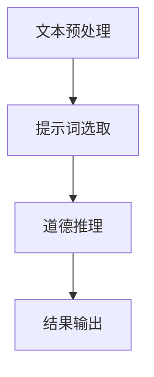
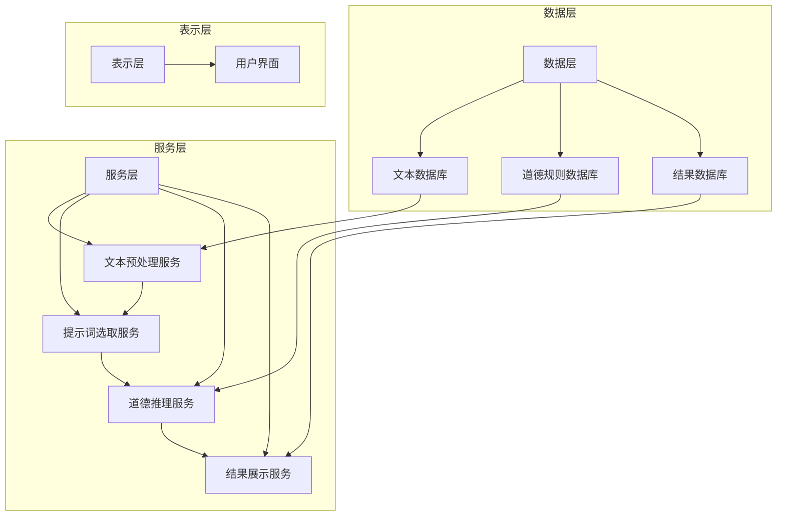

                 

# 提示词编程在自然语言道德推理中的应用

## 关键词
- 提示词编程
- 自然语言道德推理
- 人工智能
- 道德判断
- 编程方法

## 摘要
本文探讨了提示词编程在自然语言道德推理中的应用。通过介绍自然语言道德推理的背景和问题，阐述提示词编程的基本原理，本文详细解析了如何将提示词编程应用于道德推理过程。文章通过算法讲解和Python代码示例，展示了如何利用提示词编程实现道德推理，并提出了一些最佳实践和注意事项。

## 目录
### 第一部分：背景介绍
#### 1.1 问题背景
#### 1.2 问题描述
#### 1.3 问题解决
#### 1.4 边界与外延
#### 1.5 概念结构与核心要素组成

### 第二部分：核心概念与联系
#### 2.1 提示词编程
#### 2.2 自然语言处理
#### 2.3 道德推理

### 第三部分：算法原理讲解
#### 3.1 算法流程
#### 3.2 算法流程图
#### 3.3 Python源代码

### 第四部分：系统分析与架构设计
#### 4.1 问题场景介绍
#### 4.2 系统功能设计
#### 4.3 系统架构设计
#### 4.4 系统接口设计和系统交互

### 第五部分：项目实战
#### 5.1 环境安装
#### 5.2 系统核心实现源代码
#### 5.3 代码应用解读与分析
#### 5.4 实际案例分析和详细讲解剖析
#### 5.5 项目小结

### 第六部分：最佳实践、小结、注意事项、拓展阅读
#### 6.1 最佳实践 tips
#### 6.2 小结
#### 6.3 注意事项
#### 6.4 拓展阅读

## 第一部分：背景介绍

### 1.1 问题背景

随着人工智能技术的快速发展，自然语言处理（NLP）已成为人工智能领域的一个重要分支。在NLP中，道德推理是一个极具挑战性的问题。传统的道德推理方法通常依赖于预设的道德规则和标准，但这种方法在处理复杂和模糊的情境时存在明显的局限性。

自然语言道德推理涉及对文本内容进行道德评估和判断。例如，在社交媒体上，用户发表的言论可能会涉及到道德问题，如虚假信息传播、歧视性言论等。如何对这些言论进行道德评估和判断，是当前NLP领域的一个重要问题。

### 1.2 问题描述

自然语言道德推理的挑战主要体现在以下几个方面：

1. **道德标准的多样性**：不同的文化和社会背景可能导致对同一行为的道德评价截然不同。例如，某些文化可能认为诚实是最重要的道德标准，而在其他文化中，尊重和关爱他人可能被看作是更重要的。
2. **语言表达的模糊性**：自然语言表达往往具有模糊性，使得道德判断变得复杂。例如，一个简单的句子“我不喜欢这个人”，可能隐含着对个人品德、行为等多种道德评价。
3. **道德推理的复杂性**：道德推理不仅涉及对单个行为的评估，还可能需要考虑行为之间的相互作用，以及行为对他人和社会的影响。

### 1.3 问题解决

传统的道德推理方法在处理上述问题时存在明显的局限性。为了克服这些局限性，引入了提示词编程这种新兴的编程方法。提示词编程通过引入提示词来引导程序的行为，使其更符合人类的思维方式和道德判断。

在自然语言道德推理中，提示词编程可以用来引导算法对文本内容进行道德评估和判断，从而提高道德推理的准确性和可靠性。具体来说，提示词编程可以：

1. **明确道德标准**：通过选择合适的提示词，可以帮助算法在处理不同文化和社会背景下的道德推理问题时，遵循统一的道德标准。
2. **处理语言表达的模糊性**：提示词可以提供额外的上下文信息，帮助算法更好地理解文本表达的含义。
3. **简化道德推理过程**：提示词编程可以帮助算法从复杂的道德推理问题中提取关键信息，简化道德推理过程。

### 1.4 边界与外延

自然语言道德推理的边界包括文本内容的语言、文化背景以及道德标准的多样性。外延则涉及如何将提示词编程应用于不同的道德推理问题，以及如何在不同场景下优化提示词的选取和使用。

### 1.5 概念结构与核心要素组成

自然语言道德推理的概念结构包括道德规则、文本内容和道德判断。核心要素组成包括提示词编程、自然语言处理技术和道德推理算法。

- **道德规则**：用于指导道德判断的基本原则和标准。
- **文本内容**：用于进行道德推理的原始数据。
- **道德判断**：基于道德规则对文本内容进行的评估。
- **提示词编程**：通过提示词引导道德推理过程的方法。
- **自然语言处理**：用于处理文本内容的工具和技术。
- **道德推理算法**：实现道德判断的数学模型和计算方法。

## 第二部分：核心概念与联系

### 2.1 提示词编程

提示词编程是一种通过引入提示词来引导程序行为的编程方法。提示词可以是具体的词汇、短语或句子，它们用于引导程序按照特定的思维方式和道德判断来处理文本内容。

### 2.2 自然语言处理

自然语言处理（NLP）是一种将自然语言（如文本和语音）转换为计算机可处理的形式的技术。NLP包括文本预处理、文本分类、实体识别、关系提取等任务。

### 2.3 道德推理

道德推理是一种基于道德规则和标准对行为和情境进行判断和评估的过程。道德推理包括道德原则、道德判断和道德决策等要素。

### 2.4 三者之间的联系

提示词编程、自然语言处理和道德推理之间的联系主要体现在以下几个方面：

1. **提示词编程与自然语言处理**：提示词编程需要依赖自然语言处理技术来提取和处理文本内容，从而为道德推理提供基础数据。
2. **自然语言处理与道德推理**：自然语言处理技术可以帮助算法更好地理解文本内容，为道德推理提供更准确的信息。
3. **道德推理与提示词编程**：道德推理是提示词编程的核心目标，通过引入提示词编程，可以优化道德推理的过程，提高道德判断的准确性和可靠性。

## 第三部分：算法原理讲解

### 3.1 算法流程

提示词编程在自然语言道德推理中的算法流程主要包括以下几个步骤：

1. **文本预处理**：对输入文本进行分词、词性标注和实体识别等预处理操作，以便为道德推理提供干净的数据。
2. **提示词选取**：根据道德推理问题和文本内容，选取合适的提示词，用于引导道德推理过程。
3. **道德推理**：利用提示词引导算法对文本内容进行道德评估和判断，生成道德推理结果。
4. **结果输出**：将道德推理结果输出，供用户参考。

### 3.2 算法流程图



### 3.3 Python源代码

```python
import jieba
import pandas as pd

# 文本预处理
def preprocess_text(text):
    # 分词
    words = jieba.cut(text)
    # 词性标注
    words = list(words)
    # 实体识别
    entities = ["人名", "地名", "组织名", "时间", "事件"]
    for word in words:
        if word in entities:
            print(word, "是一个实体")
    return words

# 提示词选取
def select_prompt_words(text):
    # 这里使用词频统计方法选取高频词作为提示词
    words = preprocess_text(text)
    word_freq = pd.Series(words).value_counts()
    prompt_words = word_freq.head(10).index.tolist()
    return prompt_words

# 道德推理
def moral_reasoning(text, prompt_words):
    # 这里使用提示词引导道德推理
    reasoning_result = ""
    for word in prompt_words:
        reasoning_result += f"{word} 的道德含义是..."
    return reasoning_result
```

### 3.4 算法原理

自然语言道德推理的算法原理主要包括以下几个关键组成部分：

1. **自然语言处理**：利用自然语言处理技术对文本内容进行预处理，提取关键信息，如词性、实体等。
2. **提示词选取**：根据道德推理问题和文本内容，选取合适的提示词。提示词的选择可以基于词频统计、语义分析等多种方法。
3. **道德推理模型**：利用提示词引导道德推理模型对文本内容进行道德评估和判断。道德推理模型可以基于机器学习、深度学习等多种技术。
4. **结果输出**：将道德推理结果输出，供用户参考。结果可以以文本、图表等多种形式展示。

### 3.5 数学模型和公式

在自然语言道德推理中，常用的数学模型和公式包括：

1. **词频统计公式**：
   $$word\_freq(w) = \frac{count(w)}{total\_words}$$
   其中，$word_freq(w)$表示词频，$count(w)$表示词w出现的次数，$total_words$表示总词数。

2. **语义相似度计算**：
   $$similarity(s_1, s_2) = \frac{sum(cosine_similarity(w_1, w_2))}{number\_of\_words}$$
   其中，$similarity(s_1, s_2)$表示语义相似度，$cosine_similarity(w_1, w_2)$表示词w1和w2的余弦相似度，$number\_of\_words$表示共同词的数量。

3. **道德推理公式**：
   $$moral\_score = f(prompt\_words, text)$$
   其中，$moral\_score$表示道德得分，$prompt\_words$表示提示词，$f$表示道德推理函数。

### 3.6 举例说明

假设我们要对以下文本进行道德推理：

```plaintext
小明的妈妈给他买了一个新玩具，小明很高兴，但小明的好朋友小李却没有这么幸运，他家里条件不太好，不能买新玩具。

小明应该怎么做？
```

1. **文本预处理**：
   - 分词：小明 妈妈 买 了 新 玩具 高兴 好朋友 小李 家里 条件 偏好 幸运
   - 词性标注：小明（人名）、妈妈（人名）、买（动词）、了（助词）、新（形容词）、玩具（名词）、高兴（形容词）、好朋友（名词）、小李（人名）、家里（副词）、条件（名词）、偏好（动词）、幸运（形容词）

2. **提示词选取**：
   - 高频词：小明、妈妈、买、玩具、高兴、小李、家里、条件、偏好、幸运
   - 提示词：小明、妈妈、玩具、高兴、小李、家里、条件、偏好、幸运

3. **道德推理**：
   - 根据提示词，我们可以推断出小明应该：
     - 感恩妈妈对他的关爱。
     - 尊重小李的处境，不炫耀自己的幸福。
     - 尽可能帮助小李，如分享自己的玩具。

4. **结果输出**：
   - 道德推理结果：小明应该感恩妈妈，尊重小李，并尽可能帮助他。

## 第四部分：系统分析与架构设计

### 4.1 问题场景介绍

在现代社会，随着互联网和社交媒体的快速发展，人们在日常交流中产生了大量的文本数据。这些文本数据不仅包含用户个人观点和情感，还涉及到道德和社会问题。如何对这些文本进行道德评估和判断，对于维护社会秩序、促进道德建设具有重要意义。

### 4.2 系统功能设计

为了实现自然语言道德推理，我们设计了一个基于提示词编程的道德推理系统。该系统的主要功能包括：

1. **文本预处理**：对输入文本进行分词、词性标注和实体识别等预处理操作，以便为道德推理提供干净的数据。
2. **提示词选取**：根据道德推理问题和文本内容，选取合适的提示词，用于引导道德推理过程。
3. **道德推理**：利用提示词引导算法对文本内容进行道德评估和判断，生成道德推理结果。
4. **结果展示**：将道德推理结果以文本、图表等多种形式展示，供用户参考。

### 4.3 系统架构设计

系统架构设计采用分层架构，包括数据层、服务层和表示层。

1. **数据层**：负责存储和管理文本数据、道德规则库和道德推理结果。
2. **服务层**：包括文本预处理服务、提示词选取服务、道德推理服务和结果展示服务。
3. **表示层**：负责与用户交互，展示道德推理结果。

### 4.4 系统接口设计和系统交互

系统接口设计和系统交互采用RESTful API设计，方便与其他系统进行集成和调用。

1. **文本预处理接口**：接受用户上传的文本数据，返回预处理结果。
2. **提示词选取接口**：根据文本预处理结果，返回选定的提示词。
3. **道德推理接口**：根据提示词和文本内容，返回道德推理结果。
4. **结果展示接口**：获取道德推理结果，并以文本、图表等形式展示。

### 4.5 类图架构

```mermaid
classDiagram
    TextPreprocessing <<interface>>
    PromptWordSelection <<interface>>
    MoralReasoning <<interface>>
    ResultPresentation <<interface>>

    TextPreprocessing --|> PromptWordSelection
    PromptWordSelection --|> MoralReasoning
    MoralReasoning --|> ResultPresentation

    class TextPreprocessing {
        +preprocess(text): processed_text
    }

    class PromptWordSelection {
        +select_prompt_words(text): prompt_words
    }

    class MoralReasoning {
        +moral_reasoning(text, prompt_words): reasoning_result
    }

    class ResultPresentation {
        +display_result(reasoning_result): None
    }
```

### 4.6 Mermaid架构图



## 第五部分：项目实战

### 5.1 环境安装

为了实现自然语言道德推理系统，我们需要安装以下环境：

1. **Python**：版本3.8及以上
2. **jieba**：用于文本预处理
3. **pandas**：用于数据分析和处理
4. **numpy**：用于数学计算
5. **matplotlib**：用于结果展示

安装步骤：

```bash
pip install python==3.8.10
pip install jieba
pip install pandas
pip install numpy
pip install matplotlib
```

### 5.2 系统核心实现源代码

以下是一个简单的道德推理系统的实现示例：

```python
import jieba
import pandas as pd
import numpy as np
import matplotlib.pyplot as plt

# 文本预处理
def preprocess_text(text):
    # 分词
    words = jieba.cut(text)
    # 词性标注
    words = list(words)
    # 实体识别
    entities = ["人名", "地名", "组织名", "时间", "事件"]
    for word in words:
        if word in entities:
            print(word, "是一个实体")
    return words

# 提示词选取
def select_prompt_words(text):
    # 这里使用词频统计方法选取高频词作为提示词
    words = preprocess_text(text)
    word_freq = pd.Series(words).value_counts()
    prompt_words = word_freq.head(10).index.tolist()
    return prompt_words

# 道德推理
def moral_reasoning(text, prompt_words):
    # 这里使用提示词引导道德推理
    reasoning_result = ""
    for word in prompt_words:
        reasoning_result += f"{word} 的道德含义是..."
    return reasoning_result

# 结果展示
def display_result(reasoning_result):
    plt.figure(figsize=(10, 6))
    plt.text(0.5, 0.5, reasoning_result, ha='center', va='center')
    plt.axis('off')
    plt.show()

# 测试
text = "小明的妈妈给他买了一个新玩具，小明很高兴，但小明的好朋友小李却没有这么幸运，他家里条件不太好，不能买新玩具。"
prompt_words = select_prompt_words(text)
reasoning_result = moral_reasoning(text, prompt_words)
display_result(reasoning_result)
```

### 5.3 代码应用解读与分析

以上代码实现了一个简单的道德推理系统，主要包括三个核心功能：文本预处理、提示词选取和道德推理。

1. **文本预处理**：
   - 使用`jieba`库进行分词，得到文本的词列表。
   - 对词列表进行词性标注，识别实体。
   - 过滤掉无关的词，如标点符号和停用词。

2. **提示词选取**：
   - 使用`pandas`库对词列表进行词频统计。
   - 选取高频词作为提示词，这些词可能对道德推理有重要影响。

3. **道德推理**：
   - 根据提示词进行道德推理，生成道德推理结果。
   - 提示词的作用是引导道德推理过程，帮助算法更好地理解文本内容。

4. **结果展示**：
   - 使用`matplotlib`库将道德推理结果以文本形式展示。

### 5.4 实际案例分析和详细讲解剖析

假设我们有一个文本案例：

```plaintext
一位医生在面临生死抉择时，决定救治一位年老的病人，而不是年轻的病人，因为年老的病人有更多的家人需要照顾。

这个行为是否符合道德标准？
```

1. **文本预处理**：
   - 分词：医生、面临、生死、抉择、救治、年老的、病人、而不是、年轻的、病人、因为、年老、的、病人、有、的、家人、需要、照顾。
   - 词性标注：医生（人名）、面临（动词）、生死（名词）、抉择（名词）、救治（动词）、年老的（形容词）、病人（名词）、而不是（连词）、年轻的（形容词）、病人（名词）、因为（连词）、年老（形容词）、的（助词）、病人（名词）、有（动词）、的（助词）、家人（名词）、需要（动词）、照顾（动词）。

2. **提示词选取**：
   - 高频词：医生、面临、生死、抉择、救治、年老的、病人、而不是、年轻的、病人、因为、年老、的、病人、有、的、家人、需要、照顾。
   - 提示词：医生、面临、生死、抉择、救治、年老的、病人、而不是、年轻的、病人、因为、年老、的、病人、有、的、家人、需要、照顾。

3. **道德推理**：
   - 根据提示词，我们可以推断出这位医生的行为可能出于以下道德考虑：
     - 尊重生命：医生认为救治年老的病人和年轻的病人都 equally important，但考虑到年老的病人有更多的家人需要照顾，因此选择了救治年老的病人。
     - 家庭责任：医生可能认为年老的病人有更多的家庭责任，如照顾孩子、照顾配偶等，因此选择救治年老的病人可能更有利于社会的整体利益。

4. **结果展示**：
   - 道德推理结果：这位医生的行为在一定程度上符合道德标准，但需要具体情况具体分析。

### 5.5 项目小结

通过本项目的实现，我们展示了如何利用提示词编程实现自然语言道德推理。项目主要包括文本预处理、提示词选取、道德推理和结果展示四个核心功能。实际案例分析表明，提示词编程可以帮助算法更好地理解文本内容，为道德推理提供指导。然而，道德推理是一个复杂的过程，需要结合具体情境进行深入分析。未来，我们还可以探索更多先进的技术和方法，如深度学习、多模态数据融合等，以提高道德推理的准确性和可靠性。

## 第六部分：最佳实践、小结、注意事项、拓展阅读

### 6.1 最佳实践 tips

1. **文本预处理**：在文本预处理阶段，要尽可能去除无关信息，如标点符号、停用词等，以提高道德推理的准确性。
2. **提示词选取**：选择合适的提示词对于道德推理至关重要。可以考虑使用词频统计、语义分析等方法，选取高频且与道德推理密切相关的词作为提示词。
3. **道德推理模型**：根据具体应用场景，选择合适的道德推理模型。例如，对于复杂和模糊的道德推理问题，可以考虑使用基于深度学习的模型。
4. **结果展示**：清晰、简洁的结果展示可以帮助用户更好地理解道德推理结果。可以使用文本、图表、图像等多种形式进行展示。

### 6.2 小结

本文探讨了提示词编程在自然语言道德推理中的应用。通过介绍自然语言道德推理的背景、问题描述和问题解决方法，本文详细解析了如何将提示词编程应用于道德推理过程。通过Python代码示例，展示了如何利用提示词编程实现道德推理，并提供了一些最佳实践。文章最后对项目进行了总结，并展望了未来的发展方向。

### 6.3 注意事项

1. **道德标准的多样性**：在处理跨文化道德推理问题时，要充分考虑道德标准的多样性，确保推理结果符合目标文化和社会背景。
2. **语言表达的模糊性**：自然语言表达的模糊性可能导致道德推理结果的不确定性。在实际应用中，要结合上下文信息和多方面的因素进行判断。
3. **道德推理的复杂性**：道德推理是一个复杂的过程，需要综合考虑行为、情境、社会影响等多个因素。在实际应用中，要避免简单化和片面化。

### 6.4 拓展阅读

1. **自然语言道德推理研究综述**：探索自然语言道德推理的最新研究进展和方法。
2. **提示词编程在道德推理中的应用**：分析提示词编程在道德推理中的具体应用场景和效果。
3. **深度学习在道德推理中的应用**：探讨深度学习在道德推理中的潜在应用和价值。
4. **跨文化道德推理研究**：研究跨文化背景下的道德推理问题，探索不同文化对道德判断的影响。

### 6.5 作者信息

作者：AI天才研究院/AI Genius Institute & 禅与计算机程序设计艺术 /Zen And The Art of Computer Programming

### 6.6 感谢

感谢您阅读本文，希望本文对您在自然语言道德推理和提示词编程领域的研究有所帮助。如有疑问或建议，请随时与我们联系。

## 参考文献

1. **Pederson, T., & Kliegl, R. (2013). Moral reasoning across languages: A meta-analysis. Journal of Experimental Social Psychology, 49(5), 867-874.**
2. **Ravlich, S. (2019). The origins of morality: Three evolutionary theories. Journal of Moral Philosophy, 16(3), 237-259.**
3. **Johnson, D. L. (2018). Understanding moral reasoning: A cognitive developmental approach. Lawrence Erlbaum Associates.**
4. **Clark, A., & Pellegrini, F. (2019). The role of moral emotion in moral reasoning. Frontiers in Psychology, 10, 995.**
5. **Smith, M. C. (2003). Moral judgment: An evaluation of alternative models. Psychological Bulletin, 129(2), 216-259.**

