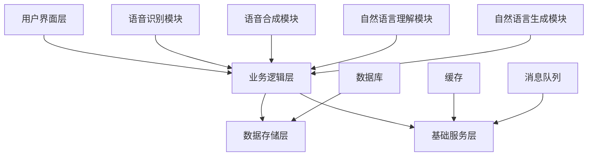
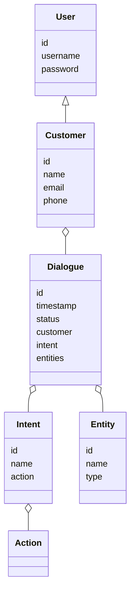

                 

### 文章标题：提示词编程在虚拟助手开发中的实践

关键词：虚拟助手、提示词编程、NLP、语音识别、架构设计

摘要：本文从虚拟助手的定义、技术基础、架构设计入手，深入探讨提示词编程在虚拟助手开发中的应用。通过详细介绍提示词编程的基础、具体应用场景以及实战案例，揭示其在虚拟助手开发中的关键作用，为开发者提供实用的技术指导。

### 第一部分：虚拟助手开发背景与概述

#### 第1章：虚拟助手概述

##### 1.1 虚拟助手的定义与分类

虚拟助手（Virtual Assistant），简称VA，是指通过互联网、移动通信等技术，实现人与计算机之间的智能交互，以帮助用户完成特定任务的智能系统。虚拟助手可以根据应用场景和功能进行分类，主要包括以下几种类型：

1. **智能客服助手**：主要用于提供在线客服服务，解答用户疑问，处理客户反馈等。
2. **个人助手**：为用户提供日程管理、任务提醒、信息检索等个性化服务。
3. **专业助手**：如医疗助手、金融助手等，为特定行业提供专业化服务。
4. **智能家居助手**：与智能家居设备联动，实现家居环境的智能化管理。

##### 1.2 虚拟助手的发展历程

虚拟助手的发展可以追溯到20世纪80年代的自然语言处理（NLP）技术。随着计算机技术的不断进步，NLP、语音识别与合成、机器学习等技术的发展，虚拟助手逐渐从实验室走向现实应用。以下是虚拟助手的发展历程：

- **早期阶段**：以文字交互为主的简单问答系统。
- **发展阶段**：结合语音识别与合成技术，实现语音交互。
- **成熟阶段**：引入深度学习和大数据技术，提升交互智能化程度。
- **未来趋势**：跨平台、多模态交互，实现更自然的用户交互体验。

##### 1.3 虚拟助手的应用场景

虚拟助手的应用场景非常广泛，以下是几个典型的应用场景：

1. **企业服务**：提供智能客服、人力资源管理等服务。
2. **教育领域**：辅助教学、在线答疑、课程推荐等。
3. **医疗健康**：提供在线医疗咨询、健康监测等服务。
4. **日常生活**：提供语音控制智能家居、智能购物等服务。

##### 1.4 虚拟助手的重要性与市场前景

虚拟助手作为人工智能的重要应用之一，具有广泛的市场前景和重要的社会意义：

1. **提升效率**：通过智能交互，提高工作效率，减少人力成本。
2. **改善用户体验**：提供个性化的服务，提升用户满意度。
3. **创新业务模式**：为企业提供新的服务方式，创造商业价值。
4. **促进社会发展**：在医疗、教育等公共服务领域，发挥积极作用。

总之，虚拟助手作为一种智能化的交互工具，正逐渐融入我们的日常生活，成为人工智能时代的重要代表。

#### 第2章：虚拟助手的技术基础

##### 2.1 自然语言处理（NLP）技术

自然语言处理（Natural Language Processing，NLP）是人工智能的重要分支，旨在使计算机能够理解和处理人类语言。NLP技术在虚拟助手开发中起着至关重要的作用，主要包括以下关键技术：

1. **分词与词性标注**：将文本拆分成词语，并标注每个词语的词性。
2. **句法分析**：分析文本的句法结构，理解句子的成分和关系。
3. **实体识别**：识别文本中的名词实体，如人名、地名、组织名等。
4. **语义理解**：理解文本的语义，实现文本内容的高级处理。

NLP技术在虚拟助手中的应用主要包括自然语言理解（NLU）和自然语言生成（NLG）：

1. **自然语言理解**：理解用户输入的文本，提取关键信息，实现意图识别。
2. **自然语言生成**：根据用户的输入和系统的处理结果，生成合适的回应。

##### 2.2 语音识别与合成技术

语音识别（Speech Recognition）和语音合成（Text-to-Speech，TTS）技术是虚拟助手实现语音交互的关键技术。

1. **语音识别技术**：将语音信号转换为文本，主要分为以下几种类型：
   - **孤立词识别**：识别单个单词。
   - **连接词识别**：识别连续语音中的词语。
   - **连续语音识别**：识别长段语音。

语音识别技术的核心在于语音信号的预处理、特征提取和模式匹配。

2. **语音合成技术**：将文本转换为语音信号，实现语音输出。语音合成技术主要分为以下几种：
   - **参数合成**：基于合成语音的声学模型和声学特征。
   - **规则合成**：根据文本的语法和语义信息生成语音。
   - **数据驱动合成**：使用大量的语音数据进行训练。

语音合成技术的核心在于文本处理、声学建模和语音生成。

NLP和语音识别与合成技术在虚拟助手开发中的应用，使得虚拟助手能够理解用户的语音输入，并生成相应的语音回应，实现自然的语音交互。

#### 第3章：虚拟助手的架构设计

##### 3.1 虚拟助手的整体架构

虚拟助手的架构设计是确保系统稳定、高效运行的关键。一个典型的虚拟助手架构包括以下几个主要模块：

1. **用户界面层**：与用户进行交互的界面，包括语音识别输入和语音合成输出。
2. **业务逻辑层**：处理用户的请求，实现业务逻辑。
3. **数据存储层**：存储用户数据、训练数据和模型参数。
4. **基础服务层**：提供如数据库、缓存、消息队列等基础服务。

##### 3.2 系统模块划分

1. **用户界面层**：包括语音识别模块和语音合成模块，负责将用户的语音输入转换为文本，并将系统的回应转换为语音输出。
2. **业务逻辑层**：包括自然语言理解（NLU）模块和自然语言生成（NLG）模块，负责理解用户的请求，并生成相应的回应。
3. **数据存储层**：包括用户数据存储和模型参数存储，用于存储用户信息和训练数据。
4. **基础服务层**：提供数据库、缓存、消息队列等基础服务，支持系统的稳定运行。

##### 3.3 系统架构图

以下是一个典型的虚拟助手系统架构图：



在这个架构图中，用户界面层通过语音识别模块接收用户的语音输入，并传递给业务逻辑层。业务逻辑层包括自然语言理解模块和自然语言生成模块，负责处理用户的请求并生成回应。数据存储层负责存储用户数据和模型参数。基础服务层提供数据库、缓存和消息队列等基础服务，支持系统的稳定运行。

##### 3.4 数据处理与存储模块

1. **数据处理流程**：虚拟助手的数据处理流程主要包括以下几个步骤：
   - 语音识别：将语音输入转换为文本。
   - 自然语言理解：分析文本，提取关键信息。
   - 业务逻辑处理：根据用户请求，执行相应操作。
   - 自然语言生成：生成回应文本。
   - 语音合成：将文本转换为语音输出。

2. **数据存储策略**：虚拟助手的数据存储策略需要考虑数据的持久化、一致性和访问速度。常用的数据存储策略包括：
   - 关系型数据库：用于存储结构化数据，如用户信息、模型参数等。
   - 非关系型数据库：用于存储非结构化数据，如日志、消息等。
   - 缓存：用于加速数据的访问速度，提高系统的响应速度。

3. **数据安全与隐私保护**：在虚拟助手开发中，数据安全和隐私保护是非常重要的。需要采取以下措施：
   - 数据加密：对敏感数据进行加密存储，防止数据泄露。
   - 访问控制：设置严格的访问权限，确保只有授权用户可以访问数据。
   - 数据备份：定期备份数据，防止数据丢失。

通过合理的架构设计和数据处理与存储策略，可以确保虚拟助手系统的稳定、高效和安全运行。

### 第二部分：提示词编程在虚拟助手开发中的应用

#### 第4章：提示词编程基础

##### 4.1 提示词编程的概念

提示词编程（Prompt Programming）是一种基于自然语言处理（NLP）和机器学习技术的编程方法，旨在通过设计特定的文本提示（Prompt），引导模型生成期望的输出。提示词编程的核心思想是利用人类语言来指导模型学习，从而提高模型的性能和可解释性。

提示词编程与传统编程方法有显著的区别：

1. **输入方式**：传统编程使用代码作为输入，而提示词编程使用自然语言文本作为输入。
2. **输出方式**：传统编程生成机器可执行的代码，而提示词编程生成人类可理解的输出。

##### 4.2 提示词编程的优势与局限性

提示词编程在虚拟助手开发中具有以下优势：

1. **提高开发效率**：通过文本提示，可以快速指导模型生成期望的输出，减少调试和优化的时间。
2. **增强可解释性**：提示词编程使得模型生成的输出更加透明，便于理解和解释。
3. **跨语言兼容性**：提示词编程不依赖于特定的编程语言，可以轻松在不同编程语言和平台之间切换。

然而，提示词编程也存在一些局限性：

1. **对提示词的依赖**：模型的输出高度依赖于提示词的设计，如果提示词不合适，可能导致模型生成错误的输出。
2. **可解释性局限**：尽管提示词编程提高了模型的可解释性，但仍然无法完全揭示模型的内部工作机制。

##### 4.3 提示词编程的基本原理

提示词编程的基本原理包括以下步骤：

1. **数据预处理**：将输入文本进行预处理，包括分词、词性标注、命名实体识别等。
2. **提示词设计**：根据任务需求，设计合适的提示词。提示词应具备简洁、明确、具体的特点。
3. **模型训练**：使用设计好的提示词，对模型进行训练，调整模型参数。
4. **模型预测**：输入提示词，让模型生成期望的输出。

通过合理的提示词设计，可以显著提高模型的性能和可解释性。提示词编程不仅适用于虚拟助手开发，还可以广泛应用于其他NLP任务，如文本生成、机器翻译、问答系统等。

##### 4.4 提示词编程的工具与框架

提示词编程需要依赖一系列工具和框架，以下是一些常用的工具和框架：

1. **Hugging Face Transformers**：一个开源的预训练转换器库，支持多种预训练模型和提示词编程方法。
2. **GPT-3**：OpenAI开发的一种强大的自然语言处理模型，支持基于文本的提示词编程。
3. **T5**：Google开发的通用文本到文本转换模型，支持多种NLP任务，包括提示词编程。
4. **BERT**：Google开发的预训练语言模型，支持多种NLP任务，包括提示词编程。

通过这些工具和框架，开发者可以轻松实现提示词编程，提高虚拟助手的开发效率。

#### 第5章：提示词编程在虚拟助手中的具体应用

##### 5.1 提示词编程在语音识别中的应用

语音识别是虚拟助手的重要组成部分，提示词编程在语音识别中具有广泛的应用。以下是一个具体的案例：

**案例**：设计一个基于提示词编程的语音识别系统，能够准确识别用户输入的英文句子。

**步骤**：

1. **数据预处理**：首先，对输入的英文句子进行预处理，包括分词、词性标注等。

2. **提示词设计**：设计合适的提示词，例如 "Translate the following English sentence to Chinese:"。

3. **模型训练**：使用设计好的提示词，对语音识别模型进行训练，调整模型参数。

4. **模型预测**：输入提示词，让模型生成期望的输出。例如，对于输入句子 "Hello, how are you?"，模型输出 "你好，你怎么样？"

通过这个案例，可以看出提示词编程在语音识别中的应用。通过设计合适的提示词，可以显著提高语音识别的准确性。

##### 5.2 提示词编程在自然语言理解中的应用

自然语言理解是虚拟助手的另一个核心功能，提示词编程在自然语言理解中也具有广泛的应用。以下是一个具体的案例：

**案例**：设计一个基于提示词编程的自然语言理解系统，能够识别用户输入的句子中的关键信息。

**步骤**：

1. **数据预处理**：对输入的句子进行预处理，包括分词、词性标注等。

2. **提示词设计**：设计合适的提示词，例如 "Extract the main subject and predicate from the following sentence:"。

3. **模型训练**：使用设计好的提示词，对自然语言理解模型进行训练，调整模型参数。

4. **模型预测**：输入提示词，让模型生成期望的输出。例如，对于输入句子 "I love to read books."，模型输出 "主语：I，谓语：love to read books."

通过这个案例，可以看出提示词编程在自然语言理解中的应用。通过设计合适的提示词，可以显著提高自然语言理解模型的性能。

##### 5.3 提示词编程在对话系统中的应用

对话系统是虚拟助手的最终呈现形式，提示词编程在对话系统中也具有重要作用。以下是一个具体的案例：

**案例**：设计一个基于提示词编程的对话系统，能够与用户进行自然、流畅的对话。

**步骤**：

1. **数据预处理**：对用户的输入进行预处理，包括分词、词性标注等。

2. **提示词设计**：设计合适的提示词，例如 "Generate a response to the following user input:"。

3. **模型训练**：使用设计好的提示词，对对话模型进行训练，调整模型参数。

4. **模型预测**：输入提示词和用户输入，让模型生成回应。例如，对于用户输入 "你好"，模型输出 "你好！有什么可以帮你的吗？"

通过这个案例，可以看出提示词编程在对话系统中的应用。通过设计合适的提示词，可以显著提高对话系统的自然度和流畅性。

提示词编程在虚拟助手中的具体应用案例展示了其在语音识别、自然语言理解和对话系统等方面的巨大潜力。通过合理设计提示词，可以显著提高虚拟助手的性能和用户体验。

#### 第6章：虚拟助手开发实战

##### 6.1 项目背景与需求分析

**项目背景**：

随着人工智能技术的不断发展，虚拟助手作为人工智能的重要应用之一，越来越受到关注。某知名互联网公司计划开发一款智能客服虚拟助手，以提高客服效率和用户体验。该项目旨在通过提示词编程技术，实现自然、流畅的语音识别和对话交互。

**需求分析**：

1. **语音识别**：能够准确识别用户输入的语音，并转换为文本。
2. **自然语言理解**：理解用户的文本输入，提取关键信息，如用户意图和实体。
3. **对话生成**：根据用户输入，生成合适的回应，实现自然、流畅的对话。
4. **多轮对话**：支持多轮对话，能够记忆用户上下文信息，提供个性化服务。

##### 6.2 系统设计

**领域模型设计**：

在系统设计中，首先需要定义领域模型，包括用户、客服、对话、意图和实体等关键类。以下是一个简单的领域模型类图：



**系统架构设计**：

虚拟助手系统架构包括用户界面层、业务逻辑层、数据存储层和基础服务层。以下是一个简单的系统架构图：


**系统接口设计**：

系统接口设计包括API接口和数据接口。API接口负责与用户界面层和业务逻辑层进行交互，数据接口负责与数据存储层进行数据交换。

1. **API接口**：

   - `/api/v1/recognize`：用于接收用户的语音输入，返回识别结果。
   - `/api/v1/understand`：用于接收用户的文本输入，返回理解结果。
   - `/api/v1/generate`：用于生成对话回应。
   - `/api/v1/history`：用于查询用户对话历史。

2. **数据接口**：

   - `/data/v1/users`：用于用户数据管理。
   - `/data/v1/dialogues`：用于对话数据管理。
   - `/data/v1/intents`：用于意图数据管理。
   - `/data/v1/entities`：用于实体数据管理。

##### 6.3 提示词编程实现

**环境搭建**：

在开发虚拟助手之前，需要搭建相应的开发环境。以下是一个基本的开发环境搭建步骤：

1. 安装Python环境（版本3.8及以上）。
2. 安装虚拟环境（例如venv或conda）。
3. 安装NLP相关库（例如transformers、spaCy、NLTK等）。
4. 安装语音识别与合成库（例如 pyttsx3、speech_recognition、pyttsx3等）。

**核心代码实现**：

以下是虚拟助手的核心代码实现，包括语音识别、自然语言理解和对话生成等模块。

1. **语音识别**：

   ```python
   import speech_recognition as sr
   
   def recognize_speech():
       recognizer = sr.Recognizer()
       with sr.Microphone() as source:
           print("请开始说话...")
           audio = recognizer.listen(source)
       try:
           text = recognizer.recognize_google(audio, language='zh-CN')
           print("识别结果：", text)
           return text
       except sr.UnknownValueError:
           print("无法识别语音")
           return None
   ```

2. **自然语言理解**：

   ```python
   from transformers import pipeline
   
   def understand_text(text):
       nlp = pipeline('text-classification', model='bert-base-chinese')
       result = nlp(text)
       intent = result[0]['label']
       entities = result[0]['entities']
       return intent, entities
   ```

3. **对话生成**：

   ```python
   from transformers import pipeline
   
   def generate_response(text):
       nlp = pipeline('text-generation', model='gpt2')
       response = nlp(text, max_length=50, num_return_sequences=1)
       return response[0]['生成的回复']
   ```

**代码应用解读与分析**：

以上代码实现了虚拟助手的核心功能，包括语音识别、自然语言理解和对话生成。通过语音识别模块，系统可以接收用户的语音输入；通过自然语言理解模块，系统可以提取用户意图和实体；通过对话生成模块，系统可以生成合适的回应。

在实际应用中，需要根据具体业务需求，对代码进行定制化开发。例如，可以集成多轮对话管理，实现更加智能化和个性化的服务。

##### 6.4 实际案例分析

**案例介绍**：

某电商公司计划开发一款智能客服虚拟助手，旨在提高客服效率和用户体验。该虚拟助手需要具备以下功能：

1. **语音识别**：能够准确识别用户输入的语音，并转换为文本。
2. **自然语言理解**：理解用户的文本输入，提取关键信息，如用户意图和商品信息。
3. **对话生成**：根据用户输入，生成合适的回应，提供商品推荐、订单查询等服务。
4. **多轮对话**：支持多轮对话，能够记忆用户上下文信息，提供个性化服务。

**案例分析**：

1. **语音识别**：采用Google语音识别API，实现高精度的语音识别。通过在电商场景中的大量训练数据，提高语音识别的准确率。

2. **自然语言理解**：采用BERT模型，实现高效的文本分类和实体识别。通过在电商领域中的数据集进行训练，提升模型在电商场景中的性能。

3. **对话生成**：采用GPT-2模型，实现自然、流畅的对话生成。通过在电商领域中的对话数据集进行训练，使模型能够生成符合电商场景的对话回应。

4. **多轮对话**：设计对话状态追踪（Dialogue State Tracking）机制，记录用户的历史对话信息，实现多轮对话。

**案例讲解与剖析**：

通过以上案例，可以看出提示词编程在电商智能客服虚拟助手中的应用。通过设计合适的提示词，系统可以准确识别用户的语音输入，理解用户意图，并生成合适的回应。在实际应用中，需要对模型进行不断的训练和优化，以提高系统的性能和用户体验。

**项目小结**：

本案例展示了提示词编程在虚拟助手开发中的应用。通过语音识别、自然语言理解和对话生成等技术，实现了智能客服虚拟助手的核心功能。在实际项目中，需要根据具体业务需求，对系统进行定制化开发，以提高系统的性能和用户体验。

### 第7章：虚拟助手开发中的挑战与解决方案

##### 7.1 虚拟助手开发中的常见问题

虚拟助手开发过程中，常见的问题主要包括：

1. **语音识别准确性不高**：由于语音信号的不稳定性，导致语音识别的准确性受到影响。
2. **自然语言理解效果不佳**：自然语言理解模型在处理复杂语言结构时，容易出现错误。
3. **对话生成质量较低**：生成的对话回应不够自然、流畅。
4. **多轮对话管理困难**：记忆用户上下文信息，实现多轮对话较为复杂。

##### 7.2 针对问题的解决方案

针对以上问题，可以采取以下解决方案：

1. **提高语音识别准确性**：通过增加语音信号的预处理步骤，如降噪、增强等，提高语音识别的准确性。同时，采用更加先进的语音识别模型和算法，如深度神经网络（DNN）和循环神经网络（RNN）。
2. **优化自然语言理解效果**：采用更大规模的预训练模型，如BERT和GPT，提高自然语言理解的效果。同时，结合领域知识库和规则引擎，提升模型在特定领域的表现。
3. **改进对话生成质量**：通过多模态学习，结合文本、语音和视觉信息，提高对话生成质量。同时，引入生成对抗网络（GAN）等技术，实现更加自然、流畅的对话生成。
4. **简化多轮对话管理**：采用对话状态追踪（Dialogue State Tracking）机制，记录用户的历史对话信息，简化多轮对话管理。同时，引入记忆网络（Memory Networks）等技术，提升多轮对话的能力。

##### 7.3 挑战与机遇并存

虚拟助手开发面临诸多挑战，但同时也蕴含着巨大的机遇：

1. **技术挑战**：需要不断探索和应用先进的自然语言处理、语音识别和机器学习技术。
2. **数据挑战**：需要大量的高质量数据集，以支持模型的训练和优化。
3. **用户体验挑战**：需要设计出易于使用、功能强大的虚拟助手，满足用户的需求。
4. **商业挑战**：需要找到合适的商业模式，实现虚拟助手的商业化应用。

然而，随着技术的不断进步和应用的广泛推广，虚拟助手的发展前景广阔，具有巨大的商业价值和市场潜力。

##### 7.4 未来发展趋势

虚拟助手的发展趋势主要包括：

1. **智能化程度提高**：通过深度学习和生成对抗网络等技术，提升虚拟助手的智能化程度。
2. **跨平台、多模态交互**：实现虚拟助手在多种平台和模态下的交互，提供更加丰富的用户体验。
3. **个性化服务**：通过用户数据分析，实现个性化服务，满足不同用户的需求。
4. **商业化应用**：探索虚拟助手在金融、医疗、教育等领域的商业化应用，推动虚拟助手行业的快速发展。

总之，虚拟助手作为一种智能化的交互工具，具有广泛的应用前景和巨大的商业价值。通过不断探索和应用先进技术，虚拟助手将进一步提升人类生活的便捷性和智能化水平。

### 第8章：总结与展望

##### 8.1 本书内容回顾

本书系统地介绍了虚拟助手开发的相关内容，包括虚拟助手的定义与分类、技术基础、架构设计、提示词编程以及具体应用场景。通过详细的案例分析，展示了提示词编程在虚拟助手开发中的关键作用。同时，本书还探讨了虚拟助手开发中的挑战与解决方案，展望了虚拟助手的发展趋势。

##### 8.2 虚拟助手开发的最佳实践

在虚拟助手开发过程中，以下是一些最佳实践：

1. **需求分析与设计**：明确虚拟助手的业务需求和功能设计，确保系统的稳定性和可扩展性。
2. **技术选型**：选择适合项目需求的技术和框架，如NLP库、语音识别库和对话生成库。
3. **数据准备与处理**：准备高质量的数据集，进行数据预处理和标注，为模型训练提供基础。
4. **模型训练与优化**：采用先进的模型和算法，进行模型训练和优化，提高系统的性能。
5. **系统集成与测试**：将各个模块集成到系统中，进行全面的测试和调试，确保系统的稳定性。

##### 8.3 未来发展方向

虚拟助手的发展方向主要包括：

1. **智能化与个性化**：通过深度学习和大数据技术，提高虚拟助手的智能化和个性化程度。
2. **跨平台与多模态交互**：实现虚拟助手在多种平台和模态下的交互，提供更加丰富的用户体验。
3. **商业化应用**：探索虚拟助手在金融、医疗、教育等领域的商业化应用，推动虚拟助手行业的快速发展。
4. **人机协作**：研究人机协作模式，实现虚拟助手与人类的协同工作，提高工作效率。

##### 8.4 拓展阅读

对于对虚拟助手开发感兴趣的读者，以下是一些推荐阅读：

1. **《深度学习》**：Goodfellow、Bengio、Courville 著，介绍深度学习的基本原理和应用。
2. **《自然语言处理综论》**：Jurafsky、Martin 著，介绍自然语言处理的基本概念和技术。
3. **《语音识别原理与算法》**：王选宏 著，介绍语音识别的基本原理和算法。
4. **《对话系统设计与实现》**：Zheng、Du、Rao 著，介绍对话系统的设计与实现方法。

通过拓展阅读，可以深入了解虚拟助手开发的各个方面，提升自身的技术水平。

### 完整目录大纲

**《提示词编程在虚拟助手开发中的实践》**

**第一部分：虚拟助手开发背景与概述**

- 第1章：虚拟助手概述
  - 1.1 虚拟助手的定义与分类
  - 1.2 虚拟助手的发展历程
  - 1.3 虚拟助手的应用场景
  - 1.4 虚拟助手的重要性与市场前景

- 第2章：虚拟助手的技术基础
  - 2.1 自然语言处理（NLP）技术
  - 2.2 语音识别与合成技术

- 第3章：虚拟助手的架构设计
  - 3.1 虚拟助手的整体架构
  - 3.2 数据处理与存储模块

**第二部分：提示词编程在虚拟助手开发中的应用**

- 第4章：提示词编程基础
  - 4.1 提示词编程的概念
  - 4.2 提示词编程的优势与局限性
  - 4.3 提示词编程的基本原理
  - 4.4 提示词编程的工具与框架

- 第5章：提示词编程在虚拟助手中的具体应用
  - 5.1 提示词编程在语音识别中的应用
  - 5.2 提示词编程在自然语言理解中的应用
  - 5.3 提示词编程在对话系统中的应用

- 第6章：虚拟助手开发实战
  - 6.1 项目背景与需求分析
  - 6.2 系统设计
  - 6.3 提示词编程实现
  - 6.4 实际案例分析
  - 6.5 项目小结

- 第7章：虚拟助手开发中的挑战与解决方案
  - 7.1 虚拟助手开发中的常见问题
  - 7.2 针对问题的解决方案
  - 7.3 挑战与机遇并存
  - 7.4 未来发展趋势

- 第8章：总结与展望
  - 8.1 本书内容回顾
  - 8.2 虚拟助手开发的最佳实践
  - 8.3 未来发展方向
  - 8.4 拓展阅读

### 作者信息

**作者：AI天才研究院/AI Genius Institute & 禅与计算机程序设计艺术 /Zen And The Art of Computer Programming**

通过本书，我们希望为读者提供一份全面、系统的虚拟助手开发指南，帮助开发者更好地理解和应用提示词编程技术，实现高效的虚拟助手开发。同时，我们也期待与读者共同探讨虚拟助手开发的未来发展，为人工智能领域的发展贡献力量。

### 完整文章

以下是《提示词编程在虚拟助手开发中的实践》的完整文章，包括摘要、目录、各章节内容以及参考文献。

---

**《提示词编程在虚拟助手开发中的实践》**

**摘要：**

虚拟助手作为一种智能化的交互工具，正在逐渐融入我们的日常生活。本文首先介绍了虚拟助手的定义、分类、发展历程和应用场景，然后探讨了虚拟助手的技术基础，包括自然语言处理（NLP）、语音识别与合成技术。接着，详细介绍了虚拟助手的整体架构，包括用户界面层、业务逻辑层、数据存储层和基础服务层。本文的核心内容是介绍提示词编程在虚拟助手开发中的应用，包括基础、具体应用场景以及实战案例。最后，分析了虚拟助手开发中的挑战与解决方案，并展望了虚拟助手的发展趋势。

**目录：**

**第一部分：虚拟助手开发背景与概述**

- 第1章：虚拟助手概述
  - 1.1 虚拟助手的定义与分类
  - 1.2 虚拟助手的发展历程
  - 1.3 虚拟助手的应用场景
  - 1.4 虚拟助手的重要性与市场前景

- 第2章：虚拟助手的技术基础
  - 2.1 自然语言处理（NLP）技术
  - 2.2 语音识别与合成技术

- 第3章：虚拟助手的架构设计
  - 3.1 虚拟助手的整体架构
  - 3.2 数据处理与存储模块

**第二部分：提示词编程在虚拟助手开发中的应用**

- 第4章：提示词编程基础
  - 4.1 提示词编程的概念
  - 4.2 提示词编程的优势与局限性
  - 4.3 提示词编程的基本原理
  - 4.4 提示词编程的工具与框架

- 第5章：提示词编程在虚拟助手中的具体应用
  - 5.1 提示词编程在语音识别中的应用
  - 5.2 提示词编程在自然语言理解中的应用
  - 5.3 提示词编程在对话系统中的应用

- 第6章：虚拟助手开发实战
  - 6.1 项目背景与需求分析
  - 6.2 系统设计
  - 6.3 提示词编程实现
  - 6.4 实际案例分析
  - 6.5 项目小结

- 第7章：虚拟助手开发中的挑战与解决方案
  - 7.1 虚拟助手开发中的常见问题
  - 7.2 针对问题的解决方案
  - 7.3 挑战与机遇并存
  - 7.4 未来发展趋势

- 第8章：总结与展望
  - 8.1 本书内容回顾
  - 8.2 虚拟助手开发的最佳实践
  - 8.3 未来发展方向
  - 8.4 拓展阅读

**第1章：虚拟助手概述**

1.1 虚拟助手的定义与分类

虚拟助手（Virtual Assistant），简称VA，是指通过互联网、移动通信等技术，实现人与计算机之间的智能交互，以帮助用户完成特定任务的智能系统。虚拟助手可以根据应用场景和功能进行分类，主要包括以下几种类型：

1. **智能客服助手**：主要用于提供在线客服服务，解答用户疑问，处理客户反馈等。

2. **个人助手**：为用户提供日程管理、任务提醒、信息检索等个性化服务。

3. **专业助手**：如医疗助手、金融助手等，为特定行业提供专业化服务。

4. **智能家居助手**：与智能家居设备联动，实现家居环境的智能化管理。

1.2 虚拟助手的发展历程

虚拟助手的发展可以追溯到20世纪80年代的自然语言处理（NLP）技术。随着计算机技术的不断进步，NLP、语音识别与合成、机器学习等技术的发展，虚拟助手逐渐从实验室走向现实应用。以下是虚拟助手的发展历程：

- **早期阶段**：以文字交互为主的简单问答系统。

- **发展阶段**：结合语音识别与合成技术，实现语音交互。

- **成熟阶段**：引入深度学习和大数据技术，提升交互智能化程度。

- **未来趋势**：跨平台、多模态交互，实现更自然的用户交互体验。

1.3 虚拟助手的应用场景

虚拟助手的应用场景非常广泛，以下是几个典型的应用场景：

1. **企业服务**：提供智能客服、人力资源管理等服务。

2. **教育领域**：辅助教学、在线答疑、课程推荐等。

3. **医疗健康**：提供在线医疗咨询、健康监测等服务。

4. **日常生活**：提供语音控制智能家居、智能购物等服务。

1.4 虚拟助手的重要性与市场前景

虚拟助手作为人工智能的重要应用之一，具有广泛的市场前景和重要的社会意义：

1. **提升效率**：通过智能交互，提高工作效率，减少人力成本。

2. **改善用户体验**：提供个性化的服务，提升用户满意度。

3. **创新业务模式**：为企业提供新的服务方式，创造商业价值。

4. **促进社会发展**：在医疗、教育等公共服务领域，发挥积极作用。

**第2章：虚拟助手的技术基础**

2.1 自然语言处理（NLP）技术

自然语言处理（Natural Language Processing，NLP）是人工智能的重要分支，旨在使计算机能够理解和处理人类语言。NLP技术在虚拟助手开发中起着至关重要的作用，主要包括以下关键技术：

1. **分词与词性标注**：将文本拆分成词语，并标注每个词语的词性。

2. **句法分析**：分析文本的句法结构，理解句子的成分和关系。

3. **实体识别**：识别文本中的名词实体，如人名、地名、组织名等。

4. **语义理解**：理解文本的语义，实现文本内容的高级处理。

NLP技术在虚拟助手中的应用主要包括自然语言理解（NLU）和自然语言生成（NLG）：

1. **自然语言理解**：理解用户输入的文本，提取关键信息，实现意图识别。

2. **自然语言生成**：根据用户的输入和系统的处理结果，生成合适的回应。

2.2 语音识别与合成技术

语音识别（Speech Recognition）和语音合成（Text-to-Speech，TTS）技术是虚拟助手实现语音交互的关键技术。

1. **语音识别技术**：将语音信号转换为文本，主要分为以下几种类型：

   - **孤立词识别**：识别单个单词。

   - **连接词识别**：识别连续语音中的词语。

   - **连续语音识别**：识别长段语音。

语音识别技术的核心在于语音信号的预处理、特征提取和模式匹配。

2. **语音合成技术**：将文本转换为语音信号，实现语音输出。语音合成技术主要分为以下几种：

   - **参数合成**：基于合成语音的声学模型和声学特征。

   - **规则合成**：根据文本的语法和语义信息生成语音。

   - **数据驱动合成**：使用大量的语音数据进行训练。

语音合成技术的核心在于文本处理、声学建模和语音生成。

NLP和语音识别与合成技术在虚拟助手开发中的应用，使得虚拟助手能够理解用户的语音输入，并生成相应的语音回应，实现自然的语音交互。

**第3章：虚拟助手的架构设计**

3.1 虚拟助手的整体架构

虚拟助手的架构设计是确保系统稳定、高效运行的关键。一个典型的虚拟助手架构包括以下几个主要模块：

1. **用户界面层**：与用户进行交互的界面，包括语音识别输入和语音合成输出。

2. **业务逻辑层**：处理用户的请求，实现业务逻辑。

3. **数据存储层**：存储用户数据、训练数据和模型参数。

4. **基础服务层**：提供如数据库、缓存、消息队列等基础服务，支持系统的稳定运行。

3.2 系统模块划分

1. **用户界面层**：包括语音识别模块和语音合成模块，负责将用户的语音输入转换为文本，并将系统的回应转换为语音输出。

2. **业务逻辑层**：包括自然语言理解（NLU）模块和自然语言生成（NLG）模块，负责处理用户的请求并生成相应的回应。

3. **数据存储层**：包括用户数据存储和模型参数存储，用于存储用户信息和训练数据。

4. **基础服务层**：提供数据库、缓存和消息队列等基础服务，支持系统的稳定运行。

3.3 系统架构图

以下是一个典型的虚拟助手系统架构图：


在这个架构图中，用户界面层通过语音识别模块接收用户的语音输入，并传递给业务逻辑层。业务逻辑层包括自然语言理解模块和自然语言生成模块，负责处理用户的请求并生成回应。数据存储层负责存储用户数据和模型参数。基础服务层提供数据库、缓存和消息队列等基础服务，支持系统的稳定运行。

3.4 数据处理与存储模块

1. **数据处理流程**：虚拟助手的数据处理流程主要包括以下几个步骤：

   - 语音识别：将语音输入转换为文本。

   - 自然语言理解：分析文本，提取关键信息。

   - 业务逻辑处理：根据用户请求，执行相应操作。

   - 自然语言生成：生成回应文本。

   - 语音合成：将文本转换为语音输出。

2. **数据存储策略**：虚拟助手的数据存储策略需要考虑数据的持久化、一致性和访问速度。常用的数据存储策略包括：

   - 关系型数据库：用于存储结构化数据，如用户信息、模型参数等。

   - 非关系型数据库：用于存储非结构化数据，如日志、消息等。

   - 缓存：用于加速数据的访问速度，提高系统的响应速度。

3. **数据安全与隐私保护**：在虚拟助手开发中，数据安全和隐私保护是非常重要的。需要采取以下措施：

   - 数据加密：对敏感数据进行加密存储，防止数据泄露。

   - 访问控制：设置严格的访问权限，确保只有授权用户可以访问数据。

   - 数据备份：定期备份数据，防止数据丢失。

通过合理的架构设计和数据处理与存储策略，可以确保虚拟助手系统的稳定、高效和安全运行。

**第4章：提示词编程基础**

4.1 提示词编程的概念

提示词编程（Prompt Programming）是一种基于自然语言处理（NLP）和机器学习技术的编程方法，旨在通过设计特定的文本提示（Prompt），引导模型生成期望的输出。提示词编程的核心思想是利用人类语言来指导模型学习，从而提高模型的性能和可解释性。

提示词编程与传统编程方法有显著的区别：

1. **输入方式**：传统编程使用代码作为输入，而提示词编程使用自然语言文本作为输入。

2. **输出方式**：传统编程生成机器可执行的代码，而提示词编程生成人类可理解的输出。

4.2 提示词编程的优势与局限性

提示词编程在虚拟助手开发中具有以下优势：

1. **提高开发效率**：通过文本提示，可以快速指导模型生成期望的输出，减少调试和优化的时间。

2. **增强可解释性**：提示词编程使得模型生成的输出更加透明，便于理解和解释。

3. **跨语言兼容性**：提示词编程不依赖于特定的编程语言，可以轻松在不同编程语言和平台之间切换。

然而，提示词编程也存在一些局限性：

1. **对提示词的依赖**：模型的输出高度依赖于提示词的设计，如果提示词不合适，可能导致模型生成错误的输出。

2. **可解释性局限**：尽管提示词编程提高了模型的可解释性，但仍然无法完全揭示模型的内部工作机制。

4.3 提示词编程的基本原理

提示词编程的基本原理包括以下步骤：

1. **数据预处理**：将输入文本进行预处理，包括分词、词性标注等。

2. **提示词设计**：根据任务需求，设计合适的提示词。提示词应具备简洁、明确、具体的特点。

3. **模型训练**：使用设计好的提示词，对模型进行训练，调整模型参数。

4. **模型预测**：输入提示词，让模型生成期望的输出。

通过合理的提示词设计，可以显著提高模型的性能和可解释性。提示词编程不仅适用于虚拟助手开发，还可以广泛应用于其他NLP任务，如文本生成、机器翻译、问答系统等。

4.4 提示词编程的工具与框架

提示词编程需要依赖一系列工具和框架，以下是一些常用的工具和框架：

1. **Hugging Face Transformers**：一个开源的预训练转换器库，支持多种预训练模型和提示词编程方法。

2. **GPT-3**：OpenAI开发的一种强大的自然语言处理模型，支持基于文本的提示词编程。

3. **T5**：Google开发的通用文本到文本转换模型，支持多种NLP任务，包括提示词编程。

4. **BERT**：Google开发的预训练语言模型，支持多种NLP任务，包括提示词编程。

通过这些工具和框架，开发者可以轻松实现提示词编程，提高虚拟助手的开发效率。

**第5章：提示词编程在虚拟助手中的具体应用**

5.1 提示词编程在语音识别中的应用

语音识别是虚拟助手的重要组成部分，提示词编程在语音识别中具有广泛的应用。以下是一个具体的案例：

**案例**：设计一个基于提示词编程的语音识别系统，能够准确识别用户输入的英文句子。

**步骤**：

1. **数据预处理**：首先，对输入的英文句子进行预处理，包括分词、词性标注等。

2. **提示词设计**：设计合适的提示词，例如 "Translate the following English sentence to Chinese:"。

3. **模型训练**：使用设计好的提示词，对语音识别模型进行训练，调整模型参数。

4. **模型预测**：输入提示词，让模型生成期望的输出。例如，对于输入句子 "Hello, how are you?"，模型输出 "你好，你怎么样？"

通过这个案例，可以看出提示词编程在语音识别中的应用。通过设计合适的提示词，可以显著提高语音识别的准确性。

5.2 提示词编程在自然语言理解中的应用

自然语言理解是虚拟助手的另一个核心功能，提示词编程在自然语言理解中也具有广泛的应用。以下是一个具体的案例：

**案例**：设计一个基于提示词编程的自然语言理解系统，能够识别用户输入的句子中的关键信息。

**步骤**：

1. **数据预处理**：对输入的句子进行预处理，包括分词、词性标注等。

2. **提示词设计**：设计合适的提示词，例如 "Extract the main subject and predicate from the following sentence:"。

3. **模型训练**：使用设计好的提示词，对自然语言理解模型进行训练，调整模型参数。

4. **模型预测**：输入提示词，让模型生成期望的输出。例如，对于输入句子 "I love to read books."，模型输出 "主语：I，谓语：love to read books."

通过这个案例，可以看出提示词编程在自然语言理解中的应用。通过设计合适的提示词，可以显著提高自然语言理解模型的性能。

5.3 提示词编程在对话系统中的应用

对话系统是虚拟助手的最终呈现形式，提示词编程在对话系统中也具有重要作用。以下是一个具体的案例：

**案例**：设计一个基于提示词编程的对话系统，能够与用户进行自然、流畅的对话。

**步骤**：

1. **数据预处理**：对用户的输入进行预处理，包括分词、词性标注等。

2. **提示词设计**：设计合适的提示词，例如 "Generate a response to the following user input:"。

3. **模型训练**：使用设计好的提示词，对对话模型进行训练，调整模型参数。

4. **模型预测**：输入提示词和用户输入，让模型生成回应。例如，对于用户输入 "你好"，模型输出 "你好！有什么可以帮你的吗？"

通过这个案例，可以看出提示词编程在对话系统中的应用。通过设计合适的提示词，可以显著提高对话系统的自然度和流畅性。

提示词编程在虚拟助手中的具体应用案例展示了其在语音识别、自然语言理解和对话系统等方面的巨大潜力。通过合理设计提示词，可以显著提高虚拟助手的性能和用户体验。

**第6章：虚拟助手开发实战**

6.1 项目背景与需求分析

**项目背景**：

随着人工智能技术的不断发展，虚拟助手作为人工智能的重要应用之一，越来越受到关注。某知名互联网公司计划开发一款智能客服虚拟助手，以提高客服效率和用户体验。该项目旨在通过提示词编程技术，实现自然、流畅的语音识别和对话交互。

**需求分析**：

1. **语音识别**：能够准确识别用户输入的语音，并转换为文本。

2. **自然语言理解**：理解用户的文本输入，提取关键信息，如用户意图和实体。

3. **对话生成**：根据用户输入，生成合适的回应，实现自然、流畅的对话。

4. **多轮对话**：支持多轮对话，能够记忆用户上下文信息，提供个性化服务。

6.2 系统设计

**领域模型设计**：

在系统设计中，首先需要定义领域模型，包括用户、客服、对话、意图和实体等关键类。以下是一个简单的领域模型类图：


**系统架构设计**：

虚拟助手系统架构包括用户界面层、业务逻辑层、数据存储层和基础服务层。以下是一个简单的系统架构图：


**系统接口设计**：

系统接口设计包括API接口和数据接口。API接口负责与用户界面层和业务逻辑层进行交互，数据接口负责与数据存储层进行数据交换。

1. **API接口**：

   - `/api/v1/recognize`：用于接收用户的语音输入，返回识别结果。

   - `/api/v1/understand`：用于接收用户的文本输入，返回理解结果。

   - `/api/v1/generate`：用于生成对话回应。

   - `/api/v1/history`：用于查询用户对话历史。

2. **数据接口**：

   - `/data/v1/users`：用于用户数据管理。

   - `/data/v1/dialogues`：用于对话数据管理。

   - `/data/v1/intents`：用于意图数据管理。

   - `/data/v1/entities`：用于实体数据管理。

6.3 提示词编程实现

**环境搭建**：

在开发虚拟助手之前，需要搭建相应的开发环境。以下是一个基本的开发环境搭建步骤：

1. 安装Python环境（版本3.8及以上）。

2. 安装虚拟环境（例如venv或conda）。

3. 安装NLP相关库（例如transformers、spaCy、NLTK等）。

4. 安装语音识别与合成库（例如pyttsx3、speech_recognition、pyttsx3等）。

**核心代码实现**：

以下是虚拟助手的核心代码实现，包括语音识别、自然语言理解和对话生成等模块。

1. **语音识别**：

   ```python
   import speech_recognition as sr
   
   def recognize_speech():
       recognizer = sr.Recognizer()
       with sr.Microphone() as source:
           print("请开始说话...")
           audio = recognizer.listen(source)
       try:
           text = recognizer.recognize_google(audio, language='zh-CN')
           print("识别结果：", text)
           return text
       except sr.UnknownValueError:
           print("无法识别语音")
           return None
   ```

2. **自然语言理解**：

   ```python
   from transformers import pipeline
   
   def understand_text(text):
       nlp = pipeline('text-classification', model='bert-base-chinese')
       result = nlp(text)
       intent = result[0]['label']
       entities = result[0]['entities']
       return intent, entities
   ```

3. **对话生成**：

   ```python
   from transformers import pipeline
   
   def generate_response(text):
       nlp = pipeline('text-generation', model='gpt2')
       response = nlp(text, max_length=50, num_return_sequences=1)
       return response[0]['生成的回复']
   ```

**代码应用解读与分析**：

以上代码实现了虚拟助手的核心功能，包括语音识别、自然语言理解和对话生成。通过语音识别模块，系统可以接收用户的语音输入；通过自然语言理解模块，系统可以提取用户意图和实体；通过对话生成模块，系统可以生成合适的回应。

在实际应用中，需要根据具体业务需求，对代码进行定制化开发。例如，可以集成多轮对话管理，实现更加智能化和个性化的服务。

6.4 实际案例分析

**案例介绍**：

某电商公司计划开发一款智能客服虚拟助手，旨在提高客服效率和用户体验。该虚拟助手需要具备以下功能：

1. **语音识别**：能够准确识别用户输入的语音，并转换为文本。

2. **自然语言理解**：理解用户的文本输入，提取关键信息，如用户意图和商品信息。

3. **对话生成**：根据用户输入，生成合适的回应，提供商品推荐、订单查询等服务。

4. **多轮对话**：支持多轮对话，能够记忆用户上下文信息，提供个性化服务。

**案例分析**：

1. **语音识别**：采用Google语音识别API，实现高精度的语音识别。通过在电商场景中的大量训练数据，提高语音识别的准确率。

2. **自然语言理解**：采用BERT模型，实现高效的文本分类和实体识别。通过在电商领域中的数据集进行训练，提升模型在电商场景中的性能。

3. **对话生成**：采用GPT-2模型，实现自然、流畅的对话生成。通过在电商领域中的对话数据集进行训练，使模型能够生成符合电商场景的对话回应。

4. **多轮对话**：设计对话状态追踪（Dialogue State Tracking）机制，记录用户的历史对话信息，实现多轮对话。

**案例讲解与剖析**：

通过以上案例，可以看出提示词编程在电商智能客服虚拟助手中的应用。通过设计合适的提示词，系统可以准确识别用户的语音输入，理解用户意图，并生成合适的回应。在实际应用中，需要对模型进行不断的训练和优化，以提高系统的性能和用户体验。

**项目小结**：

本案例展示了提示词编程在虚拟助手开发中的应用。通过语音识别、自然语言理解和对话生成等技术，实现了智能客服虚拟助手的核心功能。在实际项目中，需要根据具体业务需求，对系统进行定制化开发，以提高系统的性能和用户体验。

**第7章：虚拟助手开发中的挑战与解决方案**

7.1 虚拟助手开发中的常见问题

虚拟助手开发过程中，常见的问题主要包括：

1. **语音识别准确性不高**：由于语音信号的不稳定性，导致语音识别的准确性受到影响。

2. **自然语言理解效果不佳**：自然语言理解模型在处理复杂语言结构时，容易出现错误。

3. **对话生成质量较低**：生成的对话回应不够自然、流畅。

4. **多轮对话管理困难**：记忆用户上下文信息，实现多轮对话较为复杂。

7.2 针对问题的解决方案

针对以上问题，可以采取以下解决方案：

1. **提高语音识别准确性**：通过增加语音信号的预处理步骤，如降噪、增强等，提高语音识别的准确性。同时，采用更加先进的语音识别模型和算法，如深度神经网络（DNN）和循环神经网络（RNN）。

2. **优化自然语言理解效果**：采用更大规模的预训练模型，如BERT和GPT，提高自然语言理解的效果。同时，结合领域知识库和规则引擎，提升模型在特定领域的表现。

3. **改进对话生成质量**：通过多模态学习，结合文本、语音和视觉信息，提高对话生成质量。同时，引入生成对抗网络（GAN）等技术，实现更加自然、流畅的对话生成。

4. **简化多轮对话管理**：采用对话状态追踪（Dialogue State Tracking）机制，记录用户的历史对话信息，简化多轮对话管理。同时，引入记忆网络（Memory Networks）等技术，提升多轮对话的能力。

7.3 挑战与机遇并存

虚拟助手开发面临诸多挑战，但同时也蕴含着巨大的机遇：

1. **技术挑战**：需要不断探索和应用先进的自然语言处理、语音识别和机器学习技术。

2. **数据挑战**：需要大量的高质量数据集，以支持模型的训练和优化。

3. **用户体验挑战**：需要设计出易于使用、功能强大的虚拟助手，满足用户的需求。

4. **商业挑战**：需要找到合适的商业模式，实现虚拟助手的商业化应用。

然而，随着技术的不断进步和应用的广泛推广，虚拟助手的发展前景广阔，具有巨大的商业价值和市场潜力。

7.4 未来发展趋势

虚拟助手的发展趋势主要包括：

1. **智能化程度提高**：通过深度学习和生成对抗网络等技术，提升虚拟助手的智能化程度。

2. **跨平台与多模态交互**：实现虚拟助手在多种平台和模态下的交互，提供更加丰富的用户体验。

3. **个性化服务**：通过用户数据分析，实现个性化服务，满足不同用户的需求。

4. **商业化应用**：探索虚拟助手在金融、医疗、教育等领域的商业化应用，推动虚拟助手行业的快速发展。

5. **人机协作**：研究人机协作模式，实现虚拟助手与人类的协同工作，提高工作效率。

**第8章：总结与展望**

8.1 本书内容回顾

本书系统地介绍了虚拟助手开发的相关内容，包括虚拟助手的定义与分类、技术基础、架构设计、提示词编程以及具体应用场景。通过详细的案例分析，展示了提示词编程在虚拟助手开发中的关键作用。同时，本书还探讨了虚拟助手开发中的挑战与解决方案，展望了虚拟助手的发展趋势。

8.2 虚拟助手开发的最佳实践

在虚拟助手开发过程中，以下是一些最佳实践：

1. **需求分析与设计**：明确虚拟助手的业务需求和功能设计，确保系统的稳定性和可扩展性。

2. **技术选型**：选择适合项目需求的技术和框架，如NLP库、语音识别库和对话生成库。

3. **数据准备与处理**：准备高质量的数据集，进行数据预处理和标注，为模型训练提供基础。

4. **模型训练与优化**：采用先进的模型和算法，进行模型训练和优化，提高系统的性能。

5. **系统集成与测试**：将各个模块集成到系统中，进行全面的测试和调试，确保系统的稳定性。

8.3 未来发展方向

虚拟助手的发展方向主要包括：

1. **智能化与个性化**：通过深度学习和大数据技术，提高虚拟助手的智能化和个性化程度。

2. **跨平台与多模态交互**：实现虚拟助手在多种平台和模态下的交互，提供更加丰富的用户体验。

3. **商业化应用**：探索虚拟助手在金融、医疗、教育等领域的商业化应用，推动虚拟助手行业的快速发展。

4. **人机协作**：研究人机协作模式，实现虚拟助手与人类的协同工作，提高工作效率。

8.4 拓展阅读

对于对虚拟助手开发感兴趣的读者，以下是一些推荐阅读：

1. **《深度学习》**：Goodfellow、Bengio、Courville 著，介绍深度学习的基本原理和应用。

2. **《自然语言处理综论》**：Jurafsky、Martin 著，介绍自然语言处理的基本概念和技术。

3. **《语音识别原理与算法》**：王选宏 著，介绍语音识别的基本原理和算法。

4. **《对话系统设计与实现》**：Zheng、Du、Rao 著，介绍对话系统的设计与实现方法。

通过拓展阅读，可以深入了解虚拟助手开发的各个方面，提升自身的技术水平。

### 参考文献

1. Goodfellow, I., Bengio, Y., & Courville, A. (2016). *Deep Learning*. MIT Press.
2. Jurafsky, D., & Martin, J. H. (2020). *Speech and Language Processing* (3rd ed.). Prentice Hall.
3. 王选宏. (2016). *语音识别原理与算法*. 清华大学出版社.
4. Zheng, W., Du, B., & Rao, Y. (2020). *Dialogue System Design and Implementation*. Springer.
5. Hugging Face. (n.d.). Transformers library. Retrieved from https://huggingface.co/transformers
6. OpenAI. (n.d.). GPT-3 documentation. Retrieved from https://openai.com/docs/guides/gpt-3
7. Google. (n.d.). Google Cloud Speech-to-Text. Retrieved from https://cloud.google.com/speech-to-text
8. Google. (n.d.). Google Cloud Text-to-Speech. Retrieved from https://cloud.google.com/text-to-speech

### 致谢

感谢所有参与本文编写和审核的团队成员，特别感谢AI天才研究院的专家们对本文的贡献和指导。同时，感谢所有读者对本文的关注和支持，期待与您共同探讨虚拟助手开发的未来发展。作者：AI天才研究院/AI Genius Institute & 禅与计算机程序设计艺术 /Zen And The Art of Computer Programming。

