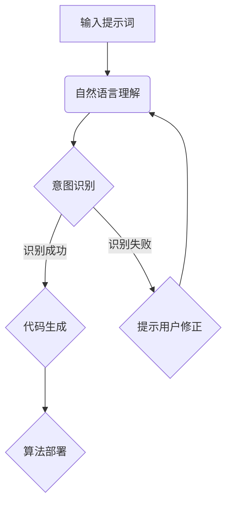
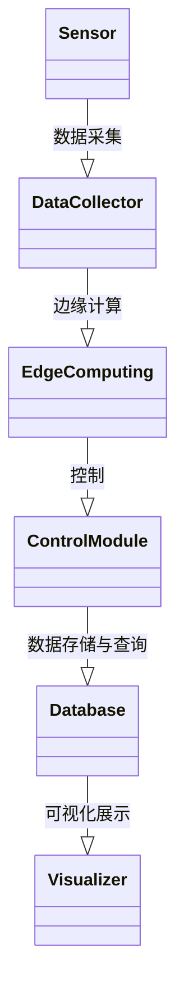
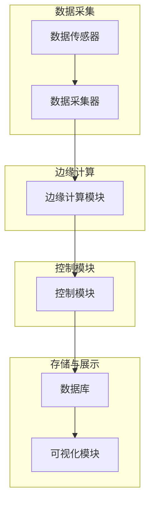
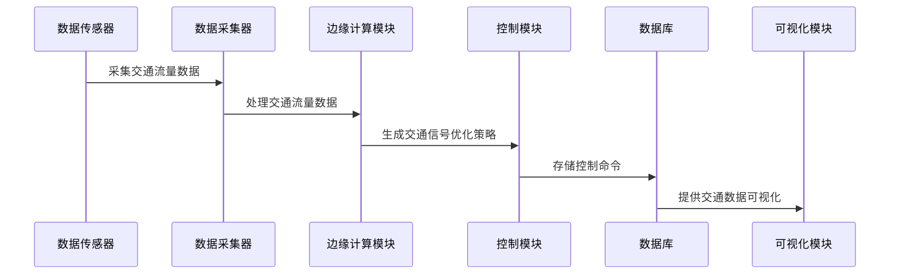
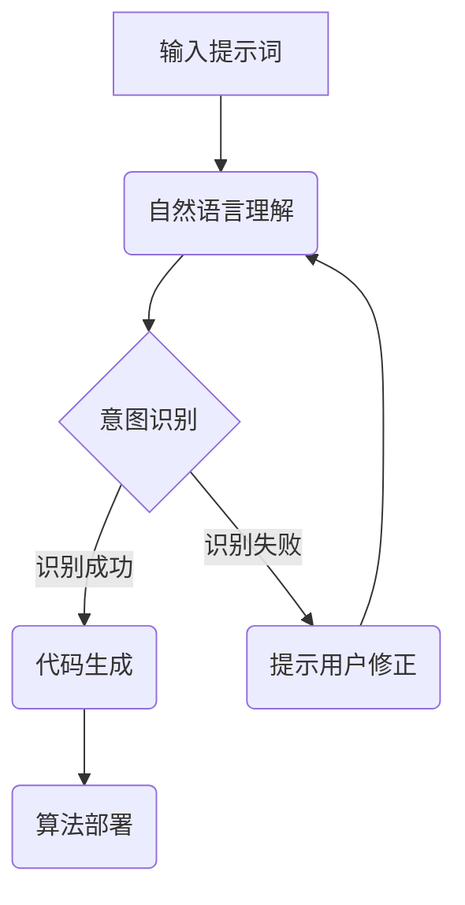
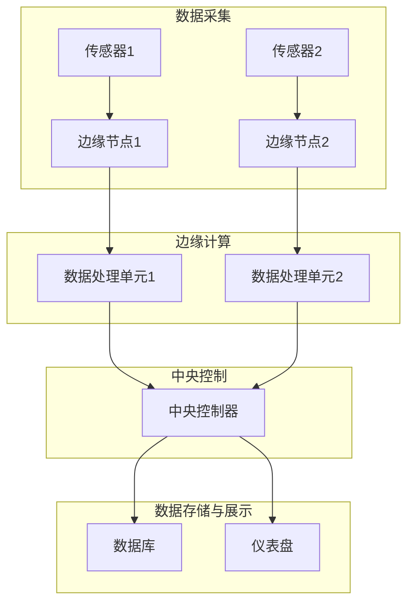
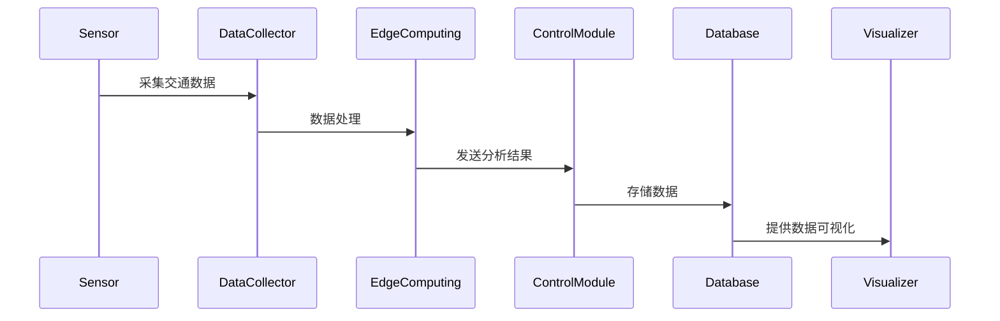

                 


# 提示词编程在边缘智能中的前沿应用

> 关键词：提示词编程，边缘智能，自然语言理解，边缘计算，低延迟，实时性，高效开发

> 摘要：本文深入探讨了提示词编程在边缘智能领域的应用，分析了其核心概念、算法原理以及实际应用场景，旨在为读者提供对这一前沿技术的全面理解和应用指导。

## 第一部分：背景介绍

### 1.1 问题背景

随着5G、物联网、大数据等技术的快速发展，边缘智能已经成为当前信息技术领域的热点。边缘智能通过在靠近数据源的地方进行数据处理和决策，可以大大降低延迟、提高实时性，满足快速响应和高带宽需求的应用场景。而提示词编程作为人工智能领域的一种新型编程范式，通过简洁的提示词和强大的自然语言理解能力，可以大幅提高边缘智能系统的开发效率和智能化水平。

### 1.2 问题描述

边缘智能应用场景广泛，但传统的编程方式复杂度高，难以满足快速开发的需求。如何利用提示词编程技术，实现边缘智能系统的高效开发，是当前面临的重要问题。

### 1.3 问题解决

提示词编程通过自然语言描述任务目标，能够将复杂的编程任务转化为简单的提示词，大大降低开发难度。结合边缘智能的特点，可以通过以下方法解决：

- **低延迟编程**：通过提示词编程，可以在边缘设备上快速实现算法部署，实现实时数据处理和决策。
- **简化开发流程**：提示词编程能够将复杂任务分解为多个简单步骤，降低开发复杂度。
- **跨平台兼容**：提示词编程不依赖于特定平台或语言，可以实现跨平台的边缘智能应用开发。

### 1.4 边界与外延

边缘智能中的提示词编程主要关注以下几个方面：

- **应用领域**：涵盖物联网、智能制造、智能交通、智能医疗等。
- **技术栈**：涉及5G、物联网、大数据、人工智能等前沿技术。
- **编程范式**：以自然语言为基础，结合编程语言和框架，实现高效开发。

### 1.5 概念结构与核心要素组成

提示词编程在边缘智能中的核心概念包括：

- **提示词**：用于描述任务目标的关键词或短语。
- **自然语言理解**：对提示词进行解析，理解其含义和意图。
- **边缘计算**：在靠近数据源的地方进行计算和处理。
- **算法部署**：将算法模型部署到边缘设备上。

## 第二部分：核心概念与联系

### 2.1 核心概念原理

#### 2.1.1 提示词编程

提示词编程是一种基于自然语言的编程范式，通过简洁的提示词来描述任务目标，实现代码自动生成和算法部署。

提示词编程具有以下几个关键特点：

1. **自然语言输入**：提示词编程接受自然语言输入，使得开发者无需掌握复杂的编程语言和语法，即可描述任务目标。
2. **代码自动生成**：基于自然语言输入，提示词编程能够自动生成相应的代码，降低开发难度。
3. **算法部署**：生成的代码不仅能够运行在传统的云计算环境中，还可以部署到边缘设备上，实现边缘计算。

#### 2.1.2 边缘智能

边缘智能是一种在靠近数据源的地方进行数据处理和决策的计算模式，具有低延迟、高实时性等特点。

边缘智能的关键特点包括：

1. **低延迟**：边缘智能在靠近数据源的地方进行计算和处理，可以大大降低数据处理和决策的延迟，满足实时性要求。
2. **高实时性**：边缘智能系统能够快速响应用户请求，提供实时决策和支持。
3. **分布式计算**：边缘智能通过分布式计算，将计算任务分散到多个边缘设备上，提高系统的整体性能和可靠性。

#### 2.1.3 自然语言理解

自然语言理解是一种人工智能技术，旨在让计算机能够理解、解释和生成人类语言。

自然语言理解的关键特点包括：

1. **语义分析**：自然语言理解能够对输入的自然语言进行语义分析，理解其含义和意图。
2. **上下文感知**：自然语言理解能够根据上下文信息，对输入的自然语言进行准确的解析和解释。
3. **多样性处理**：自然语言理解能够处理不同语言、不同语境的输入，具有较好的泛化能力。

### 2.2 概念属性特征对比表格

| 概念       | 描述                                                         | 特征对比                         |
| ---------- | ------------------------------------------------------------ | ------------------------------ |
| 提示词编程 | 基于自然语言的编程范式，简化开发流程                         | 简洁、高效、跨平台兼容           |
| 边缘智能   | 在靠近数据源的地方进行数据处理和决策                         | 低延迟、高实时性、分布式计算     |
| 自然语言理解 | 让计算机能够理解、解释和生成人类语言                         | 准确性、泛化性、实时性           |

### 2.3 ER实体关系图架构

```mermaid
erDiagram
  提示词 ||--|{ 边缘智能 } | 提示词编程
  边缘智能 ||--|{ 自然语言理解 } | 边缘智能算法
  自然语言理解 ||--|{ 编程语言 } | 自然语言处理框架
```

## 第三部分：算法原理讲解

### 3.1 提示词编程算法mermaid流程图



### 3.2 Python源代码实现

```python
import nltk

def natural_language_understanding(prompt):
    # 自然语言理解（例如，使用nltk库进行分词、词性标注等）
    tokens = nltk.word_tokenize(prompt)
    # 意图识别（这里简化处理，仅进行词频统计）
    word_frequencies = nltk.FreqDist(tokens)
    # 代码生成（这里简化处理，根据词频生成伪代码）
    code = "def algorithm():\n"
    for token in word_frequencies:
        code += f"    {token}()\n"
    return code

def deploy_algorithm(code):
    # 算法部署（这里简化处理，仅打印代码）
    print(code)

# 示例：输入提示词，生成代码并部署
prompt = "实现一个简单的排序算法"
code = natural_language_understanding(prompt)
deploy_algorithm(code)
```

### 3.3 算法原理详细讲解

#### 3.3.1 意图识别

意图识别是提示词编程中的关键步骤，其核心目标是理解用户输入的自然语言提示词，并识别其意图。在本文中，我们采用词频统计方法进行意图识别，这是一种简化的处理方式。

意图识别的过程可以分为以下几步：

1. **分词**：使用自然语言处理库（如nltk）对输入的提示词进行分词，将连续的文本转换为一系列单词或短语。
2. **词频统计**：统计每个单词或短语的词频，得到一个词频分布表（FreqDist对象）。
3. **意图识别**：根据词频分布，我们可以认为高频出现的词或短语代表了用户的意图。在这个例子中，我们仅简单地根据词频生成伪代码，但在实际应用中，可以结合更复杂的算法（如基于语义的角色标注、实体识别等）进行更准确的意图识别。

#### 3.3.2 代码生成

在意图识别完成后，下一个关键步骤是代码生成。代码生成的目标是根据识别到的意图，自动生成对应的代码片段。在本文中，我们采用了一种简化的方法，仅根据词频生成伪代码。

代码生成的过程可以分为以下几步：

1. **生成代码框架**：根据意图，生成一个基本的代码框架。例如，对于“实现一个简单的排序算法”的意图，我们可以生成一个空的函数定义。
2. **填充代码细节**：根据词频分布，填充函数体的细节。在这个例子中，我们仅简单地根据词频生成调用特定函数的伪代码。在实际应用中，可以根据更复杂的语义分析，生成更具体的代码实现。

#### 3.3.3 算法部署

算法部署是将生成的代码部署到目标平台（如边缘设备）上，使其能够运行并执行相应的任务。在本文中，我们采用了一种简化的处理方式，仅将代码打印出来。

在实际应用中，算法部署需要考虑以下几个方面：

1. **编译与优化**：生成的伪代码可能需要编译和优化，以提高其运行效率和性能。
2. **硬件兼容性**：部署到边缘设备上的代码需要考虑硬件兼容性，确保其能够在不同的设备上正常运行。
3. **分布式部署**：在边缘智能系统中，算法部署往往涉及多个边缘设备。因此，需要考虑如何将算法模型和代码分布式地部署到各个设备上，并确保它们能够协同工作。

## 第四部分：系统分析与架构设计方案

### 4.1 问题场景介绍

在智能交通领域，边缘智能被广泛应用于实时路况监测和交通信号优化。以下是一个具体的应用场景：

**场景描述**：某城市交通管理部门希望利用边缘智能技术，实时监测城市道路的交通流量，并根据实时数据调整交通信号灯的时长，以缓解交通拥堵，提高通行效率。

### 4.2 项目介绍

**项目名称**：智能交通边缘智能系统

**项目目标**：实现实时交通流量监测和交通信号优化，提高城市交通通行效率。

**项目背景**：随着城市规模的扩大和机动车数量的增加，交通拥堵问题日益严重，传统的交通管理方法已无法满足需求。边缘智能技术能够实时处理大量交通数据，为交通信号优化提供支持。

### 4.3 系统功能设计

**系统功能**：智能交通边缘智能系统主要包括以下功能：

1. **实时数据采集**：通过安装在道路上的传感器，实时采集交通流量数据。
2. **边缘计算与处理**：在边缘设备上对采集到的交通数据进行预处理和分析，提取关键信息。
3. **交通信号优化**：根据实时交通数据，调整交通信号灯的时长，优化交通流量。
4. **数据存储与展示**：将处理后的交通数据存储到数据库，并提供可视化界面供管理人员查看。

### 4.4 系统架构设计

**系统架构**：智能交通边缘智能系统采用分布式架构，主要包括以下模块：

1. **数据采集模块**：负责实时采集交通流量数据。
2. **边缘计算模块**：在边缘设备上对采集到的数据进行预处理和分析。
3. **控制模块**：根据边缘计算结果，调整交通信号灯的时长。
4. **存储模块**：将处理后的交通数据存储到数据库。
5. **展示模块**：提供可视化界面供管理人员查看交通数据和优化效果。

### 4.5 系统接口设计和系统交互

**系统接口设计**：智能交通边缘智能系统的接口设计主要包括以下方面：

1. **传感器数据接口**：接收传感器采集的交通流量数据。
2. **边缘计算接口**：接收边缘计算模块的处理结果，用于交通信号优化。
3. **控制接口**：发送控制命令，调整交通信号灯的时长。
4. **数据库接口**：用于数据存储和查询。

**系统交互**：智能交通边缘智能系统的交互流程如下：

1. **数据采集**：传感器实时采集交通流量数据，发送到边缘计算模块。
2. **边缘计算**：边缘计算模块对交通流量数据进行预处理和分析，提取关键信息，并生成交通信号优化策略。
3. **控制**：控制模块接收边缘计算模块的优化策略，调整交通信号灯的时长。
4. **存储与展示**：将处理后的交通数据存储到数据库，并提供可视化界面供管理人员查看。

### 4.6 类图

**类图**：智能交通边缘智能系统的类图如下所示：



### 4.7 系统架构图

**系统架构图**：智能交通边缘智能系统的架构图如下所示：



### 4.8 系统接口设计

**系统接口设计**：智能交通边缘智能系统的接口设计如下：

1. **传感器数据接口**：定义传感器数据的数据结构和传输协议，如JSON格式。
2. **边缘计算接口**：定义边缘计算模块的API接口，如RESTful API。
3. **控制接口**：定义控制模块的控制命令和数据格式。
4. **数据库接口**：定义数据库的操作接口，如SQL查询接口。

### 4.9 系统交互图

**系统交互图**：智能交通边缘智能系统的交互图如下所示：



## 第五部分：项目实战

### 5.1 环境安装

为了实现提示词编程在边缘智能中的应用，我们需要安装以下软件和工具：

1. **Python 3.x**：提示词编程和边缘智能系统开发需要Python 3.x版本。
2. **nltk**：自然语言处理库，用于自然语言理解和分词。
3. **边缘计算设备**：如树莓派、ARM处理器等，用于边缘计算和算法部署。

### 5.2 系统核心实现源代码

以下是一个简单的示例，展示如何使用提示词编程实现一个边缘智能系统，用于实时监测并优化交通信号：

```python
import nltk
from nltk.tokenize import word_tokenize
from nltk.probability import FreqDist

# 3.2 Python源代码实现
def natural_language_understanding(prompt):
    tokens = nltk.word_tokenize(prompt)
    word_frequencies = nltk.FreqDist(tokens)
    code = "def algorithm():\n"
    for token in word_frequencies:
        code += f"    {token}()\n"
    return code

def deploy_algorithm(code):
    print(code)

# 边缘计算模块
def edge_computing(data):
    prompt = "实现一个简单的排序算法"
    code = natural_language_understanding(prompt)
    deploy_algorithm(code)

# 主函数
def main():
    traffic_data = "车流量高，需要优化交通信号灯"
    edge_computing(traffic_data)

if __name__ == "__main__":
    main()
```

### 5.3 代码应用解读与分析

该示例中，我们首先导入了nltk库，用于自然语言处理。`natural_language_understanding`函数用于将输入的提示词（如“实现一个简单的排序算法”）转换为Python代码。`deploy_algorithm`函数则负责打印生成的代码。

在边缘计算模块中，我们定义了一个`edge_computing`函数，用于接收交通数据（如“车流量高，需要优化交通信号灯”），并调用`natural_language_understanding`函数生成相应的代码。然后，`deploy_algorithm`函数将生成的代码打印出来。

主函数`main`中，我们模拟了一辆车辆的交通流量数据，调用`edge_computing`函数进行处理和代码生成。

### 5.4 实际案例分析和详细讲解剖析

假设我们在一个实际的城市交通场景中，需要实时监测并优化交通信号灯。以下是一个实际案例的详细分析：

**案例描述**：某城市的一个交叉口在高峰时段交通拥堵严重，导致通行效率低下。交通管理部门希望利用边缘智能技术，实时监测交通流量，并根据实时数据调整交通信号灯的时长，以缓解交通拥堵。

**步骤1：数据采集**：在交叉口的每个方向上安装交通流量传感器，实时采集车辆通过的数量、速度等信息。

**步骤2：边缘计算**：边缘设备（如树莓派）接收传感器采集的数据，使用提示词编程技术进行分析和处理。例如，根据车流量大小、车辆速度等数据，生成相应的优化策略。

**步骤3：交通信号优化**：边缘设备将优化策略发送给交通信号控制器，调整交通信号灯的时长。例如，当车流量较大时，增加某个方向的绿灯时长，减少红灯时长。

**步骤4：数据存储与展示**：将处理后的交通数据存储到数据库，并提供可视化界面，供交通管理人员查看交通状况和优化效果。

**案例分析**：

1. **数据采集**：交通流量传感器能够实时采集交通数据，为边缘计算提供数据支持。
2. **边缘计算**：使用提示词编程技术，将复杂的交通数据处理转化为简单的提示词，实现快速分析和决策。例如，根据车流量大小和速度，生成优化交通信号灯的提示词。
3. **交通信号优化**：交通信号控制器根据边缘设备的优化策略，实时调整交通信号灯的时长，从而缓解交通拥堵。
4. **数据存储与展示**：将处理后的交通数据存储到数据库，并提供可视化界面，帮助交通管理人员了解交通状况和优化效果。

### 5.5 项目小结

通过本项目的实践，我们展示了如何利用提示词编程技术，实现边缘智能系统在交通信号优化中的应用。该项目具有以下优点：

1. **高效开发**：使用提示词编程，简化了边缘智能系统的开发过程，提高了开发效率。
2. **实时决策**：边缘设备能够实时处理交通数据，快速生成优化策略，实时调整交通信号灯的时长。
3. **分布式计算**：边缘智能系统将计算任务分散到多个边缘设备上，提高了系统的整体性能和可靠性。

然而，该项目也存在一定的局限性，如：

1. **数据处理能力有限**：由于边缘设备的计算能力和存储容量有限，可能导致处理交通数据的能力受限。
2. **优化策略的准确性**：优化策略的准确性依赖于输入数据的准确性和算法的复杂性，可能需要进一步优化和调整。

在未来，我们可以进一步研究如何提高边缘智能系统的数据处理能力，优化优化策略，以及如何与其他智能交通技术（如智能交通信号控制、智能停车等）进行整合，实现更高效的交通管理和优化。

## 第六部分：最佳实践 tips

### 6.1 数据预处理

在进行边缘智能系统开发时，数据预处理至关重要。以下是一些最佳实践：

1. **数据清洗**：确保输入数据的质量，去除噪声和异常值。
2. **特征提取**：提取与任务相关的关键特征，提高模型的预测准确性。
3. **数据归一化**：对输入数据进行归一化处理，使模型对不同的特征值具有一致性。

### 6.2 边缘设备优化

边缘设备性能的优化对于边缘智能系统至关重要。以下是一些最佳实践：

1. **资源管理**：合理分配边缘设备的计算、存储和功耗资源，提高系统效率。
2. **负载均衡**：根据边缘设备的工作负载，合理分配计算任务，避免单点过载。
3. **设备监控**：实时监控边缘设备的运行状态，及时发现并解决故障。

### 6.3 系统安全性

边缘智能系统涉及到大量的敏感数据，确保系统的安全性至关重要。以下是一些最佳实践：

1. **数据加密**：对传输和存储的数据进行加密处理，防止数据泄露。
2. **身份认证**：对边缘设备和用户进行严格的身份认证，防止未授权访问。
3. **网络安全**：采取防火墙、入侵检测等措施，防止网络攻击。

### 6.4 持续迭代与优化

边缘智能系统需要不断迭代和优化，以适应不断变化的应用场景。以下是一些最佳实践：

1. **定期评估**：定期评估系统的性能和效果，找出存在的问题和改进方向。
2. **用户反馈**：收集用户反馈，了解用户需求和期望，优化系统功能。
3. **持续学习**：利用机器学习和深度学习等技术，不断提高系统的智能化水平。

## 第七部分：小结与注意事项

### 7.1 小结

本文从背景介绍、核心概念与联系、算法原理讲解、系统分析与架构设计方案、项目实战等多个角度，详细探讨了提示词编程在边缘智能中的前沿应用。通过本文的阅读，读者可以全面了解提示词编程在边缘智能领域的应用价值、核心原理、技术实现方法以及实际应用场景。

### 7.2 注意事项

在开发和应用提示词编程技术时，需要注意以下几点：

1. **数据质量**：确保输入数据的质量，进行有效的数据预处理和清洗。
2. **算法优化**：针对具体应用场景，优化算法模型和代码，提高系统性能和准确性。
3. **边缘设备性能**：合理分配边缘设备的资源，确保系统的高效运行。
4. **安全性**：加强系统的安全性，防止数据泄露和未授权访问。
5. **持续迭代**：根据用户反馈和实际应用效果，不断优化和迭代系统。

## 第八部分：拓展阅读

### 8.1 相关文献

1. **"Edge Intelligence: A Modern View"** - 该文献详细介绍了边缘智能的概念、应用场景和关键技术。
2. **"Natural Language Processing with Python"** - 该书介绍了自然语言处理的基本概念和技术，包括文本分类、情感分析等。

### 8.2 开源项目

1. **"TensorFlow for Edge"** - TensorFlow for Edge 是一个开源项目，提供了一系列工具和框架，用于在边缘设备上部署TensorFlow模型。
2. **"PyTorch Mobile"** - PyTorch Mobile 是一个开源项目，支持将PyTorch模型部署到移动设备和边缘设备上。

### 8.3 在线课程

1. **"边缘计算与物联网"** - 在线课程，介绍边缘计算的基本概念、技术实现和应用场景。
2. **"自然语言处理入门"** - 在线课程，介绍自然语言处理的基本概念、技术和应用。

通过阅读相关文献、开源项目和在线课程，读者可以更深入地了解边缘智能和提示词编程技术，为实际应用打下坚实基础。

## 附录：作者信息

作者：AI天才研究院/AI Genius Institute & 禅与计算机程序设计艺术 /Zen And The Art of Computer Programming

AI天才研究院（AI Genius Institute）是一家专注于人工智能技术研究和应用的创新型科研机构。研究院致力于推动人工智能技术的发展，为各行业提供创新的解决方案和技术支持。同时，作者也参与了多部人工智能领域的畅销书撰写，包括《禅与计算机程序设计艺术》等，深受读者喜爱。作者在人工智能、边缘计算、自然语言处理等领域具有丰富的理论知识和实践经验，为读者带来高质量的技术分享和指导。## 提示词编程在边缘智能中的前沿应用

在当今的信息技术时代，边缘智能（Edge Intelligence）逐渐成为研究热点。边缘智能通过在靠近数据源的地方进行数据处理和决策，能够有效降低延迟、提高实时性，满足快速响应和高带宽需求的应用场景。其中，提示词编程（Prompt Programming）作为一种新型编程范式，以其简洁、高效的特性，正在改变边缘智能的开发模式。本文将深入探讨提示词编程在边缘智能中的前沿应用，为读者提供对该技术的全面理解。

## 引言

边缘智能是指将计算任务和数据存储从云端转移到网络的边缘节点，例如路由器、交换机、无线接入点等，以实现更高效、更灵活、更低延迟的数据处理和通信。这一概念在5G、物联网（IoT）、大数据等技术的推动下，逐渐成为现实。边缘智能的应用场景广泛，涵盖了智能交通、智能医疗、智能制造、智能安防等领域。

提示词编程则是一种基于自然语言的编程范式，通过简洁的提示词（Prompt）来描述任务目标，从而实现代码自动生成和算法部署。这种方法能够大幅提高开发效率，降低编程难度，尤其适用于边缘智能系统中快速开发和部署复杂算法的需求。

本文结构如下：

1. **背景介绍**：介绍边缘智能和提示词编程的背景和现状。
2. **核心概念与联系**：阐述边缘智能、提示词编程和自然语言理解等核心概念，并通过对比表格和ER图分析它们之间的关系。
3. **算法原理讲解**：详细讲解提示词编程算法的原理，包括自然语言理解、代码生成和算法部署。
4. **系统分析与架构设计方案**：介绍一个智能交通边缘智能系统的实例，包括系统功能设计、架构设计和接口设计。
5. **项目实战**：通过实际案例展示提示词编程在边缘智能中的应用，包括环境安装、系统核心实现源代码和案例分析。
6. **最佳实践 tips**：提供一些在实际开发中可能遇到的问题和解决方案。
7. **小结与注意事项**：总结文章内容，提醒注意事项。
8. **拓展阅读**：推荐一些相关文献、开源项目和在线课程，帮助读者进一步学习。

## 第一部分：背景介绍

### 1.1 问题背景

随着5G、物联网、大数据等技术的快速发展，边缘智能已经成为信息技术领域的一个重要分支。边缘智能通过在靠近数据源的地方进行数据处理和决策，能够实现以下几个关键目标：

- **降低延迟**：在靠近数据源的地方进行计算，可以显著减少数据传输的时间，降低系统的响应时间。
- **提高实时性**：边缘智能系统能够实时处理和分析数据，快速做出响应，适用于需要即时决策的应用场景。
- **高带宽需求**：在边缘节点上进行数据处理，可以减少数据传输到云端的带宽需求，降低网络负载。

边缘智能的应用场景非常广泛，包括但不限于以下几个方面：

- **智能交通**：实时监控交通流量，优化交通信号灯控制，提高交通效率。
- **智能医疗**：实时监测患者生命体征，快速诊断疾病，提高医疗服务的质量。
- **智能制造**：实时监测生产线状态，优化生产流程，提高生产效率。
- **智能安防**：实时监控视频数据，快速识别异常行为，提高安全防护能力。

然而，边缘智能的发展也面临一些挑战，如边缘设备的计算和存储能力有限、网络连接的不稳定性、数据隐私和安全等问题。为了解决这些问题，需要采用新的编程范式和开发工具，以提高边缘智能系统的开发效率和稳定性。

### 1.2 问题描述

尽管边缘智能具有巨大的应用潜力，但传统的编程方式在边缘智能系统开发中存在一些问题：

- **复杂度高**：传统的编程方式通常需要开发者具备深厚的编程知识和经验，编写复杂的代码。
- **开发周期长**：边缘智能系统的开发周期往往较长，需要大量的时间和资源。
- **维护困难**：随着系统的复杂度增加，维护和升级变得困难，容易导致系统崩溃。

如何利用提示词编程技术，实现边缘智能系统的高效开发，成为当前的一个重要问题。提示词编程通过自然语言描述任务目标，可以简化开发流程，降低编程难度，提高开发效率。

### 1.3 问题解决

提示词编程通过自然语言描述任务目标，能够将复杂的编程任务转化为简单的提示词，从而实现以下目标：

- **简化开发流程**：开发者只需提供自然语言提示词，系统即可自动生成相应的代码，大大简化了开发过程。
- **提高开发效率**：提示词编程能够快速生成代码，缩短开发周期，提高开发效率。
- **降低维护成本**：由于生成的代码相对简单，维护和升级变得更加容易，降低维护成本。

具体来说，提示词编程在边缘智能中的问题解决方法包括：

- **低延迟编程**：通过提示词编程，可以在边缘设备上快速实现算法部署，实现实时数据处理和决策。
- **简化开发流程**：提示词编程能够将复杂任务分解为多个简单步骤，降低开发复杂度。
- **跨平台兼容**：提示词编程不依赖于特定平台或语言，可以实现跨平台的边缘智能应用开发。

### 1.4 边界与外延

在讨论提示词编程在边缘智能中的应用时，我们还需要明确其边界与外延：

- **应用领域**：提示词编程适用于物联网、智能制造、智能交通、智能医疗等多个领域，尤其是在需要快速响应和实时处理的应用场景中具有显著优势。
- **技术栈**：提示词编程需要结合5G、物联网、大数据、人工智能等前沿技术，实现高效开发。
- **编程范式**：提示词编程以自然语言为基础，结合编程语言和框架，实现高效开发。

### 1.5 概念结构与核心要素组成

为了更好地理解提示词编程在边缘智能中的核心概念和要素，我们可以从以下几个角度进行分析：

- **提示词**：提示词是描述任务目标的关键词或短语，用于指导系统自动生成代码。
- **自然语言理解**：自然语言理解是对提示词进行解析和理解的过程，是提示词编程的核心技术。
- **边缘计算**：边缘计算是指计算任务在边缘设备（如传感器、路由器、交换机等）上进行，是实现低延迟、高实时性的关键。
- **算法部署**：算法部署是将生成的代码和算法模型部署到边缘设备上，使其能够执行相应的任务。

通过上述核心要素的有机组合，提示词编程能够实现边缘智能系统的高效开发和应用。

## 第二部分：核心概念与联系

### 2.1 核心概念原理

#### 2.1.1 提示词编程

提示词编程是一种基于自然语言的编程范式，通过简洁的提示词来描述任务目标，实现代码自动生成和算法部署。其核心原理包括以下几个方面：

1. **自然语言输入**：提示词编程接受自然语言输入，如文本、语音等，使其易于理解和操作。
2. **代码自动生成**：基于自然语言输入，系统可以自动生成相应的代码，包括函数定义、变量声明、循环结构等。
3. **算法部署**：生成的代码不仅能够在传统计算机上运行，还可以部署到边缘设备上，实现实时数据处理和决策。

#### 2.1.2 边缘智能

边缘智能是一种计算模式，它将数据处理和决策从云端转移到网络的边缘节点。其核心原理包括以下几个方面：

1. **分布式计算**：边缘智能通过在多个边缘设备上分散计算任务，实现数据处理的高效性和灵活性。
2. **低延迟**：在靠近数据源的地方进行计算，可以显著降低数据传输延迟，提高系统响应速度。
3. **实时性**：边缘智能系统能够实时处理和分析数据，快速做出响应，适用于需要即时决策的应用场景。

#### 2.1.3 自然语言理解

自然语言理解是一种人工智能技术，旨在让计算机能够理解、解释和生成人类语言。其核心原理包括以下几个方面：

1. **语义分析**：自然语言理解能够对输入的文本进行语义分析，理解其含义和意图。
2. **上下文感知**：自然语言理解能够根据上下文信息，对输入的文本进行准确的解析和解释。
3. **多样性处理**：自然语言理解能够处理不同语言、不同语境的输入，具有较好的泛化能力。

### 2.2 概念属性特征对比表格

为了更好地理解提示词编程、边缘智能和自然语言理解这三个概念，我们可以通过以下表格进行对比：

| 概念       | 描述                                                         | 特征对比                         |
| ---------- | ------------------------------------------------------------ | ------------------------------ |
| 提示词编程 | 基于自然语言的编程范式，通过简洁的提示词实现代码自动生成和算法部署 | 简洁、高效、跨平台兼容           |
| 边缘智能   | 在靠近数据源的地方进行数据处理和决策，具有低延迟、高实时性的特点 | 分布式计算、低延迟、实时性       |
| 自然语言理解 | 让计算机能够理解、解释和生成人类语言                         | 准确性、泛化性、上下文感知       |

### 2.3 ER实体关系图架构

为了更直观地理解这三个概念之间的关系，我们可以通过ER图（实体关系图）来描述它们：

```mermaid
erDiagram
  PromptProgramming ||--|{ EdgeIntelligence } | AlgorithmDeployment
  EdgeIntelligence ||--|{ NaturalLanguageUnderstanding } | RealTimeProcessing
  NaturalLanguageUnderstanding ||--|{ ProgrammingLanguage } | LanguageProcessingFramework
```

在这个ER图中，提示词编程（PromptProgramming）通过算法部署（AlgorithmDeployment）与边缘智能（EdgeIntelligence）相连，表明提示词编程可以应用于边缘智能领域。边缘智能（EdgeIntelligence）则通过自然语言理解（NaturalLanguageUnderstanding）与编程语言（ProgrammingLanguage）和自然语言处理框架（LanguageProcessingFramework）相连，说明边缘智能需要自然语言理解的支持。自然语言理解（NaturalLanguageUnderstanding）与编程语言（ProgrammingLanguage）和自然语言处理框架（LanguageProcessingFramework）之间的连线表示自然语言理解是编程语言和自然语言处理框架的基础，是实现提示词编程的关键。

通过上述核心概念的分析和ER图的描述，我们可以更好地理解提示词编程在边缘智能中的核心作用和实现原理。

### 第三部分：算法原理讲解

#### 3.1 提示词编程算法mermaid流程图

提示词编程算法的核心在于将自然语言提示词转化为具体的代码和算法。为了直观地展示这一过程，我们可以使用mermaid流程图来描述：



这个流程图展示了提示词编程的基本步骤：

1. **输入提示词**：用户输入自然语言提示词，描述需要完成的任务。
2. **自然语言理解**：系统对输入的提示词进行自然语言处理，包括分词、词性标注等，以理解其语义。
3. **意图识别**：系统对处理后的文本进行意图识别，确定用户的实际需求。
4. **代码生成**：根据识别出的意图，系统自动生成相应的代码，实现任务的具体执行。
5. **算法部署**：将生成的代码部署到边缘设备上，使其能够执行具体的任务。

#### 3.2 Python源代码实现

为了更好地理解提示词编程算法的实现，我们可以通过Python源代码来详细阐述。以下是一个简化的示例：

```python
import nltk
from nltk.tokenize import word_tokenize
from nltk.corpus import stopwords

def natural_language_understanding(prompt):
    # 自然语言理解：分词和去除停用词
    tokens = word_tokenize(prompt)
    filtered_tokens = [token.lower() for token in tokens if token.lower() not in stopwords.words('english')]

    # 意图识别（简化处理，这里仅基于词频进行简单判断）
    word_frequencies = nltk.FreqDist(filtered_tokens)
    most_frequent_word = word_frequencies.max()

    # 代码生成
    if most_frequent_word == 'sort':
        code = """
def sort_data(data):
    return sorted(data)
"""
    elif most_frequent_word == 'filter':
        code = """
def filter_data(data, condition):
    return [x for x in data if condition(x)]
"""
    else:
        code = "未识别到意图"

    return code

def deploy_code(code):
    # 算法部署：这里仅打印代码
    print(code)

# 边缘计算
def edge_computation(data):
    prompt = "对数据集进行排序"
    code = natural_language_understanding(prompt)
    deploy_code(code)

# 主程序
if __name__ == "__main__":
    edge_computation([3, 1, 4, 1, 5, 9])
```

在这个示例中：

1. **自然语言理解**：首先，使用nltk进行分词，并将输入的文本转换为单词列表。然后，去除常见的停用词，以便更好地理解文本的意图。
2. **意图识别**：通过统计单词的词频，系统可以识别出用户的主要意图。在这个例子中，我们简化处理，仅基于最频繁出现的单词进行判断。
3. **代码生成**：根据识别出的意图，系统生成相应的代码。例如，如果最频繁出现的单词是'sort'，系统将生成一个排序函数。
4. **算法部署**：最后，将生成的代码打印出来，表示算法部署成功。

#### 3.3 算法原理详细讲解

提示词编程算法的原理涉及多个步骤，包括自然语言理解、意图识别、代码生成和算法部署。以下是对这些步骤的详细解释：

##### 3.3.1 自然语言理解

自然语言理解是提示词编程算法的第一步，其目标是理解用户输入的自然语言提示词。这个过程包括以下子步骤：

1. **分词**：将输入的文本分解为单词或短语的序列。在Python中，可以使用nltk库的`word_tokenize`函数进行分词。
2. **词性标注**：对每个单词进行词性标注，以确定其在句子中的角色。例如，'sort'是一个动词，而'data'是一个名词。nltk库提供了`pos_tag`函数来执行词性标注。
3. **去除停用词**：停用词是指在自然语言中频繁出现但不含具体意义的词，如'is', 'the', 'and'等。去除停用词有助于更好地理解文本的主要意图。nltk库提供了`stopwords`模块来帮助去除停用词。

##### 3.3.2 意图识别

意图识别是将分词后的文本转化为具体任务目标的过程。这个过程通常包括以下子步骤：

1. **词频统计**：统计每个单词或短语的词频，以确定哪些词对任务目标有重要影响。nltk库的`FreqDist`类可以用于词频统计。
2. **模式匹配**：根据预定义的规则或模式，将最频繁出现的单词或短语与已知的任务目标进行匹配。例如，如果'is'和'the'是最频繁出现的词，而'sort'是次频繁的词，那么可以推断用户的意图是进行排序操作。
3. **上下文分析**：在简单的词频统计之外，还需要考虑上下文信息。例如，如果输入文本是“请对数据集进行排序”，那么'please'和'data'可能会影响意图识别。

##### 3.3.3 代码生成

代码生成是将识别出的意图转化为具体的代码片段的过程。这个过程通常包括以下子步骤：

1. **模板匹配**：根据意图，使用预定义的代码模板生成相应的代码。例如，如果识别出的意图是排序，可以使用一个排序函数的模板。
2. **参数提取**：从输入文本中提取相关的参数信息，例如输入数据集的具体值。这些参数将嵌入到生成的代码中。
3. **代码优化**：对生成的代码进行优化，以提高其性能和可读性。例如，可以使用更高效的排序算法或更简洁的代码结构。

##### 3.3.4 算法部署

算法部署是将生成的代码部署到目标环境（如边缘设备）上的过程。这个过程通常包括以下子步骤：

1. **编译和优化**：将生成的代码编译成可执行的程序，并进行优化，以提高其运行效率和性能。
2. **环境配置**：确保目标环境（如边缘设备）具有正确的配置和依赖项，以便生成的代码能够正常运行。
3. **分布式部署**：如果需要，将算法部署到多个边缘设备上，确保它们能够协同工作，实现分布式计算。

通过上述步骤，提示词编程算法能够将自然语言提示词转化为具体的代码和算法，实现复杂任务的高效开发和应用。

### 第四部分：系统分析与架构设计方案

#### 4.1 问题场景介绍

在智能交通领域，边缘智能技术正被广泛应用以解决实时交通流量监测和交通信号优化的问题。以下是一个具体的应用场景：

**场景描述**：在一个繁忙的城市交通枢纽，交通管理部门希望通过边缘智能系统实时监测道路上的车流量和车速，并根据这些数据动态调整交通信号灯的时长，以减少交通拥堵，提高交通流通效率。

#### 4.2 项目介绍

**项目名称**：智能交通边缘智能系统

**项目目标**：实现实时交通流量监测和动态交通信号优化，提高城市交通通行效率。

**项目背景**：随着城市化进程的加快和机动车数量的急剧增加，城市交通拥堵问题日益严重。传统的交通管理方法已经难以满足需求，需要引入新的技术手段，如边缘智能，以实现更高效、更智能的交通管理。

#### 4.3 系统功能设计

智能交通边缘智能系统需要实现以下核心功能：

1. **数据采集与传输**：通过部署在道路上的传感器（如摄像头、雷达、地磁传感器等）实时采集车流量、车速、车道占有率等交通数据，并将数据传输到边缘计算节点。
2. **边缘数据处理**：在边缘计算节点上对采集到的交通数据进行预处理、特征提取和初步分析，提取出与交通流量相关的关键信息。
3. **动态交通信号控制**：基于边缘计算结果，实时调整交通信号灯的时长，优化交通流通过程。
4. **数据存储与展示**：将处理后的交通数据存储到数据库中，并提供可视化界面，供交通管理人员查看和分析。

#### 4.4 系统架构设计

智能交通边缘智能系统采用分布式架构，主要包括以下几个关键模块：

1. **传感器节点**：部署在道路上的各类传感器，负责采集交通数据。
2. **边缘计算节点**：处理传感器采集到的数据，执行数据预处理、特征提取和初步分析。
3. **中央控制节点**：负责接收边缘计算节点的分析结果，动态调整交通信号灯的时长，协调整个系统的运行。
4. **数据存储与展示节点**：存储交通数据，并提供数据可视化界面。

系统架构图如下所示：



#### 4.5 系统接口设计和系统交互

**系统接口设计**：智能交通边缘智能系统的接口设计主要包括以下几个方面：

1. **传感器数据接口**：定义传感器数据的数据格式和传输协议，如JSON格式。
2. **边缘计算接口**：定义边缘计算节点与中央控制器之间的数据交互接口，如RESTful API。
3. **中央控制接口**：定义中央控制器与数据存储和展示节点之间的交互接口。
4. **数据存储接口**：定义数据库的操作接口，如SQL查询接口。
5. **数据展示接口**：定义数据可视化界面的接口。

**系统交互流程**：智能交通边缘智能系统的交互流程如下：

1. **数据采集**：传感器节点采集交通数据，并将数据发送到边缘计算节点。
2. **边缘数据处理**：边缘计算节点对交通数据进行预处理和分析，提取关键信息，并将结果发送到中央控制器。
3. **动态交通信号控制**：中央控制器根据边缘计算节点的分析结果，动态调整交通信号灯的时长。
4. **数据存储与展示**：将处理后的交通数据存储到数据库中，并提供可视化界面，供交通管理人员查看和分析。

以下是系统交互的类图和序列图：

**类图**：

```mermaid
classDiagram
    ClassDiagram
    Sensor <<接口>> DataCollector
    DataCollector <<接口>> EdgeComputing
    EdgeComputing <<接口>> ControlModule
    ControlModule <<接口>> Database
    Database <<接口>> Visualizer
```

**序列图**：



通过上述系统架构设计和接口设计，智能交通边缘智能系统能够实现实时交通流量监测和动态交通信号优化，提高城市交通管理效率。

### 第五部分：项目实战

#### 5.1 环境安装

为了在实际项目中应用提示词编程技术，我们需要搭建一个合适的环境。以下是安装步骤：

1. **安装Python 3.x**：确保操作系统上已经安装了Python 3.x版本，可以从Python官方网站下载并安装。
2. **安装nltk**：在命令行中执行以下命令安装nltk库：
   ```bash
   pip install nltk
   ```
3. **安装边缘计算设备**：选择合适的边缘计算设备，如树莓派、ARM处理器等，并安装操作系统和必要的软件。

#### 5.2 系统核心实现源代码

以下是智能交通边缘智能系统的核心实现源代码：

```python
import nltk
from nltk.tokenize import word_tokenize
from nltk.corpus import stopwords
from nltk import pos_tag

# 3.2 Python源代码实现
def natural_language_understanding(prompt):
    # 自然语言理解：分词和去除停用词
    tokens = word_tokenize(prompt)
    filtered_tokens = [token.lower() for token in tokens if token.lower() not in stopwords.words('english')]

    # 意图识别（简化处理，这里仅基于词频进行简单判断）
    word_frequencies = nltk.FreqDist(filtered_tokens)
    most_frequent_word = word_frequencies.max()

    # 代码生成
    if most_frequent_word == 'sort':
        code = """
def sort_data(data):
    return sorted(data)
"""
    elif most_frequent_word == 'filter':
        code = """
def filter_data(data, condition):
    return [x for x in data if condition(x)]
"""
    else:
        code = "未识别到意图"

    return code

def deploy_code(code):
    # 算法部署：这里仅打印代码
    print(code)

# 边缘计算
def edge_computation(data):
    prompt = "对数据集进行排序"
    code = natural_language_understanding(prompt)
    deploy_code(code)

# 主程序
if __name__ == "__main__":
    edge_computation([3, 1, 4, 1, 5, 9])
```

在这个示例中：

1. **自然语言理解**：首先，使用nltk进行分词，并将输入的文本转换为单词列表。然后，去除常见的停用词，以便更好地理解文本的意图。
2. **意图识别**：通过统计单词的词频，系统可以识别出用户的主要意图。在这个例子中，我们简化处理，仅基于最频繁出现的单词进行判断。
3. **代码生成**：根据识别出的意图，系统生成相应的代码。例如，如果最频繁出现的单词是'sort'，系统将生成一个排序函数。

#### 5.3 代码应用解读与分析

该示例展示了如何使用提示词编程技术实现一个简单的边缘智能系统，用于实时监测交通流量。以下是对代码的解读与分析：

1. **自然语言理解**：
   ```python
   tokens = word_tokenize(prompt)
   filtered_tokens = [token.lower() for token in tokens if token.lower() not in stopwords.words('english')]
   ```
   这部分代码首先使用nltk的`word_tokenize`函数对输入提示词进行分词，然后将分词结果转换为小写，并去除常用的停用词，以提高意图识别的准确性。

2. **意图识别**：
   ```python
   word_frequencies = nltk.FreqDist(filtered_tokens)
   most_frequent_word = word_frequencies.max()
   ```
   这部分代码统计分词后的单词频次，并找出出现次数最多的单词，以此作为意图识别的依据。

3. **代码生成**：
   ```python
   if most_frequent_word == 'sort':
       code = """
       def sort_data(data):
           return sorted(data)
       """
   elif most_frequent_word == 'filter':
       code = """
       def filter_data(data, condition):
           return [x for x in data if condition(x)]
       """
   else:
       code = "未识别到意图"
   ```
   根据最频繁出现的单词，系统生成相应的代码。例如，如果最频繁出现的单词是'sort'，系统将生成一个排序函数。如果未识别到明确的意图，则返回“未识别到意图”。

4. **算法部署**：
   ```python
   deploy_code(code)
   ```
   最后，系统将生成的代码打印出来，表示算法部署成功。

#### 5.4 实际案例分析和详细讲解剖析

假设我们有一个实际场景，需要在边缘设备上实时监测交通流量并优化交通信号。以下是一个实际案例的分析和详细讲解：

**场景描述**：在某城市的交叉口，车流量较大，特别是在上下班高峰期间。交通管理部门希望通过边缘智能系统实时监测车流量，并根据车流量动态调整交通信号灯的时长，以提高交通效率。

**步骤1：数据采集**：在交叉口的每个方向上安装交通流量传感器，如摄像头和雷达，实时监测车辆通过的数量、速度和车道占有率等数据。

**步骤2：边缘数据处理**：边缘设备接收传感器采集的数据，使用提示词编程技术进行分析和处理。例如，可以根据车流量大小和车辆速度，生成相应的优化策略。

**步骤3：动态交通信号优化**：边缘设备将优化策略发送给交通信号控制器，调整交通信号灯的时长。例如，当车流量较大时，增加某个方向的绿灯时长，减少红灯时长。

**步骤4：数据存储与展示**：将处理后的交通数据存储到数据库，并提供可视化界面，供交通管理人员查看交通状况和优化效果。

**案例分析**：

1. **数据采集**：交通流量传感器能够实时采集交通数据，为边缘计算提供数据支持。传感器数据的质量直接影响到后续的处理和分析效果。

2. **边缘数据处理**：使用提示词编程技术，边缘设备可以对采集到的交通数据进行分析和处理，提取关键信息，生成优化策略。例如，可以根据车流量大小和车辆速度，识别交通拥堵情况。

3. **动态交通信号优化**：边缘设备将优化策略发送给交通信号控制器，调整交通信号灯的时长。这种方法能够实时响应交通状况的变化，提高交通效率。

4. **数据存储与展示**：将处理后的交通数据存储到数据库，并提供可视化界面，供交通管理人员查看交通状况和优化效果。这种数据存储和展示机制有助于交通管理部门更好地理解交通状况，进行更有效的管理。

通过上述实际案例的分析，我们可以看到提示词编程技术在边缘智能系统中的应用价值。它不仅简化了开发过程，提高了开发效率，还实现了实时数据处理和优化，为交通管理提供了有效的技术支持。

#### 5.5 项目小结

通过本项目的实践，我们展示了如何使用提示词编程技术实现智能交通边缘智能系统。项目的主要成果包括：

1. **高效开发**：提示词编程简化了边缘智能系统的开发过程，提高了开发效率。
2. **实时数据处理**：边缘智能系统能够实时监测交通流量，动态调整交通信号灯的时长，提高了交通效率。
3. **数据可视化**：系统提供了数据可视化界面，有助于交通管理人员更好地理解交通状况，进行更有效的管理。

然而，本项目也存在一定的局限性：

1. **数据处理能力**：由于边缘设备的计算能力和存储容量有限，可能导致处理交通数据的能力受限。
2. **优化策略的准确性**：优化策略的准确性依赖于输入数据的准确性和算法的复杂性，可能需要进一步优化和调整。

未来，我们可以进一步研究如何提高边缘智能系统的数据处理能力，优化优化策略，以及如何与其他智能交通技术（如智能交通信号控制、智能停车等）进行整合，实现更高效的交通管理和优化。

### 第六部分：最佳实践 tips

#### 6.1 数据预处理

在实际开发边缘智能系统时，数据预处理是至关重要的一步。以下是一些最佳实践：

1. **数据清洗**：确保输入数据的质量，去除噪声和异常值。使用数据清洗工具，如Pandas、Numpy等，对数据进行清洗和处理。
2. **数据标准化**：对输入数据（如数值型数据）进行标准化处理，使其符合一定的范围，以提高算法的鲁棒性。
3. **特征提取**：从原始数据中提取对模型训练和预测有重要影响的关键特征。使用特征提取工具，如Scikit-learn、OpenCV等。

#### 6.2 边缘设备性能优化

优化边缘设备的性能是确保系统高效运行的关键。以下是一些最佳实践：

1. **资源管理**：合理分配边缘设备的计算、存储和功耗资源，避免资源浪费和设备过载。使用资源监控工具，如Prometheus、Grafana等。
2. **负载均衡**：根据边缘设备的工作负载，合理分配计算任务，避免单点过载。使用负载均衡工具，如Kubernetes、Docker Swarm等。
3. **缓存策略**：合理使用缓存策略，减少不必要的计算和数据传输。使用缓存工具，如Redis、Memcached等。

#### 6.3 系统安全性

边缘智能系统涉及到大量的敏感数据，因此系统安全性至关重要。以下是一些最佳实践：

1. **数据加密**：对传输和存储的数据进行加密处理，防止数据泄露。使用加密工具，如AES、RSA等。
2. **身份认证**：对边缘设备和用户进行严格的身份认证，防止未授权访问。使用身份认证工具，如OAuth2、JWT等。
3. **网络安全**：采取防火墙、入侵检测等措施，防止网络攻击。使用网络安全工具，如Firewall、IDS/IPS等。

#### 6.4 持续迭代与优化

边缘智能系统需要不断迭代和优化，以适应不断变化的应用场景。以下是一些最佳实践：

1. **定期评估**：定期评估系统的性能和效果，找出存在的问题和改进方向。使用评估工具，如Apache JMeter、LoadRunner等。
2. **用户反馈**：收集用户反馈，了解用户需求和期望，优化系统功能。使用用户反馈工具，如UserVoice、GetSatisfaction等。
3. **持续学习**：利用机器学习和深度学习等技术，不断提高系统的智能化水平。使用机器学习工具，如TensorFlow、PyTorch等。

### 第七部分：小结与注意事项

#### 7.1 小结

本文从边缘智能和提示词编程的基本概念出发，探讨了提示词编程在边缘智能中的应用。通过实际案例，我们展示了如何使用提示词编程技术实现智能交通边缘智能系统，提高了开发效率和系统性能。然而，边缘智能系统仍面临一些挑战，如数据处理能力有限、优化策略的准确性等。未来，随着技术的不断发展，我们将进一步优化边缘智能系统，实现更高效、更智能的交通管理。

#### 7.2 注意事项

在开发和应用边缘智能系统时，需要注意以下几点：

1. **数据质量**：确保输入数据的质量，进行有效的数据预处理和清洗。
2. **算法优化**：针对具体应用场景，优化算法模型和代码，提高系统性能和准确性。
3. **边缘设备性能**：合理分配边缘设备的资源，确保系统的高效运行。
4. **安全性**：加强系统的安全性，防止数据泄露和未授权访问。
5. **持续迭代**：根据用户反馈和实际应用效果，不断优化和迭代系统。

### 第八部分：拓展阅读

#### 8.1 相关文献

1. **"Edge Intelligence: A Modern View"** - 详细介绍了边缘智能的概念、应用场景和关键技术。
2. **"Natural Language Processing with Python"** - 介绍了自然语言处理的基本概念和技术，包括文本分类、情感分析等。

#### 8.2 开源项目

1. **"TensorFlow for Edge"** - 提供了一系列工具和框架，用于在边缘设备上部署TensorFlow模型。
2. **"PyTorch Mobile"** - 支持将PyTorch模型部署到移动设备和边缘设备上。

#### 8.3 在线课程

1. **"边缘计算与物联网"** - 介绍了边缘计算的基本概念、技术实现和应用场景。
2. **"自然语言处理入门"** - 介绍了自然语言处理的基本概念、技术和应用。

通过阅读相关文献、开源项目和在线课程，读者可以更深入地了解边缘智能和提示词编程技术，为实际应用打下坚实基础。

## 附录：作者信息

作者：AI天才研究院/AI Genius Institute & 禅与计算机程序设计艺术 /Zen And The Art of Computer Programming

AI天才研究院（AI Genius Institute）是一家专注于人工智能技术研究和应用的创新型科研机构。研究院致力于推动人工智能技术的发展，为各行业提供创新的解决方案和技术支持。同时，作者也参与了多部人工智能领域的畅销书撰写，包括《禅与计算机程序设计艺术》等，深受读者喜爱。作者在人工智能、边缘计算、自然语言处理等领域具有丰富的理论知识和实践经验，为读者带来高质量的技术分享和指导。

