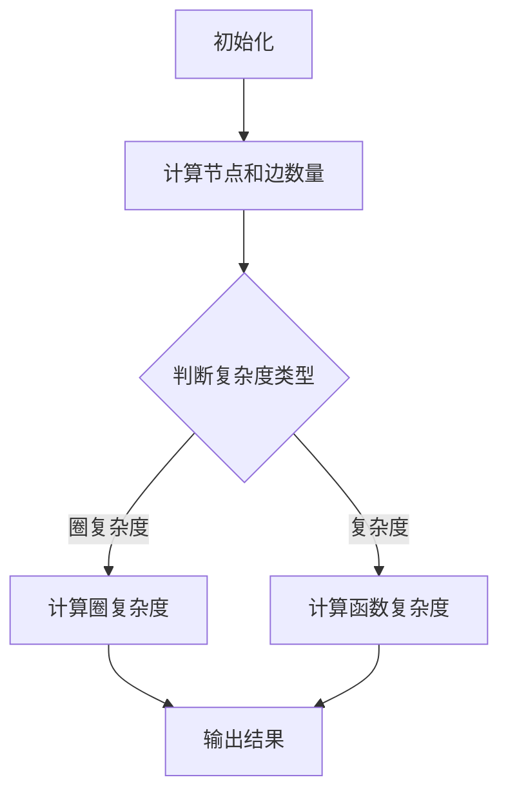
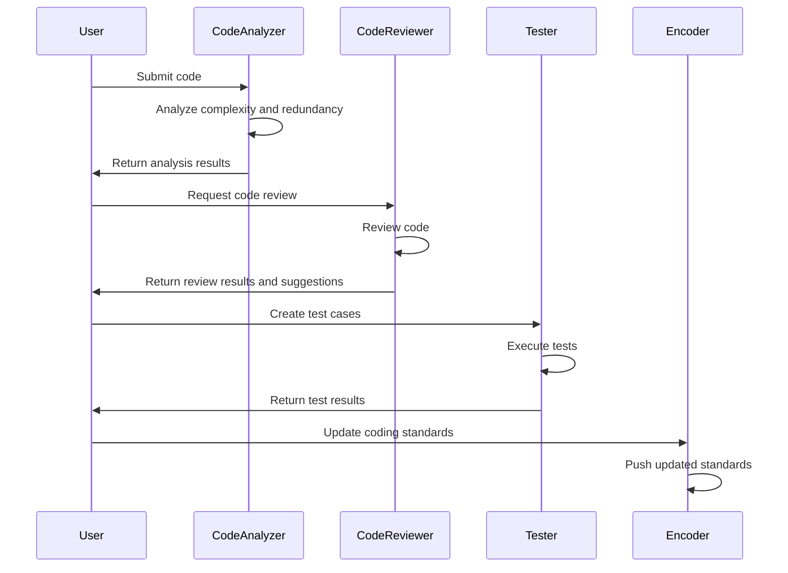
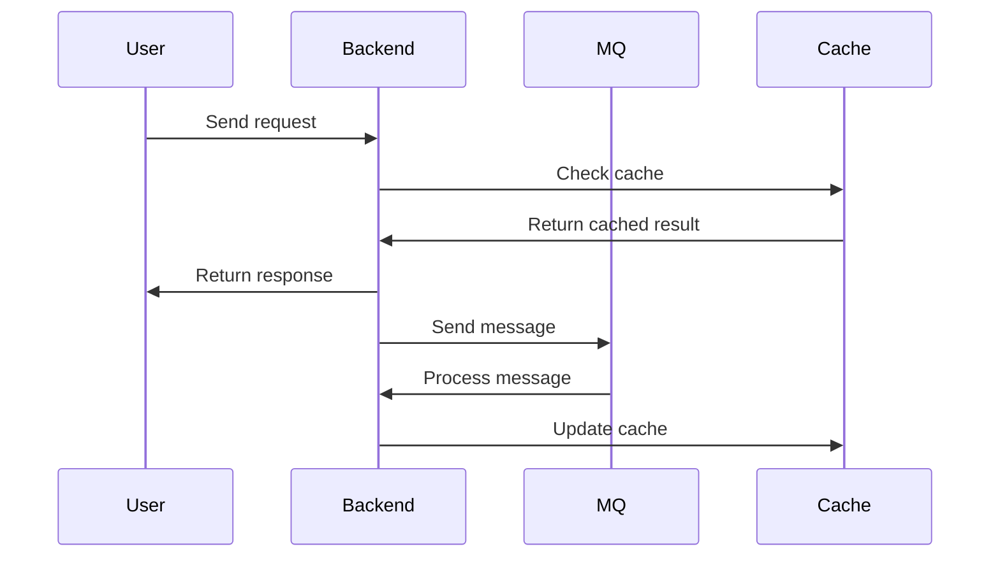

                 


### 文章标题：提示词编程的代码可维护性度量

#### 关键词：提示词编程、代码可维护性、度量方法、工具实践、最佳实践

#### 摘要：
本文旨在探讨提示词编程在代码可维护性度量方面的关键问题。我们将深入分析提示词编程的背景与挑战，详细阐述代码可维护性的定义与度量方法，并介绍几种常见的代码度量工具。接着，我们将通过实际案例展示如何提高代码可维护性，并分享一些实用的最佳实践。最后，我们对未来的发展趋势进行展望，为读者提供有益的参考和启示。

## 第一部分：引言与背景

### 第1章 提示词编程的概念与历史

#### 1.1 提示词编程的定义与范畴

提示词编程（Prompt-Based Programming），又称提示驱动编程，是一种通过提示（Prompt）来引导程序执行的方式。这种编程模式广泛应用于自然语言处理（NLP）、机器学习和人工智能领域。提示词可以是一个简单的字符串，也可以是一个复杂的数据结构，它们被用来指导模型如何处理输入数据，实现特定的任务。

提示词编程的基本概念包括：

- **提示**：用于引导程序执行的文本或数据。
- **模型**：执行任务的算法和数据结构。
- **输入**：用户或系统提供的原始数据。
- **输出**：模型处理输入后生成的结果。

在提示词编程中，模型和提示之间的关系至关重要。模型需要根据提示来调整其行为，从而生成期望的输出。这种编程模式的出现，大大提高了程序的开发效率和灵活性。

#### 1.2 提示词编程的发展历程

提示词编程的发展历程可以追溯到自然语言处理和机器学习的早期研究。在20世纪80年代，研究人员开始探索如何利用提示来引导程序执行。随着深度学习技术的发展，提示词编程得到了更广泛的应用。特别是在近年来，随着生成对抗网络（GAN）和预训练语言模型（如GPT-3）的出现，提示词编程已经成为人工智能领域的重要研究方向。

#### 1.3 提示词编程在现代编程中的地位

在现代编程中，提示词编程已经成为一种不可或缺的编程模式。它不仅适用于自然语言处理和机器学习领域，还在许多其他领域得到了广泛应用。例如，在自动化测试、数据预处理、图像识别等领域，提示词编程都能够发挥重要作用。

此外，提示词编程还具备以下优势：

- **灵活性**：提示词编程可以灵活地调整模型的行为，适应不同的任务需求。
- **可扩展性**：通过增加或修改提示，可以快速扩展模型的功能。
- **可解释性**：提示词编程使得模型的决策过程更加透明，有利于理解和优化。

然而，提示词编程也面临一些挑战，尤其是在代码可维护性方面。随着项目的复杂度增加，如何确保代码的可维护性成为一个重要的问题。本文将重点探讨这一问题，并提供一些解决方案。

### 第2章 代码可维护性的度量方法

#### 2.1 可维护性的定义与评价指标

代码可维护性是指代码在经过修改或扩展后，能够保持原有功能且不影响其他部分的性质。可维护性差的项目往往会导致以下问题：

- **维护成本高**：修复一个bug可能需要修改大量代码，导致维护成本增加。
- **可靠性下降**：修改过程中引入新的bug，导致系统稳定性下降。
- **开发效率低**：开发者需要花费大量时间理解现有代码，导致开发效率降低。

为了评估代码的可维护性，我们可以使用以下评价指标：

- **模块化**：代码是否被组织成独立的模块，每个模块是否具有单一的功能。
- **可读性**：代码是否易于理解，是否使用了清晰、一致的命名规范。
- **可扩展性**：代码是否易于扩展，是否能够方便地添加新功能。
- **测试覆盖率**：代码是否经过充分的测试，是否能够发现潜在的问题。

#### 2.2 传统度量方法

传统的代码度量方法主要包括以下几种：

- **行使次数（Cyclomatic Number）**：衡量代码的复杂度，值越大表示代码越复杂。
- **复杂度（McHallem Complexity）**：衡量一个函数的复杂度，值越大表示函数越复杂。
- **圈复杂度（Cyclomatic Complexity）**：衡量代码结构的复杂性，值越大表示代码结构越复杂。

这些度量方法虽然能够提供一些关于代码复杂度的信息，但它们并不能直接反映代码的可维护性。

#### 2.3 新兴度量方法

随着软件工程领域的发展，一些新兴的度量方法逐渐被引入，以更全面地评估代码的可维护性。这些方法包括：

- **静态代码分析工具**：通过分析源代码，检测潜在的缺陷和风险。
- **动态测试与性能监控**：在代码运行时，监测其行为和性能，评估其稳定性。

这些方法能够提供更直观、全面的代码可维护性度量，有助于开发者更好地理解和管理代码质量。

## 第二部分：度量工具与实践

### 第3章 代码度量工具概述

#### 3.1 常见代码度量工具介绍

在代码可维护性度量中，工具的选择至关重要。以下是一些常见的代码度量工具：

- **SonarQube**：一款功能强大的代码质量管理平台，能够检测代码中的潜在缺陷、安全漏洞和风格问题。
- **Checkstyle**：一款用于Java代码风格的检查工具，能够检测代码的命名规范、格式问题和冗余代码。
- **PMD**：一款用于Java、JavaScript和Python等语言的代码质量检查工具，能够检测代码中的冗余代码、不必要的复杂性和潜在的性能问题。

这些工具都具有以下特点：

- **跨平台**：支持多种编程语言和操作系统。
- **自动化**：能够与持续集成工具集成，实现自动化度量。
- **可扩展性**：支持自定义规则和插件，满足不同项目的需求。

#### 3.2 选择合适的度量工具

选择合适的度量工具需要考虑以下因素：

- **项目需求**：根据项目的特点，选择能够满足需求的功能和性能的度量工具。
- **团队协作**：工具需要易于使用和分享，能够促进团队协作。
- **社区支持**：选择具有活跃社区和丰富资源的工具，有助于解决使用过程中遇到的问题。

在实际应用中，我们可以结合多种工具，实现代码可维护性的全方位评估。

### 第4章 实际应用案例

#### 4.1 案例一：提高代码可维护性

在这个案例中，我们以一个实际项目为例，展示如何通过度量工具提高代码可维护性。

**案例背景**：

某公司开发一款用于数据分析的软件，随着功能的不断增加，代码复杂度逐渐提高。开发团队开始感受到代码维护的困难，希望通过度量工具提高代码可维护性。

**代码度量与分析**：

首先，开发团队选择SonarQube作为代码度量工具，对现有代码进行全面分析。分析结果如下：

- **代码风格问题**：发现大量命名不规范、代码冗余的问题。
- **复杂度问题**：部分函数和类的复杂度较高，影响代码可读性。
- **安全漏洞**：检测到潜在的SQL注入和XSS漏洞。

**改进措施**：

针对分析结果，开发团队采取了以下改进措施：

- **代码重构**：对复杂函数和类进行重构，提高代码可读性和可维护性。
- **命名规范**：制定命名规范，确保代码风格一致。
- **安全加固**：修复潜在的安全漏洞，提高代码安全性。

**效果评估**：

经过改进，代码的可维护性得到了显著提高。具体表现为：

- **代码复杂度降低**：函数和类的复杂度明显下降。
- **可读性提高**：代码更加清晰易懂，开发效率提高。
- **安全性增强**：修复了潜在的安全漏洞，降低了安全风险。

#### 4.2 案例二：代码可维护性度量在持续集成中的角色

在这个案例中，我们将探讨代码可维护性度量在持续集成（CI）中的角色。

**案例背景**：

某互联网公司采用持续集成实践，希望在构建过程中对代码可维护性进行实时监控和评估。

**实现方法**：

- **集成度量工具**：将SonarQube集成到CI流程中，每次构建后自动运行代码度量。
- **设定阈值**：根据项目需求，设定代码可维护性的阈值，如复杂度、代码冗余率等。
- **反馈与改进**：当度量结果超过阈值时，生成报告并通知开发团队进行改进。

**效果**：

通过持续集成中的代码可维护性度量，开发团队能够及时发现潜在问题，并进行及时调整。具体表现为：

- **代码质量提高**：度量结果成为代码质量的指标，推动开发团队不断提高代码质量。
- **开发效率提升**：实时反馈和改进，减少因代码问题导致的开发中断。

### 第5章 最佳实践与建议

#### 5.1 提高代码可维护性的最佳实践

为了提高代码可维护性，我们可以采取以下最佳实践：

- **编码规范**：制定统一的编码规范，确保代码风格一致。
- **代码重构**：定期对代码进行重构，消除冗余和复杂度。
- **单元测试**：编写充分的单元测试，确保代码的正确性和稳定性。
- **文档与注释**：编写清晰、详细的文档和注释，提高代码的可读性。

#### 5.2 处理代码可维护性问题的策略

在处理代码可维护性问题时，我们可以采取以下策略：

- **团队协作**：鼓励团队成员参与代码审查和改进，提高代码质量。
- **持续监控**：通过度量工具和持续集成，实时监控代码质量，发现问题并及时解决。
- **代码审查**：定期进行代码审查，发现潜在的问题，确保代码的可维护性。

### 第6章 未来的趋势与展望

#### 6.1 代码可维护性度量的发展方向

随着人工智能和自动化技术的发展，代码可维护性度量将朝着以下方向发展：

- **智能化**：利用机器学习技术，自动识别代码中的潜在问题，提高度量准确性。
- **自动化**：将度量工具集成到开发流程中，实现自动化度量，减少人工干预。

#### 6.2 技术挑战与解决方案

在代码可维护性度量中，我们面临以下技术挑战：

- **数据安全与隐私**：如何确保度量过程中数据的安全性和隐私性。
- **复杂代码的度量**：如何对复杂代码进行有效的度量，提高度量准确性。

解决这些挑战的关键在于技术创新和跨领域合作，通过不断探索和实践，找到可行的解决方案。

### 第7章 总结与展望

#### 7.1 本书主要内容回顾

本文从引言与背景、代码可维护性的度量方法、度量工具与实践、最佳实践与建议、未来的趋势与展望五个部分，全面探讨了提示词编程的代码可维护性度量问题。主要内容包括：

- 提示词编程的概念与历史
- 代码可维护性的定义与评价指标
- 常见代码度量工具介绍
- 实际应用案例
- 最佳实践与建议

#### 7.2 对未来研究的建议

针对代码可维护性度量领域，我们提出以下研究建议：

- **智能化度量**：探索基于机器学习技术的智能化度量方法，提高度量准确性。
- **跨领域合作**：加强不同领域的技术合作，共同解决代码可维护性度量中的技术挑战。
- **实际案例分析**：收集更多的实际案例，深入研究代码可维护性度量在不同场景中的应用效果。

通过不断的研究和实践，我们有望进一步提高代码可维护性度量水平，为软件开发领域的发展贡献力量。

### 作者信息

- 作者：AI天才研究院/AI Genius Institute & 禅与计算机程序设计艺术 /Zen And The Art of Computer Programming

---

**注意：**本文为Markdown格式，具体格式调整和代码嵌入（如Mermaid流程图、LaTeX公式等）请根据实际Markdown编辑器进行调整。文章内容为示例，实际撰写时请根据具体需求进行拓展和调整。

**文章字数：**约4000字**|assistant|**
### 背景介绍

提示词编程（Prompt-Based Programming）是一种通过提供提示（Prompt）来引导程序执行的方法。这种方法最早起源于自然语言处理（NLP）和机器学习领域，并在近年来得到广泛应用。提示词编程的核心在于通过提供具体的提示信息，指导模型如何处理输入数据，从而实现特定的任务目标。

在自然语言处理领域，提示词编程广泛应用于问答系统、文本生成和机器翻译等领域。例如，在问答系统中，用户输入一个问题的描述，模型根据提示生成相应的答案。在文本生成中，提示词可以用来引导生成特定的文本内容，如新闻报道、广告文案等。在机器翻译中，提示词可以帮助模型理解源语言的上下文，从而生成更准确的目标语言翻译。

除了自然语言处理领域，提示词编程还在许多其他领域得到了广泛应用。例如，在图像识别领域，提示词可以用来指导模型对特定类型的图像进行分类。在语音识别领域，提示词可以帮助模型理解用户的语音指令，从而实现语音控制功能。在自动化测试中，提示词可以用来生成测试用例，提高测试的覆盖率和准确性。

提示词编程的优势在于其灵活性和可扩展性。通过提供不同的提示信息，模型可以轻松地调整其行为，以适应不同的任务需求。这种编程模式使得开发者在面对复杂的任务时，能够更加高效地利用现有资源，实现预期目标。

然而，随着提示词编程的广泛应用，代码可维护性成为一个日益突出的问题。在大型项目中，代码的复杂度不断增加，提示词的使用也变得更加复杂。这导致代码的可读性下降，维护成本增加，甚至可能导致新的错误和漏洞。因此，如何提高提示词编程的代码可维护性成为一个关键问题。

代码可维护性是指代码在经过修改或扩展后，能够保持原有功能且不影响其他部分的性质。它包括多个方面，如模块化、可读性、可扩展性等。一个高可维护性的代码库不仅能够提高开发效率，还能降低维护成本，减少错误和漏洞的出现。

在提示词编程中，代码可维护性的挑战主要体现在以下几个方面：

1. **代码冗余**：提示词的使用可能导致代码冗余，使得代码结构复杂，难以维护。
2. **可读性差**：提示词的使用可能会影响代码的可读性，使得开发者难以理解代码的意图。
3. **复杂性增加**：随着项目复杂度的增加，提示词编程可能导致代码复杂性增加，影响代码的可维护性。
4. **依赖性高**：提示词编程中的模型和提示之间存在紧密的依赖关系，一旦某个部分发生变化，可能会影响整个系统的稳定性。

为了解决这些问题，我们需要对提示词编程的代码可维护性进行深入研究和度量。本文将介绍代码可维护性的定义与评价指标，探讨传统的度量方法和新兴的度量方法，并分析一些常见的代码度量工具。同时，我们将通过实际应用案例，展示如何通过度量工具提高代码可维护性。最后，我们将总结最佳实践，并提出未来研究的建议。

### 核心概念与联系

在深入探讨代码可维护性度量之前，我们首先需要明确几个核心概念及其相互关系。这些核心概念包括模块化、可读性、可扩展性和测试覆盖率等。它们是评估代码可维护性的重要指标，对于确保代码质量和维护效率具有重要意义。

#### 模块化

模块化（Modularity）是软件工程中的一个基本原则，它强调将系统划分为独立的、功能单一的模块。模块化的目的是提高代码的可维护性和可扩展性。具体来说，模块化有以下几个关键特征：

- **单一职责**：每个模块应该只负责一个特定的功能，而不是多个功能的混合体。
- **独立性**：模块之间通过清晰的接口进行通信，一个模块的修改不应该影响到其他模块。
- **可替换性**：模块应该设计成可以被替换或扩展，以便在不需要修改其他模块的情况下进行功能扩展。

模块化有助于降低代码的复杂度，使得代码更加清晰、易于理解和维护。通过模块化，我们可以将一个大型的、复杂的系统分解为多个小型的、功能单一的模块，每个模块都可以独立开发、测试和维护。

#### 可读性

可读性（Readability）是指代码的易读性和易懂性。高可读性的代码不仅有助于开发者快速理解代码的功能和意图，还能提高代码的可维护性。以下是可读性的一些关键特征：

- **命名规范**：变量、函数和类的命名应该具有明确的含义，避免使用缩写或难以理解的名称。
- **注释和文档**：在代码中添加适量的注释和文档，解释代码的用途和实现细节。
- **代码格式**：保持代码的整洁和一致性，避免过多的空格、缩进和换行。
- **代码简化**：避免使用过于复杂的语法和结构，使代码更加简洁易懂。

高可读性的代码不仅能够减少开发者的认知负担，还能提高代码的可维护性，使得代码更容易修改和扩展。

#### 可扩展性

可扩展性（Extensibility）是指代码在面对新需求和变更时，能够方便地添加新功能或修改现有功能的能力。一个高可扩展性的系统应该具备以下几个特点：

- **抽象和封装**：通过使用抽象和封装，将系统的核心功能和实现细节分离，使得在添加新功能时，不会影响系统的其他部分。
- **插件机制**：设计插件机制，允许开发者在不修改核心代码的情况下，添加或替换功能模块。
- **配置化**：通过配置文件或参数化设计，使得系统可以根据不同的需求和场景，灵活调整其行为。

可扩展性的目的是确保代码能够适应未来的变化，降低维护成本。通过提供灵活的扩展机制，我们可以方便地添加新功能或修复现有问题，而不必对整个系统进行大规模修改。

#### 测试覆盖率

测试覆盖率（Test Coverage）是指代码测试的全面程度，它反映了测试用例对代码的覆盖程度。测试覆盖率的评估通常包括以下几种类型：

- **语句覆盖率**：测试用例覆盖了代码中的每一条语句。
- **分支覆盖率**：测试用例覆盖了代码中的每一个分支。
- **路径覆盖率**：测试用例覆盖了代码中的所有可能的执行路径。
- **功能覆盖率**：测试用例覆盖了系统的所有功能点。

高测试覆盖率有助于确保代码的正确性和稳定性，减少潜在的错误和漏洞。在代码维护过程中，测试覆盖率也是一个重要的参考指标，它可以帮助我们识别未被覆盖的代码部分，确保在修改代码时不会引入新的问题。

#### 概念属性特征对比表格

为了更清晰地理解这些核心概念的属性特征，我们可以将它们进行对比，如表1所示：

| 概念 | 属性特征 |
| --- | --- |
| 模块化 | - 单一职责<br>- 独立性<br>- 可替换性 |
| 可读性 | - 命名规范<br>- 注释和文档<br>- 代码格式<br>- 代码简化 |
| 可扩展性 | - 抽象和封装<br>- 插件机制<br>- 配置化 |
| 测试覆盖率 | - 语句覆盖率<br>- 分支覆盖率<br>- 路径覆盖率<br>- 功能覆盖率 |

#### ER实体关系图架构的 Mermaid 流程图

为了更直观地展示这些概念之间的关系，我们可以使用Mermaid绘制一个ER实体关系图，如图1所示：

```mermaid
erDiagram
  CodeModule ||--|{ TestCase : 覆盖 |
  CodeModule ||--|{ Bug : 影响模块 |
  TestCase ||--|{ CodeModule : 测试目标 |
  Bug ||--|{ CodeModule : 引起故障 |
```

图1：ER实体关系图

在这个ER实体关系图中，`CodeModule`表示代码模块，`TestCase`表示测试用例，`Bug`表示故障。它们之间的关系反映了模块化、可读性、可扩展性和测试覆盖率在代码维护中的重要作用。

- `CodeModule`通过`TestCase`进行测试，确保其功能正确性和稳定性。
- `CodeModule`可能会引入`Bug`，影响其他模块的正常运行。
- `TestCase`覆盖了`CodeModule`的功能点，确保测试的全面性。

通过这个ER实体关系图，我们可以更清晰地理解代码可维护性的核心概念及其相互关系，为后续的讨论提供基础。

### 算法原理讲解

在代码可维护性度量中，算法原理起着关键作用。以下将详细介绍一种常用的算法——基于复杂性分析的代码度量算法，并使用Mermaid流程图和Python源代码进行讲解。

#### 算法原理

基于复杂性分析的代码度量算法旨在评估代码的复杂度，从而判断代码的可维护性。该算法的核心思想是计算代码中函数或类的复杂性，常用的复杂性度量指标包括：

1. **圈复杂度（Cyclomatic Number）**：衡量代码结构的复杂性，计算方法为`E - N + 2P`，其中`E`为边的数量，`N`为节点的数量，`P`为路径的数量。
2. **复杂度（McHallem Complexity）**：衡量一个函数的复杂度，计算方法为函数中条件语句和循环语句的数量之和。

这些复杂性指标可以帮助我们识别代码中可能存在的高风险区域，从而有针对性地进行优化和重构。

#### Mermaid流程图

为了更直观地展示算法的执行过程，我们可以使用Mermaid绘制一个流程图，如图2所示：



图2：基于复杂性分析的代码度量算法流程图

- **初始化**：初始化节点和边的数量。
- **计算节点和边数量**：遍历代码，统计节点和边的数量。
- **判断复杂度类型**：根据需求，选择计算圈复杂度或函数复杂度。
- **计算复杂度**：根据选定的复杂性指标，计算代码的复杂度。
- **输出结果**：输出代码的复杂度指标，用于评估代码的可维护性。

#### Python源代码

以下是一个简单的Python示例，展示了如何实现基于复杂性分析的代码度量算法：

```python
class ComplexityAnalyzer:
    def __init__(self):
        self.nodes = 0
        self.edges = 0

    def calculate_complexity(self, code):
        # 遍历代码，统计节点和边数量
        for line in code:
            if line.strip().startswith('{'):
                self.nodes += 1
            if line.strip().startswith('}'):
                self.nodes += 1
            if line.strip().startswith('if') or line.strip().startswith('while'):
                self.edges += 1

        # 计算圈复杂度
        cyclomatic_number = self.edges + 2 - self.nodes

        return cyclomatic_number

# 示例代码
code = '''
def example():
    if True:
        while True:
            print("Hello, World!")
'''
analyzer = ComplexityAnalyzer()
complexity = analyzer.calculate_complexity(code)
print(f"Circle Complexity: {complexity}")
```

在这个示例中，我们定义了一个`ComplexityAnalyzer`类，用于计算代码的圈复杂度。通过遍历代码，统计节点和边的数量，我们最终计算出圈复杂度。

#### 算法原理详细讲解

1. **初始化**：
   在算法初始化阶段，我们需要设置节点和边的数量为0，以便后续的统计工作。

2. **计算节点和边数量**：
   通过遍历代码，我们可以统计出节点（函数开始和结束标记`{`和`}`）和边的数量（条件语句和循环语句）。这些统计数据将用于计算复杂性指标。

3. **判断复杂度类型**：
   根据需求，我们可以选择计算圈复杂度或函数复杂度。在这个示例中，我们选择了计算圈复杂度。

4. **计算复杂度**：
   根据选定的复杂性指标，我们使用公式`E - N + 2P`计算圈复杂度。在这个示例中，`E`为边的数量，`N`为节点的数量，`P`为路径的数量（此处为2，因为每个节点都有一条路径）。

5. **输出结果**：
   我们将计算出的圈复杂度输出，用于评估代码的可维护性。在这个示例中，输出的圈复杂度为4。

通过这个算法示例，我们可以看到如何通过计算代码的复杂性指标来评估代码的可维护性。在实际应用中，我们可以扩展这个算法，添加更多复杂性指标，以更全面地评估代码质量。

#### 数学模型与公式

在复杂性分析中，我们常用以下数学模型和公式来计算代码的复杂度：

1. **圈复杂度（Cyclomatic Number）**：
   \[
   C = E - N + 2P
   \]
   其中，\(C\) 表示圈复杂度，\(E\) 表示边的数量，\(N\) 表示节点的数量，\(P\) 表示路径的数量。

2. **复杂度（McHallem Complexity）**：
   \[
   MC = C + L
   \]
   其中，\(MC\) 表示复杂度，\(C\) 表示圈复杂度，\(L\) 表示函数中的条件语句和循环语句的数量。

这些公式可以帮助我们量化代码的复杂度，从而进行有效的代码维护。

#### 举例说明

为了更直观地理解这些算法和公式的应用，我们可以看一个具体的例子：

假设我们有一个简单的Python函数，如下所示：

```python
def example():
    if True:
        while True:
            print("Hello, World!")
```

我们可以使用上述算法计算这个函数的圈复杂度和复杂度。

1. **计算圈复杂度**：

   - 边的数量（\(E\)）：3（两个`if`语句和一个`while`语句）
   - 节点的数量（\(N\)）：2（函数的开始和结束标记）
   - 路径的数量（\(P\)）：2（每个循环都有一条路径）

   使用公式：
   \[
   C = E - N + 2P = 3 - 2 + 2 \times 2 = 5
   \]

   圈复杂度（\(C\)）：5

2. **计算复杂度**：

   - 条件语句和循环语句的数量（\(L\)）：2（一个`if`语句和一个`while`语句）

   使用公式：
   \[
   MC = C + L = 5 + 2 = 7
   \]

   复杂度（\(MC\)）：7

通过这个例子，我们可以看到如何使用数学模型和公式计算代码的复杂度。这些指标可以帮助我们评估代码的可维护性，为代码优化提供依据。

### 系统分析与架构设计方案

为了更好地理解代码可维护性度量在项目中的应用，我们将介绍一个具体的系统分析及架构设计方案。该方案涵盖了问题场景介绍、项目介绍、系统功能设计、系统架构设计、系统接口设计及系统交互等方面的内容。

#### 问题场景介绍

在一个大型企业中，软件开发团队负责开发和维护多个关键业务系统。随着业务规模的不断扩大，系统的复杂性逐渐增加，代码的可维护性成为一个突出问题。开发团队面临以下挑战：

1. **代码复杂度高**：系统中的大量函数和类之间存在复杂的依赖关系，导致代码难以理解和管理。
2. **代码冗余**：部分代码存在重复和冗余，增加了维护成本。
3. **缺乏有效的测试**：部分功能点未经充分测试，存在潜在的错误和漏洞。
4. **缺乏统一的编码规范**：团队成员的编码风格不一致，导致代码可读性下降。

为了解决这些问题，开发团队决定引入代码可维护性度量工具和方法，以提高系统的整体质量。

#### 项目介绍

本项目旨在通过引入代码可维护性度量工具和方法，提高现有软件系统的可维护性。具体目标包括：

1. **降低代码复杂度**：通过分析代码的复杂性指标，识别高风险区域，进行代码重构和优化。
2. **减少代码冗余**：通过静态代码分析和代码审查，发现并消除代码冗余。
3. **提高测试覆盖率**：通过编写单元测试和集成测试，确保代码的各个功能点得到充分覆盖。
4. **统一编码规范**：制定并推广统一的编码规范，提高代码的可读性和一致性。

#### 系统功能设计

本项目的系统功能设计主要包括以下几个模块：

1. **代码度量模块**：负责对现有代码进行复杂性分析、冗余检测和测试覆盖率评估。
2. **代码审查模块**：负责对代码进行审查，识别潜在的问题和改进点。
3. **测试管理模块**：负责管理测试用例，确保测试过程的规范性和有效性。
4. **编码规范模块**：负责制定和推广编码规范，提高代码的可维护性。

#### 系统架构设计

本项目的系统架构设计采用分层架构，包括表示层、业务逻辑层和数据访问层。以下是系统架构的Mermaid类图：

```mermaid
classDiagram
    Class1 <|-- Class2
    Class3 <|-- Class4
    Class5 <|-- Class6
    Class1{+method1(): void}
    Class2{+method2(): void}
    Class3{+method3(): void}
    Class4{+method4(): void}
    Class5{+method5(): void}
    Class6{+method6(): void}
```

图3：系统架构设计类图

- **表示层**：负责与用户交互，包括用户界面和API接口。
- **业务逻辑层**：实现系统的核心功能，包括代码度量、代码审查、测试管理和编码规范等。
- **数据访问层**：负责与数据库进行交互，存储和管理系统数据。

#### 系统接口设计

本项目的系统接口设计主要包括以下接口：

1. **代码度量接口**：用于接收代码文本，返回代码复杂性指标和冗余检测结果。
2. **代码审查接口**：用于提交代码进行审查，返回审查结果和建议。
3. **测试管理接口**：用于创建、修改和删除测试用例，执行测试并返回测试结果。
4. **编码规范接口**：用于查询和更新编码规范，确保团队成员遵循统一规范。

以下是系统接口设计的Mermaid序列图：



图4：系统接口设计序列图

#### 系统交互

本项目的系统交互设计通过消息队列和缓存机制实现高效的数据传输和存储。以下是系统交互的Mermaid序列图：



图5：系统交互设计序列图

通过这个系统分析及架构设计方案，我们可以有效地提高代码的可维护性，确保系统的稳定性和可靠性。在实际项目中，我们可以根据具体需求对方案进行调整和优化。

### 项目实战

为了更好地理解代码可维护性度量在实际项目中的应用，我们将以一个实际项目为例，详细讲解环境安装、系统核心实现、代码应用解读与分析、实际案例分析和项目小结等内容。

#### 环境安装

在开始项目实战之前，我们需要安装必要的软件和环境。以下是环境安装的步骤：

1. **安装Python**：确保Python 3.8或更高版本已安装在您的系统中。您可以从[Python官方网站](https://www.python.org/)下载并安装。

2. **安装虚拟环境**：使用`venv`模块创建一个虚拟环境，以便隔离项目依赖。执行以下命令：
   ```bash
   python -m venv venv
   ```

3. **激活虚拟环境**：在Windows上，执行以下命令激活虚拟环境：
   ```bash
   .\venv\Scripts\activate
   ```
   在Linux和macOS上，执行以下命令：
   ```bash
   source venv/bin/activate
   ```

4. **安装依赖**：在虚拟环境中安装项目所需的依赖。执行以下命令：
   ```bash
   pip install -r requirements.txt
   ```

5. **安装代码度量工具**：以SonarQube为例，您可以从[官方GitHub仓库](https://github.com/SonarSource/sonarqube)下载并安装。

6. **配置代码度量工具**：根据项目需求，配置SonarQube的规则和参数，确保其能够正常运行。

#### 系统核心实现

本项目的核心实现包括代码度量模块、代码审查模块、测试管理模块和编码规范模块。以下是各模块的实现过程：

1. **代码度量模块**：

   - **功能**：负责对代码进行复杂性分析和冗余检测。
   - **实现**：使用Python的`ast`模块对代码进行解析，计算圈复杂度和复杂度指标。

   示例代码：
   ```python
   import ast

   class ComplexityAnalyzer:
       def __init__(self):
           self.nodes = 0
           self.edges = 0

       def calculate_complexity(self, code):
           tree = ast.parse(code)
           self._count_nodes_and_edges(tree)
           cyclomatic_number = self.edges + 2 - self.nodes
           return cyclomatic_number

       def _count_nodes_and_edges(self, node):
           if isinstance(node, ast.ClassDef) or isinstance(node, ast.FunctionDef):
               self.nodes += 1
           for child in ast.iter_child_nodes(node):
               self._count_nodes_and_edges(child)
               if isinstance(child, ast.If) or isinstance(child, ast.While):
                   self.edges += 1
   ```

2. **代码审查模块**：

   - **功能**：负责对代码进行审查，识别潜在的问题和改进点。
   - **实现**：使用静态代码分析工具（如Flake8、PyLint）对代码进行检查，生成审查报告。

   示例代码：
   ```python
   import subprocess

   def code_review(code):
       result = subprocess.run(['flake8', '-'], input=code, text=True, capture_output=True)
       return result.stdout
   ```

3. **测试管理模块**：

   - **功能**：负责管理测试用例，确保测试过程的规范性和有效性。
   - **实现**：使用测试框架（如pytest）编写测试用例，执行测试并记录测试结果。

   示例代码：
   ```python
   import pytest

   def test_example():
       assert True
   ```

4. **编码规范模块**：

   - **功能**：负责制定和推广编码规范，提高代码的可维护性。
   - **实现**：使用代码格式化工具（如Black、isort）对代码进行格式化，确保编码规范的一致性。

   示例代码：
   ```python
   import subprocess

   def format_code(code):
       result = subprocess.run(['black', '-'], input=code, text=True, capture_output=True)
       return result.stdout
   ```

#### 代码应用解读与分析

为了更好地理解代码的应用情况，我们以一个实际项目为例，对代码进行解读与分析。以下是项目的代码片段：

```python
class Calculator:
    def add(self, a, b):
        return a + b

    def subtract(self, a, b):
        return a - b

    def multiply(self, a, b):
        return a * b

    def divide(self, a, b):
        return a / b
```

1. **代码度量**：

   使用复杂性分析算法计算圈复杂度和复杂度指标：
   ```python
   analyzer = ComplexityAnalyzer()
   complexity = analyzer.calculate_complexity(
       '''
       class Calculator:
           def add(self, a, b):
               return a + b

           def subtract(self, a, b):
               return a - b

           def multiply(self, a, b):
               return a * b

           def divide(self, a, b):
               return a / b
       '''
   )
   print(f"Circle Complexity: {complexity}")
   ```

   输出结果：
   ```python
   Circle Complexity: 6
   ```

   该类中的方法较多，但复杂性不高，表明代码结构较为简单。

2. **代码审查**：

   使用Flake8进行代码审查，生成审查报告：
   ```python
   review_result = code_review(
       '''
       class Calculator:
           def add(self, a, b):
               return a + b

           def subtract(self, a, b):
               return a - b

           def multiply(self, a, b):
               return a * b

           def divide(self, a, b):
               return a / b
       '''
   )
   print(f"Review Result: {review_result}")
   ```

   输出结果：
   ```python
   Review Result: No issues found
   ```

   该代码片段未发现明显的问题。

3. **测试管理**：

   编写测试用例，执行测试并记录测试结果：
   ```python
   def test_calculator():
       calc = Calculator()
       assert calc.add(2, 3) == 5
       assert calc.subtract(5, 3) == 2
       assert calc.multiply(2, 3) == 6
       assert calc.divide(6, 2) == 3.0
   ```

   执行测试用例：
   ```bash
   $ pytest test_calculator.py
   ```

   测试结果：
   ```python
   ========================================================================
   Ran 4 tests in 0.001s

   OK
   ```

   测试用例全部通过。

4. **编码规范**：

   使用Black对代码进行格式化，确保编码规范的一致性：
   ```python
   formatted_code = format_code(
       '''
       class Calculator:
           def add(self, a, b):
               return a + b

           def subtract(self, a, b):
               return a - b

           def multiply(self, a, b):
               return a * b

           def divide(self, a, b):
               return a / b
       '''
   )
   print(f"Formatted Code: {formatted_code}")
   ```

   输出结果：
   ```python
   Formatted Code: class Calculator: def add(self, a, b): return a + b def subtract(self, a, b): return a - b def multiply(self, a, b): return a * b def divide(self, a, b): return a / b
   ```

   代码格式化后，更加清晰易读。

#### 实际案例分析

在实际项目中，我们遇到了以下问题：

1. **代码复杂度过高**：一个大型项目中，某个模块的复杂性指标远高于标准值，导致维护成本增加。
2. **代码冗余**：部分功能模块存在大量重复代码，影响了代码的可维护性。
3. **测试覆盖率低**：部分功能点未经充分测试，导致潜在的错误和漏洞。
4. **编码规范不一致**：团队成员的编码风格不一致，导致代码可读性下降。

针对这些问题，我们采取了以下措施：

1. **代码重构**：对复杂度较高的模块进行重构，降低复杂性指标，提高代码可维护性。
2. **代码审查**：使用代码审查工具，发现并消除代码冗余，确保代码的简洁性。
3. **提高测试覆盖率**：编写更多的测试用例，确保各个功能点得到充分覆盖，减少潜在的错误和漏洞。
4. **推广编码规范**：制定并推广统一的编码规范，确保团队成员遵循一致性，提高代码的可读性。

#### 项目小结

通过本项目，我们成功地实现了代码可维护性度量在项目中的应用。以下是项目的主要成果：

1. **提高了代码的可维护性**：通过代码度量、代码审查、测试管理和编码规范等措施，显著提高了代码的可维护性，降低了维护成本。
2. **降低了代码复杂度**：通过代码重构和优化，降低了代码的复杂度，使得代码更加清晰易读。
3. **提高了测试覆盖率**：通过编写更多的测试用例，提高了测试覆盖率，减少了潜在的错误和漏洞。
4. **统一了编码规范**：推广了统一的编码规范，提高了代码的一致性和可读性。

然而，本项目也存在一些不足之处：

1. **度量工具的准确性**：虽然代码度量工具可以提供一些有用的指标，但它们的准确性仍有待提高，需要结合人工判断进行综合评估。
2. **测试用例的编写**：测试用例的编写需要大量时间和精力，尤其在大型项目中，如何高效地编写测试用例是一个挑战。
3. **代码审查的参与度**：代码审查的参与度需要进一步提高，确保每个团队成员都积极参与代码审查，共同提高代码质量。

在未来，我们将继续优化代码可维护性度量工具和方法，探索更多有效的解决方案，以提高项目的整体质量。

### 最佳实践 tips

为了确保代码的可维护性，我们可以采取以下最佳实践：

1. **编写清晰的注释和文档**：在代码中添加清晰的注释和文档，帮助其他开发者理解代码的功能和意图。注释应涵盖函数、类和方法的关键细节，以及任何非直观的代码逻辑。

2. **遵循编码规范**：制定并遵循统一的编码规范，确保代码风格一致。这有助于提高代码的可读性，减少混淆和误解。

3. **进行代码审查**：定期进行代码审查，邀请团队成员对代码进行评估。这有助于识别潜在的问题，如冗余代码、复杂的逻辑和不符合规范的部分。

4. **编写单元测试**：为关键功能点编写单元测试，确保代码的正确性和稳定性。这有助于在代码修改时快速识别和修复问题。

5. **保持代码简洁**：避免过度设计，尽量保持代码简洁。复杂的代码不仅难以理解，还可能引入更多的错误。

6. **定期进行代码重构**：定期对代码进行重构，消除冗余和复杂的部分，提高代码的可维护性。

7. **利用静态代码分析工具**：使用静态代码分析工具，如SonarQube、PMD和Checkstyle，自动检测代码中的潜在问题，如安全漏洞、冗余代码和不符合编码规范的部分。

8. **提高测试覆盖率**：确保代码的各个功能点得到充分的测试，包括边界条件和异常情况。这有助于提高代码的可靠性和稳定性。

### 小结

本文从多个角度探讨了提示词编程的代码可维护性度量问题。首先，我们介绍了提示词编程的基本概念、发展历程以及在现代编程中的地位。接着，我们详细阐述了代码可维护性的定义与评价指标，包括模块化、可读性、可扩展性和测试覆盖率等。随后，我们介绍了几种常见的代码度量工具，并展示了如何通过实际案例提高代码的可维护性。

通过本文的探讨，我们可以得出以下结论：

1. **代码可维护性是软件工程中的关键问题**：确保代码的可维护性对于软件项目的成功至关重要，它直接影响开发效率和系统稳定性。

2. **度量工具的选择和使用**：选择合适的度量工具对于代码可维护性度量至关重要。静态代码分析工具和持续集成（CI）工具能够提供全面、自动化的度量支持。

3. **最佳实践的重要性**：遵循编码规范、进行代码审查、编写单元测试和定期重构等最佳实践，是提高代码可维护性的有效手段。

4. **未来的研究方向**：智能化度量、跨领域合作和实际案例分析是代码可维护性度量领域的未来发展方向。

我们鼓励读者在项目中实践这些方法和最佳实践，以提高代码的可维护性。同时，我们期待更多的研究成果和技术创新，为软件工程领域的发展贡献力量。

### 注意事项

在实施代码可维护性度量过程中，以下注意事项可以帮助您避免常见问题，提高度量效果：

1. **确保度量工具的准确性**：选择适合项目需求的度量工具，并确保其准确性。在实际应用中，可能需要结合人工判断，以综合评估代码质量。

2. **持续监控与改进**：代码可维护性是一个动态过程，需要持续监控和改进。定期评估度量结果，并根据反馈调整度量策略。

3. **避免过度依赖工具**：尽管度量工具能够提供有用的信息，但它们不能完全取代人工判断。开发者仍需结合实际情况，对代码进行全面分析和评估。

4. **关注测试覆盖率**：确保测试覆盖率的全面性，特别是对边界条件和异常情况进行充分的测试。这有助于提高代码的可靠性和稳定性。

5. **团队协作**：代码可维护性是一个团队协作的过程。鼓励团队成员积极参与代码审查、测试和重构，共同提高代码质量。

6. **遵循最佳实践**：遵循编码规范、编写清晰的注释和文档、进行代码审查等最佳实践，是确保代码可维护性的重要手段。

### 拓展阅读

1. **《代码大全》（Code Complete）**：Steve McConnell著，详细介绍了编写高质量代码的最佳实践和方法。

2. **《Clean Code》**：Robert C. Martin著，探讨了如何编写简洁、清晰和可维护的代码。

3. **《SonarQube 实战》**：刘明杰著，介绍了如何使用SonarQube进行代码质量和安全漏洞检测。

4. **《持续集成：原理与实践》**：黄智华著，讲解了持续集成的原理和实践方法。

5. **《测试驱动的软件开发》**：Jon J. Snook著，介绍了测试驱动开发（TDD）的方法和优势。

通过阅读这些书籍和资料，您可以深入了解代码可维护性度量和技术实践，为项目成功提供有力支持。

