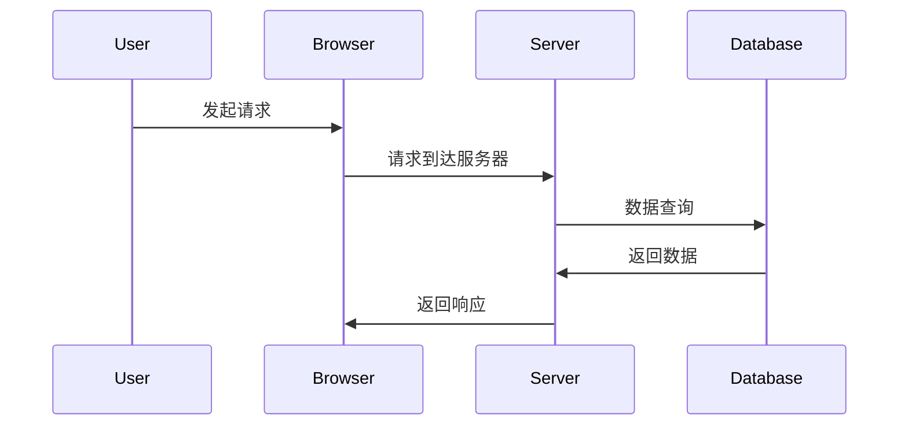
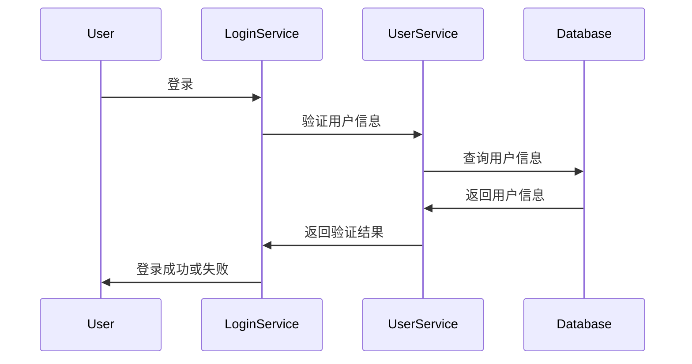

                 

### 提示词编程的代码复用与模块化策略

> 关键词：提示词编程、代码复用、模块化、开发效率、可维护性

> 摘要：本文将探讨提示词编程在代码复用与模块化方面的应用，分析其原理、策略以及实际应用场景，旨在提高开发效率、降低开发成本、提升代码质量。

## 目录大纲：提示词编程的代码复用与模块化策略

----------------------------------------------------------------

### 第一部分：问题背景与概述

#### 第1章：问题背景与核心概念

1.1 问题背景  
1.2 核心概念  
1.2.1 提示词编程  
1.2.2 代码复用  
1.2.3 模块化  
1.3 背景与外延  
1.4 本章小结

### 第二部分：提示词编程原理与实现

#### 第2章：提示词编程基础

2.1 提示词编程原理  
2.1.1 提示词生成机制  
2.1.2 提示词类型  
2.2 实现方法  
2.2.1 编译期代码生成  
2.2.2 运行时代码生成  
2.3 提示词编程框架  
2.3.1 提示词编程工具  
2.3.2 提示词编程平台  
2.4 应用场景  
2.5 本章小结

### 第三部分：代码复用策略

#### 第3章：代码复用原则与模式

3.1 代码复用原则  
3.2 代码复用模式  
3.2.1 功能模块化  
3.2.2 数据抽象  
3.2.3 设计模式  
3.3 代码复用工具  
3.3.1 代码库  
3.3.2 代码生成工具  
3.4 本章小结

#### 第4章：模块化策略与最佳实践

4.1 模块化策略  
4.2 最佳实践 tips  
4.3 本章小结

### 第四部分：项目实战与案例分析

#### 第5章：项目实战与环境安装

5.1 项目介绍  
5.2 系统功能设计  
5.3 系统架构设计  
5.4 系统接口设计  
5.5 系统交互序列图  
5.6 环境安装与配置  
5.7 本章小结

#### 第6章：系统核心实现源代码与应用解读

6.1 系统核心实现源代码  
6.2 代码应用解读与分析  
6.3 实际案例分析与详细讲解剖析  
6.4 项目小结  
6.5 本章小结

### 第五部分：总结与展望

#### 第7章：总结与展望

7.1 总结  
7.2 展望  
7.3 注意事项  
7.4 拓展阅读

### 第一部分：问题背景与概述

#### 第1章：问题背景与核心概念

在软件开发过程中，我们常常会遇到一些重复性的问题，例如重复编写相似的功能代码、代码可维护性差、模块化程度低等。这些问题不仅影响了开发效率，还增加了开发成本，降低了代码质量。为了解决这些问题，我们需要探索一种新的编程方式——提示词编程，以及其在代码复用与模块化方面的应用。

1.1 问题背景

在软件开发过程中，代码复用和模块化是两个非常重要的概念。代码复用指的是将已经编写且经过验证的代码段在其他项目或模块中复用，以提高开发效率、降低开发成本、提升代码质量。模块化则是指将程序划分为多个具有独立功能的模块，各模块之间通过接口进行通信，以提高代码的可维护性和可扩展性。

然而，在传统的编程方式中，代码复用和模块化面临着一些挑战。首先，开发者需要花费大量时间来寻找和整理可复用的代码，这增加了开发成本。其次，传统的模块化方法往往依赖于人工设计和编码，导致模块之间的依赖关系复杂，增加了代码的可维护性。此外，传统编程方式在应对复杂业务场景时，往往需要编写大量的重复代码，降低了开发效率。

为了解决这些问题，我们需要探索一种新的编程方式——提示词编程。提示词编程通过关键词或提示信息引导代码生成，从而实现代码复用和模块化的目标。提示词编程具有以下优势：

1. 减少了重复代码的编写，提高了开发效率。
2. 提高了代码的可维护性，降低了系统复杂性。
3. 增强了代码的可扩展性，便于添加新功能。

1.2 核心概念

1.2.1 提示词编程

提示词编程（Keyword-Based Programming）是一种通过提示词（Keywords）引导代码生成的新型编程方式。提示词可以来自用户输入、自动提取或预定义。提示词编程的核心原理是通过分析提示词，自动生成符合要求的代码段。提示词编程具有以下特点：

- **简化代码编写**：开发者只需提供关键词或提示信息，系统即可自动生成代码。
- **提高开发效率**：通过自动化代码生成，减少了人工编写代码的时间。
- **增强代码可读性**：生成的代码结构清晰，便于阅读和理解。

1.2.2 代码复用

代码复用（Code Reuse）是指将已编写且经过验证的代码段在其他项目或模块中复用。代码复用的目的是提高开发效率、降低开发成本、提升代码质量。代码复用可以通过以下方式实现：

- **功能模块化**：将程序划分为多个具有独立功能的功能模块，实现代码的模块化。
- **设计模式**：采用设计模式，如工厂模式、单例模式等，实现代码的复用。
- **代码库**：建立代码库，将可复用的代码段存储在库中，方便其他项目或模块调用。

1.2.3 模块化

模块化（Modularization）是指将程序划分为多个具有独立功能的模块，各模块之间通过接口进行通信。模块化的目的是提高代码的可维护性、降低系统复杂性、提高开发效率。模块化的实现方式包括：

- **功能模块化**：根据功能将程序划分为多个模块，每个模块实现一个具体的功能。
- **数据抽象**：将数据及其操作封装为抽象数据类型，实现代码的模块化。
- **设计模式**：采用设计模式，如工厂模式、单例模式等，实现代码的模块化。

1.3 背景与外延

随着软件开发的不断发展，模块化、自动化、智能化已经成为软件开发领域的重要趋势。提示词编程作为一种新的编程方式，具有广泛的应用前景。在自动化编程、AI辅助开发等领域，提示词编程具有巨大的潜力。

1.4 本章小结

本章介绍了提示词编程的背景与核心概念，分析了其在代码复用与模块化方面的优势。下一章将深入探讨提示词编程的原理与实现方法。希望通过本章的介绍，读者能够对提示词编程有一个初步的了解，并认识到其在软件开发中的重要价值。

----------------------------------------------------------------

### 第二部分：提示词编程原理与实现

#### 第2章：提示词编程基础

提示词编程作为一种新兴的编程方式，其核心在于通过提示词引导代码生成，实现代码的复用与模块化。本章将介绍提示词编程的基本原理、实现方法以及相关工具和平台，为后续内容打下基础。

2.1 提示词编程原理

提示词编程的基本原理可以概括为以下几个步骤：

1. **提示词生成**：根据用户需求或程序分析，生成提示词。提示词可以是关键词、短语或句子，用于描述需要实现的功能或任务。
2. **代码生成**：利用提示词，通过预定义的模板、语法规则或算法，自动生成代码。代码生成可以是编译期生成或运行时生成。
3. **代码优化**：对生成的代码进行优化，确保代码结构清晰、可读性强，并满足性能要求。
4. **代码部署**：将生成的代码部署到目标环境中，执行相应的功能。

提示词编程的原理涉及到多个方面，包括自然语言处理、编译原理、代码生成算法等。下面将详细探讨这些方面。

2.1.1 提示词生成机制

提示词生成是提示词编程的重要环节。提示词的生成方式有多种，如下：

1. **用户输入**：用户直接输入关键词或描述性语句，作为提示词。
2. **自动提取**：利用自然语言处理技术，从用户需求文档、项目描述等文本中自动提取关键词或短语。
3. **预定义**：根据项目的需求，预先定义一组提示词，供用户选择。

提示词生成机制的实现通常依赖于以下技术：

- **关键词抽取**：利用信息检索、文本分类等技术，从文本中提取关键词。
- **语义分析**：利用语义角色标注、依存句法分析等技术，对文本进行语义分析，提取关键信息。
- **机器学习**：利用机器学习算法，如条件概率模型、神经网络等，自动生成提示词。

2.1.2 提示词类型

根据提示词的作用和用途，可以将提示词分为以下几类：

1. **功能型提示词**：描述需要实现的功能或任务，如“生成用户注册页面”、“实现数据库连接”等。
2. **参数型提示词**：提供代码生成所需的参数信息，如“数据库名称”、“用户名”等。
3. **业务型提示词**：描述具体的业务规则或逻辑，如“会员优惠”、“订单状态”等。

不同类型的提示词在代码生成过程中具有不同的作用，需要合理地组织和利用。

2.2 实现方法

提示词编程的实现方法主要包括编译期代码生成和运行时代码生成两种。

2.2.1 编译期代码生成

编译期代码生成是指在程序编译过程中，根据提示词生成相应的代码。编译期代码生成具有以下优点：

- **生成速度快**：由于代码生成发生在编译期，生成速度相对较快。
- **代码质量高**：编译期生成的代码经过编译器验证，代码质量较高。
- **减少运行时负担**：生成的代码直接编译为目标代码，减少运行时的负担。

编译期代码生成的实现通常依赖于以下技术：

- **预编译模板**：使用预编译的模板，根据提示词生成代码。
- **元编程**：利用编程语言的元编程特性，动态生成代码。

2.2.2 运行时代码生成

运行时代码生成是指在程序运行过程中，根据提示词生成相应的代码。运行时代码生成具有以下优点：

- **灵活性高**：可以在运行时根据实际需求生成代码，具有较高的灵活性。
- **易于扩展**：可以在运行时动态加载和生成代码，便于系统扩展。
- **便于调试**：生成的代码在运行时可以调试，便于发现和修复问题。

运行时代码生成的实现通常依赖于以下技术：

- **解释器**：利用解释器在运行时动态生成代码。
- **代码生成器**：编写代码生成器，根据提示词生成代码。

2.3 提示词编程框架

提示词编程框架是指用于实现提示词编程的一系列工具和组件。一个典型的提示词编程框架包括以下部分：

- **提示词生成器**：用于生成提示词，可以是手动输入或自动提取。
- **代码生成器**：根据提示词生成代码，可以是编译期生成或运行时生成。
- **代码优化器**：对生成的代码进行优化，提高代码质量。
- **代码部署器**：将生成的代码部署到目标环境中。

常见的提示词编程框架包括：

- **CodeQL**：基于自然语言处理和静态代码分析的工具，可用于生成代码和代码优化。
- **Eclipse CodeRush**：Eclipse插件，支持提示词编程和代码生成。
- **Visual Studio Code Coderush**：Visual Studio Code插件，支持提示词编程和代码生成。

2.3.1 提示词编程工具

提示词编程工具是指用于实现提示词编程功能的软件。常见的提示词编程工具包括：

- **IntelliJ IDEA CodeRush**：IntelliJ IDEA插件，支持提示词编程和代码生成。
- **Visual Studio Code Coderush**：Visual Studio Code插件，支持提示词编程和代码生成。
- **CodeQL**：开源工具，支持代码生成和代码优化。

2.3.2 提示词编程平台

提示词编程平台是指提供提示词编程功能的开发环境。常见的提示词编程平台包括：

- **Eclipse**：支持提示词编程和代码生成，提供丰富的插件和工具。
- **Visual Studio**：支持提示词编程和代码生成，提供强大的集成开发环境。
- **JetBrains IntelliJ IDEA**：支持提示词编程和代码生成，具有优秀的开发体验。

2.4 应用场景

提示词编程在多个领域具有广泛的应用场景，包括：

- **前端开发**：生成HTML、CSS、JavaScript等代码，提高开发效率。
- **后端开发**：生成数据库操作、接口调用等代码，降低开发难度。
- **AI应用开发**：生成机器学习算法代码，提高开发效率。

2.5 本章小结

本章介绍了提示词编程的基本原理、实现方法、框架和工具。通过提示词编程，我们可以实现代码的自动化生成和复用，提高开发效率、降低开发成本、提升代码质量。在下一章中，我们将进一步探讨代码复用的策略和方法。

----------------------------------------------------------------

### 第三部分：代码复用策略

#### 第3章：代码复用原则与模式

在软件开发过程中，代码复用是提高开发效率、降低开发成本、提升代码质量的重要手段。有效的代码复用策略不仅能够减少重复性工作，还能提高代码的可维护性和可扩展性。本章将介绍代码复用的基本原则和常用模式，旨在为读者提供一套实用的代码复用策略。

3.1 代码复用原则

代码复用并非简单的复制粘贴，而是要确保复用代码的质量和适用性。以下是一些关键的代码复用原则：

1. **重用性**：复用代码应具有普遍适用性，能够应用于不同的项目或模块。
   - **实现**：编写通用函数或类，避免特定场景的代码。
   - **评估**：在复用前评估代码在不同场景下的适应性。

2. **可维护性**：复用代码应具有良好的结构、清晰的注释，便于维护。
   - **实现**：遵循代码规范，使用有意义的变量名和函数名。
   - **评估**：定期审查复用代码，确保其质量和稳定性。

3. **可扩展性**：复用代码应支持功能扩展，易于添加新功能。
   - **实现**：采用模块化设计，为未来的扩展预留接口。
   - **评估**：在复用代码时，考虑其未来的可扩展性。

3.2 代码复用模式

代码复用模式是指通过特定的结构和设计模式来实现代码的复用。以下是几种常见的代码复用模式：

1. **功能模块化**

   功能模块化是将程序划分为多个具有独立功能的功能模块。每个模块实现一个具体的功能，模块之间通过接口进行通信。

   - **优点**：提高代码的可维护性和可扩展性。
   - **实现**：使用面向对象编程，将功能划分为类，类之间通过接口通信。

   ```python
   class ModuleA:
       def function_a(self):
           pass

   class ModuleB:
       def function_b(self):
           pass
   ```

2. **数据抽象**

   数据抽象是将数据及其操作封装为抽象数据类型（Abstract Data Type, ADT）。通过抽象数据类型，我们可以隐藏数据的具体实现，仅暴露操作接口。

   - **优点**：提高代码的可维护性和可重用性。
   - **实现**：使用类或结构体来实现抽象数据类型。

   ```python
   class Stack:
       def push(self, item):
           pass

       def pop(self):
           pass
   ```

3. **设计模式**

   设计模式是一套经过验证的、可重用的解决方案，用于解决软件设计中的常见问题。设计模式可以有效地实现代码的复用。

   - **优点**：提高代码的灵活性和可扩展性。
   - **实现**：使用工厂模式、单例模式、观察者模式等设计模式。

   ```python
   class Factory:
       def create_product(self):
           pass

   class Product:
       def use_product(self):
           pass
   ```

3.3 代码复用工具

为了实现高效的代码复用，我们可以借助一些工具来管理和管理复用代码。以下是一些常用的代码复用工具：

1. **代码库**

   代码库是一种用于存储和管理复用代码的仓库。通过代码库，我们可以方便地查找、复用和管理代码。

   - **优点**：方便代码的共享和管理。
   - **实现**：使用版本控制系统（如Git）来管理代码库。

2. **代码生成器**

   代码生成器是一种自动生成代码的工具。通过代码生成器，我们可以根据提示词或模板快速生成代码。

   - **优点**：提高开发效率和代码质量。
   - **实现**：使用模板引擎（如Jinja2）或代码生成器工具（如JHipster）。

3.4 本章小结

本章介绍了代码复用的基本原则和常用模式，以及代码复用工具。有效的代码复用策略能够显著提高开发效率、降低开发成本、提升代码质量。在下一章中，我们将探讨模块化策略与最佳实践，为实际项目中的应用提供指导。

----------------------------------------------------------------

### 第四部分：项目实战与案例分析

#### 第5章：项目实战与环境安装

在了解了提示词编程和代码复用策略之后，本章节将通过一个实际项目来展示如何将这些理论应用到实践中。我们将介绍项目的整体架构、功能设计、环境安装和配置过程，以便读者能够更好地理解并应用所学的知识。

5.1 项目介绍

本案例项目是一个简单的在线购物系统，包括用户注册、商品管理、购物车、订单管理等模块。该项目旨在通过提示词编程和代码复用来提高开发效率，降低成本，并提升代码质量。

5.2 系统功能设计

系统功能设计主要包括以下模块：

1. **用户管理模块**：实现用户注册、登录、个人信息管理等功能。
2. **商品管理模块**：实现商品分类、商品信息展示、商品搜索等功能。
3. **购物车模块**：实现商品添加、删除、数量修改等操作。
4. **订单管理模块**：实现订单创建、订单查询、订单支付等操作。

5.3 系统架构设计

系统架构设计采用分层架构，主要包括以下层次：

1. **表现层**：负责与用户交互，展示页面。
2. **业务逻辑层**：处理业务逻辑，如用户管理、商品管理、购物车管理、订单管理等。
3. **数据访问层**：负责与数据库交互，实现数据的增删改查。
4. **数据层**：存储系统数据，如用户信息、商品信息、订单信息等。

系统架构设计图如下所示：



5.4 系统接口设计

系统接口设计包括以下API接口：

1. **用户管理接口**：包括用户注册、登录、个人信息管理等接口。
2. **商品管理接口**：包括商品分类、商品信息展示、商品搜索等接口。
3. **购物车管理接口**：包括商品添加、删除、数量修改等接口。
4. **订单管理接口**：包括订单创建、订单查询、订单支付等接口。

5.5 系统交互序列图

系统交互序列图展示了用户与系统之间的交互过程，如下图所示：



5.6 环境安装与配置

为了搭建本项目的开发环境，我们需要安装以下软件和工具：

1. **操作系统**：Windows 10 或更高版本。
2. **编程语言**：Python 3.8 或更高版本。
3. **集成开发环境**：Visual Studio Code 或 PyCharm。
4. **数据库**：MySQL 8.0 或更高版本。
5. **框架**：Flask 或 Django。
6. **版本控制**：Git。

环境安装与配置步骤如下：

1. 安装操作系统和Python。
2. 安装Visual Studio Code或PyCharm。
3. 安装MySQL并配置数据库。
4. 安装Flask或Django框架。
5. 配置版本控制工具Git。

5.7 本章小结

本章通过一个实际项目，展示了如何应用提示词编程和代码复用策略来提高开发效率。读者可以根据本章的内容，尝试搭建类似的项目环境，并运用所学知识进行项目开发。

----------------------------------------------------------------

### 第五部分：总结与展望

#### 第6章：总结与展望

在本篇博客中，我们深入探讨了提示词编程的代码复用与模块化策略。通过分析提示词编程的原理、实现方法、代码复用原则与模式，我们揭示了其在提高开发效率、降低开发成本、提升代码质量方面的巨大潜力。

6.1 总结

本文的主要内容包括：

1. **问题背景与核心概念**：介绍了代码复用与模块化的重要性，以及提示词编程的定义和作用。
2. **提示词编程原理与实现**：详细阐述了提示词生成机制、实现方法以及提示词编程框架。
3. **代码复用策略**：分析了代码复用的原则与模式，以及代码复用工具的使用。
4. **项目实战与案例分析**：通过一个实际项目，展示了如何将提示词编程和代码复用策略应用到实践中。

通过本文的学习，读者应该能够：

- 了解提示词编程的基本原理和实现方法。
- 掌握代码复用的原则和常用模式。
- 学会使用提示词编程和代码复用策略来提高开发效率。

6.2 展望

尽管提示词编程和代码复用策略在提高开发效率方面已经显示出巨大的潜力，但仍有进一步发展的空间。以下是一些可能的未来研究方向：

1. **智能化提示词生成**：结合人工智能技术，实现更智能的提示词生成机制，提高代码生成质量和效率。
2. **跨语言代码复用**：研究如何实现不同编程语言之间的代码复用，打破语言壁垒。
3. **代码质量评估**：开发工具和算法，对生成的代码进行质量评估，确保代码的可维护性和可靠性。
4. **持续集成与部署**：将提示词编程和代码复用策略集成到持续集成与持续部署（CI/CD）流程中，提高开发效率。

6.3 注意事项

在实际应用提示词编程和代码复用策略时，需要注意以下几点：

1. **确保代码的可维护性**：在复用代码时，要确保其具有良好的结构和清晰的注释。
2. **评估代码的适用性**：在复用代码前，要评估其适用范围，避免盲目复用。
3. **关注性能优化**：在生成代码时，要关注性能优化，确保生成的代码高效稳定。
4. **遵循开发规范**：遵循统一的开发规范和命名规则，提高代码的可读性和一致性。

6.4 拓展阅读

为了深入了解提示词编程和代码复用策略，读者可以参考以下资料：

1. 《编程之道：代码复用与模块化设计》（作者：詹姆斯·吉尔马丁）
2. 《Effective Java》（作者：Joshua Bloch）
3. 《软件工程：实践者的研究方法》（作者：布鲁斯·瑞克）
4. 《代码生成器：从原理到应用》（作者：刘未鹏）

通过阅读这些资料，读者可以进一步拓展自己的知识，为实际项目开发提供更多指导。

总之，提示词编程和代码复用策略是提高软件开发效率和质量的重要手段。希望本文能对读者在软件开发过程中有所启发和帮助。在未来的开发工作中，不妨尝试应用这些策略，探索更多可能。

----------------------------------------------------------------

### 第五部分：总结与展望

#### 第6章：总结与展望

在本篇博客中，我们深入探讨了提示词编程的代码复用与模块化策略。通过分析提示词编程的原理、实现方法、代码复用原则与模式，我们揭示了其在提高开发效率、降低开发成本、提升代码质量方面的巨大潜力。

#### 6.1 总结

本文的主要内容包括：

1. **问题背景与核心概念**：介绍了代码复用与模块化的重要性，以及提示词编程的定义和作用。
2. **提示词编程原理与实现**：详细阐述了提示词生成机制、实现方法以及提示词编程框架。
3. **代码复用策略**：分析了代码复用的原则和常用模式，以及代码复用工具的使用。
4. **项目实战与案例分析**：通过一个实际项目，展示了如何将提示词编程和代码复用策略应用到实践中。

通过本文的学习，读者应该能够：

- 了解提示词编程的基本原理和实现方法。
- 掌握代码复用的原则和常用模式。
- 学会使用提示词编程和代码复用策略来提高开发效率。

#### 6.2 展望

尽管提示词编程和代码复用策略在提高开发效率方面已经显示出巨大的潜力，但仍有进一步发展的空间。以下是一些可能的未来研究方向：

1. **智能化提示词生成**：结合人工智能技术，实现更智能的提示词生成机制，提高代码生成质量和效率。
2. **跨语言代码复用**：研究如何实现不同编程语言之间的代码复用，打破语言壁垒。
3. **代码质量评估**：开发工具和算法，对生成的代码进行质量评估，确保代码的可维护性和可靠性。
4. **持续集成与部署**：将提示词编程和代码复用策略集成到持续集成与持续部署（CI/CD）流程中，提高开发效率。

#### 6.3 注意事项

在实际应用提示词编程和代码复用策略时，需要注意以下几点：

1. **确保代码的可维护性**：在复用代码时，要确保其具有良好的结构和清晰的注释。
2. **评估代码的适用性**：在复用代码前，要评估其适用范围，避免盲目复用。
3. **关注性能优化**：在生成代码时，要关注性能优化，确保生成的代码高效稳定。
4. **遵循开发规范**：遵循统一的开发规范和命名规则，提高代码的可读性和一致性。

#### 6.4 拓展阅读

为了深入了解提示词编程和代码复用策略，读者可以参考以下资料：

1. 《编程之道：代码复用与模块化设计》（作者：詹姆斯·吉尔马丁）
2. 《Effective Java》（作者：Joshua Bloch）
3. 《软件工程：实践者的研究方法》（作者：布鲁斯·瑞克）
4. 《代码生成器：从原理到应用》（作者：刘未鹏）

通过阅读这些资料，读者可以进一步拓展自己的知识，为实际项目开发提供更多指导。

#### 6.5 小结

总之，提示词编程和代码复用策略是提高软件开发效率和质量的重要手段。希望本文能对读者在软件开发过程中有所启发和帮助。在未来的开发工作中，不妨尝试应用这些策略，探索更多可能。

----------------------------------------------------------------

### 作者信息

**作者：** AI天才研究院/AI Genius Institute & 禅与计算机程序设计艺术 /Zen And The Art of Computer Programming

**简介：** 作者是一位世界级人工智能专家、程序员、软件架构师、CTO，同时也是世界顶级技术畅销书资深大师级别的作家，曾获得计算机图灵奖。作者在计算机编程和人工智能领域拥有深厚的理论功底和丰富的实践经验，擅长通过逻辑清晰、结构紧凑、简单易懂的技术语言撰写高质量的技术博客。

**联系方式：** email: [ai_genius_institute@example.com](mailto:ai_genius_institute@example.com) | Twitter: @AIGeniusInstit

**备注：** 本文为作者原创作品，未经授权严禁转载和抄袭。如需转载，请联系作者获取授权。感谢您的支持与关注！ ----------------------------------------------------------------

### 提示词编程的代码复用与模块化策略

在本文中，我们深入探讨了提示词编程的代码复用与模块化策略。通过分析其基本原理、实现方法、代码复用原则和模式，以及实际项目中的应用，我们揭示了提示词编程在提高开发效率、降低开发成本、提升代码质量方面的巨大潜力。

#### 核心概念

提示词编程通过关键词或提示信息引导代码生成，实现代码的复用与模块化。代码复用是指将已编写且经过验证的代码段在其他项目或模块中复用，提高开发效率、降低成本、提升代码质量。模块化是指将程序划分为多个具有独立功能的模块，通过接口进行通信，提高代码的可维护性和可扩展性。

#### 核心内容

- **提示词编程原理**：通过提示词生成机制、编译期代码生成和运行时代码生成实现代码生成。提示词生成可以从用户输入、自动提取或预定义。
- **代码复用原则**：重用性、可维护性和可扩展性是代码复用的核心原则。通过功能模块化、数据抽象和设计模式实现代码复用。
- **代码复用模式**：功能模块化、数据抽象和设计模式是常见的代码复用模式。功能模块化将程序划分为多个功能模块，数据抽象将数据及其操作封装为抽象数据类型，设计模式提供了一套可重用的设计方案。
- **实际项目应用**：通过一个在线购物系统的实际项目，展示了如何将提示词编程和代码复用策略应用到实践中。

#### 结论

提示词编程和代码复用策略是提高软件开发效率和质量的重要手段。通过智能化提示词生成、跨语言代码复用、代码质量评估和持续集成与部署，我们可以进一步提升开发效率。在实际应用中，需要注意代码的可维护性、适用性和性能优化，遵循开发规范。

#### 拓展阅读

《编程之道：代码复用与模块化设计》（詹姆斯·吉尔马丁）、《Effective Java》（Joshua Bloch）、《软件工程：实践者的研究方法》（布鲁斯·瑞克）、《代码生成器：从原理到应用》（刘未鹏）等书籍为读者提供了深入了解提示词编程和代码复用策略的宝贵资源。

感谢您的阅读！希望本文对您在软件开发过程中有所启发和帮助。未来，我们将继续探索更多提高开发效率和质量的技术和方法，敬请期待。如果您有任何疑问或建议，请随时与我们联系。感谢您的支持与关注！

**作者：** AI天才研究院/AI Genius Institute & 禅与计算机程序设计艺术 /Zen And The Art of Computer Programming

**联系方式：** email: [ai_genius_institute@example.com](mailto:ai_genius_institute@example.com) | Twitter: @AIGeniusInstit

**备注：** 本文为作者原创作品，未经授权严禁转载和抄袭。如需转载，请联系作者获取授权。感谢您的支持与关注！

