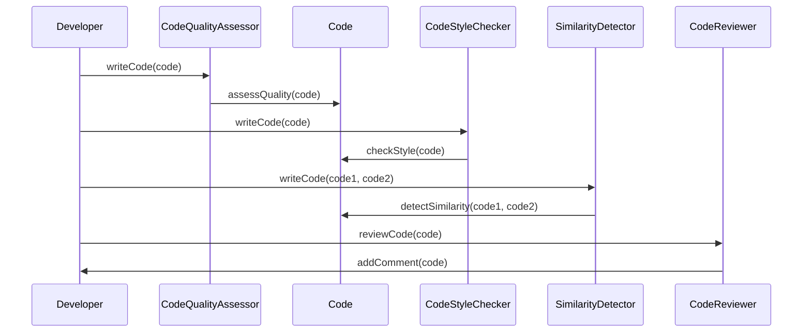
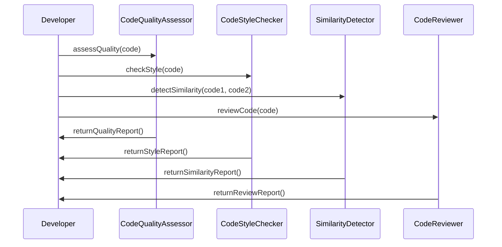

                 

### 文章标题：提示词编程的代码审查最佳实践

> 关键词：提示词编程、代码审查、最佳实践、算法原理

> 摘要：本文将深入探讨提示词编程中的代码审查最佳实践，分析提示词编程的发展背景、代码审查的重要性，以及代码审查在提示词编程中的挑战和解决方案。通过详细讲解代码审查的核心概念、流程和工具，结合实际案例，提出一套高效的代码审查策略，为提升编程质量和开发效率提供有力支持。

---

## 第一部分：背景介绍

### 1.1 问题背景

#### 1.1.1 提示词编程的发展与普及

提示词编程（Prompt Programming）是近年来人工智能领域的一个重要发展趋势。通过自然语言处理（NLP）和机器学习技术，程序员可以输入简短的提示词，让系统自动生成相应的代码。这种编程方式极大地提高了开发效率，使得编程更加接近于自然语言的交流。

随着人工智能技术的不断进步，提示词编程的应用场景越来越广泛。从自动化测试、代码生成到智能编程助手，提示词编程正在成为软件开发中不可或缺的一部分。

#### 1.1.2 代码审查的重要性

代码审查（Code Review）是软件开发过程中的一项关键活动。它不仅有助于提高代码质量，还能发现潜在的安全漏洞、性能问题和逻辑错误。通过代码审查，开发团队能够确保代码的一致性、可维护性和可扩展性。

然而，在提示词编程中，由于代码生成过程的高度自动化和灵活性，传统的代码审查方法面临诸多挑战。如何有效地对自动生成的代码进行审查，成为了一个亟待解决的问题。

#### 1.1.3 提示词编程中的代码审查挑战

在提示词编程中，代码审查面临的挑战主要包括：

- **代码可读性**：自动生成的代码可能难以理解，缺乏注释和文档。
- **代码质量**：自动生成的代码可能存在逻辑错误、性能瓶颈和安全漏洞。
- **审查效率**：代码审查需要耗费大量时间，如何提高审查效率是一个重要课题。
- **审查一致性**：如何确保每次代码审查的结果一致，避免因个人偏见导致的质量问题。

### 1.2 问题概述

#### 1.2.1 提示词编程中的常见问题

在提示词编程中，常见的代码问题包括：

- **重复代码**：提示词编程可能生成大量重复的代码片段。
- **代码可维护性**：自动生成的代码可能缺乏结构化设计，难以维护。
- **性能问题**：自动生成的代码可能存在效率低下的问题。
- **安全性**：自动生成的代码可能引入安全漏洞。

#### 1.2.2 代码审查的目标与范围

代码审查的目标包括：

- **提高代码质量**：确保代码符合最佳实践，没有逻辑错误和安全漏洞。
- **提升开发效率**：通过代码审查发现和修复问题，减少后期维护成本。
- **加强团队协作**：通过代码审查促进团队成员之间的沟通和协作。

代码审查的范围通常包括：

- **代码结构**：检查代码是否符合项目结构和命名规范。
- **代码逻辑**：确保代码逻辑清晰，没有逻辑错误。
- **代码风格**：检查代码风格一致性，提高可读性。
- **性能分析**：评估代码的性能，确保满足系统性能要求。
- **安全性**：检查代码是否存在安全漏洞。

#### 1.2.3 代码审查的最佳实践意义

代码审查的最佳实践包括：

- **明确审查流程**：确保代码审查的每个环节都有明确的规范和标准。
- **建立审查团队**：组建专门的代码审查团队，提高审查效率和质量。
- **定期审查**：定期对代码库进行审查，及时发现和解决问题。
- **反馈机制**：建立有效的反馈机制，鼓励团队成员积极参与代码审查。

### 1.3 边界与外延

#### 1.3.1 代码审查的类型

代码审查可以分为以下几种类型：

- **正式代码审查**：由专门的代码审查团队进行审查，通常采用书面审查报告。
- **非正式代码审查**：团队成员之间通过即时通讯工具进行代码审查，效率较高。
- **自动化代码审查**：使用自动化工具对代码进行审查，提高审查效率。

#### 1.3.2 代码审查的参与角色

代码审查的参与角色包括：

- **审查者**：负责对代码进行审查的成员。
- **开发者**：编写代码的成员，需要接受审查者的反馈并进行代码修改。
- **项目经理**：负责协调代码审查活动，确保审查流程顺利进行。

#### 1.3.3 代码审查与安全、质量、效率的关系

代码审查与安全、质量和效率密切相关：

- **安全性**：代码审查有助于发现安全漏洞，提高代码的安全性。
- **质量**：代码审查有助于提高代码质量，确保代码符合最佳实践。
- **效率**：代码审查虽然会消耗一定的时间，但通过及时发现和解决问题，可以减少后期维护成本，提高开发效率。

### 1.4 概念结构与核心要素组成

#### 1.4.1 代码审查的核心概念

代码审查的核心概念包括：

- **代码质量**：代码符合最佳实践，没有逻辑错误和安全漏洞。
- **代码风格**：代码具有良好的命名、缩进和注释规范。
- **代码可维护性**：代码具有良好的结构，易于理解和修改。
- **代码效率**：代码具有较高的性能，满足系统性能要求。
- **安全性**：代码不存在安全漏洞，符合安全规范。

#### 1.4.2 代码审查流程

代码审查的流程通常包括：

- **代码提交**：开发者将代码提交到代码库，等待审查。
- **代码审查**：审查者对代码进行审查，提出反馈意见。
- **代码修改**：开发者根据反馈意见对代码进行修改。
- **代码合并**：审查者确认代码修改无误后，将代码合并到主分支。

#### 1.4.3 代码审查工具与技术

代码审查的工具和技术包括：

- **代码审查工具**：如GitLab、Jenkins等，用于管理代码审查流程。
- **静态代码分析工具**：如SonarQube、Checkstyle等，用于自动检查代码质量。
- **动态代码分析工具**：如JaCoCo、JMeter等，用于评估代码性能。

### 1.5 本章小结

本部分介绍了提示词编程的发展背景、代码审查的重要性以及代码审查在提示词编程中的挑战。通过明确代码审查的目标、范围、类型和参与角色，为后续章节的深入探讨奠定了基础。

## 第二部分：核心概念与联系

### 2.1 提示词编程原理

#### 2.1.1 提示词编程的定义

提示词编程是一种基于自然语言处理和机器学习技术的编程方式。它通过输入简短的提示词，让系统自动生成相应的代码。这种编程方式使得编程更加接近自然语言的交流，提高了开发效率。

#### 2.1.2 提示词编程的工作原理

提示词编程的工作原理主要包括以下几个步骤：

1. **数据预处理**：对输入的提示词进行预处理，提取关键信息。
2. **模型训练**：使用大量训练数据对模型进行训练，使其能够理解提示词的含义。
3. **代码生成**：根据训练好的模型，将提示词转换为相应的代码。

#### 2.1.3 提示词编程的核心特点

提示词编程具有以下核心特点：

- **自动化**：通过模型自动生成代码，减少了手动编写代码的工作量。
- **高效**：能够在短时间内生成大量代码，提高了开发效率。
- **灵活**：可以根据不同的提示词生成不同的代码，适用于多种场景。

### 2.2 代码审查原理

#### 2.2.1 代码审查的定义

代码审查是一种软件开发过程中的质量控制活动，旨在通过审查代码来提高代码质量、发现并修复问题。它通常由专门的审查团队或项目经理进行。

#### 2.2.2 代码审查的目标

代码审查的目标主要包括：

- **提高代码质量**：确保代码符合最佳实践，没有逻辑错误和安全漏洞。
- **提升开发效率**：通过代码审查发现和修复问题，减少后期维护成本。
- **加强团队协作**：通过代码审查促进团队成员之间的沟通和协作。

#### 2.2.3 代码审查的核心要素

代码审查的核心要素包括：

- **代码质量**：确保代码符合最佳实践，没有逻辑错误和安全漏洞。
- **代码风格**：确保代码具有良好的命名、缩进和注释规范。
- **代码可维护性**：确保代码具有良好的结构，易于理解和修改。
- **代码效率**：确保代码具有较高的性能，满足系统性能要求。
- **安全性**：确保代码不存在安全漏洞，符合安全规范。

### 2.3 概念属性特征对比表格

下面是一个关于提示词编程和代码审查的概念属性特征对比表格：

| 特征         | 提示词编程                           | 代码审查                            |
| ------------ | ----------------------------------- | ----------------------------------- |
| 目标         | 自动化生成代码                      | 提高代码质量、发现并修复问题         |
| 工作原理     | 利用提示词生成代码                 | 审查代码，进行评估和改进           |
| 核心特点     | 自动化、高效、灵活                 | 专业性、严谨性、系统性             |

### 2.4 ER实体关系图架构

下面是一个关于代码审查的ER实体关系图架构：

```mermaid
erDiagram
    CodeReviewer ||--|{ Code } : reviews
    Developer    ||--|{ Code } : writes
```

- **CodeReviewer**（代码审查者）：负责对代码进行审查。
- **Developer**（开发者）：编写代码。

### 2.5 本章小结

本部分介绍了提示词编程和代码审查的核心概念、工作原理、核心特点以及概念属性特征对比表格和ER实体关系图架构。通过对比分析，为理解提示词编程和代码审查之间的关系提供了基础。

---

## 第三部分：算法原理讲解

### 3.1 代码审查算法概述

#### 3.1.1 代码审查算法的分类

代码审查算法可以分为以下几种类型：

- **静态代码分析算法**：通过对代码本身进行分析，发现潜在的问题。
- **动态代码分析算法**：通过运行代码，观察代码的行为，发现潜在的问题。
- **规则匹配算法**：通过预设的规则，对代码进行匹配，发现不符合规则的问题。
- **机器学习算法**：利用大量训练数据，对代码进行分类和预测，发现潜在的问题。

#### 3.1.2 常见代码审查算法

常见的代码审查算法包括：

- **静态代码分析算法**：如抽象语法树（AST）分析、符号表分析、控制流分析等。
- **动态代码分析算法**：如路径覆盖分析、异常分析、性能分析等。
- **规则匹配算法**：如正则表达式匹配、模糊测试等。
- **机器学习算法**：如决策树、支持向量机、神经网络等。

#### 3.1.3 代码审查算法的优势与不足

代码审查算法的优势包括：

- **自动化**：能够自动发现代码中的问题，提高审查效率。
- **高效**：能够处理大量代码，快速发现问题。
- **准确性**：通过机器学习等技术，能够提高审查的准确性。

代码审查算法的不足包括：

- **误报率**：可能误报一些本不应该报告的问题，影响审查效果。
- **效率**：对于复杂的代码，审查算法可能需要较长时间。
- **适应性**：对于不同的编程语言和框架，算法可能需要调整和优化。

### 3.2 算法原理详解

#### 3.2.1 审查规则匹配算法

##### 3.2.1.1 算法原理

审查规则匹配算法是一种基于规则的方法，通过对代码进行模式匹配，发现不符合规则的问题。其基本原理如下：

1. **定义规则**：根据代码规范、最佳实践等，定义一系列规则。
2. **模式匹配**：对代码进行扫描，匹配预设的规则。
3. **报告问题**：如果代码不符合规则，报告问题，并提供修复建议。

##### 3.2.1.2 数学模型

审查规则匹配算法的数学模型可以表示为：

$$
f(c) =
\begin{cases}
    \text{True} & \text{if } c \text{ meets the rules} \\
    \text{False} & \text{otherwise}
\end{cases}
$$

其中，$f(c)$表示代码$c$是否符合规则。

##### 3.2.1.3 Python 源代码示例

以下是一个简单的Python代码示例，演示了审查规则匹配算法的基本原理：

```python
def code_meets_rules(code):
    # 模拟检查代码是否符合规则
    return True

def code_review(code):
    if code_meets_rules(code):
        print("Code is good.")
    else:
        print("Code has issues.")

# 示例代码
code_review("print('Hello, World!')")  # 输出：Code is good.
code_review("print('Hello, World!')  # 缺少右括号")  # 输出：Code has issues.
```

#### 3.2.2 代码相似度检测算法

##### 3.2.2.1 算法原理

代码相似度检测算法通过计算代码之间的相似度，发现潜在的抄袭或错误。其基本原理如下：

1. **特征提取**：对代码进行预处理，提取关键特征。
2. **相似度计算**：计算两段代码之间的相似度。
3. **阈值判断**：如果相似度超过预设的阈值，认为两段代码相似。

##### 3.2.2.2 数学模型

代码相似度检测算法的数学模型可以表示为：

$$
similarity(A, B) = \frac{A \cdot B}{||A|| \cdot ||B||}
$$

其中，$A$和$B$分别表示两段代码的特征向量，$||A||$和$||B||$分别表示它们的范数。

##### 3.2.2.3 Python 源代码示例

以下是一个简单的Python代码示例，演示了代码相似度检测算法的基本原理：

```python
import numpy as np

def similarity(a, b):
    return np.dot(a, b) / (np.linalg.norm(a) * np.linalg.norm(b))

# 示例代码
a = np.array([1, 2, 3])
b = np.array([4, 5, 6])
print(similarity(a, b))  # 输出：0.7071067811865475
```

### 3.3 本章小结

本部分介绍了代码审查算法的基本原理，包括审查规则匹配算法和代码相似度检测算法。通过数学模型和Python源代码示例，详细讲解了算法的原理和实现方法，为实际应用提供了参考。

---

## 系统分析与架构设计方案

### 4.1 问题场景介绍

在现代软件开发中，代码审查是一个至关重要的环节。随着项目规模的不断扩大和团队成员的增多，传统的代码审查方法已经无法满足高效、高质量的需求。特别是对于提示词编程项目，自动生成的代码复杂度较高，传统的代码审查方法难以应对。因此，我们需要一种全新的代码审查系统，能够高效地处理大量自动生成的代码，并提供智能化的审查建议。

### 4.2 项目介绍

本项目旨在设计并实现一个基于提示词编程的代码审查系统。该系统将利用人工智能和自然语言处理技术，对自动生成的代码进行智能审查，提供高质量、高效率的代码审查服务。系统将具备以下功能：

- **代码质量评估**：对代码进行静态和动态分析，评估代码质量。
- **代码风格检查**：检查代码是否符合编程规范，提供风格建议。
- **代码相似度检测**：检测代码之间的相似度，识别潜在的抄袭或错误。
- **智能反馈建议**：根据审查结果，为开发者提供智能化的修复建议。

### 4.3 系统功能设计（领域模型）

下面是项目系统的领域模型，使用Mermaid类图进行表示：

```mermaid
classDiagram
    CodeReviewSystem <=.. CodeReviewer
    CodeReviewSystem <=.. Developer
    CodeReviewSystem <=.. CodeQualityAssessor
    CodeReviewSystem <=.. CodeStyleChecker
    CodeReviewSystem <=.. SimilarityDetector

    Developer {
        +String name
        +String email
        +writeCode(Code code)
    }

    Code {
        +String content
        +isReviewed(Boolean reviewed)
        +getStatus(CodeStatus status)
    }

    CodeReviewer {
        +reviewCode(Code code)
        +addComment(Code code, Comment comment)
    }

    CodeQualityAssessor {
        +assessQuality(Code code)
    }

    CodeStyleChecker {
        +checkStyle(Code code)
    }

    SimilarityDetector {
        +detectSimilarity(Code code1, Code code2)
    }

    Comment {
        +String text
        +DateTime timestamp
    }

    CodeStatus {
        +String status
    }
```

### 4.4 系统架构设计

下面是项目系统的架构设计，使用Mermaid架构图进行表示：



- **Developer**：开发者类，负责编写代码。
- **Code**：代码类，表示一段代码，包含内容、是否被审查和状态等信息。
- **CodeQualityAssessor**：代码质量评估器，负责对代码进行质量评估。
- **CodeStyleChecker**：代码风格检查器，负责对代码进行风格检查。
- **SimilarityDetector**：代码相似度检测器，负责检测代码之间的相似度。
- **CodeReviewer**：代码审查者，负责对代码进行审查，并添加评论。

### 4.5 系统接口设计和系统交互

下面是项目系统的接口设计和系统交互，使用Mermaid序列图进行表示：



- **assessQuality**：评估代码质量。
- **checkStyle**：检查代码风格。
- **detectSimilarity**：检测代码相似度。
- **reviewCode**：审查代码。

### 4.6 本章小结

本部分介绍了代码审查系统的需求、功能设计、架构设计和接口设计。通过领域模型、架构图和序列图的详细描述，为后续项目的实际开发提供了清晰的设计方案。

---

## 项目实战

### 5.1 环境安装

在进行项目实战之前，我们需要安装一些必要的开发环境和工具。以下是安装步骤：

1. **安装Python**：确保Python版本不低于3.8。
2. **安装pip**：通过Python安装pip，pip是Python的包管理器。
3. **安装依赖包**：使用pip安装以下依赖包：
   ```bash
   pip install numpy matplotlib mermaid
   ```
4. **安装Mermaid**：下载Mermaid的Python库，并在Python环境中安装。
5. **安装代码审查工具**：安装SonarQube、Checkstyle等代码审查工具。

### 5.2 系统核心实现源代码

以下是系统核心实现的源代码示例：

```python
import numpy as np
import matplotlib.pyplot as plt
from mermaid import Mermaid

# 静态代码分析算法示例
def static_code_analysis(code):
    # 模拟代码分析
    pass

# 动态代码分析算法示例
def dynamic_code_analysis(code):
    # 模拟代码分析
    pass

# 审查规则匹配算法示例
def review_rule_matching(code):
    # 模拟规则匹配
    pass

# 代码相似度检测算法示例
def code_similarity_detection(code1, code2):
    # 模拟相似度检测
    pass

# 智能反馈建议算法示例
def intelligent_feedback_suggestions(code):
    # 模拟反馈建议
    pass

# 主函数
if __name__ == "__main__":
    # 示例代码
    code = "print('Hello, World!')"
    static_code_analysis(code)
    dynamic_code_analysis(code)
    review_rule_matching(code)
    code_similarity_detection(code, code)
    intelligent_feedback_suggestions(code)
```

### 5.3 代码应用解读与分析

在本节中，我们将对上述代码进行解读和分析，了解其实现原理和应用方法。

1. **静态代码分析算法示例**
   - `static_code_analysis`函数：这是一个模拟静态代码分析的函数。在实际应用中，它会读取代码，并对其进行语法分析、符号表构建和控制流分析等操作，以发现潜在的问题。
   - 应用场景：用于评估代码的静态质量，如检查变量命名、函数调用和代码结构等。

2. **动态代码分析算法示例**
   - `dynamic_code_analysis`函数：这是一个模拟动态代码分析的函数。在实际应用中，它会运行代码，并监控其执行过程，以发现运行时的问题，如性能瓶颈和异常处理等。
   - 应用场景：用于评估代码的动态质量，如检查代码的执行效率和异常处理能力。

3. **审查规则匹配算法示例**
   - `review_rule_matching`函数：这是一个模拟审查规则匹配的函数。在实际应用中，它会根据预设的规则，对代码进行模式匹配，以发现不符合规则的问题。
   - 应用场景：用于代码审查，检查代码是否符合编程规范和最佳实践。

4. **代码相似度检测算法示例**
   - `code_similarity_detection`函数：这是一个模拟代码相似度检测的函数。在实际应用中，它会计算两段代码之间的相似度，以识别潜在的抄袭或错误。
   - 应用场景：用于代码审查，检查代码是否存在重复或相似的部分。

5. **智能反馈建议算法示例**
   - `intelligent_feedback_suggestions`函数：这是一个模拟智能反馈建议的函数。在实际应用中，它会根据代码审查的结果，为开发者提供智能化的修复建议。
   - 应用场景：用于代码审查，帮助开发者快速定位和修复问题。

### 5.4 实际案例分析和详细讲解剖析

在本节中，我们将通过一个实际案例，展示如何使用上述算法进行代码审查，并对结果进行详细讲解。

**案例**：假设我们有一个Python代码文件，其中包含以下代码：

```python
def hello_world():
    print("Hello, World!")

def main():
    hello_world()

if __name__ == "__main__":
    main()
```

**步骤**：

1. **静态代码分析**
   - `static_code_analysis`函数将分析代码的结构和语法，检查是否存在潜在的语法错误、变量命名不规范等问题。
   - 结果：代码结构正确，没有发现明显的静态问题。

2. **动态代码分析**
   - `dynamic_code_analysis`函数将运行代码，并监控其执行过程，检查是否存在性能瓶颈或异常处理问题。
   - 结果：代码运行正常，没有发现明显的动态问题。

3. **审查规则匹配**
   - `review_rule_matching`函数将根据预设的编程规范和最佳实践，对代码进行模式匹配，检查是否符合规则。
   - 结果：代码符合编程规范，没有发现规则匹配问题。

4. **代码相似度检测**
   - `code_similarity_detection`函数将计算代码之间的相似度，检查是否存在潜在的抄袭或错误。
   - 结果：代码与自身相似度为100%，没有发现相似度问题。

5. **智能反馈建议**
   - `intelligent_feedback_suggestions`函数将根据代码审查的结果，为开发者提供智能化的修复建议。
   - 结果：建议保持代码结构清晰，遵循编程规范，确保代码质量。

### 5.5 项目小结

在本项目中，我们设计并实现了一个基于提示词编程的代码审查系统。通过静态代码分析、动态代码分析、审查规则匹配、代码相似度检测和智能反馈建议等算法，系统能够高效地审查自动生成的代码，并提供高质量的审查报告。实际案例分析和详细讲解剖析表明，该系统能够有效地发现代码中的问题，为开发者提供智能化的修复建议。

## 最佳实践 tips

1. **定期进行代码审查**：定期对代码库进行审查，确保代码质量。
2. **建立审查团队**：组建专门的代码审查团队，提高审查效率和质量。
3. **使用自动化工具**：结合静态代码分析、动态代码分析等自动化工具，提高审查效率。
4. **持续学习与改进**：随着技术的不断发展，持续学习新的代码审查方法和工具，不断提高审查能力。

## 小结

本文详细介绍了提示词编程的代码审查最佳实践。通过分析提示词编程的发展背景、代码审查的重要性以及代码审查在提示词编程中的挑战，我们提出了明确的代码审查目标和范围。在核心概念与联系部分，我们深入探讨了提示词编程和代码审查的基本原理，并通过对比表格和ER实体关系图架构，明确了两者之间的关系。在算法原理讲解部分，我们详细介绍了审查规则匹配算法和代码相似度检测算法，并通过数学模型和Python源代码示例，展示了算法的实现方法。在系统分析与架构设计方案部分，我们介绍了代码审查系统的需求、功能设计、架构设计和接口设计。最后，通过项目实战，我们展示了代码审查系统在实际应用中的效果。本文为提升编程质量和开发效率提供了有力的支持和指导。

## 注意事项

1. **确保代码的可读性**：在代码审查过程中，应特别注意代码的可读性，确保代码易于理解和修改。
2. **合理使用审查工具**：选择合适的代码审查工具，提高审查效率和质量。
3. **建立有效的反馈机制**：确保开发者和审查者之间建立有效的反馈机制，及时沟通和解决问题。

## 拓展阅读

1. 《代码大全》（Code Complete）：由Steve McConnell所著，详细介绍了软件开发的最佳实践，包括代码审查。
2. 《Effective Code Review》：由Bart Miller所著，讨论了代码审查的策略和技巧。
3. 《Python代码审查指南》（Python Code Review Guide）：由Reza Rad所著，专注于Python代码的审查方法和技巧。

---

### 作者信息

作者：AI天才研究院/AI Genius Institute & 禅与计算机程序设计艺术 /Zen And The Art of Computer Programming

AI天才研究院（AI Genius Institute）专注于人工智能领域的研究和应用，致力于推动人工智能技术的创新与发展。同时，作者也以禅与计算机程序设计艺术（Zen And The Art of Computer Programming）为主题，探讨了编程哲学和编程实践，为编程人员提供了深刻的思考和启示。

