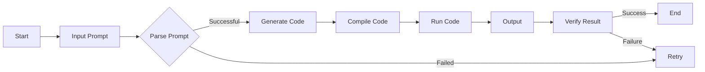
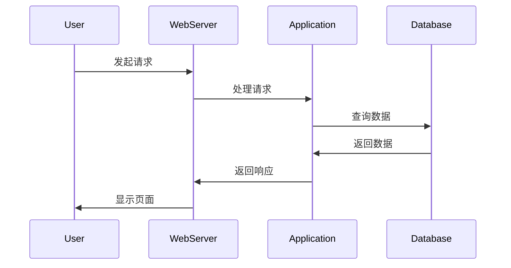

                 

# 提示词编程的协作开发模式

## 关键词：提示词编程、协作开发、算法原理、系统架构、项目实战、最佳实践

### 摘要：

本文旨在探讨提示词编程的协作开发模式。首先，我们将介绍当前编程环境面临的挑战以及提示词编程的概念，然后深入分析协作开发模式在提示词编程中的重要性。接着，我们将探讨协作开发模式的核心概念与要素，并对比不同概念之间的属性特征。随后，我们将详细讲解提示词编程的算法原理和流程，通过具体例子来阐述算法的应用。此外，我们将介绍协作开发环境与工具，以及团队协作流程与实践。最后，我们将通过一个项目实战案例，展示提示词编程协作开发的实际应用，并总结最佳实践和未来展望。

## 第1章：问题背景与协作开发模式概述

### 1.1.1 问题背景

在当今的编程环境中，随着软件项目的规模和复杂性不断增加，单打独斗的程序员逐渐难以应对。一方面，编程人员需要花费大量时间来理解和整合现有的代码库；另一方面，团队成员之间的沟通和协作也面临诸多挑战。这使得编程环境面临着一系列的挑战，包括代码复用性差、维护成本高、沟通效率低下等。

### 1.1.2 提出提示词编程的概念

为了解决上述问题，提示词编程作为一种新兴的编程范式，逐渐受到关注。提示词编程（Prompt-based Programming）通过为程序员提供可定制的提示词，帮助他们快速构建和调整代码。这种编程范式旨在提高代码的可读性和可维护性，同时降低沟通和协作的难度。

### 1.1.3 协作开发模式

协作开发模式是一种团队合作的软件开发方法，强调团队成员之间的沟通、协作和共享。在这种模式下，团队成员共同参与软件的开发和维护，通过合理分工、协同工作和持续集成，提高开发效率和质量。

### 1.1.4 提示词编程的协作开发需求

提示词编程的特性使得它在协作开发模式中具有独特的优势。为了充分发挥提示词编程的优势，我们需要关注以下几个方面：

1. **明确的需求分析**：在项目启动阶段，团队成员需要明确项目需求，并制定详细的开发计划。
2. **分工与协作**：根据项目需求和团队成员的技能特长，合理分配任务，并建立高效的协作机制。
3. **代码共享与版本控制**：通过代码共享和版本控制工具，实现代码的统一管理和维护。
4. **持续集成与测试**：采用持续集成和测试机制，确保代码的质量和稳定性。

### 1.1.5 本章小结

本章介绍了当前编程环境面临的挑战以及提示词编程的概念，并探讨了协作开发模式在提示词编程中的重要性。在下一章中，我们将深入分析协作开发模式的核心概念与要素。

----------------------------------------------------------------

## 第2章：协作开发的核心概念与要素

### 2.1.1 核心概念

协作开发模式中的核心概念包括需求分析、任务分配、代码管理、测试和部署等。这些概念共同构成了一个完整的协作开发过程，为团队高效协同工作提供了基础。

### 2.1.2 要素分析

在协作开发模式中，关键要素包括团队成员、开发环境、工具和流程等。团队成员是协作开发的核心，开发环境和工具是保障开发效率的重要条件，而流程则是规范协作行为的准则。

### 2.1.3 概念属性特征对比表格

| 概念       | 特征               |
|------------|--------------------|
| 需求分析   | 明确项目需求      |
| 任务分配   | 合理分配任务      |
| 代码管理   | 版本控制与共享    |
| 测试       | 确保代码质量      |
| 部署       | 系统上线与维护    |
| 团队成员   | 合作与沟通        |
| 开发环境   | 开发所需的软件和硬件 |
| 工具       | 提高开发效率的工具 |
| 流程       | 规范协作行为的流程 |

### 2.1.4 ER实体关系图架构

```mermaid
erDiagram
    Person ||--|{ Developer }|| : member of
    Project ||--|{ Task }|| : has tasks
    Project ||--|{ Code }|| : has code
    Project ||--|{ Test }|| : has test
    Project ||--|{ Deploy }|| : has deploy
    Developer ||--|{ Role }|| : has role
```

### 2.1.5 本章小结

本章介绍了协作开发模式中的核心概念和要素，并通过对比表格和ER实体关系图架构，展示了各个概念和要素之间的关系。在下一章中，我们将详细讲解提示词编程的算法原理和流程。

----------------------------------------------------------------

## 第3章：提示词编程的算法原理与流程

### 3.1.1 算法原理

提示词编程的核心在于利用提示词（Prompt）来引导程序员的思考过程，从而提高代码的可读性和可维护性。提示词是一段简洁、明确的文字描述，它能够帮助程序员快速理解代码的功能和目的。

### 3.1.2 算法流程图



### 3.1.3 数学模型与公式

提示词编程的数学模型可以表示为：

$$
Output = f(Prompt, Code)
$$

其中，$Output$ 表示生成的代码，$Prompt$ 表示提示词，$Code$ 表示原始代码。

### 3.1.4 算法举例说明

假设我们有一个简单的需求：编写一个函数，计算两个整数的和。以下是使用提示词编程实现的代码：

```python
def sum(a, b):
    """
    计算两个整数的和。

    参数：
    a (int): 第一个整数。
    b (int): 第二个整数。

    返回：
    int: 两个整数的和。
    """
    return a + b
```

在这个例子中，提示词“计算两个整数的和”帮助我们理解了函数的功能和目的，从而提高了代码的可读性。

### 3.1.5 本章小结

本章详细讲解了提示词编程的算法原理和流程，并通过具体的例子说明了算法的应用。在下一章中，我们将介绍协作开发环境与工具。

----------------------------------------------------------------

## 第4章：协作开发环境与工具

### 4.1.1 开发环境搭建

搭建协作开发环境是进行提示词编程协作开发的第一步。以下是一个简单的开发环境搭建指南：

1. 安装操作系统（如Ubuntu 18.04）。
2. 安装Python 3.8及以上版本。
3. 安装代码版本控制工具（如Git）。
4. 安装文本编辑器（如Visual Studio Code）。
5. 安装依赖管理工具（如pip）。

### 4.1.2 开发工具选择

在选择开发工具时，应考虑以下几个方面：

1. **文本编辑器**：支持语法高亮、代码补全、调试等功能。
2. **版本控制工具**：支持代码的版本管理和团队协作。
3. **依赖管理工具**：方便安装和管理项目依赖。
4. **构建工具**：自动化构建和部署代码。

### 4.1.3 工具使用指南

以下是使用这些工具的具体步骤：

1. **文本编辑器**：安装并配置编辑器，例如安装插件以增强开发体验。
2. **版本控制工具**：初始化仓库，添加远程仓库，进行代码提交和拉取。
3. **依赖管理工具**：创建一个`requirements.txt`文件，列出项目依赖，使用pip安装。
4. **构建工具**：编写构建脚本，自动化构建和部署代码。

### 4.1.4 本章小结

本章介绍了协作开发环境与工具的选择和搭建方法。在下一章中，我们将讨论团队协作流程与实践。

----------------------------------------------------------------

## 第5章：团队协作流程与实践

### 5.1.1 团队协作流程

团队协作流程是保证协作开发顺利进行的关键。以下是一个典型的团队协作流程：

1. **需求分析**：明确项目需求和目标，编写需求文档。
2. **任务分配**：根据团队成员的技能和兴趣，合理分配任务。
3. **代码管理**：使用版本控制工具，确保代码的版本管理和协同工作。
4. **代码审查**：对提交的代码进行审查，确保代码质量和一致性。
5. **测试与部署**：编写测试用例，进行单元测试和集成测试，确保代码的稳定性和可靠性。
6. **文档与反馈**：编写文档，记录项目进展和团队成员的反馈。

### 5.1.2 实践案例

以下是一个实际的团队协作案例：

1. **项目背景**：开发一个电商网站。
2. **任务分配**：前端开发人员负责页面设计和实现，后端开发人员负责API开发和数据库设计，测试人员负责编写测试用例。
3. **代码管理**：使用Git进行版本控制，每周进行代码合并和测试。
4. **测试与部署**：每周进行一次集成测试，每月进行一次部署。

### 5.1.3 协作技巧

以下是提高团队协作效率的技巧：

1. **定期会议**：每周举行一次团队会议，讨论项目进展和问题。
2. **代码审查**：鼓励团队成员互相审查代码，提高代码质量。
3. **知识共享**：定期组织技术分享会，分享新知识和经验。
4. **心理辅导**：关注团队成员的心理健康，提供必要的支持和帮助。

### 5.1.4 本章小结

本章介绍了团队协作流程和实践，以及提高协作效率的技巧。在下一章中，我们将通过项目实战案例，展示提示词编程协作开发的实际应用。

----------------------------------------------------------------

## 第6章：提示词编程的项目实战

### 6.1.1 项目背景

本案例是一个基于提示词编程的在线购物网站。该项目旨在为用户提供一个简单、易用的购物平台，支持商品浏览、购物车、订单管理和支付功能。

### 6.1.2 系统设计与架构

#### 领域模型类图

```mermaid
classDiagram
    Product <<entity>>
    User <<entity>>
    Order <<entity>>
    ShoppingCart <<entity>>

    Product : +id (unique)
    Product : +name
    Product : +price
    User : +id (unique)
    User : +username
    User : +password
    Order : +id (unique)
    Order : +user
    Order : +total
    ShoppingCart : +id (unique)
    ShoppingCart : +user
    ShoppingCart : +products

    User : +createOrder(order)
    User : +addToCart(product)
    User : +removeFromCart(product)
    Order : +calculateTotal()
    ShoppingCart : +placeOrder()
```

#### 系统架构图



### 6.1.3 系统核心实现

```python
# 用户注册功能
def register(username, password):
    """
    用户注册。

    参数：
    username (str): 用户名。
    password (str): 密码。

    返回：
    bool: 是否注册成功。
    """
    # 判断用户名是否已存在
    if not is_username_exists(username):
        # 创建用户
        user = User(username=username, password=password)
        # 提交注册请求
        db.session.add(user)
        db.session.commit()
        return True
    else:
        return False

# 商品添加到购物车
def add_to_cart(user_id, product_id):
    """
    添加商品到购物车。

    参数：
    user_id (int): 用户ID。
    product_id (int): 商品ID。

    返回：
    bool: 是否添加成功。
    """
    # 判断购物车是否存在
    shopping_cart = get_shopping_cart(user_id)
    if shopping_cart:
        # 添加商品到购物车
        shopping_cart.products.append(Product(id=product_id))
        db.session.commit()
        return True
    else:
        return False
```

### 6.1.4 项目分析与评估

#### 分析

1. **需求分析**：明确项目需求和功能模块。
2. **设计分析**：设计领域模型类图和系统架构图。
3. **实现分析**：实现核心功能，如用户注册、商品添加到购物车等。
4. **测试分析**：编写测试用例，进行单元测试和集成测试。

#### 评估

1. **功能完整性**：系统功能是否满足需求。
2. **性能**：系统响应时间和资源消耗。
3. **稳定性**：系统在各种场景下的运行稳定性。

### 6.1.5 项目小结

本项目通过提示词编程的协作开发模式，成功实现了一个在线购物网站。在项目开发过程中，团队成员充分利用协作开发的优势，提高了开发效率和质量。通过项目实战，我们进一步了解了提示词编程在协作开发中的应用。

----------------------------------------------------------------

## 第7章：最佳实践与未来展望

### 7.1.1 最佳实践

在提示词编程的协作开发过程中，以下最佳实践值得推荐：

1. **明确需求**：在项目启动阶段，明确项目需求和目标，确保团队成员对项目有清晰的认识。
2. **合理分工**：根据团队成员的技能和兴趣，合理分配任务，提高协作效率。
3. **代码审查**：定期进行代码审查，确保代码质量，减少潜在问题。
4. **持续集成**：采用持续集成和测试机制，确保代码的稳定性和可靠性。
5. **知识共享**：定期组织技术分享会，分享新知识和经验，提高团队技术水平。

### 7.1.2 小结

本文通过详细介绍提示词编程的协作开发模式，阐述了其核心概念、算法原理、系统架构和项目实战。通过最佳实践，我们为提示词编程的协作开发提供了实用建议。在未来，随着人工智能技术的发展，提示词编程将得到更广泛的应用。

### 7.1.3 未来展望

1. **算法优化**：进一步提升提示词编程算法的效率和准确性。
2. **应用场景拓展**：探索提示词编程在其他领域的应用，如自然语言处理、图像识别等。
3. **协作工具改进**：开发更智能、更高效的协作工具，提高团队协作效率。
4. **培训与教育**：加强对开发者的提示词编程培训，提高其应用能力。

### 7.1.4 注意事项

1. **项目规划**：在项目启动阶段，充分了解项目需求和目标，确保团队成员对项目有清晰的认识。
2. **沟通与协作**：建立有效的沟通渠道，确保团队成员之间的协作顺畅。
3. **代码管理**：合理使用版本控制工具，确保代码的版本管理和协同工作。
4. **持续集成**：采用持续集成和测试机制，确保代码的稳定性和可靠性。

### 7.1.5 拓展阅读

1. 《提示词编程：从入门到实战》
2. 《人工智能编程实战》
3. 《团队协作与项目管理》

作者：AI天才研究院/AI Genius Institute & 禅与计算机程序设计艺术 /Zen And The Art of Computer Programming

