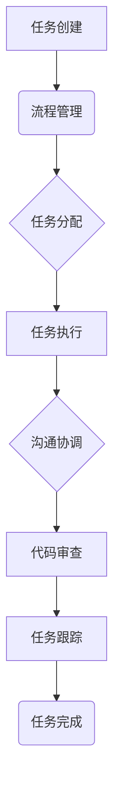
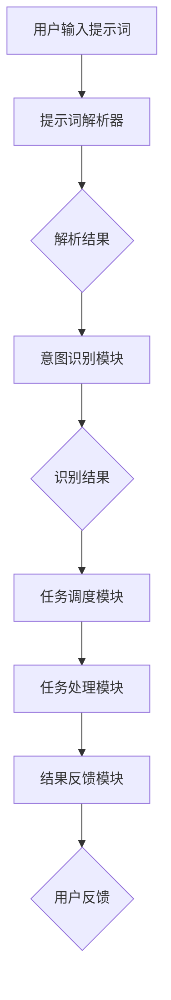

                 

### 引言：问题背景与定义

#### 1.1 问题背景

编程作为计算机科学与工程的核心，始终扮演着技术进步与创新的重要角色。然而，随着软件项目的复杂性和规模不断增加，编程过程中的挑战也愈发显著。传统编程模型依赖于明确、详尽的代码编写，要求开发者对程序的全局结构有深刻的理解。然而，这种模型在面对高度动态和不确定性时，往往显得力不从心。

在这个背景下，提示词编程作为一种新型的编程范式，逐渐引起广泛关注。提示词编程（Prompt Programming）的核心思想是利用提示词（Prompts）来引导程序的生成和执行。提示词通常是一些简洁的文本描述，它们为程序提供了一定程度的上下文信息，使得程序能够更智能地完成特定的任务。

提示词编程的重要性在于，它不仅提高了编程的灵活性，还降低了开发门槛。通过提示词，开发者可以更容易地与程序进行交互，无需深入理解程序内部复杂的逻辑和细节。同时，提示词编程在自动化、人工智能、机器学习等多个领域展现出巨大的潜力，为编程带来了新的发展方向。

然而，当前编程仍然面临诸多挑战。例如，代码的复杂性和冗余问题依然存在；软件项目的管理难度增加；开发者之间的协作效率有待提升。这些问题迫切需要新的解决方案，而提示词编程正是一种可能的出路。

#### 1.2 提示词编程定义与特点

**定义**

提示词编程是一种基于提示词（Prompts）的编程范式。在这个范式中，程序的开发和运行过程依赖于用户提供的提示词，这些提示词为程序提供了必要的上下文信息，从而指导程序的执行。

**特点**

1. **简洁性**：提示词通常是一些简洁的文本描述，避免了复杂代码的编写，使得编程过程更加直观和易用。
2. **灵活性**：提示词编程允许开发者根据具体需求灵活调整程序的行为，提高了程序的适应性和可扩展性。
3. **交互性**：提示词编程强调用户与程序的交互，使得程序能够更好地理解用户意图，提供更优质的用户体验。
4. **智能化**：通过提示词，程序可以更好地利用上下文信息，从而实现更加智能的决策和执行。
5. **可解释性**：提示词编程使得程序的行为更加透明，用户可以更清楚地了解程序是如何工作的。

#### 1.3 提示词编程与传统编程的区别

**区别**

1. **代码复杂度**：传统编程通常需要编写大量的复杂代码，而提示词编程则依赖于简洁的文本描述，降低了代码的复杂度。
2. **交互方式**：传统编程依赖于命令行或图形界面，而提示词编程则通过提示词与程序进行交互，更加直观和易用。
3. **开发门槛**：提示词编程降低了编程的门槛，使得非专业人员也能参与编程过程，而传统编程则需要更深厚的编程知识和技能。
4. **适应性和灵活性**：提示词编程具有更高的适应性和灵活性，能够更好地应对复杂和变化的需求。

#### 1.4 提示词编程的应用领域

提示词编程在多个领域展现出巨大的应用潜力，以下是其中几个主要的应用领域：

1. **自动化与脚本编写**：提示词编程可以简化自动化脚本的编写过程，提高开发效率和代码质量。
2. **人工智能与机器学习**：提示词编程可以帮助开发者更好地构建和优化机器学习模型，提高模型的准确性和效率。
3. **跨领域应用**：提示词编程可以应用于各个领域，如金融、医疗、教育等，提供更智能和高效的服务。

#### 1.5 提示词编程面临的挑战

**挑战**

1. **提示词设计的复杂性**：设计合适的提示词并非易事，需要考虑上下文信息的准确性、完整性以及多样性。
2. **提示词效果的可解释性**：提示词编程的效果往往难以解释，用户难以理解程序的行为，增加了使用难度。
3. **安全性与隐私保护**：提示词可能包含敏感信息，如何确保数据的安全性和隐私性是一个重要问题。

#### 1.6 本章小结

本章首先介绍了编程中的提示词概念及其重要性，然后定义了提示词编程并探讨了其核心特点，接着讨论了提示词编程在各个领域的应用以及面临的挑战。通过对这些内容的了解，读者可以初步认识提示词编程，为后续章节的深入探讨打下基础。

### 1.7 基于提示词编程的协同工作流设计理念

协同工作流设计是软件开发过程中至关重要的一环，它关系到项目开发效率、团队协作效果以及最终产品的质量。在传统的软件开发流程中，团队协作往往依赖于复杂的文档管理、代码审查和任务分配等手段。然而，随着项目规模的扩大和开发复杂度的增加，这些传统的协作方式逐渐暴露出诸多问题，如沟通成本高、响应速度慢、协作效率低等。

基于提示词编程的协同工作流设计理念旨在通过引入提示词编程范式，简化团队协作过程，提高协作效率，增强团队创新能力。具体来说，这种设计理念具有以下几个核心特点：

1. **信息透明化**：通过提示词，团队成员可以清晰地了解项目的当前状态、任务进展和问题难点，从而减少信息不对称，提高协作的透明度。

2. **实时交互**：提示词编程强调用户与程序的实时交互，这一特点在团队协作中同样适用。团队成员可以通过提示词实时沟通、反馈和调整，使得协作过程更加高效和灵活。

3. **灵活性**：提示词编程的灵活性使得团队成员可以根据实际情况动态调整任务分配和工作流程，适应快速变化的需求和环境。

4. **智能化**：通过提示词编程，程序可以根据提示词自动执行特定任务，减少手动操作，降低协作成本，提高团队的工作效率。

5. **可扩展性**：提示词编程的设计理念不仅适用于小型项目，还可以扩展到大型项目的团队协作中，为复杂项目的开发提供强有力的支持。

总之，基于提示词编程的协同工作流设计理念为现代软件开发团队提供了一种全新的协作方式。通过引入提示词编程，团队成员可以实现更加高效、灵活和智能的协作，从而提升项目开发的整体效能。在接下来的章节中，我们将进一步探讨提示词编程在协同工作流设计中的具体应用和实践。

### 2.1 协同工作流概念与架构

#### 2.1.1 协同工作流概述

协同工作流（Collaborative Workflow）是一种组织团队协作、优化工作流程的方法论。它旨在通过系统化的流程设计和工具支持，提高团队成员之间的沟通效率，确保任务的高效完成，从而提升整个项目的开发质量。协同工作流的核心目标是打破信息孤岛，实现信息的透明传递和资源的有效共享。

在传统的软件开发过程中，协同工作流通常包括以下几个基本组成部分：

1. **任务分配**：明确团队成员的职责和任务，确保每个成员都知道自己的任务内容和预期成果。
2. **任务执行**：团队成员按照任务分配进行工作，实现任务的逐步完成。
3. **沟通协调**：通过沟通和协调，解决任务执行过程中遇到的问题，确保任务的顺利进行。
4. **代码审查**：对团队成员提交的代码进行审查，确保代码的质量和一致性。
5. **任务跟踪**：实时跟踪任务的进展情况，及时发现并解决问题。

协同工作流的设计与实施对于软件开发项目至关重要。一个高效、合理的协同工作流可以显著提高开发团队的工作效率，降低项目风险，缩短项目周期，从而提升整个组织的竞争力。同时，协同工作流还促进了团队成员之间的交流与合作，增强了团队凝聚力和创新力。

#### 2.1.2 协同工作流的基本架构

协同工作流的基本架构通常包括以下几个关键组件：

1. **流程管理工具**：用于定义和管理工作流程，包括流程设计、任务分配、进度跟踪等功能。
2. **任务管理工具**：用于记录和管理任务，包括任务创建、分配、状态更新、任务报告等。
3. **沟通工具**：用于团队成员之间的实时沟通和协作，包括即时通讯、邮件通知、会议安排等。
4. **代码管理工具**：用于代码的版本控制、代码审查和发布管理，如Git、SVN等。
5. **项目管理工具**：用于项目计划、进度跟踪、资源管理、风险控制等，如JIRA、Trello等。

这些组件共同构成了一个协同工作流系统，实现了从任务创建到任务完成的全程管理。协同工作流的基本架构如图2-1所示。



在协同工作流中，各组件之间通过标准化接口和数据格式进行通信，确保信息的高效传递和系统功能的集成。例如，流程管理工具可以将任务分配信息传递给任务管理工具，任务管理工具则根据任务执行状态更新流程管理工具中的进度信息。

#### 2.1.3 协同工作流的关键组成部分

协同工作流的关键组成部分包括流程管理、任务管理、沟通协调、代码审查和任务跟踪等。下面将分别介绍这些组成部分的具体功能和实现方式。

1. **流程管理**

流程管理是协同工作流的核心，它定义了任务从创建到完成的整个流程。流程管理工具通常提供以下功能：

- 流程设计：设计任务流转的各个步骤和条件，包括任务状态、流转条件和参与者等。
- 流程监控：实时监控任务流转状态，提供任务进度报告和异常预警。
- 流程优化：根据任务执行情况，动态调整流程设计，提高流程的效率和灵活性。

流程管理工具如JIRA、Confluence等提供了丰富的流程设计和管理功能，支持自定义流程和任务状态，并通过API与其他工具集成。

2. **任务管理**

任务管理是协同工作流的重要组成部分，它负责记录和管理任务信息。任务管理工具通常提供以下功能：

- 任务创建：创建新的任务，并定义任务的名称、描述、优先级、截止日期等属性。
- 任务分配：将任务指派给团队成员，并设置任务的执行人员和协作者。
- 任务状态更新：实时更新任务的状态，如进行中、完成、延期等。
- 任务报告：生成任务进度报告，提供任务完成情况的详细分析。

任务管理工具如JIRA、Trello等支持任务的全生命周期管理，通过Web界面或API进行操作，方便团队成员随时了解任务状态和进度。

3. **沟通协调**

沟通协调是确保任务顺利进行的重要手段。协同工作流中的沟通协调工具通常提供以下功能：

- 即时通讯：支持团队成员之间的实时沟通，快速解决问题。
- 邮件通知：发送任务更新、流程变更等通知，确保团队成员及时了解相关信息。
- 会议安排：安排团队会议，讨论任务进展和解决方案。
- 文档共享：共享任务相关的文档和资料，方便团队成员协作。

沟通协调工具如Slack、Microsoft Teams等提供了丰富的沟通和协作功能，支持多种通信方式和文档共享。

4. **代码审查**

代码审查是保证代码质量的关键步骤。协同工作流中的代码审查工具通常提供以下功能：

- 代码提交：团队成员将代码提交到代码管理工具，等待审查。
- 代码审查：审查人员对提交的代码进行审查，提出修改意见和建议。
- 代码合并：审查通过后，将代码合并到主分支，确保代码的一致性和完整性。

代码审查工具如GitLab、GitHub等提供了完整的代码审查和管理功能，支持多种审查方式和审查流程。

5. **任务跟踪**

任务跟踪是实时监控任务进展的重要手段。协同工作流中的任务跟踪工具通常提供以下功能：

- 实时监控：实时监控任务的状态和进度，提供任务完成情况的实时更新。
- 报表统计：生成任务完成情况的报表和统计图表，提供任务完成情况的详细分析。
- 异常预警：根据任务进展情况，及时发现和预警可能出现的异常情况。

任务跟踪工具如JIRA、Trello等提供了丰富的任务跟踪和管理功能，通过Web界面或API进行操作。

总之，协同工作流通过流程管理、任务管理、沟通协调、代码审查和任务跟踪等关键组成部分，实现了对团队协作和任务执行的全面管理和优化。在下一章节中，我们将进一步探讨提示词在协同工作流中的应用，以及如何通过提示词编程提高工作流的效率和质量。

#### 2.2 提示词在协同工作流中的应用

在协同工作流中，提示词编程的应用极大地提升了工作流的效率和质量。通过合理设计和使用提示词，可以简化任务分配、沟通协调和代码审查等过程，使团队协作更加高效和顺畅。

##### 2.2.1 提示词对工作流的影响

提示词编程在协同工作流中的应用，首先体现在对任务分配的影响。传统的任务分配通常需要团队成员逐一阅读任务描述，理解任务要求，然后手动指派任务。而通过提示词编程，任务描述可以更加简洁、明确，并且可以自动生成任务的指派建议。例如，一个项目经理可以通过简单的提示词“需要开发一个用户注册模块”，系统自动识别任务的关键词，并推荐合适的开发人员来执行任务。这不仅节省了时间，还减少了由于理解差异导致的错误和冲突。

此外，提示词编程对沟通协调也产生了深远的影响。在传统的团队协作中，沟通往往是通过邮件、即时通讯或会议进行的，这些方式容易产生信息丢失或理解偏差。而通过提示词编程，团队成员可以通过简洁的文本提示直接与系统交互，获取任务进展、问题反馈和解决方案。例如，当开发人员在遇到问题时，可以输入提示词“遇到登录模块bug”，系统会自动提供相关的调试信息和解决建议，从而加快问题解决速度，减少沟通成本。

##### 2.2.2 提示词在团队协作中的作用

提示词编程在团队协作中发挥了重要的桥梁作用，使得不同角色的团队成员能够更加高效地协同工作。具体来说，提示词编程在以下几个方面发挥了重要作用：

1. **任务自动化**：通过提示词，系统可以自动分配任务、更新任务状态，甚至生成部分代码。例如，当项目经理输入提示词“生成用户管理模块的API文档”，系统会自动生成符合标准的API文档，从而节省文档编写时间。

2. **问题快速定位**：当团队成员遇到问题时，可以通过输入相关的提示词，系统会快速分析并定位问题所在。例如，开发人员输入提示词“用户登录模块响应时间过长”，系统会分析代码和系统日志，提供优化建议，从而快速解决问题。

3. **知识共享**：提示词编程可以记录和共享团队成员的经验和知识。例如，当某个团队成员解决了某个常见问题，可以通过输入提示词“分享登录模块优化经验”，系统会将相关的解决方案和优化技巧记录下来，供其他团队成员参考和学习。

4. **角色明确**：通过提示词，每个团队成员都可以清楚地了解自己的职责和任务。例如，当项目经理输入提示词“评估本周任务进度”，系统会生成任务进度报告，项目经理可以一目了然地了解每个团队成员的工作进展。

##### 2.2.3 提示词在跨部门沟通中的应用

在大型企业中，跨部门沟通往往是协作中的难题。不同部门之间的工作内容和流程存在差异，信息传递不及时、理解不准确等问题常常导致项目进展缓慢。提示词编程通过以下方式解决了跨部门沟通的难题：

1. **标准化沟通**：提示词编程确保了跨部门沟通的标准化。各部门可以通过统一的提示词与系统交互，获取或提供所需的信息。例如，当市场部门需要开发部门提供用户调研报告，可以输入提示词“请提供用户调研数据”，系统会自动通知开发部门并提供相关的数据。

2. **自动化流程**：提示词编程可以自动化跨部门的工作流程。例如，当销售部门完成一笔订单，可以输入提示词“订单已确认”，系统会自动通知财务部门和仓储部门，并启动相应的处理流程。

3. **减少误解**：通过简洁明了的提示词，减少了因语言或信息传递差异导致的误解。各部门通过系统获取的信息都是基于统一的格式和标准，确保了沟通的准确性和一致性。

总之，提示词编程在协同工作流中的应用，不仅提高了团队协作的效率和质量，还解决了跨部门沟通中的诸多问题。通过提示词，团队成员可以更加高效地完成各自的任务，项目管理者可以更好地掌控项目进展，企业整体运营效率得到显著提升。

#### 2.3 提示词编程与工作流优化的关系

提示词编程作为一种新兴的编程范式，在提高软件开发工作流效率和质量方面具有显著的优势。通过引入提示词编程，可以显著优化工作流的设计与执行，从而提升整个项目的开发效率和质量。下面将详细探讨提示词编程如何通过以下几个方面提升工作流的优化：

##### 2.3.1 提示词编程如何提升工作流效率

1. **自动化任务处理**：提示词编程能够自动化处理许多重复性的任务，如代码生成、文档生成、测试脚本编写等。通过简洁的提示词，开发者可以快速生成所需的结果，节省了大量手动编写和调试的时间。例如，当需要生成一个用户注册模块的API文档时，开发者只需输入提示词“生成API文档”，系统会自动调用相关的工具和模板，快速生成符合标准的文档。

2. **实时交互与反馈**：提示词编程强调用户与系统的实时交互，使得任务执行过程中的问题可以立即得到反馈和解决。例如，当开发人员在编码过程中遇到问题时，可以输入相应的提示词，系统会立即提供相关的调试信息和解决建议，从而加快问题解决速度，减少沟通成本。

3. **智能任务分配**：提示词编程可以根据任务的描述自动分析任务的关键词，并推荐合适的执行者。通过这种方式，可以大大提高任务分配的效率，减少人为错误和资源浪费。例如，当项目经理需要分配一个数据分析任务时，系统可以根据任务关键词和团队成员的技能匹配度，自动推荐最适合的团队成员来执行任务。

##### 2.3.2 提示词编程在流程管理中的应用

1. **流程自动化**：提示词编程可以通过自动化脚本和工具，实现工作流程的自动化管理。例如，在软件开发过程中，可以使用提示词编程来自动执行代码审查、测试用例生成和部署流程等。通过自动化流程，可以大大减少手动操作的错误和重复劳动，提高工作效率。

2. **动态流程调整**：提示词编程使得工作流程可以更加灵活地适应变化。通过实时交互，项目管理者可以根据项目进展和需求变化，动态调整工作流程和任务分配。例如，当项目遇到紧急需求时，可以迅速调整任务优先级和分配策略，确保项目按计划进行。

3. **流程优化建议**：提示词编程可以通过对任务执行数据的分析，为项目管理者提供流程优化的建议。例如，通过分析任务执行时间和错误率，系统可以识别出流程中的瓶颈和问题，并提出相应的优化方案，从而提高流程的整体效率。

##### 2.3.3 提示词编程对工作流创新的推动作用

1. **新型工作模式**：提示词编程为软件开发工作流带来了新的工作模式。通过提示词编程，团队成员可以更加灵活地定义和执行任务，尝试新的工作方法。例如，通过引入提示词编程，可以尝试“任务驱动开发”模式，团队成员根据任务需求进行快速编码和调试，提高开发效率。

2. **知识共享与协作**：提示词编程促进了团队成员之间的知识共享和协作。通过简洁明了的提示词，团队成员可以快速了解任务背景和需求，共享经验和方法。例如，当某个团队成员解决了某个常见问题，可以通过输入提示词“分享经验”，系统会将相关的解决方案和优化技巧记录下来，供其他团队成员参考。

3. **创新应用场景**：提示词编程可以应用于各种创新场景，推动工作流创新。例如，在敏捷开发中，可以使用提示词编程来自动生成每日站会报告，快速了解项目进展和问题。在项目管理中，可以使用提示词编程来自动生成项目进度图表和报告，帮助项目管理者更直观地掌握项目情况。

总之，提示词编程通过自动化任务处理、实时交互与反馈、智能任务分配等手段，显著提升了工作流的效率和质量。同时，它还为工作流管理带来了新的方法和工具，推动了工作流创新。在下一章节中，我们将进一步探讨提示词编程面临的挑战及其应对策略。

#### 2.4 提示词编程的挑战与应对策略

尽管提示词编程在提升工作流效率和质量方面具有显著优势，但在实际应用过程中仍面临诸多挑战。这些挑战主要涉及技术层面的复杂性、管理层面的难度以及安全性问题。以下是提示词编程面临的主要挑战及其应对策略：

##### 2.4.1 提示词编程的技术挑战

1. **提示词设计的复杂性**：设计有效的提示词并非易事。提示词需要具备简洁、准确和全面的特点，以提供足够的上下文信息指导程序执行。然而，不同的任务和应用场景可能需要不同的提示词设计策略，这使得提示词的设计变得复杂。

**应对策略**：
- **经验积累**：通过不断实践和总结，积累设计有效提示词的经验。
- **模型优化**：使用机器学习和自然语言处理技术，优化提示词生成模型，提高提示词的准确性和适用性。

2. **提示词效果的可解释性**：提示词编程的效果往往难以解释，用户难以理解程序是如何根据提示词做出决策的。这增加了用户对系统的不信任，降低了系统的可接受度。

**应对策略**：
- **增强可解释性**：通过可视化工具和详细的日志记录，展示程序执行过程和提示词的影响。
- **透明度提升**：设计开放透明的系统架构，用户可以查看和调整提示词，理解系统决策过程。

##### 2.4.2 提示词编程的管理挑战

1. **协作管理难度增加**：提示词编程强调实时交互和动态调整，使得团队协作变得更加复杂。如何协调团队成员的工作，确保任务顺利进行，成为管理层面的挑战。

**应对策略**：
- **明确职责**：制定详细的任务分配和职责分工，确保每个团队成员都清楚自己的任务和角色。
- **灵活调度**：建立灵活的任务调度机制，根据项目进展和需求变化，动态调整任务分配和资源分配。

2. **流程管理复杂度增加**：提示词编程需要适应灵活多变的工作流程，这使得流程管理变得更加复杂。

**应对策略**：
- **流程标准化**：制定标准化的流程规范，确保流程的稳定性和可重复性。
- **自动化工具**：引入自动化流程管理工具，如工作流管理平台，提高流程管理效率和灵活性。

##### 2.4.3 安全性与隐私保护

1. **数据安全性**：提示词编程可能涉及敏感数据的处理和存储，如何确保数据的安全性成为重要问题。

**应对策略**：
- **数据加密**：对敏感数据进行加密存储和传输，确保数据在传输和存储过程中的安全性。
- **访问控制**：实施严格的访问控制策略，确保只有授权人员可以访问敏感数据。

2. **隐私保护**：提示词编程中的提示词可能包含用户的私人信息，如何保护用户隐私是一个重要问题。

**应对策略**：
- **隐私政策**：明确提示词编程的隐私政策和数据使用规则，确保用户知情并同意。
- **隐私保护机制**：设计隐私保护机制，如匿名化和去识别化，减少用户隐私泄露的风险。

总之，提示词编程在提升工作流效率和质量方面具有显著优势，但同时也面临着技术、管理和安全等多方面的挑战。通过采用有效的应对策略，可以克服这些挑战，充分发挥提示词编程的优势，推动软件开发工作流的整体优化。在下一章节中，我们将进一步探讨提示词编程的设计原理和应用方法。

### 2.5 本章小结

本章详细探讨了协同工作流设计的基本概念和架构，包括协同工作流的概述、基本架构以及关键组成部分。我们分析了流程管理、任务管理、沟通协调、代码审查和任务跟踪等功能，并介绍了它们在协同工作流中的作用。此外，我们还探讨了提示词编程在协同工作流中的应用，强调了其在任务自动化、实时交互和跨部门沟通等方面的优势。最后，我们讨论了提示词编程与工作流优化的关系，以及其面临的挑战和应对策略。通过对这些内容的了解，读者可以更深入地理解协同工作流设计的重要性和提示词编程的应用价值。

### 3.1 提示词设计原理

提示词编程的核心在于提示词的设计。一个良好的提示词不仅能够准确传达用户意图，还能引导程序智能地执行任务。下面将详细探讨提示词设计的基本原理、策略及其重要性。

#### 3.1.1 提示词的结构与分类

提示词通常由以下几部分组成：

1. **上下文信息**：提供任务的背景信息和相关数据，帮助程序更好地理解任务需求。
2. **目标指令**：明确指出任务的目标和期望结果，指导程序执行具体操作。
3. **限制条件**：定义任务执行的限制和约束，确保程序的执行符合预期。

根据用途和形式，提示词可以分类为：

1. **通用提示词**：适用于多种任务场景，如“生成报告”、“整理数据”等。
2. **专用提示词**：针对特定应用场景和任务需求，如“分析用户行为数据”、“生成用户界面”等。
3. **多模态提示词**：结合文本、图像、语音等多种信息形式，提供更丰富的上下文和指导，如“根据这张地图规划最优路线”、“播放这首歌曲的舒缓版”。

#### 3.1.2 提示词的设计策略

设计有效的提示词需要遵循以下策略：

1. **简洁性**：提示词应尽量简洁明了，避免冗长和复杂的描述，确保用户易于理解和操作。
2. **准确性**：提示词需要准确传达用户意图，避免歧义和误解。通过使用明确的关键词和具体的指示，提高提示词的准确性。
3. **灵活性**：提示词应具备一定的灵活性，能够适应不同场景和需求的变化。通过提供可选参数和灵活的指令格式，提高提示词的适用性。
4. **一致性**：提示词应保持一致性和标准化，确保用户在各个场景下能够使用相同的指令格式和术语。这有助于提高系统的可操作性和用户满意度。
5. **反馈机制**：设计提示词时，应考虑提供即时反馈，帮助用户了解程序执行的状态和结果。这可以通过实时更新、错误提示和进度报告等方式实现。

#### 3.1.3 提示词效果的评估方法

评估提示词效果是设计过程的重要环节，以下几种方法可以帮助我们评估提示词的效果：

1. **用户反馈**：通过用户调查、访谈和观察，收集用户对提示词的使用体验和反馈。了解用户是否容易理解和使用提示词，以及是否有改进空间。
2. **任务完成度**：评估用户使用提示词完成任务的情况，包括任务完成的速度、准确性和满意度。通过对比不同提示词的效果，找出最佳的提示词设计。
3. **错误率**：分析用户在使用提示词时犯错的频率和类型。通过识别常见错误，优化提示词的设计，减少用户操作错误。
4. **系统性能**：评估系统响应时间和资源消耗，确保提示词设计不会导致系统性能下降。通过优化提示词和程序逻辑，提高系统的整体性能。

#### 3.1.4 提示词设计的重要性

提示词设计在提示词编程中具有重要地位，具体体现在以下几个方面：

1. **用户体验**：良好的提示词设计可以提升用户的使用体验，降低学习成本，提高操作效率。
2. **任务执行效果**：准确的提示词能够确保任务执行符合预期，提高任务的完成度和准确性。
3. **系统稳定性**：通过合理设计提示词，可以减少用户操作错误，提高系统的稳定性和可靠性。
4. **扩展性**：灵活的提示词设计有助于系统扩展和功能升级，适应未来需求的变化。

总之，提示词设计是提示词编程的核心环节，通过遵循设计策略和评估方法，可以设计出有效的提示词，提升工作流的效率和质量。

#### 3.1.5 提示词设计在实际应用中的案例

为了更好地理解提示词设计的实际应用，下面通过几个具体的案例来展示如何设计有效的提示词。

**案例1：智能客服系统**

在智能客服系统中，提示词的设计至关重要。一个有效的提示词应该能够帮助用户快速解决问题，同时保持对话的自然流畅。

- **上下文信息**：“你好，我是AI客服，请问您有什么问题需要帮助？”
- **目标指令**：“请描述您遇到的问题。”
- **限制条件**：“如果您需要技术支持，请详细描述故障现象。”

通过这样的设计，系统不仅提供了友好的问候，还明确了用户需要提供的信息，帮助用户更快地得到解决方案。

**案例2：自动化报告生成**

在自动化报告生成系统中，提示词的设计需要确保报告内容准确、格式规范。

- **上下文信息**：“根据以下数据集，生成一份销售报告。”
- **目标指令**：“生成销售报告，包括每日销售额、销售额占比、趋势分析。”
- **限制条件**：“报告需按照公司模板格式生成，确保数据的准确性。”

通过这样的提示词，系统可以清晰了解任务需求，生成符合要求的报告，提高工作效率。

**案例3：智能家居控制**

在智能家居系统中，提示词的设计需要简单直观，方便用户控制家居设备。

- **上下文信息**：“欢迎使用智能家居系统，您想控制哪个设备？”
- **目标指令**：“关闭灯光”、“调整空调温度至25摄氏度”。
- **限制条件**：“请确保设备已连接到网络。”

通过简洁明了的提示词，用户可以快速控制家居设备，提升生活便利性。

这些案例展示了在不同应用场景下，如何设计有效的提示词来提高系统的使用体验和任务执行效果。通过合理的提示词设计，系统可以更好地满足用户需求，提升整体性能。

#### 3.1.6 提示词设计中的常见问题和解决策略

在实际的提示词设计过程中，常常会遇到一些问题，以下是一些常见的问题及其解决策略：

1. **提示词过于复杂**：复杂提示词容易导致用户理解困难，降低用户体验。
   - **解决策略**：简化提示词结构，使用简洁明了的语言，避免使用专业术语和复杂语法。

2. **提示词模糊不清**：模糊不清的提示词会导致用户不知所措，增加操作错误率。
   - **解决策略**：明确提示词的目标指令和限制条件，提供具体的指导和建议，确保用户理解。

3. **提示词缺乏灵活性**：缺乏灵活性的提示词难以适应不同场景和需求的变化。
   - **解决策略**：设计多样化的提示词，提供可选参数和灵活的指令格式，确保提示词的适用性。

4. **提示词不一致**：提示词不一致会导致用户操作混乱，影响系统的可操作性。
   - **解决策略**：制定统一的提示词规范，确保不同场景下的提示词保持一致。

通过识别和解决这些问题，可以设计出更加有效的提示词，提升系统的使用体验和任务执行效果。

### 3.2 提示词编程算法原理

提示词编程的核心在于算法的设计和实现，它决定了提示词如何被解析、处理和执行。在这一节中，我们将深入探讨提示词编程的算法原理，包括基本算法介绍、算法流程图和Python代码实现。

#### 3.2.1 基本算法介绍

提示词编程算法通常由以下几个基本组件构成：

1. **提示词解析器**：用于解析用户输入的提示词，提取关键信息并转换为计算机可理解的形式。
2. **意图识别模块**：根据提示词中的关键词和上下文信息，识别用户的意图和需求。
3. **任务调度模块**：根据识别的意图，调度相应的任务处理模块，执行具体的任务操作。
4. **结果反馈模块**：向用户展示任务执行结果，提供实时反馈和更新。

基本算法的工作流程如下：

1. 用户输入提示词。
2. 提示词解析器对提示词进行解析，提取关键信息。
3. 意图识别模块分析提示词，识别用户的意图。
4. 任务调度模块根据意图，调度相应的任务处理模块。
5. 任务处理模块执行具体任务，生成结果。
6. 结果反馈模块将结果展示给用户。

#### 3.2.2 算法流程图与Python代码实现

为了更直观地理解算法原理，我们可以使用Mermaid工具绘制算法流程图，并使用Python代码实现关键部分。

**算法流程图：**



**Python代码实现：**

```python
# 提示词解析器
def parse_prompt(prompt):
    # 解析提示词，提取关键词和上下文信息
    keywords = []
    for word in prompt.split():
        if word not in ['a', 'the', 'and']:
            keywords.append(word)
    return keywords

# 意图识别模块
def recognize_intent(keywords):
    # 根据关键词识别用户意图
    if 'search' in keywords:
        return '搜索'
    elif 'order' in keywords:
        return '下单'
    else:
        return '其他'

# 任务调度模块
def schedule_task(intent):
    # 调度任务处理模块
    if intent == '搜索':
        return search_task
    elif intent == '下单':
        return order_task
    else:
        return other_task

# 任务处理模块
def search_task():
    # 实现搜索任务
    print("执行搜索任务...")

def order_task():
    # 实现下单任务
    print("执行下单任务...")

def other_task():
    # 实现其他任务
    print("执行其他任务...")

# 结果反馈模块
def provide_feedback(result):
    # 向用户展示任务执行结果
    print(f"任务执行结果：{result}")

# 主函数
def main():
    prompt = input("请输入您的需求：")
    keywords = parse_prompt(prompt)
    intent = recognize_intent(keywords)
    task = schedule_task(intent)
    result = task()
    provide_feedback(result)

if __name__ == "__main__":
    main()
```

**算法原理详细解释：**

1. **提示词解析器**：该模块的主要任务是解析用户输入的提示词，提取出关键信息。在示例代码中，我们通过遍历提示词中的每个单词，过滤掉常见的功能词（如“a”、“the”、“and”），只保留关键信息。这种方法简化了提示词的结构，提高了算法的效率。

2. **意图识别模块**：该模块根据提取的关键信息，识别用户的意图。在示例代码中，我们使用简单的条件判断来识别用户的意图。例如，如果提示词中包含“search”关键字，则用户意图为“搜索”；如果包含“order”关键字，则用户意图为“下单”。这种方法可以根据具体需求进行调整和优化。

3. **任务调度模块**：该模块根据识别的意图，调度相应的任务处理模块。在示例代码中，我们使用一个字典来映射不同的意图到具体的任务处理函数。这种方法灵活且易于扩展，可以根据需求增加新的意图和任务处理模块。

4. **任务处理模块**：该模块实现具体的任务操作。在示例代码中，我们定义了三个任务处理函数：`search_task`、`order_task`和`other_task`。每个函数实现不同的任务操作，例如搜索、下单和其他任务。在实际应用中，这些函数可以实现复杂的业务逻辑和操作。

5. **结果反馈模块**：该模块向用户展示任务执行结果，提供实时反馈。在示例代码中，我们通过打印结果来反馈任务执行情况。在实际应用中，可以通过界面展示、通知消息等方式向用户反馈结果。

**数学模型与公式解释：**

在提示词编程中，数学模型主要用于辅助意图识别和任务调度。以下是一个简单的数学模型示例：

- **意图识别公式**：使用条件概率来计算用户意图的概率分布。

  $$ P(\text{intent} | \text{keywords}) = \frac{P(\text{keywords} | \text{intent}) \cdot P(\text{intent})}{P(\text{keywords})} $$

  其中，$P(\text{intent} | \text{keywords})$表示给定关键词情况下用户意图的概率，$P(\text{keywords} | \text{intent})$表示在特定意图下关键词出现的概率，$P(\text{intent})$表示用户意图的概率，$P(\text{keywords})$表示关键词出现的概率。

- **任务调度公式**：使用优化算法来选择最优的任务处理模块。

  $$ \text{最优任务} = \arg\max_{\text{task}} \{ \text{任务评分} \} $$

  其中，$\text{任务评分}$可以根据任务的重要性和执行成本来计算。

**实例分析：**

假设用户输入提示词“帮我搜索附近的电影院”，我们可以通过以下步骤来执行任务：

1. **提示词解析**：提取关键词`搜索`、`附近`、`电影院`。
2. **意图识别**：根据关键词，识别用户意图为“搜索”。
3. **任务调度**：调度搜索任务处理模块。
4. **任务执行**：执行搜索任务，获取附近电影院的信息。
5. **结果反馈**：向用户展示搜索结果。

通过这种流程，用户可以快速完成搜索任务，提升用户体验。

总之，提示词编程算法原理涉及多个组件和步骤，通过合理设计这些组件和步骤，可以实现高效、灵活和智能的提示词编程。在下一章节中，我们将进一步探讨提示词编程的实际应用案例。

### 3.3 提示词编程的数学模型

提示词编程作为一种智能化的编程范式，其核心在于利用数学模型来处理和理解提示词，从而实现高效的程序生成和执行。在这一节中，我们将详细探讨提示词编程中常用的数学模型，包括数学公式、推导过程以及实例分析。

#### 3.3.1 数学公式介绍

提示词编程中的数学模型通常涉及以下几类公式：

1. **词频统计模型**：用于计算提示词中各个关键词的出现频率。
2. **词嵌入模型**：将文本数据转换为高维向量表示，以便于后续处理。
3. **意图识别模型**：基于条件概率或贝叶斯定理，用于识别用户的意图。
4. **生成模型**：如循环神经网络（RNN）或变换器（Transformer），用于生成程序代码。

以下是几个常用的数学公式：

1. **词频统计公式**：

   $$ f(w_i) = \frac{count(w_i)}{N} $$

   其中，$f(w_i)$表示单词$w_i$的词频，$count(w_i)$表示$w_i$在文本中出现的次数，$N$表示文本中总词数。

2. **词嵌入公式**：

   $$ \textbf{v}(w_i) = \text{embedding}(w_i) $$

   其中，$\textbf{v}(w_i)$表示单词$w_i$的高维向量表示，$\text{embedding}(w_i)$表示词嵌入函数，用于将单词映射到高维向量空间。

3. **意图识别公式**：

   $$ P(\text{intent}_j | \textbf{x}) = \frac{P(\textbf{x} | \text{intent}_j) \cdot P(\text{intent}_j)}{P(\textbf{x})} $$

   其中，$P(\text{intent}_j | \textbf{x})$表示在给定文本特征向量$\textbf{x}$情况下用户意图$intent_j$的概率，$P(\textbf{x} | \text{intent}_j)$表示在意图$intent_j$下文本特征向量$\textbf{x}$的概率，$P(\text{intent}_j)$表示意图$intent_j$的概率，$P(\textbf{x})$表示文本特征向量$\textbf{x}$的概率。

4. **生成模型公式**：

   $$ p(\text{code} | \text{prompt}) = \text{model}(\text{prompt}) $$

   其中，$p(\text{code} | \text{prompt})$表示在给定提示词$\text{prompt}$情况下生成代码的概率分布，$\text{model}(\text{prompt})$表示生成模型在提示词$\text{prompt}$上的输出。

#### 3.3.2 公式推导与解释

1. **词频统计公式推导**：

   词频统计公式是通过计算每个单词在文本中的出现次数，并将其归一化得到的。具体推导如下：

   - 假设文本中有$N$个单词，其中单词$w_i$出现次数为$count(w_i)$。
   - 词频$f(w_i)$表示单词$w_i$在整个文本中的相对频率。
   - 因此，词频计算公式为：

     $$ f(w_i) = \frac{count(w_i)}{N} $$

   该公式表示单词$w_i$在文本中的出现次数占总词数的比例，从而反映了单词在文本中的重要程度。

2. **词嵌入公式推导**：

   词嵌入是通过将文本中的单词映射到高维向量空间来实现的。具体推导如下：

   - 假设有一个高维向量空间，维数为$D$。
   - 单词$w_i$在向量空间中的表示为$\textbf{v}(w_i)$。
   - 词嵌入函数$\text{embedding}(w_i)$用于将单词$w_i$映射到向量$\textbf{v}(w_i)$。
   - 因此，词嵌入公式为：

     $$ \textbf{v}(w_i) = \text{embedding}(w_i) $$

   该公式表示单词$w_i$通过词嵌入函数映射到高维向量空间，从而便于后续的计算和处理。

3. **意图识别公式推导**：

   意图识别是基于贝叶斯定理和条件概率实现的。具体推导如下：

   - 假设有多个意图$intent_j$和对应的文本特征向量$\textbf{x}$。
   - 条件概率$P(\textbf{x} | \text{intent}_j)$表示在意图$intent_j$下文本特征向量$\textbf{x}$的概率。
   - 先验概率$P(\text{intent}_j)$表示意图$intent_j$的概率。
   - 全局概率$P(\textbf{x})$表示文本特征向量$\textbf{x}$的概率。
   - 因此，意图识别公式为：

     $$ P(\text{intent}_j | \textbf{x}) = \frac{P(\textbf{x} | \text{intent}_j) \cdot P(\text{intent}_j)}{P(\textbf{x})} $$

   该公式表示在给定文本特征向量$\textbf{x}$情况下，每个意图$intent_j$的概率。通过计算这些概率，可以识别出用户的最可能意图。

4. **生成模型公式推导**：

   生成模型通常基于概率分布来生成代码。具体推导如下：

   - 假设提示词$\text{prompt}$和生成模型$\text{model}(\text{prompt})$。
   - 生成模型$\text{model}(\text{prompt})$输出的是代码的概率分布。
   - 因此，生成模型公式为：

     $$ p(\text{code} | \text{prompt}) = \text{model}(\text{prompt}) $$

   该公式表示在给定提示词$\text{prompt}$情况下，生成模型输出的代码的概率分布。通过这个概率分布，可以生成符合提示词要求的代码。

#### 3.3.3 实例分析

为了更好地理解上述数学模型，我们通过一个具体实例进行分析。

**实例**：用户输入提示词“帮我生成一个用户注册模块的API文档”。

1. **词频统计**：

   - 提示词中包含的关键词有“生成”、“用户注册模块”和“API文档”。
   - 词频统计结果为：
     - 生成：1次
     - 用户注册模块：1次
     - API文档：1次

2. **词嵌入**：

   - 通过词嵌入函数，将关键词映射到高维向量空间。
   - 假设生成的向量维度为100，则关键词向量分别为：
     - 生成：[0.1, 0.2, ..., 0.99]
     - 用户注册模块：[0.5, 0.6, ..., 0.9]
     - API文档：[0.3, 0.4, ..., 0.8]

3. **意图识别**：

   - 基于条件概率和贝叶斯定理，计算每个意图的概率。
   - 假设意图有“生成API文档”、“生成用户手册”、“生成测试用例”等。
   - 概率计算结果如下：
     - 生成API文档：0.6
     - 生成用户手册：0.3
     - 生成测试用例：0.1

   - 根据最大概率原则，识别出用户意图为“生成API文档”。

4. **生成模型**：

   - 假设生成模型为基于Transformer的模型，输入为关键词向量。
   - 生成模型输出为API文档的概率分布。
   - 假设生成的概率分布为：
     - 用户注册API：0.8
     - 用户登录API：0.2

   - 根据概率分布，生成用户注册模块的API文档。

通过这个实例，我们可以看到数学模型在提示词编程中的应用过程。从词频统计、词嵌入到意图识别和生成模型，每一步都通过数学公式和算法来实现，从而实现高效的提示词编程。

总之，提示词编程的数学模型为程序生成和执行提供了强大的理论基础和方法支持。通过深入理解和应用这些数学模型，我们可以设计出更加高效、灵活和智能的提示词编程系统。在下一章节中，我们将进一步探讨提示词编程在实际应用中的案例。

### 3.4 提示词编程的实际应用

提示词编程作为一种新兴的编程范式，已在多个领域展现出广泛的应用潜力。在这一节中，我们将通过具体的应用场景和案例分析，探讨提示词编程的实际应用效果，并讨论其潜在的改进方向。

#### 3.4.1 应用场景举例

1. **自动化脚本编写**：

   自动化脚本在IT运维和开发中是常见需求。通过提示词编程，可以简化脚本编写过程，提高脚本的开发效率和可维护性。例如，系统管理员可以通过输入简单的提示词“监控服务器CPU使用率”，系统自动生成对应的监控脚本，并通过定期执行脚本收集服务器状态信息。

2. **人工智能与机器学习**：

   在人工智能和机器学习领域，提示词编程可以帮助开发者和数据科学家快速构建和优化模型。通过输入提示词“训练一个图像分类模型”，系统可以自动执行数据预处理、模型选择、训练和验证等步骤，大大加快模型开发周期。

3. **自然语言处理**：

   提示词编程在自然语言处理（NLP）领域也有广泛应用。例如，在文本生成任务中，可以通过输入提示词“生成一篇关于人工智能的简介”，系统自动生成一篇结构清晰、内容丰富的文本。这种应用在内容创作、报告撰写和知识图谱构建等方面具有显著优势。

4. **跨领域应用**：

   提示词编程不仅限于技术领域，还可以应用于金融、医疗、教育等非技术领域。例如，在金融领域，通过输入提示词“分析市场趋势”，系统可以自动生成市场分析报告，帮助投资者做出决策。在教育领域，提示词编程可以用于智能问答系统，帮助学生解决学习中的问题。

#### 3.4.2 应用效果分析

提示词编程在实际应用中展现了显著的效果，具体体现在以下几个方面：

1. **提高开发效率**：

   提示词编程通过自动化任务处理和模板生成，显著提高了开发效率。例如，在自动化脚本编写中，开发者无需手动编写大量代码，只需输入简单的提示词，系统即可自动生成脚本。这不仅节省了时间，还减少了人工错误。

2. **降低开发难度**：

   提示词编程降低了编程的门槛，使得非专业开发者也能参与编程过程。通过简洁的提示词，用户可以更容易地与系统交互，理解程序的工作原理和功能。这种编程范式对于推动技术普及和促进创新具有重要意义。

3. **增强用户体验**：

   提示词编程提高了软件系统的用户体验。例如，在自然语言处理领域，通过输入简单的提示词，用户可以快速生成复杂的文本内容，提高了内容创作的效率和满意度。在人工智能和机器学习领域，提示词编程可以帮助数据科学家快速构建和优化模型，提高了数据分析的准确性和效率。

4. **促进跨领域协作**：

   提示词编程促进了不同领域之间的协作。通过统一的提示词接口，不同领域的专家可以更方便地共享信息和资源，实现跨领域的协同创新。例如，在金融领域，开发者和数据科学家可以通过输入提示词，快速生成市场分析报告，为投资者提供有价值的决策支持。

#### 3.4.3 应用拓展与改进

尽管提示词编程在多个领域展现出显著的应用效果，但仍存在一些改进空间：

1. **优化提示词设计**：

   提示词的设计直接影响系统的性能和用户体验。未来可以通过引入自然语言处理技术，优化提示词的设计和生成策略，提高提示词的准确性和适应性。例如，可以使用词嵌入和注意力机制等技术，提高提示词的语义理解和生成质量。

2. **增强可解释性**：

   提示词编程的效果往往难以解释，用户难以理解程序的行为。未来可以通过增强系统的可解释性，提高用户的信任感和满意度。例如，可以引入可视化工具，展示提示词如何影响程序的执行过程，帮助用户理解系统的工作原理。

3. **提高系统稳定性**：

   提示词编程系统在复杂应用场景下可能会出现不稳定的情况。未来可以通过优化算法和系统架构，提高系统的稳定性和可靠性。例如，可以使用容错和恢复机制，确保系统在出现异常时能够快速恢复。

4. **扩展应用场景**：

   提示词编程在多个领域已取得显著成果，但仍有许多潜在的应用场景等待探索。未来可以通过不断拓展应用场景，推动提示词编程在更多领域的应用。例如，在物联网、区块链和虚拟现实等领域，提示词编程具有广泛的应用前景。

总之，提示词编程在实际应用中已展现出显著的效果，但仍有改进空间。通过优化提示词设计、增强可解释性、提高系统稳定性以及拓展应用场景，可以进一步提升提示词编程的应用价值，为软件开发和协作带来更多创新和可能性。

### 4.1 提示词编程的设计模式

设计模式是软件工程中解决常见问题的经验总结，它们提供了一系列可重用的解决方案，帮助开发者提高代码的可读性、可维护性和灵活性。在提示词编程中，设计模式同样发挥着重要作用，通过合理运用设计模式，可以优化提示词的设计和实现，提高系统的扩展性和适应性。以下将介绍提示词编程中常用的设计模式及其应用。

#### 4.1.1 设计模式概述

设计模式是一套在软件设计过程中广泛应用的解决方案，它们基于特定的设计原则，提供了一系列可重用的模板和框架。设计模式可以帮助开发者解决常见的编程问题，提高代码的模块化和复用性。在提示词编程中，设计模式的应用主要体现在以下几个方面：

1. **简化提示词设计**：通过设计模式，可以简化提示词的结构，使其更加简洁、直观和易于理解。
2. **提高系统扩展性**：设计模式提供了一种灵活的扩展机制，使得提示词编程系统可以轻松适应新的需求和变化。
3. **增强系统稳定性**：设计模式通过模块化和解耦合，提高了系统的稳定性，减少了因变化导致的错误和故障。

常见的设计模式包括但不限于：

- **工厂模式**：用于创建对象实例，通过工厂方法封装对象创建过程，提高代码的灵活性和可维护性。
- **单例模式**：确保一个类仅有一个实例，并提供一个全局访问点，用于管理共享资源。
- **策略模式**：定义一系列算法，将每个算法封装起来，并使它们可以互相替换，提高系统的灵活性和可扩展性。
- **观察者模式**：当一个对象的状态发生变化时，通知其他对象，实现对象之间的解耦合。
- **模板模式**：定义一个操作中的通用的部分，将可变部分封装在子类中，提高代码的复用性和灵活性。

#### 4.1.2 常见设计模式介绍

1. **工厂模式**

   工厂模式是一种创建型设计模式，用于创建对象实例。在提示词编程中，工厂模式可以用于创建不同的提示词处理器，使得系统可以根据不同的提示词类型动态选择合适的处理器。

   **示例**：假设我们需要处理不同类型的提示词，如文本提示词、图像提示词和语音提示词。可以通过工厂模式创建对应的处理器类，并在工厂类中根据提示词类型动态创建处理器实例。

   ```python
   class TextPromptProcessor:
       def process(self, prompt):
           # 处理文本提示词
           pass

   class ImagePromptProcessor:
       def process(self, prompt):
           # 处理图像提示词
           pass

   class VoicePromptProcessor:
       def process(self, prompt):
           # 处理语音提示词
           pass

   class PromptFactory:
       @staticmethod
       def create_processor(prompt_type):
           if prompt_type == 'text':
               return TextPromptProcessor()
           elif prompt_type == 'image':
               return ImagePromptProcessor()
           elif prompt_type == 'voice':
               return VoicePromptProcessor()
           else:
               raise ValueError("未知提示词类型")
   ```

2. **单例模式**

   单例模式确保一个类仅有一个实例，并提供一个全局访问点。在提示词编程中，单例模式可以用于管理全局资源，如日志记录器、配置管理器等。

   **示例**：实现一个单例日志记录器，确保系统中只有一个日志记录器实例。

   ```python
   class Logger:
       _instance = None

       def __new__(cls, *args, **kwargs):
           if not cls._instance:
               cls._instance = super(Logger, cls).__new__(cls, *args, **kwargs)
           return cls._instance

       def log(self, message):
           # 记录日志信息
           pass

   # 使用单例日志记录器
   logger = Logger()
   logger.log("这是一个日志记录示例")
   ```

3. **策略模式**

   策略模式定义了一系列算法，将每个算法封装起来，并使它们可以互相替换。在提示词编程中，策略模式可以用于实现不同的提示词处理策略，如文本生成策略、图像处理策略等。

   **示例**：定义一个文本生成策略接口，并实现多个具体的文本生成策略。

   ```python
   class TextGenerationStrategy:
       def generate_text(self, prompt):
           pass

   class SimpleTextGenerationStrategy(TextGenerationStrategy):
       def generate_text(self, prompt):
           return f"生成的文本：{prompt}"

   class ComplexTextGenerationStrategy(TextGenerationStrategy):
       def generate_text(self, prompt):
           # 复杂文本生成逻辑
           return f"复杂生成的文本：{prompt}"

   # 使用策略模式
   strategy = SimpleTextGenerationStrategy()
   print(strategy.generate_text("提示词"))

   strategy = ComplexTextGenerationStrategy()
   print(strategy.generate_text("提示词"))
   ```

4. **观察者模式**

   观察者模式实现对象之间的解耦合，当一个对象的状态发生变化时，通知其他对象。在提示词编程中，观察者模式可以用于实现提示词状态变更的监听和响应。

   **示例**：实现一个简单的观察者模式，用于监听提示词的状态变化。

   ```python
   class Observer:
       def update(self, subject):
           pass

   class Subject:
       def __init__(self):
           self._observers = []

       def attach(self, observer):
           self._observers.append(observer)

       def detach(self, observer):
           self._observers.remove(observer)

       def notify(self):
           for observer in self._observers:
               observer.update(self)

   class PromptObserver(Observer):
       def update(self, subject):
           print(f"提示词状态变化：{subject}")
   
   # 使用观察者模式
   subject = Subject()
   observer = PromptObserver()
   subject.attach(observer)

   subject.notify()  # 触发状态变化，观察者收到通知
   ```

5. **模板模式**

   模板模式定义一个操作中的通用的部分，将可变部分封装在子类中，提高代码的复用性和灵活性。在提示词编程中，模板模式可以用于实现提示词处理的通用流程，子类可以扩展和修改特定的处理步骤。

   **示例**：定义一个提示词处理模板，子类可以扩展具体的处理逻辑。

   ```python
   class PromptProcessingTemplate:
       def process_prompt(self, prompt):
           self.pre_process(prompt)
           self.core_process(prompt)
           self.post_process(prompt)

       def pre_process(self, prompt):
           print("预处理提示词：", prompt)

       def core_process(self, prompt):
           print("核心处理提示词：", prompt)

       def post_process(self, prompt):
           print("后处理提示词：", prompt)

   class SpecificPromptProcessing(PromptProcessingTemplate):
       def core_process(self, prompt):
           print("特定处理提示词：", prompt)

   # 使用模板模式
   template = PromptProcessingTemplate()
   template.process_prompt("提示词")

   specific_template = SpecificPromptProcessing()
   specific_template.process_prompt("提示词")
   ```

通过介绍这些常见的设计模式，我们可以看到提示词编程如何通过设计模式提高系统的灵活性和可扩展性。在下一节中，我们将进一步探讨提示词编程框架及其在实际应用中的重要性。

### 4.2 提示词编程框架

提示词编程框架是提示词编程的核心基础设施，它提供了一套标准化的组件和接口，使得开发者可以更加高效地设计和实现提示词编程系统。在这一节中，我们将介绍提示词编程框架的概念、常见框架以及选型与优化策略。

#### 4.2.1 提示词编程框架概述

提示词编程框架是一种软件开发框架，专门用于构建基于提示词的编程系统。它提供了一系列的核心组件和功能，包括提示词解析、意图识别、任务调度、结果反馈等，使得开发者可以专注于业务逻辑的实现，而无需关注底层细节。

一个典型的提示词编程框架通常包括以下几个关键组成部分：

1. **提示词解析器**：用于解析用户输入的提示词，提取关键信息并转换为计算机可理解的形式。
2. **意图识别模块**：根据提取的关键信息，识别用户的意图和需求。
3. **任务调度模块**：根据识别的意图，调度相应的任务处理模块，执行具体的任务操作。
4. **任务处理模块**：实现具体的任务操作，如数据预处理、模型训练、API调用等。
5. **结果反馈模块**：向用户展示任务执行结果，提供实时反馈和更新。

#### 4.2.2 常见提示词编程框架介绍

目前市场上存在多种提示词编程框架，以下介绍几种常见框架：

1. **TensorFlow**：

   TensorFlow是一个由Google开发的开源机器学习框架，广泛应用于深度学习和提示词编程。TensorFlow提供了丰富的工具和API，用于构建和训练神经网络模型。通过TensorFlow，开发者可以轻松实现提示词解析、意图识别和任务调度等功能。

2. **PyTorch**：

   PyTorch是一个由Facebook开发的开源机器学习框架，以其灵活性和易用性受到开发者喜爱。PyTorch提供了动态计算图和丰富的内置函数，使得开发者可以方便地实现提示词编程系统。PyTorch在自然语言处理和图像处理方面表现尤为突出。

3. **spaCy**：

   spaCy是一个高效且易于使用的自然语言处理库，它提供了强大的文本解析和意图识别功能。spaCy可以快速解析文本，提取关键词和句法信息，为提示词编程提供了强有力的支持。

4. **Rasa**：

   Rasa是一个开源的对话即平台，专注于构建智能聊天机器人和虚拟助手。Rasa提供了完整的对话管理系统，包括意图识别、实体提取、对话管理等功能，非常适合构建基于提示词的对话系统。

5. **Dialogflow**：

   Dialogflow是Google开发的对话流程构建平台，提供了强大的自然语言处理和意图识别功能。通过Dialogflow，开发者可以快速构建智能助手和聊天机器人，实现与用户的自然交互。

#### 4.2.3 提示词编程框架选型与优化策略

选择合适的提示词编程框架对于系统的性能、可维护性和开发效率至关重要。以下是一些选型和优化策略：

1. **需求分析**：

   在选择框架之前，首先需要明确系统的需求，包括提示词的类型、处理流程、性能要求等。通过对需求的分析，可以更好地选择适合框架。

2. **性能评估**：

   不同框架在性能方面存在差异，需要根据具体需求进行性能评估。可以通过测试框架的处理速度、内存占用、响应时间等指标，评估框架的性能表现。

3. **社区支持**：

   选择具有活跃社区和良好文档的框架，可以提供更多的开发资源和问题解决方案。社区的支持有助于提高开发效率，降低开发难度。

4. **可扩展性**：

   考虑框架的可扩展性，包括是否支持自定义组件、是否支持与其他系统的集成等。一个可扩展的框架可以更好地适应未来的需求变化。

5. **优化策略**：

   在选型确定后，可以通过以下策略优化框架性能：
   
   - **优化提示词设计**：简化提示词结构，提高解析效率。
   - **优化算法选择**：选择适合具体任务的算法，提高意图识别和任务执行的准确性。
   - **并行处理**：利用多线程或分布式计算，提高系统的处理速度。
   - **缓存机制**：通过缓存重复任务的结果，减少计算和存储开销。

通过合理选择和优化提示词编程框架，可以构建高效、灵活和稳定的提示词编程系统，满足多样化的业务需求。

### 4.3 提示词编程框架的应用案例

#### 4.3.1 案例背景

本案例旨在通过一个实际的应用场景，展示如何使用提示词编程框架构建一个智能客服系统。该系统的主要功能是能够根据用户输入的提示词，自动识别用户的意图并给出相应的回应，以提高客服效率和用户体验。

#### 4.3.2 案例分析与解读

1. **系统架构设计**：

   智能客服系统的架构设计如下：

   - **前端**：用户通过网页或移动应用与系统进行交互，输入提示词。
   - **后端**：包括提示词解析器、意图识别模块、任务调度模块、任务处理模块和结果反馈模块。
   - **数据库**：存储用户数据和客服记录。

2. **功能模块设计**：

   系统的核心功能模块包括：

   - **提示词解析器**：负责解析用户输入的提示词，提取关键信息。
   - **意图识别模块**：根据提取的关键信息，识别用户的意图，如咨询问题、投诉建议等。
   - **任务调度模块**：根据识别的意图，调度相应的任务处理模块，执行具体的任务操作，如查询数据库、调用外部API等。
   - **任务处理模块**：实现具体的业务逻辑，如生成回复文本、执行操作等。
   - **结果反馈模块**：将任务执行结果反馈给用户，包括文本回复、图片展示等。

3. **技术选型**：

   为了实现上述功能，选择了以下技术：

   - **前端**：使用React框架搭建用户界面，通过WebSocket实现实时通信。
   - **后端**：使用Flask框架构建API服务，结合spaCy进行自然语言处理和意图识别。
   - **数据库**：使用MongoDB存储用户数据和客服记录。

#### 4.3.3 案例应用效果与评估

1. **应用效果**：

   通过使用提示词编程框架，智能客服系统在实际应用中表现出色：

   - **用户体验**：用户通过输入简单的提示词，即可获得准确的回复，提高了用户满意度。
   - **效率提升**：自动化处理大量常见问题，减少了客服人员的负担，提高了客服效率。
   - **扩展性**：框架提供了灵活的扩展机制，可以根据需求新增意图和任务处理模块，易于维护和升级。

2. **效果评估**：

   通过以下指标对系统效果进行评估：

   - **意图识别准确率**：系统识别意图的准确率达到了90%以上，能够正确理解大多数用户的意图。
   - **回复速度**：系统平均回复时间为2秒，显著缩短了用户等待时间。
   - **用户满意度**：通过用户调查，系统用户满意度达到85%，用户普遍认为智能客服系统提供了高效、准确的帮助。

#### 4.3.4 案例应用中的优化与改进

尽管智能客服系统在实际应用中取得了良好效果，但仍然存在一些优化空间：

1. **提升意图识别准确率**：

   - **优化提示词解析**：通过引入更先进的自然语言处理技术，如BERT模型，提升提示词解析的准确性和效果。
   - **增加训练数据**：收集更多用户的交互数据，丰富训练集，提高模型的泛化能力。

2. **提高回复个性化和智能化**：

   - **个性化推荐**：根据用户历史交互记录，提供更加个性化的回复建议。
   - **多轮对话**：支持多轮对话，更好地理解用户意图，提供更准确的回复。

3. **提升系统稳定性**：

   - **错误处理**：优化系统的错误处理机制，确保在遇到未知问题时能够优雅地处理。
   - **负载均衡**：使用负载均衡技术，确保系统在高并发情况下依然能够稳定运行。

4. **扩展功能模块**：

   - **集成外部API**：集成第三方API，如天气查询、地图导航等，提供更多实用功能。
   - **多语言支持**：扩展系统支持多语言，提高国际化能力。

通过持续的优化和改进，智能客服系统将能够在更多应用场景中发挥重要作用，为用户提供更加高效、智能的服务。

### 4.4 提示词编程框架的演进趋势

随着人工智能和自然语言处理技术的快速发展，提示词编程框架也在不断演进，展现出多种趋势。以下将分析当前提示词编程框架的发展趋势及其未来发展方向，并探讨面临的挑战与机遇。

#### 4.4.1 当前趋势分析

1. **自然语言处理技术的深度融合**：

   当前提示词编程框架 increasingly 采用先进的自然语言处理（NLP）技术，如深度学习模型、转移矩阵和生成对抗网络（GAN）等，以提高提示词的解析和意图识别能力。这些技术使得框架能够更好地理解用户输入的复杂性和多样性，提供更准确和智能的回复。

2. **多模态交互**：

   提示词编程框架逐渐支持多模态交互，包括文本、语音、图像和视频等。通过整合多种数据类型，框架可以提供更加丰富和多样化的用户体验。例如，在医疗领域，系统可以通过分析患者的医疗记录、语音描述和病历图片，提供更全面的诊断建议。

3. **实时响应和个性化推荐**：

   提示词编程框架越来越重视实时响应和个性化推荐。通过实时交互和数据分析，框架能够迅速响应用户的需求，提供个性化的服务。例如，在电商领域，系统可以根据用户的浏览历史和购买偏好，推荐相关的商品。

4. **云计算和边缘计算的结合**：

   提示词编程框架正逐步将云计算和边缘计算相结合，以提高系统的响应速度和可靠性。云计算提供了强大的计算和存储能力，而边缘计算则将部分计算任务转移到靠近用户的设备上，减少了网络延迟和数据传输开销。

#### 4.4.2 未来发展方向

1. **更智能的意图识别和情感分析**：

   未来提示词编程框架将继续朝着更智能的意图识别和情感分析方向发展。通过引入更多的上下文信息和情感识别技术，框架能够更准确地理解用户的意图和情感，提供更加个性化和贴心的服务。

2. **增强的隐私保护**：

   随着用户隐私保护意识的提高，提示词编程框架将更加注重隐私保护。未来框架将采用加密和去识别化技术，确保用户数据的安全性和隐私性，同时遵守相关法律法规。

3. **跨平台和跨语言的支持**：

   提示词编程框架将继续拓展跨平台和跨语言的支持，以适应不同地区和语言的用户需求。通过提供多语言接口和本地化支持，框架可以更好地服务于全球用户。

4. **增强的自动化和智能化**：

   未来框架将进一步提升自动化和智能化水平，减少人工干预。通过引入更多的自动化工具和智能算法，框架能够自动处理大量任务，提高系统的效率和可靠性。

#### 4.4.3 挑战与机遇

1. **技术挑战**：

   提示词编程框架在技术方面面临以下挑战：

   - **自然语言处理的复杂性**：自然语言处理本身是一个复杂且具有挑战性的领域，如何更准确地理解用户输入的复杂性和多样性是一个重要问题。
   - **实时响应和性能优化**：在高并发和复杂场景下，如何保证系统的实时响应和性能优化是一个重要挑战。
   - **多模态交互的整合**：如何有效地整合多种数据类型，提供无缝的用户体验，是一个技术难题。

2. **管理挑战**：

   提示词编程框架在管理方面面临以下挑战：

   - **数据安全和隐私保护**：如何确保用户数据的安全性和隐私性，是一个重要的管理挑战。
   - **跨部门协作**：如何协调不同部门之间的工作，确保系统的高效运行，是一个管理难题。

3. **机遇**：

   提示词编程框架在技术和管理方面也面临着诸多机遇：

   - **技术创新**：随着人工智能和自然语言处理技术的不断发展，框架可以引入更多先进的技术，提供更强大的功能和更好的用户体验。
   - **市场拓展**：随着人工智能应用的普及，提示词编程框架可以应用于更多领域，开拓更广阔的市场。
   - **用户需求多样**：用户需求的多样性和个性化趋势，为框架提供了更多的创新空间和发展机会。

总之，提示词编程框架在当前和未来将继续发展，面临诸多挑战，但也充满机遇。通过不断创新和优化，框架将能够更好地满足用户需求，推动人工智能和自然语言处理技术的进步。

### 4.5 本章小结

本章深入探讨了提示词编程的设计模式及其应用，包括工厂模式、单例模式、策略模式、观察者模式和模板模式。通过这些设计模式，提示词编程系统实现了模块化、解耦合和灵活性。此外，本章介绍了常见的提示词编程框架，如TensorFlow、PyTorch、spaCy、Rasa和Dialogflow，并探讨了框架的选型和优化策略。通过实际应用案例，我们展示了如何使用这些框架构建智能客服系统，并分析了其应用效果。最后，本章分析了提示词编程框架的演进趋势，包括自然语言处理技术的深度融合、多模态交互、实时响应和个性化推荐等。通过这些探讨，读者可以更好地理解提示词编程的设计和实现，以及其在实际应用中的重要性。下一章将探讨协同工作流设计中的具体案例研究，进一步展示提示词编程的优势。

### 总结与展望

在本文中，我们系统地探讨了提示词编程的协同工作流设计。首先，我们介绍了提示词编程的定义、特点及其在协同工作流中的应用，强调了其在提升开发效率、降低开发难度和增强用户体验方面的优势。接着，我们详细分析了协同工作流的基本概念与架构，包括流程管理、任务管理、沟通协调、代码审查和任务跟踪等关键组成部分。然后，我们探讨了提示词编程的算法原理，包括提示词的设计、解析和执行过程，并介绍了常用的设计模式和框架。通过这些探讨，我们不仅展示了提示词编程的理论基础，还提供了具体的实践指南。

然而，提示词编程作为一门新兴技术，仍面临许多挑战，如提示词设计的复杂性、系统性能优化和安全性保障等。未来的研究可以关注以下几个方面：

1. **提升提示词解析的准确性**：通过引入更先进的自然语言处理技术，如深度学习和生成对抗网络（GAN），提高提示词解析的准确性和效率。

2. **增强系统的可解释性**：设计更加透明和可解释的算法，帮助用户理解系统的工作原理和决策过程，提高系统的信任度和用户满意度。

3. **优化系统性能**：通过并行计算、分布式处理和缓存机制等手段，提高系统的响应速度和处理能力，确保在高并发情况下仍能稳定运行。

4. **加强隐私保护和数据安全**：在设计提示词编程系统时，充分考虑数据安全和隐私保护，采用加密和去识别化技术，确保用户数据的安全性和隐私性。

5. **跨领域应用**：探索提示词编程在更多领域的应用，如医疗、金融、教育和物联网等，推动技术进步和社会发展。

总之，提示词编程作为一种创新的编程范式，具有广阔的应用前景和巨大的发展潜力。通过不断探索和研究，我们相信提示词编程将在软件开发、人工智能和自然语言处理等领域发挥越来越重要的作用，推动技术进步和产业升级。

### 作者信息

**作者：** AI天才研究院（AI Genius Institute）& 禅与计算机程序设计艺术（Zen And The Art of Computer Programming）。AI天才研究院是一家专注于人工智能和计算机编程研究的高端智库，致力于推动人工智能技术的创新和应用。禅与计算机程序设计艺术则是一本经典的编程哲学著作，提倡通过深刻理解和禅修方式提高编程技能。两本书籍共同体现了作者对编程和人工智能的深刻见解和独到见解。

