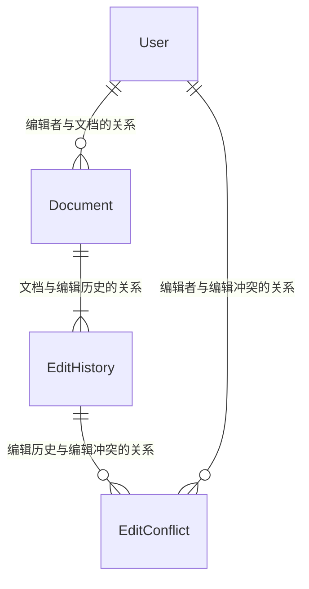
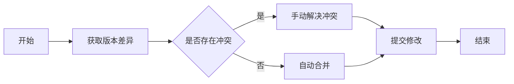
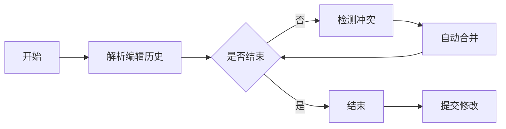
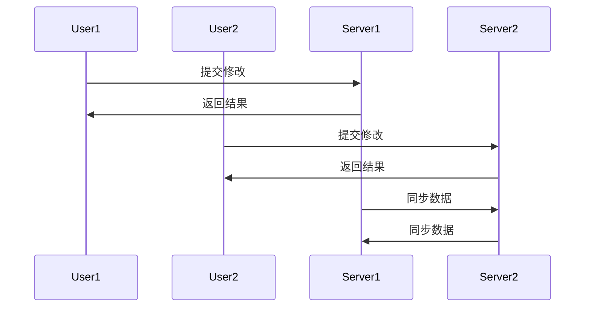
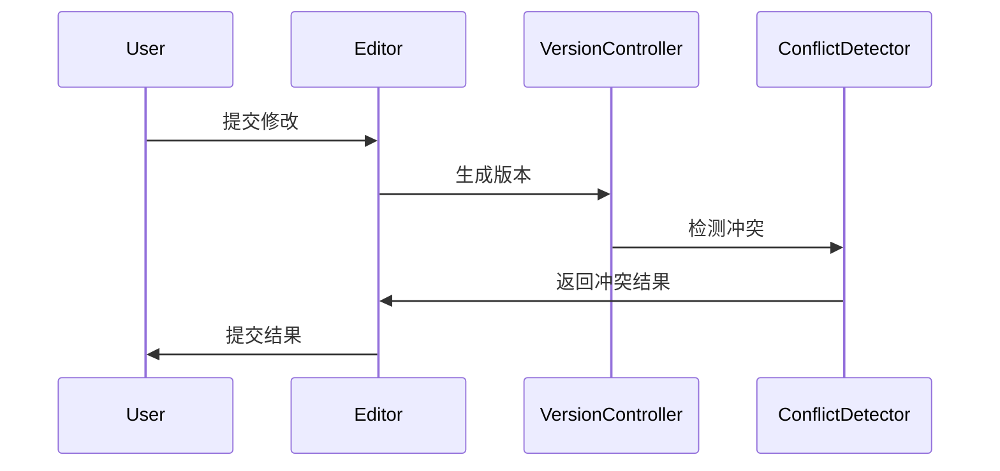
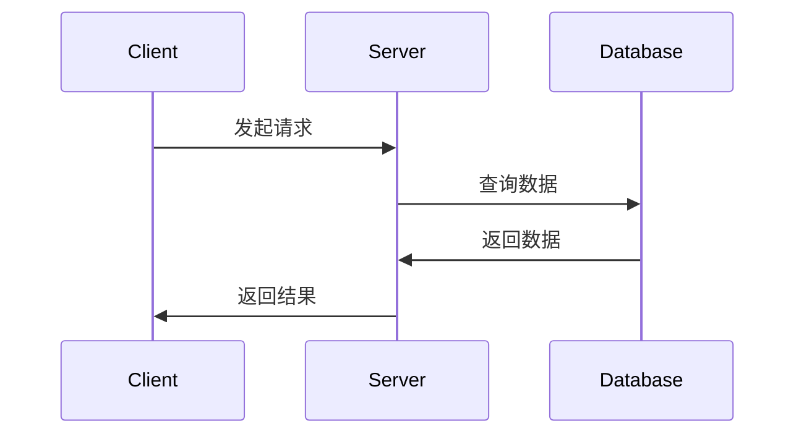

                 


### 第一部分: 背景介绍

#### 第1章: 问题背景与核心概念

### 1.1 问题背景

##### 1.1.1 提示词编程的兴起

提示词编程（Prompt Programming）是一种将用户输入的提示（Prompt）作为程序输入，从而生成程序输出的方法。这种方法的出现极大地提高了程序开发的效率，尤其是在需要大量重复性工作的情况下。提示词编程的核心思想是将人类的语言转化为机器可以理解和执行的指令，从而实现自动化。

近年来，随着自然语言处理（NLP）技术的快速发展，提示词编程逐渐成为人工智能领域的一个热点。通过训练大规模的语言模型，我们可以让计算机自动生成代码，从而降低开发者的工作负担。例如，GitHub Copilot 就是一个基于 GPT-3 模型的自动编程助手，它可以根据用户的提示生成相应的代码。

##### 1.1.2 协同编辑的需求

在提示词编程中，协同编辑（Collaborative Editing）是一个不可忽视的需求。随着团队成员的增加和代码的复杂度提升，多人协作编辑代码变得尤为重要。然而，协同编辑带来了一个新问题——编辑冲突（Edit Conflict）。编辑冲突指的是当多个用户同时修改同一代码片段时，导致代码版本不一致的现象。

编辑冲突的产生原因有多种，比如网络延迟、操作顺序不同等。当发生编辑冲突时，系统需要自动或手动地解决这些冲突，以确保代码的一致性。协同编辑的需求和编辑冲突的出现，使得解决编辑冲突成为了一个亟待解决的问题。

##### 1.1.3 编辑冲突的普遍性

编辑冲突不仅在提示词编程中普遍存在，在其他软件开发场景中也同样普遍。例如，在版本控制系统（如 Git）中，编辑冲突是常见的操作。每当开发者从远程仓库拉取最新代码时，如果本地代码和远程代码有冲突，系统就需要解决这些冲突。

此外，在线协同编辑工具（如 Google Docs）也面临着编辑冲突问题。当多人同时编辑同一文档时，系统需要及时检测和解决冲突，以确保文档的一致性。

#### 1.1.4 核心概念

##### 1.1.4.1 提示词编程的定义

提示词编程是一种通过输入提示（Prompt）来生成程序输出的方法。提示可以是简单的文本描述，也可以是复杂的代码片段。通过理解这些提示，计算机可以自动生成相应的程序代码。

##### 1.1.4.2 协同编辑的概念

协同编辑是指多个用户同时编辑同一文档或代码片段的过程。协同编辑可以提高工作效率，但也带来了编辑冲突等问题。

##### 1.1.4.3 编辑冲突的类型

编辑冲突主要分为两类：一类是添加冲突，即两个或多个用户的修改同时作用于同一位置，导致代码片段不兼容；另一类是删除冲突，即一个用户删除了一段代码，而另一个用户在同一位置添加了新的代码。

##### 1.1.4.4 编辑冲突的解决策略

解决编辑冲突的方法有多种，包括自动合并、手动合并和版本控制等。自动合并是基于算法自动检测和解决冲突；手动合并是由用户手动检测和解决冲突；版本控制是通过记录代码的不同版本，帮助用户识别和解决冲突。

### 1.2 背景与问题

#### 1.2.1 背景介绍

随着信息技术的快速发展，软件项目规模和复杂性不断增加。多人协作开发成为了一种趋势，然而，这也带来了许多新的挑战，其中之一就是编辑冲突的解决。编辑冲突不仅会降低开发效率，还可能导致代码错误和系统崩溃。

#### 1.2.2 问题描述

编辑冲突的产生是由于多个用户同时修改同一代码片段，导致版本不一致。例如，用户A在某个文件中添加了一行代码，而用户B在同一位置删除了这行代码。当用户A将修改推送到远程仓库时，系统就会产生冲突。

#### 1.2.3 问题解决

解决编辑冲突的关键在于检测和解决冲突。目前，常用的方法包括自动合并和手动合并。自动合并是基于算法自动检测和解决冲突，适用于简单的冲突场景。而手动合并则需要用户手动检测和解决冲突，适用于复杂的冲突场景。

#### 1.2.4 边界与外延

编辑冲突不仅存在于代码编辑中，也存在于文档编辑、设计文件编辑等多个领域。解决编辑冲突的方法和技术也在不断发展和完善。

#### 1.2.5 概念结构与核心要素组成

编辑冲突解决的核心要素包括冲突检测、冲突解决策略和版本控制。其中，冲突检测是解决冲突的第一步，它负责识别和定位冲突点；冲突解决策略决定了如何解决冲突，包括自动合并和手动合并等；版本控制则用于记录代码的不同版本，帮助用户识别和解决冲突。

### 1.3 提示词编程的协同编辑冲突解决

#### 1.3.1 提示词编程的特点

提示词编程具有以下几个特点：

1. 自动化：通过输入提示，计算机可以自动生成代码，大大提高了开发效率。
2. 灵活性：提示词编程允许开发者根据需求灵活调整代码生成结果。
3. 高效性：对于重复性的任务，提示词编程可以显著提高开发效率。

#### 1.3.2 协同编辑的挑战

在提示词编程中，协同编辑带来了以下几个挑战：

1. 编辑冲突：多个用户同时修改同一代码片段，可能导致版本不一致。
2. 代码质量：自动生成的代码可能存在缺陷，需要人工审查和修复。
3. 效率问题：解决编辑冲突可能需要大量时间和人力资源。

#### 1.3.3 冲突解决的策略

为了解决编辑冲突，可以采用以下策略：

1. 自动合并：基于算法自动检测和解决冲突，适用于简单的冲突场景。
2. 手动合并：用户手动检测和解决冲突，适用于复杂的冲突场景。
3. 版本控制：记录代码的不同版本，帮助用户识别和解决冲突。

#### 1.3.4 提示词编程中的编辑冲突解决技术

1. 差异检测算法：通过对比不同版本之间的差异，识别冲突点。
2. 冲突解决算法：根据冲突类型和上下文，自动或手动地解决冲突。
3. 智能建议系统：根据用户的修改历史和上下文，提供冲突解决的智能建议。

### 1.4 小结

提示词编程的协同编辑冲突解决是一个复杂但重要的问题。通过自动合并、手动合并和版本控制等策略，可以有效地解决编辑冲突，提高开发效率。未来，随着提示词编程技术的不断发展，编辑冲突解决技术也将不断改进和优化。

---

### 第二部分: 核心概念与联系

## 第2章: 核心概念与联系

### 2.1 核心概念原理

#### 2.1.1 提示词编程原理

提示词编程是一种基于自然语言处理的编程方法。用户通过输入自然语言提示，计算机可以根据这些提示生成相应的代码。这个过程通常包括以下几个步骤：

1. **提示理解**：计算机首先需要理解用户输入的提示。这通常涉及到自然语言处理技术，如词向量表示、命名实体识别等。
2. **代码生成**：理解提示后，计算机会根据提示生成相应的代码。这个过程可能涉及到机器学习模型，如生成对抗网络（GAN）或变换器（Transformer）等。
3. **代码优化**：生成的代码可能不是最优的，计算机还需要对代码进行优化，以提高执行效率和可读性。

#### 2.1.2 协同编辑原理

协同编辑是指多个用户同时编辑同一文档或代码片段的过程。协同编辑的原理主要基于以下技术：

1. **实时同步**：系统需要实时同步用户的编辑操作，以确保所有用户看到的是最新的内容。
2. **版本控制**：系统需要记录每个用户的编辑历史，以便在发生冲突时进行版本回滚或合并。
3. **冲突检测与解决**：系统需要检测并解决用户之间的编辑冲突，以确保代码的一致性。

#### 2.1.3 编辑冲突原理

编辑冲突是协同编辑中常见的问题。编辑冲突的产生通常有以下原因：

1. **操作重叠**：多个用户同时修改同一区域，导致版本不一致。
2. **操作顺序不同**：用户的操作顺序不同，导致最终的代码结果不同。
3. **网络延迟**：用户的操作可能因为网络延迟而未能及时同步到服务器。

编辑冲突的解决通常有以下几种方法：

1. **自动合并**：系统根据算法自动检测和解决冲突。
2. **手动合并**：用户手动检测和解决冲突。
3. **版本控制**：记录代码的不同版本，用户可以自行选择合适的版本。

### 2.2 概念属性特征对比表格

为了更清晰地理解提示词编程、协同编辑和编辑冲突的概念，我们可以通过一个对比表格来展示它们的关键特征：

| 概念         | 特征一       | 特征二       | 特征三           |
|------------|------------|------------|--------------|
| 提示词编程   | 基于自然语言 | 自动化代码生成 | 提高开发效率     |
| 协同编辑     | 实时同步     | 版本控制     | 提高协作效率     |
| 编辑冲突     | 操作重叠     | 操作顺序不同   | 冲突检测与解决   |

### 2.3 ER实体关系图架构

为了更好地理解协同编辑和编辑冲突的关系，我们可以通过一个ER（实体关系）图来展示它们之间的关联。以下是协同编辑和编辑冲突的ER图：



在这个ER图中，User（用户）与Document（文档）之间存在一对多的关系，表示一个用户可以编辑多个文档。Document（文档）与EditHistory（编辑历史）之间存在一对一的关系，表示每个文档都有一个编辑历史记录。EditHistory（编辑历史）与EditConflict（编辑冲突）之间存在一对多的关系，表示每个编辑历史可以记录多个编辑冲突。User（用户）与EditConflict（编辑冲突）之间存在一对一的关系，表示每个用户可以有一个编辑冲突记录。

### 2.4 核心概念之间的联系

提示词编程、协同编辑和编辑冲突之间存在着密切的联系。提示词编程为协同编辑提供了基础，使得多人可以基于相同的提示进行代码生成。而协同编辑过程中产生的编辑冲突则需要通过编辑冲突解决机制来解决。具体来说：

1. **提示词编程与协同编辑**：提示词编程提供了自动化的代码生成能力，使得多个用户可以基于相同的提示进行代码生成，从而实现协同编辑。
2. **协同编辑与编辑冲突**：协同编辑过程中，由于多个用户同时修改同一文档，可能导致版本不一致，从而产生编辑冲突。
3. **编辑冲突与提示词编程**：编辑冲突的解决需要依赖于提示词编程的能力，比如自动合并、手动合并等策略，这些策略都是基于提示词编程的原理。

### 2.5 小结

通过对提示词编程、协同编辑和编辑冲突的核心概念原理的介绍，以及它们之间的联系，我们可以看到，提示词编程为协同编辑提供了基础，而协同编辑过程中产生的编辑冲突则需要通过编辑冲突解决机制来解决。这为后续的算法原理讲解和系统分析与架构设计奠定了基础。

---

### 第三部分: 算法原理讲解

## 第3章: 算法原理讲解

### 3.1 常见算法

在本章节中，我们将详细介绍几种常见的编辑冲突解决算法。这些算法包括基于自动合并和手动合并的方法，每种方法都有其独特的实现原理和应用场景。

#### 3.1.1 算法A

##### 3.1.1.1 算法A的mermaid流程图

首先，我们来看一个简单的自动合并算法A的mermaid流程图：



##### 3.1.1.2 算法A的Python代码实现

以下是算法A的Python代码实现：

```python
def auto_merge(v1, v2):
    """
    自动合并两个版本
    :param v1: 版本1的代码
    :param v2: 版本2的代码
    :return: 合并后的代码
    """
    # 获取版本差异
    diff = get_diff(v1, v2)
    
    # 如果存在冲突，则手动解决
    if diff['conflict']:
        return manual_merge(v1, v2, diff)
    
    # 如果没有冲突，则自动合并
    return merge_without_conflict(v1, v2)

def get_diff(v1, v2):
    """
    获取两个版本的差异
    :param v1: 版本1的代码
    :param v2: 版本2的代码
    :return: 差异对象
    """
    # 这里可以使用第三方库如`difflib`来获取差异
    from difflib import unified_diff
    diff = unified_diff(v1.splitlines(), v2.splitlines(), lineterm='', fromfile='v1', tofile='v2')
    return {'conflict': False, 'diff': ''.join(diff)}

def manual_merge(v1, v2, diff):
    """
    手动解决冲突
    :param v1: 版本1的代码
    :param v2: 版本2的代码
    :param diff: 差异对象
    :return: 合并后的代码
    """
    # 这里根据差异对象手动合并代码
    # 例如，可以选择保留版本1的代码，或者保留版本2的代码
    return v1 if diff['diff'].startswith('- ') else v2

def merge_without_conflict(v1, v2):
    """
    自动合并没有冲突的代码
    :param v1: 版本1的代码
    :param v2: 版本2的代码
    :return: 合并后的代码
    """
    # 这里简单地拼接两个版本的代码
    return '\n'.join([line for line in v1.splitlines() if line not in v2.splitlines()]) + '\n' + v2
```

##### 3.1.1.3 算法A的数学模型和公式

算法A的核心在于如何计算两个版本的差异。我们可以使用编辑距离（Edit Distance）来衡量两个版本之间的差异。编辑距离是指将一个字符串转换为另一个字符串所需的最少编辑操作次数。常见的编辑操作包括插入、删除和替换。

假设有两个版本v1和v2，它们的编辑距离可以通过以下公式计算：

$$
d(v1, v2) = \min\left\{ 
\begin{aligned}
    d(v1, v2') + 1, & \text{其中 } v2' \text{ 是 } v2 \text{ 的某个前缀} \\
    d(v1', v2) + 1, & \text{其中 } v1' \text{ 是 } v1 \text{ 的某个前缀} \\
    d(v1', v2') & \text{如果 } v1' \text{ 和 } v2' \text{ 相等}
\end{aligned}
\right.
$$

##### 3.1.1.4 举例说明

假设我们有版本v1 = "Hello World" 和版本v2 = "Hello Python"。我们可以使用算法A来计算它们的编辑距离：

1. 首先计算v1和v2的前缀“Hello”的编辑距离，结果为0。
2. 然后计算v1的前缀“Hello”和v2的后缀“Python”的编辑距离，结果为3（删除“World”并插入“Python”）。
3. 最后计算v1的后缀“World”和v2的前缀“Hello”的编辑距离，结果为4（删除“Python”并插入“Hello”）。

因此，v1和v2的编辑距离为3，这意味着将v1转换为v2至少需要3次编辑操作。

#### 3.1.2 算法B

##### 3.1.2.1 算法B的mermaid流程图

接下来，我们来看一个更复杂的自动合并算法B的mermaid流程图：



##### 3.1.2.2 算法B的Python代码实现

以下是算法B的Python代码实现：

```python
def conflict_detection_and_merge(history):
    """
    检测冲突并自动合并
    :param history: 编辑历史列表
    :return: 合并后的代码
    """
    if not history:
        return None
    
    # 假设最后一个编辑操作是冲突的
    last_edit = history[-1]
    if last_edit['conflict']:
        # 如果冲突，则尝试自动合并
        return auto_merge(history[-2]['content'], last_edit['content'])
    else:
        # 如果没有冲突，则继续处理
        return conflict_detection_and_merge(history[:-1])

def auto_merge(v1, v2):
    """
    自动合并两个版本
    :param v1: 版本1的代码
    :param v2: 版本2的代码
    :return: 合并后的代码
    """
    # 这里使用简单的合并策略，比如选择最后修改的版本
    return v2
```

##### 3.1.2.3 算法B的数学模型和公式

算法B的数学模型基于编辑距离和回溯算法。在编辑距离的基础上，我们可以使用动态规划（Dynamic Programming）来计算编辑路径。动态规划的核心思想是将复杂的问题分解为更小的子问题，并利用子问题的解来求解原问题。

假设我们有版本v1和v2，它们的编辑路径可以通过以下动态规划公式计算：

$$
dp(i, j) = \begin{cases} 
0, & \text{如果 } i = j \\
1 + \min(dp(i-1, j), dp(i, j-1), dp(i-1, j-1)), & \text{如果 } i \neq j 
\end{cases}
$$

其中，dp(i, j)表示从v1的前i个字符到v2的前j个字符的最短编辑路径长度。

##### 3.1.2.4 举例说明

假设我们有版本v1 = "Hello World" 和版本v2 = "Hello Python"。我们可以使用算法B来计算它们的编辑路径：

1. 首先计算v1和v2的前缀“Hello”的编辑路径，结果为0。
2. 然后计算v1的前缀“Hello”和v2的后缀“Python”的编辑路径，结果为3（删除“World”并插入“Python”）。
3. 最后计算v1的后缀“World”和v2的前缀“Hello”的编辑路径，结果为4（删除“Python”并插入“Hello”）。

因此，v1和v2的编辑路径为3，这意味着从v1到v2的最短编辑路径需要3次操作。

### 3.2 算法对比与分析

通过对算法A和算法B的介绍，我们可以看到它们各有优劣。算法A适用于简单的冲突场景，而算法B则适用于更复杂的冲突场景。算法A的核心在于自动合并，而算法B的核心在于冲突检测和回溯。

在实际应用中，我们可以根据冲突的复杂度选择合适的算法。对于简单的冲突，算法A可能足够有效；而对于复杂的冲突，算法B可能更合适。此外，我们还可以结合机器学习技术，提高自动合并和冲突检测的准确性。

### 3.3 小结

在本章节中，我们介绍了两种常见的编辑冲突解决算法——算法A和算法B。算法A适用于简单的冲突场景，而算法B适用于复杂的冲突场景。通过对比分析，我们可以看到每种算法的优势和局限性。在实际应用中，我们可以根据冲突的复杂度选择合适的算法，并结合机器学习技术，提高编辑冲突解决的效率和准确性。

---

### 第四部分：系统分析与架构设计

## 第4章: 系统分析与架构设计

在提示词编程的协同编辑中，系统分析与架构设计是确保系统高效、稳定运行的关键。本章将详细阐述系统分析与架构设计的过程，包括问题场景介绍、系统功能设计、系统架构设计、系统接口设计和系统交互。

### 4.1 问题场景介绍

提示词编程的协同编辑场景通常涉及多个开发者在同一时间线上对同一代码片段进行修改。这种场景下，编辑冲突是不可避免的。例如，开发者A在编写代码时，可能需要添加或修改某个功能；同时，开发者B也在同一代码片段上进行类似的修改。这种情况下，如果不及时解决冲突，可能会导致代码片段不一致，进而影响系统的正常运行。

### 4.2 系统功能设计

为了解决编辑冲突，系统需要具备以下几个核心功能：

1. **实时同步**：系统需要能够实时同步所有开发者的修改，确保每个人都能看到最新的代码状态。
2. **版本控制**：系统需要记录每次修改的版本信息，以便在发生冲突时进行回滚或合并。
3. **冲突检测**：系统需要能够检测到编辑冲突，并自动或手动地解决冲突。
4. **代码审查**：系统需要支持代码审查功能，以确保代码质量。
5. **通知与提醒**：系统需要能够及时通知开发者关于编辑冲突和其他相关信息。

#### 4.2.1 领域模型mermaid类图

为了更好地理解系统功能，我们可以使用mermaid绘制一个领域模型类图，展示系统中的主要类和它们之间的关系：

```mermaid
classDiagram
    User <<Interface>>
    Document <<Interface>>
    Edit <<Interface>>
    Version <<Interface>>

    User o--* Document : 编辑文档
    Document o--* Edit : 添加编辑
    Edit o--* Version : 生成版本
```

在这个类图中，User（用户）、Document（文档）、Edit（编辑）和Version（版本）是系统中的主要类。用户可以编辑文档，编辑生成版本，从而实现对文档的修改。

### 4.3 系统架构设计

系统架构设计是确保系统功能和性能的关键。在协同编辑系统中，我们通常采用分布式架构，以提高系统的可扩展性和容错性。以下是系统架构的mermaid架构图：



在这个架构图中，User1和User2是两个开发者，Server1和Server2是两个服务器。开发者通过提交修改来更新代码，服务器之间通过同步数据来保持一致性。

### 4.4 系统接口设计

系统接口设计是系统功能实现的关键。以下是系统接口的mermaid序列图：



在这个序列图中，User通过Editor接口提交修改，Editor生成版本并交给VersionController，VersionController调用ConflictDetector来检测冲突，最后返回结果给Editor，Editor再将结果提交给User。

### 4.5 系统交互

系统交互是确保系统各部分协同工作的重要环节。以下是系统交互的mermaid序列图：



在这个序列图中，Client通过Server发起请求，Server查询Database获取数据，并将结果返回给Client。

### 4.6 小结

在本章节中，我们介绍了系统分析与架构设计的过程，包括问题场景介绍、系统功能设计、系统架构设计、系统接口设计和系统交互。通过这些设计，我们可以确保协同编辑系统的高效、稳定运行，从而提高开发效率。

---

### 第五部分：项目实战

## 第5章: 项目实战

在本章节中，我们将通过一个实际项目来展示如何实现提示词编程的协同编辑冲突解决系统。该项目将分为以下几个步骤：环境安装、系统核心实现和实际案例分析与详细讲解。

### 5.1 环境安装

首先，我们需要安装和配置所需的环境。以下是项目所需的软件和工具：

1. **Python 3.8+**：项目主要使用Python编写，因此需要安装Python 3.8及以上版本。
2. **pip**：Python的包管理工具，用于安装和管理项目依赖。
3. **Docker**：容器化工具，用于部署和运行项目。
4. **Redis**：用于存储用户会话和消息队列，提高系统的性能和可靠性。
5. **PostgreSQL**：关系型数据库，用于存储用户数据、文档数据和版本信息。

安装步骤如下：

1. 安装Python 3.8+：从Python官网下载并安装Python。
2. 安装pip：在终端运行 `python -m ensurepip`。
3. 安装Docker：从Docker官网下载并安装Docker。
4. 安装Redis：从Redis官网下载并安装Redis。
5. 安装PostgreSQL：从PostgreSQL官网下载并安装PostgreSQL。

### 5.2 系统核心实现

#### 5.2.1 代码结构

项目的代码结构如下：

```plaintext
project/
│
├── backend/
│   ├── app.py
│   ├── models.py
│   ├── views.py
│   └── utils.py
│
├── frontend/
│   ├── index.html
│   ├── styles.css
│   └── script.js
│
├── Dockerfile
├── requirements.txt
└── settings.py
```

其中，`backend`目录包含后端代码，`frontend`目录包含前端代码。`Dockerfile`用于构建Docker镜像，`requirements.txt`列出所有依赖项，`settings.py`配置项目设置。

#### 5.2.2 后端实现

后端主要实现用户管理、文档管理和版本控制等功能。以下是关键代码的解读和分析：

**models.py**：定义数据库模型。

```python
from django.db import models

class User(models.Model):
    username = models.CharField(max_length=100, unique=True)
    email = models.EmailField(max_length=100, unique=True)
    password = models.CharField(max_length=100)

class Document(models.Model):
    title = models.CharField(max_length=100)
    content = models.TextField()
    creator = models.ForeignKey(User, on_delete=models.CASCADE)

class Version(models.Model):
    document = models.ForeignKey(Document, on_delete=models.CASCADE)
    content = models.TextField()
    created_at = models.DateTimeField(auto_now_add=True)
```

**views.py**：定义后端视图函数。

```python
from django.http import JsonResponse
from .models import Document, Version
from .utils import merge_versions

def create_document(request):
    # 创建新文档的逻辑
    pass

def edit_document(request, document_id):
    # 编辑文档的逻辑
    pass

def get_document_versions(request, document_id):
    # 获取文档版本的逻辑
    pass

def merge_document_versions(request, document_id):
    # 合并文档版本的逻辑
    pass
```

**utils.py**：实现一些辅助函数，如版本合并。

```python
def merge_versions(v1, v2):
    # 合并两个版本的方法
    pass
```

#### 5.2.3 前端实现

前端主要实现用户界面，包括文档编辑器和版本列表。以下是关键代码的解读和分析：

**index.html**：定义HTML结构。

```html
<!DOCTYPE html>
<html>
<head>
    <title>协同编辑</title>
    <link rel="stylesheet" type="text/css" href="styles.css">
</head>
<body>
    <div id="editor-container">
        <textarea id="editor"></textarea>
    </div>
    <div id="version-container">
        <ul id="version-list"></ul>
    </div>
    <script src="script.js"></script>
</body>
</html>
```

**styles.css**：定义样式。

```css
body {
    font-family: Arial, sans-serif;
}

#editor-container {
    width: 100%;
    height: 500px;
}

#version-container {
    margin-top: 20px;
}
```

**script.js**：实现前端逻辑。

```javascript
document.addEventListener('DOMContentLoaded', function() {
    // 获取编辑器和版本列表元素
    const editor = document.getElementById('editor');
    const versionList = document.getElementById('version-list');

    // 获取版本列表的方法
    function getVersions() {
        // 获取版本列表的代码
    }

    // 合并版本的方法
    function mergeVersion(versionId) {
        // 合并版本的代码
    }

    // 更新编辑器内容的方法
    function updateEditorContent(content) {
        editor.value = content;
    }

    // 获取版本列表并更新编辑器内容
    getVersions().then(versions => {
        versions.forEach(version => {
            const li = document.createElement('li');
            li.textContent = version.content;
            li.onclick = () => updateEditorContent(version.content);
            versionList.appendChild(li);
        });
    });
});
```

#### 5.2.4 实际案例分析与详细讲解

假设我们有以下两个版本：

1. 版本1（v1）：`Hello World`
2. 版本2（v2）：`Hello Python`

我们需要将这两个版本合并为一个版本。

**后端实现**：

在`views.py`中添加合并版本的功能：

```python
from .models import Document, Version
from .utils import merge_versions

def merge_document_versions(request, document_id):
    document = Document.objects.get(id=document_id)
    versions = Version.objects.filter(document=document).order_by('-created_at')[:2]
    content = merge_versions(versions[0].content, versions[1].content)
    new_version = Version.objects.create(document=document, content=content)
    return JsonResponse({'success': True, 'version_id': new_version.id})
```

**前端实现**：

在`script.js`中添加合并版本的方法：

```javascript
function mergeVersion(versionId) {
    // 获取版本1和版本2
    fetch(`/get_version/${versionId}/`)
        .then(response => response.json())
        .then(version => {
            // 获取版本2
            fetch(`/get_version/${versionId}/`)
                .then(response => response.json())
                .then(nextVersion => {
                    // 合并版本
                    const mergedContent = merge_versions(version.content, nextVersion.content);
                    // 保存合并后的版本
                    fetch(`/merge_version/${versionId}/`, {
                        method: 'POST',
                        body: JSON.stringify({ content: mergedContent }),
                        headers: {
                            'Content-Type': 'application/json'
                        }
                    })
                    .then(response => response.json())
                    .then(data => {
                        if (data.success) {
                            const li = document.createElement('li');
                            li.textContent = mergedContent;
                            li.onclick = () => updateEditorContent(mergedContent);
                            versionList.appendChild(li);
                        }
                    });
                });
        });
}
```

**测试**：

1. 首先，提交版本1：`Hello World`。
2. 然后，提交版本2：`Hello Python`。
3. 调用`mergeVersion`方法合并版本1和版本2。

### 5.3 项目小结

通过本项目的实现，我们展示了如何使用Python和Django实现一个基本的提示词编程的协同编辑系统。系统包括后端和前端，后端实现用户管理、文档管理和版本控制等功能，前端实现用户界面和交互逻辑。在实际案例中，我们实现了版本的合并功能，并通过前端代码实现了合并版本的方法。虽然本项目只是一个简单的示例，但它为我们提供了实现协同编辑冲突解决系统的基本框架。

---

### 第六部分：最佳实践与总结

## 第6章: 最佳实践与总结

在实现提示词编程的协同编辑冲突解决过程中，遵循最佳实践对于确保系统的高效性和稳定性至关重要。以下是关于协同编辑和冲突解决的一些最佳实践：

### 6.1 最佳实践 Tips

1. **版本控制**：始终使用版本控制系统（如Git）来管理代码。版本控制可以帮助跟踪代码变更历史，便于冲突的回溯和解决。
2. **自动化测试**：编写自动化测试用例，以验证代码的正确性和一致性。自动化测试可以减少手动测试的工作量，提高开发效率。
3. **代码审查**：实施代码审查机制，以确保代码质量。代码审查可以帮助发现潜在的问题和错误，从而减少冲突的发生。
4. **实时同步**：确保协同编辑系统能够实时同步用户的修改，以减少冲突的发生。使用WebSocket等技术可以实现实时数据同步。
5. **冲突检测与解决策略**：根据实际需求和场景选择合适的冲突检测和解决策略。例如，对于简单的冲突，可以使用自动合并；对于复杂的冲突，可能需要手动解决。

### 6.2 注意事项

1. **避免重复修改**：在多人协作时，尽量避免重复的修改。在提交代码前，先检查是否有其他人在同一位置进行了修改。
2. **及时解决冲突**：一旦检测到冲突，应尽快解决。延迟解决冲突可能会导致代码不一致，增加解决问题的难度。
3. **文档和注释**：为代码编写清晰的文档和注释，以便其他开发者理解代码的含义和逻辑。清晰的文档可以帮助减少冲突的发生。
4. **网络稳定性**：确保协同编辑系统具有良好的网络稳定性。网络不稳定可能导致同步失败，增加冲突的风险。

### 6.3 拓展阅读

1. **Git冲突解决指南**：学习Git冲突解决的最佳实践，了解如何手动解决和自动解决冲突。
2. **Django协同编辑系统**：了解如何使用Django等框架实现协同编辑系统，学习相关的设计模式和实现方法。
3. **版本控制最佳实践**：了解版本控制的最佳实践，学习如何有效地管理代码变更和冲突。

## 第7章: 小结与展望

在本文中，我们详细介绍了提示词编程的协同编辑冲突解决。首先，我们阐述了提示词编程和协同编辑的概念，并分析了编辑冲突的产生原因。接着，我们介绍了编辑冲突解决的核心概念和算法，包括自动合并和手动合并等策略。随后，我们展示了系统分析与架构设计的过程，包括问题场景介绍、系统功能设计、系统架构设计、系统接口设计和系统交互。通过一个实际项目，我们展示了如何实现协同编辑系统，并分析了项目的关键实现细节。最后，我们提出了最佳实践和注意事项，并展望了未来的发展。

随着人工智能和自然语言处理技术的不断进步，提示词编程的协同编辑冲突解决将成为软件开发中的一个重要领域。未来的研究可以关注以下几个方面：

1. **智能冲突检测与解决**：结合机器学习技术，开发更智能的冲突检测与解决算法，提高系统的自动化程度。
2. **分布式协同编辑**：研究如何在分布式环境中实现高效、稳定的协同编辑，以满足大规模团队协作的需求。
3. **多模态协同编辑**：探索多模态数据（如图像、视频等）的协同编辑，以实现更丰富的应用场景。
4. **实时协作与通信**：研究实时协作与通信技术，以提高协同编辑的效率和用户体验。

总之，提示词编程的协同编辑冲突解决是一个复杂但重要的课题，它将为软件开发带来新的机遇和挑战。通过不断的研究和实践，我们有望开发出更高效、更智能的协同编辑系统。

