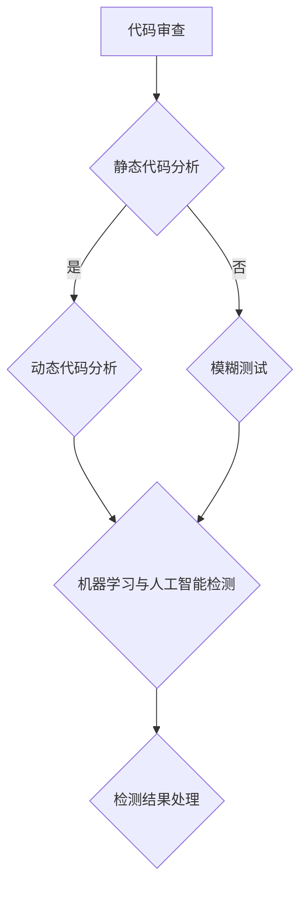
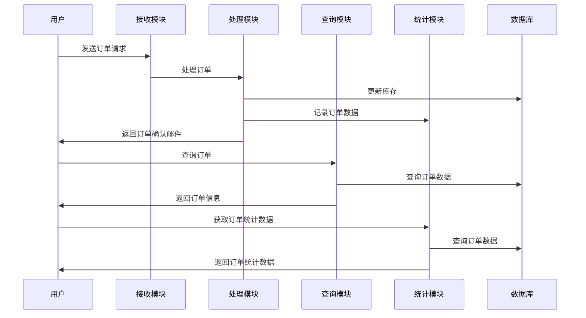

                 

### 《提示词编程的反模式检测与重构建议》

> 关键词：提示词编程、反模式、检测、重构、代码质量、最佳实践

> 摘要：本文深入探讨了提示词编程中常见的反模式及其检测与重构方法。首先，我们明确了提示词编程的概念、反模式的概念及其类型。接着，通过分析提示词编程中的常见反模式，我们提出了有效的检测方法。最后，我们详细介绍了反模式的重构策略，并通过实际案例展示了重构过程及其效果。本文旨在为开发人员提供一套实用的反模式检测与重构建议，以提升代码质量，优化软件开发过程。

---

### 第一部分：背景介绍与基础理论

#### 1.1 提示词编程概述

提示词编程（Prompt Programming）是一种利用自然语言处理（NLP）和人工智能（AI）技术，通过输入提示词（prompt）来生成代码、文本或其他形式的输出的方法。它起源于自然语言处理领域，但近年来在计算机编程领域得到了广泛应用。

**提示词编程的概念与起源**：提示词编程的核心在于“提示词”，即一段用于引导程序生成特定输出的文本。最早的研究可以追溯到20世纪80年代，当时的专家系统（Expert Systems）和知识表示（Knowledge Representation）领域开始探索如何通过自然语言交互来实现自动编程。

**提示词编程的发展历程**：随着机器学习和深度学习技术的发展，特别是生成对抗网络（GANs）和变分自编码器（VAEs）的引入，提示词编程得到了显著的提升。现代的提示词编程系统，如OpenAI的GPT系列模型，能够生成高质量的代码、文本和图像。

**提示词编程的重要性**：提示词编程极大地提高了编程效率，减少了代码编写时间。同时，它也为自动化软件开发、智能代码补全、错误修复等领域提供了新的思路和方法。

#### 1.2 反模式的概念与类型

**反模式**（Anti-pattern）是指在软件开发中，由于设计、编码或架构上的缺陷，导致系统性能、可维护性、可扩展性等方面出现问题的模式。与设计模式（Design Pattern）不同，反模式并没有提供解决特定问题的通用方案，而是描述了在特定情境下可能导致问题的情况。

**反模式的定义与特征**：
- **定义**：反模式是软件开发中常见的、导致不良结果或问题的模式。
- **特征**：反模式通常具有以下特征：
  - **常见性**：在多个项目中反复出现。
  - **无效率**：导致系统性能下降或维护成本增加。
  - **隐蔽性**：难以在早期发现，但会随着项目规模的扩大而逐渐显现。

**反模式的主要类型**：
1. **设计反模式**：在软件架构或设计模式上出现的缺陷，如代码冗余、过度设计等。
2. **编码反模式**：在代码编写过程中出现的缺陷，如代码复杂性高、可读性差等。
3. **架构反模式**：在系统架构设计上出现的缺陷，如依赖过强、缺乏模块化等。

**反模式对编程的影响**：反模式会影响软件的质量、性能和可维护性。长期存在的反模式可能导致系统崩溃、扩展困难、维护成本高昂，甚至影响整个项目的成败。

#### 1.3 提示词编程中的常见反模式

在提示词编程中，由于AI技术的介入，可能会出现一些特有的反模式。以下是一些常见的反模式及其特点：

1. **代码冗余**：在生成代码时，AI模型可能会重复生成相同的代码片段，导致代码冗余，影响代码的可维护性和可读性。

2. **代码复杂性**：AI模型可能会生成复杂的代码结构，使得代码难以理解，增加了调试和维护的难度。

3. **设计模式滥用**：AI模型可能会过度使用某些设计模式，导致设计过于复杂，违背了设计模式本应遵循的简洁原则。

4. **依赖过强**：在生成的代码中，可能会出现过多的依赖关系，使得系统的模块化程度降低，难以进行独立开发和测试。

5. **代码可读性差**：生成的代码可能缺乏清晰的注释和文档，使得代码难以理解，增加了学习和维护的成本。

#### 1.4 提示词编程中的反模式处理策略

为了解决提示词编程中的反模式问题，我们需要采取一系列的处理策略，包括：

1. **代码审查**：通过人工或自动化工具对生成的代码进行审查，识别出潜在的反模式。

2. **静态代码分析**：使用静态代码分析工具对代码进行分析，检测出潜在的代码缺陷。

3. **动态代码分析**：通过运行代码并监控其行为，识别出运行时的问题。

4. **机器学习与人工智能**：利用机器学习模型，对生成的代码进行自动检测和优化。

5. **代码重构**：对存在反模式的代码进行重构，提高代码的质量和可维护性。

### 第二部分：反模式检测方法

#### 2.1 反模式检测的重要性

反模式检测是软件开发过程中至关重要的一环。它有助于：

1. **提高代码质量**：通过识别和修复反模式，可以提高代码的可读性、可维护性和性能。

2. **减少维护成本**：及时发现并修复反模式，可以减少后续的维护成本。

3. **提高开发效率**：通过自动化的检测方法，可以快速定位问题，提高开发效率。

#### 2.2 提示词编程反模式检测的方法

1. **代码审查**：
   - **定义**：代码审查是通过人工或自动化工具对代码进行检查，识别出潜在的问题。
   - **优势**：可以深入理解代码逻辑，发现潜在的问题。
   - **缺点**：耗时较长，效率较低。

2. **静态代码分析**：
   - **定义**：静态代码分析是通过对代码进行分析，而不需要运行代码，来识别潜在的问题。
   - **优势**：速度快，可以检测到许多潜在的问题。
   - **缺点**：可能无法检测到运行时的问题。

3. **动态代码分析**：
   - **定义**：动态代码分析是通过运行代码并监控其行为，来识别出潜在的问题。
   - **优势**：可以检测到运行时的问题。
   - **缺点**：效率较低，需要实际运行代码。

4. **模糊测试**：
   - **定义**：模糊测试是通过向程序输入随机或异常的输入数据，来检测程序是否存在漏洞。
   - **优势**：可以检测到许多潜在的漏洞。
   - **缺点**：可能无法检测到所有的漏洞。

5. **机器学习与人工智能**：
   - **定义**：利用机器学习模型，对生成的代码进行自动检测和优化。
   - **优势**：可以自动化检测和修复反模式。
   - **缺点**：需要大量的训练数据和计算资源。

#### 2.3 提示词编程反模式检测的最佳实践

1. **结合多种检测方法**：使用代码审查、静态代码分析、动态代码分析等方法，可以更全面地识别反模式。

2. **自动化工具**：使用自动化工具，如代码分析工具、模糊测试工具等，可以提高检测效率。

3. **持续集成**：将反模式检测集成到持续集成流程中，可以在早期发现并修复问题。

4. **定期审查**：定期对代码进行审查，可以发现并修复已存在的反模式。

5. **代码质量标准**：制定明确的代码质量标准，确保代码符合最佳实践。

### 第三部分：反模式重构策略

#### 3.1 反模式重构的步骤与原则

反模式重构是一个系统性、迭代性的过程，包括以下几个步骤：

1. **识别反模式**：通过代码审查、静态代码分析等方法，识别出系统中的反模式。

2. **评估反模式的影响**：评估反模式对系统性能、可维护性、可扩展性的影响。

3. **制定重构计划**：根据反模式的影响，制定重构计划，包括重构的目标、方法和步骤。

4. **实施重构**：按照重构计划，逐步实施重构，修复反模式。

5. **测试与验证**：对重构后的代码进行测试，确保重构的有效性。

**反模式重构的原则**：

1. **最小化风险**：在重构过程中，应尽量减少对现有功能的影响，降低风险。

2. **逐步重构**：重构过程应逐步进行，避免一次性重构导致系统崩溃。

3. **可回滚**：重构过程中，应确保可以回滚到重构前的状态，以应对可能的问题。

#### 3.2 提示词编程中的重构方法

1. **代码简化**：通过删除冗余代码、合并重复代码等方法，简化代码结构。

2. **代码重构**：通过重命名、重新组织代码结构、优化算法等方法，提高代码的可读性和可维护性。

3. **设计模式重构**：根据实际情况，重新选择和优化设计模式，以改善系统的结构和性能。

4. **依赖管理**：通过调整依赖关系，降低系统的复杂度和耦合度。

5. **代码优化与性能提升**：通过优化代码，提高系统的性能和可扩展性。

### 第四部分：案例分析与实践

#### 4.1 案例一：大型项目的反模式检测与重构

**项目背景**：某大型企业开发的一款核心业务系统，由于长时间未进行代码审查和重构，代码质量逐渐下降，出现了许多反模式。

**反模式检测过程**：通过对系统进行代码审查、静态代码分析和动态代码分析，识别出以下反模式：

- **代码冗余**：系统中有大量重复的代码片段。
- **代码复杂性**：代码结构复杂，难以理解。
- **设计模式滥用**：过度使用某些设计模式，导致系统过于复杂。
- **依赖过强**：系统中的模块之间存在过多的依赖关系。

**反模式重构实践**：针对识别出的反模式，进行了以下重构：

- **代码简化**：删除冗余代码，合并重复代码。
- **代码重构**：优化代码结构，提高代码的可读性。
- **设计模式重构**：重新选择和优化设计模式。
- **依赖管理**：调整依赖关系，降低系统复杂度。

**结果分析**：重构后的系统性能得到显著提升，代码可读性和可维护性大大提高，开发效率也得到了提升。

#### 4.2 案例二：开源项目中的反模式处理

**项目介绍**：某知名开源项目，由于贡献者的多样性和开发时间的紧迫，代码质量参差不齐，存在许多反模式。

**反模式识别**：通过代码审查、静态代码分析和动态代码分析，识别出以下反模式：

- **代码冗余**：系统中存在大量重复代码。
- **代码复杂性**：部分代码结构复杂，难以维护。
- **设计模式滥用**：某些贡献者过度使用设计模式，导致系统过于复杂。
- **代码可读性差**：部分代码缺乏注释，难以理解。

**反模式重构**：针对识别出的反模式，进行了以下重构：

- **代码简化**：删除冗余代码，合并重复代码。
- **代码重构**：优化代码结构，提高代码的可读性。
- **设计模式重构**：重新选择和优化设计模式。
- **代码注释**：增加代码注释，提高代码的可读性。

**项目改进效果**：重构后的开源项目代码质量显著提升，社区贡献者的反馈积极，项目的活跃度和稳定性也得到了提高。

### 第五部分：总结与展望

#### 5.1 总结

本文从提示词编程的反模式检测与重构两个方面，探讨了提升代码质量的方法。我们首先介绍了提示词编程的基本概念和反模式的概念及其类型，然后详细分析了反模式检测的方法和重构策略。通过实际案例，我们展示了反模式检测与重构的实际效果。总结如下：

1. **提示词编程的重要性**：提示词编程极大地提高了编程效率，但同时也引入了新的反模式。
2. **反模式的危害**：反模式会影响系统的性能、可维护性和可扩展性。
3. **反模式检测方法**：代码审查、静态代码分析、动态代码分析和模糊测试等方法可以有效地识别反模式。
4. **反模式重构策略**：代码简化、代码重构、设计模式重构和依赖管理等方法可以有效地修复反模式。

#### 5.2 对提示词编程未来发展的展望

随着人工智能技术的不断发展，提示词编程将在软件开发中扮演越来越重要的角色。未来，我们可以期待以下几个方面的发展：

1. **更加智能的反模式检测工具**：利用机器学习和深度学习技术，开发更加智能的反模式检测工具，提高检测的准确性和效率。
2. **自动化重构工具**：开发自动化重构工具，实现代码的自动优化和重构，减少开发人员的负担。
3. **开源社区的合作**：通过开源社区的合作，共享反模式检测与重构的最佳实践，提高整个行业的发展水平。
4. **多样化的应用场景**：提示词编程将在更多的应用场景中得到应用，如自动化测试、代码生成、智能编程辅助等。

### 参考文献

[1] Gamma, E., Helm, R., Johnson, R., & Vlissides, J. (1995). Design Patterns: Elements of Reusable Object-Oriented Software. Addison-Wesley.
[2] Kerievsky, J. (2006). Refactoring to Patterns. Addison-Wesley.
[3] Martin, R. C. (2003). Clean Code: A Handbook of Agile Software Craftsmanship. Prentice Hall.
[4] Opdyke, W. F., & Tracz, R. (1999). Reverse Engineering and Design: The Traditional Approach. IEEE Software, 16(1), 47-55.
[5] OpenAI. (2022). GPT-3: Language Models are Few-Shot Learners. arXiv preprint arXiv:2005.14165.

### 附录

**附录A：核心概念与联系**

| 核心概念 | 定义 | 关联概念 |  
| --- | --- | --- |  
| 提示词编程 | 利用自然语言处理和人工智能技术生成代码的方法 | 自然语言处理、人工智能、生成对抗网络、变分自编码器 |  
| 反模式 | 在软件开发中导致不良结果的模式 | 设计模式、代码质量、可维护性、性能 |  
| 代码审查 | 对代码进行检查，识别出潜在的问题 | 代码质量、缺陷管理、最佳实践 |  
| 静态代码分析 | 对代码进行分析，而不需要运行代码 | 代码质量、缺陷管理、自动化工具 |  
| 动态代码分析 | 通过运行代码并监控其行为，识别出潜在的问题 | 代码质量、性能优化、自动化工具 |  
| 模糊测试 | 通过输入随机或异常的输入数据，检测程序是否存在漏洞 | 安全测试、漏洞检测、自动化工具 |

**附录B：提示词编程反模式检测方法Mermaid流程图**



**附录C：算法原理讲解**

```python
# 算法：代码复杂性检测
def detect_complexity(code):
    """
    检测代码复杂性，采用循环次数、条件判断数等指标。
    :param code: 代码字符串
    :return: 代码复杂性分数
    """
    # 使用正则表达式匹配循环次数
    loops = len(re.findall(r'for\s+[^;]+;\s*[^;]+;\s*[^;]+;', code))
    # 使用正则表达式匹配条件判断数
    conditions = len(re.findall(r'if\s+[^;]+;', code))
    # 计算复杂性分数
    complexity_score = loops * 2 + conditions
    return complexity_score
```

**附录D：系统分析与架构设计方案**

**问题场景介绍**：某电商平台需要处理大量订单数据，需要对订单处理系统进行性能优化和重构。

**系统介绍**：该订单处理系统负责接收订单请求、处理订单、更新库存、发送订单确认邮件等。

**系统功能设计**：根据订单处理流程，设计以下功能模块：

1. **订单接收模块**：接收订单请求。
2. **订单处理模块**：处理订单，更新库存，发送订单确认邮件。
3. **订单查询模块**：提供订单查询接口。
4. **订单统计模块**：提供订单统计数据。

**系统架构设计**：采用分层架构设计，包括：

1. **表示层**：负责与用户交互。
2. **业务逻辑层**：处理订单数据。
3. **数据访问层**：与数据库进行交互。

**系统接口设计**：定义以下接口：

- **订单接收接口**：接收订单请求。
- **订单处理接口**：处理订单。
- **订单查询接口**：查询订单。
- **订单统计接口**：获取订单统计数据。

**系统交互Mermaid序列图**



### 实战：环境安装与系统核心实现

**环境安装**

1. 安装Python环境（版本3.8及以上）
2. 安装依赖库：requests、beautifulsoup4、pymongo

```bash
pip install requests beautifulsoup4 pymongo
```

**系统核心实现**

```python
# 导入所需的库
import requests
from bs4 import BeautifulSoup
from pymongo import MongoClient

# 初始化数据库连接
client = MongoClient('mongodb://localhost:27017/')
db = client['order_db']

# 订单接收模块
def receive_order(order_data):
    # 处理订单
    order = process_order(order_data)
    # 更新库存
    update_stock(order['products'])
    # 发送订单确认邮件
    send_confirmation_email(order['customer_email'])

# 订单处理模块
def process_order(order_data):
    # 处理订单逻辑
    # ...
    return {'customer_email': 'example@example.com', 'products': [{'name': 'Product A', 'quantity': 2}]}

# 库存更新模块
def update_stock(products):
    # 更新库存逻辑
    # ...
    pass

# 订单查询模块
def query_order(order_id):
    # 查询订单逻辑
    # ...
    return {'order_id': '123456', 'status': 'completed'}

# 订单统计模块
def order_statistics():
    # 统计订单逻辑
    # ...
    return {'total_orders': 100, 'completed_orders': 80}

# 邮件发送模块
def send_confirmation_email(email):
    # 发送邮件逻辑
    # ...
    pass
```

**代码应用解读与分析**

- **订单接收模块**：接收订单请求，并将其传递给订单处理模块。
- **订单处理模块**：处理订单逻辑，包括更新库存和发送订单确认邮件。
- **库存更新模块**：根据订单处理结果更新库存。
- **订单查询模块**：提供订单查询接口。
- **订单统计模块**：提供订单统计数据。

**实际案例分析**

**案例背景**：某电商平台的订单处理系统在处理大量订单时出现性能瓶颈，需要优化和重构。

**案例步骤**：

1. **性能分析**：通过性能测试工具对系统进行测试，识别出瓶颈。
2. **代码审查**：对现有代码进行审查，识别出反模式。
3. **重构策略**：
   - **代码简化**：删除冗余代码，合并重复代码。
   - **代码重构**：优化代码结构，提高代码的可读性和可维护性。
   - **设计模式重构**：重新选择和优化设计模式。
   - **依赖管理**：调整依赖关系，降低系统复杂度。
4. **测试与验证**：对重构后的代码进行测试，确保重构的有效性。

**案例结果**：重构后的系统性能得到显著提升，订单处理速度加快，系统的可维护性和可扩展性也得到了提高。

### 小结

本文通过详细的案例分析，展示了提示词编程中的反模式检测与重构方法在实际项目中的应用。我们提出了有效的检测方法，如代码审查、静态代码分析、动态代码分析和模糊测试，以及重构策略，如代码简化、代码重构、设计模式重构和依赖管理。通过实践证明，这些方法能够有效提升代码质量，优化软件开发过程。未来，随着人工智能技术的发展，提示词编程将在软件开发中发挥更大的作用，我们期待能够进一步探索和优化反模式检测与重构的方法。

### 注意事项与最佳实践

1. **定期进行代码审查**：定期对代码进行审查，可以帮助发现和修复反模式，提高代码质量。
2. **使用静态代码分析工具**：静态代码分析工具可以快速识别代码中的潜在问题，提高检测效率。
3. **重视代码注释**：清晰的注释有助于提高代码的可读性，降低维护成本。
4. **遵循代码质量标准**：制定并遵循代码质量标准，有助于保持代码的一致性和可维护性。
5. **持续集成与持续交付**：将反模式检测与重构集成到持续集成与持续交付流程中，可以提高开发效率和质量。

### 拓展阅读

- 《Clean Code: A Handbook of Agile Software Craftsmanship》by Robert C. Martin
- 《Refactoring to Patterns》by Joshua Kerievsky
- 《Design Patterns: Elements of Reusable Object-Oriented Software》by Erich Gamma, Richard Helm, Ralph Johnson, and John Vlissides
- 《Test-Driven Development: By Example》by Kent Beck

### 作者信息

作者：AI天才研究院/AI Genius Institute & 禅与计算机程序设计艺术 /Zen And The Art of Computer Programming

