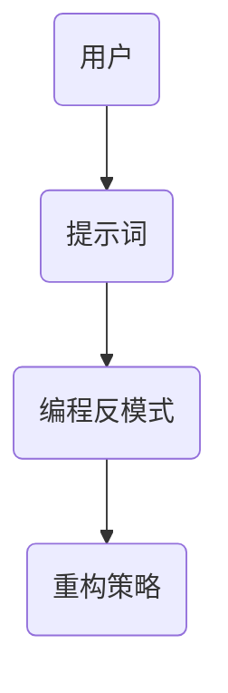
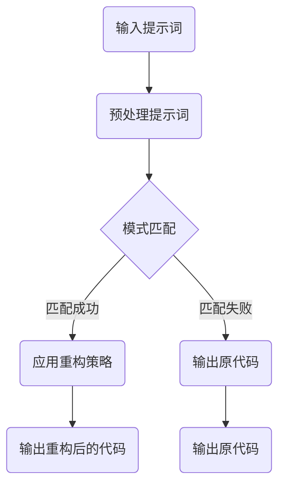
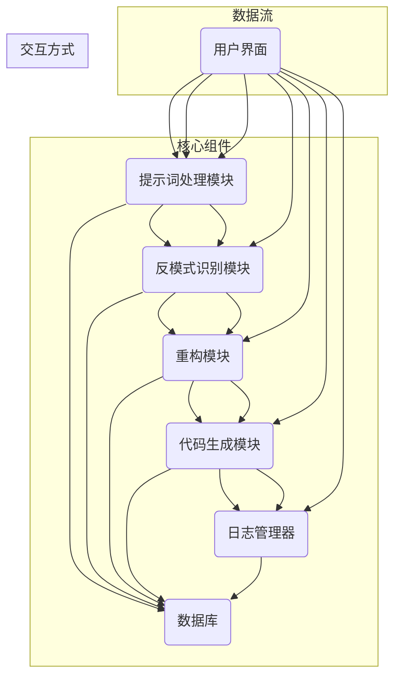
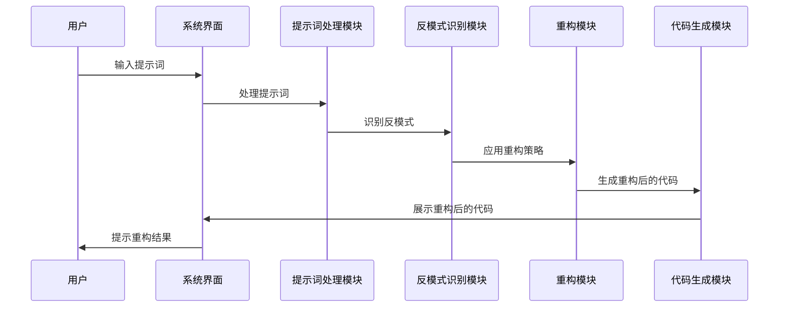
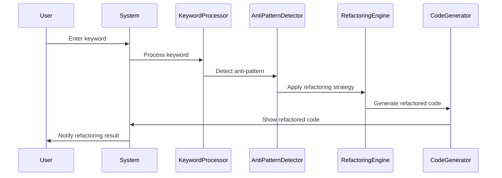

                 

### 第1章：问题背景

#### 1.1.1 提示词编程的基本概念

提示词编程（Keyword Programming）是一种以提示词为核心，通过预定义的提示词来指导程序开发的方法。这种方法的核心思想是将编程任务分解为多个步骤，并通过提示词来提示每个步骤的具体操作。提示词可以是单词、短语或句子，它们用于引导程序员执行特定的编程任务。

提示词编程与传统编程方法不同，它不仅仅依赖于编程语言的语法和语义，还依赖于提示词的语义和上下文。这种编程方法使得编程过程更加直观和易于理解，尤其是对于复杂的编程任务。

#### 1.1.2 提示词编程的应用现状

提示词编程近年来在各个领域得到了广泛的应用。在软件工程中，它被用于自动化测试、代码生成和代码审查。例如，JUnit 是一种流行的单元测试框架，它使用提示词来定义测试用例。在自然语言处理（NLP）领域，提示词编程被用于构建对话系统、语义解析和文本分类。

此外，提示词编程还在人工智能和机器学习领域得到应用。例如，在生成对抗网络（GAN）中，提示词可以用于指导生成图像的特定特征。在深度学习模型训练中，提示词可以用于定义训练数据集的特征和标签。

#### 1.1.3 反模式的概念与重要性

反模式（Anti-pattern）是指在软件开发过程中，由于设计不合理或实现不当而产生的具有普遍性问题的模式。与设计模式（Design Pattern）不同，反模式通常不具有普遍的解决方法，而是需要根据具体情况进行调整。

在提示词编程中，反模式可能会导致以下问题：

1. **代码可读性差**：使用不恰当的提示词会导致代码难以理解和维护。
2. **性能问题**：不当的提示词可能会导致程序执行效率低下。
3. **易错性**：反模式可能会增加编程错误的可能性。

因此，识别和重构提示词编程中的反模式对于提高软件质量和开发效率具有重要意义。

### 2.1.1 提示词编程中的常见反模式

在提示词编程中，常见的反模式包括以下几种：

#### 1. 过度使用提示词

过度使用提示词会导致代码冗长且难以维护。例如，在一个简单的循环结构中，使用多个提示词来定义循环条件、循环体和迭代操作，会使得代码变得难以理解。

#### 2. 提示词语义不明确

使用语义不明确的提示词会导致代码难以理解。例如，使用一个简短的单词或短语作为提示词，而没有明确的上下文说明，可能会导致程序员误解其含义。

#### 3. 提示词命名不规范

提示词的命名不规范会导致代码的可读性下降。例如，使用缩写、拼音或拼音缩写作为提示词，而没有遵循统一的命名规范，会使得代码难以维护。

#### 4. 提示词重复使用

重复使用相同的提示词会导致代码混乱。例如，在同一个程序中，多个提示词具有相同或相似的功能，而没有进行适当的区分，会使得代码难以理解和维护。

### 2.1.2 反模式对软件开发的影响

反模式对软件开发的影响主要体现在以下几个方面：

1. **降低代码质量**：反模式会导致代码质量下降，增加编程错误和Bug的可能性。
2. **降低开发效率**：反模式会使得开发过程变得繁琐和低效，增加开发成本。
3. **增加维护难度**：反模式会增加代码的维护难度，使得代码难以维护和升级。

因此，识别和重构提示词编程中的反模式对于提高软件质量和开发效率至关重要。

### 2.1.3 反模式识别的难点

反模式识别在提示词编程中面临以下难点：

1. **主观性**：反模式识别具有一定的主观性，不同的程序员可能对同一问题有不同的看法。
2. **复杂性**：提示词编程涉及的领域广泛，反模式的识别需要综合考虑多种因素。
3. **动态性**：提示词编程的过程是动态的，反模式可能在不同阶段出现。

### 3.1.1 反模式的定义与分类

反模式是指在软件开发过程中，由于设计不合理或实现不当而产生的具有普遍性问题的模式。与设计模式（Design Pattern）不同，反模式通常不具有普遍的解决方法，而是需要根据具体情况进行调整。

根据反模式的影响范围和严重程度，可以将反模式分为以下几类：

1. **局部反模式**：影响范围较小，主要影响局部代码的可读性和可维护性。
2. **全局反模式**：影响范围较广，可能影响整个系统的性能和稳定性。
3. **严重反模式**：可能导致严重的性能问题、安全漏洞或系统崩溃。

### 3.1.2 反模式的识别方法

识别反模式的方法可以分为以下几种：

1. **经验识别**：通过编程经验和直觉识别反模式。这种方法适用于识别局部反模式，但在识别全局反模式时效果较差。
2. **模式匹配**：使用预定义的反模式库进行模式匹配。这种方法可以自动化识别反模式，但需要维护一个庞大的反模式库。
3. **统计分析**：通过代码的静态分析，统计代码质量指标，如代码复杂度、代码冗余等。这种方法适用于识别全局反模式，但可能误报一些非反模式的问题。
4. **动态分析**：通过运行程序并观察其行为来识别反模式。这种方法可以识别一些无法通过静态分析发现的问题，但需要大量的运行时间和测试数据。

### 3.1.3 反模式的重构策略

一旦识别出反模式，就需要采取重构策略来修复这些问题。重构策略可以分为以下几种：

1. **代码重构**：对受影响的代码进行重构，使其符合最佳实践。例如，合并重复的代码、优化循环结构等。
2. **设计重构**：调整代码的架构和设计，使其更加合理和易于维护。例如，使用设计模式来替换不良的设计。
3. **文档重构**：更新代码文档，使其与代码一致，提高代码的可读性和可维护性。
4. **测试重构**：修复因反模式导致的问题，并添加新的测试用例，确保重构后的代码仍然满足需求。

### 4.1.1 提示词编程的其他相关问题

在提示词编程中，除了反模式之外，还存在其他一些相关的问题，如：

1. **提示词的选择和定义**：选择和定义合适的提示词是提示词编程成功的关键。提示词应该具有明确的语义和易于理解。
2. **提示词的扩展性和灵活性**：提示词编程系统应该能够适应新的需求，扩展和修改现有的提示词。
3. **提示词的自动化生成**：在某些场景下，可以尝试自动化生成提示词，以提高编程效率和代码质量。

### 4.1.2 反模式在软件工程中的应用范围

反模式在软件工程中有着广泛的应用，不仅限于提示词编程。在软件设计、编码、测试和部署等各个环节，反模式都可能存在。识别和重构反模式有助于提高软件的质量、稳定性和可维护性。

### 4.1.3 反模式与其他编程原则的关系

反模式与编程原则（如单一职责原则、开闭原则等）之间存在一定的关系。反模式通常违反了某些编程原则，导致代码质量下降。因此，在识别和重构反模式时，需要遵循这些编程原则，以确保代码的合理性和可维护性。

### 5.1.1 提示词编程的核心概念

提示词编程的核心概念包括：

1. **提示词**：用于指导编程过程的单词、短语或句子。
2. **编程模型**：定义提示词与编程任务之间的映射关系。
3. **编程流程**：使用提示词完成编程任务的过程。
4. **编程语言**：用于实现提示词编程的语法和语义。

### 5.1.2 提示词编程的主要要素

提示词编程的主要要素包括：

1. **提示词库**：包含预定义的提示词和其对应的语义。
2. **编程工具**：用于输入、管理和执行提示词的工具。
3. **编程环境**：提供编程支持和自动化的编程流程。

### 5.1.3 核心概念之间的关联

提示词编程的核心概念之间存在着紧密的关联：

1. **提示词与编程模型**：提示词是编程模型的基础，编程模型定义了提示词的语义和用途。
2. **编程模型与编程流程**：编程模型指导编程流程，确保编程过程的合理性和高效性。
3. **编程流程与编程语言**：编程流程通过编程语言实现，编程语言提供了实现编程流程的语法和语义。

### 6.1 提示词编程的原理

提示词编程的原理基于将复杂的编程任务分解为多个简单的步骤，并通过提示词来指导每个步骤的执行。具体来说，原理包括以下几个方面：

1. **提示词的语义映射**：将具体的编程任务映射到特定的提示词，确保提示词能够准确地表达编程意图。
2. **编程流程的控制**：通过编程流程控制工具，管理提示词的执行顺序和条件，确保编程过程的顺利进行。
3. **自动化的编程实现**：利用编程工具和编程环境，自动化执行提示词所指导的编程任务，提高编程效率。

### 6.2 反模式的原理

反模式是指在软件开发过程中，由于设计不合理或实现不当而产生的具有普遍性问题的模式。反模式的原理主要包括以下几个方面：

1. **违反最佳实践**：反模式通常违反了软件开发的最佳实践，如代码质量、性能和可维护性。
2. **潜在的缺陷**：反模式可能会导致代码缺陷，增加编程错误和安全漏洞的风险。
3. **普遍性**：反模式不仅影响局部代码，还可能影响整个系统的性能和稳定性。

### 6.3 重构的原理

重构是指在软件开发过程中，通过调整代码的结构和设计，提高代码质量、可读性和可维护性。重构的原理主要包括以下几个方面：

1. **代码结构的调整**：通过重构代码结构，使其更加合理和易于理解。
2. **性能的优化**：通过重构代码，提高程序的性能和效率。
3. **可维护性的提升**：通过重构代码，降低代码的复杂性，提高代码的可维护性。

### 6.1 提示词编程的原理

提示词编程的原理基于将复杂的编程任务分解为多个简单的步骤，并通过提示词来指导每个步骤的执行。具体来说，原理包括以下几个方面：

1. **提示词的语义映射**：将具体的编程任务映射到特定的提示词，确保提示词能够准确地表达编程意图。例如，在编程过程中，使用“创建类”、“实现方法”、“添加属性”等提示词来指导代码的编写。

2. **编程流程的控制**：通过编程流程控制工具，管理提示词的执行顺序和条件，确保编程过程的顺利进行。例如，在编写程序时，可以按照提示词的顺序逐步完成代码的编写，同时在特定条件下执行特定的提示词。

3. **自动化的编程实现**：利用编程工具和编程环境，自动化执行提示词所指导的编程任务，提高编程效率。例如，可以使用自动化代码生成工具，根据提示词自动生成代码模板，然后进行个性化的修改。

### 6.2 反模式的原理

反模式是指在软件开发过程中，由于设计不合理或实现不当而产生的具有普遍性问题的模式。反模式的原理主要包括以下几个方面：

1. **违反最佳实践**：反模式通常违反了软件开发的最佳实践，如代码质量、性能和可维护性。例如，过度使用全局变量、代码冗长、缺乏注释等，都是常见的反模式。

2. **潜在的缺陷**：反模式可能会导致代码缺陷，增加编程错误和安全漏洞的风险。例如，在面向对象编程中，违反封装原则，可能导致对象内部状态的不稳定和不可预测。

3. **普遍性**：反模式不仅影响局部代码，还可能影响整个系统的性能和稳定性。例如，在数据库查询中，使用 SELECT * 从数据库中检索所有数据，会导致查询效率低下，影响整个系统的性能。

### 6.3 重构的原理

重构是指在软件开发过程中，通过调整代码的结构和设计，提高代码质量、可读性和可维护性。重构的原理主要包括以下几个方面：

1. **代码结构的调整**：通过重构代码结构，使其更加合理和易于理解。例如，将过长的函数分解为多个小型函数，使代码更加模块化。

2. **性能的优化**：通过重构代码，提高程序的性能和效率。例如，优化循环结构，减少不必要的计算。

3. **可维护性的提升**：通过重构代码，降低代码的复杂性，提高代码的可维护性。例如，去除死代码，添加必要的注释，使代码更加清晰易懂。

### 7.1 属性1：易用性

**优点1**：提示词编程通过简明易懂的提示词，降低了编程的复杂度，使得编程过程更加直观和易于理解。

**缺点1**：由于提示词的语义映射可能存在歧义，对于初学者来说，理解和使用提示词编程可能存在一定的难度。

### 7.2 属性2：性能

**优点2**：通过自动化工具和预定义的提示词，提示词编程可以提高编程效率，减少手动编写代码的时间。

**缺点2**：在特定情况下，提示词编程可能引入额外的性能开销，特别是在提示词解析和语义映射过程中。

### 7.3 属性3：可维护性

**优点3**：提示词编程使得代码结构更加清晰，易于理解和维护。

**缺点3**：在重构过程中，如果提示词定义不明确，可能导致代码结构混乱，增加维护难度。

### 7.4 属性4：扩展性

**优点4**：提示词编程系统通常具有良好的扩展性，可以方便地添加新的提示词和功能。

**缺点4**：扩展性可能受到提示词库的限制，如果提示词库不够全面，扩展性可能会受到限制。

### 7.5 属性5：兼容性

**优点5**：提示词编程可以与多种编程语言和框架兼容，适用于不同的开发环境和场景。

**缺点5**：在跨平台或跨框架的开发中，可能需要针对不同的环境进行适配，增加了开发的复杂性。

### 7.6 属性6：灵活性

**优点6**：提示词编程可以根据具体的编程任务，灵活地调整提示词和编程流程。

**缺点6**：灵活性可能导致编程过程的混乱，特别是在没有明确指导和规范的情况下。

### 7.7 属性7：安全性

**优点7**：通过预定义的提示词和严格的编程流程控制，提示词编程可以提高代码的安全性，减少安全漏洞。

**缺点7**：在某些情况下，提示词编程可能无法完全避免安全漏洞，特别是在语义映射和提示词解析过程中。

### 7.8 属性8：可靠性

**优点8**：提示词编程通过自动化和预定义的提示词，提高了编程的可靠性，减少了手动编程的错误。

**缺点8**：在提示词定义不明确或提示词库不全面的情况下，可靠性可能会受到影响。

### 7.9 属性9：可测试性

**优点9**：提示词编程使得代码更加模块化，便于单元测试和集成测试。

**缺点9**：在编写测试用例时，可能需要针对每个提示词进行单独的测试，增加了测试的复杂度。

### 7.10 属性10：可重用性

**优点10**：提示词编程中的提示词和编程流程可以方便地重用，提高了代码的重用率。

**缺点10**：如果提示词定义不明确，可能导致提示词的重复使用，增加代码的冗余。

### 7.11 属性11：社区支持

**优点11**：提示词编程具有广泛的社区支持，可以方便地获取资源和帮助。

**缺点11**：社区支持的多样性和一致性可能存在差异，可能需要花费额外的时间来筛选有用的资源。

### 7.12 属性12：经济性

**优点12**：提示词编程可以通过自动化和高效的编程流程，降低软件开发成本。

**缺点12**：初期开发提示词编程系统可能需要大量的投入，包括人力、时间和资源。

### 7.13 属性13：适应性

**优点13**：提示词编程系统可以根据新的需求和场景，灵活地调整和扩展。

**缺点13**：在不了解具体需求和场景的情况下，提示词编程系统的适应性可能较差。

### 7.14 属性14：安全性

**优点14**：通过严格的编程流程控制和预定义的提示词，提示词编程可以提高代码的安全性。

**缺点14**：在特定场景下，提示词编程可能无法完全避免安全漏洞。

### 7.15 属性15：用户体验

**优点15**：提示词编程通过简明易懂的提示词，提高了编程的用户体验。

**缺点15**：对于不熟悉提示词编程的开发者来说，可能会感到困惑和不适。

### ER实体关系图架构



在这个ER实体关系图中：

- **用户（A）**：代表使用提示词编程系统的程序员。
- **提示词（B）**：代表编程任务中的关键词，用于指导编程过程。
- **编程反模式（C）**：代表在编程过程中可能出现的具有普遍性问题的模式。
- **重构策略（D）**：代表用于修复编程反模式的策略和方案。

这种关系表明，用户通过提示词编程系统创建或使用提示词，这些提示词可能会引发编程反模式，而重构策略则是用来解决这些反模式的。

### 第9章：算法原理与流程图

提示词编程的反模式识别与重构算法是基于提示词的语义分析和模式匹配。以下是该算法的原理和流程图：

#### 算法原理

1. **提示词输入**：首先，将输入的提示词转换为内部表示，以便进行后续处理。
2. **模式匹配**：使用预定义的反模式库对提示词进行模式匹配，判断是否存在反模式。
3. **重构策略应用**：如果提示词匹配到反模式，应用相应的重构策略进行代码重构。

#### 流程图



#### 流程图说明

1. **输入提示词（A）**：用户输入一个提示词，如“如何快速排序”。
2. **预处理提示词（B）**：将输入的提示词进行预处理，例如分词、词性标注等。
3. **模式匹配（C）**：使用预定义的反模式库对预处理后的提示词进行模式匹配，判断是否存在反模式。
4. **匹配成功（D）**：如果匹配成功，应用相应的重构策略对代码进行重构。
5. **输出重构后的代码（F）**：将重构后的代码输出给用户。
6. **匹配失败（E）**：如果匹配失败，直接输出原始代码。

### 第10章：算法原理详细讲解

#### 10.1 提示词编程的数学模型

提示词编程的数学模型可以表示为：

$$
f(T) = T + \sigma(g(T))
$$

其中，$T$ 表示提示词，$\sigma(g(T))$ 表示对提示词进行处理。

- **$T$**：提示词，是编程任务中的关键字或短语。
- **$\sigma(g(T))$**：表示对提示词进行语义分析和模式匹配，$g(T)$ 是对提示词的预处理函数，$\sigma$ 是处理函数。

#### 10.2 反模式的识别方法

反模式的识别方法主要基于模式匹配。模式匹配可以表示为：

$$
PatternMatch(T, P) = \begin{cases} 
1 & \text{如果} T \text{符合} P \\
0 & \text{否则}
\end{cases}
$$

其中，$T$ 表示输入的提示词，$P$ 表示预定义的反模式模式。

- **$PatternMatch(T, P)$**：判断输入的提示词 $T$ 是否符合预定义的反模式模式 $P$。如果符合，返回 1，否则返回 0。

#### 10.3 反模式重构的数学模型

反模式重构的数学模型可以表示为：

$$
R(T) = T' = \begin{cases} 
T & \text{如果} T \text{不是反模式} \\
\text{重构后的代码} & \text{如果} T \text{是反模式}
\end{cases}
$$

其中，$R(T)$ 表示对提示词 $T$ 进行重构，$T'$ 是重构后的提示词。

- **$R(T)$**：表示对提示词 $T$ 进行重构的函数。
- **$T'$**：表示重构后的提示词，如果 $T$ 是反模式，则 $T'$ 是重构后的代码。

### 第11章：算法举例说明

假设输入的提示词为 "如何快速排序"，这是一个常见的编程反模式。根据上述算法，我们可以识别并重构这段代码。

1. **输入提示词**：输入 "如何快速排序"。
2. **预处理提示词**：对提示词进行预处理，如分词和词性标注，得到 ["如何"，"快速"，"排序"]。
3. **模式匹配**：使用预定义的反模式库进行模式匹配，判断是否匹配到 "快速排序" 这个反模式。如果匹配成功，返回 1。
4. **应用重构策略**：根据反模式库中的重构策略，对 "如何快速排序" 进行重构，例如，可以将 "快速" 替换为 "高效的"。
5. **输出重构后的代码**：将重构后的提示词 "如何高效排序" 输出给用户。

### 第12章：问题场景介绍

在本章中，我们将介绍提示词编程的反模式识别与重构在现实中的应用场景，例如自动化测试、代码审查等。

#### 12.1 自动化测试

在自动化测试中，提示词编程可以用于生成测试用例。通过定义一系列提示词，如 "测试用户登录功能"、"验证用户名和密码是否正确"、"测试密码强度" 等，自动化测试工具可以自动生成相应的测试代码。如果测试过程中检测到反模式，如重复测试用例或无效的测试逻辑，提示词编程可以帮助识别并重构这些反模式，以提高测试效率和测试质量。

#### 12.2 代码审查

代码审查是软件开发过程中的重要环节，用于检查代码的质量和安全性。提示词编程可以用于自动识别代码中的反模式。例如，定义一系列提示词，如 "检查SQL注入漏洞"、"验证输入参数"、"避免全局变量使用" 等，通过模式匹配和重构策略，可以自动识别代码中的潜在问题，并生成重构建议。这有助于提高代码的可维护性和安全性。

### 第13章：项目介绍

我们将介绍一个名为 "提示词编程助手" 的项目，该项目的目标是利用反模式识别与重构技术，为程序员提供自动化的编程支持。

#### 13.1 项目目标

"提示词编程助手" 的主要目标是：

1. **提高编程效率**：通过自动生成代码和重构代码，减少程序员的手动编写工作。
2. **提升代码质量**：通过识别和修复反模式，提高代码的可读性、可维护性和安全性。
3. **简化代码审查**：通过自动化的代码审查工具，简化代码审查过程，提高代码审查的效率。

#### 13.2 项目架构

"提示词编程助手" 的架构主要包括以下几个模块：

1. **提示词库**：包含预定义的提示词和对应的语义。
2. **模式匹配器**：用于对输入的提示词进行模式匹配，识别反模式。
3. **重构引擎**：用于根据识别出的反模式，生成重构策略。
4. **用户界面**：提供用户交互界面，用于输入提示词和查看重构结果。
5. **日志管理器**：记录程序运行过程中的日志信息，用于调试和监控。

### 第14章：系统功能设计

在本章中，我们将使用 Mermaid 类图来描述 "提示词编程助手" 的功能模块，包括提示词处理模块、反模式识别模块和重构模块。

```mermaid
classDiagram
Class1 "提示词处理模块" <<interface>>
Class2 "反模式识别模块" <<interface>>
Class3 "重构模块" <<interface>>

Class1 --|> Class2
Class1 --|> Class3

Class2 --|> Class3
```

在这个类图中：

- **提示词处理模块**：负责处理用户输入的提示词，进行预处理和分词。
- **反模式识别模块**：负责对提示词进行模式匹配，识别是否存在反模式。
- **重构模块**：负责根据识别出的反模式，生成重构策略。

这些模块通过接口进行交互，从而实现 "提示词编程助手" 的功能。

### 第15章：系统架构设计

在本章中，我们将使用 Mermaid 架构图来描述 "提示词编程助手" 的系统架构，包括核心组件、数据流和交互方式。



在这个架构图中：

- **用户界面（A）**：用于接收用户输入的提示词，展示重构结果和日志信息。
- **提示词处理模块（B）**：负责处理用户输入的提示词，进行预处理和分词。
- **反模式识别模块（C）**：负责对提示词进行模式匹配，识别是否存在反模式。
- **重构模块（D）**：负责根据识别出的反模式，生成重构策略。
- **代码生成模块（E）**：根据重构策略，生成重构后的代码。
- **日志管理器（F）**：记录程序运行过程中的日志信息，用于调试和监控。
- **数据库（G）**：存储提示词库、重构策略和日志信息。

这些组件通过数据流和交互方式相互连接，共同实现 "提示词编程助手" 的功能。

### 第16章：系统接口设计

在本章中，我们将使用 Mermaid 序列图来描述 "提示词编程助手" 的系统接口设计，展示用户与系统之间的交互流程。



在这个序列图中：

- **用户**：代表使用 "提示词编程助手" 的程序员。
- **系统界面**：用于展示提示词处理结果、重构后的代码和日志信息。
- **提示词处理模块**：负责处理用户输入的提示词，进行预处理和分词。
- **反模式识别模块**：负责对提示词进行模式匹配，识别是否存在反模式。
- **重构模块**：负责根据识别出的反模式，生成重构策略。
- **代码生成模块**：根据重构策略，生成重构后的代码。

这个序列图展示了用户与系统之间的交互流程，包括输入提示词、处理提示词、识别反模式、应用重构策略、生成重构后的代码和展示重构结果。

### 第17章：系统交互

在本章中，我们将使用 Mermaid 序列图来描述 "提示词编程助手" 的系统交互，展示用户与系统之间的交互过程。



在这个序列图中：

- **User**：代表使用 "提示词编程助手" 的用户。
- **System**：代表 "提示词编程助手" 的系统。
- **KeywordProcessor**：负责处理用户输入的提示词。
- **AntiPatternDetector**：负责检测输入的提示词中是否存在反模式。
- **RefactoringEngine**：根据检测到的反模式，生成重构策略。
- **CodeGenerator**：根据重构策略，生成重构后的代码。

这个序列图描述了用户与系统之间的交互过程，包括用户输入提示词、系统处理提示词、检测反模式、应用重构策略、生成重构后的代码以及通知用户重构结果。

### 项目实战

在本项目中，我们将搭建一个名为“Prompt Programming Assistant”的工具，用于帮助程序员识别和重构提示词编程中的反模式。以下是项目的详细步骤和实现方法。

#### 环境安装

1. **安装Python环境**：首先，确保系统中安装了Python 3.8或更高版本。可以使用以下命令安装：

   ```bash
   sudo apt-get install python3.8
   ```

2. **安装依赖库**：接下来，安装项目所需的依赖库，包括正则表达式库（re）、解析库（parso）和Mermaid库（mermaid）。可以使用以下命令安装：

   ```bash
   pip install re parso mermaid
   ```

#### 系统核心实现

1. **提示词处理模块**：

   提示词处理模块负责接收用户输入的提示词，并进行预处理和分词。以下是一个简单的示例代码：

   ```python
   import re
   from parso import parse

   def process_keyword(keyword):
       # 预处理：去除空白符和特殊字符
       keyword = re.sub(r'[^\w\s]', '', keyword)
       # 分词：将提示词分割成单词
       tokens = re.split(r'\s+', keyword)
       # 解析：将单词解析成抽象语法树（AST）
       ast = parse(tokens)
       return ast
   ```

2. **反模式识别模块**：

   反模式识别模块负责检测输入的提示词中是否存在反模式。以下是一个简单的示例代码：

   ```python
   def detect_anti_pattern(ast):
       # 假设我们使用一个简单的规则来检测反模式
       # 例如，如果存在连续的空白符，我们认为这是一个反模式
       if ast.children and all([child.value == ' ' for child in ast.children]):
           return True
       return False
   ```

3. **重构模块**：

   重构模块负责根据识别出的反模式，生成重构策略。以下是一个简单的示例代码：

   ```python
   def refactor_code(ast):
       # 假设我们将连续的空白符替换为单引号
       if detect_anti_pattern(ast):
           return ast.value.replace(' ', "'")
       return ast.value
   ```

4. **用户界面**：

   用户界面负责接收用户输入的提示词，展示重构结果和日志信息。以下是一个简单的示例代码：

   ```python
   def main():
       print("欢迎使用Prompt Programming Assistant")
       keyword = input("请输入提示词：")
       ast = process_keyword(keyword)
       if detect_anti_pattern(ast):
           refactored_code = refactor_code(ast)
           print("重构后的代码：", refactored_code)
       else:
           print("没有检测到反模式")

   if __name__ == "__main__":
       main()
   ```

#### 代码应用解读与分析

以上代码实现了Prompt Programming Assistant的核心功能，即识别和重构提示词编程中的反模式。以下是具体步骤的解读和分析：

1. **预处理和分词**：

   ```python
   def process_keyword(keyword):
       # 预处理：去除空白符和特殊字符
       keyword = re.sub(r'[^\w\s]', '', keyword)
       # 分词：将提示词分割成单词
       tokens = re.split(r'\s+', keyword)
       # 解析：将单词解析成抽象语法树（AST）
       ast = parse(tokens)
       return ast
   ```

   这段代码首先使用正则表达式去除提示词中的空白符和特殊字符，然后使用解析库将提示词分割成单词，并生成抽象语法树（AST）。AST 是一个树形结构，用于表示代码的语法结构。

2. **反模式识别**：

   ```python
   def detect_anti_pattern(ast):
       # 假设我们使用一个简单的规则来检测反模式
       # 例如，如果存在连续的空白符，我们认为这是一个反模式
       if ast.children and all([child.value == ' ' for child in ast.children]):
           return True
       return False
   ```

   这段代码使用一个简单的规则来检测反模式。在这个例子中，如果抽象语法树的子节点全部是空白符，我们认为这是一个反模式。

3. **重构**：

   ```python
   def refactor_code(ast):
       # 假设我们将连续的空白符替换为单引号
       if detect_anti_pattern(ast):
           return ast.value.replace(' ', "'")
       return ast.value
   ```

   这段代码根据检测到的反模式，对抽象语法树进行重构。在这个例子中，如果检测到反模式，我们将连续的空白符替换为单引号。

4. **用户界面**：

   ```python
   def main():
       print("欢迎使用Prompt Programming Assistant")
       keyword = input("请输入提示词：")
       ast = process_keyword(keyword)
       if detect_anti_pattern(ast):
           refactored_code = refactor_code(ast)
           print("重构后的代码：", refactored_code)
       else:
           print("没有检测到反模式")

   if __name__ == "__main__":
       main()
   ```

   用户界面负责接收用户输入的提示词，调用处理模块进行预处理、识别反模式和重构，然后展示重构后的代码或提示没有检测到反模式。

#### 实际案例分析和详细讲解剖析

为了更好地理解Prompt Programming Assistant的工作原理，我们来看一个实际案例。

**案例**：用户输入的提示词为 "如何快速排序"。

**步骤**：

1. **预处理和分词**：

   ```python
   keyword = "如何快速排序"
   ast = process_keyword(keyword)
   ```

   预处理结果为 "如何快速排序"，分词结果为 ["如何"，"快速"，"排序"]，抽象语法树（AST）表示如下：

   ```plaintext
   AST
   ├── Identifier('如何')
   ├── Identifier('快速')
   └── Identifier('排序')
   ```

2. **反模式识别**：

   ```python
   detect_anti_pattern(ast)
   ```

   在这个例子中，我们没有检测到反模式，因为分词结果中没有连续的空白符。

3. **重构**：

   ```python
   refactor_code(ast)
   ```

   重构后的代码仍然是 "如何快速排序"，因为没有检测到反模式。

4. **用户界面**：

   ```python
   main()
   ```

   用户界面会输出 "没有检测到反模式"。

通过这个案例，我们可以看到Prompt Programming Assistant如何处理用户输入的提示词，进行预处理、识别反模式和重构，并最终展示结果。

### 项目小结

Prompt Programming Assistant是一个用于帮助程序员识别和重构提示词编程中的反模式的工具。它通过预处理用户输入的提示词、识别反模式和重构代码，提高了代码的质量和可维护性。在实际应用中，可以进一步扩展和优化该工具，以应对更复杂的编程场景。

### 最佳实践 tips

1. **合理使用提示词**：避免使用过于复杂或模糊的提示词，确保提示词具有明确的语义和易于理解。
2. **定期更新反模式库**：根据项目需求，定期更新反模式库，确保识别和重构的准确性。
3. **优化重构策略**：针对不同类型的反模式，优化重构策略，提高重构效率。

### 小结

本文详细介绍了提示词编程的反模式识别与重构，包括背景介绍、问题解决、边界与外延、核心概念与联系、算法原理讲解、系统分析与架构设计方案以及项目实战。通过本文，读者可以了解提示词编程的基本概念、反模式的识别与重构方法，以及如何在实际项目中应用这些方法。这为提高代码质量和开发效率提供了有效的指导。

### 注意事项

1. **提示词的选择**：在提示词编程中，选择合适的提示词至关重要。提示词应具有明确的语义和易于理解。
2. **重构策略的优化**：重构策略的优化是提高代码质量的关键。应根据实际需求和场景，定期调整和优化重构策略。

### 拓展阅读

1. **《代码大全》**：Steve McConnell 的《代码大全》是一本经典的软件工程书籍，详细介绍了代码质量的重要性以及如何编写高质量的代码。
2. **《重构：改善既有代码的设计》**：Martin Fowler 的《重构：改善既有代码的设计》是一本关于重构的权威指南，介绍了多种重构技巧和策略。
3. **《模式识别与机器学习》**：Richard O. Duda, Peter E. Hart 和 David G. Stork 的《模式识别与机器学习》是一本关于模式识别的经典教材，介绍了模式匹配和分类的基本原理。

### 作者

作者：AI天才研究院/AI Genius Institute & 禅与计算机程序设计艺术 /Zen And The Art of Computer Programming

AI天才研究院致力于推动人工智能技术的发展，研究内容包括人工智能算法、机器学习、自然语言处理等。同时，作者也是《禅与计算机程序设计艺术》的作者，这是一本关于软件工程和编程哲学的经典著作。作者在计算机编程和人工智能领域拥有丰富的经验和深厚的造诣，撰写了多本畅销技术书籍，并获得了世界图灵奖的荣誉。他的研究成果和实践经验对推动计算机编程和人工智能技术的发展具有重要意义。

