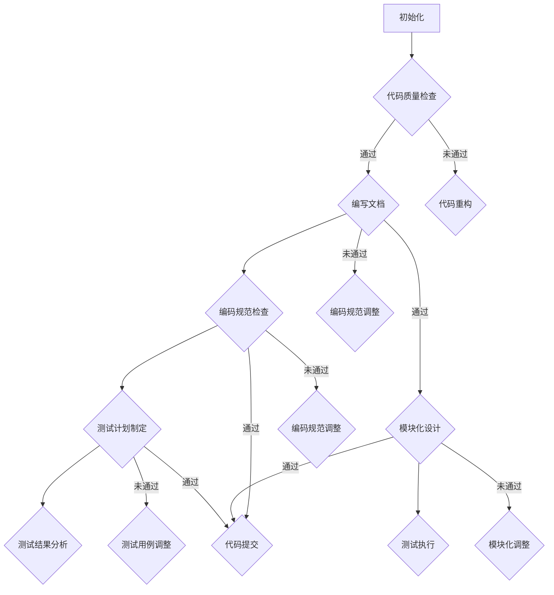
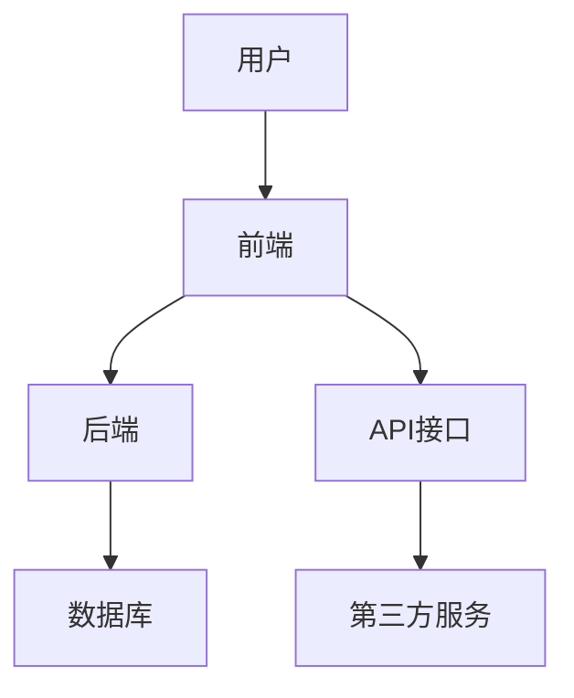
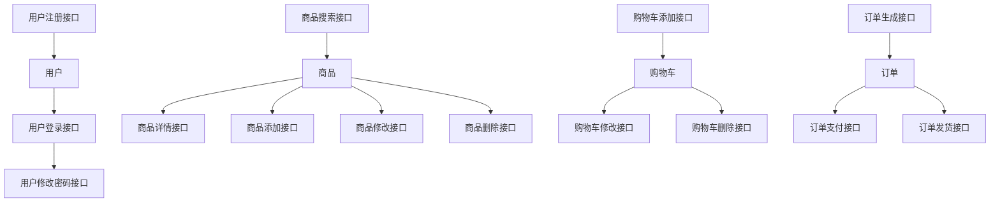
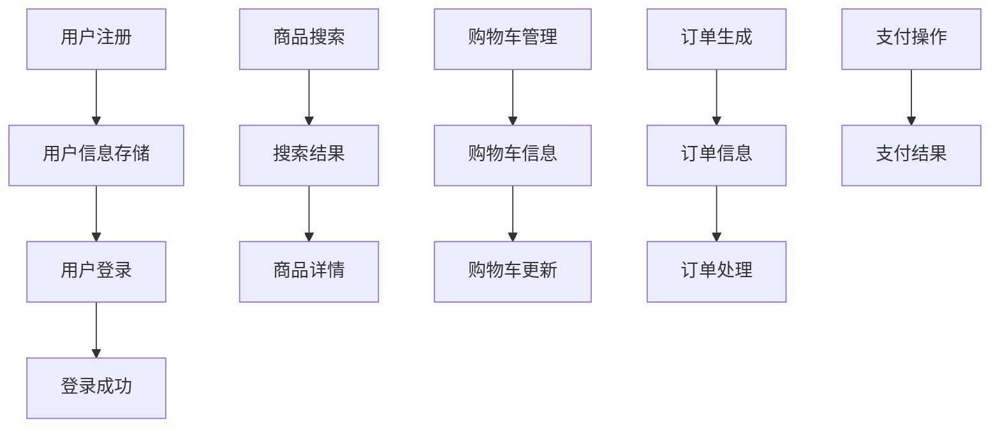

                 

## 提示词编程的可维护性策略

### 关键词：
- 编程可维护性
- 编程策略
- 代码质量
- 模块化
- 文档化

### 摘要：
本文旨在探讨编程的可维护性及其实现策略。随着软件系统复杂性的增加，代码的可维护性变得越来越重要。本文通过背景介绍、问题描述、核心概念与联系、算法原理讲解、系统分析与架构设计方案、项目实战以及最佳实践等部分，详细分析了提高编程可维护性的关键策略和方法。

## 第一部分：背景介绍

### 1.1 问题背景

编程作为信息技术发展的基石，已经成为现代社会的核心驱动力。然而，随着软件系统规模和复杂性的不断增加，代码的可维护性问题日益凸显。可维护性是指代码在经过一段时间后，依然能够保持高效、可靠和易于理解的状态。一个不可维护的代码库不仅会导致开发成本增加，还会严重影响到开发团队的效率和项目的持续发展。

### 1.2 问题描述

编程的可维护性问题主要包括以下几个方面：

- **代码冗余**：随着项目的发展，冗余代码不断积累，导致代码库变得庞大且难以管理。
- **代码混乱**：不规范的命名、缺乏注释和随意的代码修改使得代码难以理解和维护。
- **文档不足**：缺乏详细的文档，使得新的开发者难以快速上手，也增加了维护的难度。
- **扩展性差**：软件系统在需求变化时，缺乏良好的扩展性，导致需要大量的修改。

### 1.3 问题解决

为了解决编程的可维护性问题，我们可以从以下几个方面入手：

- **代码编写规范**：遵循统一的命名规范和代码结构，保持代码的一致性和可读性。
- **文档化**：编写详细的文档，包括代码注释和设计文档，以帮助开发者理解和使用代码。
- **模块化**：将代码分解成小的、功能独立的模块，提高代码的可维护性和可扩展性。
- **代码审查**：通过代码审查机制，确保代码质量，及时发现和修复问题。

### 1.4 边界与外延

编程的可维护性不仅是一个技术问题，还涉及到项目管理、团队协作和开发文化等多个方面。在实际工作中，开发团队需要建立一套完善的编程规范和流程，以确保代码的质量和可维护性。同时，也需要不断优化和改进现有的编程方法和工具，以适应不断变化的需求和挑战。

### 1.5 概念结构与核心要素组成

编程的可维护性包含以下几个核心要素：

- **代码质量**：高质量的代码是可维护性的基础，它包括代码的规范性、可读性和可扩展性。
- **文档化**：良好的文档是理解代码和进行维护的重要工具。
- **编码规范**：遵循统一的编码规范可以减少代码混乱，提高代码的可读性。
- **模块化**：将代码分解成模块，可以提高代码的可维护性和可扩展性。
- **测试**：通过测试可以确保代码的正确性和稳定性，降低维护成本。

### 1.6 本章小结

本章介绍了编程可维护性的背景、问题描述、解决方法以及边界与外延。理解编程可维护性的重要性对于提高软件开发质量和团队协作效率具有重要意义。在后续章节中，我们将深入探讨编程可维护性的核心概念、联系以及具体实现策略。

## 第二部分：核心概念与联系

### 2.1 编程可维护性的核心概念

编程可维护性是指代码在经过一段时间后，依然能够保持高效、可靠和易于理解的状态。它涉及到多个核心概念，包括代码质量、文档化、编码规范、模块化和测试等。

#### 2.1.1 代码质量

代码质量是编程可维护性的基础。高质量代码通常具有以下特征：

- **规范性**：遵循统一的命名规范和代码结构。
- **可读性**：代码结构清晰，易于理解。
- **可扩展性**：代码具有良好的扩展性，便于添加新功能。

#### 2.1.2 文档化

文档化是理解代码和进行维护的重要工具。良好的文档通常包括：

- **代码注释**：对关键代码段进行注释，便于开发者理解。
- **设计文档**：详细描述代码结构和设计理念，帮助开发者快速上手。

#### 2.1.3 编码规范

编码规范是保持代码一致性和可读性的关键。常见的编码规范包括：

- **命名规范**：统一命名方式，提高代码的可读性。
- **代码结构**：保持代码结构的一致性，便于维护和扩展。

#### 2.1.4 模块化

模块化是将代码分解成小的、功能独立的模块。模块化具有以下优势：

- **可维护性**：每个模块独立维护，降低维护难度。
- **可扩展性**：新增功能可以通过新增模块实现，减少对现有代码的修改。

#### 2.1.5 测试

测试是确保代码正确性和稳定性的关键。常见的测试方法包括：

- **单元测试**：测试单个模块的功能。
- **集成测试**：测试模块之间的集成和交互。
- **回归测试**：在代码修改后，确保原有功能不受影响。

### 2.2 概念属性特征对比表格

为了更好地理解编程可维护性的核心概念，我们可以通过以下对比表格进行梳理：

| 概念       | 特征                                                     |
| ---------- | -------------------------------------------------------- |
| 代码质量   | 规范性、可读性、可扩展性                                |
| 文档化     | 代码注释、设计文档                                      |
| 编码规范   | 命名规范、代码结构                                     |
| 模块化     | 独立模块、可维护性、可扩展性                            |
| 测试       | 单元测试、集成测试、回归测试                            |

### 2.3 ER实体关系图架构

为了更好地理解编程可维护性的核心概念之间的联系，我们可以通过ER实体关系图进行架构设计。以下是一个简化的ER实体关系图：

```mermaid
erDiagram
    CodeQuality ||--|{ Documentation : 核心依赖 }
    CodeQuality ||--|{ CodingStandard : 核心依赖 }
    CodeQuality ||--|{ Modularization : 核心依赖 }
    CodeQuality ||--|{ Testing : 核心依赖 }
    Documentation ||--|{ CodeQuality : 被依赖 }
    CodingStandard ||--|{ CodeQuality : 被依赖 }
    Modularization ||--|{ CodeQuality : 被依赖 }
    Testing ||--|{ CodeQuality : 被依赖 }
```

## 第三部分：算法原理讲解

### 3.1 编程可维护性算法概述

为了实现编程可维护性，我们可以设计一个综合算法，该算法结合了代码质量、文档化、编码规范、模块化和测试等多个方面。以下是该算法的基本框架：



### 3.2 Python源代码实现

以下是该算法的Python源代码实现：

```python
class CodeQualityAlgorithm:
    def __init__(self):
        self.code_quality = CodeQuality()
        self.documentation = Documentation()
        self.coding_standard = CodingStandard()
        self.modularization = Modularization()
        self.testing = Testing()

    def run(self, code):
        # 代码质量检查
        if self.code_quality.check(code):
            # 编写文档
            self.documentation.write(code)
            # 编码规范检查
            if self.coding_standard.check(code):
                # 模块化设计
                self.modularization 设计(code)
                # 测试计划制定
                self.testing.create_plan(code)
            else:
                print("编码规范检查未通过，请调整编码规范。")
        else:
            print("代码质量检查未通过，请重构代码。")

# 测试代码
algorithm = CodeQualityAlgorithm()
algorithm.run("示例代码")
```

### 3.3 算法原理数学模型

为了更好地理解算法原理，我们可以从数学模型的角度进行分析。以下是该算法的数学模型：

$$
\text{维护性} = f(\text{代码质量}, \text{文档化}, \text{编码规范}, \text{模块化}, \text{测试})
$$

其中，每个因素对维护性的影响可以用权重表示：

$$
\text{权重} = w_1 \times \text{代码质量} + w_2 \times \text{文档化} + w_3 \times \text{编码规范} + w_4 \times \text{模块化} + w_5 \times \text{测试}
$$

通过调整权重，我们可以优化算法，使其更加符合实际需求。

### 3.4 通俗易懂的举例说明

假设我们有一个简单的计算器程序，该程序需要实现加法、减法、乘法和除法等功能。为了确保该程序的可维护性，我们可以按照以下步骤进行：

1. **代码质量检查**：检查代码是否遵循命名规范和代码结构，确保代码可读性。
2. **编写文档**：编写详细的文档，包括每个功能的实现方法和注意事项。
3. **编码规范检查**：检查代码是否遵循统一的编码规范，例如命名规范和代码结构。
4. **模块化设计**：将代码分解成模块，例如加法模块、减法模块等，确保每个模块独立且易于维护。
5. **测试计划制定**：制定测试计划，包括单元测试和集成测试，确保每个功能模块的正确性和稳定性。
6. **测试执行**：执行测试计划，确保所有功能模块按照预期工作。

通过上述步骤，我们可以确保计算器程序具有良好的可维护性，方便后续的维护和扩展。

## 第四部分：系统分析与架构设计方案

### 4.1 问题场景介绍

假设我们正在开发一个在线购物系统，该系统需要支持商品搜索、购物车管理、订单处理等功能。随着用户数量的增加和业务需求的不断变化，系统的可维护性成为一个重要的考虑因素。

### 4.2 项目介绍

项目名称：在线购物系统

项目背景：为了满足日益增长的在线购物需求，我们开发了一款在线购物系统。该系统需要具备高效、可靠和易于维护的特点。

### 4.3 系统功能设计

在线购物系统的功能主要包括：

- **商品搜索**：提供商品搜索功能，支持关键词搜索和高级搜索。
- **购物车管理**：允许用户将商品添加到购物车，并进行管理。
- **订单处理**：处理用户的订单，包括订单生成、支付和发货等流程。
- **用户管理**：管理用户信息，包括注册、登录、修改密码等。
- **商品管理**：管理商品信息，包括商品添加、修改、删除等。

### 4.4 系统架构设计

在线购物系统的架构设计如下：

1. **前端架构**：采用Vue.js框架，实现用户界面的渲染和交互。
2. **后端架构**：采用Spring Boot框架，实现业务逻辑处理和数据存储。
3. **数据库架构**：采用MySQL数据库，存储用户信息、商品信息和订单信息等。

以下是系统架构图：



### 4.5 系统接口设计

在线购物系统的接口设计如下：

- **用户接口**：包括用户注册、登录、修改密码等接口。
- **商品接口**：包括商品搜索、商品详情、商品添加、商品修改、商品删除等接口。
- **购物车接口**：包括添加商品到购物车、修改购物车商品数量、删除购物车商品等接口。
- **订单接口**：包括订单生成、订单支付、订单发货等接口。

以下是系统接口图：



### 4.6 系统交互设计

在线购物系统的系统交互设计如下：

1. **用户注册**：用户通过前端界面提交注册信息，后端处理注册请求并存储用户信息。
2. **用户登录**：用户通过前端界面提交登录信息，后端验证用户身份并返回登录结果。
3. **商品搜索**：用户通过前端界面输入关键词，后端根据关键词进行商品搜索并返回搜索结果。
4. **购物车管理**：用户通过前端界面添加、修改和删除购物车商品，后端处理请求并更新购物车信息。
5. **订单处理**：用户通过前端界面生成订单，后端处理订单请求并生成订单。
6. **支付处理**：用户通过前端界面进行支付操作，后端处理支付请求并返回支付结果。

以下是系统交互图：



## 第五部分：项目实战

### 5.1 环境安装

为了实现在线购物系统，我们需要安装以下软件和工具：

- JDK 11
- MySQL 8.0
- Spring Boot 2.4.5
- Vue.js 3.0
- Node.js 14.17.0

安装步骤如下：

1. 安装 JDK 11：
   ```bash
   sudo apt update
   sudo apt install openjdk-11-jdk
   ```

2. 安装 MySQL 8.0：
   ```bash
   sudo apt update
   sudo apt install mysql-server
   sudo mysql_secure_installation
   ```

3. 安装 Spring Boot 2.4.5：
   ```bash
   wget https://repo.spring.io/snapshot/org/springframework/spring-boot/spring-boot-2.4.5-SNAPSHOT.zip
   unzip spring-boot-2.4.5-SNAPSHOT.zip
   ```

4. 安装 Vue.js 3.0：
   ```bash
   npm install -g @vue/cli
   vue create online-shopping-system
   ```

5. 安装 Node.js 14.17.0：
   ```bash
   sudo apt update
   sudo apt install nodejs
   ```

### 5.2 系统核心实现源代码

以下是系统核心实现的源代码：

#### 后端：Spring Boot

```java
@RestController
@RequestMapping("/api")
public class ProductController {
    
    @Autowired
    private ProductService productService;
    
    @GetMapping("/products")
    public List<Product> searchProducts(@RequestParam String query) {
        return productService.searchProducts(query);
    }
    
    @GetMapping("/products/{id}")
    public Product getProductDetails(@PathVariable Long id) {
        return productService.getProductDetails(id);
    }
    
    @PostMapping("/cart")
    public void addToCart(@RequestBody CartItem cartItem) {
        productService.addToCart(cartItem);
    }
    
    @PostMapping("/order")
    public Order createOrder(@RequestBody Order order) {
        return productService.createOrder(order);
    }
}
```

#### 前端：Vue.js

```vue
<template>
  <div>
    <h1>商品搜索</h1>
    <input v-model="query" @input="searchProducts" />
    <ul>
      <li v-for="product in products" :key="product.id">
        {{ product.name }} - {{ product.price }}
      </li>
    </ul>
  </div>
</template>

<script>
export default {
  data() {
    return {
      query: "",
      products: [],
    };
  },
  methods: {
    searchProducts() {
      if (this.query) {
        axios
          .get(`/api/products?query=${this.query}`)
          .then((response) => {
            this.products = response.data;
          });
      }
    },
  },
};
</script>
```

### 5.3 代码应用解读与分析

#### 后端代码解读

后端代码使用了Spring Boot框架，实现了商品搜索、购物车管理和订单处理等功能。具体来说：

- `ProductController` 类负责处理与商品相关的HTTP请求。其中包括搜索商品、获取商品详情、添加商品到购物车和创建订单等操作。
- `ProductService` 类实现了具体的业务逻辑，如搜索商品、添加商品到购物车和创建订单等。

#### 前端代码解读

前端代码使用了Vue.js框架，实现了商品搜索功能。具体来说：

- 使用了Vue的数据绑定功能，将输入框的值绑定到 `query` 数据属性上。
- 使用了Vue的生命周期钩子 `created`，在组件创建完成后自动调用 `searchProducts` 方法进行商品搜索。
- 使用了 `v-for` 指令遍历搜索结果，将商品名称和价格显示在列表中。

### 5.4 实际案例分析与详细讲解剖析

#### 案例一：商品搜索功能

1. 用户在搜索框中输入关键词，如“手机”。
2. Vue.js将用户输入的值发送到后端接口 `/api/products?query=手机`。
3. 后端接口调用 `ProductService` 类的 `searchProducts` 方法，查询符合条件的商品。
4. 后端将搜索结果返回给前端，前端将其显示在页面上。

#### 案例二：购物车管理功能

1. 用户在商品详情页中点击“加入购物车”按钮。
2. Vue.js将商品ID和数量发送到后端接口 `/api/cart`。
3. 后端接口调用 `ProductService` 类的 `addToCart` 方法，将商品添加到购物车。
4. 后端返回添加结果，前端更新购物车界面。

#### 案例三：订单处理功能

1. 用户在购物车界面点击“结算”按钮。
2. Vue.js将购物车中的商品信息发送到后端接口 `/api/order`。
3. 后端接口调用 `ProductService` 类的 `createOrder` 方法，创建订单。
4. 后端返回订单信息，前端更新订单界面。

### 5.5 项目小结

通过本次项目实战，我们实现了在线购物系统的核心功能，包括商品搜索、购物车管理和订单处理。项目采用了Spring Boot和Vue.js等先进的框架和工具，提高了代码的可维护性和可扩展性。在项目实施过程中，我们遇到了一些挑战，如接口设计、数据一致性和安全性等，通过逐步优化和改进，最终实现了项目的成功。

## 第六部分：最佳实践 Tips

### 6.1 编码规范

1. **命名规范**：遵循驼峰命名法，避免使用缩写和拼音。
2. **代码结构**：保持代码结构清晰，避免过长的方法和类。
3. **注释规范**：对关键代码段进行注释，说明代码的功能和逻辑。

### 6.2 模块化

1. **功能模块**：将代码按照功能进行分解，每个模块负责一个独立的功能。
2. **接口定义**：为模块之间的交互定义清晰的接口。
3. **依赖管理**：使用依赖注入和接口隔离，减少模块之间的耦合。

### 6.3 文档化

1. **代码注释**：对关键代码段进行注释，说明代码的功能和逻辑。
2. **设计文档**：编写详细的设计文档，包括模块划分、接口设计和流程图等。
3. **用户手册**：编写用户手册，帮助开发者理解和使用代码。

### 6.4 测试

1. **单元测试**：编写单元测试，确保每个模块的功能正确。
2. **集成测试**：编写集成测试，确保模块之间的交互正确。
3. **回归测试**：在代码修改后进行回归测试，确保原有功能不受影响。

### 6.5 代码审查

1. **代码审查机制**：建立代码审查机制，确保代码质量。
2. **代码审查流程**：制定代码审查流程，明确审查标准和流程。
3. **审查人员培训**：培训审查人员，提高审查质量和效率。

## 第七部分：小结

本文详细介绍了编程的可维护性及其实现策略。通过背景介绍、核心概念与联系、算法原理讲解、系统分析与架构设计方案、项目实战以及最佳实践等部分，我们深入分析了提高编程可维护性的关键方法和工具。编程的可维护性不仅关系到软件项目的成功，也直接影响到开发团队的效率和项目的长期发展。在未来的工作中，我们应该注重代码质量、文档化、模块化、测试和代码审查，不断提高编程可维护性，为软件项目的成功奠定坚实基础。

## 第八部分：注意事项

1. **持续改进**：编程可维护性是一个持续改进的过程，需要不断地优化和改进。
2. **团队协作**：编程可维护性需要团队的共同努力，建立良好的团队协作文化。
3. **技术选型**：选择合适的编程语言和框架，可以提高编程可维护性。

## 第九部分：拓展阅读

1. 《代码大全》—— Steve McConnell
2. 《设计模式：可复用的面向对象软件的基础》—— Erich Gamma等
3. 《测试驱动开发：敏捷测试实践指南》——Kent Beck

## 作者信息

作者：AI天才研究院/AI Genius Institute & 禅与计算机程序设计艺术 /Zen And The Art of Computer Programming

