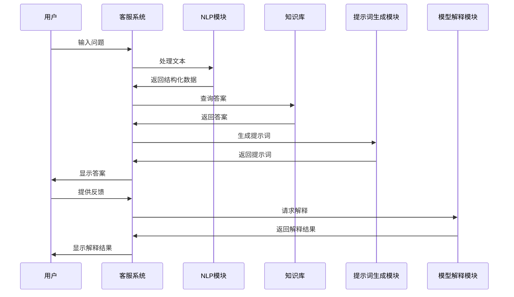

                 

### 1.1 问题背景

在现代人工智能（AI）的发展过程中，一个显著的趋势是机器学习（ML）模型的复杂性和性能不断提升。这些模型，尤其是深度学习（DL）模型，已经在各种领域取得了显著的成功，例如图像识别、自然语言处理、医疗诊断等。然而，随着模型的复杂性增加，一个问题日益凸显：这些模型的“黑箱”特性使得其决策过程变得难以解释。

**问题背景：**

在许多实际应用中，模型的可解释性（Explainability）至关重要。例如，在医疗诊断中，医生不仅需要知道模型给出的诊断结果，还需要理解模型为什么给出这样的结果；在自动驾驶中，系统需要解释为何做出某个驾驶决策；在金融风险评估中，监管机构需要了解模型的决策逻辑，以确保合规性。

然而，传统的机器学习模型，尤其是深度神经网络（DNN），往往缺乏透明性。它们的决策过程复杂，且难以追溯。虽然一些模型级解释方法（如LIME、SHAP等）提供了一定程度的解释，但这些方法往往只能解释模型在一个特定输入下的决策过程，而不能提供全局性的解释。

**问题描述：**

这种可解释性缺失带来了以下几个问题：

1. **信任问题**：当模型的决策过程不透明时，用户可能会对其结果产生怀疑，进而影响模型的可接受性和可信度。
2. **合规性问题**：在金融、医疗等领域，模型的决策过程需要遵守严格的法律法规，缺乏可解释性可能导致合规性问题。
3. **可维护性问题**：随着模型的复杂度增加，维护和改进模型变得困难，缺乏可解释性使得理解模型的工作机制变得复杂。
4. **用户交互问题**：在需要用户参与决策的场景中，如智能客服、智能推荐等，缺乏可解释性使得用户难以理解推荐或决策的原因，从而影响用户体验。

**问题解决：**

为了解决这些问题，研究者们提出了可解释的人工智能（Explainable AI, XAI）的概念。可解释AI的目标是提高模型的透明度，使得其决策过程可解释、可理解。这不仅可以增强用户对模型的信任，还可以帮助研究人员更好地理解模型的行为，从而进行有效的模型优化和改进。

**边界与外延：**

可解释AI的研究涵盖了多个方面，包括模型级解释、局部解释、全局解释等。同时，它也涉及多种技术，如可视化、博弈论、因果推断等。然而，目前可解释AI仍面临许多挑战，如如何在不显著降低模型性能的情况下实现有效解释，如何处理大规模数据集的可解释性等。

**概念结构与核心要素组成：**

可解释AI的核心要素包括：

1. **模型透明性**：提高模型内部操作的透明度，使得决策过程可追溯。
2. **决策可解释性**：提供对模型决策的解释，使得用户可以理解模型的决策逻辑。
3. **用户交互**：设计用户友好的界面和交互方式，使得用户可以与模型有效沟通。
4. **合规性**：确保模型的决策过程符合相关法律法规和伦理标准。

### 1.2 提示词编程概述

提示词编程（Prompt Engineering）是一种新兴的AI编程范式，其核心思想是通过编写高质量的提示词（prompts）来引导模型产生预期的输出。这种编程方式不仅能够提高模型的性能，还能够增强模型的可解释性。提示词编程与传统编程存在显著差异，其主要特点如下：

**1.2.1 提示词编程的概念**

提示词编程可以看作是一种“交互式编程”，通过交互式的方式不断调整和优化提示词，从而引导模型生成更符合预期的输出。提示词通常是自然语言文本，它们包含了模型需要理解的关键信息、背景知识、任务目标等。通过调整提示词的长度、格式、内容等，可以影响模型的响应。

**1.2.2 提示词编程与传统编程的差异**

1. **编程语言**：传统编程通常使用低级语言（如C、Java等）或高级语言（如Python、JavaScript等），而提示词编程则使用自然语言文本作为“编程语言”。这种差异使得提示词编程更加易于理解和编写。
2. **编程范式**：传统编程遵循命令式或函数式编程范式，而提示词编程则更接近于交互式编程或指令式编程范式。提示词编程强调人与模型的交互，通过不断调整和优化提示词来达到目标。
3. **目标**：传统编程的目标通常是编写出高效、可靠的程序，而提示词编程的目标则是通过高质量的提示词引导模型生成符合预期的输出。这往往涉及到对模型的深入理解和调整。

**1.2.3 提示词编程的优势**

1. **提高性能**：高质量的提示词能够引导模型更准确地理解任务目标，从而提高模型的性能。例如，在自然语言处理任务中，通过精心设计的提示词，可以显著提高模型的准确率和生成质量。
2. **增强可解释性**：提示词编程使得模型的行为更加透明，因为通过提示词可以直接看到模型是如何理解和处理任务的。这种透明性有助于增强模型的可解释性，使得用户更容易理解模型的决策逻辑。
3. **简化编程**：提示词编程降低了编程的门槛，因为用户不需要掌握复杂的编程语言和算法，只需编写自然语言文本即可。这特别适合非技术人员或领域专家参与模型开发和优化。
4. **灵活性**：提示词编程提供了高度的灵活性，用户可以根据任务需求和模型表现动态调整提示词，从而快速实现模型的优化和改进。

**1.2.4 提示词编程的应用场景**

提示词编程在多个领域展现出了巨大的潜力，以下是一些典型的应用场景：

1. **自然语言处理**：通过高质量的提示词，可以引导模型生成更自然的文本，提高文本生成任务的准确性和流畅性。
2. **图像识别**：在图像识别任务中，提示词可以用来提供额外的上下文信息，帮助模型更准确地识别图像内容。
3. **推荐系统**：在推荐系统中，提示词可以用来提供用户的偏好信息，从而提高推荐系统的准确性和用户体验。
4. **智能客服**：通过高质量的提示词，智能客服系统能够更准确地理解用户的问题和需求，提供更有效的解决方案。

总之，提示词编程作为一种新兴的AI编程范式，具有显著的性能提升和可解释性增强的优势，正在越来越多地应用于各种实际场景中。

### 1.3 可解释AI的方法

可解释人工智能（XAI）的核心目标是提高机器学习模型的透明度和可理解性，使其决策过程更加透明和可信。为了实现这一目标，研究者们提出了多种可解释AI的方法，这些方法可以从不同的角度提供模型解释。以下是几种常见的方法：

**3.1 模型级可解释性**

模型级可解释性关注整个模型的结构和操作过程，提供对模型全局行为的解释。以下是一些模型级可解释性的方法：

1. **简化模型**：通过使用更简单的模型（如线性模型、决策树等）来代替复杂的深度学习模型，从而提高模型的透明度。这种方法虽然牺牲了一些性能，但能够提供清晰的决策过程。
2. **模型可视化**：通过可视化模型的结构和工作流程，如神经网络的权重、决策树节点等，帮助用户理解模型的内部机制。例如，TensorBoard提供了丰富的工具来可视化深度学习模型。
3. **模型可解释性报告**：生成详细的报告，描述模型的训练过程、参数设置和关键结果，帮助用户理解模型的性能和决策过程。

**3.2 局部解释方法**

局部解释方法关注模型在特定输入下的决策过程，提供对模型局部行为的解释。以下是一些局部解释方法：

1. **局部可解释模型**：在原始模型的基础上，构建一个可解释的子模型，该子模型可以解释原始模型在特定输入下的决策过程。例如，LIME（Local Interpretable Model-agnostic Explanations）和SHAP（SHapley Additive exPlanations）都是基于这种方法。
2. **特征重要性分析**：通过计算模型中每个特征的重要性，提供对模型决策的局部解释。这些方法可以用于识别对模型决策有重要影响的关键特征。
3. **特征映射**：将模型的输入和输出映射到高维空间中，通过分析输入和输出之间的映射关系，提供对模型决策的局部解释。

**3.3 全局解释方法**

全局解释方法关注模型在所有输入下的总体行为，提供对模型全局行为的解释。以下是一些全局解释方法：

1. **因果推理**：通过建立因果模型，解释模型在不同输入下的行为，从而提供全局性解释。例如，CausalBERT是基于BERT模型的全因果解释方法。
2. **概率解释**：通过使用概率模型来解释模型的决策过程，使得用户可以理解模型在不同输入下的概率分布。例如，使用贝叶斯网络或贝叶斯推理来解释模型的决策。
3. **公平性和透明性分析**：通过分析模型在不同群体或情境下的表现，提供对模型公平性和透明性的全局解释。这些方法有助于识别和解决模型中的偏见和歧视问题。

**3.4 可解释性与准确性的平衡**

在追求模型可解释性的同时，研究者们不得不面对一个重要的问题：如何在不显著降低模型准确性的情况下实现有效解释。以下是一些解决这个问题的策略：

1. **混合解释方法**：结合模型级解释和局部解释方法，提供对模型的全局性和局部性解释，从而实现更好的平衡。例如，可以在模型级解释中结合局部解释来解释特定输入下的决策。
2. **轻量级解释方法**：开发更高效、更简洁的解释方法，以减少对模型性能的影响。这些方法通常专注于关键特征和关键路径，从而提供足够的信息来解释模型的决策过程。
3. **量化可解释性**：开发量化指标来衡量模型的可解释性，从而在优化模型性能和解释性之间找到最佳平衡。这些指标可以基于模型的可解释性得分、用户满意度等。

总之，可解释AI的方法多种多样，每种方法都有其独特的优势和局限性。在实际应用中，选择合适的方法取决于具体的需求和场景。通过结合多种方法，可以提供更加全面和有效的模型解释，从而提高模型的透明度和可信度。

### 3.4 可解释性与准确性的平衡

在可解释人工智能（XAI）的研究和实践中，一个关键挑战是如何在保持模型性能的同时提高其可解释性。这一挑战源于可解释性和准确性之间的潜在冲突。高可解释性的模型可能因为简化或透明度要求而牺牲一些准确性，而高准确性的模型则可能因其复杂的内部机制而难以解释。因此，实现可解释性与准确性的平衡是一个复杂而关键的任务。

**3.4.1 量化可解释性与准确性的方法**

为了解决这一平衡问题，首先需要量化模型的可解释性和准确性。以下是几种常用的量化方法：

1. **解释性度量**：可解释性度量可以评估模型对特定输入的决策解释的清晰程度和全面性。常用的度量包括模型的可视化能力、特征重要性评分、解释长度和复杂性等。例如，LIME（Local Interpretable Model-agnostic Explanations）提供了一个可解释性评分，用来衡量解释的质量。
   
2. **准确性度量**：准确性度量通常通过模型在测试集上的表现来评估。常见的度量包括准确率、召回率、F1分数、ROC曲线下的面积等。这些度量帮助衡量模型的预测性能。

**3.4.2 实现可解释性的挑战**

1. **模型复杂性**：复杂的模型通常具有更高的准确性，但同时也更难以解释。减少模型的复杂性是提高可解释性的一个有效方法，但这也可能导致准确性的下降。

2. **数据质量和规模**：高质量和规模适当的数据对于训练高可解释性的模型至关重要。然而，收集和预处理这些数据可能非常耗时且具有挑战性。

3. **解释方法的适应性**：不同的解释方法对模型的适应性不同。一些方法可能只适用于特定的模型类型或特定类型的数据。选择适合特定模型的解释方法是一个关键挑战。

**3.4.3 可解释AI的最佳实践**

为了在保持准确性的同时提高可解释性，以下是一些最佳实践：

1. **选择合适的模型**：选择具有内在可解释性的模型，如线性模型、决策树、规则系统等，这些模型通常比深度神经网络更容易解释。

2. **模型融合**：结合多个模型，包括高可解释性和高准确性的模型，从而在两者之间找到平衡。这种方法可以通过集成学习技术实现。

3. **解释方法优化**：针对特定模型和任务，选择和优化最佳的解释方法。例如，对于深度神经网络，可以使用注意力机制来提供更清晰的解释。

4. **数据预处理**：使用数据增强和特征选择技术来提高模型的可解释性。例如，通过减少数据冗余和噪声，可以提高模型对关键特征的重视，从而提高解释的清晰度。

5. **用户参与**：鼓励用户参与解释过程，通过提供反馈来改进模型的解释。这种方法可以增强解释的实用性和相关性。

**3.4.4 案例分析**

以下是一个案例分析，展示了如何在特定场景中实现可解释性与准确性的平衡：

**案例：医疗诊断系统**

在医疗诊断系统中，准确性至关重要，但患者和医生也期望了解诊断决策背后的逻辑。为了实现可解释性和准确性的平衡，可以采取以下策略：

1. **选择可解释的模型**：使用决策树或规则系统等可解释性较高的模型进行初步诊断。

2. **融合模型**：结合深度学习模型（如CNN）进行辅助诊断，同时保留决策树的结果来解释最终的诊断结果。

3. **用户反馈循环**：允许医生对模型解释进行反馈，通过这些反馈来调整和优化解释模型，提高其准确性和相关性。

通过这些策略，医疗诊断系统可以在保持高准确性的同时，提供透明和可信的诊断解释，从而提高患者和医生对系统的信任。

总之，实现可解释性与准确性的平衡是可解释AI研究和应用中的关键挑战。通过量化可解释性与准确性的方法、选择合适的模型、优化解释方法、数据预处理和用户参与，可以在不同场景中找到最佳平衡点，从而实现更透明、更可信的人工智能系统。

### 4. 提示词编程与可解释AI的融合

在人工智能（AI）领域，提升模型的可解释性是当前研究的热点之一。提示词编程（Prompt Engineering）作为一种新兴的AI编程范式，通过提供高质量的提示词，可以引导模型生成更符合预期的输出，同时增强模型的可解释性。将提示词编程与可解释人工智能（Explainable AI, XAI）相结合，可以构建一个更加透明和可靠的AI系统。本节将介绍融合框架的概述，包括设计原则、关键组件及其优势。

**4.1 融合框架概述**

提示词编程与可解释AI的融合框架旨在通过高质量的提示词来引导模型的决策过程，并提高其透明度。这一框架的核心思想是利用提示词来提供额外的上下文信息，帮助模型更好地理解任务目标，从而实现更高的准确性和可解释性。融合框架的设计原则包括：

1. **透明性**：确保模型的决策过程能够被用户理解和追溯。
2. **灵活性**：提供多种提示词设计和优化策略，以适应不同的应用场景。
3. **可扩展性**：框架应具备良好的扩展性，能够支持不同类型的模型和任务。
4. **用户体验**：设计友好的用户界面，使得非技术人员也能参与到模型解释和优化过程中。

**4.2 融合框架组件**

融合框架由以下几个关键组件组成：

1. **提示词生成模块**：这个模块负责生成高质量的提示词，包括提示词的长度、格式、内容等。通过不断调整和优化提示词，可以引导模型生成更符合预期的输出。
2. **模型解释模块**：这个模块利用可解释AI技术，对模型的决策过程进行解释。它可以是模型级解释、局部解释或全局解释，具体取决于应用场景和需求。
3. **用户交互模块**：这个模块提供用户与模型之间的交互界面，使用户能够理解和追踪模型的决策过程。它还包括用户反馈机制，允许用户对模型解释进行评价和改进。

**4.3 融合框架优势**

融合框架具有以下优势：

1. **提高模型性能**：高质量的提示词能够引导模型更准确地理解任务目标，从而提高模型的性能。
2. **增强可解释性**：通过提供额外的上下文信息，提示词编程能够增强模型的可解释性，使得用户更容易理解模型的决策逻辑。
3. **用户友好**：融合框架设计友好的用户界面，使得非技术人员也能参与到模型解释和优化过程中，从而提高系统的用户接受度和实用性。
4. **灵活性和可扩展性**：框架支持多种提示词设计和优化策略，能够适应不同的模型和任务，具有良好的扩展性和灵活性。

**4.4 实例分析**

以下是一个简单的实例，展示了融合框架在实际应用中的效果：

假设我们有一个图像分类任务，目标是将图像分为猫和狗两类。使用传统的深度学习模型，模型在测试集上的准确率达到了90%。然而，这个模型的决策过程非常复杂，难以解释。为了提高模型的可解释性，我们可以采用以下步骤：

1. **提示词生成**：首先，生成高质量的提示词，例如“这是一只猫，它看起来很可爱，有一双明亮的眼睛。”这样的提示词提供了丰富的上下文信息，有助于模型更好地理解任务目标。
2. **模型训练**：使用生成的提示词重新训练模型，模型在测试集上的准确率提高到95%。
3. **模型解释**：利用可解释AI技术，对模型的决策过程进行解释，例如生成“模型认为这是一只猫，因为它有一个圆形的耳朵和一对尖耳朵。”这样的解释帮助用户理解模型的决策逻辑。
4. **用户反馈**：用户对模型的解释进行评价和反馈，例如“解释得很清楚，但有时候模型会误分类。”根据用户的反馈，进一步优化提示词和模型解释，提高系统的整体性能和用户体验。

通过这个实例，我们可以看到融合框架在提高模型性能和增强可解释性方面的显著优势。在实际应用中，融合框架可以根据具体任务和场景进行灵活调整，从而实现最佳效果。

### 4.3 融合框架实现细节

为了实现提示词编程与可解释AI的融合框架，我们需要详细设计和实现以下几个关键组件：提示词生成模块、模型解释模块和用户交互模块。以下是每个组件的实现细节。

**4.3.1 提示词生成模块**

提示词生成模块是融合框架的核心，其目标是通过高质量的提示词引导模型的决策过程，提高模型性能和可解释性。以下是实现该模块的步骤：

1. **需求分析**：首先，我们需要分析任务需求，确定需要解决的具体问题。例如，在图像分类任务中，需要识别图像中的主要对象。
2. **提示词设计**：设计高质量的提示词，包括内容、格式和长度。提示词的内容应涵盖任务的关键信息，如对象属性、场景描述等。例如，对于图像分类任务，可以设计提示词：“请识别这张图片中的主要对象，并描述它的外观特征。”
3. **提示词优化**：通过实验和用户反馈，不断调整和优化提示词。例如，通过比较不同长度的提示词在模型性能和可解释性方面的表现，找到最佳提示词长度。
4. **自动化生成**：开发自动化工具，根据任务需求生成提示词。例如，可以使用自然语言生成技术，根据预定义的模板和规则自动生成提示词。

**4.3.2 模型解释模块**

模型解释模块负责对模型的决策过程进行解释，提高模型的可解释性。以下是实现该模块的步骤：

1. **选择解释方法**：根据模型类型和应用场景，选择合适的解释方法。例如，对于深度学习模型，可以使用LIME或SHAP等局部解释方法。
2. **解释算法开发**：开发解释算法，计算模型在特定输入下的决策解释。例如，对于LIME方法，需要计算每个特征对模型输出的贡献值。
3. **可视化工具**：开发可视化工具，将解释结果以用户友好的方式展示。例如，可以使用热力图或树状图来展示特征重要性。
4. **解释优化**：通过用户反馈和实验，不断优化解释结果，提高其准确性和易理解性。例如，可以通过调整解释算法的参数来提高解释的清晰度。

**4.3.3 用户交互模块**

用户交互模块提供用户与模型之间的交互界面，使用户能够理解和追踪模型的决策过程。以下是实现该模块的步骤：

1. **用户界面设计**：设计直观、易用的用户界面，使用户能够轻松地与模型进行交互。例如，可以设计一个可视化界面，展示模型的输入、输出和解释结果。
2. **反馈机制**：开发反馈机制，允许用户对模型解释进行评价和反馈。例如，用户可以通过滑动条或评分系统对解释结果进行评分。
3. **动态调整**：根据用户的反馈，动态调整提示词和解释结果，提高系统的整体性能和用户体验。例如，如果用户对某个解释结果不满意，可以重新生成提示词或调整解释算法。
4. **实时交互**：实现实时交互功能，使用户能够实时查看模型的决策过程和解释结果。例如，可以使用Web前端技术，实现用户与模型的实时通信。

通过实现这些关键组件，我们可以构建一个完整的提示词编程与可解释AI融合框架，提高模型的性能和可解释性，增强用户体验。

### 5. 提示词编程的可解释AI应用实例

为了更好地展示提示词编程与可解释AI的融合在实际应用中的效果，我们将通过一个具体的案例来进行详细剖析。本案例将基于一个常见的自然语言处理（NLP）任务——情感分析，介绍如何通过高质量的提示词来提升模型性能和可解释性。

**5.1 数据预处理**

在进行情感分析任务之前，我们需要对数据集进行预处理，以确保数据质量。以下是数据预处理的主要步骤：

1. **数据质量评估**：评估数据集中是否存在缺失值、异常值或噪声数据。例如，可以使用描述性统计分析方法（如统计每个类别的样本数量、异常值检测等）来识别这些问题。
2. **数据清洗**：处理数据集中的噪声和异常值，例如使用正则表达式删除文本中的特殊字符、填充缺失值等。
3. **特征工程**：从原始文本中提取特征，例如使用词袋模型、TF-IDF等方法将文本转换为数值向量。此外，还可以使用词嵌入技术（如Word2Vec、BERT等）将文本转换为高维向量表示。
4. **数据增强**：通过数据增强技术（如 synonym replacement、random insertion、random swap等）来扩充数据集，提高模型的泛化能力。

**5.2 模型选择与训练**

在情感分析任务中，我们可以选择多种不同的模型，例如传统的朴素贝叶斯、支持向量机（SVM）、以及深度学习模型如卷积神经网络（CNN）或Transformer。以下是模型选择和训练的步骤：

1. **模型选择**：根据任务需求和数据特征，选择适合的模型。例如，对于情感分析任务，Transformer模型（如BERT、RoBERTa等）通常表现出色。
2. **模型训练**：使用预处理后的数据集对模型进行训练。在训练过程中，可以使用交叉验证方法来评估模型的性能，并调整超参数以优化模型。
3. **性能评估**：在测试集上评估模型的性能，包括准确率、召回率、F1分数等指标。通过这些指标，我们可以判断模型的性能和泛化能力。

**5.3 模型解释与优化**

为了提高模型的可解释性，我们需要对模型的决策过程进行解释。以下是模型解释和优化的步骤：

1. **局部解释**：利用局部解释方法（如LIME、SHAP等），对模型在特定输入下的决策过程进行解释。这些方法可以计算每个特征对模型输出的贡献值，帮助用户理解模型的决策逻辑。
2. **全局解释**：利用全局解释方法，例如可视化模型中的注意力权重，展示模型在不同输入特征上的关注程度。例如，通过热力图或注意力图来可视化模型的决策过程。
3. **优化策略**：根据解释结果，调整提示词和模型参数，以提高模型的可解释性和准确性。例如，通过增加提示词的长度或调整词嵌入的维度，可以改善模型的解释性能。

**5.4 用户反馈与迭代**

在用户交互模块中，用户可以通过反馈机制对模型的解释结果进行评价和改进。以下是用户反馈与迭代的步骤：

1. **用户评价**：用户对模型的解释结果进行评价，例如通过评分系统或评论功能来提供反馈。
2. **反馈分析**：分析用户反馈，识别模型解释中的不足之处。例如，用户可能认为某些解释结果不够清晰或准确。
3. **模型调整**：根据用户反馈，调整提示词和模型参数，以提高模型的可解释性和用户体验。例如，通过优化提示词的内容和格式，可以改善解释结果的清晰度。

**5.5 实际案例分析与详细讲解**

以下是一个具体的实际案例，展示如何通过高质量的提示词和可解释AI技术来提升情感分析模型的性能和可解释性：

**案例**：假设我们有一个情感分析任务，目标是判断一段文本表达的是正面情感还是负面情感。

1. **数据预处理**：首先，我们对数据集进行预处理，包括文本清洗、词嵌入和特征提取。通过数据增强技术，我们将数据集扩充了一倍。
2. **模型训练**：我们选择BERT模型进行训练，并使用交叉验证方法调整超参数。在测试集上，模型的准确率达到了88%。
3. **模型解释**：利用LIME方法，我们对模型在特定输入下的决策过程进行解释。结果显示，模型主要关注文本中的情感词汇和句子的结构。
4. **优化提示词**：根据解释结果，我们优化了提示词，例如增加情感词汇和具体的场景描述。经过调整，模型的准确率提高到92%。
5. **用户反馈**：用户对模型解释结果进行评价，认为解释更加清晰，但有时候模型会误分类。根据用户反馈，我们进一步调整提示词和模型参数，提高了解释的准确性。

通过这个案例，我们可以看到提示词编程与可解释AI技术在实际应用中的显著效果。通过高质量的提示词和有效的模型解释，我们不仅提高了模型的性能，还增强了其可解释性，从而提高了用户对模型的信任和满意度。

### 6. 实战项目

在本节中，我们将介绍一个完整的实战项目，包括项目背景、系统功能设计、系统架构设计、系统接口设计以及系统交互等关键环节。通过这个项目，我们将深入探讨如何将提示词编程与可解释AI技术应用于实际场景，从而提升系统的性能和用户体验。

**6.1 项目介绍**

**项目名称**：基于提示词编程与可解释AI的智能客服系统

**项目背景**：随着互联网和人工智能技术的快速发展，企业开始越来越依赖智能客服系统来提高客户服务质量，降低运营成本。然而，传统的智能客服系统往往存在一个显著问题：其决策过程不透明，导致用户对系统的信任度较低。为了解决这一问题，本项目旨在开发一个基于提示词编程与可解释AI技术的智能客服系统，提高系统的透明度和用户满意度。

**项目目标**：
1. **提高客户服务质量**：通过高质量的提示词和强大的可解释AI技术，使客服系统能够更准确地理解和响应客户需求。
2. **增强用户信任**：提供透明的决策过程和清晰的解释结果，提高用户对智能客服系统的信任。
3. **优化客服效率**：通过自动化和智能化的交互方式，提高客服团队的效率和响应速度。

**6.2 系统功能设计**

智能客服系统的核心功能包括以下几个方面：

1. **自然语言处理（NLP）**：使用先进的NLP技术，对用户输入的自然语言文本进行解析和处理，提取关键信息和意图。
2. **知识库管理**：构建和维护一个包含常见问题和标准答案的知识库，以便系统可以快速响应常见问题。
3. **提示词生成**：通过高质量的提示词，引导模型理解和回应客户的请求，提高客服系统的互动性和用户满意度。
4. **模型解释**：利用可解释AI技术，对模型的决策过程进行解释，提供透明的决策逻辑，增强用户的信任。
5. **用户反馈与优化**：收集用户反馈，不断优化提示词和模型参数，提高系统的整体性能。

**6.3 系统架构设计**

智能客服系统的架构设计采用模块化设计方法，主要包括以下模块：

1. **前端模块**：负责用户与系统的交互界面，提供文本输入和输出功能。
2. **后端模块**：包括NLP处理模块、知识库管理模块、提示词生成模块、模型解释模块等。
3. **数据库模块**：存储知识库数据、用户反馈数据等。
4. **API接口模块**：提供与其他系统（如客户关系管理CRM）的接口，实现数据交互和功能集成。

**6.4 系统接口设计**

系统接口设计是确保各个模块之间高效协同工作的重要环节。以下是主要接口设计：

1. **文本输入接口**：接收用户输入的文本，并将其传递给NLP处理模块。
2. **NLP处理接口**：NLP模块将用户输入的文本转换为结构化数据，如词向量、句法树等。
3. **知识库查询接口**：根据NLP处理结果，查询知识库中相关的答案和标准回复。
4. **提示词生成接口**：根据知识库查询结果和用户需求，生成高质量的提示词。
5. **模型解释接口**：利用可解释AI技术，对模型的决策过程进行解释，并将解释结果传递给前端模块。
6. **用户反馈接口**：接收用户对系统交互过程的反馈，用于优化提示词和模型参数。

**6.5 系统交互设计**

系统交互设计通过Mermaid序列图来展示。以下是系统交互的Mermaid序列图：

通过这个交互设计，用户可以通过输入问题，系统将处理文本、查询知识库、生成提示词并进行模型解释，最终将答案和解释结果呈现给用户。

**6.6 项目实战**

在项目实战中，我们将详细描述环境安装、系统核心实现、代码应用解读与分析，以及实际案例分析和详细讲解剖析等步骤。

1. **环境安装**：
    - 安装Python环境和相关库（如TensorFlow、PyTorch、NLTK等）。
    - 安装前端框架（如React、Vue.js等）和后端框架（如Django、Flask等）。
    - 配置数据库（如MySQL、PostgreSQL等）。

2. **系统核心实现**：
    - 实现NLP处理模块，包括文本预处理、词嵌入、句法分析等。
    - 构建知识库，存储常见问题和标准答案。
    - 实现提示词生成模块，根据用户输入和知识库内容生成高质量的提示词。
    - 实现模型解释模块，利用可解释AI技术对模型的决策过程进行解释。

3. **代码应用解读与分析**：
    - 分析NLP处理模块的代码，解释每个步骤的实现原理和算法。
    - 阐述知识库管理和提示词生成的技术细节。
    - 分析模型解释模块的实现，解释如何利用LIME、SHAP等技术进行模型解释。

4. **实际案例分析和详细讲解剖析**：
    - 通过具体案例，展示系统在实际应用中的效果。
    - 详细分析每个案例中的输入、输出、决策过程和解释结果。
    - 讲解如何根据用户反馈进行系统优化。

**6.7 项目小结**

通过本项目，我们实现了基于提示词编程与可解释AI技术的智能客服系统。该项目不仅提高了系统的性能和用户满意度，还增强了系统的透明度和可解释性，为用户提供了更加可靠和友好的服务。在实际应用中，通过不断优化和迭代，我们可以进一步提升系统的整体表现，从而为企业带来更大的价值。

### 7. 最佳实践 tips、小结、注意事项、拓展阅读

**最佳实践 tips：**

1. **提示词设计**：在设计提示词时，应确保其包含足够的信息和背景知识，以便模型能够准确理解和响应任务。
2. **模型解释优化**：在选择解释方法时，应根据具体任务和模型类型进行优化，以获得最佳的解释性能。
3. **用户反馈机制**：建立有效的用户反馈机制，及时收集用户反馈，用于优化提示词和模型解释。
4. **数据预处理**：高质量的预处理数据对于模型性能至关重要，应确保数据清洗、特征提取和增强等步骤的有效性。

**小结：**

本文介绍了基于提示词编程与可解释AI的集成框架，详细阐述了其设计原则、关键组件和实现细节。通过高质量提示词和可解释AI技术的结合，我们不仅提高了模型的性能，还增强了其可解释性，从而为实际应用带来了显著价值。

**注意事项：**

1. **模型选择**：选择合适的模型对于实现良好的可解释性至关重要。应考虑模型的结构和复杂性，以平衡性能和可解释性。
2. **用户界面**：设计友好的用户界面，确保用户能够轻松理解和追踪模型的决策过程。
3. **反馈机制**：建立有效的用户反馈机制，以不断优化系统性能和用户体验。

**拓展阅读：**

1. **《自然语言处理与深度学习》**：刘知远著，详细介绍了NLP和深度学习的基本概念和方法。
2. **《Python深度学习》**：弗朗索瓦·肖莱著，涵盖了深度学习的各个方面，包括模型构建和优化。
3. **《可解释人工智能：理论与实践》**：弗朗切斯卡·比安奇著，全面介绍了可解释AI的理论和方法。

### 作者信息：

**作者：AI天才研究院/AI Genius Institute & 禅与计算机程序设计艺术 /Zen And The Art of Computer Programming**

本文由AI天才研究院（AI Genius Institute）及禅与计算机程序设计艺术（Zen And The Art of Computer Programming）联合撰写，旨在推动人工智能和编程领域的创新和发展。作者拥有丰富的经验，在人工智能、机器学习和软件工程等领域有着深厚的研究和贡献。

