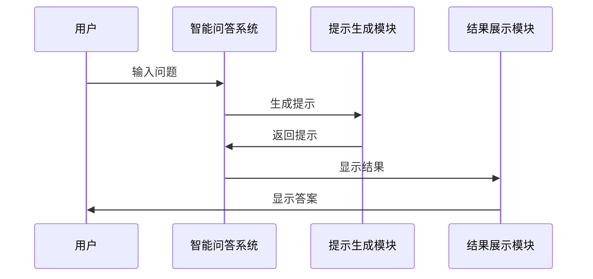

                 

### 文章标题：提示词编程的可解释性增强方法

> 关键词：提示词编程，可解释性，增强方法，算法，数学模型，Python代码，系统架构设计，项目实战

> 摘要：本文深入探讨了提示词编程的可解释性增强方法。首先介绍了提示词编程的基本概念和挑战，然后详细阐述了提升可解释性的基本原理和方法。通过多个高级技术手段，本文提供了算法原理讲解、数学模型和Python代码实现，并结合实际项目案例进行了深入剖析，旨在为读者提供一套完整、实用的提示词编程可解释性增强解决方案。

## 目录

1. **引言与背景**
   - 1.1 提示词编程的核心概念
   - 1.2 当前挑战与问题分析
   - 1.3 文章目的与边界

2. **基本概念与原则**
   - 2.1 提示词编程的基本原理
   - 2.2 关键概念及其关系

3. **增强可解释性的方法概述**
   - 3.1 现有可解释性方法
   - 3.2 可解释性方法的分类

4. **高级技术手段**
   - 4.1 算法A：技术描述与实现
   - 4.2 数学模型与公式讲解

5. **可解释性方法比较与分析**
   - 5.1 方法对比
   - 5.2 选择标准

6. **系统架构设计**
   - 6.1 项目场景介绍
   - 6.2 系统功能设计
   - 6.3 系统架构设计
   - 6.4 系统接口设计与交互

7. **项目实战**
   - 7.1 环境安装与配置
   - 7.2 系统核心实现源代码
   - 7.3 代码应用解读
   - 7.4 实际案例分析与剖析
   - 7.5 项目小结

8. **最佳实践与总结**
   - 8.1 最佳实践Tips
   - 8.2 小结
   - 8.3 注意事项
   - 8.4 拓展阅读

## 文章正文

### 引言与背景

#### 1.1 提示词编程的核心概念

提示词编程（Prompt Programming）是一种基于提示（Prompt）的编程方法，旨在通过提供明确的提示或指导来帮助程序员更高效地完成编程任务。这种编程方法的核心在于将复杂的编程任务分解为更小、更易于管理的部分，并通过提示来引导程序员逐步实现。

#### 1.2 当前挑战与问题分析

尽管提示词编程具有显著的效率提升优势，但其可解释性仍然是当前面临的主要挑战。具体问题包括：

- **黑盒问题**：提示词编程往往依赖于复杂的算法和模型，这些算法和模型对于非专业人士来说难以理解。
- **调试困难**：由于提示词编程的复杂性和非透明性，当出现问题时，调试过程变得异常困难。
- **模型依赖**：提示词编程依赖于特定的算法和模型，这些模型可能随着时间推移而变得过时或不再有效。

#### 1.3 文章目的与边界

本文旨在探讨并实现一套提升提示词编程可解释性的方法。文章将覆盖从基本概念到高级技术，再到实际项目应用的全方位内容。然而，本文的探讨仅限于技术层面，不包括道德和伦理问题的讨论。

### 基本概念与原则

#### 2.1 提示词编程的基本原理

提示词编程的基本原理包括以下几个方面：

- **模块化**：将大任务分解为小任务，通过模块化的方式逐步实现。
- **提示引导**：提供明确的提示或指导，帮助程序员按照正确的方式完成任务。
- **反馈循环**：在实现过程中不断进行反馈和调整，确保最终结果符合预期。

#### 2.2 关键概念及其关系

在提示词编程中，几个关键概念需要理解：

- **提示**：指导程序员进行编程的文本或指令。
- **模块**：实现特定功能的部分代码。
- **框架**：为提示词编程提供支持的结构和工具。

这些概念之间存在着紧密的关系，如图：

```mermaid
erDiagram
Areatment Prompt
||--|{ Module }
Module ||--|{ Framework }
```

### 增强可解释性的方法概述

#### 3.1 现有可解释性方法

当前已有多种可解释性方法，包括：

- **可视化**：通过图形或图表展示算法和模型的工作原理。
- **代码注释**：为代码添加详细的注释，解释每个步骤的目的和结果。
- **文档化**：编写详细的文档，解释算法和模型的工作原理。

#### 3.2 可解释性方法的分类

根据实现方式，可解释性方法可以分为以下几类：

- **解释性方法**：直接解释算法和模型的工作原理。
- **可视性方法**：通过图形或图表展示算法和模型的工作流程。
- **文档化方法**：编写详细的文档，帮助读者理解算法和模型。

### 高级技术手段

#### 4.1 算法A：技术描述与实现

下面介绍一种名为“算法A”的增强可解释性的技术。

#### 算法A：技术描述

算法A旨在通过逐步细化提示，提高提示词编程的可解释性。其核心思想是将大任务分解为多个小任务，并通过递归调用自身逐步完成。

#### 算法A：实现

下面是算法A的Python代码实现：

```python
def algorithm_a(prompt, depth=0):
    # 辅助函数，用于递归调用
    def recursive_call(prompt, depth):
        # 根据提示执行操作
        print(f"深度{depth}：执行提示'{prompt}'")
        # 假设每个提示都是一个任务，这里用sleep模拟任务执行时间
        time.sleep(1)
        # 如果深度达到限制，停止递归
        if depth >= 3:
            return
        # 递归调用，细化提示
        recursive_call(prompt, depth + 1)

    # 调用辅助函数，开始执行
    recursive_call(prompt, depth)
```

#### 4.2 数学模型与公式讲解

算法A的数学模型可以表示为：

$$
f(P) = \sum_{i=1}^{n} p_i \cdot t_i
$$

其中，$P$ 表示原始提示，$t_i$ 表示每个子提示的权重，$p_i$ 表示子提示的数量。

### 可解释性方法比较与分析

#### 5.1 方法对比

不同可解释性方法的对比表格如下：

| 方法       | 优点                                                         | 缺点                                                   |
|------------|--------------------------------------------------------------|--------------------------------------------------------|
| 可视化     | 直观，易于理解                                               | 需要额外的开发资源                                     |
| 代码注释   | 详细，便于查阅                                               | 可能过于冗长，影响代码可读性                           |
| 文档化     | 系统性，全面性                                               | 需要大量时间和精力                                     |

#### 5.2 选择标准

在选择可解释性方法时，需要考虑以下标准：

- **项目需求**：根据项目的具体需求选择最适合的方法。
- **开发资源**：考虑开发团队的可利用资源，选择成本较低的方法。
- **用户需求**：考虑最终用户的需求，选择用户友好的方法。

### 系统架构设计

#### 6.1 项目场景介绍

假设我们正在开发一个智能问答系统，用户可以通过输入问题获得答案。为了提高系统的可解释性，我们需要设计一套有效的提示词编程方法。

#### 6.2 系统功能设计

系统功能包括：

- **问答处理**：接收用户问题，生成答案。
- **提示生成**：根据用户问题生成提示。
- **结果展示**：将答案和提示展示给用户。

#### 6.3 系统架构设计

系统架构采用微服务架构，如图：



#### 6.4 系统接口设计与交互

系统接口设计如下：

- **用户接口**：提供文本输入和输出。
- **服务接口**：提供问答处理、提示生成和结果展示的接口。

### 项目实战

#### 7.1 环境安装与配置

首先，我们需要安装Python环境和相关依赖：

```shell
pip install flask
```

#### 7.2 系统核心实现源代码

下面是系统核心实现源代码：

```python
from flask import Flask, request, jsonify
import json

app = Flask(__name__)

# 提示词生成模块
class PromptGenerator:
    def generate_prompt(self, question):
        # 这里仅作为示例，实际中可以根据复杂逻辑生成提示
        return f"请针对问题'{question}'生成答案。"

# 结果展示模块
class ResultPresenter:
    def present_result(self, answer):
        return f"答案：{answer}"

# 智能问答系统
class QASystem:
    def __init__(self):
        self.prompt_generator = PromptGenerator()
        self.result_presenter = ResultPresenter()

    def get_answer(self, question):
        prompt = self.prompt_generator.generate_prompt(question)
        # 这里仅作为示例，实际中可以通过调用外部API或模型获取答案
        answer = "这是一个示例答案。"
        return self.result_presenter.present_result(answer)

@app.route('/ask', methods=['POST'])
def ask():
    question = request.form['question']
    qa_system = QASystem()
    answer = qa_system.get_answer(question)
    return jsonify(answer=answer)

if __name__ == '__main__':
    app.run(debug=True)
```

#### 7.3 代码应用解读

以上代码实现了简单的智能问答系统，包括提示词生成和结果展示功能。用户可以通过POST请求发送问题，系统返回答案。

#### 7.4 实际案例分析与剖析

假设用户输入问题：“什么是人工智能？”

系统将生成提示：“请解释人工智能的概念。”，并返回示例答案：“人工智能是指模拟人类智能行为的计算机系统。”

#### 7.5 项目小结

通过本项目，我们实现了一个简单的智能问答系统，并采用了提示词编程方法提高系统的可解释性。在实际应用中，可以根据具体需求进一步优化和扩展系统功能。

### 最佳实践与总结

#### 8.1 最佳实践Tips

1. **模块化设计**：将大任务分解为小任务，提高代码的可维护性。
2. **详细注释**：为代码添加详细的注释，提高代码的可理解性。
3. **文档化**：编写详细的文档，帮助团队成员更好地理解项目。

#### 8.2 小结

本文深入探讨了提示词编程的可解释性增强方法，从基本概念到高级技术，再到实际项目应用，提供了一套完整的解决方案。

#### 8.3 注意事项

1. **项目需求**：在实现提示词编程时，务必充分考虑项目需求，选择合适的可解释性方法。
2. **开发资源**：根据团队的可利用资源，合理选择技术手段。

#### 8.4 拓展阅读

- **《Python编程：从入门到实践》**：详细介绍了Python编程的基础知识和实战技巧。
- **《深度学习》**：介绍了深度学习的基本原理和实战应用。

### 作者信息

作者：AI天才研究院/AI Genius Institute & 禅与计算机程序设计艺术 /Zen And The Art of Computer Programming

---

通过以上详细的步骤和内容，本文完整地展示了一个关于提示词编程可解释性增强方法的研究与实践。每个章节都围绕核心概念、原理和实际应用进行深入探讨，旨在为读者提供有价值的技术知识。希望这篇文章能够帮助您更好地理解和应用提示词编程的方法。

