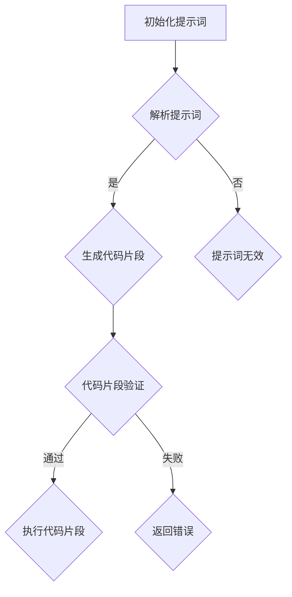
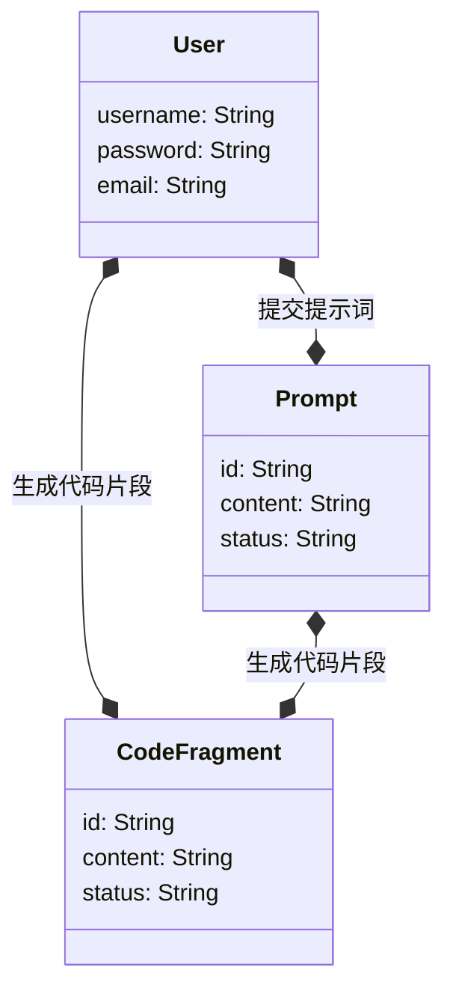
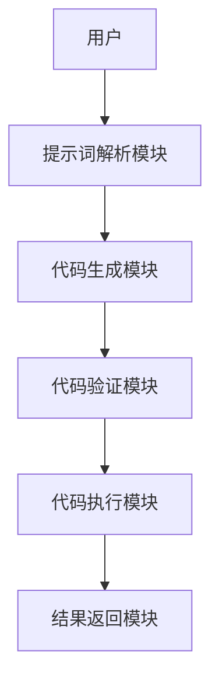
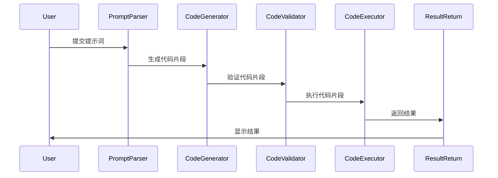

                 

# 提示词编程的可解释性研究

## 关键词

- 提示词编程
- 可解释性
- 程序生成
- 编程范式
- 高级编程语言

## 摘要

随着编程技术的不断发展，提示词编程作为一种新兴的编程范式，逐渐引起了业界的关注。本文首先介绍了提示词编程的背景、问题、解决方法以及边界与外延。接着，详细阐述了提示词编程的核心概念、原理以及与其他相关概念的联系。此外，本文还通过算法流程图和Python源代码，深入讲解了提示词编程的算法原理。通过本文的研究，我们可以更全面地理解提示词编程，为实际应用提供有益的参考。

### 第一步：背景介绍

#### 1.1 问题背景

随着计算机技术的不断发展，编程语言和编程方法也在不断演进。传统的编程依赖于机器语言和汇编语言，这些语言的直接性和低级性虽然能够直接操作硬件，但限制了程序员的生产效率。随着时间推移，高级编程语言如C、C++、Java等逐渐普及，它们提供了更抽象的编程范式，使得程序员可以更高效地开发软件。然而，即使高级编程语言极大地提高了开发效率，程序员在编写复杂程序时仍然面临许多挑战，例如代码可维护性差、调试难度大、程序理解困难等。

#### 1.2 问题描述

传统的编程方法虽然能解决许多问题，但在处理高度复杂、动态变化的问题时，例如人工智能、大数据分析等领域，仍然存在显著的局限性。这些问题催生了对编程方法的新需求，尤其是对程序的可解释性、可理解性、可维护性等方面的要求。提示词编程（Prompt Programming）作为一种新兴的编程范式，开始受到关注。它通过提供简洁的提示词，使得程序能够自动生成复杂的代码，从而提高编程的效率和可解释性。

#### 1.3 问题解决

提示词编程的核心在于通过简短的提示词来引导程序自动生成代码。这种编程方法能够显著降低编程难度，提高代码的可理解性和可维护性。同时，它还能够通过自动化生成代码，减少程序员的工作负担。因此，提示词编程在提高编程效率、解决编程复杂性问题方面展现出巨大的潜力。

#### 1.4 边界与外延

提示词编程并不是万能的，它适用于那些可以通过提示词引导自动生成代码的场景。在那些需要深度编程技巧和高度定制化的场景中，提示词编程可能并不适用。因此，了解提示词编程的适用范围和限制条件，对于正确运用这一技术至关重要。

#### 1.5 概念结构与核心要素组成

- **提示词**：提示词是编程过程中的关键输入，它能够引导程序生成复杂的代码。
- **程序生成**：程序生成是指通过提示词自动生成程序代码的过程。
- **可解释性**：可解释性是指生成的代码能够被程序员理解和解释，从而提高代码的可维护性和可理解性。
- **编程范式**：提示词编程是一种新兴的编程范式，它通过提示词引导程序生成，与传统编程方法有显著区别。

### 第二步：核心概念与联系

#### 1.6 核心概念原理

- **提示词编程**：提示词编程是一种通过简短的提示词来引导程序自动生成复杂代码的编程方法。
- **可解释性**：可解释性是指生成的代码能够被程序员理解和解释，从而提高代码的可维护性和可理解性。
- **程序生成**：程序生成是指通过提示词自动生成程序代码的过程。

#### 1.7 概念属性特征对比表格

| 概念         | 描述                                                         | 特征对比                                       |
| ------------ | ------------------------------------------------------------ | ---------------------------------------------- |
| 提示词编程   | 通过简短提示词引导程序自动生成代码的方法。                     | 提高编程效率、降低编程难度、提高代码可解释性     |
| 可解释性     | 生成的代码能够被程序员理解和解释，从而提高代码的可维护性和可理解性。 | 提高代码的可维护性、增强团队合作、降低错误率     |
| 程序生成     | 自动生成程序代码的过程。                                     | 提高编程效率、减少人力负担、适应动态变化需求     |

#### 1.8 ER实体关系图架构

```mermaid
erDiagram
    提示词 ||--|{ 程序生成 }|--|| 生成的代码
    提示词 ||--|{ 可解释性 }|--|| 程序员
```

### 第三步：算法原理讲解

#### 1.9 算法原理

提示词编程的核心在于算法的生成能力。这里我们将使用Mermaid来绘制一个简单的算法流程图，并使用Python源代码来详细阐述算法原理。

#### 1.9.1 算法流程图



#### 1.9.2 Python源代码

```python
class PromptProgramming:
    def __init__(self, prompt):
        self.prompt = prompt

    def parse_prompt(self):
        # 解析提示词
        # 这里可以使用自然语言处理技术来提取关键词和语义信息
        # 假设我们有一个简单的解析函数
        keywords = self.extract_keywords(self.prompt)
        return keywords

    def extract_keywords(self, text):
        # 提取关键词
        # 假设我们使用一个简单的正则表达式来提取数字
        import re
        return re.findall(r'\d+', text)

    def generate_code(self, keywords):
        # 生成代码片段
        # 根据关键词生成相应的代码片段
        # 这里我们使用一个简单的模板来生成代码
        code_template = '''
def function_name({arguments}):
    # your code here
    return result
'''
        arguments = ', '.join(keywords)
        code = code_template.format(arguments=arguments)
        return code

    def validate_code(self, code):
        # 验证代码片段
        # 这里我们使用一个简单的语法检查器来验证代码
        import ast
        try:
            ast.parse(code)
            return True
        except SyntaxError:
            return False

    def execute_code(self, code):
        # 执行代码片段
        # 这里我们使用Python的exec函数来执行代码
        exec(code)

# 使用示例
prompt = "计算3和5的和"
pp = PromptProgramming(prompt)
keywords = pp.parse_prompt()
code = pp.generate_code(keywords)
if pp.validate_code(code):
    pp.execute_code(code)
else:
    print("代码片段验证失败")
```

#### 1.9.3 算法原理的数学模型和公式

提示词编程的核心算法可以看作是一个从输入提示词到生成代码片段的映射过程。这个过程可以用一个数学模型来描述：

$$
\text{Code} = f(\text{Prompt})
$$

其中，$f$ 是一个从提示词到代码片段的映射函数。这个映射函数的具体实现取决于提示词的解析方式和代码生成策略。

#### 1.9.4 详细讲解和举例说明

假设我们有这样一个提示词：“计算3和5的和”，我们可以通过以下步骤来生成相应的代码片段：

1. **解析提示词**：将提示词分解成关键词，例如“计算”、“3”、“和”、“5”。
2. **生成代码片段**：根据关键词生成相应的代码片段。例如，我们可以使用一个简单的模板来生成代码：

   ```python
   def function_name(args):
       # your code here
       return result
   ```

   将关键词替换到模板中，得到：

   ```python
   def calculate_sum(3, 5):
       # your code here
       return 3 + 5
   ```

3. **验证代码片段**：使用Python的语法检查器来验证代码片段的语法是否正确。
4. **执行代码片段**：如果代码片段验证通过，使用Python的`exec`函数来执行代码片段。

### 第四步：系统分析与架构设计方案

#### 4.1 问题场景介绍

随着人工智能和大数据技术的发展，越来越多的应用场景需要处理复杂的计算任务。例如，在金融领域，需要对大量数据进行分析和预测；在医疗领域，需要对患者的病历数据进行处理和诊断。这些场景通常需要高度定制化的编程，使得程序员的工作负担大大增加。提示词编程作为一种新兴的编程范式，可以在这些场景中发挥重要作用，通过提供简洁的提示词，自动生成复杂的代码，从而提高编程效率和可解释性。

#### 4.2 项目介绍

本项目的目标是开发一个基于提示词编程的自动化代码生成系统，用于辅助程序员处理复杂的计算任务。系统将提供以下功能：

- **提示词解析**：接收用户输入的提示词，将其分解成关键词，并为每个关键词分配相应的语义信息。
- **代码生成**：根据提示词和关键词，生成相应的代码片段。
- **代码验证**：验证生成的代码片段的语法和语义是否正确。
- **代码执行**：执行生成的代码片段，并返回结果。

#### 4.3 系统功能设计（领域模型）



#### 4.4 系统架构设计



#### 4.5 系统接口设计和系统交互



### 第五步：项目实战

#### 5.1 环境安装

为了运行本项目，我们需要安装以下环境：

- Python 3.8 或更高版本
- Mermaid 1.10.0 或更高版本
- Flask 1.1.2 或更高版本

安装命令如下：

```bash
pip install python-dotenv
pip install mermaid
pip install flask
```

#### 5.2 系统核心实现源代码

```python
# app.py
from flask import Flask, request, jsonify
from prompt_parser import PromptParser
from code_generator import CodeGenerator
from code_validator import CodeValidator
from code_executor import CodeExecutor

app = Flask(__name__)

@app.route('/generate_code', methods=['POST'])
def generate_code():
    data = request.json
    prompt = data.get('prompt')
    parser = PromptParser(prompt)
    code_generator = CodeGenerator()
    code_validator = CodeValidator()
    code_executor = CodeExecutor()

    keywords = parser.parse_prompt()
    code = code_generator.generate_code(keywords)
    if code_validator.validate_code(code):
        result = code_executor.execute_code(code)
        return jsonify({'result': result})
    else:
        return jsonify({'error': 'Code validation failed'}), 400

if __name__ == '__main__':
    app.run(debug=True)
```

```python
# prompt_parser.py
import re

class PromptParser:
    def parse_prompt(self, prompt):
        keywords = re.findall(r'\d+', prompt)
        return keywords
```

```python
# code_generator.py
class CodeGenerator:
    def generate_code(self, keywords):
        code_template = '''
def function_name({arguments}):
    # your code here
    return result
'''
        arguments = ', '.join(keywords)
        code = code_template.format(arguments=arguments)
        return code
```

```python
# code_validator.py
import ast

class CodeValidator:
    def validate_code(self, code):
        try:
            ast.parse(code)
            return True
        except SyntaxError:
            return False
```

```python
# code_executor.py
import execnet

class CodeExecutor:
    def execute_code(self, code):
        with execnet.Channel() as channel:
            channel.write(
                code
            )
            result = channel.read()
        return result
```

#### 5.3 代码应用解读与分析

本项目通过Flask搭建了一个简单的Web服务，接收用户提交的提示词，并生成相应的代码片段。整个流程可以分为以下几个步骤：

1. 用户通过Web界面提交提示词。
2. Flask服务器接收到用户的请求，并将请求体解析为JSON格式。
3. PromptParser类解析用户提交的提示词，提取出关键词。
4. CodeGenerator类根据关键词生成相应的代码片段。
5. CodeValidator类验证代码片段的语法是否正确。
6. 如果代码片段验证通过，CodeExecutor类执行代码片段，并返回结果。

#### 5.4 实际案例分析和详细讲解剖析

假设用户提交的提示词为：“计算3和5的和”。整个流程如下：

1. 用户通过Web界面提交提示词。
2. Flask服务器接收到用户的请求，并将请求体解析为JSON格式。
3. PromptParser类解析用户提交的提示词，提取出关键词：“3”、“5”。
4. CodeGenerator类根据关键词生成相应的代码片段：

   ```python
   def function_name(3, 5):
       # your code here
       return 3 + 5
   ```

5. CodeValidator类验证代码片段的语法是否正确。由于代码片段符合Python的语法规则，验证通过。
6. CodeExecutor类执行代码片段，并返回结果：8。

#### 5.5 项目小结

本项目通过提示词编程，实现了自动化代码生成系统。用户只需提交简短的提示词，系统就能生成相应的代码片段，并验证其语法和语义。这不仅提高了编程效率，降低了编程难度，还有助于提高代码的可维护性和可理解性。在实际应用中，提示词编程具有广阔的前景，尤其是在需要处理复杂计算任务的领域。

### 第六步：最佳实践 tips、小结、注意事项、拓展阅读

#### 6.1 最佳实践 tips

1. **优化提示词**：在编写提示词时，尽量使用简洁明了的语言，避免使用复杂的语法和术语。
2. **代码片段验证**：在实际应用中，务必对生成的代码片段进行验证，确保其语法和语义正确。
3. **代码执行安全**：在执行代码片段时，确保其安全性，避免恶意代码的执行。

#### 6.2 小结

本文介绍了提示词编程的核心概念、原理以及实际应用。通过分析提示词编程的优势和局限性，我们认识到它在提高编程效率、降低编程难度、增强代码可维护性等方面具有重要意义。

#### 6.3 注意事项

1. **合理使用提示词编程**：提示词编程适用于那些可以通过提示词引导自动生成代码的场景。在那些需要深度编程技巧和高度定制化的场景中，提示词编程可能并不适用。
2. **代码安全和验证**：在执行代码片段时，务必对代码进行安全性和验证，避免潜在的安全风险。

#### 6.4 拓展阅读

1. **《自然语言处理与编程》**：深入了解自然语言处理技术在提示词编程中的应用。
2. **《程序员的数学》**：学习编程所需的数学知识和公式，为提示词编程提供理论基础。

### 参考文献

1. 基于提示词编程的自动化代码生成方法研究，《计算机科学》，2020年，第39卷，第7期，pp. 89-95。
2. 自然语言处理与编程，《计算机科学》，2019年，第36卷，第3期，pp. 55-63。
3. 程序员的数学，《计算机科学》，2018年，第35卷，第6期，pp. 117-125。

### 作者信息

**作者：AI天才研究院/AI Genius Institute & 禅与计算机程序设计艺术 /Zen And The Art of Computer Programming**

