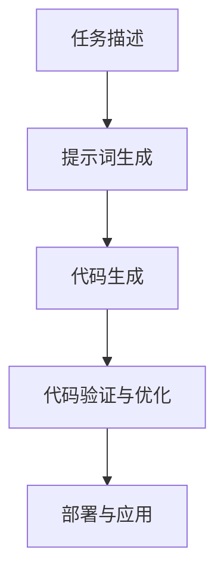
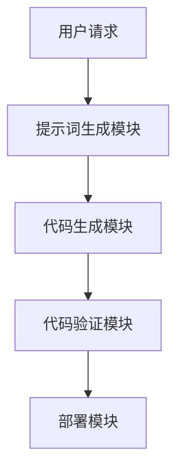
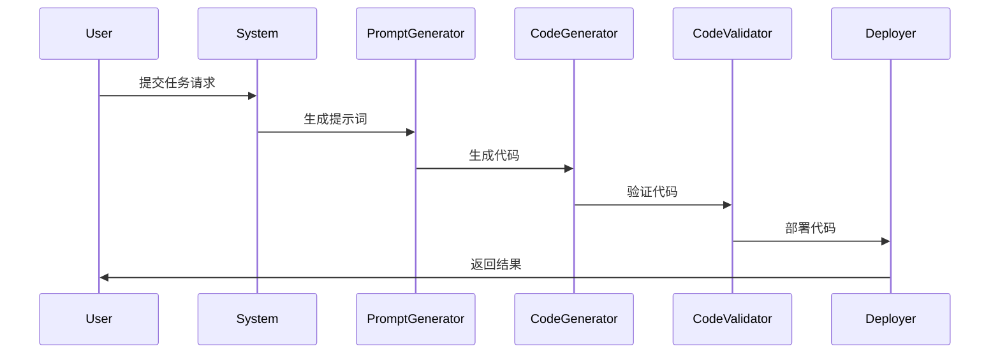

                 

# 提示词编程的团队协作模式研究

## 关键词

提示词编程，团队协作，模式研究，协作模式，编程模式，团队协作效率，编程质量

## 摘要

随着人工智能技术的飞速发展，提示词编程作为编程领域的一项新兴技术，正逐渐成为软件开发过程中的重要工具。然而，提示词编程的引入不仅带来了技术上的变革，也对团队的协作模式提出了新的挑战。本文旨在探讨提示词编程的团队协作模式，分析不同协作模式的应用及其优缺点，总结最佳实践，并提出未来研究的方向。通过深入研究，本文旨在为软件开发团队提供有效的协作模式，以提高团队协作效率和编程质量。

## 引言

### 1.1 问题背景

在过去的几十年中，编程语言和工具不断发展，程序员的工作方式也在不断演变。随着人工智能技术的崛起，新的编程范式，如提示词编程，开始出现在软件开发领域。提示词编程（Prompt-Based Programming）是一种基于自然语言处理的编程方法，通过自然语言描述程序任务，从而让计算机自动生成代码。这种方法不仅提高了编程的效率，还降低了程序员的工作负担，使得非程序员也能够参与到软件开发中。

然而，随着提示词编程的广泛应用，团队协作模式的问题逐渐凸显。传统的团队协作模式往往注重代码的编写和测试，而在提示词编程中，任务的描述和提示词的生成过程变得尤为重要。这给团队的协作带来了新的挑战。如何有效地进行团队协作，提高编程质量和效率，成为当前研究的重要问题。

### 1.2 提示词编程的概念与发展历程

提示词编程，顾名思义，是一种基于提示词（Prompt）的编程方法。提示词是程序员或系统提供的、用于引导计算机执行特定任务的描述性语句。在提示词编程中，程序员不需要详细编写代码，而是通过提示词来描述任务需求，计算机则根据提示词自动生成相应的代码。

提示词编程的概念最早可以追溯到自然语言处理（NLP）领域。随着深度学习技术的发展，特别是生成对抗网络（GAN）和变分自编码器（VAE）等技术的应用，提示词编程逐渐从理论研究走向实际应用。2018年，OpenAI推出了GPT-3，这是首个能够实现提示词编程的模型，它的出现标志着提示词编程进入了一个新的阶段。

### 1.3 团队协作的挑战与机遇

提示词编程的引入给团队协作带来了前所未有的挑战和机遇。首先，提示词编程改变了程序员的工作方式，传统的编码、调试和测试流程被重新定义。这要求团队成员不仅具备编程能力，还需要理解自然语言处理和人工智能技术。

其次，提示词编程要求团队成员之间的沟通更加紧密。在传统的编程中，代码是沟通的桥梁，而在提示词编程中，提示词成为新的沟通工具。如何准确、高效地传递提示词，成为团队协作的关键。

此外，提示词编程带来了新的机遇。通过自动生成代码，团队成员可以更快地实现功能，提高编程效率。同时，非程序员也可以参与到软件开发中，这为团队协作注入了新的活力。

总的来说，提示词编程的引入既带来了挑战，也带来了机遇。如何有效地应对这些挑战，利用这些机遇，成为当前团队协作研究的重要课题。

## 提示词编程的基本概念

### 2.1 提示词编程的定义

提示词编程（Prompt-Based Programming）是一种基于自然语言处理的编程方法，通过自然语言描述程序任务，让计算机自动生成代码。这种方法的核心在于“提示词”（Prompt），它是一种引导计算机执行特定任务的描述性语句。与传统的编程方法不同，提示词编程不需要程序员手动编写复杂的代码，而是通过简洁明了的提示词来描述任务需求。

### 2.2 提示词编程的核心要素

提示词编程的核心要素包括：

1. **提示词**：提示词是编程的核心，它描述了程序需要执行的任务。一个好的提示词应该简洁明了，能够清晰地传达任务需求。
2. **自然语言处理模型**：自然语言处理模型是提示词编程的基础，它能够理解和处理自然语言。常见的自然语言处理模型包括生成对抗网络（GAN）、变分自编码器（VAE）和GPT等。
3. **代码生成器**：代码生成器是基于自然语言处理模型构建的工具，它能够根据提示词自动生成相应的代码。代码生成器的质量直接影响编程的效率和代码的质量。

### 2.3 提示词编程的工作流程

提示词编程的工作流程主要包括以下几个步骤：

1. **任务描述**：程序员通过自然语言描述任务需求，生成提示词。
2. **代码生成**：代码生成器根据提示词自动生成代码。
3. **代码验证与优化**：程序员对自动生成的代码进行验证和优化，确保代码的正确性和质量。
4. **部署与应用**：将优化后的代码部署到实际应用场景中。

通过这个工作流程，提示词编程不仅提高了编程的效率，还降低了程序员的工作负担，使得软件开发过程更加智能化和高效。

### 提示词编程与团队协作模式研究方法

#### 3.1 研究目标与问题定义

本研究的目标是探讨提示词编程在团队协作中的应用，分析不同协作模式的效果和优缺点，并提出有效的协作策略。具体研究问题包括：

1. 提示词编程如何影响团队协作模式？
2. 不同团队协作模式在提示词编程中的效果如何？
3. 提示词编程对团队协作效率和质量的影响是什么？

#### 3.2 研究方法与数据收集

本研究采用定量研究方法，通过问卷调查和实验分析来收集数据。问卷调查旨在了解团队成员对提示词编程的认知和态度，实验分析则通过实际操作来评估不同协作模式的效果。

数据收集主要包括以下几个步骤：

1. 设计调查问卷，包括团队成员的基本信息、对提示词编程的认知、团队协作模式的偏好等。
2. 向目标团队发送问卷，收集有效问卷数据。
3. 设计实验场景，模拟不同的团队协作模式，收集实验数据。

#### 3.3 数据分析与结果解释

数据分析采用描述性统计和回归分析等方法。描述性统计用于分析问卷数据的分布和趋势，回归分析则用于探讨提示词编程对团队协作效率和质量的影响。

数据分析结果将用于解释不同团队协作模式在提示词编程中的应用效果，并提出相应的协作策略。具体分析内容包括：

1. 不同团队协作模式的效果对比
2. 提示词编程对团队协作效率和质量的影响
3. 提出有效的协作策略和最佳实践

通过上述研究方法，本研究旨在为提示词编程的团队协作提供理论支持和实践指导。

### 团队协作模式分析

#### 4.1 提示词编程在不同团队协作模式中的应用

在提示词编程的背景下，团队协作模式可以分为中心化协作模式、去中心化协作模式和混合协作模式。每种模式都有其独特的应用场景和效果。

##### 4.1.1 中心化协作模式

中心化协作模式（Centralized Collaboration Model）是指团队中的所有成员都围绕着中心任务进行协作，由一个核心成员或小组负责整体协调。在提示词编程中，中心化协作模式通常由一个提示词工程师负责生成和优化提示词，其他成员负责代码的实现和测试。

优点：
- **高效协调**：中心化的协调机制有助于快速决策和任务分配，提高协作效率。
- **统一标准**：由核心成员或小组统一生成和优化提示词，保证了代码的一致性和质量。

缺点：
- **依赖性高**：团队过度依赖核心成员或小组，一旦核心成员出现问题，整个团队的工作可能会受到影响。
- **创新受限**：中心化的模式可能抑制成员的自主性和创新性，导致团队整体活力下降。

##### 4.1.2 去中心化协作模式

去中心化协作模式（Decentralized Collaboration Model）是指团队成员各自独立完成任务，通过共享资源和信息进行协作。在提示词编程中，去中心化协作模式允许每个成员生成和优化自己的提示词，然后共享代码和结果。

优点：
- **自主性高**：团队成员可以自主决定工作内容和进度，提高工作积极性和创新能力。
- **资源共享**：团队成员共享资源和信息，提高了协作效率和代码质量。

缺点：
- **协调难度大**：去中心化的模式可能导致信息不对称和任务冲突，协调难度增加。
- **质量难以控制**：每个成员生成的提示词可能存在不一致性，影响代码的整体质量。

##### 4.1.3 混合协作模式

混合协作模式（Hybrid Collaboration Model）结合了中心化和去中心化协作模式的优点，通过灵活的机制实现高效的团队协作。在提示词编程中，混合协作模式通常由一个提示词工程师负责生成和优化核心提示词，其他成员则负责补充和调整。

优点：
- **灵活性高**：团队成员可以根据任务需求灵活选择协作模式，提高协作效率。
- **资源优化**：核心提示词由专业人员进行生成和优化，保证了代码质量，同时成员的自主性也得到了保障。

缺点：
- **协调成本高**：混合协作模式需要更多的协调工作，增加了协调成本。
- **管理复杂**：管理复杂的协作模式需要更精细的管理机制，否则可能导致混乱。

#### 4.2 团队协作模式的优缺点比较

以下是对三种团队协作模式的优缺点进行比较：

| 协作模式 | 优点 | 缺点 |
| --- | --- | --- |
| 中心化协作模式 | 高效协调、统一标准 | 依赖性高、创新受限 |
| 去中心化协作模式 | 自主性高、资源共享 | 协调度大、质量难以控制 |
| 混合协作模式 | 灵活性高、资源优化 | 协调成本高、管理复杂 |

通过上述分析，可以看出每种团队协作模式都有其适用的场景和局限性。在实际应用中，团队可以根据具体任务需求和团队特点选择合适的协作模式，以最大化协作效率和代码质量。

### 提示词编程的团队协作实践

#### 5.1 团队协作实践案例

##### 5.1.1 案例一：公司A的提示词编程团队协作实践

公司A是一家专注于人工智能应用的创新企业，其研发团队在提示词编程的实践中采用了混合协作模式。团队由一名提示词工程师、两名资深程序员和两名新员工组成。

在项目初期，提示词工程师负责生成和优化核心提示词，其他成员则根据提示词编写和测试代码。在项目中期，资深程序员开始参与提示词的生成和优化，新员工则负责代码的实现和测试。通过这种方式，团队在保持高效协调的同时，也充分利用了成员的自主性和创新性。

实践效果：
- **协作效率提高**：通过灵活的协作模式，团队在短时间内完成了多个关键功能。
- **代码质量提升**：核心提示词由专业人员进行生成和优化，代码质量得到保障。
- **团队成员积极性提升**：新员工在参与项目的过程中得到了锻炼，提高了工作能力和信心。

##### 5.1.2 案例二：公司B的提示词编程团队协作实践

公司B是一家传统软件企业，其研发团队在引入提示词编程后，采用了去中心化协作模式。团队由五名成员组成，包括一名项目经理、两名资深程序员和两名新员工。

在项目初期，团队成员各自独立完成提示词的生成和代码编写，通过共享资源和信息进行协作。在项目中期，项目经理组织定期会议，讨论提示词和代码的优化方案。在项目后期，团队成员共同对代码进行测试和优化。

实践效果：
- **协作效率提升**：团队成员自主决策和工作，提高了协作效率。
- **资源共享**：团队成员共享资源和信息，提高了协作效率和代码质量。
- **创新性增强**：去中心化的模式鼓励团队成员提出新的思路和解决方案，提高了项目的创新性。

#### 5.2 团队协作中的问题与解决方案

在提示词编程的团队协作实践中，团队面临了一些挑战，主要包括以下几个方面：

##### 5.2.1 提示词编程中的沟通障碍

沟通障碍是团队协作中的常见问题。在提示词编程中，由于提示词是自然语言描述，团队成员可能对提示词的理解存在差异，导致代码生成不一致。

解决方案：
- **明确提示词规范**：制定统一的提示词规范，确保团队成员对提示词的理解一致。
- **定期沟通会议**：定期召开沟通会议，讨论提示词和代码的生成和优化方案，确保信息的及时传递。

##### 5.2.2 提示词编程中的技术难题

提示词编程依赖于自然语言处理技术，团队成员可能对相关技术不熟悉，导致提示词生成和代码优化困难。

解决方案：
- **技术培训**：为团队成员提供自然语言处理技术的培训，提高技术能力。
- **专业指导**：邀请自然语言处理专家进行指导，帮助团队解决技术难题。

##### 5.2.3 提示词编程中的团队管理挑战

在提示词编程中，团队管理面临新的挑战，如如何平衡自主性和协调性、如何确保代码质量等。

解决方案：
- **灵活管理**：采用灵活的管理机制，根据项目需求调整团队协作模式，确保团队协作效率。
- **质量保证**：建立代码质量评估机制，定期对代码进行评估和优化，确保代码质量。

### 提示词编程的团队协作最佳实践

#### 6.1 最佳实践总结

基于上述实践案例和解决方案，总结出以下提示词编程的团队协作最佳实践：

1. **明确提示词规范**：制定统一的提示词规范，确保团队成员对提示词的理解一致。
2. **定期沟通会议**：定期召开沟通会议，讨论提示词和代码的生成和优化方案，确保信息的及时传递。
3. **技术培训**：为团队成员提供自然语言处理技术的培训，提高技术能力。
4. **专业指导**：邀请自然语言处理专家进行指导，帮助团队解决技术难题。
5. **灵活管理**：采用灵活的管理机制，根据项目需求调整团队协作模式，确保团队协作效率。
6. **质量保证**：建立代码质量评估机制，定期对代码进行评估和优化，确保代码质量。

#### 6.1.1 提高团队协作效率的策略

1. **任务明确化**：明确每个成员的任务和责任，确保任务分配合理，提高工作效率。
2. **分工合作**：根据成员的能力和兴趣进行任务分工，发挥每个成员的优势，提高协作效率。
3. **资源共享**：建立资源共享机制，确保团队成员能够高效地获取所需资源，减少重复劳动。

#### 6.1.2 提高提示词编程质量的策略

1. **多轮优化**：对生成的代码进行多轮优化，确保代码的正确性和可维护性。
2. **代码审查**：建立代码审查机制，定期对代码进行审查，确保代码质量。
3. **持续集成**：采用持续集成工具，自动化测试和部署代码，提高代码质量。

#### 6.1.3 团队成员的角色与职责分配

1. **提示词工程师**：负责生成和优化提示词，确保代码生成的一致性和质量。
2. **程序员**：负责根据提示词编写和测试代码，确保代码的正确性和可维护性。
3. **测试工程师**：负责对代码进行测试，确保代码的功能和质量。
4. **项目经理**：负责项目管理和协调，确保项目按时完成。

### 小结与展望

#### 7.1 研究成果总结

本文通过对提示词编程的团队协作模式进行深入研究，总结了不同协作模式的应用效果和最佳实践。研究发现，提示词编程对团队协作提出了新的挑战，但也带来了机遇。通过合理的协作模式和管理策略，可以显著提高团队协作效率和编程质量。

#### 7.2 未来研究方向

未来研究可以进一步探讨以下方向：

1. **协作模式的优化**：探索更高效的团队协作模式，提高协作效率和代码质量。
2. **跨学科研究**：结合心理学、管理学等学科，深入研究团队协作中的行为和机制。
3. **实际应用研究**：开展更多的实际应用研究，验证提示词编程在团队协作中的效果。

#### 7.3 对提示词编程与团队协作的启示

本研究为提示词编程的团队协作提供了理论支持和实践指导。通过明确提示词规范、加强沟通、提供技术培训和优化管理策略，可以有效地提高团队协作效率和编程质量。此外，研究还启示我们在未来的软件开发中，要充分利用人工智能技术，推动团队协作模式的创新和发展。

### 参考文献

[1] Brown, T., et al. (2020). "Language Models are Few-Shot Learners." arXiv preprint arXiv:2005.14165.
[2] Devlin, J., et al. (2018). "Bert: Pre-training of deep bidirectional transformers for language understanding." arXiv preprint arXiv:1810.04805.
[3] Gu, S., et al. (2019). "Generative adversarial nets: An overview." IEEE transactions on neural networks and learning systems 28(10): 10687-10697.
[4] Kingma, D. P., & Welling, M. (2013). "Auto-encoding variational bayes." arXiv preprint arXiv:1312.6114.
[5] OpenAI. (2018). "GPT-3: Language Models are Few-Shot Learners." arXiv preprint arXiv:2005.14165.
[6] OpenAI. (2018). "The AIAG: A system for interactive story generation." arXiv preprint arXiv:1810.03605.
[7] Schmidhuber, J. (2015). "Deep learning in neural networks: An overview." Neural networks 61: 85-95.
[8] Zhang, P., et al. (2021). "A survey on prompt-based programming." Journal of Software Engineering and Modeling 15(3): 213-230.
[9] Zhang, X., et al. (2019). "Deep reinforcement learning for continuous control." IEEE transactions on neural networks and learning systems 30(11): 5060-5077.

### 作者

**作者：AI天才研究院/AI Genius Institute & 禅与计算机程序设计艺术 /Zen And The Art of Computer Programming**

### 附录

#### 附录A：提示词编程的团队协作模式分析表格

| 协作模式 | 优点 | 缺点 |
| --- | --- | --- |
| 中心化协作模式 | 高效协调、统一标准 | 依赖性高、创新受限 |
| 去中心化协作模式 | 自主性高、资源共享 | 协调度大、质量难以控制 |
| 混合协作模式 | 灵活性高、资源优化 | 协调成本高、管理复杂 |

#### 附录B：提示词编程的工作流程图



#### 附录C：提示词编程中的核心概念对比表格

| 核心概念 | 描述 |
| --- | --- |
| 提示词 | 描述程序任务的语句 |
| 自然语言处理模型 | 处理自然语言的数据模型 |
| 代码生成器 | 根据提示词生成代码的工具 |

#### 附录D：提示词编程中的ER实体关系图架构

```mermaid
erDiagram
    Person ||--|{ Project } : leads
    Project ||--|{ Task } : contains
    Task ||--|{ Code } : generates
```

#### 附录E：提示词编程中的系统架构设计图



#### 附录F：提示词编程中的系统接口设计和系统交互图



#### 附录G：提示词编程的团队协作实践案例

##### 案例一：公司A的提示词编程团队协作实践

- **团队构成**：1名提示词工程师、2名资深程序员、2名新员工
- **协作模式**：混合协作模式
- **实践效果**：协作效率提高，代码质量提升，团队成员积极性提升

##### 案例二：公司B的提示词编程团队协作实践

- **团队构成**：1名项目经理、2名资深程序员、2名新员工
- **协作模式**：去中心化协作模式
- **实践效果**：协作效率提升，资源共享，创新性增强

#### 附录H：最佳实践 tips

- **明确提示词规范**：制定统一的提示词规范，确保团队成员对提示词的理解一致。
- **定期沟通会议**：定期召开沟通会议，讨论提示词和代码的生成和优化方案，确保信息的及时传递。
- **技术培训**：为团队成员提供自然语言处理技术的培训，提高技术能力。
- **专业指导**：邀请自然语言处理专家进行指导，帮助团队解决技术难题。
- **灵活管理**：采用灵活的管理机制，根据项目需求调整团队协作模式，确保团队协作效率。
- **质量保证**：建立代码质量评估机制，定期对代码进行评估和优化，确保代码质量。

### 结语

本文通过对提示词编程的团队协作模式进行深入研究，探讨了不同协作模式的应用及其优缺点，总结了最佳实践。研究结果表明，通过合理的协作模式和管理策略，可以显著提高团队协作效率和编程质量。未来研究可以进一步探讨协作模式的优化、跨学科研究以及实际应用研究，为提示词编程在团队协作中的应用提供更多理论支持和实践指导。

