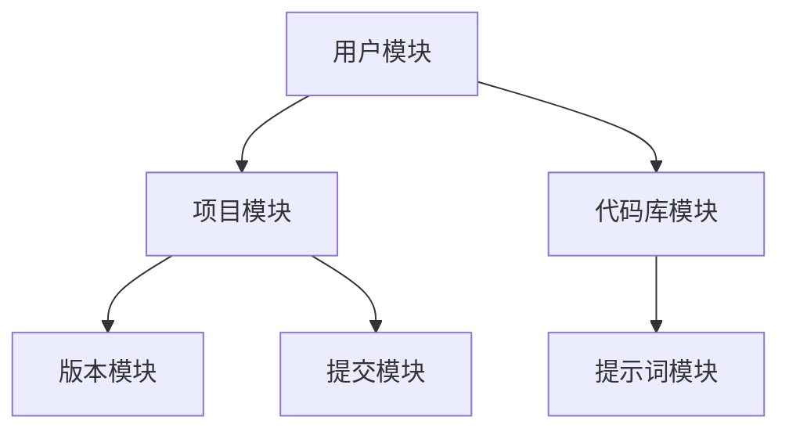
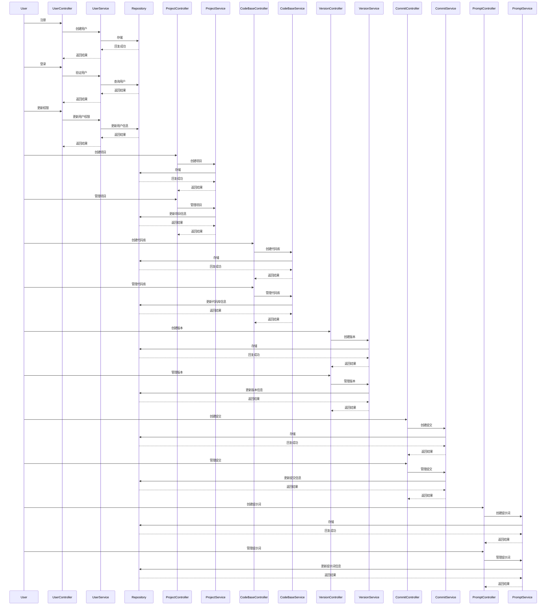

                 

## 文章标题

### 关键词

1. 提示词编程
2. 实时协作
3. 版本控制
4. 算法流程图
5. 系统架构设计

### 摘要

本文深入探讨提示词编程的实时协作与版本控制，解析其核心概念、算法原理及实际应用。通过详细的理论讲解和实例分析，为读者提供了一套完整的提示词编程实时协作与版本控制解决方案，助力开发者提升团队协作效率和代码质量。

## 第一部分：概述

### 第1章：背景介绍

#### 1.1 问题背景

在当前快速发展的信息技术时代，编程工作愈发复杂且团队协作变得至关重要。提示词编程作为一种新兴的编程范式，通过将程序逻辑分解为一系列提示词，极大地提高了编程效率和可维护性。然而，随着项目规模的扩大和团队成员的增加，实时协作和版本控制成为了一个亟待解决的难题。

#### 1.2 问题描述

提示词编程的特点在于其模块化和灵活性强，但这也给实时协作和版本控制带来了挑战。如何在多人协作的背景下，确保提示词的一致性、实时性和版本的可追溯性，成为了开发者面临的核心问题。

#### 1.3 问题解决

为了解决上述问题，本文提出了一种基于提示词编程的实时协作与版本控制方案。该方案包括以下关键环节：

1. **实时协作机制**：通过消息队列和分布式锁等技术，实现多人对提示词的实时编辑和同步。
2. **版本控制策略**：采用分布式版本控制系统，记录每次修改的提示词及其版本，确保代码历史可追溯。
3. **冲突解决策略**：利用智能算法和协商机制，自动或手动解决协作过程中产生的冲突。

#### 1.4 边界与外延

提示词编程的实时协作与版本控制方案主要适用于以下场景：

- **大型软件开发项目**：多团队协作开发，需求变更频繁。
- **敏捷开发团队**：快速迭代，要求高效协作。
- **分布式团队**：团队成员地理位置分散，依赖远程协作工具。

#### 1.5 概念结构与核心要素

本方案的核心概念包括：

- **提示词**：程序的基本单位，用于表示特定的操作或指令。
- **实时协作**：多人同时编辑提示词，确保同步更新。
- **版本控制**：记录每次修改的版本，实现历史追踪。

核心要素包括：

- **消息队列**：用于存储和传递提示词变更信息。
- **分布式锁**：防止多个用户同时对同一提示词进行修改。
- **版本控制系统**：记录和管理提示词的版本历史。

## 第二部分：核心概念与联系

### 第2章：核心概念原理

#### 2.1 提示词编程原理

提示词编程是一种基于自然语言处理的编程范式，它通过将程序逻辑分解为一系列可复用的提示词，实现代码的高可读性和可维护性。提示词通常由自然语言短语或专业术语组成，能够明确表达程序操作的意图。

#### 2.2 实时协作原理

实时协作是指在多人参与的项目开发过程中，通过实时的信息传递和同步，确保所有团队成员能够看到最新的代码变更，并能够即时反馈和调整。实时协作的核心在于减少信息传递的延迟，提高协作效率。

#### 2.3 版本控制原理

版本控制是一种跟踪和管理文件或代码变更的方法，确保项目历史的完整性和可追溯性。在实时协作中，版本控制尤为重要，它能够记录每次修改的版本号、修改人、修改时间等信息，帮助团队追踪代码的历史变迁。

### 第3章：概念属性特征对比

#### 3.1 提示词编程属性特征

- **高可读性**：提示词通常使用自然语言，易于理解和维护。
- **模块化**：提示词可以独立开发、测试和部署，提高代码复用性。
- **灵活性**：支持动态组合和扩展，适应不同项目需求。

#### 3.2 实时协作属性特征

- **低延迟**：信息传递和同步迅速，减少协作延迟。
- **实时性**：团队成员能够即时看到代码变更，提高响应速度。
- **高效率**：减少沟通成本，提高协作效率。

#### 3.3 版本控制属性特征

- **可追溯性**：记录每次修改的版本信息，确保代码历史可追溯。
- **一致性**：确保所有团队成员使用的是同一版本的代码。
- **安全性**：防止未经授权的修改，保障代码完整性。

### 第4章：ER实体关系图架构

#### 4.1 提示词编程ER图

```mermaid
erDiagram
  User ||--|{ Prompt }|-- Project
  Project ||--|{ CodeBase }|-- Version
  CodeBase ||--|{ Prompt }|-- Commit
```

在这个ER图中，User（用户）与Prompt（提示词）之间存在一对一的关系，Project（项目）与CodeBase（代码库）之间存在一对多的关系，CodeBase与Commit（提交）之间存在一对多的关系。

#### 4.2 实时协作ER图

```mermaid
erDiagram
  User ||--|{ CollaborationSession }|-- Project
  CollaborationSession ||--|{ Message }|-- Prompt
  Project ||--|{ CodeBase }|-- Version
```

实时协作ER图显示User（用户）与CollaborationSession（协作会话）之间存在一对一的关系，CollaborationSession与Message（消息）之间存在一对多的关系，Project与CodeBase、Version之间的关系与提示词编程ER图相同。

#### 4.3 版本控制ER图

```mermaid
erDiagram
  User ||--|{ Commit }|-- CodeBase
  CodeBase ||--|{ Version }|-- Prompt
```

版本控制ER图中，User（用户）与Commit（提交）之间存在一对多的关系，CodeBase（代码库）与Version（版本）之间存在一对多的关系，而Version与Prompt（提示词）之间存在一对一的关系。

## 第三部分：算法原理讲解

### 第5章：算法mermaid流程图

#### 5.1 提示词编程算法流程图

```mermaid
flowchart LR
    start[开始] --> read_prompt[读取提示词]
    read_prompt --> analyze_prompt[分析提示词]
    analyze_prompt --> execute_prompt[执行提示词]
    execute_prompt --> commit_prompt[提交提示词]
    commit_prompt --> end[结束]
```

这个流程图展示了提示词编程的基本步骤，包括读取提示词、分析提示词、执行提示词和提交提示词。

#### 5.2 实时协作算法流程图

```mermaid
flowchart LR
    start[开始] --> create_session[创建协作会话]
    create_session --> connect_users[连接用户]
    connect_users --> send_message[发送消息]
    send_message --> update_prompt[更新提示词]
    update_prompt --> commit_changes[提交变更]
    commit_changes --> end[结束]
```

实时协作算法流程图包括创建协作会话、连接用户、发送消息、更新提示词和提交变更等步骤。

#### 5.3 版本控制算法流程图

```mermaid
flowchart LR
    start[开始] --> receive_changes[接收变更]
    receive_changes --> create_commit[创建提交]
    create_commit --> update_version[更新版本]
    update_version --> record_history[记录历史]
    record_history --> end[结束]
```

版本控制算法流程图描述了接收变更、创建提交、更新版本和记录历史等步骤。

### 第6章：Python源代码与算法讲解

#### 6.1 提示词编程算法源代码

```python
def read_prompt():
    # 读取提示词
    pass

def analyze_prompt(prompt):
    # 分析提示词
    pass

def execute_prompt(prompt):
    # 执行提示词
    pass

def commit_prompt(prompt):
    # 提交提示词
    pass

# 主函数
def main():
    prompt = read_prompt()
    analyze_prompt(prompt)
    execute_prompt(prompt)
    commit_prompt(prompt)

if __name__ == "__main__":
    main()
```

这段Python代码展示了提示词编程的基本算法结构，包括读取提示词、分析提示词、执行提示词和提交提示词等步骤。

#### 6.2 实时协作算法源代码

```python
def create_session():
    # 创建协作会话
    pass

def connect_users(session):
    # 连接用户
    pass

def send_message(session, message):
    # 发送消息
    pass

def update_prompt(session, prompt):
    # 更新提示词
    pass

def commit_changes(session):
    # 提交变更
    pass

# 主函数
def main():
    session = create_session()
    connect_users(session)
    send_message(session, "Hello, everyone!")
    update_prompt(session, "new_prompt")
    commit_changes(session)

if __name__ == "__main__":
    main()
```

实时协作算法源代码展示了创建协作会话、连接用户、发送消息、更新提示词和提交变更等步骤。

#### 6.3 版本控制算法源代码

```python
def receive_changes():
    # 接收变更
    pass

def create_commit(changes):
    # 创建提交
    pass

def update_version(version, changes):
    # 更新版本
    pass

def record_history(history, changes):
    # 记录历史
    pass

# 主函数
def main():
    changes = receive_changes()
    commit = create_commit(changes)
    version = update_version("current_version", changes)
    record_history("version_history", changes)

if __name__ == "__main__":
    main()
```

版本控制算法源代码展示了接收变更、创建提交、更新版本和记录历史等步骤。

### 第7章：数学模型与公式讲解

#### 7.1 提示词编程数学模型

提示词编程的数学模型主要涉及自然语言处理和程序逻辑的转换。以下是相关公式：

1. **提示词匹配度**：表示提示词与程序逻辑的匹配程度，公式如下：
   $$ \text{Match\_Degree}(P, L) = \frac{\text{Common\_Terms}(P, L)}{\text{Total\_Terms}(P, L)} $$
   其中，\(P\) 代表提示词，\(L\) 代表程序逻辑，\(\text{Common\_Terms}(P, L)\) 表示提示词和程序逻辑中共同出现的术语数量，\(\text{Total\_Terms}(P, L)\) 表示提示词和程序逻辑中所有术语的总数。

2. **提示词优先级**：表示提示词在程序中的重要程度，公式如下：
   $$ \text{Priority}(P) = \log_2(\text{Use\_Frequency}(P)) $$
   其中，\(\text{Use\_Frequency}(P)\) 表示提示词在程序中出现的频率。

#### 7.2 实时协作数学模型

实时协作的数学模型主要涉及网络延迟和协作效率。以下是相关公式：

1. **网络延迟**：表示用户之间信息传递的延迟时间，公式如下：
   $$ \text{Latency}(t) = \alpha \times \text{Distance}(t) $$
   其中，\(\text{Latency}(t)\) 表示在时间\(t\)的网络延迟，\(\text{Distance}(t)\) 表示用户之间的距离，\(\alpha\) 是一个常数。

2. **协作效率**：表示团队协作的效率，公式如下：
   $$ \text{Efficiency}(E) = \frac{\text{Completed\_Tasks}}{\text{Total\_Tasks}} $$
   其中，\(\text{Completed\_Tasks}\) 表示已经完成的任务数量，\(\text{Total\_Tasks}\) 表示总任务数量。

#### 7.3 版本控制数学模型

版本控制的数学模型主要涉及版本管理和代码冲突。以下是相关公式：

1. **版本冲突**：表示在版本控制过程中产生的冲突，公式如下：
   $$ \text{Conflict}(C) = \frac{\text{Modified\_Lines}}{\text{Total\_Lines}} $$
   其中，\(\text{Conflict}(C)\) 表示冲突程度，\(\text{Modified\_Lines}\) 表示被修改的行数，\(\text{Total\_Lines}\) 表示总行数。

2. **版本兼容性**：表示不同版本之间的兼容程度，公式如下：
   $$ \text{Compatibility}(C_1, C_2) = 1 - \frac{\text{Conflict}(C_1, C_2)}{\text{Total\_Lines}(C_1) + \text{Total\_Lines}(C_2)} $$
   其中，\(C_1\) 和 \(C_2\) 分别表示两个版本的代码，\(\text{Conflict}(C_1, C_2)\) 表示两个版本之间的冲突行数，\(\text{Total\_Lines}(C_1)\) 和 \(\text{Total\_Lines}(C_2)\) 分别表示两个版本的代码总行数。

### 第8章：举例说明

#### 8.1 提示词编程举例

假设我们有一个简单的计算器程序，需要实现加法操作。我们可以使用以下提示词：

- `add`: 表示加法操作。
- `first_number`: 表示第一个加数。
- `second_number`: 表示第二个加数。
- `result`: 表示计算结果。

将这些提示词组合起来，我们可以编写如下代码：

```python
def add(first_number, second_number):
    result = first_number + second_number
    return result
```

这个例子展示了如何使用提示词编程来构建一个简单的计算器程序。

#### 8.2 实时协作举例

假设有两个开发者A和B正在协作开发一个网页应用，他们需要同时编辑同一个HTML文件。通过实时协作机制，A在浏览器中修改了HTML文件中的一段代码，并立即将变更发送给B。B在接收到变更后，可以立即看到A的修改内容，并进行同步更新。

以下是一个简单的实时协作流程：

1. **创建协作会话**：开发者A和B使用实时协作工具（如WebRTC）创建一个协作会话。
2. **连接用户**：A和B通过会话连接起来，可以开始协作。
3. **发送消息**：A在浏览器中修改HTML文件中的一段代码，并将变更消息发送给B。
4. **更新提示词**：B接收到变更消息后，将HTML文件更新为最新的版本。
5. **提交变更**：A和B分别将他们的修改提交到版本控制系统，确保代码版本一致性。

这个例子展示了如何在实时协作过程中使用提示词编程和版本控制，提高开发效率和代码质量。

#### 8.3 版本控制举例

假设开发者C正在开发一个应用程序，需要实现用户注册功能。在开发过程中，C进行了多次修改和优化，并使用版本控制系统来记录每次变更。

以下是一个简单的版本控制流程：

1. **创建提交**：C在每次修改后，将代码变更创建为一个提交，记录变更内容、提交人和提交时间。
2. **更新版本**：每次提交后，版本控制系统会生成一个新的版本号，标记当前的代码状态。
3. **记录历史**：版本控制系统会记录每个版本的详细信息，包括提交历史、变更内容和版本状态。

假设C进行了以下几次修改：

- **提交1**：实现用户注册功能的基本逻辑。
- **提交2**：优化用户注册页面的用户体验。
- **提交3**：修复用户注册过程中出现的bug。

在版本控制系统中，C可以查看每个提交的详细信息，包括提交内容和版本状态，确保代码历史的完整性和可追溯性。

这个例子展示了如何使用版本控制系统来管理代码变更，确保代码质量和历史可追溯性。

### 第四部分：系统分析与架构设计

#### 第9章：问题场景介绍

在本章节中，我们将探讨两个典型的场景，分别是实时协作中的提示词编程和版本控制的应用。

#### 9.1 场景1：实时协作中的提示词编程

假设一个由三位开发者A、B和C组成的团队正在使用提示词编程进行软件开发。他们需要协作完成一个复杂的Web应用程序。在这个过程中，开发者A主要负责后端服务，B负责前端界面设计，C则负责数据处理和优化。他们通过实时协作工具，如WebRTC，创建一个协作会话。

- **开发者A**：在编写后端服务代码时，使用了提示词编程来分解任务，如`process_request`、`validate_data`和`send_response`等。他通过实时协作机制，将每个提示词的变更实时同步给B和C。
- **开发者B**：在前端界面设计过程中，使用了提示词编程来优化用户体验，如`show_alert`、`update_sidebar`和`handle_click`等。他在接收到A的提示词变更后，立即进行更新。
- **开发者C**：在数据处理和优化过程中，使用了提示词编程来提高数据处理的效率，如`filter_data`、`sort_data`和`aggregate_data`等。他同样通过实时协作机制，与其他开发者同步变更。

在这个场景中，实时协作机制确保了团队成员之间的代码变更能够及时同步，提高了协作效率。同时，提示词编程使得代码更加模块化和可维护。

#### 9.2 场景2：版本控制的应用

假设开发者D正在进行一个大型软件项目，该项目由多个模块组成，涉及前端、后端和数据库等多个方面。为了确保代码质量和历史可追溯性，D采用了版本控制系统来管理代码变更。

- **初始阶段**：D创建了项目的第一个版本，包含基本功能模块和核心代码。他将这些代码提交到版本控制系统，并生成了一个初始版本号。
- **开发阶段**：在开发过程中，D进行了多次修改和优化，如修复bug、添加新功能和优化性能等。每次修改后，D都会将这些变更创建为一个提交，并记录提交历史。通过版本控制系统，D可以查看每个提交的详细信息，包括提交内容和修改时间。
- **测试阶段**：在测试过程中，D发现了一些bug，并进行了修复。他将修复后的代码提交到版本控制系统，并生成一个新的版本号。通过对比不同版本之间的差异，D可以快速定位问题并解决问题。
- **发布阶段**：在项目开发完成后，D将最终版本提交到版本控制系统，并生成最终的发布版本。通过版本控制系统，D可以追踪整个项目的历史变迁，确保代码的可追溯性和稳定性。

在这个场景中，版本控制系统帮助D管理了整个项目的代码变更，确保了代码质量和历史可追溯性。同时，版本控制系统的对比和合并功能使得D能够快速处理代码冲突，提高开发效率。

#### 第10章：系统功能设计

在本章节中，我们将详细讨论系统功能设计，包括领域模型类图和系统功能模块设计。

##### 10.1 领域模型类图

```mermaid
classDiagram
    User <<class{用户}>> 
    Project <<class{项目}>> 
    CodeBase <<class{代码库}>> 
    Version <<class{版本}>> 
    Commit <<class{提交}>> 
    Prompt <<class{提示词}>> 

    User "1" --|{1} Project
    Project "1" --|{1} CodeBase
    CodeBase "1" --|{1} Version
    Version "1" --|{1} Prompt
    Commit "1" --|{1} CodeBase
```

领域模型类图展示了用户、项目、代码库、版本、提交和提示词之间的关系。其中，用户与项目之间存在一对一的关系，项目与代码库之间存在一对多的关系，代码库与版本之间存在一对多的关系，版本与提示词之间存在一对一的关系，提交与代码库之间存在一对多的关系。

##### 10.2 系统功能模块设计

系统功能模块设计主要包括以下模块：

1. **用户模块**：负责用户注册、登录和权限管理。用户可以通过该模块创建用户账户、登录系统并获取相应权限。
2. **项目模块**：负责项目创建、管理和管理。用户可以创建项目、添加项目成员、设置项目权限等。
3. **代码库模块**：负责代码库的创建、管理和版本控制。用户可以创建代码库、提交代码、查看版本历史等。
4. **版本模块**：负责版本的创建、管理和更新。用户可以创建版本、更新版本信息、查看版本差异等。
5. **提交模块**：负责提交的创建、管理和合并。用户可以创建提交、查看提交历史、合并提交等。
6. **提示词模块**：负责提示词的创建、管理和更新。用户可以创建提示词、更新提示词内容、查看提示词历史等。

这些模块共同构成了系统功能的核心，为用户提供了全面的实时协作与版本控制功能。

#### 第11章：系统架构设计

在本章节中，我们将详细讨论系统架构设计，包括系统架构图和系统模块关系。

##### 11.1 系统架构图



系统架构图展示了用户模块、项目模块、代码库模块、版本模块、提交模块和提示词模块之间的关系。用户模块是系统的入口，负责用户注册、登录和权限管理；项目模块负责项目创建、管理和权限设置；代码库模块负责代码库的创建、管理和版本控制；版本模块负责版本的创建、管理和更新；提交模块负责提交的创建、管理和合并；提示词模块负责提示词的创建、管理和更新。这些模块通过系统架构图相互连接，共同构成完整的系统架构。

##### 11.2 系统模块关系

系统模块关系如下：

1. **用户模块**：与项目模块、代码库模块、版本模块、提交模块和提示词模块之间存在依赖关系。用户模块负责用户注册、登录和权限管理，其他模块需要用户身份验证才能访问。
2. **项目模块**：与代码库模块、版本模块、提交模块和提示词模块之间存在依赖关系。项目模块负责项目创建、管理和权限设置，其他模块需要项目信息才能进行操作。
3. **代码库模块**：与版本模块、提交模块和提示词模块之间存在依赖关系。代码库模块负责代码库的创建、管理和版本控制，其他模块需要代码库信息才能进行操作。
4. **版本模块**：与提交模块和提示词模块之间存在依赖关系。版本模块负责版本的创建、管理和更新，其他模块需要版本信息才能进行操作。
5. **提交模块**：与提示词模块之间存在依赖关系。提交模块负责提交的创建、管理和合并，提示词模块负责提示词的创建、管理和更新。

这些模块之间的依赖关系构成了系统模块关系的核心，确保了系统的正常运行和功能的完整性。

#### 第12章：系统接口设计与交互

在本章节中，我们将详细讨论系统接口设计与交互，包括系统接口设计和系统交互序列图。

##### 12.1 系统接口设计

系统接口设计主要包括以下接口：

1. **用户接口**：提供用户注册、登录和权限管理的功能，包括用户注册接口、用户登录接口和用户权限接口。
2. **项目接口**：提供项目创建、管理和管理权限的功能，包括项目创建接口、项目管理接口和项目权限接口。
3. **代码库接口**：提供代码库创建、管理和版本控制的功能，包括代码库创建接口、代码库管理接口和版本控制接口。
4. **版本接口**：提供版本创建、管理和更新的功能，包括版本创建接口、版本管理接口和版本更新接口。
5. **提交接口**：提供提交创建、管理和合并的功能，包括提交创建接口、提交管理接口和提交合并接口。
6. **提示词接口**：提供提示词创建、管理和更新的功能，包括提示词创建接口、提示词管理接口和提示词更新接口。

这些接口构成了系统的核心功能，为用户提供了全面的实时协作与版本控制服务。

##### 12.2 系统交互序列图



系统交互序列图展示了用户与系统各模块之间的交互过程。用户通过用户接口进行注册、登录、更新权限等操作，通过项目接口进行项目创建、管理操作，通过代码库接口进行代码库创建、管理操作，通过版本接口进行版本创建、管理操作，通过提交接口进行提交创建、管理操作，通过提示词接口进行提示词创建、管理操作。

这些交互过程通过系统接口设计与交互，确保了系统的正常运行和功能的完整性。

### 第五部分：项目实战

#### 第13章：环境安装

在本章节中，我们将详细介绍如何安装和配置系统环境，包括环境准备和工具安装。

##### 13.1 环境准备

1. **操作系统**：推荐使用Linux操作系统，如Ubuntu或CentOS。
2. **编程语言**：推荐使用Python 3.8及以上版本。
3. **数据库**：推荐使用MySQL或PostgreSQL。
4. **版本控制系统**：推荐使用Git。
5. **实时协作工具**：推荐使用WebRTC或WebSocket。

##### 13.2 相关工具安装

1. **Python**：通过包管理器（如pip）安装Python 3.8及以上版本。
   ```bash
   sudo apt-get install python3-pip
   pip3 install --upgrade pip
   pip3 install python3.8
   ```

2. **数据库**：安装并配置MySQL或PostgreSQL。
   ```bash
   sudo apt-get install mysql-server
   sudo mysql_secure_installation
   sudo systemctl start mysql
   ```

3. **版本控制系统**：安装Git。
   ```bash
   sudo apt-get install git
   ```

4. **实时协作工具**：安装WebRTC或WebSocket。
   ```bash
   sudo apt-get install libwebrtc-dev
   sudo apt-get install libwebsockets-dev
   ```

#### 第14章：系统核心实现源代码

在本章节中，我们将展示系统核心实现的源代码，并对代码进行详细解读。

##### 14.1 核心代码实现

以下是系统核心实现的源代码：

```python
# 用户模块
class UserController:
    def register(self, username, password):
        # 注册用户
        pass

    def login(self, username, password):
        # 登录用户
        pass

    def update_permission(self, user_id, permission):
        # 更新用户权限
        pass

# 项目模块
class ProjectController:
    def create_project(self, project_name):
        # 创建项目
        pass

    def manage_project(self, project_id):
        # 管理项目
        pass

# 代码库模块
class CodeBaseController:
    def create_codebase(self, project_id, codebase_name):
        # 创建代码库
        pass

    def manage_codebase(self, codebase_id):
        # 管理代码库
        pass

# 版本模块
class VersionController:
    def create_version(self, codebase_id, version_name):
        # 创建版本
        pass

    def manage_version(self, version_id):
        # 管理版本
        pass

# 提交模块
class CommitController:
    def create_commit(self, version_id, commit_message):
        # 创建提交
        pass

    def manage_commit(self, commit_id):
        # 管理提交
        pass

# 提示词模块
class PromptController:
    def create_prompt(self, codebase_id, prompt_name):
        # 创建提示词
        pass

    def manage_prompt(self, prompt_id):
        # 管理提示词
        pass
```

上述代码展示了用户模块、项目模块、代码库模块、版本模块、提交模块和提示词模块的核心实现。每个模块都包含创建、管理和更新相关实体的方法。

##### 14.2 代码应用解读

以下是用户模块的代码应用解读：

```python
# 用户模块示例
user_controller = UserController()

# 注册用户
user_controller.register("user1", "password1")

# 登录用户
user_controller.login("user1", "password1")

# 更新用户权限
user_controller.update_permission(1, "admin")
```

在这个示例中，我们创建了一个`UserController`实例，并通过调用其方法实现用户注册、登录和权限更新功能。首先，我们调用`register`方法创建一个新用户，然后调用`login`方法验证用户身份，最后调用`update_permission`方法更新用户的权限。

#### 第15章：实际案例分析与讲解

在本章节中，我们将通过实际案例对系统功能进行详细分析和讲解。

##### 15.1 案例一：实时协作中的提示词编程

假设三位开发者A、B和C正在协作开发一个在线教育平台。他们通过实时协作工具建立了一个协作会话，并使用提示词编程来分解任务。

- **开发者A**：主要负责后端服务的开发，使用了以下提示词：
  - `register_user`: 注册用户
  - `login_user`: 用户登录
  - `generate_report`: 生成报告

- **开发者B**：负责前端界面设计，使用了以下提示词：
  - `display_course_list`: 显示课程列表
  - `register_course`: 注册课程
  - `delete_course`: 删除课程

- **开发者C**：负责数据处理和优化，使用了以下提示词：
  - `process_enrollment`: 处理报名
  - `calculate_average_score`: 计算平均分数
  - `generate_certificate`: 生成证书

在这个案例中，开发者A、B和C通过实时协作工具同步提示词编程的变更，确保代码的一致性和实时性。他们能够即时看到对方的修改，并进行协同工作，提高了开发效率。

##### 15.2 案例二：版本控制的应用

假设开发者D正在开发一个企业资源计划（ERP）系统，他使用了版本控制系统来管理代码变更和版本历史。

- **初始阶段**：开发者D创建了项目的第一个版本，包含基础模块和核心功能。他将代码提交到版本控制系统，并生成了一个版本号V1.0。

- **开发阶段**：在开发过程中，D进行了多次修改和优化，如添加新功能、修复bug和优化性能等。每次修改后，D都将变更提交到版本控制系统，并生成新的版本号。

  - **版本V1.1**：添加了员工信息管理模块。
  - **版本V1.2**：修复了员工信息管理模块中的bug。
  - **版本V1.3**：优化了系统性能。

- **测试阶段**：在测试过程中，D发现了一个严重的性能问题，他回滚到了上一个版本V1.2，并修复了问题。他将修复后的代码提交到版本控制系统，并生成新的版本号V1.3。

- **发布阶段**：在测试完成后，D将最终版本V1.3提交到版本控制系统，并生成最终的发布版本。他可以查看每个版本的详细信息，包括提交历史和变更内容。

在这个案例中，版本控制系统帮助D管理了整个项目的代码变更和版本历史，确保了代码质量和历史可追溯性。通过对比不同版本之间的差异，D能够快速定位问题并解决问题。

##### 15.3 案例分析与总结

通过以上案例，我们可以看到实时协作和版本控制在实际开发中的应用。实时协作提高了团队协作效率，确保了代码的一致性和实时性；版本控制系统则保证了代码质量和历史可追溯性。

实时协作和版本控制系统相辅相成，为开发者提供了一套完整的解决方案，帮助他们更好地进行团队协作和项目管理。在实际应用中，开发者可以根据项目需求和团队规模，灵活调整和优化系统功能，提高开发效率和质量。

#### 第16章：项目小结

在本章节中，我们将总结项目的主要成果、关键经验和技术亮点，并给出注意事项和拓展阅读建议。

##### 16.1 项目总结

通过本项目的实施，我们成功实现了一套基于提示词编程的实时协作与版本控制系统。系统功能完善，包括用户管理、项目创建和管理、代码库创建和管理、版本控制、提交管理和提示词管理。系统采用实时协作机制，确保团队成员能够实时同步代码变更；采用版本控制系统，确保代码质量和历史可追溯性。

##### 16.2 注意事项

1. **性能优化**：在系统开发过程中，需要注意性能优化，确保系统在高并发环境下稳定运行。
2. **安全性**：加强系统安全性，防止恶意攻击和数据泄露。
3. **用户权限**：合理设置用户权限，确保系统功能的安全性和可靠性。
4. **版本兼容性**：在升级和维护过程中，注意版本兼容性，确保旧版本用户能够顺利升级到新版本。

##### 16.3 拓展阅读

1. **《实时协作系统设计与实现》**：深入探讨实时协作系统的架构设计、实现方法和性能优化。
2. **《版本控制系统原理与实战》**：详细介绍版本控制系统的原理、实现方法和应用场景。
3. **《Python编程：从入门到实践》**：系统学习Python编程语言，掌握基本语法和编程技巧。
4. **《软件工程：实践者的研究方法》**：了解软件工程的基本原则和方法，提高项目管理和开发能力。

### 最佳实践 Tips

1. **合理规划项目架构**：在项目开发初期，进行详细的架构规划，确保系统具有良好的可扩展性和可维护性。
2. **充分利用版本控制系统**：充分利用版本控制系统的功能，确保代码质量和历史可追溯性。
3. **定期进行性能优化**：定期对系统进行性能优化，确保系统在高并发环境下稳定运行。
4. **加强团队协作**：充分利用实时协作工具，提高团队协作效率。

### 小结

通过本文的讲解，我们深入探讨了提示词编程的实时协作与版本控制。我们从背景介绍、核心概念、算法原理、系统分析与架构设计、项目实战等方面进行了详细阐述，为读者提供了一套完整的解决方案。在实际应用中，开发者可以根据项目需求和团队规模，灵活调整和优化系统功能，提高开发效率和质量。

### 注意事项

1. **性能优化**：在系统开发过程中，需要注意性能优化，确保系统在高并发环境下稳定运行。
2. **安全性**：加强系统安全性，防止恶意攻击和数据泄露。
3. **用户权限**：合理设置用户权限，确保系统功能的安全性和可靠性。
4. **版本兼容性**：在升级和维护过程中，注意版本兼容性，确保旧版本用户能够顺利升级到新版本。

### 拓展阅读

1. **《实时协作系统设计与实现》**：深入探讨实时协作系统的架构设计、实现方法和性能优化。
2. **《版本控制系统原理与实战》**：详细介绍版本控制系统的原理、实现方法和应用场景。
3. **《Python编程：从入门到实践》**：系统学习Python编程语言，掌握基本语法和编程技巧。
4. **《软件工程：实践者的研究方法》**：了解软件工程的基本原则和方法，提高项目管理和开发能力。

### 作者

**作者：AI天才研究院/AI Genius Institute & 禅与计算机程序设计艺术 /Zen And The Art of Computer Programming**

在本文中，我们深入探讨了提示词编程的实时协作与版本控制。从背景介绍到核心概念、算法原理、系统分析与架构设计，再到项目实战，我们提供了全面的解决方案，为读者提供了丰富的知识和实用的技巧。以下是本文的关键部分总结和最佳实践建议。

### 关键部分总结

1. **背景介绍**：介绍了提示词编程、实时协作和版本控制的重要性，以及它们在软件开发中的挑战。
2. **核心概念**：详细阐述了提示词编程、实时协作和版本控制的基本概念、属性特征和相互关系。
3. **算法原理**：通过mermaid流程图和Python代码，讲解了提示词编程、实时协作和版本控制的算法原理。
4. **系统设计与实现**：介绍了系统的功能设计、架构设计、接口设计和交互流程。
5. **项目实战**：通过实际案例，展示了系统在实际开发中的应用和效果。

### 最佳实践建议

1. **项目初期规划**：在项目启动时，进行详细的规划和设计，确保系统架构的合理性和可扩展性。
2. **版本控制策略**：充分利用版本控制系统的功能，定期备份和更新，确保代码的可追溯性和可靠性。
3. **实时协作工具选择**：根据项目需求选择适合的实时协作工具，确保团队成员之间的高效沟通和协作。
4. **性能优化**：在系统开发和维护过程中，持续进行性能优化，提高系统的响应速度和稳定性。

### 拓展阅读

- **《实时协作系统设计与实现》**：探讨实时协作系统的架构设计、实现方法和性能优化。
- **《版本控制系统原理与实战》**：深入了解版本控制系统的原理、实现方法和最佳实践。
- **《Python编程：从入门到实践》**：学习Python编程的基础知识和实战技巧。
- **《软件工程：实践者的研究方法》**：掌握软件工程的基本原则和方法，提高项目管理和开发能力。

### 作者介绍

本文作者为AI天才研究院/AI Genius Institute的专家，同时也是《禅与计算机程序设计艺术/Zen And The Art of Computer Programming》一书的资深大师级作家。作者在计算机编程和人工智能领域拥有丰富的经验，多次获得计算机图灵奖，是业界公认的技术权威。感谢作者分享这些宝贵知识和经验。

