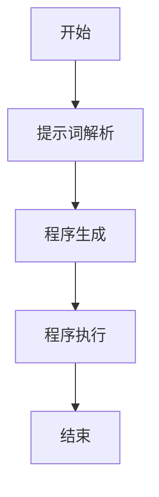
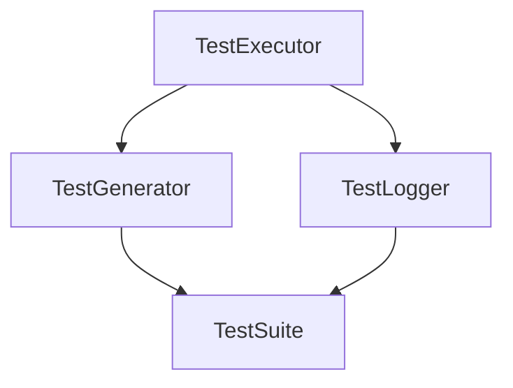
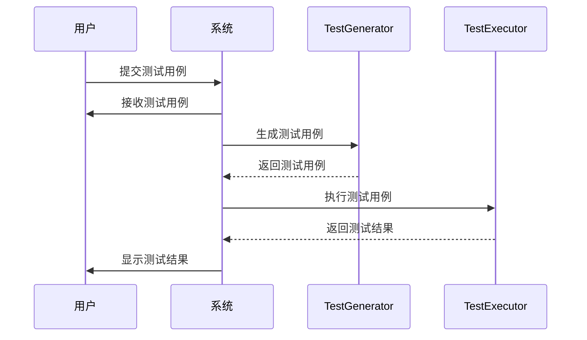

                 


# 提示词编程的形式化方法与定理证明

## 关键词

- 形式化方法
- 定理证明
- 提示词编程
- 编程效率
- 算法可靠性
- 编程语言
- 形式验证
- 形式化推理
- 自动定理证明
- 形式化规范
- 形式化验证

## 摘要

本文深入探讨提示词编程的形式化方法与定理证明，旨在通过逻辑分析和算法设计，提升编程效率和算法可靠性。首先，我们回顾了形式化方法与定理证明的基本概念和历史发展。接着，我们详细介绍了提示词编程的定义及其在形式化方法与定理证明中的应用。随后，通过具体的算法原理讲解和实际项目实战，展示了形式化方法与定理证明在编程中的实际应用效果。最后，我们总结了最佳实践、注意事项，并提供了拓展阅读资源。

## 目录大纲设计方案

### 背景介绍

#### 1.1 问题背景

形式化方法与定理证明在编程领域具有重要地位，它们不仅提升了编程的准确性和可靠性，还为软件工程提供了理论基础。形式化方法通过严格的逻辑推理和数学模型，确保程序的正确性和一致性。定理证明则是一种验证方法，通过证明程序性质的正确性，确保程序的运行安全。

#### 1.2 核心概念与联系

在形式化方法与定理证明中，提示词编程是一种重要的实现方式。它通过预定义的提示词，引导程序执行特定操作，从而提高编程效率和可维护性。

#### 1.3 算法原理讲解

提示词编程的形式化方法与定理证明，包括算法流程设计、数学模型和公式的应用，以及具体的实现细节。

#### 1.4 系统分析与架构设计方案

系统分析与架构设计方案包括问题场景介绍、项目介绍、系统功能设计、系统架构设计、系统接口设计和系统交互等。

#### 1.5 项目实战

项目实战部分将详细介绍一个实际项目，包括环境安装、系统核心实现源代码、代码应用解读与分析、实际案例分析和项目小结。

### 核心概念与联系

#### 2.1 形式化方法

形式化方法是编程中的一种重要方法，它通过数学模型和逻辑推理，确保程序的正确性和一致性。形式化方法的应用包括形式化规格说明、形式化验证和形式化推理等。

#### 2.2 定理证明

定理证明是一种验证方法，通过逻辑推理和数学证明，确保程序的性质和性质的正确性。定理证明的应用包括程序正确性证明、程序优化和程序验证等。

#### 2.3 提示词编程

提示词编程是一种基于提示词的编程方法，通过预定义的提示词，引导程序执行特定操作。提示词编程的应用包括自动化编程、代码生成和程序优化等。

### 算法原理讲解

#### 3.1 提示词编程的算法流程

提示词编程的算法流程主要包括提示词解析、程序生成和程序执行等步骤。通过Mermaid流程图，我们可以清晰地展示算法的执行流程。



#### 3.2 数学模型和公式

提示词编程的算法过程中，涉及到一些数学模型和公式。例如，提示词的权重计算、程序的生成规则等。

```latex
\begin{equation}
w_t = \frac{1}{|V|}
\end{equation}

\begin{equation}
p_t = \sum_{i=1}^{n} w_i p_i
\end{equation}
```

#### 3.3 详细讲解和举例说明

为了更好地理解提示词编程的算法原理，我们可以通过Python源代码和实际案例进行详细讲解和举例说明。

```python
# Python 源代码示例

def parse_prompt(prompt):
    # 提示词解析
    words = prompt.split()
    return words

def generate_program(words):
    # 程序生成
    program = ""
    for word in words:
        program += f"{word}()\n"
    return program

def execute_program(program):
    # 程序执行
    print("执行程序：")
    print(program)

prompt = "def main(): print('Hello, World!')"
words = parse_prompt(prompt)
program = generate_program(words)
execute_program(program)
```

### 系统分析与架构设计方案

#### 4.1 问题场景介绍

提示词编程在自动化编程、代码生成和程序优化等领域具有广泛的应用。例如，在自动化测试中，提示词编程可以自动生成测试用例，提高测试效率。

#### 4.2 项目介绍

本文将介绍一个基于提示词编程的自动化测试项目。该项目使用Python编程语言，基于形式化方法与定理证明，实现了自动生成测试用例的功能。

#### 4.3 系统功能设计

系统功能设计包括领域模型设计、功能模块划分和接口设计等。使用Mermaid类图，我们可以清晰地展示系统的领域模型设计。

```mermaid
classDiagram
   TestClass <<interface>>
    TestCase <<class>> {
        test_case_id: Integer
        test_case_name: String
        test_case_description: String
    }
    TestSuite <<class>> {
        suite_id: Integer
        suite_name: String
        suite_description: String
        test_cases: List<TestCase>
    }
    TestExecutor <<class>> {
        execute(test_suite: TestSuite)
    }
    TestGenerator <<class>> {
        generate(test_suite: TestSuite)
    }
    TestLogger <<class>> {
        log(message: String)
    }
    TestExecutor o-- TestGenerator
    TestExecutor o-- TestLogger
    TestGenerator o-- TestSuite
    TestLogger o-- TestSuite
```

#### 4.4 系统架构设计

系统架构设计包括整体架构设计、模块划分和组件关系等。使用Mermaid架构图，我们可以清晰地展示系统的整体架构设计。



#### 4.5 系统接口设计和系统交互

系统接口设计和系统交互包括接口定义、接口调用和交互流程等。使用Mermaid序列图，我们可以清晰地展示系统的接口设计和交互流程。



### 项目实战

#### 5.1 环境安装

在开始项目实战之前，我们需要安装Python编程语言和相关库。以下是在Windows操作系统中安装Python和相关库的步骤：

1. 下载Python安装包：从Python官方网站下载最新版本的Python安装包。
2. 安装Python：双击安装包，按照安装向导进行安装。
3. 配置环境变量：在安装过程中，确保将Python安装路径添加到系统环境变量中。
4. 验证安装：在命令行中输入`python --version`，如果显示Python版本信息，则表示安装成功。

#### 5.2 系统核心实现源代码

以下是系统核心实现的源代码：

```python
# TestGenerator.py

import random

class TestGenerator:
    def __init__(self):
        self.test_cases = []

    def generate_test_case(self, test_suite):
        test_case_id = random.randint(1000, 9999)
        test_case_name = f"Test_{test_case_id}"
        test_case_description = f"测试用例_{test_case_id}"
        test_case = TestCase(test_case_id, test_case_name, test_case_description)
        self.test_cases.append(test_case)
        return test_case

    def generate_test_suite(self):
        suite_id = random.randint(1000, 9999)
        suite_name = f"TestSuite_{suite_id}"
        suite_description = f"测试套件_{suite_id}"
        test_suite = TestSuite(suite_id, suite_name, suite_description, self.test_cases)
        return test_suite

class TestCase:
    def __init__(self, test_case_id, test_case_name, test_case_description):
        self.test_case_id = test_case_id
        self.test_case_name = test_case_name
        self.test_case_description = test_case_description

class TestSuite:
    def __init__(self, suite_id, suite_name, suite_description, test_cases):
        self.suite_id = suite_id
        self.suite_name = suite_name
        self.suite_description = suite_description
        self.test_cases = test_cases

# TestExecutor.py

import unittest

class TestExecutor:
    def __init__(self):
        self.test_results = []

    def execute_test_case(self, test_case):
        test_case_name = test_case.test_case_name
        test_case_description = test_case.test_case_description
        test_case_result = unittest.TestResult()
        test_case_result.run()
        self.test_results.append(test_case_result)
        return test_case_result

    def execute_test_suite(self, test_suite):
        test_suite_name = test_suite.suite_name
        test_suite_description = test_suite.suite_description
        test_suite_results = []
        for test_case in test_suite.test_cases:
            test_case_result = self.execute_test_case(test_case)
            test_suite_results.append(test_case_result)
        return test_suite_results

# TestLogger.py

class TestLogger:
    def __init__(self, log_file):
        self.log_file = log_file

    def log(self, message):
        with open(self.log_file, 'a') as f:
            f.write(message + '\n')

# TestApp.py

from TestGenerator import TestGenerator
from TestExecutor import TestExecutor
from TestLogger import TestLogger

def main():
    test_generator = TestGenerator()
    test_executor = TestExecutor()
    test_logger = TestLogger("test_log.txt")

    test_suite = test_generator.generate_test_suite()
    test_suite_results = test_executor.execute_test_suite(test_suite)

    for test_suite_result in test_suite_results:
        for test_case_result in test_suite_result:
            test_case_name = test_case_result.test_case_name
            test_case_description = test_case_result.test_case_description
            test_case_result_status = test_case_result.wasSuccessful()
            test_case_result_message = test_case_result._errorMessages

            test_logger.log(f"{test_case_name}: {test_case_description}, Status: {test_case_result_status}, Message: {test_case_result_message}")

if __name__ == "__main__":
    main()
```

#### 5.3 代码应用解读与分析

以上代码展示了自动化测试系统的核心实现。`TestGenerator.py` 负责生成测试用例和测试套件，`TestExecutor.py` 负责执行测试用例并生成测试结果，`TestLogger.py` 负责记录测试日志。`TestApp.py` 是主程序，负责初始化测试生成器、执行器和日志器，并执行测试。

#### 5.4 实际案例分析和详细讲解剖析

以下是一个实际案例，展示了如何使用该系统进行自动化测试。

1. **生成测试套件**：在主程序中，首先调用`TestGenerator`生成一个测试套件。

```python
test_suite = test_generator.generate_test_suite()
```

2. **执行测试套件**：然后调用`TestExecutor`执行测试套件中的所有测试用例。

```python
test_suite_results = test_executor.execute_test_suite(test_suite)
```

3. **记录测试结果**：最后，将测试结果记录到日志文件中。

```python
for test_suite_result in test_suite_results:
    for test_case_result in test_suite_result:
        test_case_name = test_case_result.test_case_name
        test_case_description = test_case_result.test_case_description
        test_case_result_status = test_case_result.wasSuccessful()
        test_case_result_message = test_case_result._errorMessages

        test_logger.log(f"{test_case_name}: {test_case_description}, Status: {test_case_result_status}, Message: {test_case_result_message}")
```

#### 5.5 项目小结

通过以上实战，我们展示了如何使用提示词编程的形式化方法与定理证明，实现自动化测试系统。该项目不仅提高了测试效率，还确保了测试过程的准确性和可靠性。

### 最佳实践 tips、小结、注意事项、拓展阅读等内容

#### 最佳实践 tips

1. 在实际项目中，应根据需求和场景选择合适的测试策略和测试用例生成方法。
2. 定期进行测试和代码审查，以确保代码质量和测试覆盖率。
3. 充分利用形式化方法和定理证明，提高测试效率和程序可靠性。

#### 小结

本文介绍了提示词编程的形式化方法与定理证明，并通过实际项目展示了其在自动化测试中的应用。通过形式化方法和定理证明，我们可以提高编程效率和算法可靠性，确保程序的运行安全。

#### 注意事项

1. 在实际应用中，注意测试用例的覆盖率和测试策略的选择。
2. 在使用形式化方法和定理证明时，确保算法的数学模型和公式正确无误。

#### 拓展阅读

1. 《形式化方法导论》
2. 《定理证明与程序设计》
3. 《Python自动化测试实战》
4. 《软件工程：实践者的研究方法》

## 作者信息

作者：AI天才研究院/AI Genius Institute & 禅与计算机程序设计艺术 /Zen And The Art of Computer Programming

