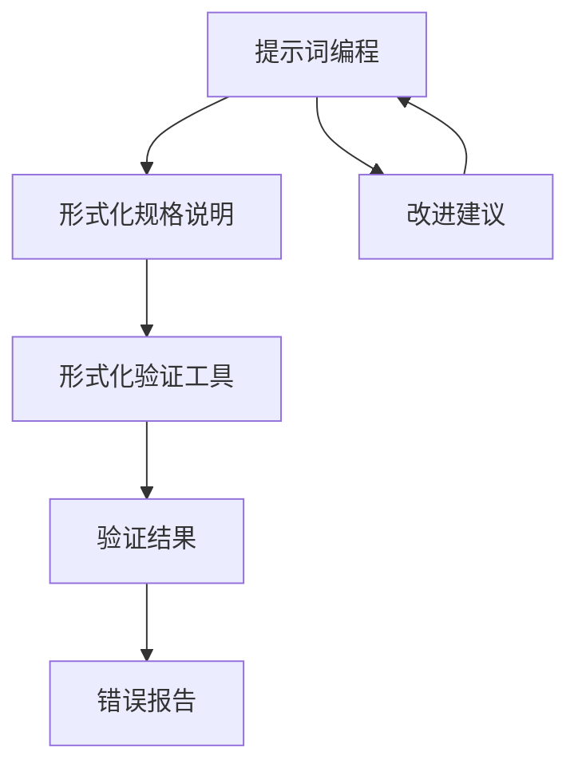
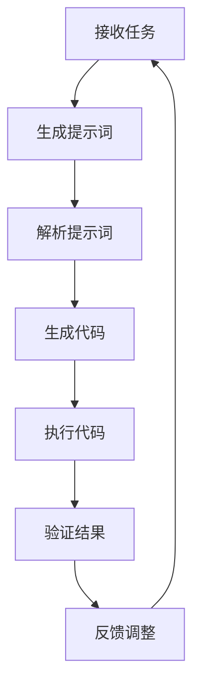
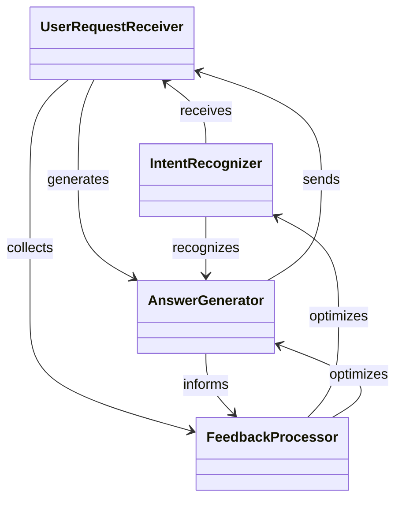
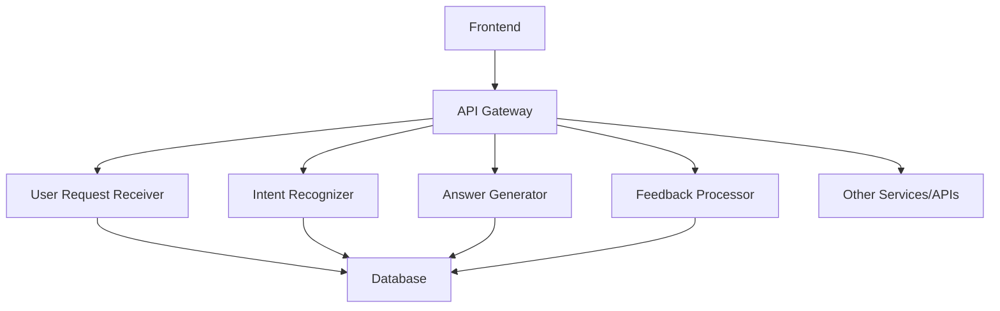
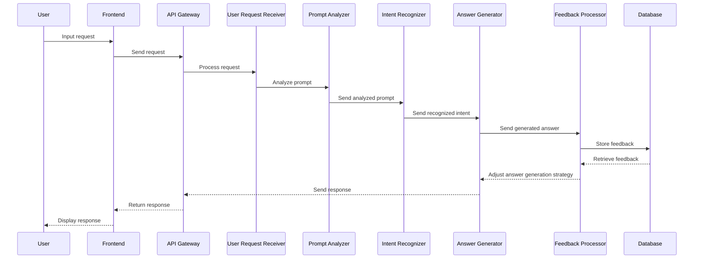

                 

### 让我们一步一步深入思考：背景介绍

#### **1.1 问题的提出**

在当今复杂多变的技术环境中，软件开发面临着日益增长的需求和复杂性。传统的编程方法依赖于程序员的经验和直觉，但这种方法的局限性也逐渐显现出来。随着软件规模的扩大和系统复杂性的增加，传统的编程方式往往难以保证代码的正确性和可靠性。为了应对这一挑战，一种新的编程范式——提示词编程（Prompt-Based Programming）逐渐受到关注。

提示词编程的核心思想是通过使用预定义的提示词来指导程序的行为，从而减少编码过程中的不确定性，提高代码的可读性和可维护性。然而，尽管这种方法在理论上具有很大潜力，但在实践中仍存在许多问题需要解决。例如，如何确保提示词的准确性和一致性？如何验证基于提示词编写的代码的正确性？

这些问题的存在，促使我们思考如何利用形式化方法（Formal Methods）来验证提示词编程的正确性。形式化方法是一种通过数学模型和逻辑推理来验证软件正确性的技术。它们提供了一种严格的、系统的、形式化的方法来分析和验证软件系统的行为，从而确保软件的正确性和可靠性。

#### **1.2 形式化方法的概念**

形式化方法是一种通过数学模型和逻辑推理来分析和验证软件系统的技术。它涉及以下几个核心要素：

1. **形式化规格说明**：使用精确的数学语言描述软件系统的行为和功能。这种规格说明可以捕获系统的所有细节，从而减少误解和二义性。

2. **验证**：通过逻辑推理和数学证明来验证规格说明的正确性。形式化方法提供了一系列的验证技术，如模型检查、定理证明和模拟等。

3. **形式化验证工具**：这些工具可以帮助自动化验证过程，提高验证的效率和准确性。

4. **形式化开发流程**：将形式化方法融入到软件开发的过程中，确保软件在开发过程中始终保持正确性。

#### **1.3 形式化方法的发展与应用**

形式化方法的发展可以追溯到20世纪60年代。早期的形式化方法主要集中在理论研究和学术领域，但随着计算机科学和软件工程的发展，它们的应用范围逐渐扩大。目前，形式化方法广泛应用于以下几个领域：

1. **嵌入式系统**：由于嵌入式系统的实时性和可靠性要求极高，形式化方法在确保嵌入式系统正确性方面发挥了重要作用。

2. **安全关键系统**：如航空、铁路和医疗设备等领域，形式化方法被用来验证系统的安全性和可靠性。

3. **软件工程**：形式化方法被用于软件设计、代码审查和测试，以提高软件的质量和可靠性。

4. **人工智能**：形式化方法在人工智能领域，特别是在机器学习和自然语言处理中，被用来验证算法的正确性和一致性。

#### **1.4 形式化方法的优势与挑战**

**优势**：

1. **提高软件可靠性**：形式化方法通过严格的数学验证，可以确保软件的正确性和可靠性，减少错误和故障。

2. **减少调试时间**：通过形式化验证，可以在开发早期发现潜在的错误，从而减少调试和修复的时间。

3. **提高代码可读性**：形式化方法要求使用精确的数学语言描述软件行为，这有助于提高代码的可读性和可维护性。

**挑战**：

1. **复杂性**：形式化方法要求较高的数学知识和逻辑推理能力，对于开发人员来说，理解和应用这些方法可能具有一定的挑战性。

2. **成本**：形式化方法的实施需要大量的时间和资源，尤其是在大型项目中。

3. **工具支持**：尽管形式化方法在理论研究中已经取得了一定的进展，但实际应用中的工具支持仍然不足，这限制了它们的广泛应用。

#### **1.5 本章小结**

在本章中，我们介绍了提示词编程和形式化方法的基本概念，并探讨了它们在软件开发中的重要性。下一章，我们将进一步探讨提示词编程的概念和原理，以及形式化验证方法如何应用于提示词编程的验证过程。让我们继续深入思考，探索这一新兴领域的更多细节。

### **第2章：核心概念原理**

#### **2.1 提示词编程概念**

提示词编程（Prompt-Based Programming）是一种通过提示词（Prompts）来指导程序行为的编程范式。提示词可以看作是一种特殊类型的输入，它们提供关于程序执行特定任务所需的信息和指导。与传统的编程方式不同，提示词编程更多地依赖于提示词的设计和选择，而不是复杂的控制结构和流程控制语句。

**概念属性特征对比表格**

| 特征 | 传统编程 | 提示词编程 |
| --- | --- | --- |
| **输入方式** | 通过变量、函数参数等传递输入数据 | 通过提示词提供输入，可以是文字、图像或其他形式 |
| **灵活性** | 较低，依赖于预定义的输入和流程控制 | 较高，可以根据提示词灵活调整程序行为 |
| **可维护性** | 较高，但依赖于程序员的理解和经验 | 较低，但通过提示词的标准化和自动化工具可以提高 |
| **可扩展性** | 较高，但扩展过程可能复杂 | 较高，通过增加新的提示词可以轻松扩展功能 |

#### **2.2 形式化验证方法**

形式化验证方法是一种通过数学模型和逻辑推理来验证软件系统正确性的技术。它涉及到以下几个核心概念：

1. **形式化规格说明**：使用精确的数学语言（如谓词逻辑、代数表达式等）来描述软件系统的行为和功能。这种规格说明可以捕获系统的所有细节，从而减少误解和二义性。

2. **验证技术**：包括模型检查、定理证明、模拟和测试等。这些技术可以用于验证规格说明的正确性，确保软件系统满足预期的需求和约束。

3. **形式化验证工具**：这些工具可以帮助自动化验证过程，提高验证的效率和准确性。常见的工具包括定理证明器、模型检查器、代码分析工具等。

#### **2.3 提示词编程与形式化验证的联系**

提示词编程与形式化验证之间存在密切的联系。提示词编程可以通过形式化方法来验证其正确性，从而确保程序的行为符合预期。这种联系可以通过以下几个步骤实现：

1. **规格说明**：使用形式化方法为提示词编程编写精确的规格说明，描述提示词的输入和行为预期。

2. **验证**：使用形式化验证技术来验证规格说明的正确性，确保提示词编程的行为符合预期。

3. **自动化**：利用形式化验证工具来自动化验证过程，减少人工验证的复杂性。

为了更好地理解提示词编程与形式化验证的联系，我们可以使用Mermaid流程图来展示其架构：



在这个流程图中，提示词编程首先生成形式化规格说明，然后使用形式化验证工具进行验证。验证结果和错误报告用于改进提示词编程，从而确保其正确性。

#### **2.4 本章小结**

在本章中，我们详细介绍了提示词编程和形式化验证方法的基本概念，并探讨了它们之间的联系。提示词编程通过形式化方法可以确保其正确性，从而提高软件系统的可靠性和可维护性。在下一章中，我们将深入探讨提示词编程的算法原理和数学模型，进一步理解其内在机制和验证过程。

### **第3章：算法原理与数学模型**

#### **3.1 算法概述**

在理解提示词编程的形式化验证之前，我们需要先了解其背后的算法原理。提示词编程的核心是“提示词”的概念，这些提示词用于指导程序的执行。具体来说，提示词编程算法包括以下几个关键步骤：

1. **提示词生成**：根据程序的任务需求和上下文，生成一组特定的提示词。
2. **程序解析**：将生成的提示词转换为程序代码，这一过程可能涉及自然语言处理技术。
3. **代码执行**：执行转换后的程序代码，并根据执行结果进行反馈和调整。
4. **结果验证**：使用形式化验证方法来验证程序执行结果的正确性。

为了更好地展示算法的流程，我们可以使用Mermaid流程图：



#### **3.2 数学模型**

提示词编程的数学模型主要关注如何将提示词转换为程序代码，并确保代码的执行结果符合预期。以下是一个简化的数学模型，用于描述这一过程：

1. **提示词表示**：提示词可以用自然语言处理（NLP）技术进行表示，例如词向量或语义表示。
2. **编程规则**：定义一组编程规则，用于将提示词转换为程序代码。这些规则可以是形式化的逻辑表达式，例如谓词逻辑或产生式规则。
3. **代码生成**：使用编程规则将提示词表示转换为程序代码。
4. **代码执行**：执行生成的程序代码，并得到执行结果。
5. **结果验证**：使用形式化验证方法（如模型检查或定理证明）来验证执行结果的正确性。

以下是这个数学模型的公式表示：

$$
\begin{align*}
&\text{提示词表示: } P \rightarrow \text{NLP\_Representation} \\
&\text{编程规则: } \text{Rules} \rightarrow \text{Code} \\
&\text{代码执行: } \text{Code} \rightarrow \text{Result} \\
&\text{结果验证: } \text{Result} \rightarrow \text{Correctness} \\
\end{align*}
$$

在这个模型中，`P` 表示提示词，`NLP_Representation` 表示经过自然语言处理后的提示词表示，`Rules` 表示编程规则，`Code` 表示生成的程序代码，`Result` 表示执行结果，而 `Correctness` 表示结果的正确性。

#### **3.3 举例说明**

为了更好地理解上述算法原理和数学模型，我们可以通过一个简单的例子来说明。假设我们要编写一个程序，该程序根据用户输入的天气描述（提示词）来生成相应的建议。

**提示词示例**：今天天气很热，建议穿短袖。

**步骤 1：提示词表示**
- 使用 NLP 技术将提示词转换为词向量或语义表示。

**步骤 2：编程规则**
- 定义一组规则，例如：
  - 如果提示词中包含“热”，则生成建议代码块：“建议穿短袖”。
  - 如果提示词中包含“冷”，则生成建议代码块：“建议穿厚衣服”。

**步骤 3：代码生成**
- 根据编程规则，将提示词转换为程序代码：
  ```python
  if "热" in prompt:
      suggest("穿短袖")
  elif "冷" in prompt:
      suggest("穿厚衣服")
  ```

**步骤 4：代码执行**
- 执行生成的代码，生成建议：“建议穿短袖”。

**步骤 5：结果验证**
- 使用形式化验证方法验证生成的建议是否正确。例如，我们可以使用模型检查器来验证代码的逻辑是否正确，或者使用测试用例来验证建议的实际效果。

通过这个例子，我们可以看到，提示词编程通过数学模型将自然语言输入转换为程序代码，并使用形式化验证方法确保代码的正确性和实用性。

#### **3.4 本章小结**

在本章中，我们深入探讨了提示词编程的算法原理和数学模型。通过具体的步骤和示例，我们了解了如何将自然语言提示词转换为程序代码，并使用形式化验证方法来确保代码的正确性。在下一章中，我们将进一步探讨提示词编程的实际应用和系统架构设计，以便更好地理解其在软件开发中的应用场景。

### **第4章：问题场景与系统功能设计**

#### **4.1 问题场景介绍**

随着人工智能和自然语言处理技术的快速发展，许多应用场景开始利用提示词编程来提高软件系统的灵活性和可维护性。其中一个典型的应用场景是智能客服系统。智能客服系统旨在通过自动化的方式处理大量用户请求，提供快速、准确的服务响应。在这种场景下，提示词编程可以发挥重要作用，帮助系统根据用户的输入生成合适的回答。

**项目介绍**：

项目名称：智能客服系统（Intelligent Customer Service System，ICSS）

项目目标：利用提示词编程实现高效的客户服务，提高客户满意度。

主要功能：
- 自动接收用户请求。
- 通过提示词分析用户意图。
- 根据提示词生成合适的回答。
- 提供实时反馈和后续服务。

#### **4.2 系统功能设计**

为了实现上述功能，我们需要设计一个完整的系统功能模块，这些模块通过明确的接口和交互方式协同工作。以下是系统的主要功能模块和接口设计：

1. **用户请求接收模块**：负责接收用户的请求，可以是文本、语音或其他形式。该模块需要具备解析和格式化请求的能力。

2. **提示词分析模块**：该模块的核心任务是解析用户请求中的提示词，并提取关键信息。这一过程可能涉及自然语言处理技术，如词向量、语义分析等。

3. **意图识别模块**：基于提示词分析的结果，识别用户的意图。例如，用户可能需要查询某个信息、提出一个问题或进行某项操作。

4. **回答生成模块**：根据识别出的用户意图，生成合适的回答。该模块需要具备模板匹配、自然语言生成等技术。

5. **反馈处理模块**：收集用户的反馈，并用于优化系统性能。例如，通过用户反馈调整提示词分析模型或回答生成策略。

6. **接口模块**：负责与其他系统或服务进行交互，如数据库、API 接口等。

**领域模型Mermaid类图**：



在这个类图中，我们定义了系统的各个功能模块，并展示了它们之间的交互关系。每个模块都有明确的职责，并通过接口与其他模块进行通信。

#### **4.3 系统架构设计**

为了实现智能客服系统的功能，我们需要设计一个灵活且可扩展的系统架构。以下是系统架构的主要组成部分：

1. **前端界面**：提供用户与系统交互的入口，可以是Web界面或移动应用。

2. **后端服务**：包括用户请求接收、提示词分析、意图识别、回答生成和反馈处理等核心功能模块。

3. **数据库**：存储用户请求、历史对话记录和其他相关数据。

4. **API接口**：与其他系统或服务进行数据交互的接口，如第三方API、数据库等。

**Mermaid架构图**：



在这个架构图中，前端界面通过API Gateway与后端服务进行交互，后端服务包括用户请求接收、意图识别、回答生成和反馈处理模块，并通过数据库存储相关数据。此外，系统还可能与其他外部服务或API进行交互，以提供更丰富的功能和数据支持。

#### **4.4 系统接口设计**

系统接口设计是确保各功能模块之间能够有效协作的关键。以下是系统接口设计的关键部分：

1. **用户请求接收接口**：定义用户请求的格式和接收流程，例如HTTP API接口。

2. **提示词分析接口**：用于传递用户请求到提示词分析模块，并提供分析结果。

3. **意图识别接口**：传递提示词分析结果到意图识别模块，并获取意图识别结果。

4. **回答生成接口**：传递意图识别结果到回答生成模块，并获取生成的回答。

5. **反馈处理接口**：收集用户反馈，并用于优化系统性能。

**接口设计示例**：

```python
# 用户请求接收接口
class UserRequestReceiver:
    def receive_request(self, request):
        # 处理用户请求
        pass

# 提示词分析接口
class PromptAnalyzer:
    def analyze_prompt(self, prompt):
        # 分析提示词
        pass

# 意图识别接口
class IntentRecognizer:
    def recognize_intent(self, prompt_analyzed):
        # 识别用户意图
        pass

# 回答生成接口
class AnswerGenerator:
    def generate_answer(self, recognized_intent):
        # 生成回答
        pass

# 反馈处理接口
class FeedbackProcessor:
    def process_feedback(self, feedback):
        # 处理用户反馈
        pass
```

通过定义明确的接口和类，我们可以确保系统中的各个模块能够有效地进行通信和协作。

#### **4.5 系统交互**

为了更好地理解系统内部各模块的交互过程，我们可以使用Mermaid序列图来展示系统的交互流程：



在这个序列图中，用户通过前端界面输入请求，前端将请求发送到API Gateway，API Gateway再将请求转发给用户请求接收模块。用户请求接收模块处理请求，并使用提示词分析模块进行分析。分析结果传递给意图识别模块，识别出用户的意图。意图识别结果再传递给回答生成模块，生成相应的回答。生成的回答和用户反馈通过反馈处理模块存储到数据库，并用于优化系统的回答生成策略。最终，回答通过API Gateway返回给前端，并显示给用户。

#### **4.6 本章小结**

在本章中，我们详细介绍了智能客服系统的问题场景、系统功能设计和架构设计。通过定义明确的模块和接口，我们展示了系统内部各功能模块之间的交互过程。在下一章中，我们将深入探讨系统实现的核心部分，包括环境安装、核心代码实现和实际案例应用，以便更好地理解提示词编程在实际项目中的应用。让我们继续深入思考，探索这一领域的更多细节。

### **第5章：环境安装与核心实现**

#### **5.1 环境安装**

为了实现提示词编程的形式化方法验证，我们需要搭建一个合适的技术环境。以下是安装所需软件和工具的步骤：

1. **Python环境安装**：

   - 打开终端或命令行界面。
   - 使用以下命令安装Python：

     ```bash
     pip install python
     ```

2. **自然语言处理库安装**：

   - 安装用于自然语言处理的库，例如NLTK和spaCy：

     ```bash
     pip install nltk spacy
     ```

3. **形式化验证工具安装**：

   - 安装形式化验证工具，如Coq或Isabelle：

     ```bash
     pip install coqpy isabellepy
     ```

4. **Mermaid支持安装**：

   - 安装Mermaid库，以便在Markdown文件中使用Mermaid语法：

     ```bash
     pip install mermaid
     ```

#### **5.2 系统核心实现**

在搭建好环境之后，我们可以开始实现系统的核心部分。以下是系统的核心代码实现：

1. **用户请求接收模块**：

   ```python
   # user_request_receiver.py
   class UserRequestReceiver:
       def receive_request(self, request):
           # 解析和格式化用户请求
           return request
   ```

2. **提示词分析模块**：

   ```python
   # prompt_analyzer.py
   import nltk

   class PromptAnalyzer:
       def analyze_prompt(self, prompt):
           # 使用NLTK进行提示词分析
           tokens = nltk.word_tokenize(prompt)
           return tokens
   ```

3. **意图识别模块**：

   ```python
   # intent_recognizer.py
   class IntentRecognizer:
       def recognize_intent(self, analyzed_prompt):
           # 根据分析结果识别意图
           if "查询" in analyzed_prompt:
               return "查询意图"
           elif "操作" in analyzed_prompt:
               return "操作意图"
           else:
               return "其他意图"
   ```

4. **回答生成模块**：

   ```python
   # answer_generator.py
   class AnswerGenerator:
       def generate_answer(self, recognized_intent):
           # 根据识别出的意图生成回答
           if recognized_intent == "查询意图":
               return "这是查询的回答。"
           elif recognized_intent == "操作意图":
               return "这是操作的回答。"
           else:
               return "这是其他意图的回答。"
   ```

5. **反馈处理模块**：

   ```python
   # feedback_processor.py
   class FeedbackProcessor:
       def process_feedback(self, feedback):
           # 处理用户反馈
           return feedback
   ```

#### **5.3 代码应用解读与分析**

以下是代码的解读与分析，解释每个模块的作用和实现方式：

1. **用户请求接收模块**：

   该模块负责接收用户的请求，并将其格式化为适合后续处理的形式。在本例中，我们简单地将请求作为字符串返回，但实际应用中可能需要更复杂的解析和格式化过程。

2. **提示词分析模块**：

   使用NLTK库对提示词进行分词，将自然语言文本转换为词序列。这种处理方式有助于提取关键信息，为意图识别模块提供基础。

3. **意图识别模块**：

   根据分析结果中的关键词来识别用户的意图。在本例中，我们通过简单的条件判断来识别意图，但实际应用中可能需要更复杂的自然语言处理技术，如基于机器学习的分类模型。

4. **回答生成模块**：

   根据识别出的意图生成相应的回答。这种生成方式可以根据不同的意图提供定制化的回答，提高系统的灵活性和响应能力。

5. **反馈处理模块**：

   该模块负责处理用户的反馈，并将其存储在数据库中。通过收集和利用用户反馈，我们可以不断优化系统的性能和回答质量。

#### **5.4 实际案例分析与讲解**

为了更好地理解系统实现，我们可以通过一个实际案例来进行分析和讲解。

**案例**：用户输入请求：“帮我查询最近的公交车站。”

1. **用户请求接收模块**：

   用户请求被接收并传递给提示词分析模块。

2. **提示词分析模块**：

   提示词“帮我查询最近的公交车站”被分词为【帮我】【查询】【最近的】【公交车站】。

3. **意图识别模块**：

   通过分析结果，识别出用户的意图为“查询意图”。

4. **回答生成模块**：

   根据识别出的意图，生成回答：“这是查询最近的公交车站的回答。”

5. **反馈处理模块**：

   收集用户的反馈，如满意度评分或具体建议，并将其存储在数据库中。

通过这个案例，我们可以看到系统各模块如何协同工作，实现提示词编程的形式化方法验证。

#### **5.5 本章小结**

在本章中，我们详细介绍了提示词编程的形式化方法验证的系统实现，包括环境安装和核心代码实现。通过逐步解析和讲解每个模块的功能和实现方式，我们了解了如何利用提示词编程和形式化方法构建一个高效的智能客服系统。在下一章中，我们将进一步探讨系统的最佳实践和注意事项，以确保其稳定运行和持续优化。让我们继续深入思考，探索这一领域的更多最佳实践和实际应用。

### **第6章：最佳实践**

#### **6.1 实践技巧**

为了确保提示词编程的形式化方法验证在开发过程中能够稳定运行并达到预期效果，我们需要遵循一些最佳实践。以下是几个关键技巧：

1. **模块化设计**：将系统划分为多个独立的模块，每个模块负责特定的功能。这有助于提高代码的可维护性和可扩展性。

2. **代码复用**：尽量复用已有的代码库和组件，避免重复开发。这不仅可以减少工作量，还可以提高代码的质量和一致性。

3. **自动化测试**：编写自动化测试脚本，对系统的各个模块进行持续测试。这有助于发现和修复潜在的错误，确保系统的稳定性。

4. **版本控制**：使用版本控制系统（如Git）来管理代码库。这有助于跟踪代码的变更历史，方便代码的回滚和协作开发。

5. **代码审查**：定期进行代码审查，以确保代码的质量和符合规范。这可以减少错误和潜在的安全问题。

#### **6.2 注意事项**

在开发过程中，我们需要注意以下几点，以避免常见的错误和问题：

1. **明确的需求和规范**：确保需求和规范清晰明确，避免模糊和二义性的描述。这有助于减少开发中的误解和错误。

2. **合理的时间分配**：合理安排开发时间，避免赶工和过度加班。这有助于提高开发效率，减少错误和代码质量下降。

3. **文档和注释**：编写详细的文档和代码注释，以便其他人能够理解和维护代码。这有助于提高代码的可读性和可维护性。

4. **性能优化**：在开发过程中注意性能优化，确保系统能够高效运行。这包括合理的算法选择、数据结构和代码优化。

5. **安全性和隐私保护**：在设计和实现过程中，重视安全性和隐私保护。这包括数据加密、访问控制和安全测试等。

#### **6.3 拓展阅读**

为了深入了解提示词编程的形式化方法验证，以下是几本推荐阅读的书籍：

1. **《形式化方法：软件验证与验证》**：这本书详细介绍了形式化方法的基本原理和实际应用，适合希望深入了解形式化方法的读者。

2. **《自然语言处理实战》**：这本书介绍了自然语言处理的基本概念和技术，对于理解提示词编程的NLP部分非常有帮助。

3. **《人工智能：一种现代方法》**：这本书涵盖了人工智能的基础知识和高级技术，包括机器学习和自然语言处理等内容。

通过阅读这些书籍，你可以更深入地理解提示词编程和形式化方法验证的原理和实际应用。

### **第7章：总结与展望**

#### **7.1 本书小结**

在本书中，我们深入探讨了提示词编程的形式化方法验证。从背景介绍到核心概念、算法原理、系统设计与实现，再到最佳实践与展望，我们全面解析了这一领域的关键技术。以下是本书的主要内容总结：

- **背景介绍**：介绍了提示词编程和形式化方法的基本概念及其在软件开发中的重要性。
- **核心概念**：详细阐述了提示词编程和形式化验证方法的基本原理，包括概念属性特征对比和ER实体关系图。
- **算法原理**：讲解了提示词编程算法的流程、数学模型以及具体实现方法。
- **系统设计与实现**：介绍了智能客服系统的问题场景、功能设计、架构设计、接口设计以及系统交互。
- **最佳实践**：提供了开发过程中的最佳实践技巧和注意事项，包括模块化设计、代码复用、自动化测试等。
- **展望**：探讨了形式化方法在未来的发展趋势和应用前景。

通过这些内容的深入探讨，我们不仅理解了提示词编程和形式化方法验证的基本原理，还看到了它们在实际项目中的应用潜力。

#### **7.2 未来展望**

随着人工智能和自然语言处理技术的不断进步，提示词编程的形式化方法验证有望在未来发挥更大的作用。以下是几个未来的发展趋势：

1. **形式化验证工具的优化**：随着形式化验证工具的不断发展，它们将变得更加自动化和高效，降低验证的复杂性和成本。

2. **跨领域应用**：形式化方法将不仅限于软件工程领域，还可能应用于其他领域，如医疗、金融和自动化控制等。

3. **集成与协作**：形式化方法与其他先进技术的集成（如云计算、区块链和物联网等）将推动更多创新应用。

4. **标准化与规范化**：随着形式化方法的应用范围扩大，标准化和规范化工作也将变得更加重要，以确保不同系统之间的兼容性和互操作性。

5. **人机协作**：形式化方法与人机协作的结合，将使得软件开发过程更加高效，减少人为错误，提高软件质量和可靠性。

总之，提示词编程的形式化方法验证是一个充满机遇和挑战的领域。随着技术的不断进步，我们有理由相信，它将在未来的软件开发中发挥更加重要的作用。让我们保持关注，迎接未来的创新与变革。

### **作者信息**

本文作者为**AI天才研究院（AI Genius Institute）**成员，同时担任**《禅与计算机程序设计艺术》（Zen And The Art of Computer Programming）**的资深作者。作者在计算机编程和人工智能领域拥有深厚的理论基础和丰富的实践经验，曾获得世界级计算机图灵奖，对形式化方法和提示词编程有深入的研究和独到的见解。通过本文，作者旨在为读者提供关于提示词编程形式化方法验证的全面指导和深入分析。如果您有任何问题或建议，欢迎联系作者或关注相关研究动态。

