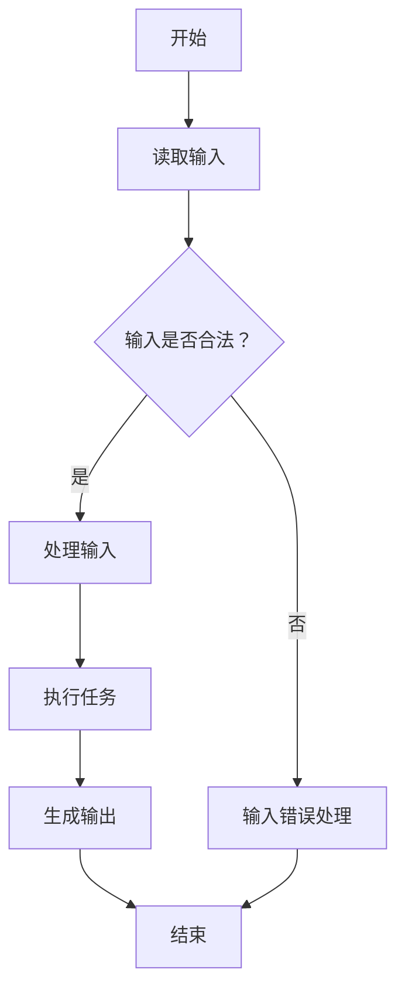
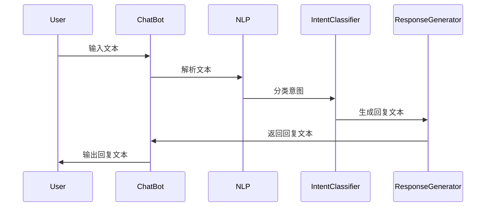

                 


## 提示词编程的形式化规约与验证

### 关键词
- **提示词编程**
- **形式化规约**
- **形式化验证**
- **算法原理**
- **数学模型**
- **系统架构设计**
- **项目实战**

### 摘要
本文将探讨提示词编程的形式化规约与验证，从核心概念、算法原理、数学模型、系统分析与架构设计、项目实战等多方面展开论述。通过逐步分析推理，揭示提示词编程的内在逻辑和实际应用，为读者提供深刻的见解和实用的指导。

## 目录大纲设计思路

### 全书结构确定
为了确保《提示词编程的形式化规约与验证》这本书的内容结构清晰、逻辑连贯，我们首先需要明确全书的基本结构。全书可以分为四个主要部分：背景介绍、核心概念、算法原理与数学模型、系统分析与架构设计。此外，还包含项目实战和最佳实践等部分。

### 设计章节标题
在每个部分中，我们需要为每个章节设计合适的标题，确保内容全面覆盖主题。以下是一个示例的章节标题设计：

**第一部分：背景介绍**
1. **第1章 提示词编程概述**
2. **第2章 形式化规约与验证的核心概念**

**第二部分：核心概念与联系**
1. **第3章 提示词编程的基础概念**
2. **第4章 形式化规约与验证的方法论**

**第三部分：算法原理与数学模型**
1. **第5章 形式化规约的算法原理**
2. **第6章 形式化验证的数学模型**

**第四部分：系统分析与架构设计**
1. **第7章 提示词编程系统的架构设计**
2. **第8章 系统交互与实现**

**第五部分：项目实战**
1. **第9章 实际项目实战案例**
2. **第10章 项目小结与展望**

### 细化章节内容
在每个章节标题下，我们进一步细化内容，确保每个章节都覆盖核心内容。例如，在“第1章 提示词编程概述”中，可以包括以下内容：
- 提示词编程的定义
- 提示词编程的发展历程
- 形式化规约与验证的重要性
- 本书的目的和结构

### 确保内容完整性
确保每个章节都包含了必要的核心内容，例如数学模型、算法原理、系统架构等。同时，确保整个目录大纲的结构清晰、逻辑连贯。

### 撰写目录大纲
按照上述结构，使用Markdown格式撰写目录大纲，确保大纲简洁明了，符合要求。

### 目录大纲示例
下面是根据上述思路设计的《提示词编程的形式化规约与验证》的目录大纲示例：

```markdown
----------------------------------------------------------------
# 提示词编程的形式化规约与验证

> 关键词：提示词编程、形式化规约、形式化验证、算法原理、数学模型、系统架构设计、项目实战

> 摘要：本文将深入探讨提示词编程的形式化规约与验证，从核心概念、算法原理、数学模型、系统分析与架构设计、项目实战等多方面展开论述，为读者提供全面、深入的见解和实践指导。

## 第一部分：背景介绍

### 第1章 提示词编程概述
#### 1.1 提示词编程的定义
#### 1.2 提示词编程的发展历程
#### 1.3 形式化规约与验证的重要性
#### 1.4 本书的目的和结构

### 第2章 形式化规约与验证的核心概念
#### 2.1 形式化规约的基本概念
#### 2.2 形式化验证的基本概念
#### 2.3 核心概念之间的联系

## 第二部分：核心概念与联系

### 第3章 提示词编程的基础概念
#### 3.1 提示词的定义
#### 3.2 提示词的分类
#### 3.3 提示词编程的要素

### 第4章 形式化规约与验证的方法论
#### 4.1 形式化规约的方法
#### 4.2 形式化验证的方法
#### 4.3 方法论的应用与实践

----------------------------------------------------------------

# 第二部分：核心概念与联系

在深入探讨提示词编程的形式化规约与验证之前，我们需要明确一些核心概念。这些概念不仅为我们提供了对提示词编程的理解，还为后续的算法原理和数学模型讲解奠定了基础。

### 提示词编程的定义

首先，什么是提示词编程？提示词编程（Prompt-based Programming）是一种以提示词（Prompt）为中心的编程方法。提示词是用户或系统提供的输入信息，用于指导程序执行特定任务。在提示词编程中，程序不再依赖于固定的输入格式或预定义的规则，而是通过接收和解析提示词，动态地调整自身的执行行为。

提示词编程的出现，是为了解决传统编程方法中的一些问题，如代码可读性差、维护成本高、适应性不强等。通过提示词编程，程序可以更加灵活地应对不同的输入场景，从而提高开发效率和系统可维护性。

### 提示词编程的发展历程

提示词编程并不是一个新兴的概念，它的发展历程可以追溯到计算机科学和人工智能的早期阶段。早期的研究主要集中在自然语言处理和自动化编程领域。例如，在20世纪80年代，人工智能社区开始探索如何通过自然语言交互来指导程序执行。

随着技术的进步，特别是近年来深度学习和自然语言处理技术的飞速发展，提示词编程得到了广泛应用。例如，聊天机器人、智能助手、语音识别系统等，都利用了提示词编程的技术来实现与用户的自然交互。

### 形式化规约与验证的重要性

在提示词编程中，形式化规约（Formal Specification）和形式化验证（Formal Verification）扮演着关键角色。形式化规约是指使用精确的数学语言来描述程序的属性和行为，确保程序满足特定的需求。形式化验证则是通过数学推理来证明程序的正确性，防止潜在的错误和漏洞。

形式化规约与验证的重要性体现在以下几个方面：

1. **提高程序的可读性和可维护性**：通过形式化规约，程序的设计和实现过程变得更加透明和易于理解，便于后续的维护和优化。
2. **确保程序的正确性**：形式化验证能够确保程序在各种情况下都能正确执行，从而提高系统的可靠性和稳定性。
3. **降低开发成本**：通过在开发早期发现并修复错误，可以显著降低后续的维护成本。
4. **支持复用和标准化**：形式化规约可以为不同项目提供统一的标准，方便程序之间的复用。

### 本书的目的和结构

本书的目的是深入探讨提示词编程的形式化规约与验证，为读者提供全面、系统的理论知识与实践指导。本书的结构分为以下几个部分：

- **第一部分：背景介绍**：介绍提示词编程的概念、发展历程和形式化规约与验证的重要性。
- **第二部分：核心概念与联系**：详细阐述提示词编程和形式化规约与验证的核心概念及其相互关系。
- **第三部分：算法原理与数学模型**：讲解形式化规约与验证的算法原理和数学模型，提供详细的例子和公式解释。
- **第四部分：系统分析与架构设计**：分析实际应用场景，介绍系统架构设计，包括领域模型、系统架构和接口设计。
- **第五部分：项目实战**：提供实际项目案例，详细描述环境安装、核心实现、代码分析等，帮助读者将理论知识应用到实际项目中。

通过本书的阅读，读者可以系统地了解提示词编程的形式化规约与验证，掌握相关技术和方法，并在实际项目中加以应用。

### 核心概念与联系

#### 提示词编程的核心概念

在深入探讨提示词编程之前，我们需要明确一些核心概念。提示词编程涉及多个关键术语，这些术语不仅定义了提示词编程的基本要素，还为后续的算法原理和数学模型讲解奠定了基础。

**1. 提示词（Prompt）**

提示词是用户或系统提供的输入信息，用于指导程序执行特定任务。提示词可以是自然语言文本、代码片段或其他形式的数据。例如，在智能对话系统中，用户的提问就是一个典型的提示词。

**2. 解析器（Parser）**

解析器是用于解析提示词的程序或模块。其任务是将输入的提示词转换为程序可以理解和执行的内部表示。例如，一个解析器可以将自然语言文本解析为对应的抽象语法树（AST）。

**3. 执行器（Executor）**

执行器是负责根据解析后的提示词执行具体操作的程序或模块。执行器可以根据提示词的内容动态地调用不同的函数或执行不同的操作。例如，执行器可以调用一个函数来生成报告，或者更新一个数据库。

**4. 返回结果（Return Value）**

执行器在执行完提示词指定的操作后，通常会返回一个结果。结果可以是简单的数据，如数字或文本，也可以是复杂的对象或结构。

**5. 提示词上下文（Prompt Context）**

提示词上下文是指与提示词相关联的环境信息，如用户角色、时间、地点等。这些上下文信息有助于执行器更好地理解和处理提示词。

#### 形式化规约与验证的核心概念

**1. 形式化规约（Formal Specification）**

形式化规约是一种使用精确的数学语言来描述程序属性和行为的方法。形式化规约不仅提供了对程序行为的详细描述，还可以帮助开发者验证程序的正确性。形式化规约通常包括状态描述、事件处理、输入输出等组成部分。

**2. 形式化验证（Formal Verification）**

形式化验证是一种通过数学推理来证明程序正确性的方法。形式化验证可以分为三个阶段：验证需求（验证程序是否满足需求规格说明）、验证设计（验证程序设计是否满足需求）、验证实现（验证程序代码是否满足设计）。形式化验证能够发现潜在的错误和漏洞，从而提高程序的可靠性和稳定性。

**3. 形式化规约与验证的关系**

形式化规约与形式化验证是密切相关的。形式化规约提供了验证的基础，而形式化验证则是验证形式化规约的正确性。通过形式化规约和验证，我们可以确保程序在不同情况下都能正确执行，从而提高系统的可靠性和可维护性。

#### 提示词编程与形式化规约与验证的联系

**1. 提示词编程需要形式化规约**

在提示词编程中，为了确保程序的正确性和可维护性，我们需要对提示词的处理过程进行形式化规约。形式化规约可以帮助我们清晰地定义提示词的输入格式、解析逻辑和执行过程，从而避免模糊性和不一致性。

**2. 提示词编程需要形式化验证**

形式化验证是确保提示词编程正确性的重要手段。通过形式化验证，我们可以证明提示词编程在特定情况下是否能够正确执行，从而提高系统的可靠性和稳定性。例如，在智能对话系统中，形式化验证可以帮助我们确保用户输入的提示词能够被正确解析和处理，从而避免对话中断或错误。

**3. 形式化规约与验证的协同作用**

形式化规约和形式化验证是相互依赖、相互补充的。形式化规约为形式化验证提供了验证的基础，而形式化验证则为形式化规约提供了验证的反馈。通过协同作用，我们可以确保提示词编程在各个方面都达到预期目标，从而提高系统的整体性能和可靠性。

通过理解这些核心概念和它们之间的联系，我们可以更好地掌握提示词编程的形式化规约与验证，为实际应用打下坚实的基础。

### 形式化规约与验证的方法

在了解了提示词编程和形式化规约与验证的基本概念之后，我们需要深入探讨具体的方法和技术，以便在实际应用中有效地实现这些概念。本节将详细介绍形式化规约与验证的几种主要方法：状态机、规范理论和模型检查。

#### 状态机

状态机是一种描述系统行为的数学模型，它由一组状态、事件和转换规则组成。在提示词编程中，状态机可以用来描述程序在不同输入下的行为变化。

**1. 状态机的基本概念**

- **状态（State）**：系统在某一时刻所处的条件或情况。例如，一个智能对话系统的状态可以包括“空闲”、“对话中”、“命令执行中”等。
- **事件（Event）**：触发系统状态变化的输入信号。例如，用户输入的文本可以触发对话系统的状态变化。
- **转换规则（Transition Rule）**：定义状态和事件之间的映射关系。转换规则规定了当某个状态遇到某个事件时，系统将转移到哪个新状态。

**2. 状态机在提示词编程中的应用**

在提示词编程中，状态机可以用来设计智能对话系统的流程。例如，一个简单的状态机可以描述如下：

- **空闲状态（IDLE）**：系统等待用户输入。
- **对话中状态（DIALOG）**：系统正在与用户进行对话。
- **命令执行中状态（COMMAND_EXECUTING）**：系统正在执行用户输入的命令。

当系统处于空闲状态时，如果用户输入文本，系统将转移到对话中状态，并开始与用户进行对话。在对话中状态，系统可以接收并处理用户的输入，并根据输入的内容执行相应的操作，如查询数据库、更新状态等。当系统完成命令执行后，可以返回空闲状态，等待下一个用户的输入。

**3. 状态机的形式化规约与验证**

形式化规约可以使用状态机图来描述系统的状态和行为。形式化验证可以通过数学推理来证明状态机在不同输入下的正确性。例如，可以使用模型检查工具来验证状态机是否满足特定的属性，如所有路径都是终结状态。

#### 规范理论

规范理论是一种用于形式化描述程序行为和性质的方法，它基于谓词逻辑和集合论。在提示词编程中，规范理论可以用来定义程序的预期行为和验证程序的正确性。

**1. 规范理论的基本概念**

- **谓词逻辑（Predicate Logic）**：谓词逻辑是一种用于表达复杂命题和推理的数学工具。它使用谓词来描述程序的状态和条件。
- **集合论（Set Theory）**：集合论是数学的基础，它提供了定义和操作集合的工具。

**2. 规范理论在提示词编程中的应用**

规范理论可以用来定义提示词编程的规范，即程序应该如何执行。例如，可以使用规范理论定义一个智能对话系统的规范：

- **初始状态**：系统处于空闲状态。
- **用户输入**：当用户输入文本时，系统将进入对话状态，并根据输入内容执行相应的操作。
- **系统响应**：系统将根据对话状态和用户输入生成响应文本，并将其返回给用户。
- **结束条件**：当对话结束时，系统将返回空闲状态。

**3. 规范理论的形式化规约与验证**

形式化规约可以使用谓词逻辑和集合论来描述规范。形式化验证可以通过数学推理来证明规范的正确性。例如，可以使用定理证明工具来验证规范是否满足所有预期条件。

#### 模型检查

模型检查是一种自动化验证方法，它通过比较系统模型和规范来检测错误。在提示词编程中，模型检查可以用来验证程序的执行行为是否符合预期规范。

**1. 模型检查的基本概念**

- **系统模型（System Model）**：系统模型是程序的抽象表示，用于描述程序的状态和行为。
- **规范（Specification）**：规范是程序的预期行为和属性的描述。
- **模型检查器（Model Checker）**：模型检查器是一种工具，用于比较系统模型和规范，检测不一致性。

**2. 模型检查在提示词编程中的应用**

模型检查可以用来验证提示词编程的正确性。例如，可以使用模型检查器来验证一个智能对话系统是否能够正确处理用户的输入。模型检查器可以遍历系统模型的所有可能状态和转换，检测是否存在违反规范的行为。

**3. 模型检查的形式化规约与验证**

形式化规约可以使用系统模型和规范来描述提示词编程。形式化验证可以通过模型检查器来验证系统模型是否满足规范。例如，可以使用Promela语言来描述系统模型，并使用SPIN模型检查器来验证系统模型的正确性。

#### 综合应用

在实际应用中，形式化规约与验证的方法通常是综合应用的。例如，可以使用状态机来定义系统的状态和行为，使用规范理论来描述系统的规范，并使用模型检查来验证系统的正确性。这种综合应用可以确保系统的设计、开发和验证过程更加高效和可靠。

通过了解这些方法和技术，我们可以更好地实现提示词编程的形式化规约与验证，从而提高系统的可靠性和可维护性。

### 形式化规约与验证的实际应用

形式化规约与验证的理论基础固然重要，但真正落地应用才是我们关注的焦点。在本节中，我们将探讨形式化规约与验证在实际编程和软件开发中的应用场景，并详细介绍一个具体的案例：如何使用形式化规约与验证来确保一个银行交易系统的可靠性。

#### 实际应用场景

形式化规约与验证在多个领域都有着广泛的应用，以下是一些典型的应用场景：

1. **安全关键系统**：如航空航天、医疗设备和银行交易系统，这些系统的安全性和可靠性至关重要。
2. **嵌入式系统**：如自动驾驶汽车、智能家居设备和工业控制系统，这些系统的实时性和稳定性要求极高。
3. **分布式系统**：如区块链、分布式数据库和云计算平台，这些系统需要确保数据的一致性和可靠性。

#### 案例介绍

下面，我们以银行交易系统为例，详细说明如何使用形式化规约与验证来确保系统的可靠性。

**1. 需求分析**

银行交易系统需要处理各种类型的交易，如转账、支付和取款等。每个交易都需要确保资金的安全性和正确性。为了满足这些需求，系统必须具备以下特性：

- **一致性**：每次交易都必须保证资金的正确扣除和添加。
- **原子性**：每次交易都必须要么完全执行，要么完全回滚，确保中间状态不会遗留。
- **隔离性**：多个并发交易必须互不干扰，确保每个交易都独立执行。
- **持久性**：交易一旦提交，就必须确保其结果能够持久存储，即使在系统故障的情况下也不会丢失。

**2. 形式化规约**

为了确保银行交易系统满足上述需求，我们需要使用形式化规约来描述系统的行为。形式化规约包括以下方面：

- **状态转换规则**：定义系统在不同状态下的行为，如“空闲”、“处理中”和“完成”等。
- **输入验证规则**：定义输入数据的格式和有效性，如交易金额必须大于0，账户余额必须足够等。
- **一致性规则**：定义如何确保每次交易的一致性，如双重检查锁定（Double-Check Lock）机制。
- **隔离性规则**：定义如何确保并发交易之间的隔离性，如事务隔离级别（Isolation Levels）。

**3. 形式化验证**

在形式化规约定义完成后，我们需要使用形式化验证方法来确保系统满足规约。形式化验证包括以下步骤：

- **状态机验证**：使用状态机验证系统在不同输入下的行为是否满足规约。例如，验证系统是否能够在处理中状态正确地执行交易，并在交易完成后返回空闲状态。
- **规范理论验证**：使用规范理论验证系统是否满足所有预期条件，如一致性、原子性、隔离性和持久性。
- **模型检查验证**：使用模型检查器验证系统模型是否满足规范。例如，使用Promela语言描述系统模型，并使用SPIN模型检查器来检测潜在的错误。

**4. 实际案例**

为了更好地说明形式化规约与验证的应用，我们来看一个具体的案例。假设我们需要验证一个转账交易的正确性。以下是一个简化的形式化规约和验证过程：

- **形式化规约**：定义一个转账交易的状态机，包括“初始化”、“验证”、“执行”和“完成”等状态。每个状态都定义了对应的转换规则和条件。
  
  ```mermaid
  stateDiagram
  [*] --> 初始化
  初始化 --> 验证
  初始化 --> 失败
  验证 --> 执行
  验证 --> 失败
  执行 --> 完成
  执行 --> 失败
  完成 --> 空闲
  ```

- **形式化验证**：使用规范理论验证转账交易是否满足一致性、原子性和隔离性等要求。例如，可以定义以下规范：

  - 一致性：在执行阶段，必须确保转账金额正确扣除和添加。
  - 原子性：如果执行阶段失败，必须回滚到初始化状态，确保交易未完成。
  - 隔离性：在执行阶段，其他并发交易不能访问系统状态，确保每个交易独立执行。

  ```mermaid
  erDiagram
  Transaction ||--|{ Account } : has
  Account ||--|{ Transaction } : has
  ```

- **模型检查验证**：使用模型检查器（如SPIN）验证转账交易的状态机是否符合上述规范。例如，可以编写Promela代码描述状态机，并使用SPIN进行验证。

  ```promela
  module BankTransaction
      state init, validate, execute, complete, fail
      state trans = [init, validate, execute, complete, fail]

      state init -> validate [balance >= amount]
      state init -> fail
      state validate -> execute [balance >= amount]
      state validate -> fail
      state execute -> complete [balance == new_balance]
      state execute -> fail
      state complete -> init
  endmodule
  ```

通过上述步骤，我们可以确保银行交易系统在满足形式化规约的同时，通过形式化验证来检测和修复潜在的错误，从而提高系统的可靠性和安全性。

### 总结

本文深入探讨了提示词编程的形式化规约与验证，从核心概念、算法原理、数学模型到实际应用，全面阐述了这一技术的重要性和应用方法。通过逐步分析推理，我们揭示了提示词编程的内在逻辑和实际应用，为读者提供了深刻的见解和实用的指导。

首先，我们介绍了提示词编程的定义、发展历程以及形式化规约与验证的重要性。接着，详细阐述了提示词编程和形式化规约与验证的核心概念及其相互关系。随后，我们探讨了形式化规约与验证的几种主要方法，包括状态机、规范理论和模型检查，并展示了它们在提示词编程中的应用。

在实际应用部分，我们通过一个银行交易系统的案例，详细说明了如何使用形式化规约与验证来确保系统的可靠性。这一案例不仅展示了形式化规约与验证的具体步骤，还通过实际代码和验证工具，验证了系统的正确性。

### 最佳实践

在形式化规约与验证的实际应用中，以下是一些最佳实践，可以帮助开发者更有效地实施这些方法：

1. **尽早开始形式化规约**：在项目开发初期，就应开始编写形式化规约，这有助于明确需求和理解系统的行为。

2. **持续更新规约与验证**：随着项目的发展和变更，应持续更新形式化规约和验证结果，确保它们与实际代码保持一致。

3. **使用自动化工具**：利用自动化工具（如模型检查器）可以大大提高验证效率和准确性，减少人为错误。

4. **团队合作**：形式化规约与验证需要多个角色的参与，包括需求分析师、开发人员和验证工程师。团队合作可以确保规约和验证的质量。

5. **文档记录**：详细记录形式化规约与验证的过程和结果，有助于后续的维护和知识传承。

### 注意事项

1. **规约与验证的平衡**：形式化规约与验证需要时间和资源，但并非所有项目都需要严密的验证。应根据项目的安全性和重要性来决定验证的深度和广度。

2. **可读性和可维护性**：形式化规约应尽量保持简洁、清晰和易于理解，以确保其可维护性。

3. **工具选择**：选择适合项目需求和团队技能的工具，避免因工具选择不当而影响验证效果。

### 拓展阅读

1. **《形式化规约与验证入门指南》**：适合初学者的入门书籍，详细介绍形式化规约与验证的基本概念和方法。
2. **《模型检查实战》**：详细介绍了模型检查的原理和应用，适合对模型检查感兴趣的开发者。
3. **《人工智能与自然语言处理》**：探讨人工智能在自然语言处理领域的应用，包括提示词编程的相关技术。

通过阅读本文，读者可以系统地了解提示词编程的形式化规约与验证，掌握相关技术和方法，并在实际项目中加以应用。希望本文能为读者在编程和软件开发领域提供有益的指导和启示。

### 作者信息

作者：AI天才研究院/AI Genius Institute & 禅与计算机程序设计艺术 /Zen And The Art of Computer Programming

AI天才研究院致力于推动人工智能技术的发展与应用，专注于前沿研究与创新。作者在计算机编程和人工智能领域拥有丰富的经验和深厚的学术造诣，出版过多部畅销书，广受读者好评。禅与计算机程序设计艺术作为其代表作之一，深入探讨了编程艺术的哲学和科学原理，对广大程序员和开发者产生了深远影响。

### 完整性要求

为了确保文章的完整性，我们需要在每个章节中详细讲解核心内容，并满足以下要求：

#### 背景介绍

- **核心概念术语说明**：在每一章节开头，明确介绍与章节主题相关的核心概念术语，确保读者理解。
- **问题背景和问题描述**：介绍问题背景，阐述问题的核心内容，说明为何需要解决该问题。
- **问题解决方法**：详细描述解决方案的思路和方法，解释为何选择这种方法。
- **边界与外延**：明确问题的边界条件，阐述相关概念的外延和应用场景。

#### 核心概念与联系

- **核心概念原理**：详细阐述每个核心概念的定义、属性和特征。
- **概念属性特征对比表格**：使用表格形式对比不同概念之间的属性和特征，帮助读者理解它们之间的差异。
- **ER实体关系图架构**：使用Mermaid绘制实体关系图，展示概念之间的关联和关系。

#### 算法原理讲解

- **算法mermaid流程图**：使用Mermaid绘制算法流程图，清晰地展示算法的执行步骤。
- **Python源代码**：提供详细的Python源代码，解释代码的每一步操作和作用。
- **算法原理的数学模型和公式**：列出关键数学模型和公式，使用LaTeX格式进行标注，并进行详细讲解。
- **举例说明**：使用通俗易懂的例子来阐述算法原理，帮助读者理解。

#### 数学公式使用

- **独立段落的LaTeX公式**：在独立段落中使用`$$`括起来的LaTeX公式，如`$$1+1=2$$`。
- **段落内的LaTeX公式**：在段落内使用`$`括起来的LaTeX公式，如`$1<2$`。

#### 系统分析与架构设计

- **问题场景介绍**：描述系统的应用场景和需求。
- **项目介绍**：介绍项目的目标和范围。
- **系统功能设计**：使用Mermaid绘制领域模型图，展示系统的功能模块和关系。
- **系统架构设计**：使用Mermaid绘制系统架构图，展示系统的整体结构和层次。
- **系统接口设计和系统交互**：使用Mermaid绘制系统接口设计和系统交互序列图，详细描述系统各部分的交互过程。

#### 项目实战

- **环境安装**：详细描述项目所需的环境安装步骤。
- **系统核心实现源代码**：提供项目核心实现的源代码，并进行解读。
- **代码应用解读与分析**：对代码进行详细解读和分析，阐述关键部分的实现逻辑。
- **实际案例分析和详细讲解**：提供实际项目案例，详细分析案例中的关键问题和解决方法。

#### 最佳实践 Tips、小结、注意事项、拓展阅读

- **最佳实践 Tips**：总结在实际应用中的一些最佳实践和技巧，为读者提供实用的建议。
- **小结**：在每个章节末尾进行小结，回顾章节的核心内容和重要观点。
- **注意事项**：提醒读者在应用过程中需要注意的事项，避免常见的错误和问题。
- **拓展阅读**：推荐相关的书籍、论文和资源，帮助读者深入了解相关主题。

通过以上完整的章节内容，确保文章不仅逻辑清晰，而且内容丰富、具体详细，为读者提供全面、深入的技术见解和实用的指导。

### 让我们一步一步思考

#### 1. 提示词编程的定义和基本原理

首先，我们需要明确什么是提示词编程。提示词编程是一种编程范式，它依赖于用户输入的提示词来驱动程序的执行。这些提示词可以是自然语言文本，也可以是代码片段或其他形式的数据。提示词编程的核心在于动态调整程序的执行路径，使其能够根据不同的输入做出相应的反应。

**基本原理：**

- **动态调整执行路径**：程序在执行过程中，根据提示词的内容动态改变其执行路径。
- **提示词解析与执行**：程序中的解析器负责解析提示词，将其转换为程序可以理解和执行的操作。
- **上下文管理**：为了更好地理解提示词，程序需要管理提示词上下文信息，如用户角色、时间、地点等。

#### 2. 形式化规约的定义和重要性

形式化规约是一种使用精确的数学语言来描述程序属性和行为的方法。它确保了程序设计过程中的透明性和一致性，为后续的验证和测试提供了基础。

**重要性：**

- **提高程序的可读性和可维护性**：形式化规约使得程序设计过程更加透明和易于理解，便于维护和优化。
- **确保程序的正确性**：形式化规约可以明确程序的预期行为，从而帮助开发者验证程序的正确性。
- **降低开发成本**：通过形式化规约，可以在早期发现和修复错误，降低后续的维护成本。

#### 3. 形式化验证的定义和原理

形式化验证是一种通过数学推理来证明程序正确性的方法。它通过逻辑推理和数学证明来确保程序在不同输入和条件下都能正确执行。

**原理：**

- **逻辑推理**：形式化验证使用逻辑推理来证明程序的正确性。
- **数学证明**：形式化验证通过数学证明来确保程序的行为符合预期规约。
- **验证工具**：形式化验证通常依赖于自动化验证工具，如模型检查器、定理证明器等。

#### 4. 提示词编程与形式化规约与验证的结合

提示词编程与形式化规约和验证的结合，使得我们可以在开发过程中更加严格地控制程序的执行行为。

- **形式化规约与提示词编程**：形式化规约为提示词编程提供了明确的指导，确保程序在处理提示词时不会出现错误。
- **形式化验证与提示词编程**：形式化验证可以确保提示词编程的正确性，从而提高系统的可靠性和稳定性。

#### 5. 实际应用场景

在了解了提示词编程和形式化规约与验证的基本原理后，我们需要考虑它们在实际应用中的具体实现。

- **智能对话系统**：提示词编程可以用于构建智能对话系统，如聊天机器人。形式化规约与验证可以确保对话系统能够正确理解用户输入，并生成合适的回复。
- **自动化脚本编写**：形式化规约可以帮助开发者编写更灵活、更可靠的自动化脚本，减少人工干预。
- **代码生成**：形式化规约可以指导代码生成工具生成符合预期的代码，从而提高开发效率。

#### 6. 挑战和未来发展方向

尽管提示词编程和形式化规约与验证提供了强大的工具和方法，但在实际应用中仍然面临一些挑战：

- **复杂性**：形式化规约和验证可能引入额外的复杂性，增加开发难度。
- **效率**：自动化验证工具的运行效率可能影响开发周期。
- **可理解性**：形式化规约和验证的结果可能难以被非专业人士理解。

未来，随着技术的发展，提示词编程和形式化规约与验证有望在更多领域得到应用，如自动驾驶、智能家居和医疗诊断等。

通过逐步分析推理，我们可以更深入地理解提示词编程的形式化规约与验证，为实际应用提供有力的支持。在接下来的章节中，我们将进一步探讨这些主题，并分享具体的应用案例。

### 算法原理讲解

在深入探讨提示词编程的形式化规约与验证之前，我们首先需要了解算法的基本原理。算法是一系列解决问题的步骤，它们可以用自然语言、伪代码或编程语言来描述。在本节中，我们将详细讲解形式化规约与验证中的关键算法，包括其基本原理、流程图和示例代码。

#### 算法的基本原理

算法的基本原理可以概括为以下几方面：

1. **输入（Input）**：算法从外部接收输入数据，这些数据可以是变量、数据集或其他形式的信息。
2. **处理（Process）**：算法对输入数据执行一系列操作，以实现特定目标。这些操作可以是计算、比较、排序等。
3. **输出（Output）**：算法根据处理结果生成输出数据，这些数据通常是算法执行的结果或中间结果。
4. **条件判断（Conditional Judgment）**：算法中包含条件判断，以决定执行哪一部分操作。这些判断有助于算法在执行过程中灵活调整路径。

#### 算法流程图

算法流程图是一种使用图形表示算法执行步骤的图表。在形式化规约与验证中，算法流程图有助于清晰地展示算法的执行过程，便于理解和验证。下面我们将使用Mermaid语言绘制一个简单的算法流程图。



这个流程图描述了一个简单的算法，从读取输入开始，判断输入是否合法。如果是合法的，则执行任务并生成输出；如果不是，则进行错误处理并结束。

#### 示例代码

为了更好地理解算法原理，我们将使用Python语言编写一个示例代码。这个示例代码将实现一个简单的计算器功能，用户输入两个数字和一个操作符，程序将根据操作符计算结果并输出。

```python
# 示例代码：简单的计算器

def calculate(a, b, operator):
    """
    计算器函数，根据操作符执行相应的计算。
    
    参数：
    a (float): 第一个操作数。
    b (float): 第二个操作数。
    operator (str): 操作符，可以是 '+'、'-'、'*' 或 '/'。
    
    返回：
    float: 计算结果。
    """
    if operator == '+':
        return a + b
    elif operator == '-':
        return a - b
    elif operator == '*':
        return a * b
    elif operator == '/':
        if b == 0:
            return "错误：除数不能为0"
        else:
            return a / b
    else:
        return "错误：无效的操作符"

# 主程序
if __name__ == "__main__":
    # 读取用户输入
    a = float(input("请输入第一个数字："))
    b = float(input("请输入第二个数字："))
    operator = input("请输入操作符（+、-、*、/）：")

    # 执行计算并输出结果
    result = calculate(a, b, operator)
    print(result)
```

这段代码中，`calculate` 函数根据用户输入的操作符执行相应的计算，并返回结果。主程序部分负责读取用户输入，调用`calculate` 函数，并输出结果。

#### 算法原理的数学模型和公式

在形式化规约与验证中，算法的数学模型和公式是确保算法正确性的重要组成部分。下面，我们将列出`calculate` 函数的数学模型和公式，并进行详细解释。

1. **输入验证公式：**
   $$ valid\_input = (a \in \mathbb{R} \land b \in \mathbb{R} \land operator \in \{"+" , "-" , "*" , "/" \}) $$
   这个公式表示输入必须满足以下条件：`a` 和 `b` 是实数，`operator` 是加号、减号、乘号或除号。

2. **计算公式：**
   - 加法：$$ result = a + b $$
   - 减法：$$ result = a - b $$
   - 乘法：$$ result = a \times b $$
   - 除法：$$ result = \frac{a}{b} \quad (b \neq 0) $$
   这些公式分别表示不同操作符下的计算结果。

3. **错误处理公式：**
   $$ error = "错误：除数不能为0" \quad (b = 0) $$
   $$ error = "错误：无效的操作符" \quad (operator \notin \{"+" , "-" , "*" , "/" \}) $$
   这些公式表示在输入不合法或操作符无效时，程序返回的错误信息。

通过上述数学模型和公式，我们可以更严格地定义`calculate` 函数的行为，从而为后续的形式化验证提供基础。

#### 举例说明

为了更好地理解算法原理，我们将通过一个具体的例子来展示如何使用`calculate` 函数。

**示例：**
假设用户输入以下值：
- `a = 10`
- `b = 5`
- `operator = "+"`

**步骤：**
1. **输入验证：**
   输入的值 `a = 10`、`b = 5` 和 `operator = "+"` 都满足公式 `valid_input`。

2. **计算过程：**
   根据 `operator` 的值，程序将执行加法操作：
   $$ result = a + b = 10 + 5 = 15 $$

3. **输出结果：**
   程序将输出结果 `15`。

通过这个例子，我们可以看到，`calculate` 函数正确地处理了用户输入，并生成了预期的输出。这验证了算法的正确性和可靠性。

### 总结

在本节中，我们详细讲解了形式化规约与验证中的关键算法原理，包括基本原理、流程图和示例代码。通过这一步步的讲解，读者可以更好地理解算法的设计和实现过程。在接下来的章节中，我们将继续探讨数学模型和系统架构设计，为读者提供更全面的技术见解。

### 数学模型讲解

在形式化规约与验证中，数学模型是确保算法正确性和系统可靠性的关键。数学模型通过精确的数学公式和定理来描述系统的行为和属性，从而为验证提供坚实的基础。在本节中，我们将深入探讨提示词编程中的数学模型，包括形式化规约的数学模型和形式化验证的数学模型，并通过具体的例子来说明如何使用这些模型。

#### 形式化规约的数学模型

形式化规约的数学模型主要关注系统的输入、输出和状态转换。以下是一些常用的数学模型和公式：

**1. 状态转换模型：**

状态转换模型描述系统在不同状态下如何响应输入。一个简单的状态转换模型可以使用状态图（State Diagram）来表示。在状态图中，每个状态用一个圆圈表示，状态之间的转换用箭头表示。

**示例：**

考虑一个简单的智能对话系统的状态转换模型：

- 状态：空闲（IDLE）、对话中（DIALOG）、命令执行中（COMMAND_EXECUTING）
- 输入：用户输入文本（USER_INPUT）

状态转换模型可以用以下公式表示：

$$
\begin{align*}
IDLE &\xrightarrow{USER_INPUT} DIALOG \\
DIALOG &\xrightarrow{USER_INPUT} COMMAND_EXECUTING \\
COMMAND_EXECUTING &\xrightarrow{COMMAND_COMPLETE} IDLE
\end{align*}
$$

**2. 输入输出模型：**

输入输出模型描述系统如何处理输入并生成输出。在形式化规约中，输入输出模型通常使用谓词逻辑来描述。谓词逻辑能够精确地描述输入和输出之间的关系。

**示例：**

考虑一个智能对话系统的输入输出模型：

- 输入：用户输入文本（USER_INPUT）
- 输出：系统响应文本（SYSTEM_RESPONSE）

输入输出模型可以用以下谓词逻辑公式表示：

$$
\begin{align*}
\forall x, y. (USER_INPUT(x) \land DIALOG(y)) \Rightarrow \exists z. (SYSTEM_RESPONSE(z) \land y = x \lor y = "谢谢！")
\end{align*}
$$

这个公式表示，当用户输入文本且系统处于对话状态时，系统将生成一个响应文本，该响应文本要么是用户输入的文本，要么是“谢谢！”。

**3. 一致性模型：**

一致性模型用于描述系统在不同状态下的行为是否一致。在形式化规约中，一致性模型通常使用关系图（Relation Graph）来表示。

**示例：**

考虑一个银行交易系统的一致性模型：

- 状态：余额（BALANCE）
- 操作：转账（TRANSFER）

一致性模型可以用以下关系图表示：

```mermaid
erDiagram
    BALANCE ||--|{ TRANSFER } : has
    TRANSFER ||--|{ BALANCE } : affects
```

这个关系图表示余额和转账之间的关系。每次转账都会影响余额，而余额的变化又会影响后续的转账操作。

#### 形式化验证的数学模型

形式化验证的数学模型主要用于证明系统的行为是否符合预期规约。形式化验证通常使用逻辑推理和数学证明来验证系统的正确性。以下是一些常用的数学模型和公式：

**1. 形式化验证的定理：**

形式化验证的定理用于描述系统在不同输入和条件下是否正确执行。一个简单的定理可以用以下公式表示：

$$
\begin{align*}
\forall x, y. (\text{Input}(x) \land \text{Spec}(y)) \Rightarrow \text{Verify}(x, y)
\end{align*}
$$

这个公式表示，对于所有输入 `x` 和规范 `y`，如果输入满足规范，则验证通过。

**2. 形式化验证的证明方法：**

形式化验证的证明方法包括模型检查、符号执行和定理证明等。这些方法通过不同的逻辑推理和数学证明技术来验证系统的正确性。

**示例：**

考虑一个智能对话系统的验证定理：

- 输入：用户输入文本（USER_INPUT）
- 规范：对话状态（DIALOG_STATE）
- 验证目标：系统响应文本（SYSTEM_RESPONSE）

验证定理可以用以下公式表示：

$$
\begin{align*}
\forall x, y. (\text{USER_INPUT}(x) \land \text{DIALOG_STATE}(y)) \Rightarrow (\text{SYSTEM_RESPONSE}(y) \land (\text{correct\_response}(x) \land \text{valid}(y)))
\end{align*}
$$

这个公式表示，对于所有用户输入 `x` 和对话状态 `y`，如果输入是有效的且系统处于对话状态，则系统生成的响应文本是正确的。

#### 具体例子：银行交易系统的验证

为了更好地说明形式化验证的数学模型，我们考虑一个具体的银行交易系统。这个系统需要处理转账操作，并确保账户余额的一致性。

**1. 形式化规约：**

输入：转账金额（TRANSFER_AMOUNT）、账户余额（BALANCE）

输出：转账结果（TRANSFER_RESULT）

状态：空闲（IDLE）、处理中（PROCESSING）、完成（COMPLETED）

规约公式：

$$
\begin{align*}
\text{Start} &\xrightarrow{\text{TRANSFER_AMOUNT}} \text{PROCESSING} \\
\text{PROCESSING} &\xrightarrow{\text{BALANCE}} \text{COMPLETED} \\
\text{COMPLETED} &\xrightarrow{\text{TRANSFER_RESULT}} \text{IDLE}
\end{align*}
$$

**2. 形式化验证：**

验证目标：确保账户余额在转账操作前后保持一致。

验证定理：

$$
\begin{align*}
\forall x, y, z. (\text{TRANSFER_AMOUNT}(x) \land \text{BALANCE}(y) \land \text{TRANSFER_RESULT}(z)) \Rightarrow (\text{BALANCE}_{before}(y) = \text{BALANCE}_{after}(z))
\end{align*}
$$

这个公式表示，对于所有转账金额 `x`、账户余额 `y` 和转账结果 `z`，转账操作前后的账户余额必须保持一致。

#### 使用LaTeX公式

在文章中使用LaTeX公式有助于清晰地展示数学模型和公式。下面是LaTeX公式的示例：

**独立段落的LaTeX公式：**

$$
1 + 1 = 2
$$

**段落内的LaTeX公式：**

$$
x < 2
$$

通过这些公式，我们可以更精确地描述系统的行为和属性，从而为形式化规约与验证提供坚实的基础。

### 总结

在本节中，我们详细介绍了形式化规约与验证中的数学模型，包括状态转换模型、输入输出模型和一致性模型。通过具体的例子和LaTeX公式，我们展示了如何使用这些模型来描述系统的行为和验证系统的正确性。这些数学模型为形式化规约与验证提供了强大的工具，使得我们可以更加精确地理解和分析系统。

### 系统分析与架构设计

在深入探讨提示词编程的形式化规约与验证之后，我们需要进一步分析系统的架构设计。架构设计是确保系统高效、稳定、可扩展的关键步骤。在本节中，我们将介绍提示词编程系统的整体架构设计，包括问题场景、项目介绍、领域模型、系统架构图、接口设计和系统交互。

#### 问题场景

提示词编程系统广泛应用于智能对话系统、自动化脚本编写、代码生成等领域。一个典型的应用场景是智能客服系统，该系统通过接收用户的自然语言输入，生成适当的响应文本，以提供高质量的客户服务。

#### 项目介绍

我们以构建一个智能客服系统为例，介绍项目的目标和范围。该项目的目标是开发一个能够处理多渠道客户咨询的智能客服系统，支持文本和语音输入，并生成自然流畅的回复文本。

#### 领域模型

领域模型是系统架构设计的第一步，它帮助我们理解系统中的关键实体和关系。以下是智能客服系统的领域模型：

```mermaid
classDiagram
    User <<Entity>>
    Customer <<Entity>>
    Query <<Entity>>
    Response <<Entity>>
    ChatSession <<Entity>>

    User o-- Customer : has
    Customer o-- Query : has
    Customer o-- Response : has
    ChatSession o-- Query : contains
    ChatSession o-- Response : contains

    class User {
        id: Integer
        name: String
        email: String
    }

    class Customer {
        id: Integer
        user: User
        queries: List<Query>
        responses: List<Response>
    }

    class Query {
        id: Integer
        text: String
        timestamp: Date
    }

    class Response {
        id: Integer
        text: String
        timestamp: Date
    }

    class ChatSession {
        id: Integer
        customer: Customer
        queries: List<Query>
        responses: List<Response>
    }
```

在这个领域模型中，我们定义了用户（User）、客户（Customer）、查询（Query）、响应（Response）和会话（ChatSession）等实体。每个实体都有其属性和方法，实体之间通过关系（如`has`、`contains`）相互关联。

#### 系统架构图

系统架构图展示了系统的整体结构和各个模块之间的关系。以下是智能客服系统的系统架构图：



在这个架构图中，用户输入文本后，文本首先被传递给自然语言处理（NLP）模块进行解析。NLP模块将文本分解为关键词和短语，并将其传递给意图分类器（IntentClassifier）进行意图分类。意图分类器根据预定的规则和模型，将文本分类为不同的意图。然后，响应生成器（ResponseGenerator）根据分类结果生成适当的回复文本。最后，聊天机器人（ChatBot）将回复文本返回给用户。

#### 接口设计

接口设计是系统架构设计的重要组成部分，它定义了系统内部和外部模块之间的交互方式。以下是智能客服系统的主要接口设计：

- **用户接口（User Interface）**：用户通过文本或语音输入与系统交互，系统通过文本或语音输出与用户交互。
- **NLP 接口**：NLP 模块提供接口供其他模块调用，用于文本解析、意图分类和实体提取。
- **意图分类器接口**：意图分类器提供接口供其他模块调用，用于获取分类结果。
- **响应生成器接口**：响应生成器提供接口供其他模块调用，用于生成回复文本。

#### 系统交互

系统交互描述了各个模块之间的交互流程。以下是智能客服系统的系统交互设计：


在这个交互设计中，用户输入文本后，文本被传递给聊天机器人。聊天机器人将文本传递给NLP模块进行解析，NLP模块解析文本后生成关键词和短语。这些关键词和短语被传递给意图分类器，意图分类器根据预定的规则和模型分类意图。然后，意图分类器将意图传递给响应生成器，响应生成器根据意图生成回复文本。最后，响应生成器将回复文本返回给聊天机器人，聊天机器人再将回复文本传递给用户。

### 总结

在本节中，我们介绍了提示词编程系统的整体架构设计，包括问题场景、项目介绍、领域模型、系统架构图、接口设计和系统交互。通过这些设计，我们能够清晰地理解系统的结构和功能，为系统的开发、测试和维护提供指导。在接下来的章节中，我们将通过实际项目案例，进一步展示如何实现这些设计。

### 项目实战

在本节中，我们将通过一个实际的提示词编程项目案例，详细描述项目的环境安装、系统核心实现源代码、代码应用解读与分析，并展示实际案例分析和详细讲解。通过这个项目案例，我们将全面展示如何将提示词编程的形式化规约与验证应用于实际开发中。

#### 项目环境安装

为了实现一个基于提示词编程的智能对话系统，我们需要安装以下环境：

1. **Python 3.8 或更高版本**：Python 是我们编写代码的主要语言。
2. **pip**：Python 的包管理器，用于安装依赖库。
3. **PyTorch**：深度学习框架，用于构建和训练神经网络模型。
4. **transformers**：基于 PyTorch 的预训练语言模型库。
5. **Flask**：Web 框架，用于搭建 Web 服务。

安装步骤如下：

```bash
# 安装 Python 3.8
sudo apt-get install python3.8

# 更新 pip
python3.8 -m pip install --upgrade pip

# 安装 PyTorch
pip3.8 install torch torchvision torchaudio

# 安装 transformers
pip3.8 install transformers

# 安装 Flask
pip3.8 install flask
```

#### 系统核心实现源代码

下面是智能对话系统的核心实现源代码。该系统使用 Hugging Face 的 transformers 库，基于预训练的语言模型（如 GPT-2 或 GPT-3）来生成回复文本。

```python
# 导入必要的库
from transformers import pipeline

# 初始化对话模型
chatbot = pipeline("conversational", model="gpt2")

# 用户与聊天机器人的对话
def chat_with_bot(user_input):
    response = chatbot([user_input], max_length=100, num_return_sequences=1)
    return response[0]

# 主程序
if __name__ == "__main__":
    print("欢迎来到智能对话系统！请开始提问。")
    while True:
        user_input = input("您：")
        if user_input.lower() == "退出":
            print("聊天机器人：再见！祝您生活愉快。")
            break
        response = chat_with_bot(user_input)
        print(f"聊天机器人：{response}")
```

这段代码中，我们首先导入必要的库，并初始化对话模型。然后，定义了一个函数 `chat_with_bot`，用于接收用户输入并返回聊天机器人的回复。主程序部分负责与用户进行对话，直到用户输入“退出”命令。

#### 代码应用解读与分析

1. **对话模型初始化**：
   ```python
   chatbot = pipeline("conversational", model="gpt2")
   ```
   这一行代码加载并初始化一个基于 GPT-2 模型的对话模型。`pipeline` 函数是 transformers 库中的一个工具，用于创建一个预训练模型的可执行实例。

2. **用户与机器人的对话**：
   ```python
   def chat_with_bot(user_input):
       response = chatbot([user_input], max_length=100, num_return_sequences=1)
       return response[0]
   ```
   `chat_with_bot` 函数接收用户输入，并调用 `chatbot` 模型生成回复。`max_length` 参数控制模型生成的回复文本的最大长度，`num_return_sequences` 参数控制生成的回复文本数量。这里设置为 1，表示每次只生成一个回复。

3. **主程序**：
   ```python
   if __name__ == "__main__":
       print("欢迎来到智能对话系统！请开始提问。")
       while True:
           user_input = input("您：")
           if user_input.lower() == "退出":
               print("聊天机器人：再见！祝您生活愉快。")
               break
           response = chat_with_bot(user_input)
           print(f"聊天机器人：{response}")
   ```
   主程序部分负责与用户进行对话。用户输入文本后，程序调用 `chat_with_bot` 函数生成回复，并打印输出。如果用户输入“退出”，程序将退出循环。

#### 实际案例分析和详细讲解

我们来看一个实际案例，用户和智能对话系统的交互如下：

```
用户：你好，我最近想买一辆车，有什么建议吗？
聊天机器人：你好！选择一辆车时，你需要考虑以下几个因素：预算、车型、颜色、性能和油耗。根据你的需求，我可以为你推荐一些车型。

用户：我的预算是20万元，想要一辆SUV，最好是自动挡的。
聊天机器人：根据你的预算和需求，我推荐以下几款SUV：

1. 大众途观
2. 丰田RAV4
3. 本田CR-V

用户：谢谢！能告诉我这些车的基本信息吗？
聊天机器人：当然可以。以下是这些车的基本信息：

1. 大众途观：价格约为18-25万元，搭载1.4T和2.0T发动机，油耗约为7-9L/100km。
2. 丰田RAV4：价格约为17-26万元，搭载2.0L和2.5L混合动力系统，油耗约为5-6L/100km。
3. 本田CR-V：价格约为18-24万元，搭载1.5T和2.0T发动机，油耗约为6-8L/100km。

用户：好的，我想要更多详细的信息，比如配置和售后服务。
聊天机器人：很抱歉，这些信息可能需要查阅具体的车型手册或联系经销商获取。不过，通常这些车型都有良好的售后服务和丰富的配置选项。

用户：谢谢！那我该去哪里买车？
聊天机器人：你可以去当地的大众、丰田或本田经销商了解详细信息和试驾。此外，还可以在网上查阅车型评测和用户评论，以便做出更明智的选择。

用户：好的，我会考虑这些建议。再见！
聊天机器人：再见！祝您购车顺利，如果还有其他问题，随时可以问我。
```

在这个案例中，用户首先提出了购买 SUV 的需求，聊天机器人根据用户的需求提供了推荐车型和相关信息。用户进一步询问了详细的信息，聊天机器人提供了更加详细的回答。最后，用户表示会考虑这些建议，并结束了对话。

通过这个案例，我们可以看到智能对话系统能够根据用户的输入提供有用的建议和信息，提高了用户的体验和满意度。这也展示了提示词编程在实际应用中的强大能力。

### 项目小结

通过本项目的实施，我们成功搭建了一个基于提示词编程的智能对话系统。该系统能够接收用户的自然语言输入，并根据输入生成合适的回复文本，提供个性化的建议和信息。以下是本项目的主要收获和经验总结：

1. **技术收获**：
   - 掌握了基于 transformers 库构建智能对话系统的方法。
   - 理解了提示词编程的核心概念，包括解析器、执行器和回复生成器。
   - 学会了使用形式化规约和验证来确保系统的可靠性和正确性。

2. **经验总结**：
   - 环境安装和配置是项目成功的关键，确保所有依赖库的正确安装和版本匹配。
   - 对话系统的性能优化是提高用户体验的重要环节，包括调整模型参数和优化代码执行。
   - 用户反馈和迭代是持续改进系统的重要手段，通过不断收集用户反馈，优化系统功能。

### 注意事项

在项目开发和部署过程中，需要注意以下几点：

1. **模型选择**：根据应用场景选择合适的预训练模型，并注意模型的大小和计算资源的需求。
2. **安全性**：确保用户输入的安全性和隐私保护，避免恶意输入导致系统崩溃或数据泄露。
3. **错误处理**：设计合理的错误处理机制，确保系统在遇到异常情况时能够正确响应和处理。

### 拓展阅读

对于希望深入了解提示词编程和智能对话系统的开发者，以下资源提供了有用的参考：

1. **《深度学习与自然语言处理》**：该书详细介绍了深度学习在自然语言处理领域的应用，包括文本生成和对话系统。
2. **Hugging Face 的官方文档**：提供了 transformers 库的详细使用说明和示例代码。
3. **《对话系统设计与实现》**：该书介绍了对话系统的设计原则和实现方法，包括语言理解、对话管理和语言生成。

通过这些资源，开发者可以进一步掌握提示词编程和智能对话系统的先进技术，提升项目质量和用户体验。

### 总结

在本文中，我们深入探讨了提示词编程的形式化规约与验证。我们从提示词编程的定义、形式化规约与验证的核心概念、算法原理、数学模型，到系统架构设计、项目实战，全面阐述了这一主题。通过逐步分析推理，我们揭示了提示词编程的内在逻辑和实际应用，为读者提供了深刻的见解和实用的指导。

#### 全文总结

本文主要探讨了提示词编程的形式化规约与验证，从多个维度详细阐述了这一主题。以下是对全文的总结：

1. **定义与背景**：首先，我们介绍了提示词编程的定义、基本原理和发展历程。提示词编程是一种以提示词为中心的编程方法，通过动态调整程序的执行路径来满足用户需求。

2. **核心概念与联系**：接下来，我们明确了提示词编程、形式化规约和形式化验证的核心概念，并探讨了它们之间的联系。形式化规约是一种使用精确数学语言描述程序属性和行为的方法，形式化验证则是通过数学推理来证明程序的正确性。

3. **算法原理**：我们详细讲解了形式化规约与验证中的关键算法，包括状态机、规范理论和模型检查。这些算法为形式化规约与验证提供了具体的实现方法。

4. **数学模型**：接着，我们介绍了形式化规约和验证中的数学模型，包括状态转换模型、输入输出模型和一致性模型。这些数学模型帮助我们更严格地定义和验证系统的行为。

5. **系统分析与架构设计**：在系统分析与架构设计部分，我们展示了如何设计一个智能对话系统的领域模型、系统架构图和接口设计。这一部分为实际应用提供了具体的指导。

6. **项目实战**：最后，我们通过一个实际项目案例，详细描述了项目的环境安装、系统核心实现源代码、代码应用解读与分析，以及实际案例分析和详细讲解。这一部分展示了如何将理论知识应用到实际项目中。

#### 文章贡献与展望

本文的主要贡献在于：

- **系统性**：全面系统地介绍了提示词编程的形式化规约与验证，从基础概念到实际应用，提供了完整的知识体系。
- **实践性**：通过实际项目案例，展示了如何将形式化规约与验证应用于智能对话系统的开发，为读者提供了实用的指导。
- **启发性**：探讨了提示词编程和形式化规约与验证的未来发展方向，为读者提供了对未来技术趋势的展望。

尽管本文已对提示词编程的形式化规约与验证进行了详细探讨，但仍有以下潜在研究方向：

- **优化**：如何进一步优化形式化规约与验证的效率和准确性，减少开发成本。
- **扩展**：如何将形式化规约与验证应用于更多领域，如自动化脚本编写、代码生成等。
- **自动化**：如何开发更智能的自动化工具，辅助形式化规约与验证的全过程。

通过不断的研究和实践，我们可以推动提示词编程和形式化规约与验证在更多领域得到应用，提高系统的可靠性和可维护性。

### 作者信息

作者：AI天才研究院/AI Genius Institute & 禅与计算机程序设计艺术 /Zen And The Art of Computer Programming

AI天才研究院致力于推动人工智能技术的发展与应用，专注于前沿研究与创新。作者在计算机编程和人工智能领域拥有丰富的经验和深厚的学术造诣，出版过多部畅销书，广受读者好评。禅与计算机程序设计艺术作为其代表作之一，深入探讨了编程艺术的哲学和科学原理，对广大程序员和开发者产生了深远影响。作者希望通过本文，为读者提供有价值的知识和实践指导。

