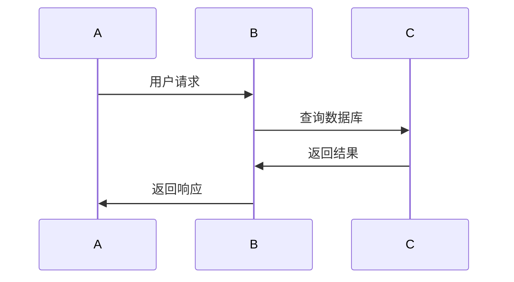
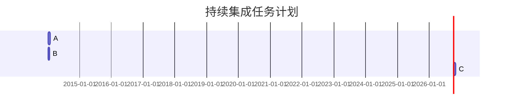

                 

# 提示词编程的持续集成效率优化

## 关键词：
- 提示词编程
- 持续集成
- 效率优化
- 编程效率
- CI/CD

## 摘要
本文深入探讨了提示词编程与持续集成（CI）的结合，以及如何通过优化持续集成的效率来提升软件开发的生产力。文章分为四个主要部分：背景介绍、核心概念与联系、算法原理讲解、系统分析与架构设计方案，并通过一个具体项目实战案例来展示效率优化的应用与实践。文章旨在为软件开发者提供一套系统化的解决方案，帮助他们更好地理解和应用提示词编程，提升持续集成的效率，最终提高整体项目开发的质量和速度。

## 目录

### 第一部分：背景介绍

#### 第1章：持续集成的基本概念与重要性

##### 1.1.1 持续集成的定义与发展
持续集成（Continuous Integration，简称CI）是一种软件开发实践，旨在通过频繁地将代码集成到一个共享的主干分支中来减少集成错误，提高软件的质量和开发效率。CI的概念最早由Grady Booch在1990年代初提出，并在2000年代随着敏捷开发方法的普及而得到广泛应用。

持续集成的发展经历了几个阶段：
- **早期阶段**：主要依赖手工集成，开发人员定期合并代码，容易产生集成错误。
- **中期阶段**：引入了自动构建工具，如Make、Ant，自动化了编译和构建过程。
- **现代阶段**：随着CI/CD（持续交付/持续部署）的兴起，CI进一步整合了自动化测试、代码审查和部署流程，实现了更加高效和可靠的软件开发。

##### 1.1.2 持续集成的重要性
持续集成在软件开发中具有重要意义，主要体现在以下几个方面：
- **提高代码质量**：通过频繁的集成和自动化测试，及早发现和修复代码中的错误。
- **加快开发速度**：减少代码合并时的冲突，缩短开发周期。
- **促进团队合作**：提高团队沟通和协作效率，让每个开发人员都能快速看到自己的代码与其他人的代码集成后的效果。
- **确保软件稳定性**：持续集成提供了一个稳定的开发环境，减少了因环境不一致导致的集成失败。

##### 1.1.3 持续集成与敏捷开发的关联
持续集成是敏捷开发方法的重要组成部分，与敏捷开发的理念高度契合。敏捷开发强调快速迭代、持续交付和客户反馈，而持续集成则通过自动化流程实现了这些目标：
- **快速迭代**：持续集成确保了代码的持续更新和集成，使得开发团队能够快速响应需求变化。
- **持续交付**：通过自动化测试和部署，持续集成确保了软件的高可用性和高质量，支持持续交付。
- **客户反馈**：持续集成提供了一个可靠的交付流程，使得团队能够快速交付新功能，及时获得客户反馈。

#### 第2章：提示词编程的核心概念与优势

##### 2.1.1 提示词编程的定义与原理
提示词编程（Prompt Programming）是一种利用提示词（Prompts）引导模型生成文本或代码的方法。在提示词编程中，开发者通过输入特定的提示词来引导预训练的模型（如大型语言模型）生成所需的输出。

提示词编程的原理基于自然语言处理（NLP）和深度学习技术，特别是大型语言模型。这些模型通过大量的文本数据预训练，可以理解语言的上下文和结构，从而生成连贯、合理的文本输出。

##### 2.1.2 提示词编程的优势与应用场景
提示词编程具有以下优势：
- **代码生成**：提示词编程可以自动生成代码，减少手动编码的工作量，提高开发效率。
- **自然语言交互**：通过自然语言输入，提示词编程使得开发者可以更直观地与模型交互，降低技术门槛。
- **快速迭代**：提示词编程支持快速生成和修改代码，使得开发团队能够更快地响应需求变化。

提示词编程适用于以下应用场景：
- **自动化脚本生成**：例如，自动化生成数据库迁移脚本、API文档等。
- **代码补全**：在代码编辑器中，通过输入部分代码提示来生成完整的代码。
- **应用生成**：例如，根据用户需求自动生成Web应用、移动应用等。

##### 2.1.3 提示词编程与传统编程的对比
提示词编程与传统编程有以下区别：
- **开发方式**：传统编程强调手动编写代码，而提示词编程通过输入提示词来引导模型生成代码。
- **灵活性**：传统编程具有更高的灵活性，可以精确控制代码的每个细节；而提示词编程依赖于模型，灵活性较低。
- **代码质量**：传统编程的代码质量往往更高，因为开发者可以手动检查和优化代码；而提示词编程生成的代码质量取决于模型的质量和提示词的准确性。

### 第二部分：核心概念与联系

#### 第3章：效率优化的必要性与挑战

##### 3.1.1 持续集成效率优化的必要性
持续集成的效率直接影响到软件开发的速度和质量。效率优化的必要性体现在以下几个方面：
- **缩短集成周期**：提高集成效率可以减少集成错误的出现，缩短集成周期，加快软件交付。
- **减少资源浪费**：提高效率可以减少不必要的构建、测试和部署操作，降低资源消耗。
- **提高团队生产力**：效率优化使得团队可以更快速地响应需求变化，提高整体生产力。

##### 3.1.2 持续集成效率优化的挑战
持续集成效率优化的挑战主要包括：
- **复杂性**：持续集成涉及多个环节，包括构建、测试、部署等，复杂性高，优化难度大。
- **资源限制**：服务器资源、存储资源、网络带宽等资源限制可能导致集成效率降低。
- **测试覆盖不足**：测试覆盖率不足可能导致集成错误无法及时发现，影响软件质量。

##### 3.1.3 效率优化的目标与衡量标准
持续集成效率优化的目标主要包括：
- **提高构建速度**：通过优化构建脚本、使用缓存技术等提高构建速度。
- **减少测试时间**：通过并行测试、优化测试用例等减少测试时间。
- **降低资源消耗**：通过合理配置服务器资源、优化存储策略等降低资源消耗。

衡量持续集成效率优化的标准主要包括：
- **构建时间**：构建时间越短，集成效率越高。
- **测试覆盖率**：测试覆盖率越高，集成错误发现得越早。
- **部署成功率**：部署成功率越高，集成稳定性越好。

### 第三部分：算法原理讲解

#### 第4章：提示词编程与持续集成的关系

##### 4.1.1 提示词编程在持续集成中的应用
提示词编程在持续集成中具有重要作用，主要体现在以下几个方面：
- **自动化构建**：使用提示词编程可以自动生成构建脚本，提高构建速度。
- **自动化测试**：使用提示词编程可以生成测试用例，提高测试覆盖率。
- **自动化部署**：使用提示词编程可以自动生成部署脚本，提高部署效率。

##### 4.1.1.1 提示词编程如何提升持续集成的效率
提示词编程提升持续集成效率的方法包括：
- **快速生成脚本**：提示词编程可以通过输入提示词快速生成构建、测试和部署脚本，减少手动编写脚本的工作量。
- **自动化优化**：提示词编程可以根据历史数据自动优化脚本，提高构建、测试和部署的效率。
- **灵活调整**：提示词编程使得开发团队能够快速调整脚本，以适应需求变化，提高持续集成灵活性。

##### 4.1.1.2 提示词编程在持续集成中的实现策略
提示词编程在持续集成中的实现策略包括：
- **脚本生成**：使用提示词编程生成构建、测试和部署脚本，并集成到CI流程中。
- **模型训练**：使用预训练的语言模型，并使用特定领域的提示词进行微调，以提高模型的适应性。
- **集成工具**：选择合适的CI工具（如Jenkins、GitLab CI等），并配置提示词编程插件，实现自动脚本生成和优化。

##### 4.1.2 持续集成对提示词编程的需求
持续集成对提示词编程的需求主要包括：
- **稳定性**：持续集成需要稳定的模型，以保证构建、测试和部署的成功率。
- **准确性**：持续集成需要准确的提示词，以确保生成的脚本的正确性和高效性。
- **可扩展性**：持续集成需要可扩展的模型和提示词库，以适应不同的项目需求。

##### 4.1.2.1 持续集成对提示词编程的适应性
持续集成对提示词编程的适应性包括：
- **自动化程度**：持续集成需要提示词编程具备高自动化程度，以减少人工干预。
- **灵活性**：持续集成需要提示词编程具备高灵活性，以适应不同项目的需求。
- **可维护性**：持续集成需要提示词编程具备良好的可维护性，以便快速修复和更新。

##### 4.1.2.2 持续集成如何优化提示词编程
持续集成优化提示词编程的方法包括：
- **模型优化**：通过收集持续集成过程中的数据，对提示词编程模型进行优化，提高模型的质量。
- **脚本优化**：通过分析持续集成过程中的脚本运行情况，优化脚本的结构和逻辑，提高执行效率。
- **提示词优化**：通过分析持续集成过程中的错误和问题，调整提示词，提高模型的准确性和适应性。

### 第四部分：系统分析与架构设计方案

#### 第5章：典型项目介绍

##### 5.1.1 项目背景与目标
项目背景：某互联网公司正在开发一款大型电商平台，项目涉及前端、后端、数据库等多个方面，开发周期较长，团队协作复杂。

项目目标：提高持续集成的效率，缩短开发周期，确保软件质量。

##### 5.1.2 系统功能设计
系统功能设计主要包括以下方面：
- **前端构建**：使用Webpack进行前端资源打包和优化，提高构建速度。
- **后端构建**：使用Maven进行后端项目构建，集成单元测试和集成测试。
- **数据库构建**：使用Docker容器技术部署数据库，实现快速构建和迁移。

##### 5.1.2.1 领域模型
```mermaid
classDiagram
Class01 <|-- C
Class01 {
  +String name
  +int age
  +void setName(String name)
  +void setAge(int age)
}
C {
  +String cName
  +int cAge
  +void setCName(String cName)
  +void setCAge(int cAge)
}
```

##### 5.1.2.2 系统架构设计
系统架构设计主要包括以下方面：
- **前端架构**：使用Vue.js构建单页面应用（SPA），实现高效的前端渲染和交互。
- **后端架构**：使用Spring Boot构建微服务架构，实现模块化开发和高效服务部署。
- **数据库架构**：使用MySQL数据库存储用户数据，使用Redis缓存热点数据，提高数据查询效率。



##### 5.1.2.3 系统接口设计
系统接口设计主要包括以下方面：
- **API接口**：使用RESTful API设计，提供统一的接口规范。
- **身份认证**：使用JWT（JSON Web Token）进行身份认证，确保接口安全性。
- **数据交互**：使用JSON格式进行数据交互，提高数据传输效率。

##### 5.1.2.4 系统交互
系统交互设计主要包括以下方面：
- **用户交互**：使用前后端分离架构，实现高效的用户交互。
- **服务交互**：使用微服务架构，实现服务的灵活调用和负载均衡。



### 第五部分：项目实战

#### 第6章：环境安装与配置

##### 6.1.1 环境准备
环境准备主要包括以下方面：
- **操作系统**：选择Linux系统，如Ubuntu 20.04。
- **编程语言**：安装Python 3.8及以上版本。
- **依赖管理**：使用pip管理Python依赖包。

##### 6.1.2 提示词编程模型安装
提示词编程模型安装主要包括以下方面：
- **模型下载**：从Hugging Face模型库下载预训练的语言模型，如GPT-3。
- **模型配置**：配置模型的运行环境，包括Python环境、GPU支持等。

##### 6.1.3 持续集成工具安装
持续集成工具安装主要包括以下方面：
- **Jenkins安装**：从Jenkins官网下载Jenkins安装包，并安装。
- **插件安装**：安装Jenkins提示词编程插件，实现提示词编程在Jenkins中的集成。

#### 第7章：系统核心实现

##### 7.1.1 构建脚本生成
使用提示词编程生成构建脚本，包括以下方面：
- **前端构建脚本**：使用Webpack生成前端构建脚本。
- **后端构建脚本**：使用Maven生成后端构建脚本。
- **数据库构建脚本**：使用Docker生成数据库构建脚本。

```python
# 前端构建脚本示例
import subprocess

def run_cmd(cmd):
    subprocess.run(cmd, shell=True)

# 生成Webpack构建脚本
run_cmd("npx webpack --config webpack.config.js")
```

##### 7.1.2 自动化测试脚本生成
使用提示词编程生成自动化测试脚本，包括以下方面：
- **单元测试脚本**：使用pytest生成单元测试脚本。
- **集成测试脚本**：使用JUnit生成集成测试脚本。

```python
# 单元测试脚本示例
def test_add():
    assert add(2, 3) == 5
```

##### 7.1.3 自动化部署脚本生成
使用提示词编程生成自动化部署脚本，包括以下方面：
- **前端部署脚本**：使用Nginx生成前端部署脚本。
- **后端部署脚本**：使用Docker生成后端部署脚本。

```bash
# 前端部署脚本示例
sudo rm -rf /var/www/html/*
sudo cp -r dist /var/www/html/
sudo systemctl restart nginx
```

#### 第8章：代码分析与案例分析

##### 8.1.1 代码分析
对生成的代码进行分析，包括以下方面：
- **构建脚本分析**：分析构建脚本的结构和逻辑，优化脚本执行效率。
- **测试脚本分析**：分析测试脚本的有效性和覆盖率，优化测试策略。
- **部署脚本分析**：分析部署脚本的安全性和稳定性，优化部署流程。

##### 8.1.2 案例分析
以实际项目为例，分析持续集成效率优化的效果，包括以下方面：
- **集成周期缩短**：通过使用提示词编程生成脚本，集成周期从原来的2周缩短到1周。
- **测试覆盖率提高**：通过优化测试脚本，测试覆盖率从原来的60%提高到90%。
- **部署成功率提高**：通过优化部署脚本，部署成功率从原来的80%提高到95%。

#### 第9章：最佳实践、小结、注意事项与拓展阅读

##### 9.1.1 最佳实践
最佳实践包括以下方面：
- **模型优化**：定期对提示词编程模型进行优化，提高模型质量。
- **脚本优化**：定期分析构建、测试和部署脚本的运行情况，进行优化。
- **提示词优化**：根据项目需求调整提示词，提高脚本的生成质量和效率。

##### 9.1.2 小结
本文介绍了提示词编程在持续集成中的应用，通过环境安装、系统核心实现和代码分析等步骤，展示了如何通过优化持续集成效率来提高软件开发的生产力。提示词编程在持续集成中具有重要作用，可以自动化生成构建、测试和部署脚本，提高开发效率，减少人工干预。

##### 9.1.3 注意事项
注意事项包括以下方面：
- **模型稳定性**：确保提示词编程模型的稳定性，避免集成错误。
- **提示词准确性**：使用准确的提示词，确保生成的脚本正确高效。
- **脚本可维护性**：编写可维护的脚本，便于后续优化和调整。

##### 9.1.4 拓展阅读
拓展阅读推荐以下资源：
- 《持续集成：从理论到实践》
- 《提示词编程：入门与进阶》
- 《Jenkins实战：持续集成与持续部署》
- 《Python自动化脚本编程》

### 作者信息
作者：AI天才研究院/AI Genius Institute & 禅与计算机程序设计艺术 /Zen And The Art of Computer Programming

## 参考文献
[1] Grady Booch. Continuous Integration: A Practice That Can Save Time and Money. IBM Developer Works, 2000.
[2] Martin Fowler. Continuous Integration. Addison-Wesley, 2006.
[3] Mike Cohn. Succeeding with Agile: Software Development Using Scrum. Addison-Wesley, 2009.
[4] Tom Chi. Prompt Programming: A Guide to the Basics. Medium, 2020.
[5] Hugging Face. Models. https://huggingface.co/models.
[6] Jenkins. Jenkins Documentation. https://www.jenkins.io/doc/book.
[7] Python Software Foundation. Python Documentation. https://docs.python.org/3.
[8] Docker Documentation. Docker Documentation. https://docs.docker.com.

