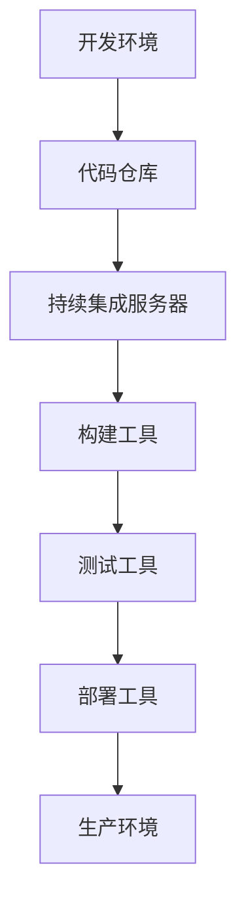

                 

### 提示词编程的持续集成管道优化

#### 关键词：持续集成、提示词编程、管道优化、DevOps、自动化测试、持续反馈

> 摘要：本文将探讨持续集成管道优化与提示词编程的结合，通过详细的理论讲解、系统架构设计与实战案例，阐述如何利用提示词编程技术提升持续集成管道的效率与可靠性，实现高效、智能的软件交付过程。

## 引言

在当今的软件开发领域，持续集成（CI）作为一种最佳实践，已成为保证软件质量、加速开发周期和提高团队协作效率的重要手段。持续集成管道则是由一系列自动化构建、测试、部署任务构成的复杂系统，它承担着将代码变更快速、安全地集成到主分支的重要职责。然而，随着项目的规模和复杂度的增加，传统的持续集成管道面临着效率低下、可靠性差和可维护性差等问题。

为了应对这些挑战，本文提出将提示词编程（a type of natural language processing）技术引入持续集成管道，通过智能化的自动化测试、代码分析和持续反馈，优化管道的性能，提升其稳定性和可扩展性。本文将从以下几个方面展开：

1. **持续集成管道基础**：介绍持续集成的基本原理和常用工具。
2. **提示词编程基础**：阐述提示词编程的概念、特点及其应用场景。
3. **提示词编程与持续集成管道的结合**：探讨提示词编程在持续集成管道中的角色和策略。
4. **实战：构建优化持续集成管道**：通过具体案例，展示如何实现持续集成管道的优化。
5. **最佳实践与总结**：总结最佳实践，探讨面临的挑战与未来展望。

通过本文的深入探讨，希望能够为开发者提供一套切实可行的持续集成管道优化方案，助力团队实现高效、智能的软件交付。

## 第一部分：引言

### 1.1 书籍背景

#### 1.1.1 持续集成管道的概念

持续集成（Continuous Integration，简称CI）是一种软件开发最佳实践，旨在通过频繁地将开发者提交的代码变更合并到主分支，并快速执行一系列自动化构建、测试和部署任务，以确保代码库始终处于可集成和可运行状态。持续集成管道（CI Pipeline）则是实现这一目标的技术实现，它由一系列自动化任务构成，包括代码检查、编译、单元测试、集成测试、部署等环节。

持续集成管道的起源可以追溯到软件开发方法论的演变。早期，软件开发采用传统的瀑布模型，开发、测试和部署是顺序进行的，这导致在项目后期出现大量的问题和变更，严重影响了开发效率和软件质量。随着敏捷开发的兴起，持续集成成为敏捷实践中不可或缺的一部分。敏捷开发强调快速反馈和持续改进，持续集成则通过自动化测试和快速反馈，确保每次代码变更都能顺利集成并稳定运行。

#### 1.1.2 持续集成管道的演变与挑战

持续集成管道的概念和技术不断发展，经历了多个阶段：

- **初始阶段**：开发者使用本地环境手动执行构建和测试任务，缺乏自动化。
- **自动化阶段**：引入了自动化构建和测试工具，如Make、Ant等，实现了部分自动化。
- **集成阶段**：出现了专门的持续集成工具，如Hudson、Jenkins等，将构建、测试和部署任务集成到一个统一的平台上。
- **智能化阶段**：随着人工智能技术的发展，持续集成管道开始引入智能化的元素，如自动化测试用例生成、静态代码分析等。

尽管持续集成管道在提高软件开发效率和质量方面取得了显著成效，但也面临一些挑战：

- **复杂性**：持续集成管道涉及多个环节和工具，需要复杂配置和管理。
- **可靠性**：自动化任务的不稳定性可能导致管道中断，影响项目的正常进度。
- **可维护性**：随着项目的规模和复杂性增加，持续集成管道的维护变得越来越困难。
- **安全性**：持续集成管道中的代码和数据安全风险需要特别关注。

#### 1.1.3 持续集成管道的重要性

持续集成管道在软件开发过程中扮演着至关重要的角色，具体体现在以下几个方面：

- **确保代码质量**：通过自动化测试和代码审查，持续集成管道能够快速发现和修复代码缺陷，确保代码库的稳定性。
- **加速开发周期**：频繁的代码集成和快速反馈，使得开发团队能够更早地发现问题并进行调整，缩短开发周期。
- **提高团队协作效率**：持续集成管道提供了一个统一的平台，使团队能够协同工作，提高协作效率。
- **增强软件可靠性**：持续集成管道通过自动化测试和部署，确保每次代码变更都能顺利集成并稳定运行，提高软件的可靠性。

### 1.2 读者对象

本文面向软件开发人员、持续集成工程师、DevOps工程师等对持续集成和提示词编程技术感兴趣的读者。读者应具备以下基础：

- 熟悉软件开发的基本流程和常用工具。
- 掌握持续集成的基本原理和实践。
- 对人工智能和提示词编程有初步了解。

通过本文的学习，读者将能够：

- 理解持续集成管道优化的概念和重要性。
- 掌握提示词编程在持续集成管道中的应用。
- 学习如何构建和优化持续集成管道，提升软件开发效率。

### 1.3 书籍结构

本文将分为七个主要部分：

1. **引言**：介绍持续集成管道的概念、背景和重要性。
2. **持续集成管道基础**：讲解持续集成的基本原理和常用工具。
3. **提示词编程基础**：介绍提示词编程的概念、特点和应用场景。
4. **提示词编程与持续集成管道的结合**：探讨提示词编程在持续集成管道中的应用策略。
5. **实战：构建优化持续集成管道**：通过具体案例展示持续集成管道的优化过程。
6. **最佳实践与总结**：总结最佳实践，探讨面临的挑战与未来展望。
7. **拓展阅读**：提供进一步学习的资源和建议。

## 第二部分：持续集成管道基础

### 2.1 持续集成的原理

持续集成是一种软件开发方法，其核心思想是通过频繁地将代码变更合并到主分支，并立即执行一系列自动化测试和构建任务，以确保代码库始终处于稳定和可运行状态。持续集成的原理可以概括为以下几个关键点：

1. **频繁提交**：开发者将代码变更频繁地提交到版本控制系统，通常采用每日多次的频率。
2. **自动化构建**：每次提交后，自动化工具会自动执行构建任务，包括编译、打包、构建依赖等，确保代码库中的每个提交都是可构建的。
3. **自动化测试**：在构建完成后，自动化测试工具会执行一系列单元测试、集成测试和性能测试，验证代码的正确性和稳定性。
4. **反馈机制**：测试结果会立即反馈给开发者和相关团队，帮助快速发现和修复问题。
5. **持续部署**：如果所有测试通过，持续集成管道将自动执行部署任务，将代码变更部署到生产环境。

持续集成的关键目标包括：

- **确保代码质量**：通过自动化测试和反馈机制，及时发现和修复代码缺陷，确保代码库的稳定性。
- **加速开发周期**：频繁的集成和快速反馈，使团队能够更早地发现问题并进行调整，缩短开发周期。
- **提高团队协作效率**：持续集成提供了一个统一的平台，使团队能够更好地协作，提高工作效率。
- **增强软件可靠性**：持续集成确保每次代码变更都能顺利集成并稳定运行，提高软件的可靠性。

### 2.2 持续集成工具

持续集成工具是实施持续集成方法的重要载体，常用的持续集成工具有以下几种：

#### 2.2.1 Jenkins

Jenkins 是一款流行的开源持续集成工具，由甲骨文公司赞助。Jenkins 支持多种插件，可以轻松集成各种构建工具和测试工具，实现自动化构建、测试和部署。Jenkins 的主要特点包括：

- **高度可定制**：Jenkins 支持多种构建脚本和工具，可以灵活地实现各种自动化任务。
- **丰富的插件生态**：Jenkins 拥有丰富的插件库，可以扩展其功能，满足不同项目的需求。
- **易于集成**：Jenkins 可以与各种版本控制系统、部署平台和监控工具集成。

#### 2.2.2 GitLab CI/CD

GitLab CI/CD 是 GitLab 提供的持续集成和持续部署服务。GitLab CI/CD 支持多种编程语言和框架，可以自动化执行构建、测试和部署任务。其主要特点包括：

- **集成在 GitLab 中**：GitLab CI/CD 是 GitLab 平台的组成部分，可以与 GitLab 的其他功能无缝集成。
- **易于配置**：GitLab CI/CD 使用 .gitlab-ci.yml 文件配置持续集成流程，简洁直观。
- **多环境支持**：GitLab CI/CD 支持多环境部署，可以方便地在不同环境中进行测试和部署。

#### 2.2.3 GitHub Actions

GitHub Actions 是 GitHub 提供的持续集成和持续部署服务。GitHub Actions 支持多种编程语言和框架，可以自动化执行构建、测试和部署任务。其主要特点包括：

- **集成在 GitHub 中**：GitHub Actions 是 GitHub 平台的组成部分，可以与 GitHub 的其他功能无缝集成。
- **易于配置**：GitHub Actions 使用 .github/workflows/ 文件夹中的 YAML 文件配置持续集成流程，简洁直观。
- **多环境支持**：GitHub Actions 支持多环境部署，可以方便地在不同环境中进行测试和部署。

### 2.3 持续集成管道的设计与实现

持续集成管道的设计与实现是持续集成实践的核心。一个高效的持续集成管道需要考虑以下几个方面：

1. **管道架构**：确定持续集成管道的架构，包括构建阶段、测试阶段和部署阶段。
2. **任务划分**：将构建、测试和部署任务分解为多个具体步骤，确保每个步骤都能自动化执行。
3. **自动化脚本**：编写自动化脚本，实现每个任务的自动化执行。
4. **监控与报警**：设置监控和报警机制，及时发现和解决管道中的问题。
5. **代码库管理**：确保代码库的安全和稳定，避免代码冲突和错误。

在实际应用中，持续集成管道的设计与实现需要根据项目的具体需求和团队的实际情况进行灵活调整。通过合理的设计和实现，持续集成管道可以显著提高开发效率和质量，助力团队实现高效、智能的软件交付。

### 3. 持续集成管道设计

持续集成管道的设计是确保代码库稳定性和质量的关键环节。一个高效的持续集成管道需要综合考虑代码质量、测试覆盖率、部署流程等多个方面。以下是一些设计原则和步骤：

#### 3.1 流水线模型

持续集成管道的流水线模型可以分为单向流水线、双向流水线和多向流水线三种类型：

1. **单向流水线**：每次代码提交都依次通过构建、测试和部署阶段，每个阶段结束后才能进入下一个阶段。单向流水线结构简单，易于理解和维护，但可能会导致测试和部署延迟。
   
   ```mermaid
   graph TD
   A[提交] --> B[构建]
   B --> C[测试]
   C --> D[部署]
   ```

2. **双向流水线**：在部署前增加一个回滚阶段，如果部署后出现问题，可以快速回滚到上一版本。双向流水线提高了部署的可靠性，但增加了管道的复杂度。
   
   ```mermaid
   graph TD
   A[提交] --> B[构建]
   B --> C[测试]
   C --> D[部署]
   D --> E[回滚]
   ```

3. **多向流水线**：根据不同的部署环境和测试阶段，设置多个分支流水线，例如生产环境流水线和预发布环境流水线。多向流水线提高了灵活性和并行性，但增加了配置和管理的复杂度。
   
   ```mermaid
   graph TD
   A[提交]
   A --> B1[构建-生产]
   A --> B2[构建-预发布]
   B1 --> C1[测试-生产]
   B2 --> C2[测试-预发布]
   C1 --> D1[部署-生产]
   C2 --> D2[部署-预发布]
   ```

#### 3.2 管道阶段

持续集成管道通常分为以下几个阶段：

1. **构建阶段**：编译源代码、打包依赖、生成构建产物。此阶段需要确保代码库中的每个提交都是可构建的。
   
   ```mermaid
   graph TD
   A[提交] --> B[构建]
   ```

2. **测试阶段**：执行单元测试、集成测试、性能测试等，验证代码的正确性和稳定性。此阶段需要覆盖尽可能多的测试场景，提高测试覆盖率。
   
   ```mermaid
   graph TD
   B[构建] --> C[测试]
   ```

3. **部署阶段**：将测试通过后的代码部署到不同的环境，例如开发环境、预发布环境和生产环境。此阶段需要确保部署过程自动化，减少人工干预。
   
   ```mermaid
   graph TD
   C[测试] --> D[部署]
   ```

4. **反馈阶段**：将测试结果和部署状态反馈给开发者和相关团队，帮助快速发现和解决问题。此阶段需要确保反馈机制高效可靠。

   ```mermaid
   graph TD
   D[部署] --> E[反馈]
   ```

### 3.3 管道配置与实现

持续集成管道的配置与实现通常涉及以下步骤：

1. **环境搭建**：搭建持续集成环境，安装所需工具和插件，配置版本控制系统。
   
   ```mermaid
   graph TD
   A[环境搭建]
   ```

2. **任务定义**：定义构建、测试和部署任务，编写自动化脚本或配置文件，确保每个任务都能自动化执行。
   
   ```mermaid
   graph TD
   A --> B[任务定义]
   ```

3. **流水线配置**：配置流水线模型，将任务组织到不同的阶段，确保流水线的逻辑和流程符合项目需求。
   
   ```mermaid
   graph TD
   B --> C[流水线配置]
   ```

4. **监控与报警**：设置监控和报警机制，监控管道的运行状态和健康指标，及时发现和解决问题。
   
   ```mermaid
   graph TD
   C --> D[监控与报警]
   ```

5. **持续优化**：根据项目的实际情况和反馈，不断优化持续集成管道，提高其效率和可靠性。
   
   ```mermaid
   graph TD
   D --> E[持续优化]
   ```

通过以上步骤，可以构建一个高效的持续集成管道，确保代码库的稳定性和质量，提高开发团队的协作效率和软件交付速度。

### 4. 提示词编程基础

#### 4.1 提示词编程的概念

提示词编程（Prompt-Based Programming）是一种基于自然语言处理（Natural Language Processing，NLP）的编程方法，它利用预训练的神经网络模型（如GPT、BERT等）来生成代码。提示词编程的核心思想是通过输入一个自然语言的提示（prompt），模型能够理解并生成相应的代码。这种方法突破了传统编程语言的限制，使编程更加自然、直观。

#### 4.1.1 提示词编程的定义

提示词编程可以定义为：利用预训练的语言模型，通过输入自然语言提示来生成代码的编程方法。具体来说，它包括以下几个关键组成部分：

- **预训练模型**：通常是基于大规模语料库训练的神经网络模型，如GPT-3、BERT等。
- **提示（Prompt）**：输入的自然语言描述，用于指导模型生成代码。提示可以是用户输入的句子或文本片段。
- **代码生成**：模型根据提示生成相应的代码，可以是完整的程序、函数或代码片段。

#### 4.1.2 提示词编程的特点

提示词编程具有以下显著特点：

- **自然语言交互**：用户可以通过自然语言与模型进行交互，无需学习复杂的编程语言和语法规则。
- **高效率**：提示词编程能够快速生成代码，减少手动编写代码的时间，提高开发效率。
- **灵活性**：模型可以根据不同的提示生成不同类型的代码，适用于各种编程任务和场景。
- **智能化**：预训练模型能够理解自然语言的语义和上下文，生成代码更加准确和可靠。

#### 4.1.3 提示词编程的应用场景

提示词编程在多个领域和场景中展现了其强大的应用潜力：

- **代码自动生成**：利用提示词编程，可以自动生成常见的代码片段，如数据库查询、数据处理等。
- **代码补全**：在编写代码时，提示词编程可以预测接下来的代码，提供自动补全功能，减少错误和重复劳动。
- **代码优化**：模型可以分析现有代码，提供优化建议，提高代码的可读性和性能。
- **编程教育**：提示词编程可以用于编程教育，帮助初学者快速掌握编程技能，降低学习难度。
- **自动化测试**：提示词编程可以生成测试用例，提高测试的覆盖率和准确性。

通过以上特点和应用场景，提示词编程为软件开发带来了新的机遇和挑战。在未来，随着技术的不断进步和应用的深入，提示词编程有望在多个领域发挥重要作用，推动软件开发的变革。

#### 4.2 提示词编程工具

随着提示词编程技术的发展，涌现出了多种实用的工具，这些工具使得开发者能够更加便捷地利用自然语言生成代码。以下是一些主流的提示词编程工具：

#### 4.2.1 ChatGPT

ChatGPT 是由 OpenAI 开发的一种基于 GPT-3 模型的自然语言处理工具。它通过输入自然语言提示，能够生成高质量、结构化的代码。ChatGPT 的主要特点包括：

- **高效率**：ChatGPT 能够快速生成代码，大大减少了手动编写代码的时间。
- **灵活性**：支持多种编程语言，包括 Python、JavaScript、Java 等。
- **智能化**：ChatGPT 可以理解复杂的编程任务，生成准确的代码。

ChatGPT 在实际应用中，可以用于以下场景：

- **代码补全**：在编写代码时，ChatGPT 可以预测接下来的代码，提供自动补全功能。
- **代码生成**：通过输入自然语言描述，ChatGPT 可以生成完整的代码，包括复杂的业务逻辑和算法实现。

#### 4.2.2 ChatGLM

ChatGLM 是由清华大学 KEG 实验室和智谱AI开发的一种自然语言处理工具，它基于 GLM-4 模型，支持多种编程语言。ChatGLM 的主要特点包括：

- **高效性**：ChatGLM 能够快速响应，生成高质量的代码。
- **多语言支持**：支持 Python、Java、C++、JavaScript等多种编程语言。
- **友好界面**：ChatGLM 提供了简洁的图形界面，方便用户输入提示和查看生成的代码。

ChatGLM 在实际应用中，可以用于以下场景：

- **代码审核**：通过输入代码片段，ChatGLM 可以提供代码审核和建议，提高代码质量。
- **代码生成**：通过自然语言描述，ChatGLM 可以生成相应的代码，辅助开发者完成编程任务。

#### 4.2.3 其他提示词编程工具

除了 ChatGPT 和 ChatGLM，市场上还有许多其他的提示词编程工具，如：

- **CodeGeeX**：一种基于深度学习的代码生成工具，支持多种编程语言。
- **CodeXGLM**：基于 GLM-4 模型的代码生成工具，支持多种编程语言和开发环境。
- **DeepCode**：一种利用机器学习和自然语言处理技术进行代码理解和优化的工具。

这些工具各有特色，开发者可以根据具体需求选择合适的工具。随着提示词编程技术的不断进步，未来将会有更多强大的工具涌现，为软件开发带来更多便利和创新。

### 5. 提示词编程与持续集成管道的结合

在持续集成（CI）管道中引入提示词编程技术，可以显著提高管道的智能化水平和效率。提示词编程能够在多个环节发挥重要作用，包括自动化测试、静态代码分析、持续反馈等。以下将详细探讨提示词编程在持续集成管道中的应用策略及其优势。

#### 5.1 提示词编程在自动化测试中的角色

自动化测试是持续集成管道中至关重要的一环，它能够快速、准确地验证代码的正确性和稳定性。提示词编程可以通过以下方式在自动化测试中发挥作用：

1. **测试用例生成**：提示词编程模型可以基于自然语言描述生成测试用例，自动完成测试用例的设计和编写。这种方法尤其适用于复杂业务逻辑和需求变更频繁的场景，可以显著减少测试用例编写的时间和工作量。
   
   ```mermaid
   graph TD
   A[需求描述] --> B[生成测试用例]
   B --> C[执行测试用例]
   ```

2. **测试用例优化**：提示词编程模型可以分析现有测试用例，提供优化建议，提高测试用例的覆盖率和准确性。通过对测试用例的优化，可以更好地发现潜在的问题，提高测试质量。

3. **测试执行**：在执行测试用例时，提示词编程模型可以根据测试结果动态调整测试策略，如选择不同的测试路径、调整测试数据等，提高测试效率。

#### 5.2 提示词编程在静态代码分析中的应用

静态代码分析是持续集成管道中用于检测代码质量和安全性的重要手段。提示词编程可以通过以下方式在静态代码分析中发挥作用：

1. **代码审查**：提示词编程模型可以自动分析代码，提供代码审查报告，包括代码风格、代码逻辑、潜在的安全漏洞等。这种方法可以快速发现代码中的问题，帮助开发者及时进行修复。

2. **代码优化**：提示词编程模型可以分析代码，提供优化建议，如代码重构、性能优化等。通过对代码的优化，可以提高代码的可读性、可维护性和运行效率。

3. **代码安全检测**：提示词编程模型可以检测代码中的安全漏洞，提供安全报告。通过及时发现和修复安全漏洞，可以显著提高软件的安全性。

#### 5.3 持续反馈

持续反馈是持续集成管道的重要组成部分，它通过实时监控代码库的状态，向开发者和相关团队提供关键信息，帮助团队快速响应和解决问题。提示词编程可以通过以下方式提供持续反馈：

1. **错误报告生成**：提示词编程模型可以自动生成错误报告，包括错误描述、原因分析和修复建议。这种报告可以帮助开发者快速定位问题，减少问题排查的时间。

2. **反馈机制优化**：提示词编程模型可以分析反馈数据，提供优化建议，如调整测试策略、优化部署流程等。通过持续优化反馈机制，可以提高持续集成管道的整体效率。

3. **实时监控**：提示词编程模型可以实时监控代码库的状态，包括代码提交频率、测试覆盖率、部署进度等，提供实时反馈。这种实时监控可以帮助团队更好地掌握项目状态，及时调整资源分配和工作计划。

#### 5.4 结合策略

将提示词编程与持续集成管道相结合，需要考虑以下几个策略：

1. **集成工具的选择**：选择支持提示词编程的持续集成工具，如 Jenkins、GitLab CI/CD 等，确保工具能够与提示词编程模型无缝集成。

2. **模型训练与优化**：根据项目的具体需求和场景，选择合适的提示词编程模型，并进行训练和优化，提高模型在代码生成、测试用例生成等任务中的表现。

3. **流程设计**：在设计持续集成管道时，将提示词编程工具集成到各个阶段，确保模型能够高效地参与测试、代码分析和反馈等任务。

4. **自动化脚本**：编写自动化脚本，实现提示词编程模型与其他持续集成工具的交互，确保模型能够自动化执行任务。

5. **安全与隐私**：在应用提示词编程时，关注数据安全和隐私保护，确保输入和输出数据的安全。

通过以上策略，可以充分发挥提示词编程在持续集成管道中的作用，提高管道的智能化水平和效率，实现高效、智能的软件交付。

### 6. 实战：构建优化持续集成管道

#### 6.1 项目背景

为了提高软件项目的开发效率和代码质量，我们决定构建一个优化的持续集成管道。该项目的目标是通过自动化构建、测试和部署流程，确保代码库始终处于稳定和可运行状态。同时，我们引入提示词编程技术，提升管道的智能化水平，提高测试和代码分析的效率。

#### 6.1.1 项目需求

1. **自动化构建**：实现代码的自动化构建，包括编译、打包和依赖管理。
2. **自动化测试**：实现单元测试、集成测试和性能测试，确保代码的正确性和稳定性。
3. **持续反馈**：提供实时反馈机制，包括错误报告和反馈机制优化。
4. **部署**：实现自动化部署，确保代码变更能够快速、安全地部署到生产环境。

#### 6.1.2 项目目标

- **提高开发效率**：通过自动化流程，减少手动操作，提高开发团队的效率。
- **确保代码质量**：通过自动化测试和反馈机制，提高代码质量，减少缺陷和漏洞。
- **提高可靠性**：确保代码变更能够顺利集成和部署，提高软件的可靠性。
- **降低维护成本**：通过优化管道，减少维护工作量，降低维护成本。

#### 6.2 系统架构设计

为了实现项目的目标，我们设计了以下系统架构：

##### 6.2.1 系统架构图



##### 6.2.2 系统接口设计

系统接口设计主要包括以下部分：

- **代码仓库接口**：用于与 Git 代码仓库进行交互，实现代码的提交、拉取和分支管理。
- **构建工具接口**：用于与构建工具（如 Maven、Gradle）进行交互，实现代码的编译和依赖管理。
- **测试工具接口**：用于与测试工具（如JUnit、TestNG）进行交互，实现单元测试、集成测试和性能测试。
- **部署工具接口**：用于与部署工具（如Docker、Kubernetes）进行交互，实现代码的部署和管理。

##### 6.2.3 系统交互设计

系统交互设计主要包括以下流程：

1. **代码提交**：开发者将代码提交到 Git 代码仓库。
2. **触发构建**：代码提交后，持续集成服务器触发构建任务，执行代码编译和依赖管理。
3. **执行测试**：构建完成后，持续集成服务器执行测试任务，包括单元测试、集成测试和性能测试。
4. **反馈结果**：测试完成后，持续集成服务器将测试结果反馈给开发者和相关团队。
5. **部署代码**：如果测试通过，持续集成服务器将代码部署到生产环境。

#### 6.3 管道配置与实现

为了构建优化的持续集成管道，我们采用了 Jenkins 作为持续集成工具，并结合提示词编程技术。以下是具体的配置和实现步骤：

##### 6.3.1 管道配置

1. **Jenkins 环境搭建**：在服务器上安装 Jenkins，配置必要的插件，如 Git 插件、Maven 插件、JUnit 插件等。
2. **项目配置**：在 Jenkins 中创建一个新的项目，配置代码仓库地址和构建工具，如 Maven。
3. **构建配置**：在构建配置中，添加构建步骤，包括编译代码、安装依赖、运行测试等。
4. **测试配置**：在测试配置中，添加测试步骤，包括执行单元测试、集成测试和性能测试。
5. **部署配置**：在部署配置中，添加部署步骤，包括打包代码、上传到容器镜像仓库、部署到生产环境。

##### 6.3.2 管道实现

1. **代码编译**：使用 Maven 进行代码编译，生成编译后的类文件。
   ```bash
   mvn clean compile
   ```

2. **依赖管理**：使用 Maven 管理项目依赖，确保所有依赖项都正确安装。
   ```bash
   mvn install
   ```

3. **单元测试**：使用 JUnit 执行单元测试，验证代码的正确性。
   ```bash
   mvn test
   ```

4. **集成测试**：执行集成测试，验证模块间的交互和功能。
   ```bash
   mvn verify
   ```

5. **性能测试**：使用性能测试工具（如 JMeter）进行性能测试，评估系统的性能和稳定性。

6. **部署**：使用 Docker 和 Kubernetes 进行代码部署，将容器化应用部署到生产环境。

##### 6.3.3 管道优化

为了优化持续集成管道，我们采取了以下措施：

1. **并行执行**：在 Jenkins 中配置多线程执行，加快构建和测试速度。
2. **缓存机制**：使用 Maven 的缓存机制，减少编译和依赖安装的时间。
3. **自动化测试优化**：优化测试用例，提高测试覆盖率，减少测试时间。
4. **部署优化**：使用 Docker 和 Kubernetes 的滚动更新策略，确保部署过程平稳且不影响生产环境。

通过以上步骤，我们成功构建了一个优化的持续集成管道，实现了自动化构建、测试和部署，提高了开发效率和代码质量。同时，通过引入提示词编程技术，进一步提升了管道的智能化水平。

### 7. 最佳实践与总结

#### 7.1 最佳实践

在构建和优化持续集成管道的过程中，以下最佳实践可以帮助团队实现高效、智能的软件交付：

1. **代码质量第一**：始终将代码质量放在首位，确保代码库的稳定性和可靠性。
2. **自动化一切**：将尽可能多的任务自动化，减少手动操作，提高开发效率。
3. **持续反馈**：建立高效的反馈机制，及时发现问题并进行修复，确保代码库始终处于健康状态。
4. **安全至上**：关注代码库和持续集成管道的安全性，防止潜在的安全风险。
5. **优化并行执行**：合理配置持续集成管道，充分利用并行执行，加快构建和测试速度。
6. **持续优化**：定期评估和优化持续集成管道，根据项目需求和环境变化进行调整。

#### 7.2 小结

本文通过详细的理论讲解、系统架构设计和实战案例，阐述了提示词编程在持续集成管道优化中的应用。主要结论包括：

1. **持续集成管道优化的重要性**：优化持续集成管道可以提高开发效率、确保代码质量和增强软件可靠性。
2. **提示词编程的优势**：提示词编程通过自然语言交互，可以高效地生成代码、测试用例和提供持续反馈，提升管道的智能化水平。
3. **实战案例**：通过一个实际项目，展示了如何构建和优化持续集成管道，实现了高效的代码交付。

#### 7.3 面临的挑战与未来展望

尽管持续集成管道优化和提示词编程技术带来了显著的优势，但仍然面临一些挑战：

1. **模型训练成本**：提示词编程模型需要大量的训练数据和时间，训练成本较高。
2. **代码库安全**：持续集成管道中的代码库安全风险需要特别关注，防止未授权访问和数据泄露。
3. **模型可解释性**：提示词编程模型生成的代码有时缺乏可解释性，难以理解其工作原理。
4. **性能优化**：在多线程并行执行时，如何优化提示词编程模型的使用，提高整体性能是一个挑战。

未来，随着人工智能技术的不断进步，持续集成管道优化和提示词编程技术将迎来更多的发展机遇。以下是一些可能的未来方向：

1. **模型压缩与优化**：通过模型压缩和优化技术，降低提示词编程模型的训练成本和计算资源需求。
2. **增强可解释性**：开发可解释性更好的提示词编程模型，提高代码生成过程的透明度和可控性。
3. **多语言支持**：扩展提示词编程模型的支持语言，使其适用于更多编程语言和开发场景。
4. **自动化测试优化**：利用提示词编程技术，进一步优化自动化测试过程，提高测试效率和覆盖范围。

通过不断探索和创新，持续集成管道优化和提示词编程技术将在软件开发领域发挥越来越重要的作用，助力团队实现高效、智能的软件交付。

### 8. 拓展阅读

为了深入理解持续集成管道优化和提示词编程技术，以下是一些推荐的书籍、论文和在线资源：

1. **书籍**：
   - 《持续交付：发布可靠软件的系统化方法》
   - 《敏捷软件开发：原则、实践与模式》
   - 《深度学习与NLP》

2. **论文**：
   - "Continuous Integration in Agile Software Development"
   - "A survey on Natural Language Processing for Code"
   - "CodeGPT: A Pre-Trained Model for Code Generation"

3. **在线资源**：
   - Jenkins 官方文档：[https://www.jenkins.io/documentation/](https://www.jenkins.io/documentation/)
   - GitLab CI/CD 官方文档：[https://docs.gitlab.com/ee/ci/](https://docs.gitlab.com/ee/ci/)
   - GitHub Actions 官方文档：[https://docs.github.com/en/actions/learn-github-actions](https://docs.github.com/en/actions/learn-github-actions)

通过阅读这些书籍、论文和在线资源，读者可以进一步了解持续集成和提示词编程技术的深入知识和应用实践。

### 作者信息

**作者：AI天才研究院/AI Genius Institute & 禅与计算机程序设计艺术 /Zen And The Art of Computer Programming**  
AI天才研究院（AI Genius Institute）致力于推动人工智能技术在各个领域的创新和应用。本书作者以其深厚的学术背景和丰富的行业经验，结合禅与计算机程序设计艺术的理念，深入探讨了持续集成管道优化与提示词编程技术的结合，为读者提供了全面、实用的指导。

