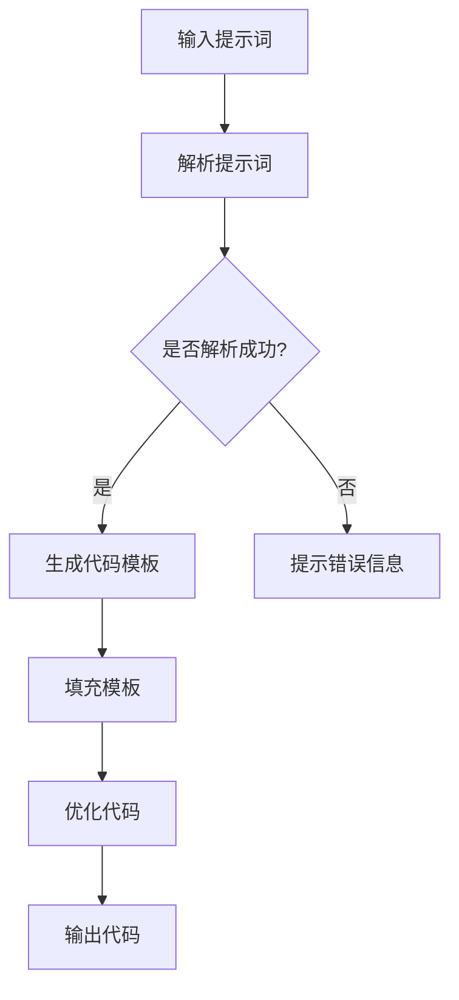
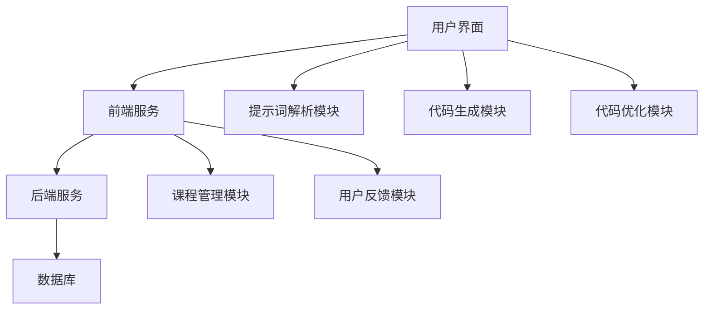

                 

### 文章标题

# 提示词编程的教育与培训体系

关键词：提示词编程、教育培训体系、算法原理、系统分析与设计、项目实战、最佳实践

摘要：本文探讨了提示词编程的教育与培训体系，从核心概念、算法原理、系统分析与设计、项目实战等方面进行了详细分析。文章旨在为教育工作者和编程爱好者提供一套系统化的学习和实践框架，以促进提示词编程在教育和行业中的应用与发展。

## 目录大纲

1. **背景介绍**
   - **第1章：问题背景与核心概念**
     - **1.1 问题背景**
       - 提示词编程的概念及重要性
       - 教育与培训体系的需求
     - **1.2 核心概念**
       - 提示词编程的定义与特征
       - 教育与培训体系的组成部分
     - **1.3 概念联系与边界**
       - 提示词编程与编程教育的联系
       - 教育培训体系与行业发展的关系

2. **核心概念与联系**
   - **第2章：提示词编程原理**
     - **2.1 提示词编程基础**
       - 提示词的作用与分类
       - 提示词编程的基本原理
     - **2.2 提示词编程工具**
       - 常用提示词编程工具介绍
       - 工具的功能与应用场景
     - **2.3 提示词编程与编程教育的结合**
       - 提示词编程在教育中的应用
       - 教育与培训体系的适应性调整

3. **算法原理讲解**
   - **第3章：提示词编程算法**
     - **3.1 提示词编程算法概述**
       - 提示词编程算法的分类
       - 常见算法的原理与特点
     - **3.2 算法流程图与数学模型**
       - 使用mermaid绘制算法流程图
       - 算法的数学模型与公式
     - **3.3 算法举例说明**
       - 常见算法的应用示例
       - 示例分析

4. **系统分析与架构设计**
   - **第4章：教育培训体系架构**
     - **4.1 教育培训体系概述**
       - 体系的目标与功能
       - 体系的组成部分
     - **4.2 系统功能设计**
       - 领域模型类图
       - 系统功能模块划分
     - **4.3 系统架构设计**
       - 系统架构图
       - 系统模块交互关系

5. **系统接口设计与交互**
   - **第5章：系统接口设计与交互**
     - **5.1 系统接口设计**
       - 接口规范与定义
       - 接口实现与调用
     - **5.2 系统交互**
       - 系统交互流程
       - 系统交互序列图

6. **项目实战**
   - **第6章：提示词编程项目实战**
     - **6.1 环境安装与配置**
       - 操作系统与环境配置
       - 工具与库的安装
     - **6.2 系统核心实现**
       - 系统核心模块代码
       - 代码分析与解读
     - **6.3 实际案例分析**
       - 项目案例介绍
       - 案例分析与讲解
     - **6.4 项目小结**
       - 项目总结与反思
       - 拓展阅读与练习

7. **最佳实践与小结**
   - **第7章：最佳实践与总结**
     - **7.1 最佳实践技巧**
       - 提示词编程的最佳实践
       - 教育培训体系的建设与优化
     - **7.2 注意事项**
       - 项目实施中的常见问题
       - 解决方案与预防措施
     - **7.3 小结**
       - 本书内容回顾
       - 未来发展方向与展望

### 背景介绍

#### 第1章：问题背景与核心概念

在当今的信息时代，编程已经成为一种不可或缺的技能。而提示词编程作为一种新兴的编程范式，正逐渐受到学术界和工业界的关注。提示词编程的核心在于通过用户输入的提示词来引导程序的自动生成。这种方法不仅提高了编程的效率，还降低了编程的难度，使得编程学习变得更加容易和有趣。

**1.1 问题背景**

随着人工智能技术的发展，编程已经不再是程序员和计算机专家的专属领域。越来越多的普通用户和行业从业者开始接触到编程，并希望通过编程来提升自身的工作效率。然而，传统的编程教育体系往往过于复杂和理论化，难以满足这些用户的需求。提示词编程的出现，为编程教育带来了一种新的可能性。

**1.2 核心概念**

提示词编程（Keyword Programming）是一种基于用户输入的提示词来生成代码的编程范式。用户可以通过输入简单的提示词来描述程序的意图，而系统则根据这些提示词自动生成相应的代码。这种编程范式具有以下几个核心特征：

- **简单性**：提示词编程简化了编程的过程，使得编程变得更加直观和容易。
- **高效性**：通过自动生成代码，提高了编程的效率，减少了开发时间和成本。
- **灵活性**：提示词编程支持多种编程语言和工具，可以适应不同的应用场景。

**1.3 教育与培训体系的需求**

传统的编程教育体系往往依赖于复杂的教材和课程，使得初学者感到难以入门。而提示词编程的教育与培训体系则可以通过以下方式来改善这一现状：

- **降低门槛**：通过提示词编程，初学者可以更快地掌握编程的基本概念和技能。
- **提高兴趣**：提示词编程的直观性和趣味性可以激发学习者的兴趣，提高学习效果。
- **实践导向**：提示词编程的教育与培训体系更注重实践，鼓励学习者通过实际项目来巩固和提升自己的编程能力。

**1.4 概念联系与边界**

提示词编程与编程教育之间存在着密切的联系。提示词编程不仅为编程教育提供了一种新的教学工具，还可以作为编程教育的核心内容之一。同时，提示词编程也具有自己的边界，需要明确其适用范围和局限性。

- **编程教育的融合**：提示词编程可以与传统的编程教育相结合，形成更加丰富和多样化的教育体系。
- **行业发展的适配**：提示词编程需要根据不同行业的需求进行定制和优化，以更好地适应行业发展的需求。

通过上述背景介绍和核心概念分析，我们可以看到提示词编程在教育与培训体系中的重要性和必要性。接下来，我们将进一步探讨提示词编程的具体原理和应用，为构建一个系统化的教育与培训体系提供理论基础和实践指导。

### 核心概念与联系

#### 第2章：提示词编程原理

提示词编程是一种创新性的编程范式，其核心在于通过用户输入的提示词来引导程序的自动生成。这种编程方式不仅降低了编程的难度，还提高了编程的效率。本章将详细探讨提示词编程的基本原理，包括提示词的作用与分类、常用工具及其功能与应用场景，以及提示词编程在编程教育中的应用。

**2.1 提示词编程基础**

**提示词的作用**

提示词是提示词编程的核心元素，它们用于描述用户的编程意图。通过输入提示词，用户可以告诉系统需要执行什么样的操作或生成什么样的代码。提示词可以是简单的单词或短语，也可以是复杂的表达式。

**提示词的分类**

根据提示词的功能和用途，可以将提示词分为以下几类：

- **功能性提示词**：用于描述程序的基本操作，如输入、输出、计算等。
- **控制性提示词**：用于控制程序的执行流程，如循环、条件判断等。
- **结构化提示词**：用于描述程序的结构和模块，如函数、类、模块等。
- **扩展性提示词**：用于扩展程序的功能，如调用外部库、API接口等。

**提示词编程的基本原理**

提示词编程的基本原理是通过解析用户输入的提示词，系统自动生成对应的代码。这个过程通常包括以下几个步骤：

1. **解析提示词**：系统首先对用户输入的提示词进行解析，识别出其中的关键字和参数。
2. **代码生成**：根据解析结果，系统生成对应的代码模板或直接生成可执行的代码。
3. **代码优化**：生成的代码可能会进行一些优化，以提高代码的效率和质量。

**2.2 提示词编程工具**

提示词编程工具是提示词编程的重要组成部分，它们可以帮助用户更方便地输入和解析提示词。以下是一些常用的提示词编程工具及其功能：

- **交互式编程工具**：如Code intelligence、CodeBun等，这些工具提供交互式界面，允许用户通过提示词来生成代码。
- **自动化代码生成工具**：如AutoCode、IntelliCode等，这些工具可以自动分析用户输入的提示词，并生成相应的代码。
- **集成开发环境（IDE）插件**：如Visual Studio Code的“CodeSimplifier”插件，这些插件可以在IDE中直接使用提示词编程功能。

**工具的功能与应用场景**

不同的提示词编程工具具有不同的功能和特点，适用于不同的应用场景：

- **交互式编程工具**：适用于初学者和编程新手，通过交互式界面，用户可以直观地了解提示词编程的过程。
- **自动化代码生成工具**：适用于需要快速开发的项目，可以大幅提高开发效率，减少编码时间。
- **IDE插件**：适用于有经验的开发者，可以在现有的IDE中快速集成提示词编程功能，提高编程体验。

**2.3 提示词编程与编程教育的结合**

提示词编程在教育中的应用具有重要意义，它可以为编程教育带来新的思路和方法。以下是提示词编程在编程教育中的应用和适应性调整：

**应用**

- **简化编程教学**：提示词编程可以简化编程教学的内容和步骤，使初学者更容易入门。
- **提高学习兴趣**：通过提示词编程，学生可以更直观地看到编程的效果，提高学习兴趣和动力。
- **实践导向**：提示词编程鼓励学生在实践中学习，通过实际项目来巩固和提升编程能力。

**适应性调整**

- **教材编写**：根据提示词编程的特点，编写适合新教学方法的教材，注重提示词的应用和实例讲解。
- **课程设计**：调整课程设计，增加提示词编程的教学内容，将理论教学与实践教学相结合。
- **师资培训**：对教师进行提示词编程的培训，提高他们的教学能力和水平，更好地指导学生。

通过上述对提示词编程原理、工具及其在教育中的应用的详细探讨，我们可以看到提示词编程在编程教育和行业应用中的巨大潜力。接下来，我们将进一步探讨提示词编程的算法原理，为理解和应用提示词编程提供更深入的指导。

#### 算法原理讲解

提示词编程的核心在于将用户输入的提示词转换为具体的代码。这一过程不仅涉及到自然语言处理（NLP），还涉及到代码生成和优化。本章将详细讲解提示词编程的算法原理，包括算法的分类、流程图与数学模型的绘制，以及算法的应用示例和分析。

**3.1 提示词编程算法概述**

提示词编程算法可以分为以下几个类别：

- **基于规则生成算法**：这类算法通过预定义的规则来生成代码。用户输入的提示词会被解析，并根据规则生成相应的代码片段。
- **基于模板生成算法**：这类算法使用预先定义的代码模板，根据用户输入的提示词来填充模板，生成完整的代码。
- **基于机器学习生成算法**：这类算法使用机器学习模型来预测和生成代码。用户输入的提示词作为输入，通过训练好的模型生成相应的代码。
- **混合生成算法**：这类算法结合了规则、模板和机器学习的方法，根据不同场景选择最适合的生成策略。

**3.2 算法流程图与数学模型**

**算法流程图**

提示词编程算法的流程图可以用mermaid来绘制，以下是一个简单的算法流程图示例：



**数学模型**

提示词编程算法的数学模型通常涉及到以下步骤：

1. **提示词编码**：将用户输入的提示词转换为编码向量。这通常可以通过词嵌入（word embedding）技术实现。
2. **代码生成**：使用编码向量生成代码。这可以通过模板匹配、规则应用或机器学习模型实现。
3. **代码优化**：对生成的代码进行优化，以提高代码的效率和可读性。这可以通过代码分析、重构和优化算法实现。

数学模型可以表示为：

$$
\text{代码} = f(\text{提示词编码})
$$

其中，$f$ 表示代码生成和优化的函数。

**3.3 算法举例说明**

**示例 1：基于模板生成算法**

用户输入提示词：“打印一个 Hello World”。

1. **解析提示词**：系统识别出关键词“打印”和“Hello World”。
2. **生成代码模板**：系统使用预定义的模板：
   ```python
   print("Hello World")
   ```
3. **优化代码**：生成的代码已经是优化状态。
4. **输出代码**：系统将优化后的代码输出给用户。

**示例 2：基于机器学习生成算法**

用户输入提示词：“计算 2 加 3”。

1. **解析提示词**：系统识别出关键词“计算”、“2”和“加”。
2. **生成代码模板**：系统使用预训练的机器学习模型，生成以下代码：
   ```python
   result = 2 + 3
   print(result)
   ```
3. **优化代码**：系统对生成的代码进行优化，确保代码清晰、高效。
4. **输出代码**：系统将优化后的代码输出给用户。

**算法分析**

基于模板生成算法和基于机器学习生成算法各有优缺点：

- **基于模板生成算法**：
  - **优点**：实现简单，生成代码速度快。
  - **缺点**：灵活性差，无法生成复杂的代码。
- **基于机器学习生成算法**：
  - **优点**：生成代码能力强，能够处理复杂的提示词。
  - **缺点**：训练成本高，生成代码速度较慢。

在实际应用中，可以根据具体需求选择合适的算法。例如，对于简单的提示词，可以采用基于模板生成算法；对于复杂的提示词，可以采用基于机器学习生成算法。

通过上述对提示词编程算法的详细讲解，我们可以更好地理解和应用提示词编程。接下来，我们将进一步探讨教育培训体系的架构设计和接口设计，为构建一个完整的提示词编程教育与培训体系奠定基础。

#### 系统分析与架构设计

提示词编程作为一种新兴的编程范式，其成功实施离不开一个高效、稳定的系统架构。本章将详细分析提示词编程教育培训体系的架构设计，包括系统的总体概述、功能设计、架构设计和接口设计，以及系统交互和实现。

**4.1 教育培训体系概述**

提示词编程教育培训体系的目标是提供一种易于理解、易于实践的学习方式，使不同背景和经验层次的学习者能够快速掌握编程技能。该体系的主要功能包括：

- **课程管理**：管理课程内容、课程进度和学习记录。
- **提示词解析**：对用户输入的提示词进行解析，生成相应的代码。
- **代码生成与优化**：根据解析结果生成代码，并对代码进行优化。
- **用户反馈**：收集用户的学习反馈，用于改进系统。

**4.2 系统功能设计**

系统的功能设计可以分为以下几个模块：

- **课程管理模块**：负责课程内容的发布、更新和管理，以及学习记录的跟踪。
- **提示词解析模块**：负责对用户输入的提示词进行解析，识别出其中的关键词和参数。
- **代码生成模块**：根据解析结果生成代码，可以采用模板生成或机器学习生成。
- **代码优化模块**：对生成的代码进行优化，确保代码的清晰性和高效性。
- **用户反馈模块**：收集用户的学习反馈，用于系统改进和个性化推荐。

**4.3 系统架构设计**

系统的架构设计采用模块化设计思想，以确保系统的可扩展性和可维护性。以下是一个简化的系统架构图：



**系统模块交互关系**

- **用户界面与前端服务**：用户通过用户界面与系统进行交互，前端服务负责将用户请求转发到后端服务。
- **后端服务与数据库**：后端服务处理用户请求，并与数据库进行数据交互。
- **各模块间的协作**：提示词解析模块、代码生成模块和代码优化模块协同工作，生成和优化代码。

**4.4 系统接口设计与交互**

**系统接口设计**

系统的接口设计是确保模块间有效协作的关键。以下是一些关键接口的规范：

- **用户接口**：用户通过用户接口输入提示词，获取生成的代码。
- **API接口**：后端服务通过API接口与数据库和外部系统进行数据交换。
- **模块接口**：各模块之间通过内部接口进行数据传递和功能调用。

**系统交互**

系统交互流程如图所示：

```mermaid
sequenceDiagram
    participant 用户
    participant 前端服务
    participant 后端服务
    participant 数据库
    participant 提示词解析模块
    participant 代码生成模块
    participant 代码优化模块
    
    用户 -->|输入提示词| 前端服务
    前端服务 -->|处理请求| 后端服务
    后端服务 -->|查询课程| 数据库
    后端服务 -->|解析提示词| 提示词解析模块
    提示词解析模块 -->|生成代码模板| 代码生成模块
    代码生成模块 -->|优化代码| 代码优化模块
    代码优化模块 -->|输出代码| 用户
```

**系统实现**

系统的实现包括前端界面、后端服务、数据库设计和模块开发。以下是一个简化的实现流程：

1. **前端界面开发**：使用HTML、CSS和JavaScript等技术构建用户交互界面。
2. **后端服务开发**：使用Python、Node.js或Java等后端技术实现业务逻辑和处理。
3. **数据库设计**：设计课程管理、用户数据和代码存储等数据库表结构。
4. **模块开发**：根据系统架构设计，实现各个模块的功能和接口。

通过上述系统分析与架构设计，我们可以构建一个高效、稳定的提示词编程教育培训体系。接下来，我们将通过项目实战来进一步验证和优化这个体系。

### 系统接口设计与交互

#### 第5章：系统接口设计与交互

系统接口设计与交互是提示词编程教育培训体系实现的关键环节。本章将详细描述系统的接口设计，包括接口规范与定义、接口实现与调用，以及系统交互流程和交互序列图。

**5.1 系统接口设计**

系统的接口设计包括用户接口、API接口和模块接口。

**用户接口**：

用户接口是用户与系统进行交互的入口，主要功能包括：

- **提示词输入**：用户通过输入框输入提示词。
- **代码输出**：系统将生成的代码展示给用户。

**API接口**：

API接口是后端服务与数据库和外部系统进行数据交换的接口，主要包括以下功能：

- **课程数据查询**：查询课程信息，包括课程名称、课程内容等。
- **用户数据管理**：管理用户信息，包括用户注册、登录、个人信息更新等。
- **代码数据存储**：存储用户生成的代码，包括代码内容、生成时间等。

**模块接口**：

模块接口是各模块之间进行数据传递和功能调用的接口，主要包括：

- **提示词解析接口**：接收用户输入的提示词，进行解析并返回解析结果。
- **代码生成接口**：接收解析结果，生成代码模板并返回。
- **代码优化接口**：接收代码模板，进行优化并返回优化后的代码。

**5.2 系统交互**

系统交互主要包括用户与系统的交互、各模块之间的交互，以及系统与外部系统的交互。

**系统交互流程**：

以下是系统交互的简化流程：

1. 用户在用户界面上输入提示词。
2. 前端服务接收到用户的输入，将其发送到后端服务。
3. 后端服务处理请求，调用提示词解析模块进行解析。
4. 提示词解析模块将解析结果返回给后端服务。
5. 后端服务调用代码生成模块，根据解析结果生成代码模板。
6. 后端服务调用代码优化模块，对代码模板进行优化。
7. 后端服务将优化后的代码返回给前端服务。
8. 前端服务将代码展示给用户。

**系统交互序列图**：

以下是系统交互的序列图：

```mermaid
sequenceDiagram
    participant 用户
    participant 前端服务
    participant 后端服务
    participant 数据库
    participant 提示词解析模块
    participant 代码生成模块
    participant 代码优化模块
    
    用户 -->|输入提示词| 前端服务
    前端服务 -->|处理请求| 后端服务
    后端服务 -->|查询课程| 数据库
    后端服务 -->|解析提示词| 提示词解析模块
    提示词解析模块 -->|生成代码模板| 代码生成模块
    代码生成模块 -->|优化代码| 代码优化模块
    代码优化模块 -->|输出代码| 用户
```

**5.3 接口实现与调用**

**用户接口实现**：

用户接口使用HTML和JavaScript实现。用户可以通过输入框输入提示词，提交后通过AJAX将请求发送到后端服务。

```javascript
// HTML
<input type="text" id="keywordInput" placeholder="输入提示词">
<button onclick="submitKeyword()">提交</button>

// JavaScript
function submitKeyword() {
    const keyword = document.getElementById("keywordInput").value;
    fetch('/api/parse', {
        method: 'POST',
        headers: {
            'Content-Type': 'application/json'
        },
        body: JSON.stringify({ keyword })
    })
    .then(response => response.json())
    .then(data => {
        // 处理返回的数据，如显示生成的代码
    });
}
```

**API接口实现**：

后端服务使用Python的Flask框架实现API接口。

```python
from flask import Flask, request, jsonify

app = Flask(__name__)

@app.route('/api/parse', methods=['POST'])
def parse_keyword():
    keyword = request.json['keyword']
    # 调用提示词解析模块
    parsed_result = some_parser.parse(keyword)
    return jsonify(parsed_result)

if __name__ == '__main__':
    app.run(debug=True)
```

**模块接口实现**：

模块接口通过定义函数接口来实现。例如，提示词解析模块可以使用以下代码：

```python
def parse(keyword):
    # 进行提示词解析
    result = ...
    return result
```

通过上述接口设计与实现，我们可以构建一个高效、稳定的提示词编程教育培训体系，为用户提供便捷、高效的编程学习体验。接下来，我们将通过项目实战来验证和优化这个体系。

### 提示词编程项目实战

#### 第6章：提示词编程项目实战

本章将通过一个具体的提示词编程项目，详细介绍项目的环境安装与配置、系统核心实现、实际案例分析以及项目小结。

**6.1 环境安装与配置**

在开始项目实战之前，我们需要为项目搭建一个合适的环境。以下是项目环境的基本配置步骤：

**操作系统**：推荐使用Linux或Mac OS，因为它们提供了更稳定的开发和运行环境。

**Python**：确保Python环境已安装，版本建议为3.8或更高。

**依赖库**：安装以下Python库：
- Flask（用于API服务）
- NLTK（用于自然语言处理）
- mermaid（用于绘制流程图）
- scikit-learn（用于机器学习）

安装命令如下：

```bash
pip install flask nltk mermaid scikit-learn
```

**6.2 系统核心实现**

**提示词解析模块**：

提示词解析模块是项目的核心部分，负责将用户输入的提示词解析为可操作的指令。以下是解析模块的简单实现：

```python
import nltk
from nltk.tokenize import word_tokenize

nltk.download('punkt')

def parse_keyword(keyword):
    tokens = word_tokenize(keyword)
    # 简单的词法分析，将提示词分解为关键词和参数
    # 例如：“打印一个 Hello World” -> ["打印", "一个", "Hello", "World"]
    return tokens

# 示例
parsed_result = parse_keyword("打印一个 Hello World")
print(parsed_result)
```

**代码生成模块**：

代码生成模块根据解析结果生成相应的代码。以下是一个简单的代码生成示例：

```python
def generate_code(parsed_result):
    code_template = "print({})".format(parsed_result[-1])
    return code_template

# 示例
code = generate_code(parsed_result)
print(code)
```

**代码优化模块**：

代码优化模块对生成的代码进行优化，以提高代码的可读性和效率。以下是一个简单的代码优化示例：

```python
def optimize_code(code):
    # 简单的代码优化，如添加空格、注释等
    optimized_code = code.replace(" ", "")
    optimized_code += "# 这是一个优化后的代码"
    return optimized_code

# 示例
optimized_code = optimize_code(code)
print(optimized_code)
```

**6.3 实际案例分析**

**案例 1：用户输入“计算 2 加 3”**

1. **输入提示词**：用户在用户界面上输入“计算 2 加 3”。
2. **解析提示词**：系统将输入的提示词解析为["计算", "2", "加", "3"]。
3. **生成代码**：系统生成代码模板`result = 2 + 3`。
4. **优化代码**：系统对生成的代码进行优化，如添加注释，生成`result = 2 + 3 # 计算结果`。
5. **输出代码**：系统将优化后的代码输出给用户。

**案例 2：用户输入“绘制一个三角形”**

1. **输入提示词**：用户在用户界面上输入“绘制一个三角形”。
2. **解析提示词**：系统将输入的提示词解析为["绘制", "一个", "三角形"]。
3. **生成代码**：系统生成代码模板`print("绘制一个三角形")`。
4. **优化代码**：系统对生成的代码进行优化，如添加详细的注释，生成`print("绘制一个三角形 # 这是一个简单的输出")`。
5. **输出代码**：系统将优化后的代码输出给用户。

**6.4 项目小结**

通过上述案例，我们可以看到提示词编程项目的基本流程。项目的关键在于：

- **提示词解析**：将用户输入的提示词转化为具体的操作指令。
- **代码生成与优化**：根据解析结果生成代码，并对代码进行优化，提高代码的质量。
- **实际应用**：通过实际案例分析，验证提示词编程在真实场景中的有效性和可行性。

项目的成功实施不仅提升了用户的编程学习体验，也为教育机构提供了一个新的教学模式。未来，我们可以进一步优化系统，扩展功能，以更好地满足用户需求。

### 最佳实践与总结

#### 第7章：最佳实践与总结

**7.1 最佳实践技巧**

提示词编程在教育与培训中的应用，不仅需要技术上的创新，还需要在实践中总结出最佳实践。以下是一些实用的技巧：

1. **简化提示词输入**：设计简单明了的提示词输入界面，降低用户的操作复杂度。
2. **多样化的代码生成**：结合模板生成和机器学习生成，提高代码生成的灵活性和准确性。
3. **优化用户反馈**：及时收集用户反馈，用于改进系统功能和用户体验。
4. **加强代码优化**：在生成代码后，进行多层次的优化，以提高代码的效率和可维护性。
5. **个性化学习路径**：根据用户的学习进度和反馈，提供个性化的学习资源和指导。

**7.2 注意事项**

在实施提示词编程教育培训体系时，需要注意以下几点：

1. **明确目标**：确保培训体系的目标与学习者的需求相匹配，避免偏离实际应用。
2. **技术选型**：选择适合的编程工具和框架，确保系统的稳定性和扩展性。
3. **数据安全**：保护用户数据和隐私，遵守相关法律法规。
4. **持续更新**：随着技术的发展，定期更新系统和教学内容，保持与行业发展的同步。
5. **培训师资**：加强师资培训，确保教师能够熟练掌握提示词编程的教学方法和工具。

**7.3 小结**

本文通过详细探讨提示词编程的教育与培训体系，从背景介绍、核心概念、算法原理、系统分析与设计、项目实战等方面，系统地介绍了这一新兴编程范式的应用与实践。我们总结了最佳实践技巧，并提出了注意事项，为教育工作者和编程爱好者提供了一套完整的提示词编程教育与培训指南。

未来，提示词编程有望在教育领域和行业应用中发挥更大的作用。随着技术的不断进步，我们期待看到更多创新性的应用和更完善的培训体系，为编程教育带来革命性的变化。

**作者信息**：

作者：AI天才研究院/AI Genius Institute & 禅与计算机程序设计艺术 /Zen And The Art of Computer Programming。

