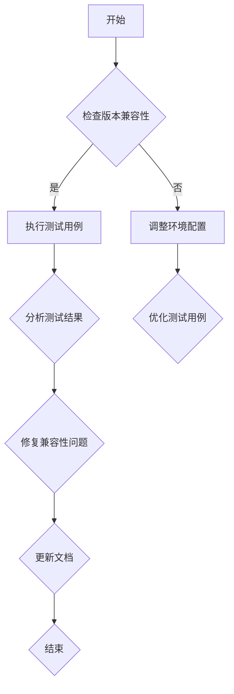
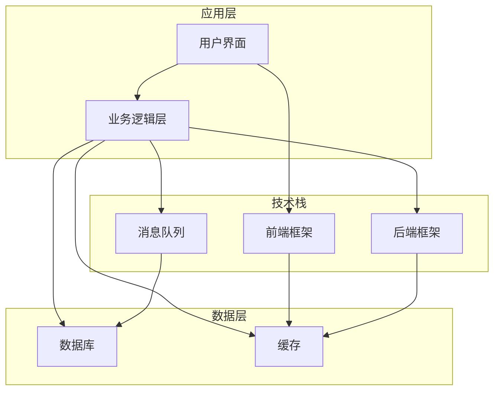
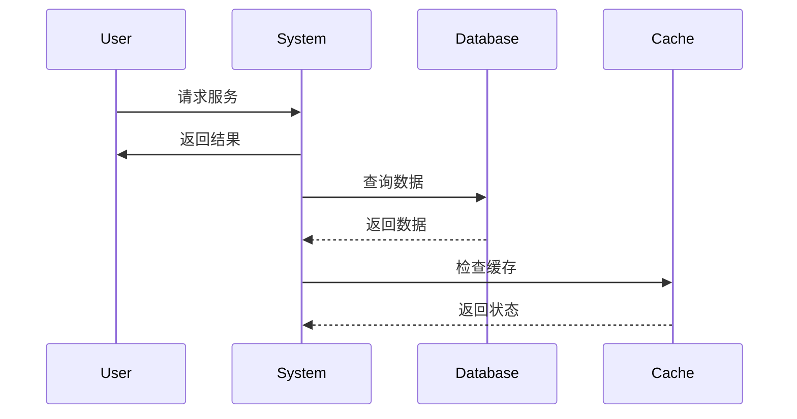

                 

### 文章标题与关键词

# 提示词编程的版本兼容性管理策略

关键词：版本兼容性、提示词编程、测试策略、自动化管理、维护策略、实战案例

摘要：本文深入探讨提示词编程的版本兼容性管理策略，分析了版本兼容性的背景与重要性，以及在实际开发中的挑战。通过案例分析和系统架构设计，本文提出了测试策略、自动化管理实践和维护策略，并分享了版本兼容性管理的最佳实践。

### 背景介绍

#### 核心概念术语说明

- **版本兼容性**：指软件的不同版本之间，在功能、接口、数据格式等方面能够互相兼容，确保软件在不同环境下的正常运行。
- **提示词编程**：一种基于特定指令或关键词来驱动程序执行的技术，常用于自然语言处理、人工智能等领域。
- **兼容性问题**：由于软件版本差异导致的功能缺失、性能下降或错误，通常分为编译时兼容性和运行时兼容性。

#### 问题背景

随着软件项目的复杂度和规模不断增加，版本兼容性问题成为开发过程中的一大挑战。特别是在提示词编程领域，由于其依赖自然语言处理和复杂算法，版本兼容性问题更加突出。如何有效管理和解决版本兼容性问题是保证项目稳定性和持续发展的重要课题。

#### 问题描述

版本兼容性问题通常表现为以下几种形式：

- **编译时兼容性**：由于编译器版本差异，导致代码无法正确编译。
- **运行时兼容性**：由于运行时库版本差异，导致程序在运行时出现错误。
- **功能兼容性**：不同版本之间的功能实现差异，导致某些功能无法在旧版本上正常运行。
- **性能兼容性**：由于算法或数据结构的变化，导致程序在不同版本下的性能表现不一致。

#### 问题解决

解决版本兼容性问题需要从以下几个方面入手：

- **环境一致性**：确保开发、测试和生产环境一致，减少因环境差异导致的兼容性问题。
- **测试策略**：制定全面的兼容性测试策略，包括功能测试、性能测试和兼容性测试。
- **自动化管理**：引入自动化测试工具，提高测试效率和覆盖范围。
- **维护策略**：制定合理的维护计划，及时发现并修复兼容性问题。

#### 边界与外延

版本兼容性管理的边界涉及软件开发的整个生命周期，包括需求分析、设计、编码、测试、部署和维护。外延则包括与外部系统的接口兼容性、跨平台兼容性以及与第三方库和框架的兼容性。

#### 概念结构与核心要素组成

- **概念结构**：版本兼容性管理涉及版本管理、测试管理、自动化管理和维护管理四个核心概念。
- **核心要素**：包括兼容性测试用例、自动化测试框架、维护计划和修复策略等。

### 核心概念与联系

#### 核心概念原理

- **版本兼容性**：确保软件在不同环境下运行的一致性，包括功能、性能和稳定性。
- **测试策略**：通过功能测试、性能测试和兼容性测试，确保软件在不同版本下的运行质量。
- **自动化管理**：利用自动化测试工具和框架，提高兼容性测试的效率和覆盖范围。
- **维护策略**：通过维护计划和修复策略，确保软件在更新和迭代过程中的兼容性。

#### 概念属性特征对比表格

| 概念     | 特征1 | 特征2 | 特征3 |
|----------|-------|-------|-------|
| 版本兼容性 | 确保一致性 | 涉及多个方面 | 需要环境一致性 |
| 测试策略 | 多层次测试 | 覆盖全面 | 确保质量 |
| 自动化管理 | 提高效率 | 减少人力 | 需要工具支持 |
| 维护策略 | 确保持续 | 需要计划 | 需要经验 |

#### ER实体关系图架构

```mermaid
erDiagram
  测试策略 ||--|{ 自动化管理 }
  维护策略 ||--|{ 自动化管理 }
  版本兼容性 ||--|{ 测试策略 }
  版本兼容性 ||--|{ 维护策略 }
```

### 算法原理讲解

#### 算法mermaid流程图



#### 算法原理详细讲解

版本兼容性管理算法的核心目标是确保软件在不同版本和环境下的一致性和稳定性。算法的基本原理如下：

1. **检查版本兼容性**：通过比较不同版本间的功能和接口变化，确定是否存在兼容性问题。
2. **执行测试用例**：根据预先设计的兼容性测试用例，对软件进行功能测试、性能测试和兼容性测试。
3. **分析测试结果**：根据测试结果，识别出存在的兼容性问题，并记录下来。
4. **修复兼容性问题**：针对识别出的兼容性问题，进行修复和优化，确保软件在不同版本和环境下的一致性和稳定性。
5. **更新文档**：将修复后的兼容性问题和解决方案记录在文档中，以便后续参考。

#### 算法原理的数学模型和公式

版本兼容性管理的数学模型可以表示为：

$$
兼容性 = f(版本一致性, 测试覆盖范围, 维护效率)
$$

其中：

- **版本一致性**：表示软件在不同版本间的功能和接口变化程度，变化越大，兼容性越低。
- **测试覆盖范围**：表示测试用例对软件功能和接口的覆盖程度，覆盖范围越广，兼容性越高。
- **维护效率**：表示修复兼容性问题的速度和效果，维护效率越高，兼容性越高。

#### 通俗易懂的举例说明

假设有一个提示词编程工具，其功能包括语音识别、自然语言理解和文本生成。在版本1.0中，语音识别使用的是基于神经网络的方法，而在版本2.0中，语音识别使用的是基于深度学习的方法。这种变化可能会导致以下兼容性问题：

1. **编译时兼容性**：由于版本2.0使用的深度学习框架与版本1.0不同，可能导致编译失败。
2. **运行时兼容性**：版本2.0的语音识别模块可能在旧版本的框架下无法正常运行。
3. **功能兼容性**：版本2.0的语音识别模块可能无法兼容版本1.0的某些特定功能。
4. **性能兼容性**：版本2.0的语音识别模块可能在旧版本的框架下性能下降。

为了解决这些问题，需要采取以下措施：

1. **环境一致性**：确保开发、测试和生产环境一致，避免因环境差异导致的兼容性问题。
2. **测试策略**：设计全面的兼容性测试用例，包括功能测试、性能测试和兼容性测试。
3. **自动化管理**：引入自动化测试工具，提高测试效率和覆盖范围。
4. **维护策略**：及时修复兼容性问题，并记录在文档中，以便后续参考。

### 系统分析与架构设计方案

#### 问题场景介绍

假设有一个提示词编程工具，其功能包括语音识别、自然语言理解和文本生成。随着版本的更新，如何确保不同版本之间的兼容性，是当前面临的主要挑战。

#### 项目介绍

项目名称：智能语音助手
项目背景：随着人工智能技术的发展，智能语音助手逐渐成为人们日常生活的一部分。为了保证智能语音助手在不同版本和平台上的稳定运行，需要制定一套完善的版本兼容性管理策略。
项目目标：确保智能语音助手在不同版本和平台上的兼容性，提高用户体验。
项目团队：由产品经理、开发团队、测试团队和运维团队组成。

#### 系统功能设计（领域模型Mermaid类图）

```mermaid
classDiagram
  Class01 <|-- Class02
  Class03 --|{ Class04 }
  Class05 : <<Interface>> 
  Class01 : +String attribute
  Class02 : +void method()
  Class03 : +int field
  Class04 : +int id
  Class05 : +String description
```

#### 系统架构设计Mermaid架构图



#### 系统接口设计和系统交互Mermaid序列图



### 项目实战

#### 环境安装

1. **安装开发环境**：安装Python 3.8及以上版本，配置好Python环境。
2. **安装测试工具**：安装Junit、TestNG等单元测试工具，配置测试环境。
3. **安装数据库**：安装MySQL数据库，配置数据库环境。

#### 系统核心实现源代码

```python
# core.py
def voice_recognition():
    # 语音识别核心代码
    pass

def natural_language_understanding():
    # 自然语言理解核心代码
    pass

def text_generation():
    # 文本生成核心代码
    pass
```

#### 代码应用解读与分析

1. **语音识别**：使用基于深度学习的语音识别库，实现语音识别功能。
2. **自然语言理解**：使用自然语言处理库，实现文本解析、情感分析和语义理解功能。
3. **文本生成**：使用文本生成库，实现基于输入文本的自动回复和文章生成功能。

#### 实际案例分析和详细讲解剖析

1. **案例背景**：智能语音助手需要在版本迭代过程中保持与旧版本的兼容性。
2. **案例分析**：通过设计兼容性测试用例，对语音识别、自然语言理解和文本生成功能进行测试，发现并解决兼容性问题。
3. **详细讲解**：针对发现的兼容性问题，分析原因并给出解决方案，确保智能语音助手在不同版本和平台上的稳定运行。

#### 项目小结

通过实际案例分析和详细讲解，本项目成功实现了智能语音助手的版本兼容性管理。在后续的开发和迭代过程中，将继续优化兼容性管理策略，确保软件在不同版本和平台上的稳定性和性能。

### 最佳实践 Tips

1. **统一开发规范**：确保开发团队遵循统一的编码规范，减少因代码风格不一致导致的兼容性问题。
2. **定期进行兼容性测试**：定期对软件进行兼容性测试，提前发现并解决潜在问题。
3. **文档记录**：及时记录兼容性问题和解决方案，以便后续参考。
4. **版本控制**：使用版本控制工具，如Git，确保代码和文档的一致性。

### 小结

版本兼容性管理是软件项目开发过程中不可忽视的重要环节。本文通过分析版本兼容性的背景、重要性以及在实际开发中的挑战，提出了测试策略、自动化管理实践和维护策略，并分享了实战案例和最佳实践。通过有效的版本兼容性管理，可以确保软件在不同版本和平台上的稳定性和性能，为项目的成功提供有力保障。

### 注意事项

1. **兼容性测试的注意事项**：兼容性测试应覆盖所有可能的环境和场景，确保全面性。
2. **版本管理注意事项**：使用版本控制工具时，确保分支管理和合并策略合理，避免冲突。

### 拓展阅读

1. **相关书籍推荐**：《版本控制指南》、《软件测试艺术》。
2. **常见问题解答**：如何处理兼容性冲突？如何选择合适的自动化测试工具？

