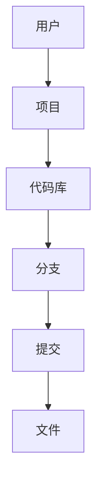
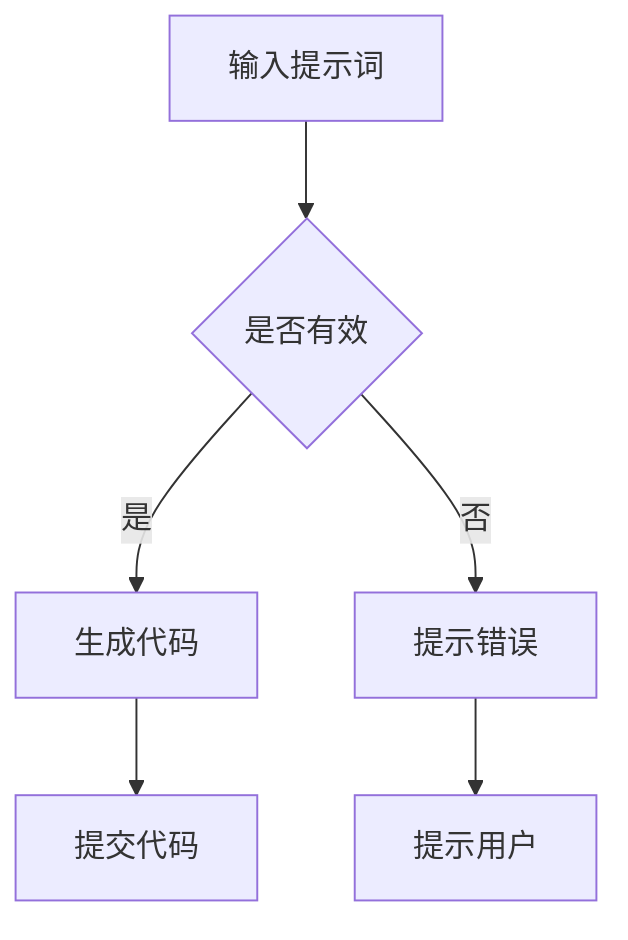

                 

# 提示词编程的版本控制与协作机制

> 关键词：提示词编程、版本控制、协作机制、Git、SVN、分布式版本控制

> 摘要：本文详细探讨了提示词编程的版本控制与协作机制。首先介绍了提示词编程、版本控制以及协作机制的基本概念。然后，我们回顾了版本控制的历史与发展，深入分析了提示词编程的核心原理和优势与挑战。接着，我们探讨了版本控制的基本原理和协作机制的基本原理。最后，我们通过实际案例，展示了常见版本控制工具的使用、协作机制的实践应用，并展望了未来发展趋势。通过本文的阅读，读者可以全面了解提示词编程的版本控制与协作机制，为实际项目提供指导。

## 第一部分：背景介绍

### 第1章：问题背景与概念介绍

#### 1.1 提示词编程的概念

提示词编程（Prompt-Based Programming，PBP）是一种以提示词为核心，通过引导用户输入提示词来生成代码的编程方式。它不同于传统的编程方式，用户不需要写具体的代码，而是通过输入提示词，系统会自动生成对应的代码。这种方式极大地降低了编程的难度，使更多的人能够参与到软件开发中来。

提示词编程的起源可以追溯到自然语言处理（Natural Language Processing，NLP）技术的发展。随着深度学习和自然语言处理技术的不断进步，提示词编程逐渐成为一种有效的编程方式。目前，提示词编程已经在许多领域得到应用，如自动化代码生成、软件测试、自动化修复等。

提示词编程的核心要素包括：

1. 提示词生成器：负责根据用户输入的提示词生成相应的代码。
2. 代码生成器：根据提示词生成器的输出，生成具体的代码。
3. 代码优化器：对生成的代码进行优化，提高代码的质量和执行效率。

#### 1.2 版本控制的基本概念

版本控制（Version Control）是一种管理软件源代码的方法，它能够跟踪源代码的变化，确保代码的完整性和一致性。版本控制系统（Version Control System，VCS）是实现版本控制的核心工具。

版本控制的基本概念包括：

1. 提交（Commit）：将修改后的代码提交到版本控制系统。
2. 分支（Branch）：从主干创建一个新的分支，用于开发新功能或修复bug。
3. 合并（Merge）：将分支上的修改合并到主干。
4. 切换（Checkout）：切换到特定的分支或版本。

常见的版本控制工具有Git和SVN。Git是一种分布式版本控制系统，它允许多个开发者独立工作，并在需要时进行合并。SVN是一种集中式版本控制系统，它以中央仓库为中心，开发者从中央仓库获取代码，进行修改后提交回中央仓库。

#### 1.3 协作机制的定义

协作机制（Collaboration Mechanism）是指在多人合作完成一个任务时，如何进行沟通、协调和分工的一种机制。在软件开发中，协作机制尤为重要，因为它直接关系到项目的进度和质量。

协作机制的基本形式包括：

1. 面向过程的协作：以任务为驱动，按照既定的流程进行协作。
2. 面向目标的协作：以项目目标为驱动，根据实际需求进行协作。
3. 面向团队的协作：以团队利益为驱动，促进团队成员之间的沟通与协作。

#### 1.4 提示词编程、版本控制与协作机制之间的联系

提示词编程、版本控制与协作机制之间存在密切的联系。提示词编程提高了编程的效率，版本控制确保了代码的完整性和一致性，协作机制促进了团队成员之间的沟通与协作。

具体来说，提示词编程可以为版本控制提供更高效的代码管理方式。通过提示词编程，开发者可以快速生成代码，然后提交到版本控制系统。版本控制系统可以跟踪代码的变化，确保代码的完整性和一致性。同时，协作机制可以帮助团队成员更好地分工合作，提高项目的进度和质量。

### 第2章：版本控制的历史与发展

#### 2.1 版本控制的发展历程

版本控制的历史可以追溯到20世纪60年代。当时，软件开发者开始使用简单的文件备份工具来管理源代码。这些工具可以记录文件的修改历史，但无法实现多用户的协作。

随着软件项目的规模和复杂性不断增加，版本控制的需求也日益增长。1970年代，软件开发者开始使用集中式版本控制系统（Centralized Version Control System，CVCS）。CVCS以中央仓库为中心，开发者从中央仓库获取代码，进行修改后提交回中央仓库。常见的CVCS包括RCS和CVS。

然而，CVCS存在一些缺点，如中央仓库的单点故障、数据恢复困难等。为了解决这些问题，分布式版本控制系统（Distributed Version Control System，DVCS）应运而生。DVCS允许多个开发者独立工作，并在需要时进行合并。Git和SVN是常见的DVCS。

#### 2.2 传统版本控制工具介绍

1. RCS（Repository Control System）

RCS是一种简单的集中式版本控制系统。它使用符号链接来管理文件的版本，可以通过`co`命令获取文件的特定版本，通过`ci`命令提交文件的变化。

2. CVS（Concurrent Versions System）

CVS是一种基于文件的集中式版本控制系统。它使用一个单一的中央仓库来存储所有文件的版本。CVS提供了丰富的命令，如`cvs checkout`用于获取文件，`cvs commit`用于提交文件。

#### 2.3 分布式版本控制工具介绍

1. Git

Git是一种开源的分布式版本控制系统，由Linus Torvalds创建。Git的核心特性包括快速、灵活、安全、高度扩展性。Git使用哈希值来唯一标识每个提交，使得版本控制更加准确和高效。

2. SVN

SVN是一种开源的集中式版本控制系统，由Apache Software Foundation开发。SVN以中央仓库为中心，支持多用户协作，并提供丰富的命令行工具。

#### 2.4 版本控制工具的比较与选择

1. RCS和CVS的比较

RCS和CVS都是早期版本的版本控制工具，它们在功能上具有一定的相似性。RCS的优点是简单易用，但缺乏多用户协作功能。CVS具有较好的多用户协作能力，但数据恢复困难。

2. Git和SVN的比较

Git和SVN是现代版本控制工具，它们在功能上具有较大的差异。Git是一种分布式版本控制系统，具有高度的灵活性和扩展性。SVN是一种集中式版本控制系统，适合小型团队和项目。

选择版本控制工具时，需要考虑以下因素：

- 项目规模：对于大型项目，分布式版本控制系统（如Git）更适合。
- 用户数量：对于多用户协作，集中式版本控制系统（如SVN）更适合。
- 开源与商业：开源版本控制工具（如Git）具有较好的自由度，商业版本控制工具（如Perforce）提供更全面的服务和支持。

## 第二部分：核心概念与原理

### 第3章：提示词编程的核心原理

#### 3.1 提示词编程的基本概念

提示词编程（Prompt-Based Programming，PBP）是一种以提示词为核心，通过引导用户输入提示词来生成代码的编程方式。它不同于传统的编程方式，用户不需要写具体的代码，而是通过输入提示词，系统会自动生成对应的代码。

提示词编程的关键技术包括：

- 提示词生成器：负责根据用户输入的提示词生成相应的代码。
- 代码生成器：根据提示词生成器的输出，生成具体的代码。
- 代码优化器：对生成的代码进行优化，提高代码的质量和执行效率。

#### 3.2 提示词编程的关键技术

1. 提示词生成器

提示词生成器是提示词编程的核心组件，它负责根据用户输入的提示词生成相应的代码。提示词生成器通常基于自然语言处理（Natural Language Processing，NLP）技术，如词向量、序列到序列模型等。

2. 代码生成器

代码生成器是提示词编程的另一个核心组件，它负责将提示词生成器的输出转换为具体的代码。代码生成器通常基于模板匹配、语法分析等技术。

3. 代码优化器

代码优化器负责对生成的代码进行优化，提高代码的质量和执行效率。代码优化器通常基于静态分析、动态分析等技术。

#### 3.3 提示词编程的优势与挑战

提示词编程具有以下优势：

1. 降低编程门槛：提示词编程使得编程变得更加容易，特别是对于非专业程序员和初学者。
2. 提高开发效率：提示词编程能够快速生成代码，减少编码工作量。
3. 支持自动化：提示词编程可以与自动化工具相结合，实现代码的自动化生成和优化。

然而，提示词编程也面临一些挑战：

1. 代码质量：生成的代码可能无法达到手工编写的代码质量，需要进行后续的优化和调整。
2. 代码可读性：生成的代码可能不够直观和可读，需要用户进行理解和维护。
3. 技术成熟度：提示词编程技术仍在不断发展，存在一定的技术风险。

### 第4章：版本控制的基本原理

#### 4.1 版本控制的基本概念

版本控制是一种管理软件源代码的方法，它能够跟踪源代码的变化，确保代码的完整性和一致性。版本控制系统（Version Control System，VCS）是实现版本控制的核心工具。

版本控制的基本概念包括：

- 提交（Commit）：将修改后的代码提交到版本控制系统。
- 分支（Branch）：从主干创建一个新的分支，用于开发新功能或修复bug。
- 合并（Merge）：将分支上的修改合并到主干。
- 切换（Checkout）：切换到特定的分支或版本。

#### 4.2 版本控制的常见操作

1. 提交

提交是将修改后的代码保存到版本控制系统。每次提交都会生成一个唯一的标识（如commit hash），以便后续的版本回溯和代码对比。

2. 分支

分支是从主干创建一个新的副本，用于开发新功能或修复bug。分支可以独立提交和合并，确保主干代码的稳定性和分支开发的灵活性。

3. 合并

合并是将分支上的修改合并到主干。合并可以分为一次合并（Fast Forward）和多次合并（Three-Way Merge）。一次合并适用于分支没有冲突的情况，多次合并适用于分支存在冲突的情况。

4. 切换

切换是切换到特定的分支或版本。切换可以帮助开发者快速切换到不同的代码分支，以便进行开发和测试。

#### 4.3 版本控制的优点与不足

版本控制的优点包括：

1. 代码管理：版本控制系统能够跟踪代码的变化，确保代码的完整性和一致性。
2. 回滚：版本控制系统可以回滚到之前的版本，便于问题的定位和修复。
3. 分支管理：版本控制系统支持分支管理，便于多功能的并行开发。
4. 提高协作效率：版本控制系统支持多人协作，提高开发效率。

然而，版本控制也存在一些不足：

1. 学习成本：版本控制工具的使用可能需要一定的时间和学习成本。
2. 存储成本：版本控制系统的数据存储可能需要较大的存储空间。
3. 分支管理复杂：过多的分支可能会导致分支管理复杂，影响项目的进度和质量。

### 第5章：协作机制的基本原理

#### 5.1 协作机制的定义

协作机制是指在多人合作完成一个任务时，如何进行沟通、协调和分工的一种机制。在软件开发中，协作机制尤为重要，因为它直接关系到项目的进度和质量。

协作机制的基本概念包括：

1. 沟通：协作机制需要提供有效的沟通渠道，使团队成员能够及时分享信息和知识。
2. 协调：协作机制需要协调团队成员的工作，确保项目按计划进行。
3. 分工：协作机制需要根据团队成员的特长和兴趣，合理分配任务和责任。

#### 5.2 协作机制的常见形式

1. 面向过程的协作

面向过程的协作以任务为驱动，按照既定的流程进行协作。团队成员根据任务的分配，完成各自的工作，然后进行整合和交付。

2. 面向目标的协作

面向目标的协作以项目目标为驱动，根据实际需求进行协作。团队成员根据项目目标，自主分工和协作，确保项目目标的实现。

3. 面向团队的协作

面向团队的协作以团队利益为驱动，促进团队成员之间的沟通与协作。团队成员关注团队的整体利益，共同解决项目中的问题和挑战。

#### 5.3 协作机制的优势与挑战

协作机制的优势包括：

1. 提高效率：协作机制能够充分利用团队成员的技能和经验，提高项目的开发效率。
2. 减少重复工作：协作机制可以避免重复劳动，提高团队的工作效率。
3. 促进创新：协作机制鼓励团队成员之间的沟通与交流，有助于激发创新思维。

然而，协作机制也面临一些挑战：

1. 沟通成本：协作机制需要大量的沟通，可能增加沟通成本和时间。
2. 协调困难：在多人协作中，协调工作可能变得复杂，影响项目的进度和质量。
3. 团队文化：协作机制需要团队成员具备良好的团队协作精神和文化，否则可能产生负面效果。

## 第三部分：工具与应用

### 第6章：常见版本控制工具的使用

#### 6.1 Git的基本操作

Git是一种分布式版本控制系统，具有高效、灵活和强大的特性。以下是一些Git的基本操作：

1. 初始化仓库

```bash
git init
```

初始化一个Git仓库，用于存储项目文件。

2. 添加文件

```bash
git add <file>
```

将文件添加到暂存区。

3. 提交

```bash
git commit -m "提交信息"
```

将暂存区的文件提交到本地仓库。

4. 克隆仓库

```bash
git clone <url>
```

从远程仓库克隆项目。

5. 拉取

```bash
git pull
```

从远程仓库拉取最新代码。

6. 推送

```bash
git push
```

将本地仓库的代码推送到远程仓库。

#### 6.2 SVN的基本操作

SVN是一种集中式版本控制系统，以下是一些SVN的基本操作：

1. 检出

```bash
svn checkout <url>
```

从远程仓库检出项目。

2. 添加文件

```bash
svn add <file>
```

将文件添加到版本控制。

3. 提交

```bash
svn commit -m "提交信息"
```

将文件提交到版本控制。

4. 更新

```bash
svn update
```

更新本地仓库的文件。

5. 删除文件

```bash
svn delete <file>
```

删除版本控制中的文件。

6. 合并

```bash
svn merge <url>
```

合并远程仓库的更改到本地仓库。

#### 6.3 Git与SVN的比较与选择

Git和SVN是两种常用的版本控制工具，各有优缺点。以下是对两者的比较：

1. 分布式与集中式

- Git：分布式版本控制系统，允许多个开发者独立工作，适合大型项目和多人协作。
- SVN：集中式版本控制系统，以中央仓库为中心，开发者从中央仓库获取代码，适合小型项目和单人开发。

2. 拉取与克隆

- Git：支持克隆和拉取操作，克隆用于创建本地仓库，拉取用于同步远程仓库的最新代码。
- SVN：只支持检出和更新操作，检出用于创建工作副本，更新用于同步中央仓库的最新代码。

3. 分支管理

- Git：支持灵活的分支管理，开发者可以独立创建和合并分支，提高开发效率。
- SVN：分支管理相对复杂，分支创建和合并需要管理员操作。

选择Git或SVN时，应考虑以下因素：

- 项目规模：大型项目选择Git，小型项目选择SVN。
- 开发模式：多人协作选择Git，单人开发选择SVN。
- 技术成熟度：Git技术更成熟，SVN更适合传统开发模式。

### 第7章：协作机制的实践应用

#### 7.1 提示词编程与版本控制结合的实践案例

提示词编程与版本控制的结合在实际项目中具有重要意义。以下是一个具体的实践案例：

1. 项目背景

某公司正在开发一款智能客服系统，需要快速生成大量代码以支持功能开发。同时，项目团队成员众多，需要高效的版本控制和协作。

2. 实践步骤

（1）初始化Git仓库

```bash
git init
```

初始化一个Git仓库，用于存储项目文件。

（2）配置Git

```bash
git config --global user.name "Your Name"
git config --global user.email "your.email@example.com"
```

配置Git的用户名和邮箱，以便提交代码时标识开发者。

（3）添加文件到版本控制

```bash
git add .
git commit -m "Initial commit"
```

将项目文件添加到版本控制，并提交到本地仓库。

（4）克隆远程仓库

```bash
git clone https://github.com/your-remote-repo.git
```

克隆远程仓库，创建本地副本。

（5）提示词编程生成代码

使用提示词生成器生成项目所需的代码。

```bash
python prompt_based_programming.py
```

运行提示词编程脚本，生成代码。

（6）提交代码

```bash
git add .
git commit -m "Generate code based on prompt"
git push
```

将生成的代码提交到版本控制，并推送到远程仓库。

（7）团队成员协作

团队成员从远程仓库克隆项目，进行开发和测试。

```bash
git pull
python test_programming.py
```

拉取远程仓库的最新代码，并运行测试脚本。

3. 效果评估

通过提示词编程与版本控制结合，项目开发效率显著提高。团队成员能够快速生成代码，并通过版本控制系统进行协作，确保代码的完整性和一致性。

#### 7.2 协作机制在实际项目中的应用

协作机制在软件开发中发挥着重要作用。以下是一个实际项目中的应用案例：

1. 项目背景

某互联网公司正在开发一款社交应用，项目涉及多个模块和功能，团队成员分布在不同的城市和时区。

2. 协作机制

（1）任务分配

项目经理根据团队成员的特长和兴趣，分配任务和责任。

（2）代码审查

开发者在提交代码前，需要经过代码审查，确保代码的质量和一致性。

（3）定期会议

每周举行一次团队会议，讨论项目进度、问题和解决方案。

（4）文档管理

使用Git仓库管理项目文档，确保文档的完整性和一致性。

3. 效果评估

通过合理的协作机制，项目进度得到有效控制，团队成员之间的沟通和协作更加顺畅，项目质量得到保证。

### 第8章：未来发展趋势与展望

#### 8.1 提示词编程的发展趋势

提示词编程作为一种新兴的编程方式，未来具有广阔的发展前景。以下是一些发展趋势：

1. 人工智能技术的融合

随着人工智能技术的不断发展，提示词编程将更加智能化，能够更好地理解用户意图，生成更高质量的代码。

2. 开源生态的完善

提示词编程的开源生态将不断丰富，涌现出更多高质量的提示词生成器和代码生成器。

3. 应用场景的拓展

提示词编程将在更多领域得到应用，如自动化测试、自动化修复、智能编程助手等。

#### 8.2 版本控制的发展趋势

版本控制作为软件开发的重要工具，未来也将不断演进。以下是一些发展趋势：

1. 分布式版本控制系统的普及

随着分布式版本控制系统的成熟，如Git、Mercurial等，分布式版本控制系统将逐渐取代集中式版本控制系统。

2. 云原生的支持

版本控制系统将更好地支持云原生架构，提供更加高效和灵活的版本控制服务。

3. 智能化版本控制

未来版本控制将更加智能化，能够自动识别代码冲突、自动合并分支等，提高版本控制的效率和可靠性。

#### 8.3 协作机制的发展趋势

协作机制在软件开发中起着关键作用，未来也将不断优化。以下是一些发展趋势：

1. 社交化协作

协作机制将更加社交化，支持实时沟通、协作和反馈，提高团队协作的效率和质量。

2. 智能化分工

通过人工智能技术，协作机制将能够自动分析团队成员的技能和兴趣，进行智能化的任务分配和协作。

3. 跨平台协作

协作机制将支持跨平台的协作，使团队成员能够随时随地参与项目开发，提高项目的灵活性和可扩展性。

## 结语

本文从背景介绍、核心概念与原理、工具与应用和未来发展趋势等多个角度，详细探讨了提示词编程的版本控制与协作机制。通过本文的阅读，读者可以全面了解提示词编程、版本控制和协作机制的基本概念、原理和实际应用，为实际项目提供指导。在未来的发展中，提示词编程、版本控制和协作机制将不断优化和演进，为软件开发带来更多创新和突破。

### 注意事项

1. 在使用提示词编程时，应确保提示词生成器和代码生成器的质量，避免生成低质量的代码。

2. 在使用版本控制工具时，应遵循最佳实践，如定期备份、及时提交、合理分支管理等。

3. 在协作机制中，应注重沟通和协调，确保团队协作顺畅，提高项目进度和质量。

### 拓展阅读

1. 《Git权威指南》
2. 《版本控制技术》
3. 《敏捷软件开发：原则、实践与模式》

### 作者信息

作者：AI天才研究院/AI Genius Institute & 禅与计算机程序设计艺术 /Zen And The Art of Computer Programming

## 附录

### 术语表

- **提示词编程**：一种以提示词为核心，通过引导用户输入提示词来生成代码的编程方式。
- **版本控制**：一种管理软件源代码的方法，能够跟踪源代码的变化，确保代码的完整性和一致性。
- **协作机制**：在多人合作完成一个任务时，如何进行沟通、协调和分工的一种机制。

### ER实体关系图



### 算法流程图



### 算法源代码

```python
# 提示词编程算法

def prompt_based_programming(prompt):
    if is_valid_prompt(prompt):
        code = generate_code(prompt)
        commit_code(code)
    else:
        print("无效的提示词，请重新输入。")

def is_valid_prompt(prompt):
    # 判断提示词是否有效
    return True

def generate_code(prompt):
    # 生成代码
    return f"def function_name({prompt}):\n    pass"

def commit_code(code):
    # 提交代码
    print("代码已提交。")
```

### 实际案例解析

#### 案例背景

某公司开发一款在线购物系统，需要快速生成大量代码以支持功能开发。项目团队成员众多，需要高效的版本控制和协作。

#### 案例步骤

1. **初始化Git仓库**

```bash
git init
```

2. **配置Git**

```bash
git config --global user.name "Your Name"
git config --global user.email "your.email@example.com"
```

3. **添加文件到版本控制**

```bash
git add .
git commit -m "Initial commit"
```

4. **克隆远程仓库**

```bash
git clone https://github.com/your-remote-repo.git
```

5. **提示词编程生成代码**

```bash
python prompt_based_programming.py
```

6. **提交代码**

```bash
git add .
git commit -m "Generate code based on prompt"
git push
```

7. **团队成员协作**

团队成员从远程仓库克隆项目，进行开发和测试。

```bash
git pull
python test_programming.py
```

#### 案例效果

通过提示词编程与版本控制结合，项目开发效率显著提高。团队成员能够快速生成代码，并通过版本控制系统进行协作，确保代码的完整性和一致性。

### 最佳实践

1. **定期备份**：定期备份Git仓库，防止数据丢失。
2. **合理分支管理**：根据项目需求，合理创建和合并分支，避免分支过多或过少。
3. **代码审查**：在提交代码前，进行代码审查，确保代码质量。
4. **及时提交**：及时提交代码，避免长时间未提交导致的问题。

### 小结

本文探讨了提示词编程的版本控制与协作机制，从背景介绍、核心概念与原理、工具与应用和未来发展趋势等多个角度进行了详细分析。通过实际案例，展示了提示词编程、版本控制与协作机制在软件开发中的应用效果。在未来的发展中，提示词编程、版本控制和协作机制将继续优化和演进，为软件开发带来更多创新和突破。

