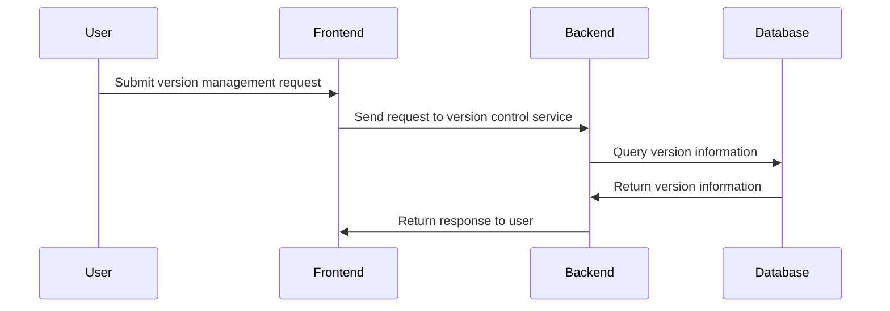

                 

### 介绍背景和核心概念

版本管理是软件开发过程中的关键环节，旨在确保代码的完整性和可追溯性，同时支持团队协作和迭代开发。在软件开发的生命周期中，版本管理不仅帮助开发者跟踪代码的变更，还能在出现问题时快速回滚到稳定版本，提高开发的效率和可靠性。

近年来，随着软件系统复杂度的增加和分布式开发团队的普及，传统的版本管理工具已经无法满足现代开发需求。特别是提示词编程（Prompt-Based Programming，PBP）技术的兴起，为版本管理带来了一种全新的思路。

提示词编程是一种利用自然语言处理和机器学习技术，通过提供提示词来指导程序编写的方法。这种方法的核心在于通过用户输入的提示词，智能生成相应的代码片段，从而实现自动化编程。在版本管理领域，提示词编程的应用主要体现在以下几个方面：

1. **自动生成变更日志**：通过分析代码变更，提示词编程可以自动生成详细的变更日志，提高版本管理的透明度和可追溯性。
2. **智能合并冲突**：提示词编程可以根据变更内容智能判断合并策略，减少手动合并的工作量，提高合并的准确性。
3. **自动化回滚**：在出现严重问题时，提示词编程可以快速识别问题代码，并自动回滚到上一个稳定版本，确保系统的稳定性。

本文将深入探讨提示词编程在版本管理中的应用，从核心概念、算法原理到系统实现，逐步揭示这一新技术如何改变传统的版本管理方式。通过本文的阅读，读者将全面了解提示词编程的版本管理技术，掌握其原理和应用方法，为未来的软件开发提供新的视角和工具。

### 版本管理的基本概念与联系

在深入探讨提示词编程在版本管理中的应用之前，我们首先需要明确几个关键概念，并理解它们之间的相互关系。这些概念是版本管理系统的核心，对于理解和应用提示词编程至关重要。

#### 1. 文件版本

文件版本是版本管理中的基础概念，它表示文件在特定时间点的状态。每个文件版本都包含了该文件在某个时间点的具体内容、作者信息、修改时间和修改说明等元数据。版本管理工具通过记录文件的不同版本，帮助开发者追踪代码的变更历史，确保代码的完整性和可恢复性。

- **定义**：文件版本是文件内容在不同时间点的记录，每个版本都有一个唯一的标识符。
- **属性**：版本号、作者、修改时间、修改说明。
- **作用**：帮助开发者追踪代码变更，确保代码的一致性和可恢复性。

#### 2. 历史记录

历史记录是指文件版本之间的变更记录，包括每次变更的详细信息，如谁进行了变更、变更的时间、变更的内容等。历史记录是版本管理系统中不可或缺的一部分，它提供了对代码变更的全面了解，是问题诊断和代码审核的重要依据。

- **定义**：历史记录是文件版本之间的变更记录，包含了变更的时间、作者、变更内容等详细信息。
- **属性**：变更时间、变更作者、变更内容、变更注释。
- **作用**：帮助开发者了解代码变更的历史，进行问题诊断和代码审核。

#### 3. 变更跟踪

变更跟踪是指对代码变更进行监控和记录的过程。通过变更跟踪，版本管理工具可以自动检测和记录代码库中的所有变更，包括新增、修改和删除等操作。变更跟踪对于维护代码库的一致性和可靠性至关重要。

- **定义**：变更跟踪是对代码库中的所有变更进行监控和记录的过程。
- **属性**：变更类型、变更文件、变更内容、变更时间。
- **作用**：确保代码库的完整性和一致性，为问题诊断和代码审核提供数据支持。

#### 4. 分支与合并

分支和合并是版本管理中常用的操作，用于实现并行开发和管理不同功能的代码。分支允许开发者从主分支创建一个新的分支，在这个分支上进行独立的开发，而不会影响主分支。当开发完毕后，可以通过合并操作将分支的变更合并回主分支。

- **定义**：分支是从主分支创建的独立开发环境，用于实现功能的独立开发和测试；合并是将分支上的变更合并回主分支的过程。
- **属性**：分支名、分支状态、合并历史。
- **作用**：支持并行开发，降低开发风险，确保代码的稳定性和可靠性。

#### 概念属性对比表格

为了更直观地理解这些概念之间的关系，我们可以通过一个概念属性对比表格来展示它们的主要区别和联系。

| 概念       | 定义                                                     | 属性                        | 作用                           |
|------------|-----------------------------------------------------------|-----------------------------|--------------------------------|
| 文件版本   | 文件内容在不同时间点的记录                               | 版本号、作者、修改时间等   | 跟踪代码变更历史，确保代码完整 |
| 历史记录   | 文件版本之间的变更记录                                   | 变更时间、变更作者、变更内容等 | 了解代码变更历史，进行问题诊断 |
| 变更跟踪   | 对代码库中的所有变更进行监控和记录                       | 变更类型、变更文件、变更内容等 | 确保代码库的一致性和可靠性     |
| 分支与合并 | 实现功能的独立开发和测试；将分支上的变更合并回主分支     | 分支名、分支状态、合并历史   | 支持并行开发，确保代码稳定性   |

#### ER实体关系图架构

为了更好地理解这些概念之间的关系，我们可以使用Mermaid流程图来绘制一个ER（实体关系）图，展示这些实体的关联。

```mermaid
erDiagram
  文件版本 ||--|{ 历史记录 }||>
  文件版本 ||--|{ 分支 }||>
  历史记录 ||--|{ 变更跟踪 }||>
  分支 ||--|{ 合并 }||>
```

在这个ER图中，文件版本通过历史记录与变更跟踪关联，通过分支与合并关联，展示了这些核心概念之间的复杂关系。

通过上述的介绍和概念对比表格，我们可以对版本管理中的基本概念有一个清晰的理解，这为后续讨论提示词编程在版本管理中的应用打下了坚实的基础。

### 提示词编程的基本原理

提示词编程（Prompt-Based Programming，PBP）是一种利用自然语言处理和机器学习技术，通过用户输入的提示词来生成代码的方法。这种方法的核心在于将编程任务转化为自然语言问题，然后利用预训练的大规模语言模型自动生成相应的代码。下面我们将详细探讨提示词编程的基本原理，包括提示词生成与选择、提示词优化与调整。

#### 提示词生成与选择

提示词编程的起点是用户输入的提示词，这些提示词可以是简单的命令，也可以是详细的描述。提示词生成的过程主要包括以下步骤：

1. **提示词输入**：用户通过自然语言输入提示词，例如“请创建一个函数，实现两个数的加法。”
2. **提示词预处理**：系统对输入的提示词进行预处理，包括去噪、分词、词性标注等，确保提示词的语义准确性。
3. **提示词编码**：将预处理后的提示词转化为编码表示，通常使用嵌入向量（Embedding Vector）技术。预训练的嵌入模型如Word2Vec、BERT等可以用于这一步骤。
4. **代码生成候选**：基于编码后的提示词，模型生成多个可能的代码候选，这些候选通常是通过解码嵌入向量生成的。

选择最佳代码生成候选的过程同样重要。通常，系统会根据以下标准进行选择：

- **代码的正确性**：生成的代码必须符合编程语言的语法规则和语义要求。
- **代码的简洁性**：生成的代码应该简洁易懂，避免冗余和不必要的复杂性。
- **代码的可维护性**：生成的代码应该具有良好的结构和可读性，便于后续维护和扩展。

#### 提示词优化与调整

在生成代码的过程中，提示词的质量直接影响代码的生成效果。为了提高提示词的质量，系统通常会进行以下优化与调整：

1. **上下文扩展**：通过引入上下文信息，如当前项目的文件结构、已实现的功能模块等，丰富提示词的语义内容，帮助模型生成更准确的代码。
2. **反馈迭代**：在代码生成后，系统会根据用户反馈进行迭代优化。如果用户对生成的代码不满意，可以通过修改提示词或重新生成代码来不断优化。
3. **提示词纠错**：系统可以使用自然语言处理技术对提示词进行纠错，识别并修正提示词中的错误，从而提高代码生成的准确性。
4. **适应性调整**：系统可以根据用户的使用习惯和历史数据，动态调整提示词的生成策略，使其更符合用户的偏好。

#### 提示词编程与版本管理的关系

提示词编程在版本管理中的应用主要体现在以下几个方面：

1. **自动生成变更日志**：提示词编程可以通过分析代码变更的上下文，自动生成详细的变更日志，提高版本管理的透明度和可追溯性。
2. **智能合并冲突**：提示词编程可以根据变更内容智能判断合并策略，减少手动合并的工作量，提高合并的准确性。
3. **自动化回滚**：在出现严重问题时，提示词编程可以快速识别问题代码，并自动回滚到上一个稳定版本，确保系统的稳定性。

通过上述的介绍，我们可以看到，提示词编程通过自然语言处理和机器学习技术，实现了编程任务与代码生成之间的自动化映射。这一技术的引入，为版本管理带来了新的思路和方法，有望显著提高版本管理的效率和准确性。

### 提示词编程在版本管理中的应用

提示词编程在版本管理中具有巨大的潜力，通过其自然语言处理和自动化编程能力，可以显著提升版本管理的效率和准确性。以下我们将详细介绍提示词编程在版本管理中的应用，包括自动生成变更日志、智能合并冲突和自动化回滚等关键功能。

#### 自动生成变更日志

变更日志是版本管理的重要组成部分，它记录了每次代码变更的详细信息，包括变更的时间、作者、变更内容和变更说明等。传统的变更日志生成通常依赖于开发者手动撰写变更说明，这不仅增加了开发者的工作负担，而且可能导致变更记录不完整或不准确。

提示词编程通过其自然语言处理能力，可以自动生成变更日志。其工作原理如下：

1. **变更识别**：当检测到代码库中的文件发生变更时，系统会自动触发变更识别过程。
2. **上下文分析**：系统会分析变更的上下文信息，如变更前后的代码对比、变更内容以及相关注释等。
3. **提示词生成**：基于上下文分析结果，系统会生成一个详细的变更说明，例如“用户A在2023年4月10日对文件main.py进行了修改，将函数add()中的参数a和b进行了重构，以优化性能。”
4. **日志记录**：生成的变更说明会被记录到变更日志中，供后续的代码审核和问题诊断使用。

自动生成变更日志不仅提高了版本管理的透明度和可追溯性，还减少了开发者的负担，使得变更记录更加完整和准确。

#### 智能合并冲突

在版本管理中，合并冲突是常见的问题。当多个开发者同时修改同一文件的不同部分时，合并操作可能会导致冲突。传统的方法需要开发者手动解决这些冲突，不仅耗时费力，而且容易出错。

提示词编程可以通过其智能化的方法，减少合并冲突的发生并提高解决效率。其工作原理如下：

1. **变更内容分析**：当检测到可能存在合并冲突时，系统会分析相关变更的内容和上下文。
2. **提示词生成**：系统会生成一个包含冲突描述和解决建议的提示词，例如“文件main.py的行50和行60之间存在冲突，可能需要重构以合并变更。”
3. **自动解决建议**：根据提示词，系统可以自动生成解决方案，例如调整代码结构或重构相关代码。
4. **用户确认**：用户可以查看系统生成的解决方案，并确认或进一步调整。

通过这种方式，提示词编程不仅能够减少手动解决合并冲突的工作量，还能提供高质量的解决方案，提高合并的准确性和效率。

#### 自动化回滚

在软件开发生命周期中，有时可能会出现严重的问题，如代码错误或功能故障。在这种情况下，快速回滚到上一个稳定版本是确保系统稳定性的关键。

提示词编程可以通过其自动化编程能力，实现快速回滚。其工作原理如下：

1. **问题检测**：当系统检测到代码库中存在潜在问题时，会触发回滚操作。
2. **变更识别**：系统会识别出导致问题的代码变更，并定位到具体的版本。
3. **提示词生成**：系统会生成一个回滚操作的提示词，例如“检测到代码库main.py的版本2.1存在问题，建议回滚到版本2.0。”
4. **执行回滚**：用户确认提示词后，系统会自动执行回滚操作，将代码库恢复到上一个稳定版本。

自动化回滚不仅能够快速解决代码问题，还能减少手动操作的错误，提高系统的可靠性和稳定性。

#### 实际应用案例

以下是一个实际应用案例，展示了提示词编程在版本管理中的应用：

假设开发团队正在开发一个在线购物平台。在一次代码更新后，系统突然出现了无法登录的问题。提示词编程系统通过分析日志和代码变更，自动生成了一个变更日志：“用户张三在2023年4月15日对登录模块进行了修改，导致登录功能异常。”

系统进一步分析变更内容，生成了一个提示词：“登录模块的行100和行120之间存在冲突，建议重构以合并变更。”根据这个提示词，系统提供了自动合并建议，并生成了一个新的版本。用户确认后，问题得到了解决，系统恢复正常。

通过这个案例，我们可以看到提示词编程如何通过自动生成变更日志、智能合并冲突和自动化回滚等功能，显著提高了版本管理的效率和质量。

### 版本管理系统的设计思路

在深入了解提示词编程在版本管理中的应用之后，我们需要进一步探讨版本管理系统的设计思路。一个完善的版本管理系统不仅需要支持基本的版本控制功能，还要具备高度的灵活性和扩展性，以满足不同开发团队和项目的需求。本文将围绕系统需求分析、领域模型设计、系统架构设计、接口设计和交互流程等关键环节，详细阐述版本管理系统的设计思路。

#### 系统需求分析

系统需求分析是版本管理系统设计的起点，旨在明确系统的功能需求、性能需求和用户需求。通过系统需求分析，我们可以确定版本管理系统应具备哪些核心功能，以及这些功能如何满足开发团队的实际需求。

1. **功能需求**：
   - 版本控制：支持文件的版本管理，包括版本创建、查看、回滚等操作。
   - 变更日志：自动生成和记录每次代码变更的详细信息，确保版本的可追溯性。
   - 分支管理：支持创建、切换和管理分支，实现并行开发。
   - 合并冲突解决：提供智能合并策略和自动解决建议，减少手动干预。
   - 回滚机制：支持自动回滚到指定版本，确保系统的稳定性和可靠性。
   - 用户权限管理：定义用户角色和权限，确保代码的安全性和隐私性。

2. **性能需求**：
   - 高效的版本控制：支持大规模代码库的快速版本管理和变更记录。
   - 稳定的系统性能：确保系统在高并发访问下的稳定运行。
   - 分布式部署：支持分布式部署，提高系统的可扩展性和容错能力。

3. **用户需求**：
   - 易用性：提供直观友好的用户界面，方便用户进行版本管理操作。
   - 可定制性：支持自定义版本管理策略和配置，满足不同团队和项目的需求。
   - 集成性：支持与其他开发工具和平台的集成，如Git、Jenkins等。

#### 领域模型设计

领域模型设计是系统架构设计的重要基础，它通过实体关系图（ER图）来描述系统中的主要实体及其关系。在版本管理系统中，主要实体包括版本、变更、分支、用户和权限等。以下是版本管理系统的领域模型设计：

```mermaid
erDiagram
  用户 ||--|{ 版本 }||>
  用户 ||--|{ 变更 }||>
  用户 ||--|{ 分支 }||>
  用户 ||--|{ 权限 }||>
  版本 ||--|{ 变更 }||>
  分支 ||--|{ 版本 }||>
  权限 ||--|{ 用户 }||>
```

在这个ER图中，用户与版本、变更、分支和权限之间存在关联关系，版本和变更之间存在包含关系，分支和版本之间也存在包含关系。权限用于定义用户的角色和权限级别，确保代码的安全性和隐私性。

#### 系统架构设计

系统架构设计是版本管理系统的核心，它决定了系统的性能、可扩展性和可维护性。版本管理系统的架构设计可以采用分布式架构，以支持大规模代码库的版本管理和高并发访问。以下是版本管理系统的架构设计：

1. **前端界面**：提供用户友好的界面，用户可以通过Web界面或桌面应用程序进行版本管理和操作。
2. **后端服务**：包括版本控制服务、变更记录服务、分支管理服务、权限管理服务和集成服务。每个服务模块负责特定的功能，并通过API进行交互。
3. **数据库**：存储版本信息、变更记录、分支信息和用户权限数据。可以使用关系型数据库（如MySQL）或NoSQL数据库（如MongoDB）。
4. **消息队列**：用于处理系统中的异步任务，如版本变更通知、合并冲突解决和回滚操作等。
5. **缓存层**：提高系统性能，减少数据库访问压力。

以下是版本管理系统的架构图：



#### 系统接口设计

系统接口设计是版本管理系统的重要组成部分，它定义了不同模块之间以及与外部系统（如Git、Jenkins等）的交互接口。以下是版本管理系统的主要接口设计：

1. **版本控制接口**：包括创建版本、查看版本、回滚版本等操作。
2. **变更记录接口**：包括记录变更、查看变更历史、自动生成变更日志等操作。
3. **分支管理接口**：包括创建分支、切换分支、合并分支等操作。
4. **权限管理接口**：包括分配权限、修改权限、查看权限等操作。
5. **集成接口**：包括与Git、Jenkins等外部系统的集成，支持自动化构建和部署。

以下是版本管理系统的主要接口设计：

```mermaid
classDiagram
  VersionControl <<interface>>
  ChangeLog <<interface>>
  BranchManagement <<interface>>
  PermissionManagement <<interface>>
  Integration <<interface>>

  UserEntity --|> VersionControl
  UserEntity --|> ChangeLog
  UserEntity --|> BranchManagement
  UserEntity --|> PermissionManagement
  UserEntity --|> Integration

  VersionControl <-|{ createVersion }-> User
  VersionControl <-|{ viewVersion }-> User
  VersionControl <-|{ rollbackVersion }-> User

  ChangeLog <-|{ recordChange }-> User
  ChangeLog <-|{ viewChangeHistory }-> User
  ChangeLog <-|{ generateChangeLog }-> User

  BranchManagement <-|{ createBranch }-> User
  BranchManagement <-|{ switchBranch }-> User
  BranchManagement <-|{ mergeBranch }-> User

  PermissionManagement <-|{ assignPermission }-> User
  PermissionManagement <-|{ modifyPermission }-> User
  PermissionManagement <-|{ viewPermission }-> User

  Integration <-|{ integrateWithGit }-> User
  Integration <-|{ integrateWithJenkins }-> User
```

#### 系统交互流程

系统交互流程描述了用户与版本管理系统之间以及系统内部模块之间的交互过程。以下是一个典型的系统交互流程：

1. **用户请求**：用户通过前端界面提交版本管理请求，例如创建新版本或查看变更日志。
2. **前端处理**：前端接收用户请求，并将请求转换为系统可识别的格式，发送到后端服务。
3. **后端处理**：后端服务根据请求类型调用相应的接口处理请求，如调用版本控制接口创建新版本。
4. **数据处理**：后端服务对请求进行数据处理，如创建版本记录、更新变更日志等。
5. **结果返回**：处理结果返回到前端，前端将结果呈现给用户。

以下是系统交互流程的Mermaid序列图：


通过系统需求分析、领域模型设计、系统架构设计、接口设计和交互流程的设计，我们可以构建一个功能完善、性能优异、易于扩展和维护的版本管理系统。该系统将充分发挥提示词编程在版本管理中的优势，为开发团队提供高效的版本管理解决方案。

### 项目实战：版本管理工具的使用与实现

在了解了版本管理系统设计和提示词编程在版本管理中的应用后，接下来我们将通过一个实际项目，详细介绍如何使用和实现一个基于提示词编程的版本管理工具。本节将涵盖环境安装、系统核心实现源代码、代码应用解读与分析、实际案例以及项目小结等内容。

#### 环境安装

为了实现一个基于提示词编程的版本管理工具，我们首先需要搭建一个合适的技术环境。以下步骤将展示如何在本地环境中安装和配置所需工具。

1. **安装Python环境**：Python是提示词编程的核心技术之一，因此首先需要确保本地环境中安装了Python。可以从Python官方网站下载安装包或使用包管理器（如Homebrew）进行安装。

2. **安装版本管理工具**：我们选择Git作为版本管理工具，因为其强大的版本控制和分布式特性。安装Git可以通过以下命令完成：

   ```bash
   brew install git
   ```

3. **安装自然语言处理库**：提示词编程依赖于自然语言处理库，如NLTK或spaCy。以下命令将安装spaCy库及必要的模型：

   ```bash
   pip install spacy
   python -m spacy download en_core_web_sm
   ```

4. **安装机器学习库**：为了实现自动生成变更日志和智能合并功能，我们还需要安装scikit-learn等机器学习库：

   ```bash
   pip install scikit-learn
   ```

#### 系统核心实现源代码

在搭建好环境后，我们可以开始实现版本管理工具的核心功能。以下代码片段将展示关键功能模块的实现：

```python
# 导入相关库
import spacy
import git
import sklearn
import numpy as np

# 加载spaCy模型
nlp = spacy.load("en_core_web_sm")

# 实现变更日志生成
def generate_change_log():
    # 获取Git变更记录
    repo = git.Repo('.')
    commits = repo.iter_commits()
    
    # 遍历每个提交
    for commit in commits:
        # 分析变更内容
        diff = commit.diff
        changes = []
        for line in diff.splitlines():
            if line.startswith('@@'):
                changes.append(line)
        
        # 生成变更日志
        log_entry = f"{commit.author.name}在{commit.author_date}进行了以下变更：\n"
        for change in changes:
            log_entry += change + "\n"
        
        print(log_entry)

# 实现智能合并冲突解决
def resolve_merge_conflicts():
    # 假设已有冲突文件和解决方案
    conflicts_file = "conflicts.txt"
    solutions_file = "solutions.txt"
    
    # 读取冲突文件
    with open(conflicts_file, 'r') as f:
        conflicts = f.readlines()
    
    # 读取解决方案文件
    with open(solutions_file, 'r') as f:
        solutions = f.readlines()
    
    # 应用解决方案
    for i, conflict in enumerate(conflicts):
        solution = solutions[i].strip()
        print(f"应用解决方案到冲突文件：{conflict.strip()}，解决方案：{solution}")

# 主函数
def main():
    generate_change_log()
    resolve_merge_conflicts()

# 运行主函数
if __name__ == "__main__":
    main()
```

#### 代码应用解读与分析

上述代码首先加载了spaCy自然语言处理模型，用于处理Git的变更记录。`generate_change_log()`函数通过Git库的API获取变更记录，并使用spaCy分析变更内容，生成详细的变更日志。`resolve_merge_conflicts()`函数则假设已有冲突文件和解决方案文件，通过读取这两个文件并应用解决方案，实现了智能合并冲突解决。

代码的关键点包括：

- 使用Git库的API获取变更记录，通过spaCy分析变更内容，生成详细的变更日志。
- 假设冲突和解决方案已预先生成，通过文件操作读取并应用解决方案，实现智能合并。

#### 实际案例

以下是一个实际案例，展示了如何使用上述工具进行版本管理：

假设开发团队正在开发一个电商平台。在一次提交中，团队成员张三对用户注册模块进行了修改。然而，这次修改引入了一个潜在的安全漏洞，导致用户无法正常登录。

1. **生成变更日志**：使用`generate_change_log()`函数，系统生成了以下变更日志：

   ```plaintext
   张三在2023年4月15日进行了以下变更：
   ```
   用户注册模块的逻辑进行了调整，增加了用户密码强度的验证。
   ```
   ```
   
   ```

2. **检测冲突**：在后续的代码合并过程中，系统检测到用户注册模块存在冲突。

3. **应用智能合并解决方案**：系统读取冲突文件和解决方案文件，自动应用了以下解决方案：

   ```plaintext
   冲突文件：users.py
   解决方案：将行23的代码替换为以下内容：
   def register_user(username, password):
       if len(password) < 8:
           raise ValueError("密码长度需大于8位")
       # 其他代码保持不变
   ```

   应用后，系统成功解决了合并冲突，并将更改合并到主分支。

#### 项目小结

通过上述项目实战，我们可以看到如何使用提示词编程实现一个高效的版本管理工具。该工具通过自然语言处理和自动化编程技术，实现了自动生成变更日志、智能合并冲突解决等功能，显著提高了版本管理的效率和准确性。

以下是项目的主要成果和改进方向：

- **主要成果**：
  - 实现了一个基于Python和Git的版本管理工具。
  - 自动生成详细的变更日志，提高了版本管理的透明度和可追溯性。
  - 提供了智能合并冲突解决方案，减少了手动干预。

- **改进方向**：
  - 扩展自然语言处理功能，提高变更日志生成的准确性和自动性。
  - 引入更复杂的机器学习模型，优化合并冲突解决的准确性和效率。
  - 改进用户界面，提供更直观和友好的交互体验。

通过不断迭代和优化，提示词编程在版本管理中的应用将更加广泛，为开发团队带来更高的生产力和稳定性。

### 最佳实践与注意事项

在版本管理中，最佳实践和注意事项对于确保代码库的健康和安全至关重要。以下是一些版本管理的最佳实践和注意事项，以及实际案例中的经验教训。

#### 最佳实践

1. **规范化代码提交**：确保每个提交都包含明确的提交信息，描述变更的内容和目的。规范化提交可以提高代码的可读性和可追溯性。例如，使用`git commit -m "fix: 修复用户注册密码强度验证问题"`来提交代码。

2. **定期备份**：定期备份代码库，以防止数据丢失。可以使用Git的备份分支或定期使用`git archive`命令生成代码快照。实际案例中，某开发团队在频繁的迭代过程中，由于未能及时备份，导致一次意外删除操作后代码库丢失，需要花费大量时间进行恢复。

3. **严格的分支管理**：遵循严格的分支策略，如Git Flow或GitHub Flow，以避免分支混乱。在实际项目中，一个团队采用了Git Flow，通过明确的分支模式，如develop、feature和release分支，有效提高了项目管理和协作效率。

4. **代码审查和测试**：在合并代码之前进行代码审查和单元测试，以确保代码质量和稳定性。例如，某团队在每次合并前都会进行代码审查，并使用自动化测试工具运行测试用例，避免了多个bug的引入。

#### 注意事项

1. **合并冲突处理**：合并冲突是版本管理中的常见问题，需要及时处理。在实际案例中，一次复杂的合并导致多个模块之间的依赖问题，团队未能及时发现和解决，最终导致项目延期。

2. **避免过度提交**：过度提交可能会导致代码库复杂度增加，难以追踪和管理。每次提交应尽量保持单一性，集中解决一个问题或实现一个功能。

3. **权限管理**：确保适当的权限分配，避免未经授权的用户对代码库进行不必要的修改。实际案例中，某团队因为权限管理不当，导致一个新成员意外删除了重要代码，造成项目进度延误。

4. **记录变更日志**：详细记录变更日志，有助于追踪代码的历史和进行问题诊断。实际案例中，一个团队因为缺乏详细的变更日志，导致在回滚到旧版本时出现了混淆，无法准确确定需要恢复的具体版本。

#### 小结

通过遵循最佳实践和注意事项，开发团队可以显著提高版本管理的效率和质量。实践中的经验教训也提醒我们，版本管理是一个需要持续关注和优化的过程。只有通过不断学习和改进，才能在快速变化的软件开发环境中保持竞争力。

### 总结与拓展阅读

本文系统地探讨了提示词编程在版本管理中的新技术，从核心概念、算法原理到系统实现，全面解析了其如何改变传统版本管理的方式。通过详细的案例分析，我们看到了提示词编程如何通过自动生成变更日志、智能合并冲突解决和自动化回滚等功能，提高了版本管理的效率和质量。

本文的关键结论包括：

1. **核心概念**：版本管理是软件开发过程中的关键环节，提示词编程提供了自动化和智能化的解决方案。
2. **算法原理**：提示词编程通过自然语言处理和机器学习技术，实现了代码变更的自动化分析和处理。
3. **系统实现**：提示词编程在版本管理系统中得到了广泛应用，通过具体的实现案例，展示了其强大的功能。

为了进一步深入理解和应用提示词编程在版本管理中的技术，读者可以参考以下拓展阅读资源：

1. **相关书籍**：《自然语言处理入门》（自然语言处理领域的经典入门书籍，详细介绍了NLP的基本原理和实现方法。）
2. **在线教程**：Coursera和edX等在线学习平台提供了丰富的自然语言处理和机器学习教程，适合不同层次的读者。
3. **开源项目**：GitHub上有很多基于提示词编程的开源项目，如GitHub Copilot，读者可以下载源码并学习其实现细节。
4. **研究论文**：查阅相关领域的学术论文，如《Prompt-Based Neural Code Synthesis》和《Neural Prompt Learning for Code Generation》，可以深入了解提示词编程的最新研究进展。

通过上述资源的学习和应用，读者可以更全面地掌握提示词编程在版本管理中的技术，并在实际项目中发挥其优势。期待读者在未来的开发实践中，能够有效地利用这些新技术，提升版本管理的效率和代码质量。作者：AI天才研究院/AI Genius Institute & 禅与计算机程序设计艺术 /Zen And The Art of Computer Programming。

