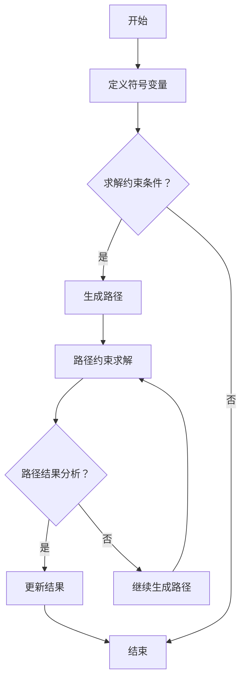
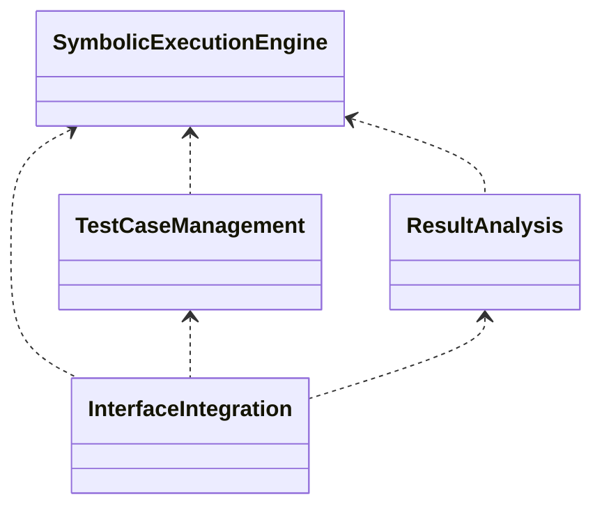
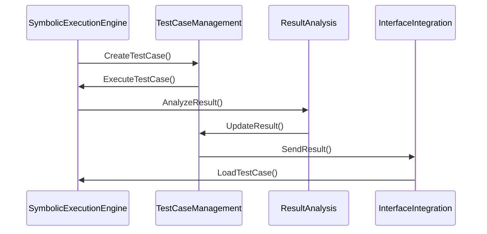

                 


### 第1章：引言与背景

#### 1.1 问题背景

在现代软件工程中，编程的复杂性不断增加，传统的方法已经难以满足日益增长的软件质量和性能要求。在这种背景下，提示词编程（Prompt-based Programming）应运而生。提示词编程是一种新兴的编程范式，它允许开发人员使用自然语言或结构化指令来描述程序的行为，从而减少代码的编写量和提高开发效率。

**提示词编程的核心优势：**

1. **代码简洁性**：通过自然语言或结构化指令描述程序逻辑，使代码更简洁、易读、易维护。
2. **跨领域适应性**：提示词编程使得非专业开发人员也能够快速上手，实现不同领域应用的开发。
3. **开发效率提升**：减少编码工作量，缩短开发周期，提高软件交付速度。

与此同时，符号执行（Symbolic Execution）和程序分析（Program Analysis）作为两种重要的程序分析技术，也在现代软件开发中发挥着重要作用。符号执行通过生成程序的所有可能的执行路径，对程序的各个部分进行详细分析，从而发现潜在的错误和漏洞。程序分析则通过对程序的静态和动态分析，提取程序的关键信息，为优化、测试和调试提供支持。

**符号执行与程序分析的核心优势：**

1. **缺陷发现**：符号执行能够检测出程序中的潜在错误和漏洞，提高软件质量。
2. **路径覆盖分析**：通过对程序执行路径的分析，评估测试用例的有效性，提高测试覆盖率。
3. **性能优化**：程序分析技术能够发现程序的瓶颈，为性能优化提供指导。

本文将探讨提示词编程、符号执行和程序分析之间的内在联系，分析它们在现代软件开发中的应用场景，并讨论如何将这些技术整合到一起，以提升软件开发的效率和质量。

#### 1.2 核心概念与关系

在深入探讨提示词编程、符号执行和程序分析之前，我们需要明确这些核心概念的定义和关系。

**1.2.1 符号执行**

符号执行是一种程序分析技术，它通过将程序中的具体输入替换为符号变量，生成程序的所有可能的执行路径。在执行过程中，符号执行器会记录每个路径上的变量值和状态，从而全面分析程序的动态行为。

**1.2.2 程序分析**

程序分析是指对程序代码进行静态或动态分析，以提取程序的关键信息。静态分析主要基于代码的文本进行，不执行程序，而动态分析则通过执行程序来收集信息。程序分析技术包括控制流分析、数据流分析、依赖关系分析等。

**1.2.3 提示词编程**

提示词编程是一种基于自然语言或结构化指令的编程范式，它允许开发人员使用简明易懂的指令来描述程序行为。提示词编程的核心思想是将编程过程转化为一种问题求解过程，使得非专业开发人员也能够参与软件开发。

**1.2.4 关系对比与分析**

下面是一个对比表格，展示了符号执行、程序分析和提示词编程之间的关键区别：

| 特征 | 符号执行 | 程序分析 | 提示词编程 |
| --- | --- | --- | --- |
| 目的 | 生成程序所有执行路径 | 提取程序关键信息 | 简化编程过程 |
| 技术原理 | 符号变量替换 | 静态或动态分析 | 自然语言处理 |
| 应用场景 | 缺陷发现、路径覆盖分析 | 性能优化、测试支持 | 跨领域开发、代码简洁性 |

从上表可以看出，符号执行和程序分析侧重于程序的动态行为分析，而提示词编程则侧重于编程过程的简化和自动化。在实际应用中，这三种技术可以相互结合，共同提升软件开发的效率和质量。

#### 1.3 Mermaid ER 图：概念关系

为了更直观地展示符号执行、程序分析和提示词编程之间的关系，我们可以使用Mermaid ER图进行描述。以下是ER图的Markdown格式：

```mermaid
erDiagram
  SymbolicExecution ||--|{ ProgramAnalysis : 分析 }  
  ProgramAnalysis ||--|{ PromptBasedProgramming : 支持 }  
  PromptBasedProgramming ||--|{ SymbolicExecution : 需求 }  
  PromptBasedProgramming ||--|{ ProgramAnalysis : 需求 }
```

在这个ER图中，SymbolicExecution（符号执行）和ProgramAnalysis（程序分析）是相互关联的，它们共同支持PromptBasedProgramming（提示词编程）。同时，PromptBasedProgramming需要依赖SymbolicExecution和ProgramAnalysis来满足其需求和功能。

通过这个ER图，我们可以清楚地看到这三种技术之间的相互关系，为后续章节的深入探讨奠定了基础。

### 第2章：核心概念与联系

在深入探讨符号执行、程序分析和提示词编程之前，我们需要明确这些核心概念的定义、属性特征以及它们之间的相互关系。本章将详细阐述这些概念，并通过对比表格和ER图来帮助读者更好地理解。

#### 2.1 符号执行

符号执行（Symbolic Execution）是一种程序分析技术，它通过将程序的具体输入替换为符号变量，生成程序的所有可能的执行路径。在执行过程中，符号执行器会记录每个路径上的变量值和状态，从而全面分析程序的动态行为。

**符号执行的属性特征：**

1. **符号变量**：符号执行使用符号变量来表示程序中的实际输入，这些符号变量可以代表任意数据类型。
2. **路径覆盖**：符号执行生成程序的所有可能的执行路径，从而实现对程序各个部分的全面覆盖。
3. **条件判定**：符号执行在执行过程中会根据条件判定选择不同的路径，从而模拟程序的实际运行过程。
4. **抽象域**：符号执行使用抽象域来表示程序的状态，这些抽象域可以是整数、布尔值等，用于简化程序分析过程。

**符号执行的优势：**

- **全面性**：符号执行能够生成程序的所有可能的执行路径，从而全面分析程序的动态行为。
- **精确性**：符号执行在分析过程中使用符号变量，可以精确地模拟程序的实际运行过程。
- **自动化**：符号执行可以通过自动化工具实现，降低人工分析的工作量。

#### 2.2 程序分析

程序分析（Program Analysis）是指对程序代码进行静态或动态分析，以提取程序的关键信息。程序分析技术包括控制流分析、数据流分析、依赖关系分析等。

**程序分析的技术原理：**

1. **静态分析**：静态分析主要基于代码的文本进行，不执行程序。它通过语法分析、语义分析等方法，提取程序的结构信息、变量依赖关系等。
2. **动态分析**：动态分析通过执行程序来收集信息。它可以在程序运行过程中收集性能数据、异常信息等，从而对程序进行实时分析。

**程序分析的属性特征：**

1. **控制流分析**：控制流分析用于分析程序的执行顺序和分支情况，确定程序的控制流图。
2. **数据流分析**：数据流分析用于分析程序中的变量依赖关系和数据传递路径，确定变量的定义和使用位置。
3. **依赖关系分析**：依赖关系分析用于分析程序模块之间的依赖关系，确定模块之间的调用和被调用关系。

**程序分析的优势：**

- **优化**：程序分析可以用于优化程序性能，如减少冗余代码、优化算法等。
- **测试**：程序分析可以用于测试用例的设计和优化，提高测试覆盖率。
- **调试**：程序分析可以用于辅助调试，发现程序中的潜在错误和漏洞。

#### 2.3 提示词编程

提示词编程（Prompt-based Programming）是一种基于自然语言或结构化指令的编程范式，它允许开发人员使用简明易懂的指令来描述程序行为。提示词编程的核心思想是将编程过程转化为一种问题求解过程，使得非专业开发人员也能够参与软件开发。

**提示词编程的属性特征：**

1. **自然语言处理**：提示词编程使用自然语言或结构化指令作为编程语言，使得代码更易读、易理解。
2. **任务驱动**：提示词编程基于任务驱动，开发人员只需描述任务的目标和条件，系统会自动生成相应的代码。
3. **可扩展性**：提示词编程支持自定义指令和模块，方便开发人员扩展功能。

**提示词编程的优势：**

- **易用性**：提示词编程降低了编程难度，使得非专业开发人员也能快速上手。
- **效率提升**：提示词编程简化了编程过程，提高了开发效率。
- **跨领域适应性**：提示词编程支持跨领域开发，使得不同领域的应用开发更加便捷。

#### 2.4 对比表格

为了更好地理解符号执行、程序分析和提示词编程之间的区别，下面是一个对比表格：

| 特征 | 符号执行 | 程序分析 | 提示词编程 |
| --- | --- | --- | --- |
| 目的 | 生成程序所有执行路径 | 提取程序关键信息 | 简化编程过程 |
| 技术原理 | 符号变量替换 | 静态或动态分析 | 自然语言处理 |
| 应用场景 | 缺陷发现、路径覆盖分析 | 性能优化、测试支持 | 跨领域开发、代码简洁性 |
| 优势 | 全面性、精确性、自动化 | 优化、测试、调试 | 易用性、效率提升、跨领域适应性 |

通过对比表格，我们可以清晰地看到这三种技术之间的区别和联系。在实际应用中，这些技术可以相互结合，共同提升软件开发的效率和质量。

#### 2.5 Mermaid ER 图：概念关系

为了更直观地展示符号执行、程序分析和提示词编程之间的关系，我们可以使用Mermaid ER图进行描述。以下是ER图的Markdown格式：

```mermaid
erDiagram
  SymbolicExecution ||--|{ ProgramAnalysis : 分析 }  
  ProgramAnalysis ||--|{ PromptBasedProgramming : 支持 }  
  PromptBasedProgramming ||--|{ SymbolicExecution : 需求 }  
  PromptBasedProgramming ||--|{ ProgramAnalysis : 需求 }
```

在这个ER图中，SymbolicExecution（符号执行）和ProgramAnalysis（程序分析）是相互关联的，它们共同支持PromptBasedProgramming（提示词编程）。同时，PromptBasedProgramming需要依赖SymbolicExecution和ProgramAnalysis来满足其需求和功能。

通过这个ER图，我们可以清楚地看到这三种技术之间的相互关系，为后续章节的深入探讨奠定了基础。

### 第3章：算法原理讲解

在前两章中，我们介绍了符号执行、程序分析和提示词编程的核心概念。在这一章中，我们将深入探讨符号执行的算法原理，并通过具体的Python代码示例和Mermaid流程图来帮助读者更好地理解。

#### 3.1 符号执行的基本概念

符号执行是一种动态程序分析技术，它通过将程序的具体输入替换为符号变量，生成程序的所有可能的执行路径。在执行过程中，符号执行器会记录每个路径上的变量值和状态，从而全面分析程序的动态行为。符号执行的核心思想是使用符号变量来表示程序的实际输入，然后通过约束求解器求解程序的所有可能执行路径。

#### 3.2 符号执行的工作原理

符号执行的工作原理可以概括为以下步骤：

1. **符号输入**：将程序的具体输入替换为符号变量。这些符号变量可以是整数、布尔值、字符串等，用于表示程序中的各种数据类型。
2. **路径生成**：根据程序的语法结构和语义，生成所有可能的执行路径。在生成路径时，符号执行器会记录每个路径上的变量值和状态。
3. **路径约束求解**：使用约束求解器求解每个路径上的约束条件。约束求解器会尝试找到满足约束条件的符号变量值，从而确定程序的实际执行路径。
4. **结果分析**：对每个路径的结果进行分析，包括检查路径上的变量值、状态和输出。通过分析，可以找出程序中的潜在错误、漏洞和性能瓶颈。

#### 3.3 Python代码示例

下面是一个简单的Python代码示例，用于演示符号执行的基本原理。该示例使用了Python的`z3-solver`库来求解符号变量。

```python
from z3 import *

# 定义符号变量
x = Int('x')
y = Int('y')
z = Int('z')

# 定义约束条件
s = Solver()
s.add(x > 0)
s.add(y > 0)
s.add(z == x + y)

# 求解约束条件
if s.check():
    model = s.model()
    print(f"Solution: x={model[x], y={model[y], z={model[z]}}")

# 生成所有可能的执行路径
# 示例：条件分支
condition = Bool('condition')
s2 = Solver()
s2.add(condition)
s2.push()
s2.add(condition)
s2.push()
s2.add(not condition)

for i in range(3):
    if s2.check():
        model = s2.model()
        if i == 0:
            print(f"Path {i+1}: condition is True, x={model[x], y={model[y], z={model[z]}}")
        elif i == 1:
            print(f"Path {i+1}: condition is False, x={model[x], y={model[y], z={model[z]}}")
        else:
            print(f"Path {i+1}: condition is True, x={model[x], y={model[y], z={model[z]}}")
    else:
        print(f"Path {i+1}: no solution")

s2.pop()
s2.pop()
```

在这个示例中，我们定义了三个符号变量`x`、`y`和`z`，并使用`z3-solver`库来求解它们的约束条件。首先，我们定义了一个简单的约束条件，即`x > 0`、`y > 0`和`z == x + y`。然后，我们使用`Solver`类来求解这些约束条件，并打印出满足约束条件的解。

接下来，我们生成了一个条件分支的执行路径。在这个示例中，我们定义了一个布尔变量`condition`，并使用`push`和`pop`方法来模拟条件分支的执行路径。对于每个路径，我们使用`check`方法来检查是否满足约束条件，并打印出路径上的变量值。

#### 3.4 Mermaid流程图

为了更直观地展示符号执行的过程，我们可以使用Mermaid流程图来描述。以下是符号执行的Mermaid流程图：



在这个流程图中，我们从开始节点（A）定义符号变量，然后进入求解约束条件的分支（C）。如果约束条件有解，我们生成所有可能的执行路径（D），并进入路径约束求解的循环（F）。对于每个路径，我们进行路径结果分析（G），并根据结果更新数据（H）。如果路径结果分析没有新的解，我们继续生成下一个路径。当所有路径都分析完毕后，我们结束流程（E）。

通过这个Mermaid流程图，我们可以清晰地看到符号执行的过程，以及各个步骤之间的逻辑关系。

#### 3.5 数学模型与公式

为了更深入地理解符号执行的原理，我们可以使用数学模型和公式来描述。以下是符号执行的核心数学模型和公式：

1. **路径覆盖公式**：

   $$ \text{Path\_Coverage} = \frac{\text{实际执行路径数}}{\text{所有可能的执行路径数}} $$

   路径覆盖公式表示实际执行路径数与所有可能的执行路径数之间的比例。通过计算路径覆盖，我们可以评估测试用例的有效性和测试覆盖率。

2. **约束求解公式**：

   $$ \text{Constraint} = \text{符号变量} \in \text{约束条件} $$

   约束求解公式表示符号变量与约束条件之间的关系。在符号执行过程中，约束求解器会尝试找到满足约束条件的符号变量值，从而确定程序的实际执行路径。

3. **状态转移公式**：

   $$ \text{State} = \text{执行路径} \rightarrow \text{下一个状态} $$

   状态转移公式表示程序在执行路径上的状态变化。在符号执行过程中，每个执行路径上的状态都会被记录下来，从而形成程序的状态转移图。

通过这些数学模型和公式，我们可以更准确地描述符号执行的过程，并理解符号执行的原理。

### 第4章：系统分析与设计

在前三章中，我们详细探讨了符号执行、程序分析和提示词编程的核心概念和算法原理。在这一章中，我们将通过具体的项目实践，分析系统需求、设计和实现，并使用Mermaid图表来可视化系统架构和功能。

#### 4.1 项目背景

我们选择了一个典型的项目场景——基于符号执行的自动化测试平台。该平台旨在通过符号执行技术，自动化生成测试用例并执行，以提高测试效率和软件质量。

**项目目标：**

1. 设计一个基于符号执行的自动化测试平台，支持多种编程语言的测试。
2. 实现测试用例的自动化生成和执行，提高测试效率。
3. 提供可视化工具，帮助开发人员分析测试结果，定位潜在问题。

#### 4.2 系统需求

**功能需求：**

1. **符号执行引擎**：提供符号执行的基本功能，包括路径生成、约束求解和结果分析。
2. **测试用例管理**：支持测试用例的创建、编辑、删除和执行。
3. **结果分析**：提供测试结果的可视化展示，包括路径覆盖、错误报告等。
4. **接口集成**：支持与其他开发工具（如IDE、持续集成平台等）的集成。

**性能需求：**

1. **路径覆盖**：实现高效的路径覆盖算法，确保测试用例能够覆盖程序的所有关键路径。
2. **执行速度**：优化符号执行引擎的性能，确保测试用例的执行速度满足项目需求。

**非功能需求：**

1. **可扩展性**：设计系统时考虑未来的功能扩展和语言支持。
2. **安全性**：确保系统在处理敏感数据时，遵循数据保护规范。

#### 4.3 系统设计

**系统架构：**

我们采用分层架构设计，将系统分为四个主要模块：符号执行引擎、测试用例管理、结果分析和接口集成。以下是系统架构的Mermaid类图：



在这个类图中，符号执行引擎作为核心模块，与测试用例管理、结果分析和接口集成模块相互关联。测试用例管理负责测试用例的创建、编辑和执行，结果分析模块提供测试结果的可视化展示，接口集成模块则负责与其他开发工具的集成。

**系统接口设计：**

为了实现系统的功能，我们需要设计一系列接口，以便不同模块之间能够进行通信。以下是系统接口的Mermaid序列图：



在这个序列图中，符号执行引擎（SEEngine）向测试用例管理（TCM）发送创建测试用例的请求，TCM执行测试用例并返回结果。然后，符号执行引擎将结果传递给结果分析（RA）模块，RA模块更新测试结果。最后，测试用例管理模块将结果发送到接口集成（II）模块，以便与其他开发工具进行集成。

**系统功能设计：**

1. **符号执行引擎**：符号执行引擎负责生成测试用例的执行路径，并对每个路径的结果进行分析。它提供了一系列接口，如`createTestCase()`、`executeTestCase()`和`analyzeResult()`。
2. **测试用例管理**：测试用例管理模块负责管理测试用例的创建、编辑和执行。它提供了`createTestCase()`、`editTestCase()`、`deleteTestCase()`和`executeTestCase()`等方法。
3. **结果分析**：结果分析模块负责对测试结果进行分析，并提供可视化展示。它提供了`analyzeResult()`、`updateResult()`和`visualizeResult()`等方法。
4. **接口集成**：接口集成模块负责与其他开发工具（如IDE、持续集成平台等）进行集成。它提供了`loadTestCase()`、`sendResult()`和`integrateTools()`等方法。

#### 4.4 Mermaid图表应用

在本章中，我们使用了Mermaid图表来可视化系统的架构和功能设计。通过Mermaid类图和序列图，我们可以直观地了解系统各模块之间的关系和交互流程。

**类图：**

```mermaid
classDiagram
    ClassDef SymbolicExecutionEngine {
        +String name
        +List<Result> results
        +createTestCase(testCase: TestCase): TestCase
        +executeTestCase(testCase: TestCase): Result
        +analyzeResult(result: Result): void
    }
    ClassDef TestCaseManagement {
        +List<T

