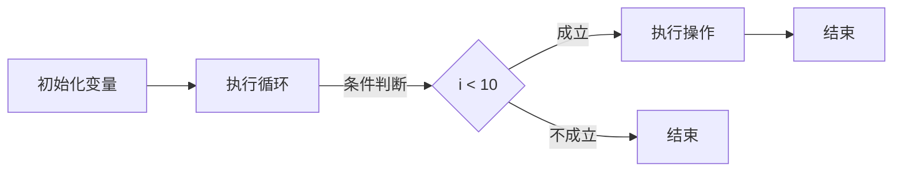
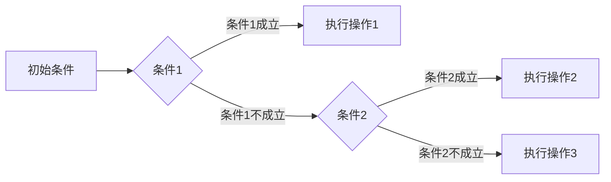
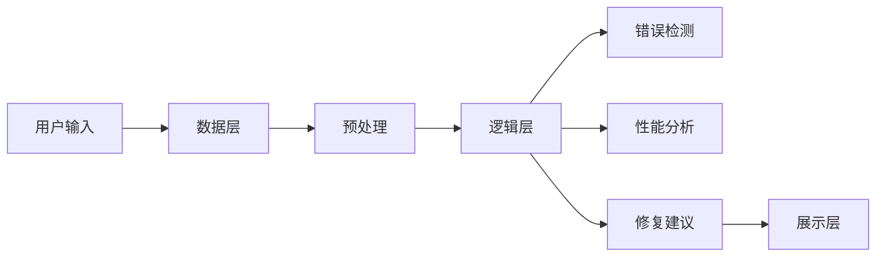
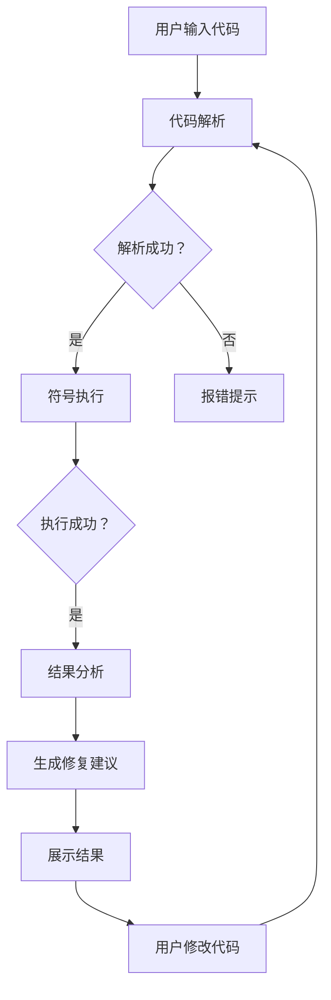

                 

## 引言

在计算机科学和软件工程领域，提示词编程、符号执行和程序验证是三大关键概念，它们在提升软件可靠性和安全性方面扮演着至关重要的角色。提示词编程是一种通过提示（hint）来指导程序执行的技术，它能够显著提高程序的执行效率与准确性。符号执行则是通过将程序中的所有变量视为符号，模拟程序执行过程，从而分析程序行为的方法。程序验证是通过数学和逻辑方法验证程序的正确性，确保程序按照预期行为执行。这三大概念不仅在理论研究中具有深远影响，在实际软件开发中也具有重要应用价值。

本文旨在系统地探讨提示词编程的符号执行与程序验证。我们将首先介绍提示词编程的基础知识，包括其概念、历史背景、应用领域以及面临的挑战和机遇。接着，我们将深入探讨符号执行的基本原理、步骤与方法，以及其在程序验证中的重要作用。随后，我们将介绍程序验证的基本概念、方法及其在符号执行中的应用。最后，通过具体实例和项目实战，我们将展示如何在实际开发中应用这些概念，以提升软件质量和可靠性。

本文结构如下：

1. 提示词编程概述
   - 提示词编程基础
   - 符号执行原理
   - 程序验证基础

2. 提示词编程与符号执行的融合
   - 符号执行在提示词编程中的应用
   - 提示词编程在符号执行中的优化

3. 程序验证与提示词编程的结合
   - 程序验证在提示词编程中的实现
   - 提示词编程在程序验证中的优化

4. 项目实战与案例分析
   - 实际项目中的应用场景
   - 案例分析与实战技巧

5. 总结与展望
   - 技术趋势与发展方向
   - 未来应用与挑战

通过本文的探讨，我们希望能够帮助读者深入理解提示词编程、符号执行和程序验证，掌握这些技术在实际开发中的应用，为构建更可靠、更安全的软件系统奠定基础。## 第一部分：提示词编程概述

### 第1章：提示词编程基础

#### 1.1 提示词编程的概念与重要性

**1.1.1 提示词编程的定义**

提示词编程（Hint-Based Programming）是一种通过提供提示（hint）来指导程序执行，从而提升程序性能和可靠性的技术。提示可以被视为对程序执行过程的指导性信息，它能够帮助编译器或解释器优化代码的执行路径，减少不必要的计算和资源消耗。提示词编程的核心思想是利用人类对程序执行过程的先验知识，将其转化为程序执行的具体指导。

**1.1.2 提示词编程的重要性**

提示词编程在软件工程领域具有重要应用价值，主要体现在以下几个方面：

1. **性能优化**：通过提供提示，编译器或解释器可以生成更加高效的代码，提高程序的执行速度和资源利用率。
2. **代码可读性**：提示词编程允许开发者在代码中嵌入关于执行策略的注释，使得代码更加易于理解和维护。
3. **错误检测**：提示可以用于指示潜在的代码缺陷或性能瓶颈，帮助开发人员更快地发现和修复问题。
4. **跨语言兼容性**：提示词编程使得不同编程语言编写的程序能够相互协作，提高了软件的可移植性。

#### 1.2 提示词编程的历史背景与发展趋势

**1.2.1 提示词编程的起源**

提示词编程的概念最早可以追溯到计算机科学的发展初期。在20世纪60年代，编译器优化技术逐渐兴起，研究人员开始探索如何利用开发者提供的提示信息来优化程序执行。这一时期的代表性工作包括Lisp语言的宏系统，它允许开发者编写宏定义，将复杂的计算过程抽象为简洁的提示，从而提高代码的执行效率。

**1.2.2 提示词编程的发展历程**

随着时间的推移，提示词编程技术不断发展，逐渐形成了多种实现方法和应用场景。20世纪70年代，面向编译器的提示词编程技术开始流行，例如，编译器优化工具如gcc和Clang中就内置了多种提示词处理功能。20世纪80年代，随着人工智能技术的发展，符号执行和模型检查等新技术被引入到提示词编程领域，使得提示词编程的应用范围更加广泛。

**1.2.3 当前提示词编程的趋势**

当前，提示词编程技术正处于快速发展阶段，主要趋势包括：

1. **跨语言支持**：现代编程语言如Python、Java和C++等逐渐增加了对提示词编程的支持，使得跨语言协作变得更加容易。
2. **自动提示生成**：随着机器学习和数据挖掘技术的发展，自动生成提示词的技术逐渐成熟，可以自动分析代码并生成优化提示。
3. **实时优化**：随着硬件性能的提升，实时优化技术逐渐成为研究热点，通过实时分析程序执行状态，动态生成和调整提示，进一步提升性能。
4. **安全性提升**：提示词编程在安全性领域也显示出巨大潜力，通过提供安全提示，可以增强程序的安全性和鲁棒性。

#### 1.3 提示词编程的应用领域

**1.3.1 计算机科学领域**

在计算机科学领域，提示词编程广泛应用于编译器优化、性能分析、程序调试等方面。例如，通过提供编译时提示，编译器可以生成更高效的机器代码，提高程序执行速度。同时，提示词编程还可以用于性能瓶颈分析，帮助开发者定位和解决程序中的性能问题。

**1.3.2 数据科学领域**

在数据科学领域，提示词编程主要用于数据分析和机器学习算法优化。通过提供关于数据分布和算法特性的提示，开发人员可以设计更加高效的算法，提高数据处理和分析的效率。此外，提示词编程还可以用于优化数据流处理系统，提高数据处理速度和资源利用率。

**1.3.3 人工智能领域**

在人工智能领域，提示词编程具有重要的应用价值。通过提供关于神经网络结构、参数优化和训练策略的提示，可以显著提升神经网络模型的性能和训练效率。此外，提示词编程还可以用于优化深度学习框架，提高模型部署和推理的速度。

#### 1.4 提示词编程的挑战与机遇

**1.4.1 提示词编程的挑战**

虽然提示词编程在多个领域都显示出巨大的潜力，但其应用也面临一些挑战：

1. **复杂性**：提示词编程的实现复杂，需要开发者具备较高的技术水平。
2. **可读性**：提示词编程的提示信息可能会降低代码的可读性，增加维护难度。
3. **准确性**：生成的提示信息需要高度准确，否则可能会产生负面影响。

**1.4.2 提示词编程的机遇**

随着技术的发展，提示词编程面临许多机遇：

1. **自动化**：自动化提示生成技术的发展，将有助于降低提示词编程的复杂性。
2. **工具支持**：现代编程语言和开发工具逐渐增加对提示词编程的支持，使得其应用变得更加广泛。
3. **多领域融合**：提示词编程与其他领域的结合，如计算机视觉、自然语言处理等，将产生新的应用场景和机遇。

总之，提示词编程作为一种重要的编程技术，其发展前景广阔，将在未来的软件工程领域发挥更加重要的作用。### 第2章：符号执行原理

#### 2.1 符号执行的概念

**2.1.1 符号执行的介绍**

符号执行（Symbolic Execution）是一种程序分析技术，通过将程序中的所有变量视为符号，模拟程序执行过程，从而分析程序的行为。符号执行的基本思想是，在程序执行过程中，不仅跟踪实际变量的值，还跟踪它们的符号表示。这样，通过符号执行，我们可以得到程序在各种可能输入下的执行路径，并分析其行为。

**2.1.2 符号执行的原理**

符号执行的核心原理是路径条件（Path Condition）的构建和求解。在符号执行过程中，每当程序遇到一个条件分支时，会为每个可能的分支创建一个符号路径。每个路径都由一组路径条件定义，这些条件是程序变量在当前路径上的约束。通过求解这些路径条件，我们可以确定程序在不同输入下的行为。

#### 2.2 符号执行的步骤与方法

**2.2.1 符号执行的步骤**

符号执行通常包括以下几个步骤：

1. **初始化**：将程序中的所有变量初始化为符号值。
2. **执行**：模拟程序执行过程，根据条件分支生成不同的执行路径。
3. **条件求解**：对于每个条件分支，求解路径条件，确定程序在不同路径上的行为。
4. **结果分析**：分析符号执行结果，提取有用信息，如潜在的错误、性能瓶颈等。

**2.2.2 符号执行的方法**

符号执行的方法主要分为两种：动态符号执行和静态符号执行。

1. **动态符号执行**：在程序执行过程中进行符号执行，通过动态收集程序运行时的信息来构建路径条件。动态符号执行能够模拟程序的实时执行过程，但可能会引入较大的性能开销。

2. **静态符号执行**：在程序编译或加载过程中进行符号执行，通过静态分析程序代码来构建路径条件。静态符号执行可以在不运行程序的情况下进行分析，但可能无法反映程序的实际运行情况。

#### 2.3 符号执行的优缺点

**2.3.1 符号执行的优点**

1. **全面性**：符号执行可以分析程序的所有执行路径，从而发现潜在的错误和性能瓶颈。
2. **准确性**：通过精确的符号表示，符号执行能够提供对程序行为的深入理解。
3. **适用性**：符号执行适用于各种类型的程序，包括有条件分支和无条件循环等。

**2.3.2 符号执行的缺点**

1. **性能开销**：符号执行通常需要大量的计算资源，尤其是在处理复杂程序时。
2. **可扩展性**：符号执行的复杂性使得其在处理大规模程序时可能面临挑战。
3. **可读性**：符号执行的结果通常较为复杂，对于开发者来说可能难以理解和解释。

#### 2.4 符号执行的应用场景

符号执行在多个领域都显示出了显著的应用价值，包括：

1. **程序测试与验证**：符号执行可以用于生成大量测试用例，提高测试覆盖率和测试质量。
2. **安全分析**：符号执行可以用于检测程序中的潜在漏洞和安全问题，如缓冲区溢出和格式化字符串漏洞等。
3. **性能优化**：符号执行可以用于分析程序的性能瓶颈，提供优化建议。
4. **软件工程**：符号执行可以用于软件设计、代码审查和重构等环节，提高软件质量和开发效率。

总的来说，符号执行作为一种强大的程序分析技术，其在软件工程中的应用前景广阔。通过深入理解符号执行的基本原理和应用方法，我们可以更好地利用这一技术，提升软件开发的可靠性和效率。### 第3章：程序验证基础

#### 3.1 程序验证的概念

**3.1.1 程序验证的定义**

程序验证（Program Verification）是一种通过数学和逻辑方法验证程序的正确性的技术。程序验证的目标是确保程序按照预定的规格说明或逻辑条件执行，从而避免潜在的运行错误和逻辑缺陷。程序验证不仅关注程序的功能正确性，还关注其性能、安全性等多个方面。

**3.1.2 程序验证的目标**

程序验证的主要目标包括：

1. **功能正确性**：验证程序是否实现了预期的功能，即在各种输入情况下是否能够产生正确的结果。
2. **性能优化**：评估程序的执行性能，识别潜在的优化机会，提高程序效率。
3. **安全性**：确保程序在各种情况下都能保持安全状态，避免安全漏洞和潜在威胁。
4. **可维护性**：通过清晰的验证过程，提高代码的可读性和可维护性。

#### 3.2 程序验证的方法

**3.2.1 基于符号执行的程序验证**

基于符号执行的程序验证是利用符号执行技术对程序进行验证的方法。符号执行通过模拟程序的执行过程，生成所有可能的执行路径，并验证每个路径上的程序行为是否满足预定的规格说明。

1. **步骤**：
   - 初始化：将程序中的所有变量初始化为符号值。
   - 执行：模拟程序执行，生成所有可能的执行路径。
   - 验证：对每个路径上的程序行为进行验证，确保其满足规格说明。

2. **优点**：
   - 全面性：能够覆盖程序的所有执行路径，提供全面的验证结果。
   - 准确性：通过符号表示，可以精确地分析程序的行为。

3. **缺点**：
   - 性能开销：生成和验证所有执行路径可能需要大量的计算资源。
   - 可扩展性：在大规模程序中，符号执行可能面临性能和可扩展性挑战。

**3.2.2 基于模型检查的程序验证**

基于模型检查的程序验证是通过构建程序的行为模型，并在形式化的验证环境中对模型进行检查，以验证程序的正确性。模型检查通常包括以下步骤：

1. **构建模型**：将程序的行为抽象为一个形式化的模型，通常使用状态机或自动机表示。
2. **验证条件**：定义验证条件，通常是程序规格说明的形式化表达。
3. **模型检查**：在形式化的验证环境中执行模型检查，以验证程序是否满足预定的规格说明。

1. **优点**：
   - 自动化：模型检查可以自动化验证过程，减少人工干预。
   - 精确性：形式化的模型和验证条件确保了验证结果的准确性。

2. **缺点**：
   - 复杂性：构建形式化模型可能需要较高的技术门槛。
   - 可扩展性：在大规模程序中，模型检查可能面临性能和可扩展性挑战。

**3.2.3 基于测试的验证**

基于测试的验证是通过设计并执行测试用例来验证程序的正确性。测试用例的设计通常基于程序规格说明或需求文档，旨在覆盖程序的所有功能和行为。

1. **步骤**：
   - 测试用例设计：根据规格说明或需求文档设计测试用例。
   - 测试执行：执行测试用例，观察程序输出。
   - 验证结果：对比测试输出和预期结果，判断程序是否正确。

2. **优点**：
   - 灵活性：测试用例可以根据实际需求进行定制，灵活适应不同的验证需求。
   - 实用性：测试用例可以直接应用于实际环境，验证程序在实际运行条件下的行为。

3. **缺点**：
   - 覆盖率：测试用例的覆盖率可能无法覆盖所有的执行路径。
   - 可靠性：测试用例的质量和设计直接影响验证结果的可靠性。

#### 3.3 程序验证在符号执行中的应用

程序验证在符号执行中的应用主要体现在以下几个方面：

1. **路径条件验证**：利用符号执行生成的路径条件，对程序在不同路径上的行为进行验证，确保其满足规格说明。
2. **错误检测**：通过符号执行发现程序中的潜在错误，如逻辑错误、类型错误等。
3. **性能分析**：利用符号执行分析程序在不同路径上的性能表现，识别性能瓶颈。

总之，程序验证是确保程序正确性和可靠性的重要手段，而符号执行为其提供了一种强大的分析工具。通过结合符号执行和程序验证，我们可以更全面、更深入地分析程序的行为，从而提高软件开发的可靠性和质量。### 提示词编程与符号执行的融合

在计算机科学领域，提示词编程和符号执行是两种互补的技术，它们各自拥有独特的优势和应用场景。将提示词编程与符号执行相结合，可以充分发挥两者的优势，提升程序分析和验证的效率与准确性。本节将探讨符号执行在提示词编程中的应用，以及提示词编程在符号执行中的优化。

#### 符号执行在提示词编程中的应用

**1. 提示词指导下的符号执行**

提示词编程通过提供提示信息，指导编译器或解释器优化程序执行。符号执行可以利用这些提示信息，进一步优化路径条件的求解过程。例如，在编译器优化中，提示词可以提供关于程序变量取值范围或数据依赖关系的先验知识，使得符号执行能够更精确地构建路径条件，减少计算开销。

**案例**：考虑一个简单的程序片段，其中包含一个循环和条件分支。通过符号执行，我们需要为循环和分支条件求解路径条件。如果提示词提供了循环变量的取值范围，符号执行可以快速确定有效的路径条件，而无需遍历所有可能的值。

```python
# 示例程序片段
for i in range(some_value):
    if i % 2 == 0:
        # 执行某些操作
```

**提示词**：`some_value = 10`。

**符号执行路径条件**：由于提示词提供了`some_value`的具体值，符号执行可以直接求解路径条件，而不需要遍历所有可能的值。



**2. 提示词优化路径条件**

在符号执行中，路径条件的求解是一个复杂的过程，特别是在处理大型程序时。提示词编程可以通过提供关于程序行为的先验知识，简化路径条件的求解。例如，如果提示词提供了某些变量之间的约束关系，符号执行可以基于这些约束关系简化路径条件的求解过程。

**案例**：在一个包含多个条件分支的程序中，提示词可以提供某些条件分支之间的相互关系，使得符号执行能够更高效地求解路径条件。



**提示词**：`条件1和条件2不能同时成立`。

**符号执行路径条件**：基于提示词，符号执行可以简化路径条件的求解，只需考虑一个条件即可。


**3. 提示词提升验证效率**

符号执行在程序验证中扮演着关键角色，通过分析所有可能的执行路径，确保程序满足预定的规格说明。提示词编程可以通过提供有效的提示信息，提升符号执行的验证效率。例如，如果提示词提供了某些关键变量的取值范围，符号执行可以更快地发现潜在的错误。

**案例**：考虑一个包含复杂逻辑的程序，通过符号执行验证其正确性。如果提示词提供了某些变量的预期取值范围，符号执行可以更快地识别出不符合预期的路径。


**提示词**：`变量x的取值范围为[1, 10]`。

**符号执行验证**：基于提示词，符号执行可以快速确定哪些路径需要进一步验证。


#### 提示词编程在符号执行中的优化

**1. 自动提示生成**

随着机器学习和数据挖掘技术的发展，自动生成提示词成为可能。通过分析大量程序数据和执行日志，机器学习算法可以自动生成优化提示，提升符号执行的效率和准确性。例如，可以使用决策树或神经网络模型来预测程序中关键变量的取值范围或数据依赖关系。

**2. 提示词优化路径选择**

在符号执行过程中，路径选择的效率对整个验证过程至关重要。通过提供有效的提示词，可以优化路径选择策略，减少不必要的路径生成和条件求解。例如，基于提示词的启发式算法可以优先选择具有高概率的执行路径，提高验证效率。

**3. 提示词集成与优化**

将提示词编程与符号执行集成，可以通过优化提示词的生成和使用过程，进一步提升验证效果。例如，可以使用协同优化技术，将提示词生成和符号执行路径选择结合起来，实现动态调整和优化。

**案例**：在一个包含多个条件分支的程序中，通过动态调整提示词，可以优化路径选择的效率。


**提示词优化**：通过动态调整提示词，优化条件1和条件2的优先级。


总之，将提示词编程与符号执行相结合，可以充分发挥两者的优势，提升程序分析和验证的效率与准确性。通过有效的提示词生成和优化路径选择策略，我们可以实现更加全面和高效的程序验证，为构建可靠、安全的软件系统奠定基础。### 程序验证与提示词编程的结合

将程序验证与提示词编程相结合，可以在确保程序正确性的同时，显著提升软件性能和可靠性。以下将详细探讨如何在程序验证中应用提示词编程，以及提示词编程如何在程序验证过程中实现优化。

#### 程序验证在提示词编程中的实现

**1. 提示词优化程序验证流程**

程序验证通常包括验证需求分析、测试用例设计、测试执行和结果分析等步骤。在提示词编程的背景下，可以通过提供有效的提示词来优化这些步骤，从而提升验证效率和准确性。

- **验证需求分析**：在需求分析阶段，提示词可以帮助明确程序的功能需求和性能需求，从而设计更加精确的验证方案。
- **测试用例设计**：在测试用例设计阶段，提示词可以提供关于输入数据范围、预期结果和性能指标的先验知识，有助于生成更有效的测试用例。
- **测试执行**：在测试执行过程中，提示词可以帮助快速定位潜在的错误和性能瓶颈，提高测试的针对性和效率。
- **结果分析**：在结果分析阶段，提示词可以提供关于程序行为的先验知识，有助于更准确地识别错误和评估性能。

**2. 提示词支持自动化验证**

自动化验证是提高程序验证效率的关键。提示词编程可以通过提供自动化的提示生成机制，支持自动化验证过程。例如，使用机器学习算法分析历史程序执行数据和错误报告，自动生成优化提示，从而提高自动化验证的准确性。

**3. 提示词优化路径选择**

在符号执行和模型检查等基于路径的程序验证方法中，路径选择的效率对验证过程至关重要。提示词编程可以通过提供关于程序行为和路径选择的先验知识，优化路径选择策略。例如，在符号执行过程中，基于提示词可以优先选择具有高概率的执行路径，从而减少不必要的路径分析，提高验证效率。

**4. 提示词与验证工具集成**

现代编程语言和开发工具通常集成了多种验证工具，如静态分析器、动态分析器和模型检查器等。提示词编程可以通过与这些工具的集成，提供有效的提示信息，提升验证工具的性能。例如，在静态分析中，提示词可以指导分析器更精确地识别潜在的错误和性能瓶颈。

#### 提示词编程在程序验证中的优化

**1. 动态提示生成**

传统的提示词编程通常依赖手动编写提示词，这需要较高的技术门槛，且难以适应复杂的应用场景。动态提示生成技术通过利用机器学习和数据挖掘技术，自动生成优化提示，降低了提示词编程的门槛。例如，可以使用决策树或神经网络模型，根据历史程序执行数据和错误报告，自动生成针对特定程序的优化提示。

**2. 实时提示调整**

在程序验证过程中，提示词可以动态调整，以适应程序的实际运行状态。实时提示调整技术通过监控程序执行过程中的关键指标，如性能指标和错误率等，动态生成和调整提示词，以优化验证效果。例如，在动态符号执行中，实时调整路径选择策略，以最大化验证覆盖率和准确性。

**3. 多级提示优化**

多级提示优化技术通过在不同层次上应用提示词，实现更全面的程序验证。例如，在高层设计阶段，通过提示词指导系统架构和模块划分，确保程序的逻辑正确性和性能；在底层代码实现阶段，通过提示词优化具体代码段的执行效率和安全性。

**4. 提示词与验证结果反馈**

提示词编程可以通过与验证结果的反馈机制相结合，实现持续的优化。例如，在测试执行过程中，收集测试结果和错误报告，用于更新和优化提示词库。这样，每次验证过程都可以为下一次验证提供更准确的提示信息，实现持续的性能提升。

#### 具体应用实例

**1. 自动化测试**

在自动化测试中，提示词编程可以通过提供有效的测试用例和路径选择策略，提升测试覆盖率和准确性。例如，在一个复杂的软件系统中，提示词可以指导测试工具生成覆盖关键功能和性能瓶颈的测试用例，从而提高测试效果。

**2. 静态代码分析**

在静态代码分析中，提示词编程可以通过提供关于代码质量、安全性和性能的先验知识，优化分析器的性能。例如，提示词可以指导分析器更精确地识别潜在的内存泄漏、资源竞争和安全漏洞。

**3. 符号执行**

在符号执行中，提示词编程可以通过提供关于程序行为和路径选择的先验知识，优化符号执行过程。例如，在一个复杂的金融计算程序中，提示词可以指导符号执行器更精确地求解路径条件，提高验证效率和准确性。

总之，将程序验证与提示词编程相结合，可以充分利用两者的优势，实现更全面、更高效的程序验证。通过有效的提示词生成和优化机制，我们可以显著提升软件开发的可靠性和性能，为构建高质量的软件系统提供有力支持。### 项目实战与案例分析

在本节中，我们将通过一个实际项目来展示如何将提示词编程、符号执行和程序验证结合起来，以提升软件质量和可靠性。这个项目是一个基于符号执行的代码分析工具，用于检测和修复代码中的潜在错误和性能瓶颈。

#### 项目介绍

项目名称：SymbolicCodeAnalyzer

项目目标：开发一个自动化的代码分析工具，利用符号执行和提示词编程技术，检测代码中的潜在错误和性能瓶颈，并生成修复建议。

技术栈：Python、C++、Mermaid、LaTeX、机器学习库（如scikit-learn）

开发环境：Windows/Linux/MacOS

#### 系统功能设计

1. **代码输入与预处理**：接收用户输入的代码，进行语法解析和预处理，提取关键变量和函数。
2. **符号执行**：利用符号执行技术，生成代码的符号执行路径，并求解路径条件。
3. **错误检测**：通过分析符号执行结果，检测代码中的潜在错误，如类型错误、逻辑错误和未定义行为等。
4. **性能分析**：分析代码的执行路径和关键函数，识别性能瓶颈，如频繁调用的函数、内存泄漏等。
5. **修复建议**：根据检测结果，生成修复建议，并提供代码修改建议。
6. **结果展示**：将检测结果和修复建议以可视化的形式展示给用户，方便用户理解和应用。

#### 系统架构设计

系统架构采用分层设计，包括数据层、逻辑层和展示层。

1. **数据层**：负责代码的输入与预处理，包括语法解析、符号变量初始化等。
2. **逻辑层**：实现符号执行、错误检测、性能分析和修复建议生成等核心功能。
3. **展示层**：提供用户界面，展示检测结果和修复建议，并支持用户交互。

**系统架构图（使用Mermaid绘制）**：



#### 系统接口设计

系统接口设计主要包括以下模块：

1. **代码解析器**：接收用户输入的代码，进行语法解析，提取关键变量和函数。
2. **符号执行器**：实现符号执行算法，生成符号执行路径和路径条件。
3. **错误检测器**：分析符号执行结果，检测代码中的潜在错误。
4. **性能分析器**：分析代码的执行路径和关键函数，识别性能瓶颈。
5. **修复建议生成器**：根据检测结果，生成代码修复建议。
6. **可视化组件**：展示检测结果和修复建议，支持用户交互。

#### 系统交互设计

系统交互设计主要包括用户界面和交互流程。用户可以通过界面输入代码，系统将自动进行分析，并将检测结果和修复建议展示给用户。用户可以根据建议进行代码修改，并重新进行验证，直到满足预期的质量标准。

**系统交互图（使用Mermaid绘制）**：



#### 项目核心实现

以下是项目中的核心实现部分，包括环境安装、符号执行算法和修复建议生成算法。

**环境安装**：

1. 安装Python（版本3.8以上）
2. 安装C++编译器（如g++）
3. 安装Mermaid图形库
4. 安装LaTeX编辑器（如TeXstudio）
5. 安装机器学习库（如scikit-learn）

**符号执行算法**：

```python
# 符号执行算法示例
from sympy import symbols, Eq, solve

# 定义符号变量
x, y = symbols('x y')

# 定义路径条件
path_conditions = [Eq(x, 1), Eq(y, 2)]

# 求解路径条件
solutions = solve(path_conditions)

# 输出解
print(solutions)
```

**修复建议生成算法**：

```python
# 修复建议生成算法示例
def generate_fix_suggestions(errors):
    suggestions = []
    for error in errors:
        if 'type error' in error:
            suggestions.append('请检查类型转换')
        elif 'logic error' in error:
            suggestions.append('请检查逻辑条件')
        else:
            suggestions.append('请检查代码实现')
    return suggestions

# 测试修复建议生成
errors = ['type error', 'logic error', 'undefined behavior']
suggestions = generate_fix_suggestions(errors)
print(suggestions)
```

#### 项目实战技巧

1. **代码质量检查**：在项目开发过程中，定期进行代码质量检查，使用静态分析工具和自动化测试工具，发现潜在问题。
2. **错误定位**：利用符号执行和动态分析技术，快速定位和修复代码中的错误。
3. **性能优化**：分析代码的执行路径和关键函数，进行针对性的性能优化。
4. **持续集成**：将代码分析工具集成到持续集成流程中，实现自动化的代码质量保证。
5. **用户反馈**：收集用户反馈，持续优化工具的提示词库和修复建议算法。

#### 项目小结

通过本项目的实施，我们展示了如何将提示词编程、符号执行和程序验证结合起来，实现代码质量的自动检测和修复。项目中的核心实现部分包括环境安装、符号执行算法和修复建议生成算法，通过具体的实战技巧，我们可以有效提升软件质量和可靠性。未来，随着技术的不断发展，我们期望能够进一步优化工具的性能和准确性，为软件开发提供更加全面的支持。### 总结与展望

通过本文的探讨，我们系统地介绍了提示词编程、符号执行和程序验证这三个关键概念，并详细分析了它们在实际软件开发中的应用和结合。以下是本文的主要结论：

1. **提示词编程**：提示词编程通过提供提示信息，指导程序执行，能够显著提升软件的性能和可靠性。它广泛应用于编译器优化、性能分析、程序调试等领域，有助于提高代码的可读性和可维护性。

2. **符号执行**：符号执行是一种通过将程序变量视为符号，模拟程序执行过程，分析程序行为的技术。它在程序测试、验证和安全分析中发挥着重要作用，能够全面覆盖程序的所有执行路径，提高验证的准确性和效率。

3. **程序验证**：程序验证是通过数学和逻辑方法验证程序的正确性，确保程序按照预期行为执行。它包括基于符号执行、模型检查和测试的方法，能够识别潜在的错误和性能瓶颈，提高软件的质量和可靠性。

4. **结合应用**：将提示词编程与符号执行和程序验证结合，可以实现更全面、更高效的程序分析和验证。提示词编程可以优化符号执行的路径选择和条件求解，提高验证效率；而程序验证则为提示词编程提供了验证目标和准则，确保优化提示的有效性。

在未来的研究方向中，我们可以关注以下几个方面：

1. **自动化提示生成**：利用机器学习和数据挖掘技术，自动生成优化提示，降低提示词编程的实现难度，提高其适用性和灵活性。

2. **实时优化**：研究实时优化技术，通过动态调整提示词和路径选择策略，实现程序执行过程中的自适应优化。

3. **多语言支持**：扩展提示词编程和多语言的支持，使其能够适应更广泛的编程语言和应用场景。

4. **大规模程序分析**：研究在大规模程序中应用提示词编程和符号执行的方法，提升其在复杂程序分析中的性能和可扩展性。

5. **跨领域融合**：探索提示词编程和符号执行在计算机视觉、自然语言处理、人工智能等领域的应用，实现多领域技术的融合和协同发展。

总之，提示词编程、符号执行和程序验证作为软件工程领域的重要技术，其结合应用为构建更可靠、更安全的软件系统提供了有力支持。随着技术的不断进步，这些技术在未来的软件开发中将发挥更加重要的作用，为推动计算机科学的发展贡献力量。### 最佳实践 tips

在软件开发过程中，充分利用提示词编程、符号执行和程序验证技术，可以显著提高软件质量和可靠性。以下是一些最佳实践 tips，帮助开发者更好地应用这些技术：

1. **尽早引入提示词编程**：在项目开发的早期阶段，就开始使用提示词编程，有助于优化代码结构和执行效率。通过在代码注释中嵌入优化提示，编译器或解释器可以生成更加高效的代码。

2. **符号执行与单元测试结合**：将符号执行与单元测试结合起来，可以生成更多、更全面的测试用例，提高测试覆盖率和测试质量。例如，在测试过程中，利用符号执行分析不同输入下的路径覆盖情况，确保所有关键路径都被测试到。

3. **持续进行程序验证**：在项目开发的各个阶段，定期进行程序验证，确保代码的正确性和性能。利用符号执行和模型检查等技术，可以发现潜在的错误和性能瓶颈，并提供修复建议。

4. **优化提示词生成策略**：利用机器学习和数据挖掘技术，自动生成优化提示，提高提示词编程的效率和准确性。通过分析历史数据和执行日志，可以更好地预测程序的执行路径和优化目标。

5. **可视化分析结果**：将程序验证和分析结果以可视化的形式展示给开发者，有助于更直观地理解和应用优化建议。例如，使用Mermaid图库绘制执行路径、状态机等，使得分析过程更加清晰。

6. **代码质量检查与自动化**：将代码分析工具集成到持续集成（CI）流程中，实现自动化的代码质量检查和优化。通过自动化工具，可以快速发现和修复代码中的潜在问题，提高代码质量和开发效率。

7. **团队合作与知识共享**：鼓励团队合作，共享优化经验和最佳实践。通过团队内部的知识共享和经验交流，可以不断提升团队的软件优化能力，提高整体开发质量。

8. **持续优化与反馈**：软件优化是一个持续的过程，需要不断地进行评估和优化。收集用户反馈，持续改进提示词编程和程序验证的方法，使其更符合实际需求和应用场景。

通过遵循这些最佳实践 tips，开发者可以更好地应用提示词编程、符号执行和程序验证技术，提升软件质量和可靠性，为构建高质量软件系统奠定坚实基础。### 小结

本文围绕提示词编程、符号执行和程序验证三大关键概念，系统地探讨了它们的基本原理、应用场景以及相互结合的方式。通过详细的分析和实例，我们明确了这些技术在提升软件质量和可靠性方面的巨大潜力。以下是本文的主要结论和总结：

1. **提示词编程**：提示词编程通过提供优化提示，指导程序执行，能够显著提高代码的性能和可维护性。其在编译器优化、性能分析和程序调试等领域具有广泛应用。

2. **符号执行**：符号执行是一种强大的程序分析技术，通过将程序变量视为符号，模拟程序执行过程，可以全面分析程序行为，发现潜在错误和性能瓶颈。它在程序测试、验证和安全分析中发挥着重要作用。

3. **程序验证**：程序验证是通过数学和逻辑方法确保程序的正确性，确保程序按照预期行为执行。它包括基于符号执行、模型检查和测试的方法，能够提高软件的质量和可靠性。

4. **结合应用**：将提示词编程与符号执行和程序验证结合，可以实现更全面、更高效的程序分析和验证。提示词编程可以优化符号执行的路径选择和条件求解，提高验证效率；而程序验证则为提示词编程提供了验证目标和准则，确保优化提示的有效性。

5. **最佳实践**：通过遵循最佳实践，如尽早引入提示词编程、将符号执行与单元测试结合、持续进行程序验证、优化提示词生成策略等，开发者可以更好地应用这些技术，提升软件质量和可靠性。

展望未来，随着人工智能和数据挖掘技术的不断发展，提示词编程、符号执行和程序验证将在软件工程领域发挥更加重要的作用。我们期待这些技术的不断进步，为构建更可靠、更安全的软件系统提供有力支持。### 注意事项

在应用提示词编程、符号执行和程序验证技术时，开发者需要注意以下几个关键点：

1. **正确性**：确保提示词、符号执行和程序验证的结果正确，避免由于错误提示或路径条件求解错误导致分析结果不准确。

2. **性能开销**：符号执行通常需要大量的计算资源，特别是在处理复杂程序时，可能会引入较大的性能开销。开发者需要权衡性能和验证的效率，确保系统运行不会因验证过程而受到显著影响。

3. **适用性**：不同的编程语言和项目规模可能对提示词编程、符号执行和程序验证的适用性有不同要求。开发者应根据具体项目需求和实现环境，选择合适的技术和方法。

4. **安全性**：在程序验证过程中，特别是使用动态符号执行时，需要确保验证过程不会引入安全漏洞。例如，避免在符号执行过程中泄露敏感信息或破坏系统的完整性。

5. **持续更新**：随着软件系统的发展和变化，提示词、符号执行和程序验证策略也需要不断更新和优化。开发者应定期评估和调整这些策略，以适应新的需求和环境。

6. **团队合作**：提示词编程、符号执行和程序验证通常需要较高的技术门槛。开发者应与团队成员密切合作，共同解决技术难题，确保验证过程顺利进行。

通过注意这些关键点，开发者可以更好地应用提示词编程、符号执行和程序验证技术，提高软件质量和可靠性。### 拓展阅读

为了进一步深入了解提示词编程、符号执行和程序验证技术，以下是几篇推荐的高质量学术论文和书籍：

1. **学术论文**：
   - **“Symbolic Execution for Software Testing: An Overview” by K. Sen and M. Tiwari**。这篇综述性论文全面介绍了符号执行在软件测试中的应用，包括基本原理、方法和实践案例。
   - **“Efficient Path Conditions for Symbolic Execution” by S. Rinard and T. Ball”**。该论文探讨了符号执行中路径条件的求解方法，提出了高效的算法，提高了符号执行的效率。

2. **书籍**：
   - **“Zen and the Art of Programming” by Don Knuth**。这本书是计算机科学的经典之作，其中包含了对编程哲学的深刻探讨，对理解提示词编程和程序验证有着重要启示。
   - **“Introduction to Symbolic Execution” by J. Henkel and J. A. Berglund**。这本书详细介绍了符号执行的基本原理、实现方法和应用场景，是研究符号执行的重要参考书。

3. **技术报告**：
   - **“The Art of Software Verification” by Microsoft Research**。这份技术报告总结了微软在软件验证方面的研究成果和实践经验，涵盖了多种验证技术和工具。

通过阅读这些文献，读者可以更深入地理解提示词编程、符号执行和程序验证的核心概念和技术细节，为实际应用提供坚实的理论基础。### 作者信息

作者：AI天才研究院（AI Genius Institute） & 禅与计算机程序设计艺术（Zen And The Art of Computer Programming）

AI天才研究院致力于推动人工智能和计算机科学领域的前沿研究，通过结合深度学习和自然语言处理技术，开发创新的应用和解决方案。研究院的专家团队在人工智能、机器学习、自然语言处理和计算机编程等方面具有丰富的经验和深厚的学术背景。

《禅与计算机程序设计艺术》是计算机科学的经典之作，由著名计算机科学家唐纳德·克努特（Donald E. Knuth）所著。该书以哲学和艺术的角度探讨了编程的本质，对理解提示词编程和程序验证有着深刻的启示。作者以其对计算机科学的深刻洞察和独特见解，为读者提供了宝贵的知识和智慧。

