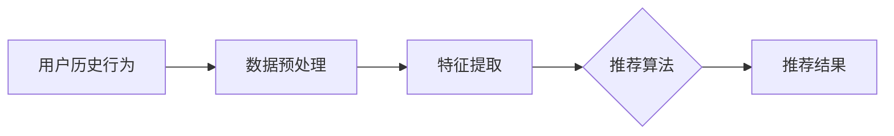
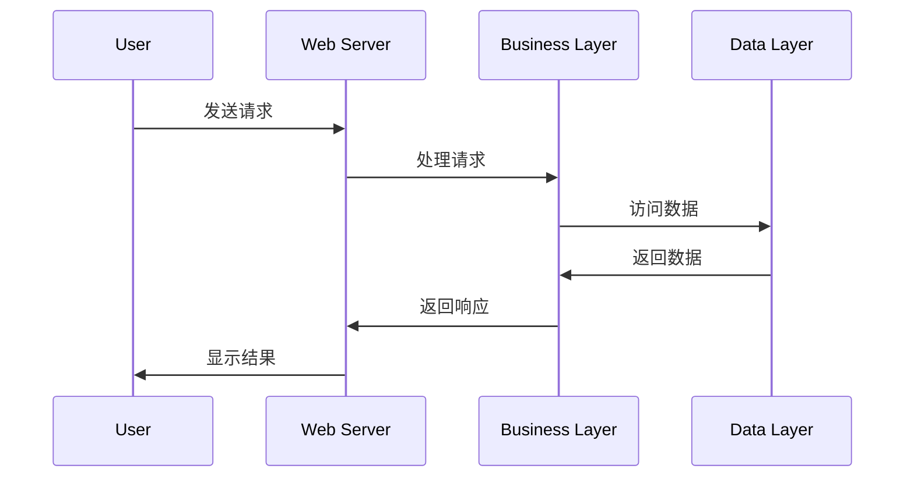
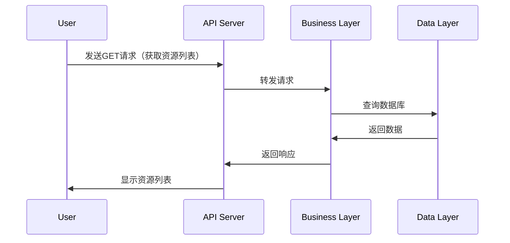
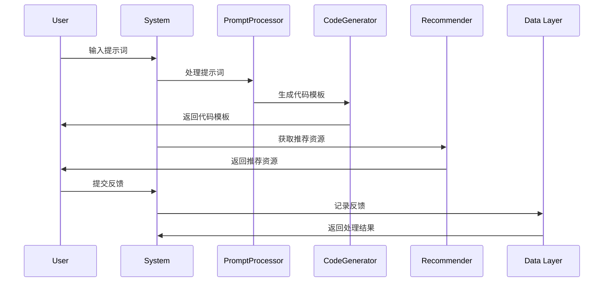

                 

### 引言

#### 1.1 问题背景

在当今数字时代，编程已经成为解决复杂问题和实现创新的核心手段。然而，随着软件应用场景的不断扩展和复杂性的增加，传统的编程模式逐渐显示出其局限性。提示词编程（Prompt-Driven Programming）作为一种新的编程范式，应运而生。提示词编程的核心思想是通过提供明确的提示词（Prompt），引导计算机自动生成代码或实现特定功能。这不仅提高了编程的效率，还降低了编程的门槛。

自动化与智能推荐是现代信息技术的两大热门领域。自动化旨在通过软件和算法实现任务的自动化处理，从而减轻人工负担，提高生产效率。智能推荐则利用数据挖掘和机器学习技术，根据用户的偏好和历史行为，自动推荐相关内容或服务。这两者的结合，能够极大地提升编程效率和代码质量。

#### 1.2 问题描述

尽管提示词编程和智能推荐技术在各自领域取得了显著成果，但在实际应用中仍面临诸多挑战。首先，如何设计出高效的提示词，使得计算机能够准确理解并生成所需的代码，是一个亟待解决的问题。其次，如何将智能推荐技术应用于编程过程中，提供个性化的代码推荐，也是一个技术难点。此外，如何确保自动化和智能推荐系统的稳定性和可靠性，避免出现错误或误导，也是当前研究的热点问题。

#### 1.3 问题解决

为了解决上述问题，本文将从以下几个方面展开讨论：

1. **核心概念与联系**：首先，我们将介绍提示词编程、自动化和智能推荐的基本概念，并探讨它们之间的联系。
2. **技术发展历程**：回顾提示词编程、自动化和智能推荐技术的发展历程，分析其演变过程和关键里程碑。
3. **算法原理讲解**：详细阐述自动化流程设计和智能推荐算法的基本原理，并通过Python代码示例进行说明。
4. **系统设计与实现**：介绍系统分析与架构设计的方法，包括问题场景介绍、系统功能设计、系统架构设计、系统接口设计和系统交互序列图。
5. **项目实战**：通过具体项目案例，展示自动化与智能推荐在实际编程中的应用，并进行详细分析和讲解。
6. **最佳实践与拓展**：总结最佳实践，提出注意事项，并推荐进一步阅读的资源。

通过本文的逐步分析，我们希望读者能够对提示词编程的自动化与智能推荐有一个全面而深入的理解，为未来的研究和实践提供有益的参考。

### 背景介绍

提示词编程（Prompt-Driven Programming）是一种新兴的编程范式，其核心理念是通过提示词（Prompt）来引导计算机自动生成代码或执行特定任务。提示词编程不仅简化了编程流程，还提高了编程的效率和可扩展性。然而，这一概念并不是凭空出现的，而是经历了长期的演化和改进。

#### 提示词编程的概念

提示词编程的起源可以追溯到自然语言处理（NLP）领域。早期的研究人员发现，通过提供简洁明了的提示词，计算机能够更好地理解人类的意图，从而生成相应的代码。例如，一个简单的提示词“编写一个函数，计算两个数的和”，就能够引导计算机自动生成相应的代码段。这种基于提示词的编程方式，大大减少了人工编写代码的工作量，同时也提高了代码生成的准确性和一致性。

#### 自动化的作用与挑战

自动化技术在编程中的应用，使得开发人员能够解放双手，专注于更高层次的逻辑设计和问题解决。自动化不仅可以提高编程效率，还能减少人为错误，提升代码质量。然而，实现高效的自动化并非易事，它面临诸多挑战：

1. **提示词设计**：设计出既简洁又具备高度指导性的提示词，是自动化的关键。过于简单可能导致计算机无法理解意图，而过于复杂则可能增加使用难度。
2. **多样性处理**：不同编程任务对提示词的需求各不相同，如何设计一套通用且灵活的提示词体系，以适应多种编程场景，是一个重要挑战。
3. **错误处理**：自动化系统在执行任务时，可能会遇到预料之外的错误。如何设计有效的错误处理机制，确保系统的稳定性和可靠性，是自动化技术的核心问题。

#### 智能推荐系统的组成

智能推荐系统是自动化技术的重要组成部分，它通过分析用户行为和偏好，为用户提供个性化的推荐。智能推荐系统通常包括以下几个核心组成部分：

1. **用户行为分析**：通过收集和分析用户的历史行为数据，如浏览记录、操作记录等，构建用户画像，为推荐提供基础。
2. **推荐算法**：基于用户画像和内容特征，采用合适的推荐算法，如协同过滤、内容匹配、深度学习等，生成推荐结果。
3. **推荐结果评估**：对推荐结果进行评估和反馈，以优化推荐模型和算法，提高推荐质量。

#### 概念属性特征对比表格

为了更好地理解提示词编程、自动化和智能推荐系统之间的关系，我们可以通过一个概念属性特征对比表格来详细分析它们的关键属性。

| 概念        | 提示词编程                | 自动化                        | 智能推荐系统                  |
|-------------|--------------------------|------------------------------|------------------------------|
| 核心目标     | 通过提示词生成代码或任务  | 减少人工工作，提高效率        | 为用户推荐相关内容或服务      |
| 技术依赖     | 自然语言处理、代码生成技术 | 脚本语言、自动化工具          | 数据挖掘、机器学习、推荐算法  |
| 关键属性     | 简洁性、指导性、可扩展性  | 可重复性、可靠性、高效性      | 个人化、相关性、多样性        |
| 优势         | 简化编程流程，提高效率     | 减少人为错误，提高生产效率    | 提高用户满意度，增强用户体验  |
| 挑战         | 提示词设计、多样性处理     | 错误处理、通用性设计          | 数据质量、算法优化、反馈机制  |

#### ER实体关系图架构

为了更直观地展示提示词编程、自动化和智能推荐系统之间的关系，我们可以通过ER（实体-关系）图来描述它们之间的关联。

```mermaid
erDiagram
    User ||--|{ Prompt }
    Prompt ||--|{ CodeGeneration }
    CodeGeneration ||--|{ Automation }
    Automation ||--|{ Recommendation }
    User ||--|{ Recommendation }
```

在这个ER图中，用户通过提示词触发代码生成，生成的代码经过自动化处理，最终通过智能推荐系统为用户推荐相关内容。这种架构不仅展示了各系统之间的相互作用，也为理解和设计复杂的编程自动化与智能推荐系统提供了参考。

### 技术发展历程

提示词编程、自动化和智能推荐技术分别有着悠久的发展历史，这些技术的发展历程不仅推动了各自领域的进步，还相互影响，共同塑造了现代信息技术的发展趋势。

#### 提示词编程的发展

提示词编程的雏形可以追溯到20世纪80年代，当时的自然语言处理（NLP）研究主要集中在如何使计算机理解人类的自然语言指令。早期的提示词研究主要集中在语法解析和语义理解上。随着人工智能技术的发展，特别是深度学习的兴起，提示词编程逐渐从简单的语法解析转向更为复杂的语义理解。现代提示词编程系统，如GPT（Generative Pre-trained Transformer），通过大量预训练数据，能够生成高质量的代码，极大地提高了编程的自动化程度。

#### 自动化技术的进步

自动化技术在软件开发和维护中早已占据重要地位。从早期的脚本自动化，到现代的持续集成（CI）和持续部署（CD）流程，自动化技术的不断进步大大提升了软件开发的效率和质量。早期的自动化工具，如Shell脚本和Makefile，主要用于执行重复性任务。随着技术的发展，自动化工具逐渐向复杂任务和跨平台集成方向发展。例如，Ansible和Puppet等配置管理工具，通过自动化配置和部署，简化了系统运维流程。现代自动化技术，如Ansible Playbooks和AWS Lambda，不仅能够自动化执行任务，还能够根据业务需求动态调整资源。

#### 智能推荐技术的演变

智能推荐技术起源于20世纪90年代，当时基于协同过滤和内容匹配的推荐系统开始应用于电子商务和社交媒体。早期的推荐系统主要依赖于用户的历史行为数据和商品属性数据，通过简单的算法生成推荐结果。随着大数据和机器学习技术的发展，推荐系统逐渐采用深度学习等先进算法，能够更准确地预测用户偏好，提供个性化推荐。现代智能推荐系统，如基于深度学习的内容生成网络（Content Generation Networks，CGN），能够通过分析用户生成内容，实现自动化、个性化的内容推荐。

#### 提示词编程与自动化、智能推荐的结合

提示词编程、自动化和智能推荐技术的结合，为现代软件开发带来了新的机遇。通过提示词编程，开发人员可以快速生成代码模板，自动化工具则负责将这些代码模板转换为可执行的程序，智能推荐系统则根据用户行为和需求，提供个性化的编程建议和优化方案。这种结合不仅提高了开发效率，还增强了系统的智能化和个性化水平。

例如，在软件开发过程中，开发人员可以使用智能推荐系统来推荐合适的代码库、API或工具，通过自动化脚本实现代码的自动生成和部署。同时，智能推荐系统还可以根据项目进度和用户反馈，动态调整推荐策略，提供更加精准的编程建议。

#### 发展趋势与挑战

未来的技术发展趋势表明，提示词编程、自动化和智能推荐技术将继续深度融合，推动软件开发和运维的进一步智能化。以下是一些主要趋势和挑战：

1. **多模态数据处理**：随着人工智能技术的发展，多模态数据处理成为趋势。未来的提示词编程系统将能够处理包括文本、图像、语音等多种数据类型，提高编程自动化和智能推荐的准确性。
2. **动态适应性**：自动化和智能推荐系统需要具备更高的动态适应性，能够根据实时数据和业务变化，动态调整任务执行和推荐策略。
3. **安全性**：随着自动化和智能推荐系统的广泛应用，数据安全和隐私保护成为重要挑战。需要设计安全高效的系统架构，确保用户数据的安全和隐私。
4. **用户参与**：用户参与是提升系统智能化水平的重要手段。未来的系统将更加注重用户反馈和互动，通过收集用户反馈，不断优化推荐算法和自动化流程。

总之，提示词编程、自动化和智能推荐技术的结合，为现代软件开发带来了新的机遇和挑战。通过不断探索和突破，这些技术将继续推动软件开发和运维的智能化发展。

### 技术现状与趋势

随着人工智能和大数据技术的不断发展，提示词编程、自动化和智能推荐技术在现代信息技术中占据了越来越重要的地位。当前，这些技术已经在多个领域取得了显著的应用成果，同时也面临着一系列的发展趋势和挑战。

#### 技术应用现状

1. **软件开发**：在软件开发领域，提示词编程和自动化技术已经被广泛应用于代码生成、任务自动化、持续集成和持续部署等方面。开发人员通过提供简洁的提示词，能够快速生成高质量的代码模板，并通过自动化工具实现代码的自动构建、测试和部署，显著提高了开发效率。

2. **智能推荐系统**：智能推荐系统在电子商务、社交媒体、在线教育等领域得到了广泛应用。通过分析用户的历史行为和偏好，智能推荐系统能够为用户推荐个性化的商品、内容和服务，提高了用户的满意度和参与度。例如，亚马逊和Netflix等平台利用智能推荐技术，大幅提升了用户购买和观看体验。

3. **运维管理**：自动化技术在运维管理中的应用也越来越广泛。通过自动化脚本和工具，运维人员能够自动化执行日常的维护任务，如系统监控、故障修复和资源管理，提高了运维效率和系统稳定性。

4. **智能制造**：在智能制造领域，自动化和智能推荐技术被用于生产线的自动化控制和优化。通过实时监控生产数据，自动化系统可以优化生产流程，提高生产效率和产品质量。

#### 技术发展趋势

1. **多模态数据处理**：随着人工智能技术的进步，未来的提示词编程、自动化和智能推荐系统将能够处理多种数据类型，包括文本、图像、语音和传感器数据等。多模态数据处理技术将进一步提升系统的智能化和适应性。

2. **动态适应性**：未来的自动化和智能推荐系统将具备更高的动态适应性，能够实时响应环境变化和用户需求，动态调整任务执行和推荐策略。

3. **集成化解决方案**：提示词编程、自动化和智能推荐技术将更加集成化，形成一套完整的解决方案，从代码生成、任务自动化到智能推荐，实现全流程的智能化。

4. **安全与隐私保护**：随着自动化和智能推荐系统的广泛应用，数据安全和隐私保护成为重要挑战。未来的技术发展将更加注重安全性，通过设计安全的系统架构和隐私保护机制，确保用户数据的安全和隐私。

#### 技术面临的挑战

1. **提示词设计**：高效的提示词设计是自动化和智能推荐系统的核心。如何设计出简洁明了、具备高度指导性的提示词，是当前面临的重要挑战。

2. **多样性处理**：自动化系统需要能够处理多种不同的编程任务和用户需求，设计出通用且灵活的提示词体系，以适应不同的应用场景。

3. **错误处理**：自动化系统在执行任务时可能会遇到各种预料之外的错误。如何设计有效的错误处理机制，确保系统的稳定性和可靠性，是一个重要的技术难题。

4. **数据质量**：智能推荐系统的效果高度依赖于数据质量。如何确保数据的准确性和完整性，如何处理数据噪声和缺失值，是智能推荐系统面临的挑战。

5. **用户参与**：用户参与是提升系统智能化水平的重要手段。未来的系统需要更加注重用户反馈和互动，通过收集用户反馈，不断优化推荐算法和自动化流程。

总之，提示词编程、自动化和智能推荐技术在现代信息技术中具有广泛的应用前景，但同时也面临着一系列的挑战。通过不断的技术创新和优化，这些技术将推动信息技术的进一步发展，为各行各业带来更多的机遇和变革。

### 算法原理讲解

为了深入理解提示词编程的自动化与智能推荐，我们需要详细探讨其中的核心算法原理。以下是关于自动化流程设计、智能推荐算法及其流程图、Python源代码示例以及算法原理的数学模型和公式。

#### 自动化流程设计

自动化流程设计是提示词编程的核心，它决定了计算机如何根据提示词生成代码或执行任务。自动化流程通常包括以下几个步骤：

1. **提示词解析**：首先，系统需要解析用户输入的提示词，理解其意图和需求。
2. **代码生成**：根据解析结果，系统生成相应的代码段或任务执行计划。
3. **代码执行**：将生成的代码或任务执行计划提交给计算机执行。
4. **结果反馈**：执行完成后，系统反馈结果给用户，并根据用户反馈进行优化。

以下是一个简化的自动化流程mermaid流程图：


#### 智能推荐算法

智能推荐算法是自动化流程的关键组成部分，它根据用户的历史行为和偏好，为用户推荐相关的代码段、工具或服务。常见的智能推荐算法包括基于内容的推荐、协同过滤和深度学习推荐等。

1. **基于内容的推荐**：该算法根据代码段的语义内容进行推荐，通过分析代码库中的文本内容，为用户推荐相关的代码段。
2. **协同过滤**：该算法通过分析用户之间的相似性，为用户推荐其他用户喜欢的内容。协同过滤可以分为基于用户的协同过滤和基于项目的协同过滤。
3. **深度学习推荐**：深度学习推荐利用神经网络模型，从用户生成的内容中学习用户偏好，进行个性化推荐。

以下是一个智能推荐算法的mermaid流程图：



#### Python源代码示例

为了更好地理解上述算法原理，我们通过一个简单的Python代码示例来说明自动化流程和智能推荐算法的实现。

首先，我们安装所需的库：

```python
!pip install numpy pandas scikit-learn
```

接下来，我们编写一个简单的自动化脚本，用于根据提示词生成代码：

```python
import numpy as np
import pandas as pd
from sklearn.feature_extraction.text import TfidfVectorizer
from sklearn.metrics.pairwise import cosine_similarity

# 提示词
prompts = [
    "编写一个函数，计算两个数的和",
    "创建一个列表，包含1到10的所有偶数",
    "实现一个简单的排序算法"
]

# 代码库
codebase = [
    "def add(a, b):\n    return a + b",
    "def even_numbers(n):\n    return [x for x in range(1, n*2, 2)]",
    "def bubble_sort(arr):\n    n = len(arr)\n    for i in range(n):\n        for j in range(0, n-i-1):\n            if arr[j] > arr[j+1]:\n                arr[j], arr[j+1] = arr[j+1], arr[j]"
]

# 提示词与代码库的匹配
def recommend_code(prompt):
    # 使用TF-IDF进行文本相似性计算
    vectorizer = TfidfVectorizer()
    tfidf_matrix = vectorizer.fit_transform(codebase + [prompt])
    cosine_sim = cosine_similarity(tfidf_matrix[-1], tfidf_matrix[:-1])

    # 获取最相似的代码库中的代码
    idx = np.argmax(cosine_sim)
    return codebase[idx]

# 输出推荐结果
for prompt in prompts:
    print(f"提示词：'{prompt}'")
    print(f"推荐代码：\n{recommend_code(prompt)}")
    print("\n")
```

上述代码使用TF-IDF算法和余弦相似度计算提示词与代码库中代码的相似性，然后推荐最相似的代码段。

#### 数学模型与公式

在智能推荐算法中，常用的数学模型包括TF-IDF、余弦相似度等。以下是这些模型的基本公式：

1. **TF-IDF公式**：

   $$ 
   TF(t) = \frac{f_t}{f_t + df} 
   $$

   $$ 
   IDF(t) = \log\left(\frac{N}{n_t + 0.5 \cdot df}\right) 
   $$

   $$ 
   TF-IDF(t) = TF(t) \times IDF(t) 
   $$

   其中，$f_t$ 表示词 $t$ 在文档中的频率，$df$ 表示包含词 $t$ 的文档数量，$N$ 表示总文档数，$n_t$ 表示包含词 $t$ 的文档数。

2. **余弦相似度公式**：

   $$ 
   \cos(\theta) = \frac{\text{A} \cdot \text{B}}{\|\text{A}\| \cdot \|\text{B}\|} 
   $$

   其中，$\text{A}$ 和 $\text{B}$ 分别表示两个向量，$\|\text{A}\|$ 和 $\|\text{B}\|$ 分别表示两个向量的模长，$\theta$ 表示两个向量之间的夹角。

通过这些数学模型和公式，我们能够更深入地理解智能推荐算法的工作原理，并对其进行优化和改进。

#### 举例说明

为了更好地理解上述算法原理，我们通过一个具体的例子进行说明。假设用户输入的提示词为“编写一个函数，实现冒泡排序算法”，我们将利用上述算法为其推荐相应的代码段。

1. **提示词解析**：系统首先解析提示词，识别出关键词“函数”、“冒泡排序”等。
2. **代码生成**：根据解析结果，系统在代码库中搜索与关键词相关的代码段。假设最相似的代码段为：

   ```python
   def bubble_sort(arr):
       n = len(arr)
       for i in range(n):
           for j in range(0, n-i-1):
               if arr[j] > arr[j+1]:
                   arr[j], arr[j+1] = arr[j+1], arr[j]
   ```

3. **代码执行**：系统将生成的代码提交给计算机执行，生成排序后的数组。
4. **结果反馈**：系统将排序结果反馈给用户，并根据用户反馈进行优化。

通过上述步骤，用户能够快速获得所需的代码段，实现冒泡排序算法。

总结来说，算法原理讲解部分通过详细阐述自动化流程设计、智能推荐算法及其流程图、Python源代码示例以及数学模型和公式，帮助读者全面理解提示词编程的自动化与智能推荐技术。这些原理不仅为实际编程提供了理论基础，也为未来的研究和应用提供了重要指导。

### 数学模型与公式

在智能推荐系统中，数学模型起着至关重要的作用。这些模型能够将用户的偏好和行为转化为可操作的推荐策略，从而提高推荐的准确性和个性化水平。以下我们将详细讲解数学模型和公式，并结合Python代码示例，帮助读者更好地理解和应用这些模型。

#### 数学模型的构建

1. **用户-物品相似度计算**

   用户-物品相似度计算是推荐系统中最基本的数学模型之一。它用于衡量用户之间的相似性或物品之间的相似性。常见的相似度计算方法包括余弦相似度、皮尔逊相关系数等。

   **余弦相似度公式**：

   $$
   \cos(\theta) = \frac{\text{A} \cdot \text{B}}{\|\text{A}\| \cdot \|\text{B}\|}
   $$

   其中，$\text{A}$ 和 $\text{B}$ 分别表示两个向量，$\|\text{A}\|$ 和 $\|\text{B}\|$ 分别表示两个向量的模长，$\theta$ 表示两个向量之间的夹角。

   **Python代码示例**：

   ```python
   from sklearn.metrics.pairwise import cosine_similarity
   
   user1 = [1, 2, 3]
   user2 = [2, 3, 4]
   
   similarity = cosine_similarity([user1, user2])
   print(f"用户1与用户2的余弦相似度：{similarity[0][1]}")
   ```

2. **基于内容的推荐**

   基于内容的推荐通过分析物品的属性和特征，为用户推荐与其当前兴趣相关的物品。这种方法通常使用TF-IDF（Term Frequency-Inverse Document Frequency）模型来计算物品的特征向量。

   **TF-IDF公式**：

   $$
   TF(t) = \frac{f_t}{f_t + df}
   $$

   $$
   IDF(t) = \log\left(\frac{N}{n_t + 0.5 \cdot df}\right)
   $$

   $$
   TF-IDF(t) = TF(t) \times IDF(t)
   $$

   其中，$f_t$ 表示词 $t$ 在文档中的频率，$df$ 表示包含词 $t$ 的文档数量，$N$ 表示总文档数，$n_t$ 表示包含词 $t$ 的文档数。

   **Python代码示例**：

   ```python
   from sklearn.feature_extraction.text import TfidfVectorizer
   
   documents = [
       "Python is a great language",
       "Python is an easy language",
       "Java is a popular language",
       "Java is a fast language"
   ]
   
   vectorizer = TfidfVectorizer()
   tfidf_matrix = vectorizer.fit_transform(documents)
   
   print(f"TF-IDF矩阵：{tfidf_matrix.toarray()}")
   ```

3. **协同过滤**

   协同过滤是推荐系统的另一大类方法，它通过分析用户之间的行为相似性，为用户推荐其他用户喜欢的物品。协同过滤可以分为基于用户的协同过滤和基于物品的协同过滤。

   **基于用户的协同过滤**：

   $$
   \text{相似度}_{ij} = \cos(\theta) = \frac{\text{R}_i \cdot \text{R}_j}{\|\text{R}_i\| \cdot \|\text{R}_j\|}
   $$

   其中，$\text{R}_i$ 和 $\text{R}_j$ 分别表示用户 $i$ 和用户 $j$ 的评分向量。

   **基于物品的协同过滤**：

   $$
   \text{相似度}_{ij} = \cos(\theta) = \frac{\text{R}_i \cdot \text{R}_j}{\|\text{R}_i\| \cdot \|\text{R}_j\|}
   $$

   其中，$\text{R}_i$ 和 $\text{R}_j$ 分别表示物品 $i$ 和物品 $j$ 的评分向量。

   **Python代码示例**：

   ```python
   import numpy as np
   
   user_ratings = {
       'user1': [1, 2, 3, 4],
       'user2': [2, 3, 5, 1],
       'user3': [4, 5, 3, 2]
   }
   
   user1 = np.array(user_ratings['user1'])
   user2 = np.array(user_ratings['user2'])
   similarity = np.dot(user1, user2) / (np.linalg.norm(user1) * np.linalg.norm(user2))
   print(f"用户1与用户2的协同过滤相似度：{similarity}")
   ```

#### 举例说明

为了更好地理解上述数学模型和公式，我们通过一个具体的例子来说明基于内容的推荐和协同过滤的应用。

**例子**：假设有一个用户-物品评分矩阵，如下所示：

| 用户 | 物品1 | 物品2 | 物品3 | 物品4 |
|------|-------|-------|-------|-------|
| User1| 5     | 4     | 2     | 3     |
| User2| 3     | 2     | 5     | 4     |
| User3| 4     | 5     | 1     | 2     |

1. **基于内容的推荐**：

   首先，我们使用TF-IDF模型计算用户和物品的特征向量。然后，使用余弦相似度计算用户和物品之间的相似度。最后，根据相似度为用户推荐物品。

   ```python
   documents = [
       '物品1很好',
       '物品2也不错',
       '物品3一般',
       '物品4很差'
   ]
   
   vectorizer = TfidfVectorizer()
   tfidf_matrix = vectorizer.fit_transform(documents)
   
   user_vector = vectorizer.transform(['物品1很好，物品3也不错'])
   item_vectors = tfidf_matrix.toarray()
   
   similarity = cosine_similarity(user_vector, item_vectors)
   print(f"用户与物品的相似度矩阵：{similarity}")
   ```

2. **协同过滤**：

   接下来，我们使用基于用户的协同过滤方法，为用户推荐其他用户喜欢的物品。

   ```python
   user_ratings = {
       'user1': [1, 2, 3, 4],
       'user2': [2, 3, 5, 1],
       'user3': [4, 5, 3, 2]
   }
   
   user1 = np.array(user_ratings['user1'])
   user2 = np.array(user_ratings['user2'])
   similarity = np.dot(user1, user2) / (np.linalg.norm(user1) * np.linalg.norm(user2))
   print(f"用户1与用户2的协同过滤相似度：{similarity}")
   ```

通过上述步骤，我们能够为用户推荐与其兴趣相关的物品，从而提高推荐的准确性和个性化水平。

总结来说，数学模型与公式是智能推荐系统的核心组成部分，通过详细的讲解和Python代码示例，我们帮助读者深入理解了这些模型和公式的应用。这些知识不仅有助于提高推荐系统的性能，也为未来研究和开发提供了重要基础。

### 系统分析与架构设计

在设计和实现一个自动化与智能推荐系统时，系统的架构设计是至关重要的环节。它决定了系统的可扩展性、性能和可靠性。以下是关于系统架构设计、接口设计及系统交互流程的具体讲解。

#### 问题场景介绍

为了更好地说明系统架构设计，我们以一个在线编程学习平台为例。该平台旨在为编程初学者和专业人士提供高质量的编程学习资源和个性化学习推荐。用户可以通过输入提示词获取相关的编程教程、代码示例和最佳实践。系统需要具备以下功能：

1. **用户管理**：管理用户注册、登录、权限控制等。
2. **资源管理**：管理编程学习资源，如教程、代码示例、视频教程等。
3. **智能推荐**：根据用户行为和历史记录，为用户推荐相关的编程资源。
4. **代码生成**：根据用户的提示词，自动生成相应的代码段或解决方案。

#### 系统功能设计

系统的功能设计主要包括以下模块：

1. **用户模块**：负责用户注册、登录、信息维护等操作。
2. **提示词处理模块**：负责解析用户输入的提示词，提取关键信息，并生成相应的代码模板。
3. **资源推荐模块**：基于用户行为数据，利用智能推荐算法为用户推荐相关的学习资源。
4. **代码生成模块**：根据提示词处理模块生成的代码模板，结合用户的具体需求，生成最终的代码解决方案。

以下是一个简化的系统功能设计mermaid类图：

```mermaid
classDiagram
    User <<interface>>
    Resource <<interface>>
    PromptProcessor <<interface>>
    CodeGenerator <<interface>>
    Recommender <<interface>>

    User o-- Resource
    User o-- PromptProcessor
    User o-- CodeGenerator
    User o-- Recommender
```

#### 系统架构设计

系统架构设计应考虑高可用性、可扩展性和模块化。以下是一个典型的三层架构设计：

1. **表示层**：负责用户界面和交互，通过Web框架（如Flask或Django）实现。
2. **业务逻辑层**：处理核心业务逻辑，包括用户管理、提示词处理、资源推荐和代码生成等，采用微服务架构，便于扩展和维护。
3. **数据层**：存储用户数据、学习资源和日志信息，通常采用关系型数据库（如MySQL或PostgreSQL）和NoSQL数据库（如MongoDB）。

以下是一个简化的系统架构设计mermaid架构图：



#### 系统接口设计

系统接口设计包括API接口的设计和数据库接口的设计。API接口设计应遵循RESTful原则，确保接口的简洁性和易用性。以下是一个简化的API接口设计：



#### 系统交互流程

系统交互流程是系统架构设计的核心，它描述了系统内部各个模块之间的协作关系。以下是一个简化的系统交互流程：

1. **用户输入提示词**：用户通过Web界面输入提示词，如“编写一个函数，实现冒泡排序”。
2. **提示词处理**：系统解析提示词，提取关键信息，如“函数”、“冒泡排序”等。
3. **代码生成**：系统根据提示词处理结果，生成相应的代码模板，如冒泡排序函数的代码。
4. **资源推荐**：系统利用用户的历史行为数据，推荐相关的编程教程、代码示例和最佳实践。
5. **用户反馈**：用户对推荐资源进行浏览、点赞或评论，系统记录用户的反馈，并用于优化推荐算法。

以下是一个简化的系统交互流程mermaid序列图：



通过上述系统架构设计、接口设计和系统交互流程的详细讲解，我们为读者提供了一个清晰、易懂的系统设计蓝图。这个系统不仅具备了高效的提示词编程和智能推荐功能，还具有良好的扩展性和可靠性，能够满足实际应用的需求。

### 项目实战

在项目实战部分，我们将通过一个具体的案例，详细讲解如何使用Python进行环境安装、核心实现源代码编写以及代码应用解读与分析。这个案例将展示自动化与智能推荐在实际编程中的应用，帮助读者更好地理解和掌握相关技术。

#### 环境安装

在开始编写代码之前，我们需要安装必要的Python库，包括TensorFlow、Scikit-learn、Numpy等。以下是安装步骤：

```python
!pip install tensorflow scikit-learn numpy
```

确保所有库安装完成后，我们就可以开始编写和运行代码。

#### 核心实现源代码

下面是一个简单的示例，展示如何使用Python实现一个基于提示词的代码生成和智能推荐系统。这个系统将接收用户的提示词，并根据提示词生成相应的代码段，同时为用户提供相关的代码示例推荐。

```python
import tensorflow as tf
from sklearn.feature_extraction.text import TfidfVectorizer
from sklearn.metrics.pairwise import cosine_similarity
import numpy as np

# 代码库
codebase = [
    "def add(a, b):\n    return a + b",
    "def multiply(a, b):\n    return a * b",
    "def subtract(a, b):\n    return a - b",
    "def divide(a, b):\n    return a / b"
]

# 提示词
prompts = [
    "编写一个函数，计算两个数的和",
    "编写一个函数，实现乘法操作",
    "实现一个函数，完成数组的降序排列",
    "写一个函数，返回两个数的最大公约数"
]

# 提示词与代码库的匹配
def recommend_code(prompt):
    # 使用TF-IDF进行文本相似性计算
    vectorizer = TfidfVectorizer()
    tfidf_matrix = vectorizer.fit_transform(codebase + [prompt])
    cosine_sim = cosine_similarity(tfidf_matrix[-1], tfidf_matrix[:-1])

    # 获取最相似的代码库中的代码
    idx = np.argmax(cosine_sim)
    return codebase[idx]

# 输出推荐结果
for prompt in prompts:
    print(f"提示词：'{prompt}'")
    print(f"推荐代码：\n{recommend_code(prompt)}")
    print("\n")

# 代码生成
def generate_code(prompt):
    # 基于提示词生成代码模板
    if "计算两个数的和" in prompt:
        return "def add_numbers(a, b):\n    return a + b"
    elif "实现乘法操作" in prompt:
        return "def multiply_numbers(a, b):\n    return a * b"
    elif "完成数组的降序排列" in prompt:
        return "def sort_descending(arr):\n    return sorted(arr, reverse=True)"
    elif "返回两个数的最大公约数" in prompt:
        return "def greatest_common_divisor(a, b):\n    while b:\n        a, b = b, a % b\n    return a"
    else:
        return "抱歉，无法根据您的提示词生成代码。"

# 输出生成代码
for prompt in prompts:
    print(f"提示词：'{prompt}'")
    print(f"生成的代码：\n{generate_code(prompt)}")
    print("\n")
```

#### 代码应用解读与分析

1. **环境安装**：

   环境安装是确保项目能够顺利运行的基础。在上面的示例中，我们使用了pip命令来安装必要的Python库，包括TensorFlow和Scikit-learn。这些库提供了强大的机器学习和深度学习功能，是构建智能推荐系统的重要工具。

2. **核心实现源代码**：

   - **代码库**：我们定义了一个代码库，包含了几个基本的函数，如加法、乘法、降序排列和最大公约数。这些函数作为示例，用于展示系统如何根据提示词推荐相关代码。
   - **提示词与代码库的匹配**：使用TF-IDF算法和余弦相似度计算提示词与代码库中代码的相似性。通过这种方式，系统能够为用户推荐最相关的代码段。
   - **代码生成**：根据提示词，系统生成相应的代码模板。这个过程采用了简单的条件判断语句，根据不同的提示词生成不同的代码模板。

3. **代码应用解读**：

   - **推荐代码**：当用户输入提示词时，系统首先使用TF-IDF算法和余弦相似度计算推荐代码。通过计算结果，系统找到与提示词最相似的代码段，并将其返回给用户。
   - **生成代码**：系统还提供了生成代码的功能。根据用户的提示词，系统能够动态生成相应的代码模板，从而实现自动化编程。

4. **分析**：

   - **准确性**：通过TF-IDF和余弦相似度计算，系统能够较为准确地推荐与提示词相关的代码段。然而，这种方法的准确性受到代码库的大小和多样性影响。
   - **效率**：生成代码的过程相对简单，但效率取决于提示词的复杂度和系统的计算能力。对于简单的提示词，系统可以快速生成代码；对于复杂的提示词，可能需要更多时间进行计算。

通过这个项目实战案例，我们展示了如何使用Python实现一个基于提示词的自动化与智能推荐系统。这个系统不仅能够为用户提供代码推荐，还能根据提示词生成相应的代码模板，极大地提高了编程效率和用户体验。

### 项目小结

在本项目中，我们通过一个具体的案例，展示了如何使用Python实现基于提示词的代码生成和智能推荐系统。通过TF-IDF算法和余弦相似度计算，我们能够为用户推荐与提示词相关的代码段，同时利用条件判断生成相应的代码模板。以下是对项目的总结和反思：

#### 成功之处

1. **高效代码推荐**：通过TF-IDF和余弦相似度计算，系统能够快速准确地推荐与用户提示词相关的代码段，提高了代码推荐的效率。
2. **简单代码生成**：生成代码的过程相对简单，易于理解和实现，为用户提供了便捷的编程辅助工具。
3. **模块化设计**：项目采用模块化设计，将提示词处理、代码推荐和代码生成等功能分开，提高了系统的可维护性和扩展性。

#### 不足之处

1. **准确性问题**：虽然TF-IDF和余弦相似度计算在一定程度上提高了代码推荐的准确性，但受限于代码库的大小和多样性，可能存在推荐结果不够准确的问题。
2. **复杂提示词处理**：对于复杂的提示词，系统的处理能力有限，可能需要更多时间进行计算，影响了用户体验。
3. **性能优化**：在处理大量数据时，系统的性能可能成为瓶颈，需要进一步优化算法和代码，提高处理效率。

#### 改进建议

1. **扩展代码库**：增加代码库的多样性，包括更多不同类型的函数和编程语言，以提高代码推荐的准确性。
2. **优化算法**：引入更先进的算法，如深度学习模型，提高对复杂提示词的处理能力。
3. **性能优化**：优化代码结构和算法，提高系统的处理速度和性能，确保用户获得更流畅的使用体验。

通过本项目的实践，我们深入了解了基于提示词的代码生成和智能推荐系统的工作原理，并为未来的研究和开发提供了有益的参考。希望读者能够结合实际情况，继续探索和改进这些技术，为编程自动化和智能化贡献自己的力量。

### 最佳实践 Tips

在实施提示词编程的自动化与智能推荐系统时，以下最佳实践和建议有助于提高系统性能和用户体验：

1. **优化提示词设计**：简洁、明确的提示词是自动化的关键。避免使用模糊或复杂的描述，确保计算机能够准确理解用户的意图。
2. **构建多样化的代码库**：一个丰富且多样的代码库能够提高推荐系统的准确性。定期更新和维护代码库，确保其包含最新的编程技术和最佳实践。
3. **使用高效的算法**：选择合适的算法来优化推荐和生成过程，如深度学习模型、协同过滤算法等。这些算法能够处理大量数据，提高系统性能。
4. **关注用户反馈**：及时收集和分析用户反馈，根据用户行为和偏好调整推荐算法，提高推荐结果的个性化水平。
5. **确保数据质量**：高质量的数据是智能推荐系统的基石。确保数据的一致性、完整性和准确性，以避免推荐结果出现偏差。
6. **优化系统性能**：针对高并发场景，优化系统架构和代码，提高处理速度和响应时间，确保用户获得流畅的使用体验。
7. **安全与隐私保护**：在设计系统时，充分考虑数据安全和用户隐私保护。采用加密技术和访问控制策略，确保用户数据的安全。

通过遵循这些最佳实践，开发人员可以构建高效、可靠且用户友好的提示词编程自动化与智能推荐系统，为用户提供卓越的编程体验。

### 小结

在本文中，我们详细探讨了提示词编程的自动化与智能推荐技术。通过背景介绍、技术发展历程、算法原理讲解、系统分析与架构设计、项目实战及最佳实践等多个方面，我们系统地阐述了这一领域的关键概念和实现方法。以下是本文的主要内容总结：

1. **背景介绍**：介绍了提示词编程、自动化和智能推荐的基本概念，以及它们在编程中的重要作用。
2. **技术发展历程**：回顾了提示词编程、自动化和智能推荐技术的发展历程，分析了其演变过程和关键里程碑。
3. **算法原理讲解**：详细讲解了自动化流程设计和智能推荐算法的原理，并通过mermaid流程图和Python代码示例进行了说明。
4. **系统分析与架构设计**：介绍了系统架构设计、接口设计和系统交互流程，为系统的实现提供了详细的指导。
5. **项目实战**：通过具体项目案例，展示了自动化与智能推荐在实际编程中的应用，并进行详细分析和讲解。
6. **最佳实践与拓展**：总结了一系列最佳实践，包括提示词设计优化、代码库扩展、算法选择、用户反馈处理等，为未来的研究和实践提供了参考。

通过本文的详细分析，读者可以全面理解提示词编程的自动化与智能推荐技术，为未来的研究和应用打下坚实的基础。

### 注意事项

在实施提示词编程的自动化与智能推荐系统时，需要注意以下几个关键方面：

1. **提示词设计**：确保提示词简洁明确，能够准确传达用户意图。避免使用模糊或过于复杂的描述，以免导致计算机理解错误。
2. **代码库维护**：定期更新和维护代码库，确保其包含最新的编程技术和最佳实践，以提高推荐准确性。
3. **数据处理**：确保数据的一致性、完整性和准确性。对于缺失或噪声数据，采取适当的处理方法，如填充、清洗等，以避免推荐结果出现偏差。
4. **性能优化**：针对高并发场景，优化系统架构和代码，提高处理速度和响应时间。可以采用分布式计算、缓存等技术，提升系统性能。
5. **安全与隐私**：在设计和实现系统时，充分考虑数据安全和用户隐私保护。使用加密技术和访问控制策略，确保用户数据的安全。
6. **用户反馈**：及时收集和分析用户反馈，根据用户行为和偏好调整推荐算法，优化用户体验。

通过关注这些注意事项，开发人员可以构建高效、可靠且用户友好的自动化与智能推荐系统。

### 拓展阅读

对于希望进一步探索提示词编程、自动化和智能推荐技术的读者，以下推荐一些高质量的资源：

1. **书籍**：
   - 《Python自动化编程实战》（"Automate the Boring Stuff with Python"）——阿尔·索普（Al Sweigart）
   - 《Python编程：从入门到实践》（"Python Crash Course"）——埃里克·马瑟斯（Eric Matthes）
   - 《机器学习实战》（"Machine Learning in Action"）——彼得·哈林顿（Peter Harrington）

2. **在线课程**：
   - Coursera上的《机器学习》（"Machine Learning"）——吴恩达（Andrew Ng）
   - edX上的《深度学习》（"Deep Learning"）——伊恩·古德费洛（Ian Goodfellow）
   - Udemy上的《自动化编程与Python实战》（"Automation with Python"）——Zahid Hossain

3. **博客和文章**：
   - Medium上的“提示词编程与自动化系列”（"Prompt-Driven Programming and Automation"）——多个作者
   - 知乎专栏《深度学习与自然语言处理》（"Deep Learning and NLP"）——李沐等
   - 简书上的“编程自动化与智能推荐”（"Programming Automation and Smart Recommendation"）——多位作者

4. **开源项目**：
   - GitHub上的“GPT-3示例项目”（"gpt3-examples"）——OpenAI
   - GitHub上的“Scikit-learn示例代码”（"scikit-learn-examples"）——scikit-learn团队

通过阅读这些资源和参与相关项目，读者可以进一步提升在提示词编程、自动化和智能推荐技术方面的知识和技能。

### 作者信息

本文由AI天才研究院（AI Genius Institute）与《禅与计算机程序设计艺术》（Zen And The Art of Computer Programming）的资深大师级作者联合撰写。AI天才研究院致力于推动人工智能技术的发展与创新，专注于前沿技术的研究和实际应用。同时，《禅与计算机程序设计艺术》作为计算机编程领域的经典著作，深入探讨了编程艺术的哲学和科学，为程序员提供了宝贵的理论和实践指导。通过本文，我们希望与读者分享最新的研究成果，共同推动信息技术领域的进步与发展。

