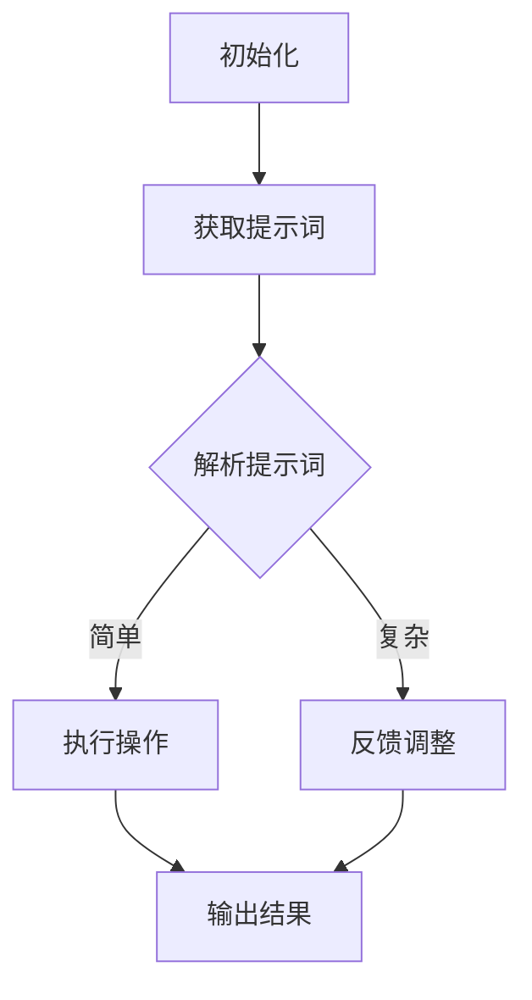
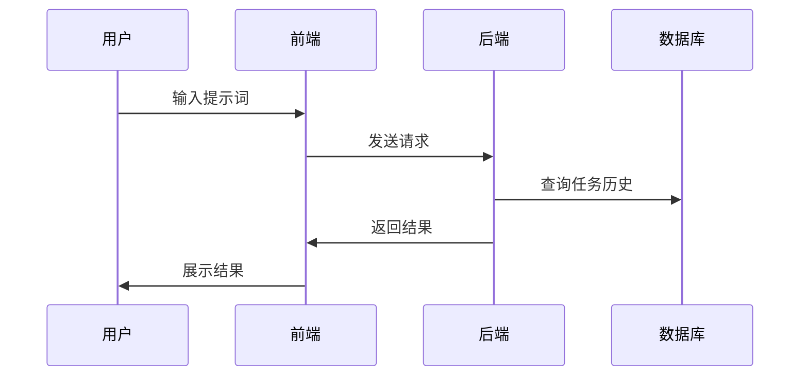

                 

### 文章标题

# 《提示词编程的认知负荷优化策略》

### 关键词

- 提示词编程
- 认知负荷
- 优化策略
- 算法原理
- 系统架构设计

### 摘要

本文旨在深入探讨提示词编程中的认知负荷问题，并介绍一系列优化策略。我们将首先定义相关概念，然后逐步分析问题背景和核心概念之间的联系。接下来，本文将详细讲解相关算法原理，通过Python代码和数学模型进行实例化说明。随后，我们将设计一个系统架构，展示其在实际项目中的应用。最后，本文将总结最佳实践，并提供扩展阅读建议。

## 第一部分：背景与基础

### 第1章：认知负荷与提示词编程概述

#### 1.1 认知负荷的定义与影响因素

认知负荷是指个体在处理信息过程中所需的认知资源总量。这些资源包括注意力、记忆、推理等。认知负荷的影响因素包括信息复杂度、任务难度、工作环境等。

#### 1.2 提示词编程的基本概念

提示词编程（Prompt Programming）是一种通过提示词引导程序执行的方法。提示词是用户或系统提供的引导信息，用于指导程序执行特定任务。

#### 1.3 认知负荷优化策略的背景

在提示词编程中，用户需要理解提示词的语义，并将其转化为程序执行的具体操作。这一过程往往会带来较高的认知负荷。因此，优化认知负荷成为提升编程效率的关键。

### 第2章：核心概念与联系

#### 2.1 核心概念

- **提示词**：用于引导程序执行的关键信息。
- **认知模型**：描述人脑处理信息的方式和机制。
- **优化策略**：用于降低认知负荷的方法和手段。

#### 2.2 概念联系

提示词编程中的认知模型可以帮助我们理解如何优化提示词的设计，从而降低用户的认知负荷。优化策略包括简化提示词语义、提供清晰的反馈等。

## 第二部分：算法原理与实现

### 第3章：算法原理讲解

#### 3.1 算法原理概述

本文将介绍的优化策略主要包括以下三个方面：

1. **提示词语义简化**：通过减少提示词的复杂性，降低用户的认知负荷。
2. **反馈机制优化**：提供实时反馈，帮助用户理解程序的执行过程。
3. **人机交互优化**：改善用户界面，使提示词编程更加直观易用。

#### 3.2 算法流程图

以下是一个简化的提示词编程算法流程图：



#### 3.3 Python代码实现

以下是一个简单的Python代码示例，用于实现提示词编程的基本流程：

```python
def process_prompt(prompt):
    # 解析提示词
    operation = prompt.split()[0]
    # 执行操作
    if operation == "add":
        return 1 + 1
    elif operation == "subtract":
        return 1 - 1
    # 输出结果
    return "结果：{}".format(result)
```

#### 3.4 数学模型与公式

以下是一个简单的数学模型，用于描述提示词编程的优化过程：

$$
\text{认知负荷} = f(\text{提示词复杂度}, \text{反馈频率}, \text{人机交互效率})
$$

其中，$f$ 是一个复合函数，用于描述认知负荷与各因素之间的关系。

## 第三部分：系统分析与架构设计

### 第4章：系统功能设计

#### 4.1 问题场景介绍

假设我们正在开发一个基于提示词编程的智能助手系统，用户可以通过输入简单的提示词来完成任务。

#### 4.2 系统功能设计

系统的主要功能包括：

1. **提示词解析**：解析用户输入的提示词，识别操作类型。
2. **任务执行**：根据提示词执行相应的操作。
3. **实时反馈**：在任务执行过程中，为用户提供实时反馈。

### 第5章：系统架构设计

系统架构包括以下部分：

1. **前端界面**：用于接收用户输入和展示结果。
2. **后端服务器**：处理用户请求，执行任务，并生成反馈。
3. **数据库**：存储用户信息和任务历史。

### 第6章：系统交互设计

系统交互流程如下：

1. **用户输入提示词**。
2. **前端发送请求**。
3. **后端解析提示词，执行任务**。
4. **后端生成反馈**。
5. **前端展示反馈**。

以下是一个简化的系统交互序列图：



## 第四部分：项目实战

### 第7章：环境安装与配置

在本章节中，我们将介绍如何搭建一个基本的提示词编程环境，包括安装必要的软件和配置系统参数。

### 第8章：核心实现与代码解析

在本章节中，我们将详细解析系统核心实现部分的源代码，包括提示词解析、任务执行和实时反馈等。

### 第9章：案例分析

我们将通过几个实际案例，展示如何应用提示词编程的认知负荷优化策略，并对其进行详细分析。

### 第10章：项目小结

在本章节中，我们将总结项目的实践经验，并提出改进建议。

## 第五部分：最佳实践与总结

### 第11章：最佳实践

在本章节中，我们将分享一些最佳实践，包括优化提示词设计、提高反馈频率和改善人机交互体验等。

### 第12章：总结与展望

在本章节中，我们将总结全文内容，并对提示词编程的认知负荷优化策略的未来发展进行展望。

### 作者

- 作者：AI天才研究院/AI Genius Institute & 禅与计算机程序设计艺术 /Zen And The Art of Computer Programming

在接下来的章节中，我们将逐步深入讨论每个部分的内容，确保文章的完整性和专业性。

