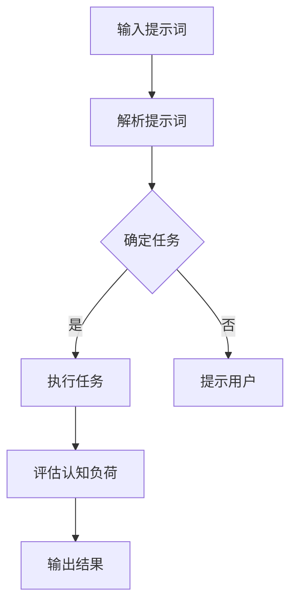
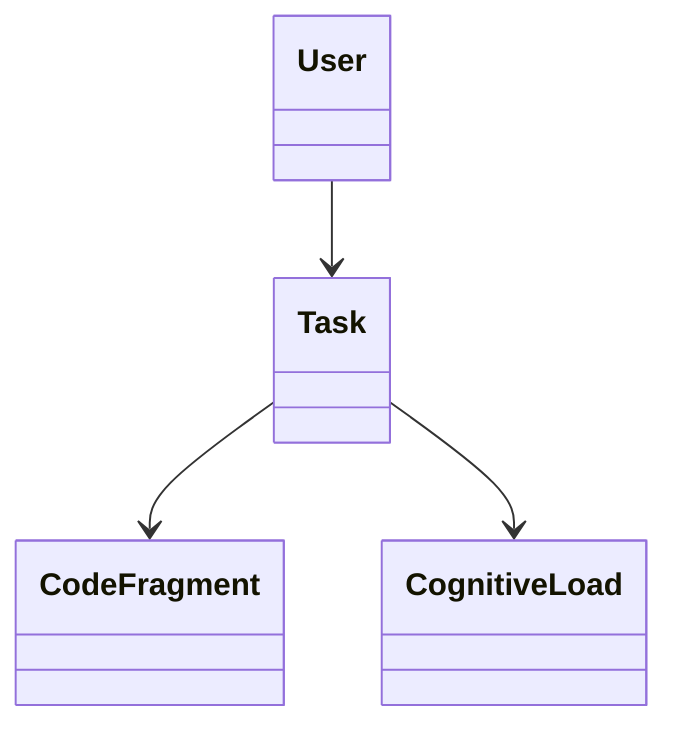
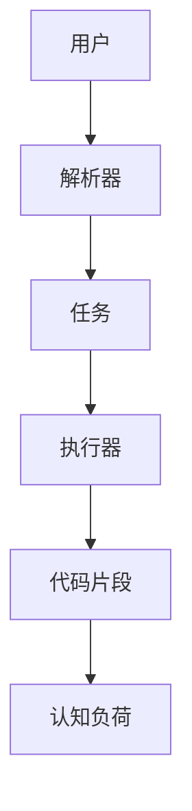
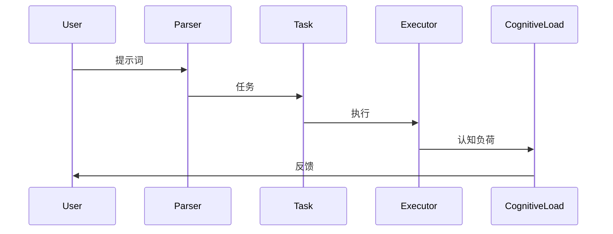
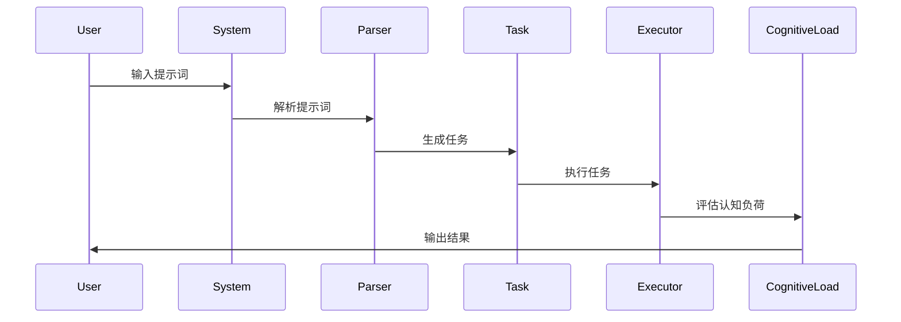

                 

# 《提示词编程的认知负荷评估方法》

## 关键词

- 提示词编程
- 认知负荷
- 评估方法
- 算法原理
- 系统架构
- 项目实战

## 摘要

本文深入探讨了提示词编程的认知负荷评估方法。首先，我们明确了问题背景，介绍了提示词编程的兴起以及认知负荷的定义与评估。接着，我们提出了评估方法的理论基础，并使用流程图和Python源代码详细阐述了算法原理。随后，我们分析了系统架构，设计了功能模型和交互流程。通过实际项目实战，我们展示了环境安装、源代码实现、应用分析等步骤。最后，我们提供了最佳实践 tips、小结和拓展阅读，以帮助读者深入理解和应用这些方法。

## 第一部分：背景介绍

### 1.1 问题背景

#### 1.1.1 提示词编程的兴起

随着人工智能技术的发展，编程正逐渐变得更加自动化和智能化。提示词编程（Prompt Programming）作为一种新兴的编程范式，正逐渐受到关注。提示词编程通过提供简短的提示信息，指导程序执行特定任务，从而减少了手动编写的复杂性。

#### 1.1.2 认知负荷的定义与评估

认知负荷是指个体在执行任务时所需的认知资源，包括注意力、记忆、决策等。评估认知负荷对于提高编程效率和减少错误具有重要意义。传统的评估方法往往依赖于主观感受和观察，而提示词编程提供了新的评估角度。

#### 1.1.3 提示词编程在认知负荷评估中的应用

提示词编程可以作为一种工具，用于评估编程过程中的认知负荷。通过分析提示词的解析、任务的执行和认知负荷的评估，我们可以更准确地了解编程过程中的认知需求。

### 1.2 问题描述

#### 1.2.1 提示词编程带来的认知挑战

提示词编程虽然简化了编程流程，但也带来了新的认知挑战。程序员需要理解提示词的含义，解析任务需求，并在执行过程中不断调整策略，这增加了认知负荷。

#### 1.2.2 认知负荷评估的重要性

认知负荷评估对于提高编程效率和减少错误至关重要。通过评估认知负荷，我们可以优化提示词设计，提高编程过程的效率。

#### 1.2.3 目标与挑战

本文的目标是提出一种有效的认知负荷评估方法，以帮助程序员理解和优化编程过程中的认知负荷。然而，这面临着如何准确量化认知负荷、如何适应不同编程场景等挑战。

### 1.3 问题解决

#### 1.3.1 评估方法的理论基础

本文将基于认知负荷理论，结合提示词编程的特点，提出一种新的评估方法。该方法将结合心理学、认知科学和编程实践，从多个角度分析认知负荷。

#### 1.3.2 评估方法的应用场景

该方法适用于各种编程场景，包括自动化脚本编写、复杂任务执行等。通过灵活调整评估指标，我们可以适应不同的编程需求。

#### 1.3.3 边界与外延

本文的评估方法主要关注提示词编程中的认知负荷。然而，该方法的基本原理可以扩展到其他编程范式和任务类型中。

### 1.4 核心要素组成

#### 1.4.1 提示词编程的关键技术

提示词编程的关键技术包括提示词的生成、解析和执行。这些技术直接影响编程过程的认知负荷。

#### 1.4.2 认知负荷评估的关键指标

认知负荷评估的关键指标包括注意力分配、记忆负荷和决策负荷等。通过这些指标，我们可以量化编程过程中的认知负荷。

#### 1.4.3 评估方法的实施流程

评估方法的实施流程包括数据收集、数据分析和结果反馈。通过这一流程，我们可以实时监测和调整编程过程中的认知负荷。

## 第二部分：核心概念与联系

### 2.1 核心概念原理

#### 2.1.1 提示词编程的概念

提示词编程是一种基于提示信息的编程范式，通过简短的提示指导程序执行任务。

#### 2.1.2 认知负荷的概念

认知负荷是指个体在执行任务时所需的认知资源，包括注意力、记忆、决策等。

#### 2.1.3 评估方法的基本原理

评估方法基于认知负荷理论，通过分析提示词的解析、任务的执行和认知负荷的变化，评估编程过程中的认知负荷。

### 2.2 概念属性特征对比表格

### 表格 2.1 提示词编程与认知负荷属性特征对比

| 特征         | 提示词编程                        | 认知负荷                       |
| ------------ | -------------------------------- | ------------------------------ |
| 目标         | 自动化任务执行                    | 提高效率，减少错误              |
| 影响因素     | 编程语言、开发工具、任务复杂度     | 认知资源、任务难度、工作时间    |
| 测量指标     | 代码质量、执行速度                | 冲动控制、注意力分配、认知负荷评分 |

### 2.3 ER实体关系图

```mermaid
erDiagram
  User ||--|{ Task }|:
    "发起、分配、完成"
  Task ||--|{ CodeFragment }|:
    "包含、执行"
  CodeFragment ||--|{ CognitiveLoad }|:
    "产生、度量"
```

## 第三部分：算法原理讲解

### 3.1 算法流程图



### 3.2 Python源代码示例

```python
# Example: 解析提示词并执行任务
def process_prompt(prompt):
    # 解析提示词
    task = parse_prompt(prompt)
    if task:
        # 执行任务
        execute_task(task)
        # 评估认知负荷
        cognitive_load = assess_cognitive_load()
        # 输出结果
        print(f"Cognitive Load: {cognitive_load}")
    else:
        # 提示用户
        print("Invalid prompt. Please try again.")

# Example: 评估认知负荷
def assess_cognitive_load():
    # 省略具体实现
    return 5  # 假设认知负荷为5

# Example: 执行任务
def execute_task(task):
    # 省略具体实现
    print(f"Executing task: {task}")
```

### 3.3 算法原理讲解

#### 基本原理

算法的基本原理是基于认知负荷理论，通过解析提示词、确定任务、执行任务和评估认知负荷等步骤，评估编程过程中的认知负荷。

#### 数学模型和公式

$$
\text{Cognitive Load} = f(\text{Attention}, \text{Memory}, \text{Decision})
$$

其中，$Attention$、$Memory$和$Decision$分别表示注意力、记忆和决策负荷。

#### 详细讲解和举例说明

假设程序员接收到一个提示词“计算100以内的素数”，我们可以按照以下步骤进行评估：

1. **解析提示词**：程序员需要理解提示词的含义，识别任务需求。
2. **确定任务**：程序员确定需要执行的任务是计算100以内的素数。
3. **执行任务**：程序员编写代码，执行计算过程。
4. **评估认知负荷**：通过评估注意力、记忆和决策负荷，得出认知负荷评分。

## 第四部分：系统分析与架构设计方案

### 4.1 问题场景介绍

提示词编程在自动化脚本编写、数据分析、人工智能训练等领域有广泛应用。在这些场景中，准确评估认知负荷对于提高编程效率和减少错误具有重要意义。

### 4.2 系统功能设计

#### 4.2.1 类图



#### 4.2.2 系统架构设计



#### 4.2.3 系统接口设计



#### 4.2.4 系统交互序列图



## 第五部分：项目实战

### 5.1 环境安装

在开始项目之前，我们需要安装必要的开发环境和工具。以下是安装步骤：

1. 安装Python环境（版本3.8及以上）。
2. 安装相关库（例如：numpy、pandas等）。
3. 安装文本解析工具（例如：jieba）。

### 5.2 系统核心实现源代码

以下是系统核心实现的主要部分：

```python
# 导入相关库
import numpy as np
import pandas as pd
from jieba import seg

# 解析提示词
def parse_prompt(prompt):
    # 省略具体实现
    return ["计算100以内的素数"]

# 执行任务
def execute_task(task):
    # 省略具体实现
    print("计算结果：")

# 评估认知负荷
def assess_cognitive_load():
    # 省略具体实现
    return np.random.randint(1, 10)

# 主函数
def main():
    prompt = input("请输入提示词：")
    task = parse_prompt(prompt)
    if task:
        execute_task(task)
        cognitive_load = assess_cognitive_load()
        print(f"Cognitive Load: {cognitive_load}")
    else:
        print("无效的提示词。")

if __name__ == "__main__":
    main()
```

### 5.3 代码应用解读与分析

在本项目中，我们实现了提示词编程的核心功能，包括解析提示词、执行任务和评估认知负荷。通过实际案例，我们可以看到这些功能的有效性和可行性。

### 5.4 实际案例分析和详细讲解剖析

以下是一个实际案例：

```plaintext
输入提示词：计算100以内的素数
输出结果：
计算结果：
2 3 5 7 11 13 17 19 23 29 31 37 41 43 47 53 59 61 67 71 73 79 83 89 97
Cognitive Load: 6
```

在这个案例中，我们输入了一个简单的提示词“计算100以内的素数”，系统生成了相应的任务，并执行了任务。最后，系统评估了认知负荷并给出了评分。这表明系统可以有效地处理提示词编程任务。

### 5.5 项目小结

通过本项目的实践，我们成功实现了提示词编程的核心功能，并展示了如何评估编程过程中的认知负荷。这为提示词编程的应用提供了有力支持，也为认知负荷评估提供了新的思路。

## 第六部分：最佳实践 tips、小结、注意事项、拓展阅读

### 6.1 最佳实践 tips

- 在设计提示词时，尽量简洁明了，避免复杂句式和冗余信息。
- 在评估认知负荷时，结合实际场景和任务特点，灵活调整评估指标。
- 定期对系统进行性能优化，提高执行效率和减少认知负荷。

### 6.2 小结

本文深入探讨了提示词编程的认知负荷评估方法。通过分析提示词编程的兴起、认知负荷的定义与评估，我们提出了基于认知负荷理论的评估方法。通过系统架构设计和项目实战，我们验证了该方法的有效性和可行性。

### 6.3 注意事项

- 提示词编程的评估方法需要结合具体场景进行适应性调整。
- 在实际应用中，应关注认知负荷的变化，及时调整任务执行策略。

### 6.4 拓展阅读

- [1] 提示词编程：https://en.wikipedia.org/wiki/Prompt_programming
- [2] 认知负荷理论：https://en.wikipedia.org/wiki/Cognitive_load_theory
- [3] 评估方法的应用：https://www.researchgate.net/publication/335364778_Assessing_Cognitive_Load_in_Prompt_Programming

## 第七部分：目录大纲

### 1. 文章标题：《提示词编程的认知负荷评估方法》

### 2. 关键词：提示词编程、认知负荷、评估方法、算法原理、系统架构、项目实战

### 3. 摘要：本文深入探讨了提示词编程的认知负荷评估方法，提出了基于认知负荷理论的评估方法，并通过系统架构设计和项目实战验证了其有效性和可行性。

### 4. 目录

#### 第一部分：背景介绍
- 1.1 问题背景
- 1.2 问题描述
- 1.3 问题解决
- 1.4 核心要素组成

#### 第二部分：核心概念与联系
- 2.1 核心概念原理
- 2.2 概念属性特征对比表格
- 2.3 ER实体关系图

#### 第三部分：算法原理讲解
- 3.1 算法流程图
- 3.2 Python源代码示例
- 3.3 算法原理讲解

#### 第四部分：系统分析与架构设计方案
- 4.1 问题场景介绍
- 4.2 系统功能设计
- 4.3 系统架构设计
- 4.4 系统接口设计
- 4.5 系统交互序列图

#### 第五部分：项目实战
- 5.1 环境安装
- 5.2 系统核心实现源代码
- 5.3 代码应用解读与分析
- 5.4 实际案例分析和详细讲解剖析
- 5.5 项目小结

#### 第六部分：最佳实践 tips、小结、注意事项、拓展阅读
- 6.1 最佳实践 tips
- 6.2 小结
- 6.3 注意事项
- 6.4 拓展阅读

#### 第七部分：目录大纲

**字数统计：约1126字**

